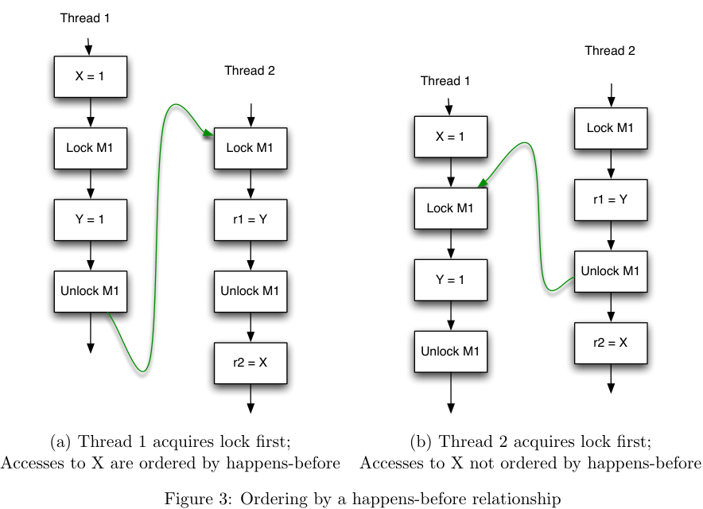
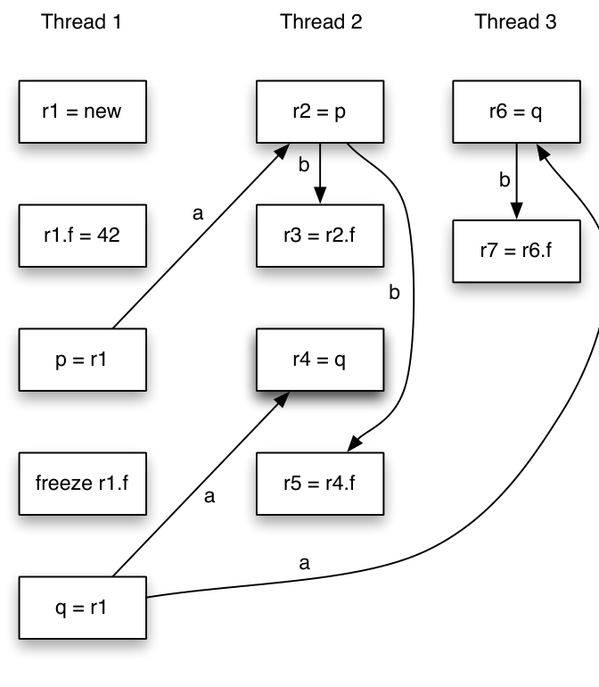
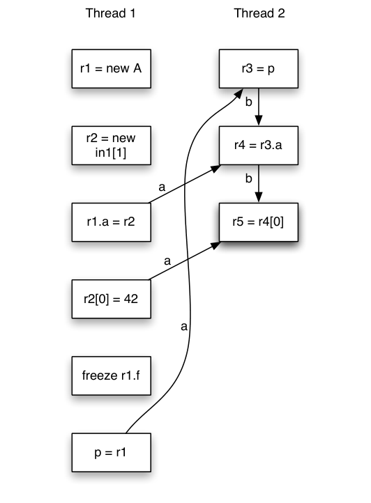
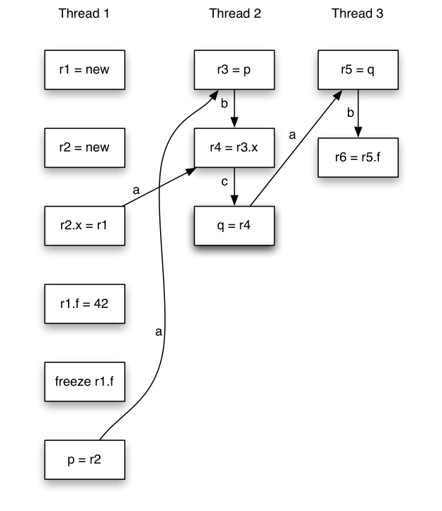

# JSR-133: JavaTM Memory Model and Thread Specification

<!-- Page 1 -->

```text
                            August 24, 2004, 4:42pm


   This document is the JSR-133 specification, the JavaTM Memory Model and Thread Specification
(JMM), as developed by the JSR-133 expert group.  This specification is part of the JSR-176
umbrella for the Tiger (5.0) release of the JavaTM platform, and the normative contents of this
specification will be incorporated into The JavaTM Language Specification (JLS), The JavaTM
Virtual Machine Specification (JVMS), and the specification for classes in the java.lang package.
This JSR-133 specification will not be further maintained or changed through the JCP. All future
updates, corrections and clarifications to the normative text will occur in those other documents.
   The normative contents of this specification are contained in Sections 5, 7, 9.2, 9.3, 11, 12,
14, 15 and 16. The other sections, as well as portions of the above mentioned sections, contain
non-normative text that is intended to explain and clarify the normative text. In case of a conflict
between the normative text and the non-normative text, the normative text stands.
   The discussion and development of this specification has been unusually detailed and technical,
involving insights and advances in a number of academic topics. This discussion is archived (and
continues) at the JMM web site. The web site provides additional information that may help in
understanding how this specification was arrived at; it is located at
                  http://www.cs.umd.edu/~pugh/java/memoryModel
   That web site and mailing list will continue to be updated and maintained, and further updates
and expansion of non-normative text intended to help people understand the JSR-133 specification
will be available from that web site.
  Two changes from the original specification in the JLS are most likely to require that JVMTM
implementations be changed:

   • The semantics of volatile variables have been strengthened to have acquire and release se-
     mantics. In the original specification, accesses to volatile and non-volatile variables could be
      freely ordered.

   • The semantics of final fields have been strengthened to allow for thread-safe immutatability
     without explicit synchronization. This may require steps such as store-store barriers at the
     end of constructors in which final fields are set.
```

<!-- Page 2 -->

## Contents

```text
1  Introduction                                                            5
    1.1  Locks   .  .  .  .  .  .  .  .  .  .  .  .  .  .  .  .  .  .  .  .  .  .  .  .  .  .  .  .  .  .  .  .  .  .  .  .  .  .  .  .  .  .  .  .   5
    1.2  Notation in Examples   .  .  .  .  .  .  .  .  .  .  .  .  .  .  .  .  .  .  .  .  .  .  .  .  .  .  .  .  .  .  .  .  .  .  .   5

2  Incorrectly Synchronized Programs Exhibit Surprising Behaviors              6

3  Informal Semantics                                                      7
    3.1  Sequential Consistency .  .  .  .  .  .  .  .  .  .  .  .  .  .  .  .  .  .  .  .  .  .  .  .  .  .  .  .  .  .  .  .  .  .  .   9
    3.2  Final Fields  .  .  .  .  .  .  .  .  .  .  .  .  .  .  .  .  .  .  .  .  .  .  .  .  .  .  .  .  .  .  .  .  .  .  .  .  .  .  .  .  .   9

4 What is a Memory Model?                                              11

5  Definitions                                                             11

6  Approximations to a Java Memory Model                                 13
    6.1  Sequential Consistency Memory Model .  .  .  .  .  .  .  .  .  .  .  .  .  .  .  .  .  .  .  .  .  .  .  .  .  .  13
    6.2  Happens-Before Memory Model  .  .  .  .  .  .  .  .  .  .  .  .  .  .  .  .  .  .  .  .  .  .  .  .  .  .  .  .  .  .  14
    6.3  Causality   .  .  .  .  .  .  .  .  .  .  .  .  .  .  .  .  .  .  .  .  .  .  .  .  .  .  .  .  .  .  .  .  .  .  .  .  .  .  .  .  .  .  14
         6.3.1  Happens-Before is too Weak .  .  .  .  .  .  .  .  .  .  .  .  .  .  .  .  .  .  .  .  .  .  .  .  .  .  .  .  14
         6.3.2   Causality is Subtle  .  .  .  .  .  .  .  .  .  .  .  .  .  .  .  .  .  .  .  .  .  .  .  .  .  .  .  .  .  .  .  .  .  15
         6.3.3  An Approach to Causality .  .  .  .  .  .  .  .  .  .  .  .  .  .  .  .  .  .  .  .  .  .  .  .  .  .  .  .  .  16

7  Formal Specification of the Java Memory Model                            17
    7.1  Actions and Executions   .  .  .  .  .  .  .  .  .  .  .  .  .  .  .  .  .  .  .  .  .  .  .  .  .  .  .  .  .  .  .  .  .  .  17
    7.2  Definitions .  .  .  .  .  .  .  .  .  .  .  .  .  .  .  .  .  .  .  .  .  .  .  .  .  .  .  .  .  .  .  .  .  .  .  .  .  .  .  .  .  .  18
    7.3  Well-Formed Executions  .  .  .  .  .  .  .  .  .  .  .  .  .  .  .  .  .  .  .  .  .  .  .  .  .  .  .  .  .  .  .  .  .  .  18
    7.4  Causality Requirements for Executions .  .  .  .  .  .  .  .  .  .  .  .  .  .  .  .  .  .  .  .  .  .  .  .  .  .  19
    7.5  Observable Behavior and Nonterminating Executions .  .  .  .  .  .  .  .  .  .  .  .  .  .  .  .  .  .  20

8  Illustrative Test Cases and Behaviors                                     21
    8.1  Surprising Behaviors Allowed by the Memory Model  .  .  .  .  .  .  .  .  .  .  .  .  .  .  .  .  .  .  22
    8.2  Behaviors Prohibited by the Memory Model  .  .  .  .  .  .  .  .  .  .  .  .  .  .  .  .  .  .  .  .  .  .  .  24

9  Final Field Semantics                                                   25
    9.1  Goals and Requirements for Final Field Semantics   .  .  .  .  .  .  .  .  .  .  .  .  .  .  .  .  .  .  .  25
         9.1.1  Post-Construction Modification of Final Fields   .  .  .  .  .  .  .  .  .  .  .  .  .  .  .  .  .  26
    9.2  Formal Semantics of Final Fields  .  .  .  .  .  .  .  .  .  .  .  .  .  .  .  .  .  .  .  .  .  .  .  .  .  .  .  .  .  27
         9.2.1   Final Field Safe Contexts   .  .  .  .  .  .  .  .  .  .  .  .  .  .  .  .  .  .  .  .  .  .  .  .  .  .  .  .  .  27
         9.2.2  Replacement and/or Supplemental Ordering Constraints .  .  .  .  .  .  .  .  .  .  .  .  27
         9.2.3   Static Final Fields   .  .  .  .  .  .  .  .  .  .  .  .  .  .  .  .  .  .  .  .  .  .  .  .  .  .  .  .  .  .  .  .  .  28
    9.3 JVM Rules For Final Field Use  .  .  .  .  .  .  .  .  .  .  .  .  .  .  .  .  .  .  .  .  .  .  .  .  .  .  .  .  .  .  28

10 Illustrative Test Cases and Behaviors of Final Fields                        29

11 Word Tearing                                                          32

12 Non-atomic Treatment of double and long                                 32
```

<!-- Page 3 -->

```text
13 Fairness                                                               35

14 Wait Sets and Notification                                               36
   14.1 Wait  .  .  .  .  .  .  .  .  .  .  .  .  .  .  .  .  .  .  .  .  .  .  .  .  .  .  .  .  .  .  .  .  .  .  .  .  .  .  .  .  .  .  .  .  .  36
   14.2 Notification  .  .  .  .  .  .  .  .  .  .  .  .  .  .  .  .  .  .  .  .  .  .  .  .  .  .  .  .  .  .  .  .  .  .  .  .  .  .  .  .  .  37
   14.3 Interruptions   .  .  .  .  .  .  .  .  .  .  .  .  .  .  .  .  .  .  .  .  .  .  .  .  .  .  .  .  .  .  .  .  .  .  .  .  .  .  .  .  37
   14.4 Interactions of Waits, Notification and Interruption .  .  .  .  .  .  .  .  .  .  .  .  .  .  .  .  .  .  .  38

15 Sleep and Yield                                                        38

16 Finalization                                                            39
   16.1 Implementing Finalization  .  .  .  .  .  .  .  .  .  .  .  .  .  .  .  .  .  .  .  .  .  .  .  .  .  .  .  .  .  .  .  .  .  40
   16.2 Interaction with the Memory Model   .  .  .  .  .  .  .  .  .  .  .  .  .  .  .  .  .  .  .  .  .  .  .  .  .  .  .  41
```

<!-- Page 4 -->

## List of Figures

```text
   1    Surprising results caused by statement reordering  .  .  .  .  .  .  .  .  .  .  .  .  .  .  .  .  .  .  .  .   6
   2    Surprising results caused by forward substitution  .  .  .  .  .  .  .  .  .  .  .  .  .  .  .  .  .  .  .  .   7
   3    Ordering by a happens-before relationship  .  .  .  .  .  .  .  .  .  .  .  .  .  .  .  .  .  .  .  .  .  .  .  .   8
   4   Example illustrating final field semantics .  .  .  .  .  .  .  .  .  .  .  .  .  .  .  .  .  .  .  .  .  .  .  .  .  10
   5   Without final fields or synchronization, it is possible for this code to print /usr  .  .  .  10
   6    Violations Allowed by the Happens-before memory model   .  .  .  .  .  .  .  .  .  .  .  .  .  .  .  15
   7   An unacceptable violation of causality  .  .  .  .  .  .  .  .  .  .  .  .  .  .  .  .  .  .  .  .  .  .  .  .  .  .  15
   8    Effects of Redundant Read Elimination   .  .  .  .  .  .  .  .  .  .  .  .  .  .  .  .  .  .  .  .  .  .  .  .  .  16
   9    Using Global Analysis   .  .  .  .  .  .  .  .  .  .  .  .  .  .  .  .  .  .  .  .  .  .  .  .  .  .  .  .  .  .  .  .  .  .  .  16
   10  A standard reordering   .  .  .  .  .  .  .  .  .  .  .  .  .  .  .  .  .  .  .  .  .  .  .  .  .  .  .  .  .  .  .  .  .  .  .  22
   11   Table of commit sets for Figure 10   .  .  .  .  .  .  .  .  .  .  .  .  .  .  .  .  .  .  .  .  .  .  .  .  .  .  .  .  22
   12  An unexpected reordering  .  .  .  .  .  .  .  .  .  .  .  .  .  .  .  .  .  .  .  .  .  .  .  .  .  .  .  .  .  .  .  .  .  22
   13   Effects of redundant read elimination .  .  .  .  .  .  .  .  .  .  .  .  .  .  .  .  .  .  .  .  .  .  .  .  .  .  .  23
   14   Writes can be performed early .  .  .  .  .  .  .  .  .  .  .  .  .  .  .  .  .  .  .  .  .  .  .  .  .  .  .  .  .  .  .  23
   15   Compilers can think hard about when actions are guaranteed to occur  .  .  .  .  .  .  .  .  24
   16  A complicated inference   .  .  .  .  .  .  .  .  .  .  .  .  .  .  .  .  .  .  .  .  .  .  .  .  .  .  .  .  .  .  .  .  .  .  24
   17  Can Threads 1 and 2 see 42, if Thread 4 didn’t write 42?   .  .  .  .  .  .  .  .  .  .  .  .  .  .  .  24
   18  Can Threads 1 and 2 see 42, if Thread 4 didn’t write to x?   .  .  .  .  .  .  .  .  .  .  .  .  .  .  25
   19  Example of reordering of final field reads and reflective change   .  .  .  .  .  .  .  .  .  .  .  .  26
   20   Final field example where reference to object is read twice  .  .  .  .  .  .  .  .  .  .  .  .  .  .  .  29
   21  Memory chains in an execution of Figure 20  .  .  .  .  .  .  .  .  .  .  .  .  .  .  .  .  .  .  .  .  .  .  .  30
   22   Transitive guarantees from final fields   .  .  .  .  .  .  .  .  .  .  .  .  .  .  .  .  .  .  .  .  .  .  .  .  .  .  30
   23  Memory chains in an execution of Figure 22  .  .  .  .  .  .  .  .  .  .  .  .  .  .  .  .  .  .  .  .  .  .  .  31
   24   Yet another final field example   .  .  .  .  .  .  .  .  .  .  .  .  .  .  .  .  .  .  .  .  .  .  .  .  .  .  .  .  .  .  32
   25  Memory chains in an execution of Figure 24  .  .  .  .  .  .  .  .  .  .  .  .  .  .  .  .  .  .  .  .  .  .  .  33
   26   Bytes must not be overwritten by writes to adjacent bytes  .  .  .  .  .  .  .  .  .  .  .  .  .  .  .  34
   27   Lack of fairness allows Thread 1 never to surrender the CPU   .  .  .  .  .  .  .  .  .  .  .  .  .  35
   28    If we observe print message, Thread 1 must see write to v and terminate .  .  .  .  .  .  .  35
```

<!-- Page 5 -->

## 1 Introduction

Java TM virtual machines support multiple threads of execution. Threads are represented by the Thread class. The only way for a user to create a thread is to create an object of this class; each thread is associated with such an object. A thread will start when the start() method is invoked on the corresponding Thread object. The behavior of threads, particularly when not correctly synchronized, can be confusing and counterintuitive. This specification describes the semantics of multithreaded programs written in the Java TM programming language; it includes rules for which values may be seen by a read of shared memory that is updated by multiple threads. As the specification is similar to the memory models for different hardware architectures, these semantics are referred to as the Java TM memory model. These semantics do not describe how a multithreaded program should be executed. Rather, they describe the behaviors that multithreaded programs are allowed to exhibit. Any execution strategy that generates only allowed behaviors is an acceptable execution strategy.

### 1.1 Locks

There are multiple mechanisms for communicating between threads. The most basic of these methods is synchronization, which is implemented using monitors. Each object is associated with a monitor, which a thread can lock or unlock. Only one thread at a time may hold a lock on a monitor. Any other threads attempting to lock that monitor are blocked until they can obtain a lock on that monitor. A thread t may lock a particular monitor multiple times; each unlock reverses the effect of one lock operation. The synchronized statement computes a reference to an object; it then attempts to perform a lock action on that object’s monitor and does not proceed further until the lock action has successfully completed. After the lock action has been performed, the body of the synchronized statement is executed. If execution of the body is ever completed, either normally or abruptly, an unlock action is automatically performed on that same monitor. A synchronized method automatically performs a lock action when it is invoked; its body is not executed until the lock action has successfully completed. If the method is an instance method, it locks the monitor associated with the instance for which it was invoked (that is, the object that will be known as this during execution of the body of the method). If the method is static, it locks the monitor associated with the Class object that represents the class in which the method is defined. If execution of the method’s body is ever completed, either normally or abruptly, an unlock action is automatically performed on that same monitor. The semantics neither prevents nor requires detection of deadlock conditions. Programs where threads hold (directly or indirectly) locks on multiple objects should use conventional techniques for deadlock avoidance, creating higher-level locking primitives that don’t deadlock, if necessary. Other mechanisms, such as reads and writes of volatile variables and classes provided in the java.util.concurrent package, provide alternative mechanisms for synchronization.

### 1.2 Notation in Examples

The Java memory model is not fundamentally based in the object oriented nature of the Java programming language. For conciseness and simplicity in our examples, we often exhibit code fragments without class or method definitions, or explicit dereferencing. Most examples consist of

<!-- Page 6 -->

```text
        Original code                       Valid compiler transformation
    Initially, A == B == 0                      Initially, A == B == 0
 Thread 1       Thread 2                        Thread 1   Thread 2
 1:   r2 = A;   3:  r1 = B                      B = 1;     r1 = B
 2:   B = 1;    4:  A = 2                       r2 = A;    A = 2
May observe r2 == 2, r1 == 1                May observe r2 == 2, r1 == 1
```

> Figure 1: Surprising results caused by statement reordering

two or more threads containing statements with access to local variables, shared global variables or instance fields of an object. We typically use variables names such as r1 or r2 to indicate variables local to a method or thread. Such variables are not accessible by other threads.

## 2 Incorrectly Synchronized Programs Exhibit Surprising Behaviors

The semantics of the Java programming language allow compilers and microprocessors to perform optimizations that can interact with incorrectly synchronized code in ways that can produce behaviors that seem paradoxical. Consider, for example, Figure 1. This program uses local variables r1 and r2 and shared variables A and B. It may appear that the result r2 == 2, r1 == 1 is impossible. Intuitively, either instruction 1 or instruction 3 should come first in an execution. If instruction 1 comes first, it should not be able to see the write at instruction 4. If instruction 3 comes first, it should not be able to see the write at instruction 2. If some execution exhibited this behavior, then we would know that instruction 4 came before instruction 1, which came before instruction 2, which came before instruction 3, which came before instruction 4. This is, on the face of it, absurd. However, compilers are allowed to reorder the instructions in either thread, when this does not affect the execution of that thread in isolation. If instruction 1 is reordered with instruction 2, then it is easy to see how the result r2 == 2 and r1 == 1 might occur. To some programmers, this behavior may seem “broken”. However, it should be noted that this code is improperly synchronized:

- there is a write in one thread,

- a read of the same variable by another thread,

- and the write and read are not ordered by synchronization.

When this occurs, it is called a data race. When code contains a data race, counterintuitive results are often possible. Several mechanisms can produce the reordering in Figure 1. The just-in-time compiler and the processor may rearrange code. In addition, the memory hierarchy of the architecture on which a virtual machine is run may make it appear as if code is being reordered. For the purposes of simplicity, we shall simply refer to anything that can reorder code as being a compiler. Source code to bytecode transformation can reorder and transform programs, but must do so only in the ways allowed by this specification. Another example of surprising results can be seen in Figure 2. This program is also incorrectly synchronized; it accesses shared memory without enforcing any ordering between those accesses.

<!-- Page 7 -->

```text
               Original code                       Valid compiler transformation
Initially: p == q, p.x == 0                 Initially: p == q, p.x == 0
 Thread 1     Thread 2                       Thread 1     Thread 2
 r1 = p;      r6 = p;                        r1 = p;      r6 = p;
 r2 = r1.x;   r6.x = 3                       r2 = r1.x;   r6.x = 3
 r3 = q;                                     r3 = q;
 r4 = r3.x;                                  r4 = r3.x;
 r5 = r1.x;                                  r5 = r2;
May observe r2 == r5 == 0, r4 == 3?         May observe r2 == r5 == 0, r4 == 3
```

> Figure 2: Surprising results caused by forward substitution

One common compiler optimization involves having the value read for r2 reused for r5: they are both reads of r1.x with no intervening write. Now consider the case where the assignment to r6.x in Thread 2 happens between the first read of r1.x and the read of r3.x in Thread 1. If the compiler decides to reuse the value of r2 for the r5, then r2 and r5 will have the value 0, and r4 will have the value 3. From the perspective of the programmer, the value stored at p.x has changed from 0 to 3 and then changed back. Although this behavior is surprising, it is permitted by most JVM implementations. However, it was forbidden by the original Java memory model in the JLS and JVMS: this was one of the first indications that the original JMM needed to be replaced.

## 3 Informal Semantics

A program must be correctly synchronized to avoid the kinds of counterintuitive behaviors that can be observed when code is reordered. The use of correct synchronization does not ensure that the overall behavior of a program is correct. However, its use does allow a programmer to reason about the possible behaviors of a program in a simple way; the behavior of a correctly synchronized program is much less dependent on possible reorderings. Without correct synchronization, very strange, confusing and counterintuitive behaviors are possible. There are two key ideas to understanding whether a program is correctly synchronized:

Conflicting Accesses Two accesses (reads of or writes to) the same shared field or array element are said to be conflicting if at least one of the accesses is a write.

Happens-Before Relationship Two actions can be ordered by a happens-before relationship. If one action happens-before another, then the first is visible to and ordered before the second. It should be stressed that a happens-before relationship between two actions does not imply that those actions must occur in that order in a Java platform implementation. The happens-before relation mostly stresses orderings between two actions that conflict with each other, and defines when data races take place. There are a number of ways to induce a happens-before ordering, including:

- Each action in a thread happens-before every subsequent action in that thread.

- An unlock on a monitor happens-before every subsequent lock on that monitor.

- A write to a volatile field happens-before every subsequent read of that volatile.

<!-- Page 8 -->



> Figure 3: Ordering by a happens-before relationship

- A call to start() on a thread happens-before any actions in the started thread.

- All actions in a thread happen-before any other thread successfully returns from a join() on that thread.

- If an action `a` happens-before an action `b`, and `b` happens-before an action `c`, then `a` happens-before `c`.

Happens-before is defined more thoroughly in Section 5. When a program contains two conflicting accesses that are not ordered by a happens-before relationship, it is said to contain a data race. A correctly synchronized program is one that has no data races (Section 3.1 contains a subtle but important clarification). A more subtle example of incorrectly synchronized code can be seen in Figure 3, which shows two different executions of the same program, both of which contain conflicting accesses to shared variables X and Y. The two threads in the program lock and unlock a monitor M1. In the execution shown in Figure 3a, there is a happens-before relationship between all pairs of conflicting accesses. However, in the execution shown in Figure 3b, there is no happens-before ordering between the conflicting accesses to X. Because of this, the program is not correctly synchronized. If a program is correctly synchronized, then all executions of the program will appear to be sequentially consistent. This is an extremely strong guarantee for programmers. Once programmers are able to determine that their code contains no data races, they do not need to worry that reorderings will affect them.

<!-- Page 9 -->

### 3.1 Sequential Consistency

Sequential consistency is a very strong guarantee that is made about visibility and ordering in an execution of a program. Within a sequentially consistent execution, there is a total order over all individual actions (such as reads and writes) which is consistent with the order of the program. Each individual action is atomic and is immediately visible to every thread. If a program has no data races, then all executions of the program will appear to be sequentially consistent. As noted before, sequential consistency and/or freedom from data races still allows errors arising from groups of operations that need to be perceived atomically and are not. If we were to use sequential consistency as our memory model, many of the compiler and processor optimizations that we have discussed would be illegal. For example, in Figure 2, as soon as the write of 3 to p.x occurred, subsequent reads of that location would be required to see that value. Having discussed sequential consistency, we can use it to provide an important clarification regarding data races and correctly synchronized programs. A data race occurs in an execution of a program if there are conflicting actions in that execution that are not ordered by synchronization. A program is correctly synchronized if and only if all sequentially consistent executions are free of data races. Programmers therefore only need to reason about sequentially consistent executions to determine if their programs are correctly synchronized. A fuller treatment of memory model issues for non-final fields is given in Sections 4–6.

### 3.2 Final Fields

Fields declared final are initialized once, but never changed under normal circumstances. The detailed semantics of final fields are somewhat different from those of normal fields. In particular, compilers have a great deal of freedom to move reads of final fields across synchronization barriers and calls to arbitrary or unknown methods. Correspondingly, compilers are allowed to keep the value of a final field cached in a register and not reload it from memory in situations where a non-final field would have to be reloaded. Final fields also allow programmers to implement thread-safe immutable objects without synchronization. A thread-safe immutable object is seen as immutable by all threads, even if a data race is used to pass references to the immutable object between threads. This can provide safety guarantees against misuse of an immutable class by incorrect or malicious code. Final fields must be used correctly to provide a guarantee of immutability. An object is considered to be completely initialized when its constructor finishes. A thread that can only see a reference to an object after that object has been completely initialized is guaranteed to see the correctly initialized values for that object’s final fields. The usage model for final fields is a simple one. Set the final fields for an object in that object’s constructor. Do not write a reference to the object being constructed in a place where another thread can see it before the object’s constructor is finished. If this is followed, then when the object is seen by another thread, that thread will always see the correctly constructed version of that object’s final fields. It will also see versions of any object or array referenced by those final fields that are at least as up-to-date as the final fields are. Figure 4 gives an example that demonstrates how final fields compare to normal fields. The class FinalFieldExample has a final int field x and a non-final int field y. One thread might execute the method writer(), and another might execute the method reader(). Because writer() writes f after the object’s constructor finishes, the reader() will be guaranteed to see the properly initialized value for f.x: it will read the value 3. However, f.y is not final; the reader() method is therefore

<!-- Page 10 -->

```java
class FinalFieldExample {
  final int x;
  int y;
  static FinalFieldExample f;
  public FinalFieldExample() {
    x = 3;
    y = 4;
  }
  static void writer() {
    f = new FinalFieldExample();
  }
  static void reader() {
    if (f != null) {
       int i = f.x; // guaranteed to see 3
       int j = f.y; // could see 0
    }
  }
}
```

> Figure 4: Example illustrating final field semantics

```text
Thread 1                                 Thread 2
Global.s = "/tmp/usr".substring(4);      String myS = Global.s;
                                         if (myS.equals("/tmp"))
                                           System.out.println(myS);
```

> Figure 5: Without final fields or synchronization, it is possible for this code to print /usr

not guaranteed to see the value 4 for it. Final fields are designed to allow for necessary security guarantees. Consider the code in Figure 5. String objects are intended to be immutable and string operations do not perform synchronization. While the String implementation does not have any data races, other code could have data races involving the use of Strings, and the memory model makes weak guarantees for programs that have data races. In particular, if the fields of the String class were not final, then it would be possible (although unlikely) that Thread 2 could initially see the default value of 0 for the offset of the string object, allowing it to compare as equal to "/tmp". A later operation on the String object might see the correct offset of 4, so that the String object is perceived as being "/usr". Many security features of the Java programming language depend upon Strings being perceived as truly immutable, even if malicious code is using data races to pass String references between threads. This is only an overview of the semantics of final fields. For a more detailed discussion, which includes several cases not mentioned here, consult Section 9.

<!-- Page 11 -->

## 4 What is a Memory Model?

A memory model describes, given a program and an execution trace of that program, whether the execution trace is a legal execution of the program. For the Java programming language, the memory model works by examining each read in an execution trace and checking that the write observed by that read is valid according to certain rules. The memory model describes possible behaviors of a program. An implementation is free to produce any code it likes, as long as all resulting executions of a program produce a result that can be predicted by the memory model. This provides a great deal of freedom to perform a myriad of code transformations, including the reordering of actions and removal of unnecessary synchronization. A high level, informal overview of the memory model shows it to be a set of rules for when writes by one thread are visible to another thread. Informally, a read r can usually see the value of any write w such that w does not happen-after r and w is not seen to be overwritten by another write w′ (from r’s perspective). When we use the term “read” in this memory model, we are only referring to actions that read fields or array elements. The semantics of other operations, such as reads of array lengths, executions of checked casts, and invocations of virtual methods, are not directly affected by data races. The JVM implementation is responsible for ensuring that a data race cannot cause incorrect behavior such as returning the wrong length for an array or having a virtual method invocation cause a segmentation fault. The memory semantics determine what values can be read at every point in the program. The actions of each thread in isolation must behave as governed by the semantics of that thread, with the exception that the values seen by each read are determined by the memory model. When we refer to this, we say that the program obeys intra-thread semantics.

## 5 Definitions

In this section we define in more detail some of the informal concepts we have presented.

Shared variables/Heap memory Memory that can be shared between threads is called shared or heap memory. All instance fields, static fields and array elements are stored in heap memory. We use the term variable to refer to both fields and array elements. Variables local to a method are never shared between threads and are unaffected by the memory model.

Inter-thread Actions An inter-thread action is an action performed by one thread that can be detected or directly influenced by another thread. Inter-thread actions include reads and writes of shared variables and synchronization actions, such as locking or unlocking a monitor, reading or writing a volatile variable, or starting a thread. Also included are actions that interact with the external world (external actions), and actions that cause a thread to go into an infinite loop (thread divergence actions). For more information on these actions, consult Section 7.1. We do not need to concern ourselves with intra-thread actions (e.g., adding two local variables and storing the result in a third local variable). As previously mentioned, the behavior of each thread in isolation needs to obey the correct intra-thread semantics. Every inter-thread action is associated with information about the execution of that action. All actions are associated with the thread in which they occur and the program order in which they occur within that thread. Additional information associated with an action include:

<!-- Page 12 -->

```text
 write  The variable written to and the value written.
  read  The variable read and the write seen (from this, we can de-
        termine the value seen).
  lock  The monitor which is locked.
unlock  The monitor which is unlocked.
```

For brevity’s sake, we usually refer to inter-thread actions as simply actions.

Program Order Among all the inter-thread actions performed by each thread t, the program order of t is a total order that reflects the order in which these actions would be performed according to the intra-thread semantics of t.

Intra-thread semantics Intra-thread semantics are the standard semantics for single threaded programs, and allow the complete prediction of the behavior of a thread based on the values seen by read actions within the thread. To determine if the actions of thread `t` in an execution are legal, we simply evaluate the implementation of thread `t` as it would be performed in a single threaded context, as defined in the rest of the JLS. Each time the evaluation of thread `t` generates an inter-thread action, it must match the inter-thread action `a` of `t` that comes next in program order. If `a` is a read, then further evaluation of `t` uses the value seen by `a` as determined by the memory model. Simply put, intra-thread semantics are what determine the execution of a thread in isolation; when values are read from the heap, they are determined by the memory model.

Synchronization Actions Synchronization actions include locks, unlocks, reads of and writes to volatile variables, actions that start a thread, and actions that detect that a thread is done. Any action that is the start or end-point of a synchronizes-with edge is a synchronization action. Such actions are listed in more detail below under happens-before edges.

Synchronization Order Every execution has a synchronization order. A synchronization order is a total order over all of the synchronization actions of an execution.

Happens-Before and Synchronizes-With Edges If we have two actions `x` and `y`, we use `x hb→ y` to mean that `x` happens-before `y`. If `x` and `y` are actions of the same thread and `x` comes before `y` in program order, then `x hb→ y`. Synchronization actions also induce happens-before edges. We call the resulting directed edges synchronized-with edges. They are defined as follows:

- An unlock action on monitor m synchronizes-with all subsequent lock actions on m (where subsequent is defined according to the synchronization order).

- A write to a volatile variable v synchronizes-with all subsequent reads of v by any thread (where subsequent is defined according to the synchronization order).

- An action that starts a thread synchronizes-with the first action in the thread it starts.

- The final action in a thread T1 synchronizes-with any action in another thread T2 that detects that T1 has terminated. T2 may accomplish this by calling T1.isAlive() or doing a join action on T1.

<!-- Page 13 -->

- If thread T1 interrupts thread T2, the interrupt by T1 synchronizes-with any point where any other thread (including T2) determines that T2 has been interrupted. This can be done by having an InterruptedException thrown or by invoking Thread.interrupted or Thread.isInterrupted.

- The write of the default value (zero, false or null) to each variable synchronizes-with to the first action in every thread.

Although it may seem a little strange to write a default value to a variable before the object containing the variable is allocated, conceptually every object is created at the start of the program with its default initialized values. Consequently, the default initialization of any object happens-before any other actions (other than default writes) of a program.

- At the invocation of a finalizer for an object, there is an implicit read of a reference to that object. There is a happens-before edge from the end of a constructor of an object to that read. Note that all freezes for this object (see Section 9.2) happen-before the starting point of this happens-before edge .

If an action `x` synchronizes-with a following action `y`, then we also have `x hb→ y`. Furthermore, happens-before is transitively closed. In other words, if `x hb→ y` and `y hb→ z`, then `x hb→ z`. It should be noted that the presence of a happens-before relationship between two actions does not necessarily imply that they have to take place in that order in an implementation. If the reordering produces results consistent with a legal execution, it is not illegal. For example, the write of a default value to every field of an object constructed by a thread need not happen before the beginning of that thread, as long as no read ever observes that fact. More specifically, if two actions share a happens-before relationship, they do not necessarily have to appear to have happened in that order to any code with which they do not share a happens-before relationship. Writes in one thread that are in a data race with reads in another thread may, for example, appear to occur out of order to those reads. The wait methods of class Object have lock and unlock actions associated with them; their happens-before relationships are defined by these associated actions. These methods are described further in Section 14.

## 6 Approximations to a Java Memory Model

In Section 3.1, we described sequential consistency. It is too strict for use as the Java memory model, because it forbids standard compiler and processor optimizations. This section reviews sequential consistency, and presents another model, called the happens-before memory model. This model is closer to fulfilling the needs of the Java memory model, but it is too weak; it allows unacceptable violations of causality. The problems with causality are described in Section 6.3. In Section 7, we present the Java memory model, a formal model that strengthens the happens-before memory model to provide adequate guarantees of causality.

### 6.1 Sequential Consistency Memory Model

Formally, in sequential consistency, all actions occur in a total order (the execution order) that is consistent with program order; furthermore, each read r of a variable v sees the value written by the write w to v such that:

- w comes before r in the execution order, and

<!-- Page 14 -->

- there is no other write w′ such that w comes before w′ and w′ comes before r in the execution order.

### 6.2 Happens-Before Memory Model

Before presenting the Java memory model in full, we will present a simpler memory model, called the happens-before memory model. This model involves several properties/requirements:

- There is a total order over all synchronization actions, known as the synchronization order. This order is consistent with program order and with mutual exclusion of locks.

- Synchronization actions induce synchronizes-with edges between matched actions, as described in Section 5.

- The transitive closure of the synchronizes-with edges and program order gives a partial order known as the happens-before order, as described in Section 5.

- The values that can be seen by a non-volatile read are determined by a rule known as happens-before consistency.

- The value seen by a volatile read are determined by a rule known as synchronization order consistency.

Happens-before consistency says that a read `r` of a variable `v` is allowed to observe a write `w` to `v` if, in the happens-before partial order of the execution trace:

- `r` is not ordered before `w` (i.e., it is not the case that `r hb→ w`), and
- there is no intervening write `w′` to `v` (i.e., no write `w′` to `v` such that `w hb→ w′ hb→ r`).

Synchronization order consistency says that each read r of a volatile variable v returns the last write to v to come before it in the synchronization order. For example, the behavior shown in Figure 1 is allowed by the happens-before memory model. There are no synchronizes-with or happens-before edges between threads, and each read is allowed to see the write by the other thread.

### 6.3 Causality

The happens-before memory model represents a necessary, but not sufficient, set of constraints. All behaviors allowed by the Java memory model are also allowed by the Happens-before memory model, but the happens-before memory model allows unacceptable behaviors – those that violate the requirements we have established. These can all be viewed as violations of causality in an unacceptable way. In this section, we talk about some of the ways in which the Happens-before model is unsatisfactory, and ways in which it can be tweaked to provide the necessary guarantees.

#### 6.3.1 Happens-Before is too Weak

The most significant weakness for the Happens-before model is that it allows values to appear “out of thin air”. This can be seen by a detailed examination of Figure 6. The code shown in Figure 6 is correctly synchronized. This may seem surprising, since it doesn’t perform any synchronization actions. Remember, however, that a program is correctly synchronized

<!-- Page 15 -->

```text
                     Initially, x == y == 0
                 Thread 1       Thread 2
                 r1 = x;        r2 = y;
                 if (r1 != 0)   if (r2 != 0)
                     y = 1;          x = 1;
Correctly synchronized, so r1 == r2 == 0 is the only legal behavior
```

> Figure 6: Violations Allowed by the Happens-before memory model

```text
                     Initially, x == y == 0
                     Thread 1   Thread 2
                     r1 = x;    r2 = y;
                     y = r1;    x = r2;
Incorrectly synchronized, but r1 == r2 == 42 must not be allowed
```

> Figure 7: An unacceptable violation of causality

if, when it is executed in a sequentially consistent manner, there are no data races. If this code is executed in a sequentially consistent way, each action will occur in program order, and neither of the writes will occur. Since no writes occur, there can be no data races: the program is correctly synchronized. Since this program is correctly synchronized, the only behaviors we can allow are sequentially consistent behaviors (by “sequentially consistent behaviors”, we mean any behavior that appears externally to have the same results as a sequentially consistent execution). However, there is an execution of this program that under the happens-before memory model in which r1 == r2 == 1. Just as before, since there are no synchronizes-with or happens-before edges, each read is allowed to see the write by the other thread. We refer to the issue of when a write can seem to occur before a read that it depends on as causality, because it involves the question of whether a write is causing itself to occur. In Figure 6. the reads cause the writes to occur, and the writes cause the reads see the values that they see. There is no “first cause” for the actions. Our memory model therefore needs an acceptable and consistent way of determining which such apparent causal loops are allowed. Even when a program is incorrectly synchronized, there are certain behaviors that violate causality in a way that is considered unacceptable. An example of this is given in Figure 7; the behavior r1 == r2 == 42 is allowed by the happens-before memory model, but unacceptable.

#### 6.3.2 Causality is Subtle

The notion of causality is not a simple one, as it is not simple to determine which actions cause others to occur. The Java memory model allows the behavior shown in Figure 8, even though that example also seems to involve a case of circular causality. This behavior must be allowed, because a compiler can

- eliminate the redundant read of a, replacing r2 = a with r2 = r1, then

- determine that the expression r1 == r2 is always true, eliminating the conditional branch 3, and finally

```text
• move the write 4:  b = 2 early.
```

<!-- Page 16 -->

```text
  Before compiler transformation            After compiler transformation
     Initially, a = 0, b = 1
                                               Initially, a = 0, b = 1
Thread 1             Thread 2
                                          Thread 1           Thread 2
1:  r1 = a;          5:  r3 = b;
                                          4:   b = 2;        5:  r3 = b;
2:  r2 = a;          6:  a = r3;
                                          1:   r1 = a;       6:  a = r3;
3:  if (r1 == r2)
                                          2:   r2 = r1;
4:     b = 2;
                                          3:   if (true) ;
                                         r1 == r2 == r3 == 2 is sequentially
Is r1 == r2 == r3 == 2 possible?
                                                      consistent
```

> Figure 8: Effects of Redundant Read Elimination

```text
       Initially, x = y = 0
Thread 1            Thread 2
1:  r1 = x;         4:  r3 = y;
2:  r2 = r1 | 1;    5:  x = r3;
3:  y = r2;
 Is r1 == r2 == r3 == 1 possible?
```

> Figure 9: Using Global Analysis

After the compiler does the redundant read elimination, the assignment 4: b = 2 is guaranteed to happen; the second read of a will always return the same value as the first. Thus, simple compiler optimizations can lead to an apparent causal loop. There must therefore be no causal relationship between the reads of a and the write to b, even though a cursory examination of the code might indicate that one exists. Note that intra-thread semantics and out-of-thin-air safety guarantee that if r1 ̸= r2, then Thread 1 will not write to b, and r3 == 1 . Figure 9 shows another example in which the compiler should be allowed to perform a global analysis that eliminates a relationship that appears at first glance to be causal. In order for r1 == r2 == r3 == 1, Thread 1 would seemingly need to write 1 to y before reading x. However, a compiler could use an inter-thread analysis to determine that the only possible values for x and y are 0 or 1. Knowing this, the compiler can determine that r2 is always 1. Thus, the write of 1 to y is not affected by the read of x and the write can be performed early.

#### 6.3.3 An Approach to Causality

The Java memory model takes as input a given execution, and a program, and determines whether that execution is a legal execution of the program. It does this by gradually building a set of “committed” actions that reflect which actions we know can be executed by the program without requiring a “causal loop”. Usually, the next action to be committed will reflect the next action that can be performed by a sequentially consistent execution. However, to reflect reads that see later in the program order of other threads writes, we allow some actions to be committed earlier than other actions that happen-before them. Obviously, some actions may be committed early and some may not. If, for example, one of the writes in Figure 6 were committed before the read of that variable, the read could see the write, and the “out-of-thin-air” result could occur. Informally, we allow an action to be committed early if we know that the action can occur without assuming some data race occurs. In Figure 6, we

<!-- Page 17 -->

cannot perform either write early, because the writes cannot occur unless the reads see the result of a data race. In Figure 8, on the other hand, we know that the write to b can happen regardless of whether a data race occurs.

## 7 Formal Specification of the Java Memory Model

This section provides the formal specification of the Java memory model (excluding final fields, which are described in Section 9).

```text
7.1  Actions and Executions

An action a is described by a tuple ⟨t, k, v, u⟩, comprising:

     t  - the thread performing the action

   k  - the kind of action:  volatile read, volatile write, (non-volatile) read, (non-volatile) write,
      lock, unlock, special synchronization action, external actions, and thread divergence actions.
      Volatile reads, volatile writes, locks and unlocks are synchronization actions, as are special
     synchronization actions such as starting a thread, the synthetic first or last action of a thread,
     and actions that detect that a thread has terminated, as described in Section 5.

   v  - the variable or monitor involved in the action

  u  - an arbitrary unique identifier for the action

An execution E is described by a tuple

                                                po  so       sw  hb
                                   ⟨P, A, →, →, W, V, →, →⟩

comprising:

  P  - a program

  A  - a set of actions

  po
 →   - program order, which for each thread t, is a total order over all actions performed by t in A

  so
 →   - synchronization order, which is a total order over all synchronization actions in A

 W  - a write-seen function, which for each read r in A, gives W(r), the write action seen by r in
     E.

  V  - a value-written function, which for each write w in A, gives V (w), the value written by w
      in E.

  sw
 →   - synchronizes-with, a partial order over synchronization actions.

  hb
 →   - happens-before, a partial order over actions

   Note that the synchronizes-with and happens-before are uniquely determined by the other
components of an execution and the rules for well-formed executions.
  Two of the action types require special descriptions, and are detailed further in Section 7.5.
These actions are introduced so that we can explain why such a thread may cause all other threads
to stall and fail to make progress.
```

<!-- Page 18 -->

```text
external actions  - An external action is an action that may be observable outside of an execution,
     and may have a result based on an environment external to the execution. An external action
      tuple contains an additional component, which contains the results of the external action as
      perceived by the thread performing the action. This may be information as to the success or
      failure of the action, and any values read by the action.

     Parameters to the external action (e.g., which bytes are written to which socket) are not part
      of the external action tuple. These parameters are set up by other actions within the thread
     and can be determined by examining the intra-thread semantics. They are not explicitly
      discussed in the memory model.

     In non-terminating executions, not all external actions are observable. Non-terminating exe-
      cutions and observable actions are discussed in Section 7.5.

thread divergence action  - A thread divergence action is only performed by a thread that is in
     an infinite loop in which no memory, synchronization or external actions are performed. If a
     thread performs a thread divergence action, that action is followed in program order by an
      infinite sequence of additional thread divergence actions.

7.2  Definitions

   1. Definition of synchronizes-with. Section 5 defines synchronizes-with edges. The source
      of a synchronizes-with edge is called a release, and the destination is called an acquire.

   2. Definition of happens-before. The happens-before order is given by the transitive closure
      of the synchronizes-with and program order orders. This is discussed in detail in Section 5.

   3. Definition of sufficient synchronization edges. A set of sufficient synchronization edges is suffi-
      cient if it is the minimal set such that you can take the transitive closure of those edges with
     program order edges, and determine all of the happens-before edges in the execution. This
      set is unique.

   4. Restrictions of partial orders and functions. We use f|d to denote the function given
     by restricting the domain of f to d: for all x ∈d, f(x) = f|d(x) and for all x ̸∈d, f|d(x) is
     undefined. Similarly, we use e→|d to represent the restriction of the partial order e→to the
     elements in d: for all x, y ∈d, x e→y if and only if x e→|d y. If either x ̸∈d or y ̸∈d, then it
       is not the case that x e→|d y.

7.3  Well-Formed Executions

                                                                                  po  so       sw  hb
We only consider well-formed executions. An execution E = ⟨P, A, →, →, W, V, →, →⟩is well
formed if the following conditions are true:

   1. Each read of a variable x sees a write to x.  All reads and writes of volatile
     variables are volatile actions. For all reads r ∈A, we have W(r) ∈A and W(r).v = r.v.
    The variable r.v is volatile if and only if r is a volatile read, and the variable w.v is volatile
         if and only if w is a volatile write.

   2. Synchronization order is consistent with program order and mutual exclusion.
     Having synchronization order is consistent with program order implies that the happens-
      before order, given by the transitive closure of synchronizes-with edges and program order, is
     a valid partial order: reflexive, transitive and antisymmetric. Having synchronization order
```

<!-- Page 19 -->

```text
      consistent with mutual exclusion means that on each monitor, the lock and unlock actions
      are correctly nested.

   3. The execution obeys intra-thread consistency. For each thread t, the actions performed
     by t in A are the same as would be generated by that thread in program-order in isolation,
     with each write w writing the value V (w), given that each read r sees / returns the value
    V (W(r)). Values seen by each read are determined by the memory model. The program order
     given must reflect the program order in which the actions would be performed according to
     the intrathread semantics of P, as specified by the parts of the JLS that do not deal with the
    memory model.

   4. The execution obeys synchronization-order consistency. Consider all volatile reads
                                             so
      r ∈A. It is not the case that r →W(r). Additionally, there must be no write w such that
                                so     so
     w.v = r.v and W(r) →w →r.

   5. The execution obeys happens-before consistency. Consider all reads r ∈A. It is not
                         hb
     the case that r →W(r). Additionally, there must be no write w such that w.v = r.v and
             hb     hb
    W(r) →w →r.

7.4  Causality Requirements for Executions

A well-formed execution
                                                    po  so       sw  hb
                    E = ⟨P, A, →, →, W, V, →, →⟩

is validated by committing actions from A.  If all of the actions in A can be committed, then the
execution satisfies the causality requirements of the Java memory model.
   Starting with the empty set as C0, we perform a sequence of steps where we take actions from
the set of actions A and add them to a set of committed actions Ci to get a new set of committed
actions Ci+1. To demonstrate that this is reasonable, for each Ci we need to demonstrate an
execution Ei containing Ci that meets certain conditions.
   Formally, an execution E satisfies the causality requirements of the Java memory model if and
only if there exist

   • Sets of actions C0, C1, . . . such that

      – C0 = ∅
      – Ci ⊂Ci+1
      – A = ∪(C0, C1, C2, . . .)

     such that E and (C0, C1, C2, . . .) obey the restrictions listed below.
    The sequence C0, C1, . . . may be finite, ending in a set Cn = A. However, if A is infinite,
     then the sequence C0, C1, . . . may be infinite, and it must be the case that the union of all
     elements of this infinite sequence is equal to A.

                                                                          poi  soi         swi hbi
   • Well-formed executions E1, . . . , where Ei = ⟨P, Ai, →, →, Wi, Vi, →, →⟩.

Given these sets of actions C0, . . . and executions E1, . . ., every action in Ci must be one of the ac-
tions in Ei. All actions in Ci must share the same relative happens-before order and synchronization
order in both Ei and E. Formally,

   1. Ci ⊆Ai
```

<!-- Page 20 -->

```text
       hbi        hb
   2. →|Ci = →|Ci

        soi        so
   3. →|Ci = →|Ci

The values written by the writes in Ci must be the same in both Ei and E. The reads in Ci−1 need
to see the same writes in Ei as in E (but not the reads in Ci −Ci−1) Formally,

   4. Vi|Ci = V |Ci

   5. Wi|Ci−1 = W|Ci−1

All reads in Ei that are not in Ci−1 must see writes that happen-before them. Each read r in
Ci −Ci−1 must see writes in Ci−1 in both Ei and E, but may see a different write in Ei from the
one it sees in E. Formally,

                                                               hbi
   6. For any read r ∈Ai −Ci−1, we have Wi(r) →r

   7. For any read r ∈Ci −Ci−1, we have Wi(r) ∈Ci−1 and W(r) ∈Ci−1

Given a set of sufficient synchronizes-with edges for Ei,  if there is a release-acquire pair that
happens-before an action in Ci −Ci−1, then that pair must be present in all Ej, where j ≥i.
Formally,

           sswi          swi                                                            hbi                 poi
   8. Let →  be the →  edges that are in the transitive reduction of →but not in →. We call
       sswi                                                            sswi    hbi
   →  the sufficient synchronizes-with edges for Ei. If x →  y →z and z ∈Ci −Ci−1, then
        swj
    x →y for all j ≥i.

If an action y is committed, all external actions that happen-before y are also committed.

                                                          hbi
   9. If y ∈Ci, x is an external action and x →y, then x ∈Ci.

7.5  Observable Behavior and Nonterminating Executions

For programs that always terminate in some bounded finite period of time, their behavior can be
understood (informally) simply in terms of their allowable executions. For programs that can fail
to terminate in a bounded amount of time, more subtle issues arise.
   The observable behavior of a program is defined by the finite sets of external actions that the
program may perform. A program that, for example, simply prints “Hello” forever is described by
a set of behaviors that for any non-negative integer i, includes the behavior of printing “Hello” i
times.
   Termination is not explicitly modeled as a behavior, but a program can easily be extended to
generate an additional external action “executionTermination” that occurs when all threads have
terminated.
  We also define a special hang action.  If a behavior is described by a set of external actions
including a hang action, it indicates a behavior where after the (non-hang) external actions are
observed, the program can run for an unbounded amount of time without performing any additional
external actions or terminating. Programs can hang:

   •  if all non-terminated threads are blocked, and at least one such blocked thread exists, or
```

<!-- Page 21 -->

```text
   •  if the program can perform an unbounded number of actions without performing any external
      actions.

A thread can be blocked in a variety of circumstances, such as when it is attempting to acquire a
lock or perform an external action (such as a read) that depends on an external data. If a thread is
in such a state, Thread.getState will return BLOCKED or WAITING. An execution may result in a
thread being blocked indefinitely and the execution not terminating. In such cases, the actions
generated by the blocked thread must consist of all actions generated by that thread up to and
including the action that caused the thread to be blocked indefinitely, and no actions that would be
generated by the thread after that action. To reason about observable behaviors, we need to talk
about sets of observable action. If O is a set of observable actions for E, then set O must be a
subset of A, and must contain only a finite number of actions, even if A contains an infinite number
of actions. Furthermore, if an action y ∈O, and either x hb →y or x so →y, then x ∈O. Note that
a set of observable actions is not restricted to containing external actions. Rather, only external
actions that are in a set of observable actions are deemed to be observable external actions. A
behavior B is an allowable behavior of a program P if and only if B is a finite set of external
actions and either

   • There exists an execution E of P, and a set O of observable actions for E, and B is the set of
     external actions in O (if any threads in E end in a blocked state and O contains all actions in
     E, then B may also contain a hang action), or

   • There exists a set O of actions such that

      – B consists of a hang action plus all the external actions in O and
      – for all K ≥|O|, there exists an execution E of P and a set of actions O′ such that:
          ∗Both O and O′ are subsets of A that fulfill the requirements for sets of observable
            actions.
          ∗O ⊆O′ ⊆A
          ∗|O′| ≥K
          ∗O′ −O contains no external actions

Note that a behavior B does not describe the order in which the external actions in B are observed,
but other (implicit and unstated) constraints on how the external actions are generated and
performed may impose such constraints.
```

## 8 Illustrative Test Cases and Behaviors

In this section, we give a number of examples of behaviors that are either allowed or prohibited by the Java memory model. Most of these are either examples that show violations of our informal notion of causality, and thus are prohibited, or examples that seem to be a violation of causality but can result from standard compiler optimizations, and are in fact allowed. As an example of how the memory model works, consider Figure 10. Note that there are initially two writes of the default values to x and y. We wish to get the result r1 == r2 == 1, which can be obtained if a compiler reorders the statements in Thread 1. The set of actions C0 is the empty set, and there is no execution E0.

<!-- Page 22 -->

```text
       Initially, x = y = 0
     Thread 1   Thread 2
     r1 = x;    r2 = y;
     y = 1;     x = r2;
r1 == r2 == 1 is a legal behavior
```

> Figure 10: A standard reordering

```text
         Final  First           First Sees
Action   Value  Committed In    Final Value In
x = 0    0      C1              E1
y = 0    0      C1              E1
y = 1    1      C1              E1
r2 = y   1      C2              E3
x = r2   1      C3              E3
r1 = x   1      C4              E
```

> Figure 11: Table of commit sets for Figure 10

Execution E1 will therefore be an execution where all reads see writes that happen-before them, as per rule 6. For this program, both reads must see the value 0 in E1. We first commit the initial writes of 0 to x and y as well as the write of 1 to y by Thread 1; these writes are contained in the set C1. We wish to add r2 = y seeing 1. C1 could not contain this action, regardless of what write it saw: neither write to y had been committed. C2 may contain this action; however, the read of y must return 0 in E2, because of rule 6. Execution E2 is therefore identical to E1. In E3, r2 = y can see any conflicting write that occurs in C2 which is happens-before consistent for it to see (by rule 7, and our happens-before consistency criterion). The write this read sees is the write of 1 to y in Thread 1, which was committed in C1. We commit one additional action in C3: a write of 1 to x by x = r2. C4 contains r1 = x, but it still sees 0 in E4, because of rule 6. In our final execution E, however, rule 7 allows r1 = x to see the write of 1 to x that was committed in C3. For a table showing when given actions are committed, consult Figure 11.

### 8.1 Surprising Behaviors Allowed by the Memory Model

Figure 12 shows a small but interesting example. The behavior r1 == 2 and r2 == 1 is a legal behavior, although it may be difficult to see how it could occur. A compiler would not reorder the statements in each thread; this code must never result in r1 == 1 or r2 == 2. However, the behavior r1 == 2 and r2 == 1 might be allowed by a processor architecture that performs the writes early, but in a way that they were not visible to local reads that came before them in

```text
            Initially, x = 0
        Thread 1   Thread 2
        r1 = x;    r2 = x;
        x = 1;     x = 2;
r1 == 2 and r2 == 1 is a legal behavior
```

> Figure 12: An unexpected reordering

<!-- Page 23 -->

```text
      Initially, a = 0, b = 1
Thread 1             Thread 2
1:  r1 = a;          5:  r3 = b;
2:  r2 = a;          6:  a = r3;
3:  if (r1 == r2)
4:     b = 2;
 Is r1 == r2 == r3 == 2 possible?
```

> Figure 13: Effects of redundant read elimination

```text
      Initially, a = b = 0
Thread 1        Thread 2
r1 = a;         r2 = b;
if (r1 == 1)    if (r2 == 1)
  b = 1;          a = 1;
                else
                  a = 1;
r1 == r2 == 1 is legal behavior
```

> Figure 14: Writes can be performed early

program order. This behavior, while surprising, is allowed by the Java memory model. To get this result in the memory model, we commit both writes followed by both reads. As was discussed in Section 6.3.2, the behavior shown in Figure 13 is allowed by simple compiler optimizations. To get this result under the model, we commit:

In C1: default writes and the write b = 2

In C2: the read r3 = b

In C3: the write a = r3, writing the value 2.

In C4: both reads of a

Another unusual example can be seen in Figure 14. This behavior would seem impossible, because Thread 2 should not be able to decide which assignment statement it will execute until after it has read b. However, the fact that r2 is 1 suggests that the write a = 1 was performed before the read r1 = a. This behavior can result from a compiler detecting that in every execution some statement will perform a = 1. Thus, the action may be performed early, even though we don’t know in advance which statement would have caused the action to occur. This may cause r1 to see 1, b to be written to by Thread 1, Thread 2 to see b == 1, and a to be written to in a different place from the one it was originally. The memory model gets the result in question by committing the write to a first. Figure 15 was also discussed in Section 6.3.2. To get the result r1 == r2 == r3 == 1, a compiler uses an inter-thread analysis to determine that the only possible values for x and y are 0 or 1. It then performs the write to y early. The memory model validates this execution in exactly the same way it validates the execution in Figure 10. Since the program writes the same value to y regardless of whether it reads 0 or 1 for x, the write is allowed to be committed before the read of x.

<!-- Page 24 -->

```text
         Initially, x == y == 0
   Thread 1           Thread 2
   1:  r1 = x;        4:   r3 = y;
   2:  r2 = r1 | 1;   5:   x = r3;
   3:  y = r2;
r1 == r2 == r3 == 1 is a legal behavior
```

> Figure 15: Compilers can think hard about when actions are guaranteed to occur

```text
       Initially, x == y == z == 0
       Thread 1       Thread 2
       r3 = x;        r2 = y;
       if (r3 == 0)   x = r2;
         x = 42;
       r1 = x;
       y = r1;
r1 == r2 == r3 == 42 is a legal behavior
```

> Figure 16: A complicated inference

Now consider the code in Figure 16. A compiler could determine that the only values ever assigned to x are 0 and 42. From that, the compiler could deduce that, at the point where we execute r1 = x, either we had just performed a write of 42 to x, or we had just read x and seen the value 42. In either case, it would be legal for a read of x to see the value 42. It could then change r1 = x to r1 = 42; this would allow y = r1 to be transformed to y = 42 and performed earlier, resulting in the behavior in question. In this case, the write to y is committed first.

### 8.2 Behaviors Prohibited by the Memory Model

The examples in Figures 17 and 18 are similar to the example in Figure 7, with one major distinction. In Figure 7, the value 42 could never be written to x in any sequentially consistent execution. In the examples in Figures 17 and 18, 42 is only sometimes written to x. Could it be legal for the reads in Threads 1 and 2 to see the value 42 even if Thread 4 does not write that value? Note that the major difference between these two examples is the fact that in Figure 17, the writes in Threads 1 and 2 are dependent on data flow from the reads, and in Figure 18, the writes are dependent on control flow from the reads. For these purposes, the Java memory model does not make a distinction between control and data dependence. This is a potential security issue; if 42 represents a reference to an object that Thread 4 controls, but does not want Threads 1 and 2 to see without Thread 4’s first seeing 1 for z, then Threads 1 and 2 can be said to manufacture the reference out of thin air. While the security implications of allowing these behaviors are uncertain, the JLS sides with the

```text
         Initially, x == y == z == 0
Thread 1   Thread 2   Thread 3   Thread 4
r1 = x;    r2 = y;    z = 42;    r0 = z;
y = r1;    x = r2;               x = r0;
 Is r0 == 0, r1 == r2 == 42 legal behavior?
```

> Figure 17: Can Threads 1 and 2 see 42, if Thread 4 didn’t write 42?

<!-- Page 25 -->

```text
               Initially, x == y == z == 0
Thread 1        Thread 2       Thread 3   Thread 4
r1 = x;         r2 = y;        z = 1;     r0 = z;
if (r1 != 0)    if (r2 != 0)              if (r0 == 1)
  y = r1;         x = r2;                   x = 42;
       Is r0 == 0, r1 == r2 == 42 legal behavior?
```

> Figure 18: Can Threads 1 and 2 see 42, if Thread 4 didn’t write to x?

principle of having safe, simple and unsurprising semantics when possible, and the Java memory model prohibits the behaviors shown in Figures 17 and 18.

## 9 Final Field Semantics

Final fields were discussed briefly in Section 3.2. Such fields are initialized once and not changed. The semantics both allow for aggressive compiler optimization of reads of such fields, and allow final fields to be used to guarantee thread safety for immutable objects without requiring synchronization.

### 9.1 Goals and Requirements for Final Field Semantics

Final field semantics are based around several competing goals:

- The value of a final field is not intended to change. The compiler should not have to reload a final field because a lock was obtained, a volatile variable was read, or an unknown method was invoked. In fact, the compiler is allowed to hoist reads within thread t of a final field f of an object X to immediately after the very first read of a reference to X by t; the thread never need reload that field.

- Objects that have only final fields and are not made visible to other threads during construction should be perceived as immutable even if references to those objects are passed between threads via data races.

```text
– Storing a reference to an object X into the heap during construction of X does not
  necessarily violate this requirement. For example, synchronization could ensure that no
  other thread could load the reference to X during construction. Alternatively, during
  construction of X, a reference to X could be stored into another object Y ; if no references
  to Y are made visible to other threads until after construction of X is complete, then
  final field guarantees still hold.
```

- Making a field f final should impose minimal compiler/architectural cost when reading f.

- The semantics must allow for situations such as deserialization, in which final fields of an object are modified after construction of the object is complete.

The final field semantics provide supplemental and alternative rules for determining which writes happen-before a read. For reads of a final instance field by a thread other than the thread that constructs it, only the orderings determined by these rules apply. For non-final fields, the rules supplement the normal rules. If a reference to an object is shared with other threads during the initial construction of an object, most of the guarantees for final fields of that object can go kerflooey; this includes cases in which other parts of a program continue to use the original value of this field.

<!-- Page 26 -->

```java
class A {
  final int x;
  A() {
    x = 1;
  }
  int f() {
    return d(this,this);
  }
  int d(A a1, A a2) {
    int i = a1.x;
    g(a1);
    int j = a2.x;
    return j i;
  }
  static void g(A a) {
    // uses reflection to change a.x to 2
  }
}
```

> Figure 19: Example of reordering of final field reads and reflective change

#### 9.1.1 Post-Construction Modification of Final Fields

In some cases (e.g., deserialization) the system will need to change the final fields of an object after construction. Final fields can be changed via reflection and other implementation dependent means. The only pattern in which this has reasonable semantics is one in which an object is constructed and then the final fields of the object are updated. The object should not be made visible to other threads, nor should the final fields be read, until all updates to the final fields of the object are complete. Freezes of a final field occur both at the end of the constructor in which the final field is set, and immediately after each modification of a final field via reflection or other special mechanism. Even then, there are a number of complications. If a final field is initialized to a compile-time constant in the field declaration, changes to the final field may not be observed, since uses of that final field are replaced at compile time with the compile-time constant. Static final fields can only be written during class initialization, and may not be modified by reflection. Another problem is that the semantics is designed to allow aggressive optimization of final fields. Within a thread, it is permissible to reorder reads of a final field with calls to methods that may change final fields via reflection. For example, consider the code fragment in Figure 19. In the d() method, the compiler is allowed to reorder the reads of x and the call to g() freely. Thus, A().f() could return -1, 0 or 1. To ensure that this problem cannot arise, an implementation may provide a way to execute a block of code in a final field safe context. If an object is constructed within a final field safe context, the reads of a final field of that object will not be reordered with modifications of that final field that occur within that final field safe context. For example, it might be desirable for a clone method or the ObjectInputStream.readObject method to be performed within a final field safe context. This would mean that if reflection was used to modify, post-construction a final field of an object constructed by such an method, the correct guarantees would exist. A final field safe context has additional protections. If a thread has seen an incorrectly published

<!-- Page 27 -->

```text
reference to an object (allowing that thread to see the default value of a final field) and then, within
a final field safe context, reads a properly published reference to the object, those reads will be
guaranteed to see the correct value of the final field.
   One place where use of a final field safe context would be appropriate is in an executor or
thread pool. By executing each Runnable in a separate final field safe context, the executor could
guarantee that incorrect access by one Runnable to a object o won’t remove final field guarantees
for other Runnables handled by the same executor.
   In an implementation, a compiler should not, in general, move an access to a final field into or
out of a final field safe context. Such accesses can be moved around the execution of such a context,
so long as the object is not constructed within that context.

9.2  Formal Semantics of Final Fields

The formal semantics for final instance fields are as follows. A freeze action on a final field f of
an object o takes place when a constructor for o in which f  is written exits, either abruptly or
normally.
   Reflection and other special mechanisms (such as deserialization) can be used to change final
fields after the constructor for the object completes. The setX(...) methods of the Field class in
java.lang.reflect may be used to this effect. If the underlying field is final, this method throws
an IllegalAccessException unless setAccessible(true) has succeeded for this field and the
field is non-static. If a final field is changed via such a special mechanism, a freeze of that field is
considered to occur immediately after the modification.


9.2.1  Final Field Safe Contexts

An implementation may provide a way to execute a block of code in a final field safe context. For
example, it might be possible to designate a method as executing in a final field safe context. The
scope of the final field safe context would be the same as the scope of the method execution, and
parameters passed to the method would be parameters to the final field safe context.
   The actions performed within a final field safe context are immediately followed in program
order by a synthetic action marking the end of the final field safe context.
   The dereference chains and memory chains described in  Section 9.2.2 must satisfy the con-
straints described in that section whether or not actions executed in a final field safe context are
considered to occur in a separate thread. As far as determining whether normal happens-before
orderings are used in determining which writes can be seen by a read of a final field, as described
in Section 9.2.2, a final field safe context is always considered to be a separate thread.
   With one exception, final field safe contexts do not affect any part of the semantics other than
those described in Sections 9.2.1 - 9.2.2. For example, the actions in the final field safe context still
occur in program order with the actions outside the final field safe context. The exception is that
each finalizer takes place in a separate final field safe context.


9.2.2  Replacement and/or Supplemental Ordering Constraints

For each execution, the behavior of reads is influenced by two additional partial orders, dereference
        dcchain (→) and memory chain (mc→), which are considered to be part of the execution (and thus, fixed
for any particular execution). These partial orders must satisfy the following constraints (which
need not have a unique solution):
```

<!-- Page 28 -->

```text
   • Dereference Chain If an action a is a read or write of a field or element of an object o by
     a thread t that did not construct o and the address of o was not passed as a parameter to a
     final field safe context containing a, then there must exist some read r by thread t that sees
                                         dc
     the address of o such that r →a.

   • Memory Chain There are several constraints on the memory chain ordering:

                                                                  mc
       a) If r is a read that sees a write w, then it must be the case that w →r.

                                                      dc                               mc
        b) If r and a are actions such that r →a, then it must be the case that r →a.

        c) If w is a write of the address of an object o by a thread t that did not construct o and
          the address of o was not passed as a parameter to a final field safe context containing
            a, then there must exist some read r by thread t that sees the address of o such that
           mc
          r →w.

       d) If r is a read of a final instance field of an object constructed within a final field safe
                                                                             po
          context ending with the synthetic action a such that a →r, then it must be the case
               mc
          that a →r.

   With the addition of the semantics for final fields, we use a different set of ordering constraints
for determining which writes occur before a read, for purposes of determining which writes can be
seen by a read.
  We start with normal happens-before orderings, except in cases where the read is a read of
a final instance field and either the write occurs in a different thread from the read or the write
occurs via a special mechanism such as reflection.
   In addition, we use orderings derived from the use of final instance fields. Given a write w, a
freeze f, an action a (that is not a read of a final field), a read r1 of the final field frozen by f and
                          hb     hb   mc      dc
a read r2 such that w →f →a →r1 →r2, then when determining which values can be seen
                        hb                                                                    hb
by r2, we consider w →r2 (but these orderings do not transitively close with other →orderings).
                 dc
Note that the →order is reflexive, and r1 can be the same as r2. Note that these constraints can
arise regardless of whether r2 is a read of a final or non-final field.
  We use these orderings in the normal way to determine which writes can be seen by a read: a
read r can see a write w if r is ordered before w, and there is no intervening write w′ ordered after
w but before r.


9.2.3  Static Final Fields

The rules for class initialization ensure that any thread that reads a static field will be synchronized
with the static initialization of that class, which is the only place where static final fields can be
set. Thus, no special rules in the JMM are needed for static final fields.
    Static final fields may only be modified in the class initializer that defines them, with the ex-
ception of the java.lang.System.in, java.lang.System.out, and java.lang.System.err static
fields, which can be modified by the java.lang.System.setIn, java.lang.System.setOut, and
java.lang.System.setErr methods.

9.3 JVM Rules For Final Field Use

The original JVM specification rules concerning updates of final fields were ambiguous, unlike those
of the JLS. The specification for acceptable classfiles is clarified/changed by this specification to be
much closer to that of the JLS.
```

<!-- Page 29 -->

```text
                            f is a final field; its default value is 0
                      Thread 1        Thread 2          Thread 3
                      r1.f = 42;      r2 = p;           r6 = q;
                      p = r1;         r3 = r2.f;        r7 = r6.f;
                      freeze r1.f;    r4 = q;
                      q = r1;         if (r2 == r4)
                                          r5 = r4.f;
We assume r2, r4 and r6 do not see the value null. r3 and r5 can be 0 or 42, and r7 must be 42.
```

> Figure 20: Final field example where reference to object is read twice

A putfield instruction that updates a final field must occur in an <init> method of the class that declares the final field. Otherwise, an IllegalAccessError is thrown. A putstatic instruction that updates a final static field must occur in an <clinit> method of the class that declares the final static field. Otherwise, an IllegalAccessError is thrown.

## 10 Illustrative Test Cases and Behaviors of Final Fields

In order to determine if a read of a final field is guaranteed to see the initialized value of that field, you must determine that there is no way to construct a partial order `mc→` without providing the chain `f hb→ a mc→ r1` from the freeze `f` of that field to the read `r1` of that field. An example of where this can go wrong can be seen in Figure 20. An object `o` is constructed in Thread 1 and read by Threads 2 and 3. Dereference and memory chains for the read of `r4.f` in Thread 2 can pass through any reads by Thread 2 of a reference to `o`. On the chain that goes through the global variable `p`, there is no action that is ordered after the freeze operation. If this chain is used, the read of `r4.f` will not be correctly ordered with regards to the freeze operation. Therefore, `r5` is not guaranteed to see the correctly constructed value for the final field. The fact that `r5` does not get this guarantee reflects legal transformations by the compiler. A compiler can analyze this code and determine that `r2.f` and `r4.f` are reads of the same final field. Since final fields are not supposed to change, it could replace `r5 = r4.f` with `r5 = r3` in Thread 2. Formally, this is reflected by the dereference chain ordering `(r2 = p) dc→ (r5 = r4.f)`, but not ordering `(r4 = q) dc→ (r5 = r4.f)`. An alternate partial order, where the dereference chain does order `(r4 = q) dc→ (r5 = r4.f)`, is also valid. However, in order to get a guarantee that a final field read will see the correct value, you must ensure the proper ordering for all possible dereference and memory chains. In Thread 3, unlike Thread 2, all possible chains for the read of `r6.f` include the write to `q` in Thread 1. The read is therefore correctly ordered with respect to the freeze operation, and guaranteed to see the correct value. In general, if a read `R` of a final field `x` in thread `t2` is correctly ordered with respect to a freeze `F` in thread `t1` via memory chains, dereference chains, and happens-before, then the read is guaranteed to see the value of `x` set before the freeze `F`. Furthermore, any reads of elements of objects that were only reached in thread `t2` by following a reference loaded from `x` are guaranteed to occur after all writes `w` such that `w hb→ F`. Figures 22 and 23 show an example of the transitive guarantees provided by final fields. For this example, there is no dereference chain in Thread 2 that would permit the reads through `a` to

<!-- Page 30 -->



> Figure 21: Memory chains in an execution of Figure 20

```text
                                a is a final field of a class A
                            Thread 1            Thread 2
                            r1 = new A;         r3 = p;
                            r2 = new int[1];    r4 = r3.a;
                            r1.a = r2;          r5 = r4[0]
                            r2[0] = 42
                            freeze r1.a;
                            p = r1;
Assuming Thread 2 read of p sees the write by Thread 1, Thread 2 reads of r3.a and r4[0] are
                         guaranteed to see the writes to Thread 1.
```

> Figure 22: Transitive guarantees from final fields

<!-- Page 31 -->



> Figure 23: Memory chains in an execution of Figure 22

<!-- Page 32 -->

```text
                               f is a final field; x is non-final
                        Thread 1       Thread 2      Thread 3
                        r1 = new ;     r3 = p;       r5 = q;
                        r2 = new ;     r4 = r3.x;    r6 = r5.f;
                        r2.x = r1;     q = r4;
                        r1.f = 42;
                        freeze r1.f;
                        p = r2;
Assuming that Thread 2 sees the writes by Thread 1, and Thread 3’s read of q sees the write by
                           Thread 2, r6 is guaranteed to see 42.
```

> Figure 24: Yet another final field example

be traced back to an incorrect publication of p. Since the final field a must be read correctly, the program is not only guaranteed to see the correct value for a, but also guaranteed to see the correct value for contents of the array. Figures 24 and 25 show two interesting characteristics of one example. First, a reference to an object with a final field is stored (by r2.x = r1) into the heap before the final field is frozen. Since the object referenced by r2 isn’t reachable until the store p = r2, which comes after the freeze, the object is correctly published, and guarantees for its final fields apply. This example also shows the use of rule (c) for memory chains. The memory chain that guarantees that Thread 3 sees the correctly initialized value for f passes through Thread 2. In general, this allows for immutability to be guaranteed for an object regardless of which thread writes out the reference to that object.

## 11 Word Tearing

One implementation consideration for Java virtual machines is that every field and array element is considered distinct; updates to one field or element must not interact with reads or updates of any other field or element. In particular, two threads that update adjacent elements of a byte array separately must not interfere or interact and do not need synchronization to ensure sequential consistency. Some processors (notably early Alphas) do not provide the ability to write to a single byte. It would be illegal to implement byte array updates on such a processor by simply reading an entire word, updating the appropriate byte, and then writing the entire word back to memory. This problem is sometimes known as word tearing, and on processors that cannot easily update a single byte in isolation some other approach will be required. Figure 26 shows a test case to detect word tearing.

## 12 Non-atomic Treatment of double and long

Some Java TM implementations may find it convenient to divide a single write action on a 64-bit long or double value into two write actions on adjacent 32 bit values. For efficiency’s sake, this behavior is implementation specific; Java TM virtual machines are free to perform writes to long and double values atomically or in two parts. For the purposes of this memory model, a single write to a non-volatile long or double value is treated as two separate writes: one to each 32-bit half. This can result in a situation where a

<!-- Page 33 -->



> Figure 25: Memory chains in an execution of Figure 24

<!-- Page 34 -->

```java
public class WordTearing extends Thread {
    static final int LENGTH = 8;
    static final int ITERS = 1000000;
    static byte[] counts = new byte[LENGTH];
    static Thread[] threads = new Thread[LENGTH];
    final int id;
    WordTearing(int i) {
         id = i;
    }
    public void run() {
         byte v = 0;
         for (int i = 0; i < ITERS; i++) {
             byte v2 = counts[id];
             if (v != v2) {
                  System.err.println("Word-Tearing found: " + "counts[" + id
                          + "] = " + v2 + ", should be " + v);
                  return;
             }
             v++;
             counts[id] = v;
         }
    }
    public static void main(String[] args) {
         for (int i = 0; i < LENGTH; ++i)
             (threads[i] = new WordTearing(i)).start();
    }
}
```

> Figure 26: Bytes must not be overwritten by writes to adjacent bytes

<!-- Page 35 -->

```text
Thread 1                     Thread 2
while (true)                 synchronized (o) {
    synchronized (o) {           done = true;
         if (done) break;    }
       think
    }
```

> Figure 27: Lack of fairness allows Thread 1 never to surrender the CPU

```java
                    Initially, v is volatile and v = false
Thread 1                                  Thread 2
while (!v);                               v = true;
System.out.println("Thread 1 done");      System.out.println("Thread 2 done");
```

> Figure 28: If we observe print message, Thread 1 must see write to v and terminate

thread sees the first 32 bits of a 64 bit value from one write, and the second 32 bits from another write. Write and reads of volatile long and double values are always atomic. Writes to and reads of references are always atomic, regardless of whether they are implemented as 32 or 64 bit values. VM implementors are encouraged to avoid splitting their 64-bit values where possible. Programmers are encouraged to declare shared 64-bit values as volatile or synchronize their programs correctly to avoid possible complications.

## 13 Fairness

The JLS specification does not guarantee preemptive multithreading or any kind of fairness guarantee: there is no hard guarantee that any thread will surrender the CPU and allow other threads to be scheduled. The lack of such a guarantee is partially due to the fact that any such guarantee would be complicated by issues such as thread priorities and real-time threads (in Real-time Java virtual machine implementations). Most Java virtual machine implementations will provide some sort of fairness guarantee, but the details are implementation specific and are treated as a quality of service issue, rather than a rigid requirement. An example of how this issue can impact a program can be seen in Figure 27. Due to the lack of fairness, it is legal for the CPU running Thread 1 never to surrender the CPU to Thread 2: thus the program may never terminate. Since this behavior is legal, it is also legal for a compiler to hoist the synchronized block outside the while loop, which has the same effect. This is a legal but undesirable compiler transformation. In general, the compiler is allowed to perform lock coarsening (e.g., if the compiler sees two successive calls to synchronized methods on the same object, it doesn’t have to give up the lock between calls). The exact tradeoffs here are subtle, and improved performance needs to be balanced by the longer delays threads will suffer in trying to acquire a lock. However, there are some limitations on compiler transformations that reduce fairness. For example, in Figure 28, if we observe the print message from Thread 2, and no threads other than Threads 1 and 2 are running, then Thread 1 must see the write to v, print its message and terminate. This prevents the compiler from hoisting the volatile read of v out of the loop in Thread 1. The fact that Thread 1 must terminate if the print by Thread 2 is observed follows from

<!-- Page 36 -->

the rules on observable actions described in Section 7.5. If the print by Thread 2 is in a set of observable actions O, then the write to v and all reads of v that see the value 0 must also be in O. Additionally, the program cannot perform an unbounded amount of additional actions that are not in O. Therefore, the only observable behavior of this program in which the program hangs (runs forever without performing additional external actions) is one in which it performs no observable external actions other than hanging. This includes the print action.

## 14 Wait Sets and Notification

Every object, in addition to having an associated lock, has an associated wait set. A wait set is a set of threads. When an object is first created, its wait set is empty. Elementary actions that add threads to and remove threads from wait sets are atomic. Wait sets are manipulated solely through the methods Object.wait, Object.notify , and Object.notifyAll. Wait set manipulations can also be affected by the interruption status of a thread, and by the Thread class methods dealing with interruption. Additionally, Thread class methods for sleeping and joining other threads have properties derived from those of wait and notification actions.

### 14.1 Wait

Wait actions occur upon invocation of wait(), or the timed forms wait(long millisecs) and wait(long millisecs, int nanosecs). A call of wait(long millisecs) with a parameter of zero, or a call of wait(long millisecs, int nanosecs) with two zero parameters, is equivalent to an invocation of wait(). Let thread t be the thread executing the wait method on object m, and let n be the number of lock actions by t on m that have not been matched by unlock actions. One of the following actions occurs.

- An IllegalMonitorStateException is thrown if n is zero (i.e., thread t does not already possess the lock for target m).

- If this is a timed wait and the nanosecs argument is not in the range of 0-999999 or the millisecs argument is negative, an IllegalArgumentException is thrown.

- If thread t is interrupted, an InterruptedException is thrown and t’s interruption status is set to false.

- Otherwise, the following sequence occurs:

```text
1. Thread t is added to the wait set of object m, and performs n unlock actions on m.
2. Thread t does not execute any further instructions until it has been removed from m’s
   wait set. The thread may be removed from the wait set due to any one of the following
   actions, and will resume sometime afterward.
    – A notify action being performed on m in which t is selected for removal from the
       wait set.
    – A notifyAll action being performed on m.
    – An interrupt action being performed on t.
    – If this is a timed wait, an internal action removing t from m’s wait set that occurs
       after at least millisecs milliseconds plus nanosecs nanoseconds elapse since the
       beginning of this wait action.
```

<!-- Page 37 -->

```text
    – An internal action by the JVM implementation. Implementations are permitted,
       although not encouraged, to perform “spurious wake-ups” – to remove threads from
       wait sets and thus enable resumption without explicit instructions to do so. Notice
       that this provision necessitates the coding practice of using wait only within loops
       that terminate only when some logical condition that the thread is waiting for holds.
   Each thread must determine an order over the events that could cause it to be removed
   from a wait set. That order does not have to be consistent with other orderings, but
   the thread must behave as though those events occurred in that order. For example, if
   a thread t is in the wait set for m, and then both an interrupt of t and a notification of
   m occur, there must be an order over these events.
   If the interrupt is deemed to have occurred first, then t will eventually return from wait
   by throwing InterruptedException, and some other thread in the wait set for m (if
   any exist at the time of the notification) must receive the notification. If the notification
   is deemed to have occurred first, then t will eventually return normally from wait with
   an interrupt still pending.
3. Thread t performs n lock actions on m.
4. If thread t was removed from m’s wait set in step 2 due to an interrupt, t’s interruption
   status is set to false and the wait method throws InterruptedException.
```

### 14.2 Notification

Notification actions occur upon invocation of methods notify and notifyAll. Let thread t be the thread executing either of these methods on Object m, and let n be the number of lock actions by t on m that have not been matched by unlock actions. One of the following actions occurs.

- If n is zero an IllegalMonitorStateException is thrown. This is the case where thread t does not already possess the lock for target m.

- If n is greater than zero and this is a notify action, then, if m’s wait set is not empty, a thread u that is a member of m’s current wait set is selected and removed from the wait set. (There is no guarantee about which thread in the wait set is selected.) This removal from the wait set enables u’s resumption in a wait action. Notice however, that u’s lock actions upon resumption cannot succeed until some time after t fully unlocks the monitor for m.

- If n is greater than zero and this is a notifyAll action, then all threads are removed from m’s wait set, and thus resume. Notice however, that only one of them at a time will lock the monitor required during the resumption of wait.

### 14.3 Interruptions

Interruption actions occur upon invocation of method Thread.interrupt, as well as methods defined to invoke it in turn, such as ThreadGroup.interrupt. Let t be the thread invoking U.interrupt, for some thread u, where t and u may be the same. This action causes u’s interruption status to be set to true. Additionally, if there exists some object m whose wait set contains u, u is removed from m’s wait set. This enables u to resume in a wait action, in which case this wait will, after re-locking m’s monitor, throw InterruptedException.

<!-- Page 38 -->

Invocations of Thread.isInterrupted can determine a thread’s interruption status. The static method Thread.interrupted may be invoked by a thread to observe and clear its own interruption status.

### 14.4 Interactions of Waits, Notification and Interruption

The above specifications allow us to determine several properties having to do with the interaction of waits, notification and interruption. If a thread is both notified and interrupted while waiting, it may either:

- return normally from wait, while still having a pending interrupt (in other works, a call to Thread.interrupted would return true)

- return from wait by throwing an InterruptedException

The thread may not reset its interrupt status and return normally from the call to wait. Similarly, notifications cannot be lost due to interrupts. Assume that a set s of threads is in the wait set of an object m, and another thread performs a notify on m. Then either

- at least one thread in s must return normally from wait. By “return normally”, we mean it must return without throwing InterruptedException, or

- all of the threads in s must exit wait by throwing InterruptedException

Note that if a thread is both interrupted and woken via notify, and that thread returns from wait by throwing an InterruptedException, then some other thread in the wait set must be notified.

## 15 Sleep and Yield

Thread.sleep causes the currently executing thread to sleep (temporarily cease execution) for the specified duration, subject to the precision and accuracy of system timers and schedulers. The thread does not lose ownership of any monitors, and resumption of execution will depend on scheduling and the availability of processors on which to execute the thread. Neither a sleep for a period of zero time nor a yield operation need have observable effects. It is important to note that neither Thread.sleep nor Thread.yield have any synchronization semantics. In particular, the compiler does not have to flush writes cached in registers out to shared memory before a call to sleep or yield, nor does the compiler have to reload values cached in registers after a call to sleep or yield. For example, in the following (broken) code fragment, assume that this.done is a non-volatile boolean field:

```java
while (!this.done)
   Thread.sleep(1000);
```

The compiler is free to read the field this.done just once, and reuse the cached value in each execution of the loop. This would mean that the loop would never terminate, even if another thread changed the value of this.done.

<!-- Page 39 -->

## 16 Finalization

This appendix details changes to Section 12.6 of The Java TM Language Specification, which deals with finalization. The relevant portions are reproduced here.

The class Object has a protected method called finalize; this method can be overridden by other classes. The particular definition of finalize that can be invoked for an object is called the finalizer of that object. Before the storage for an object is reclaimed by the garbage collector, the Java virtual machine will invoke the finalizer of that object. Finalizers provide a chance to free up resources that cannot be freed automatically by an automatic storage manager. In such situations, simply reclaiming the memory used by an object would not guarantee that the resources it held would be reclaimed. The JLS does not specify how soon a finalizer will be invoked, except to say that it will occur before the storage for the object is reused. Also, the language does not specify which thread will invoke the finalizer for any given object. It is guaranteed, however, that the thread that invokes the finalizer will not be holding any user-visible synchronization locks when the finalizer is invoked. If an uncaught exception is thrown during the finalization, the exception is ignored and finalization of that object terminates. It should also be noted that the completion of an object’s constructor happens-before the execution of its finalize method (in the formal sense of happens-before). It is important to note that many finalizer threads may be active (this is sometimes needed on large SMPs), and that if a large connected data structure becomes garbage, all of the finalize methods for every object in that data structure could be invoked at the same time, each finalizer invocation running in a different thread. The finalize method declared in class Object takes no action. The fact that class Object declares a finalize method means that the finalize method for any class can always invoke the finalize method for its superclass. This should always be done, unless it is the programmer’s intent to nullify the actions of the finalizer in the superclass. Unlike constructors, finalizers do not automatically invoke the finalizer for the superclass; such an invocation must be coded explicitly.) For efficiency, an implementation may keep track of classes that do not override the finalize method of class Object, or override it in a trivial way, such as:

```java
protected void finalize() throws Throwable {
   super.finalize();
}
```

We encourage implementations to treat such objects as having a finalizer that is not overridden, and to finalize them more efficiently, as described in Section 16.1. A finalizer may be invoked explicitly, just like any other method. The package java.lang.ref describes weak references, which interact with garbage collection and finalization. As with any API that has special interactions with the language, implementors must be cognizant of any requirements imposed by the java.lang.ref API. This specification does not discuss weak references in any way. Readers are referred to the API documentation for details.

<!-- Page 40 -->

### 16.1 Implementing Finalization

Every object can be characterized by two attributes: it may be reachable, finalizer-reachable, or unreachable, and it may also be unfinalized, finalizable, or finalized. A reachable object is any object that can be accessed in any potential continuing computation from any live thread. Any object that may be referenced from a field or array element of a reachable object is reachable. Finally, if a reference to an object is passed to a JNI method, then the object must be considered reachable until that method completes. Optimizing transformations of a program can be designed that reduce the number of objects that are reachable to be less than those which would na¨ıvely be considered reachable. For example, a compiler or code generator may choose to set a variable or parameter that will no longer be used to null to cause the storage for such an object to be potentially reclaimable sooner. Another example of this occurs if the values in an object’s fields are stored in registers. The program then may access the registers instead of the object, and never access the object again. This would imply that the object is garbage. Note that this sort of optimization is only allowed if references are on the stack, not stored in the heap. For example, consider the Finalizer Guardian pattern:

```java
class Foo {
  private final Object finalizerGuardian = new Object() {
    protected void finalize() throws Throwable {
       /* finalize outer Foo object */
    }
  }
}
```

The finalizer guardian forces a super.finalize to be called if a subclass overrides finalize and does not explicitly call super.finalize. If these optimizations are allowed for references that are stored on the heap, then the compiler can detect that the finalizerGuardian field is never read, null it out, collect the object immediately, and call the finalizer early. This runs counter to the intent: the programmer probably wanted to call the Foo finalizer when the Foo instance became unreachable. This sort of transformation is therefore not legal: the inner class object should be reachable for as long as the outer class object is reachable. Transformations of this sort may result in invocations of the finalize method occurring earlier than might be otherwise expected. In order to allow the user to prevent this, we enforce the notion that synchronization may keep the object alive. If an object’s finalizer can result in synchronization on that object, then that object must be alive and considered reachable whenever a lock is held on it. Note that this does not prevent synchronization elimination: synchronization only keeps an object alive if a finalizer might synchronize on it. Since the finalizer occurs in another thread, in many cases the synchronization could not be removed anyway. A finalizer-reachable object can be reached from some finalizable object through some chain of references, but not from any live thread. An unreachable object cannot be reached by either means.

An unfinalized object has never had its finalizer automatically invoked; a finalized object has had its finalizer automatically invoked. A finalizable object has never had its finalizer automatically invoked, but the Java virtual machine may eventually automatically invoke its finalizer. An object cannot be considered finalizable until all of its constructors have finished. The constructor for class

<!-- Page 41 -->

Object must be invoked and complete normally in order for the object to be finalizable; other constructors may terminate by throwing exceptions. Every pre-finalization write to a field of an object must be visible to the finalization of that object. Furthermore, none of the pre-finalization reads of fields of that object may see writes that occur after finalization of that object is initiated.

### 16.2 Interaction with the Memory Model

It must be possible for the memory model to decide when it can commit actions that take place in a finalizer. This section describes the interaction of finalization with the memory model. Finalizers interact in a special way with final field semantics. Each finalizer takes place in a final field safe context (as described in Section 9.2.1). Additionally, as described in Section 5, each finalizer begins with a logical read of a reference to the object being finalized. The memory chain for that final field (see Section 9.2) passes through that read, providing immutability guarantees to the finalizer. Each execution has a number of reachability decision points, labeled `di`. Each action either comes-before `di` or comes-after `di`. Other than as explicitly mentioned, comes before in this section is unrelated to all other orderings in the memory model. If `r` is a read that sees a write `w` and `r` comes-before `di`, then `w` must come-before `di`. If `x` and `y` are synchronization actions on the same variable or monitor such that `x so→ y` and `y` comes-before `di`, then `x` must come-before `di`. At each reachability decision point, some set of objects are marked as unreachable, and some subset of those objects are marked as finalizable. These reachability decision points are also the points at which References are checked, enqueued and cleared according to the rules provided in the specifications for `java.lang.ref`. As described in Section 9.2.1, each finalizer takes place in a final field safe context.

Reachability

The only objects that are considered definitely reachable at a point di are those that can be shown to be reachable by the application of these rules:

- An object `B` is definitely reachable at `di` from a static field if there is a write `w1` to a static field `v` of a class `C` such that the value written by `w1` is a reference to `B`, the class `C` is loaded by a reachable classloader, and there does not exist a write `w2` to `v` such that `¬(w2 hb→ w1)`, and both `w1` and `w2` come-before `di`.

- An object `B` is definitely reachable from `A` at `di` if there is a write `w1` to an element `v` of `A` such that the value written by `w1` is a reference to `B` and there does not exist a write `w2` to `v` such that `¬(w2 hb→ w1)`, and both `w1` and `w2` come-before `di`.

- If an object C is definitely reachable from an object B, object B is definitely reachable from an object A, then C is definitely reachable from A.

An action a is an active use of X if and only if

- it reads or writes an element of X

- it locks or unlocks X and there is a lock action on X that happens-after the invocation of the finalizer for X.

<!-- Page 42 -->

- it writes a reference to X

- it is an active use of an object Y , and X is definitely reachable from Y

If an object X is marked as unreachable at di,

- X must not be definitely reachable at di from static fields,

- All active uses of X in a thread t that come-after di must occur in the finalizer invocation for X or as a result of thread t performing a read that comes-after di of a reference to X.

- All reads that come-after di that see a reference to X must see writes to elements of objects that were unreachable at di, or see writes that came after di.

If an object X marked as finalizable at di, then

- X must be marked as unreachable at di,

- di must be the only place where X is marked as finalizable,

- actions that happen-after the finalizer invocation must come-after di

Acknowledgments

Many people have contributed to this specification. The primary technical authors are Jeremy Manson, William Pugh and Sarita Adve. Jeremy Manson and William Pugh were supported by National Science Foundation grants CCR-9619808, ACI-9720199 and CCR-0098162, and a gift from Sun Microsystems. Sarita Adve was supported by an Alfred P. Sloan research fellowship. Many other people have made significant contributions, including all those who participated in discussions on the JMM mailing list. The total set of people that have contributed is far too large to enumerate, but certain people made particularly significant contributions, including Doug Lea, Victor Luchangco, Jan-Willem Maessen, Hans Boehm, Joseph Bowbeer, and David Holmes.

<!-- Page 43 -->

## Index

```text
InterruptedException                              inter-thread action, 11
    and happens-before, 13                        intra-thread semantics, 11, 12
java.lang.System.err, 28
                                                  lock, 5, 11
java.lang.System.in, 28
                                                      and happens-before, 12
java.lang.System.out, 28
                                                  long, non-atomic reads and writes32
java.lang.System.setErr(), 28
java.lang.System.setIn(), 28
                                                  memory chain, 27, 28
java.lang.System.setOut(), 28
                                                  memory model, 5, 11
notify, 36
                                                  monitor, 5
wait, 13, 36
                                                  observable order, 21
action, 12
                                                  reachable, 40
blocked threads, 21
                                                  read
                                                      from memory, 11
causality, 15
committed actions, 19, 22
                                                  Sequential Consistency, 9
compile-time constant, 26
                                                  synchronization, 5
completely initialized, 9
                                                  synchronization action, 11, 12
correctly synchronized, 7
                                                  synchronization order, 12
                                                  synchronized-with, 12
data race, 6, 8
dereference chain, 27
                                                  thread
double, non-atomic reads and writes32
                                                      isAlive, 12
                                                      join, 12
external actions, 11, 17
                                                      start, 11, 12
    and observable order, 21
                                                  thread divergence actions, 11, 18
final field safe context, 26, 27                  threads, 5
final fields, 25
                                                  unlock, 5, 11
    deserialization and, 26
                                                      and happens-before, 12
    reflection, 26
    static, 28
                                                  volatile, 7
Finalization
                                                      and happens-before, 12
    and happens-before, 13
    finalizable, 40, 41
                                                  word tearing, 32
    finalized, 40, 41
                                                  write
    finalizer, 39
                                                      to memory, 11
    finalizer-reachable, 40
    reachable, 40
    unfinalized, 40, 41
    unreachable, 40
Finalizer Guardian, 40
happens-before, 7, 12
happens-before memory model, 14
```
