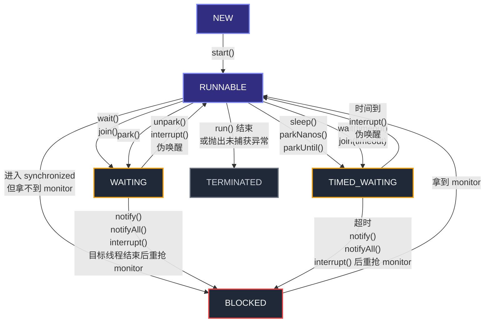
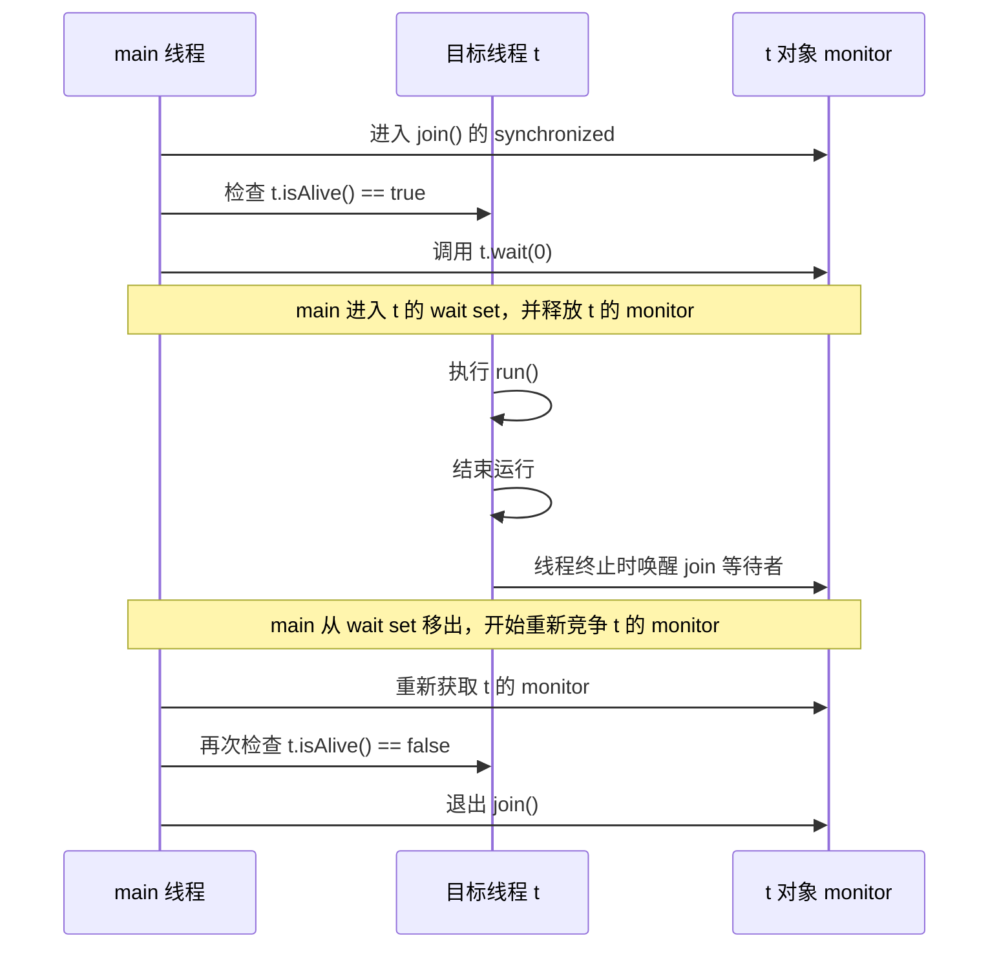

# Java `Thread.State`：6 种状态、流转和触发条件

这篇文档只解决 3 件事：

- Java 线程一共有哪 6 种状态
- 状态之间通常怎么流转
- 哪些 API / 场景会触发这些流转

## 1. 一个前提

- `Thread.State` 是 **JVM 层状态**，不等于操作系统线程状态。
- Java 没有单独的 “Running” 状态；`RUNNABLE` 同时覆盖“就绪”和“正在运行”。

## 2. 6 种状态速览

| 状态 | 含义 | 常见进入方式 | 常见离开方式 |
| --- | --- | --- | --- |
| `NEW` | 线程对象已创建，但还没启动 | `new Thread(...)` | `start()` 后进入 `RUNNABLE` |
| `RUNNABLE` | 可以运行，或者正在运行 | `start()`，或从其他等待态恢复 | 抢 `synchronized` 锁失败进 `BLOCKED`；调用 `wait/join/park/sleep` 进入等待态；`run()` 结束进 `TERMINATED` |
| `BLOCKED` | 本质只有一种：等 monitor 锁 | 常见入口有两条：进入 `synchronized` 时拿不到 monitor；`wait/join` 返回前重新抢 monitor | 拿到 monitor 后回到 `RUNNABLE` |
| `WAITING` | 无限期等待，必须靠别人明确唤醒 | `Object.wait()`、`Thread.join()`、`LockSupport.park()` | `wait/join` 常见路径是 `WAITING -> BLOCKED -> RUNNABLE`；`park` 常见路径是 `WAITING -> RUNNABLE` |
| `TIMED_WAITING` | 带超时的等待 | `sleep()`、`wait(timeout)`、`join(timeout)`、`parkNanos()`、`parkUntil()` | `sleep/park*` 常见路径是 `TIMED_WAITING -> RUNNABLE`；`wait/join(timeout)` 常见路径是 `TIMED_WAITING -> BLOCKED -> RUNNABLE` |
| `TERMINATED` | 线程已经执行结束 | `run()` 正常结束，或抛出未捕获异常 | 终态，不会再离开 |

补充两点：

- 直接调用 `t.run()` 只是普通方法调用，不会把线程真正启动起来。
- `Thread.yield()` 不会引入新状态，线程对外仍然是 `RUNNABLE`。

## 3. 状态流转图



最关键的区别只有两条：

- `wait()` / `join()` 返回前通常要先重新拿到 monitor，所以常见路径里会多一个 `BLOCKED`。
- `park()` / `sleep()` 不依赖 monitor 重入，因此更接近直接回到 `RUNNABLE`。

## 4. 源码佐证

下面片段摘自本机 OpenJDK 17 的 `src.zip`。

### 4.1 `Thread.State` 本身就定义了这 6 种状态

```java
public enum State {
    NEW,
    RUNNABLE,
    BLOCKED,
    WAITING,
    TIMED_WAITING,
    TERMINATED;
}
```

`Thread.java` 的注释同时明确了：

- `RUNNABLE` 里的线程可能正在 JVM 执行，也可能只是在等 processor
- `BLOCKED` 等的是 monitor lock
- `WAITING` 来自 `wait()`、`join()`、`park()`
- `TIMED_WAITING` 来自 `sleep()`、`wait(timeout)`、`join(timeout)`、`parkNanos()`、`parkUntil()`

### 4.2 `start()` 只能从 `NEW` 开始

```java
public synchronized void start() {
    // A zero status value corresponds to state "NEW".
    if (threadStatus != 0)
        throw new IllegalThreadStateException();
    start0();
}
```

这里有两个结论：

- `threadStatus == 0` 对应 `NEW`
- 线程只能 `start()` 一次，再调会抛 `IllegalThreadStateException`

### 4.3 `BLOCKED` 在状态映射里只对应 monitor enter

```java
public State getState() {
    return jdk.internal.misc.VM.toThreadState(threadStatus);
}
```

```java
public static Thread.State toThreadState(int threadStatus) {
    if ((threadStatus & JVMTI_THREAD_STATE_RUNNABLE) != 0) {
        return RUNNABLE;
    } else if ((threadStatus & JVMTI_THREAD_STATE_BLOCKED_ON_MONITOR_ENTER) != 0) {
        return BLOCKED;
    } else if ((threadStatus & JVMTI_THREAD_STATE_WAITING_INDEFINITELY) != 0) {
        return WAITING;
    } else if ((threadStatus & JVMTI_THREAD_STATE_WAITING_WITH_TIMEOUT) != 0) {
        return TIMED_WAITING;
    } else if ((threadStatus & JVMTI_THREAD_STATE_TERMINATED) != 0) {
        return TERMINATED;
    } else if ((threadStatus & JVMTI_THREAD_STATE_ALIVE) == 0) {
        return NEW;
    } else {
        return RUNNABLE;
    }
}
```

这段代码的关键信息只有一个：

- `BLOCKED` 只在 `threadStatus` 带有 `JVMTI_THREAD_STATE_BLOCKED_ON_MONITOR_ENTER` 时返回

也就是说，从 `Thread.getState()` 对外暴露出来的语义看，`BLOCKED` 只有一种本质情况：

- **线程正在等 monitor**

“进入 `synchronized` 没拿到 monitor”和“`wait/join` 返回前重抢 monitor”只是两条常见入口，不是两种不同的 `BLOCKED`。

### 4.4 `join()` 本质上就是在当前线程里循环 `wait()`

```java
public final synchronized void join(final long millis)
throws InterruptedException {
    if (millis > 0) {
        ...
    } else if (millis == 0) {
        while (isAlive()) {
            wait(0);
        }
    } else {
        throw new IllegalArgumentException("timeout value is negative");
    }
}
```

这里最容易说反的一点是：

- **进入等待的是调用 `join()` 的当前线程，不是目标线程**
- 当前线程等待时，使用的是**目标 `Thread` 对象本身**的 monitor 和 wait set

例如：

```java
Thread t = new Thread(task);
t.start();
t.join();
```

可以把 `t.join()` 近似理解成：

```java
synchronized (t) {
    while (t.isAlive()) {
        t.wait(0);
    }
}
```

#### 从调用方视角看一次 `t.join()`

假设是 `main` 线程调用 `t.join()`，时序可以理解成：



从 `main` 线程自己的状态视角看，更接近下面这条路径：

```text
RUNNABLE（持有 t 的 monitor）
-> 调用 t.wait()
-> WAITING（进入 t 的 wait set，并释放 monitor）
-> 被唤醒
-> BLOCKED（等待重新获取 t 的 monitor）
-> 重新拿到 t 的 monitor
-> RUNNABLE
-> wait() 返回
-> 再次检查 while (t.isAlive())
```

这能直接解释两件事：

- `join()` 为什么会让当前线程进入 `WAITING`
- `join()` 返回前为什么常常会先重新竞争 monitor，也就是 `WAITING -> BLOCKED -> RUNNABLE`

#### 为什么必须是 `while (isAlive()) wait()`，不能只 `wait()` 一次

因为 `wait()` 的语义从来不是“条件已经满足”，而是：

- 先把线程挂起，等别人唤醒
- 被唤醒后重新拿锁
- 拿到锁后，**自己再检查条件**

对 `join()` 来说，这里的条件就是：

```java
!t.isAlive()
```

所以它必须写成标准的条件等待模板：

```java
while (t.isAlive()) {
    t.wait(0);
}
```

不能偷换成：

```java
if (t.isAlive()) {
    t.wait(0);
}
```

至少有 3 个原因：

- 可能发生伪唤醒
- 可能被其他代码错误地对这个 `Thread` 对象做了 `notify()` / `notifyAll()`
- 对 `join(timeout)` 来说，线程醒来后还要重新判断“目标线程是否已经结束、剩余时间是否还够”

所以，`join()` 并不是“等一次通知就结束”，而是：

- **只要目标线程还活着，就继续在当前线程里循环 `wait()`**

#### `join()` 的实现机制和 JMM 语义要分开看

从实现机制看，`join()` 确实就是在当前线程里围绕 `isAlive()` 做条件等待。

但从语言语义看，`join()` 又不只是“`wait()` 的一个包装”。JMM 还额外规定了线程终止规则：

- 一个线程中的所有操作，`happens-before` 其他线程成功从这个线程的 `join()` 返回

例如：

```java
int[] result = new int[1];

Thread t = new Thread(() -> {
    result[0] = 42;
});

t.start();
t.join();

System.out.println(result[0]); // 这里必须能看到 42
```

所以理解 `join()` 时最好分成两层：

- **机制层**：当前线程在目标 `Thread` 对象上执行 `while (isAlive()) wait()`
- **语义层**：目标线程结束前的所有写入，对成功从 `join()` 返回的线程可见

如果你更关心这条 `happens-before` 规则本身，可以继续看 [thread-creation.md](./thread-creation.md) 里“线程终止规则：`join()`”那一节。

### 4.5 `Object.wait()` 的语义就是进入 wait set 并释放 monitor

```java
public final void wait() throws InterruptedException {
    wait(0L);
}

public final native void wait(long timeoutMillis)
        throws InterruptedException;
```

`Object.java` 的说明写得很直接：

- 调用线程必须先持有这个对象的 monitor
- 线程会进入这个对象的 wait set
- 线程会释放这个对象上的同步占有
- 如果因为中断抛出 `InterruptedException`，也是在 monitor 状态恢复之后才抛出

这就是 `wait()` 返回前通常还要先重新拿锁的原因。

### 4.6 `sleep()` 不释放 monitor，`park()` 也不是 monitor wait

```java
public static native void sleep(long millis)
        throws InterruptedException;
```

```java
public static void park() {
    U.park(false, 0L);
}

public static void parkNanos(long nanos) {
    if (nanos > 0)
        U.park(false, nanos);
}

public static void unpark(Thread thread) {
    if (thread != null)
        U.unpark(thread);
}
```

这里可以直接看出：

- `Thread.sleep()` 走的是线程睡眠路径；`Thread.java` 注释还明确写了它 **不会丢失 monitor 的所有权**
- `LockSupport.park*()` 直接落到 `Unsafe.park(...)`，它不是 `Object.wait()` 那套 monitor 等待机制
- 所以 `park()` / `parkNanos()` 恢复时，通常不会像 `wait()` 那样先进入 `BLOCKED`

## 5. 易混点

- `BLOCKED` 只表示“等 monitor 锁”；它不是一个大而泛的“阻塞中”状态。`ReentrantLock.lock()`、`Condition.await()` 这种等待通常不属于 `BLOCKED`。
- `wait()` 会释放调用对象的 monitor；`sleep()` 不会释放 monitor。
- `notify()` / `notifyAll()` 不是“线程立刻继续执行”；对 `wait()` 来说，线程通常只是先从“等条件”变成“重新抢锁”。
- `interrupt()` 不是强杀线程：在线程处于 `sleep/wait/join` 时通常抛 `InterruptedException`，在线程处于 `park()` 时通常只是返回，在线程处于 `BLOCKED` 时通常不会立刻脱离 `BLOCKED`。
