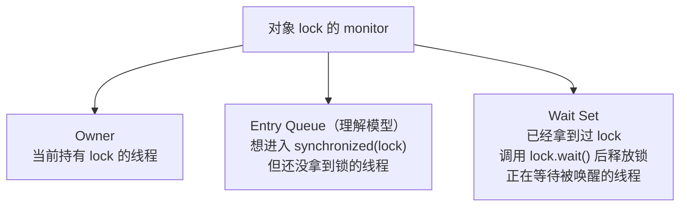
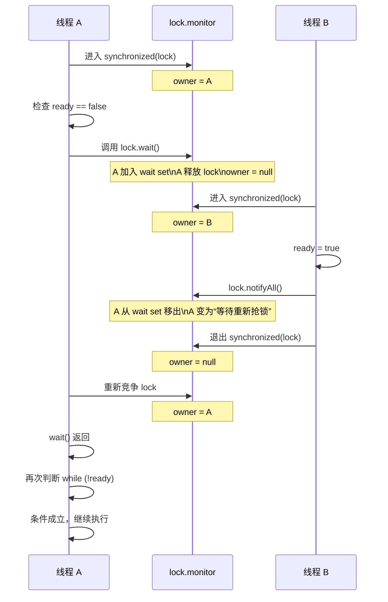

# wait/notify/notifyAll：监视器、wait set 与 sleep 的区别

本文档配合 `concurrency` 模块中的示例与测试，说明 Java 内置监视器（monitor）下的 `wait()` / `notify()` / `notifyAll()` 语义，并重点解释：

- `wait()` 到底在“等”什么
- 常说的“等待队列”到底是什么
- `notifyAll()` 之后线程为什么不会立刻继续执行
- 为什么 `wait()` 会释放锁，而 `sleep()` 不会

对应代码位置：
- 示例类（最基础的监视器用法）：`concurrency/src/main/java/yier/bubu/concurrency/AbcPrinters.java`
  - `printByWaitNotifyAll(int rounds)`
- 单元测试：`concurrency/src/test/java/yier/bubu/concurrency/AbcPrintersTest.java`

## 1. `wait()` 是什么

`wait()` 定义在 `java.lang.Object` 上，常用重载有 3 个：

```java
void wait() throws InterruptedException
void wait(long timeoutMillis) throws InterruptedException
void wait(long timeoutMillis, int nanos) throws InterruptedException
```

它的设计目标不是“让线程暂停一会儿”，而是：

- 让线程围绕**同一个对象的 monitor**做协作
- 当条件不满足时，线程先释放这把锁
- 等别的线程修改条件后，再把它唤醒回来继续执行

这也是为什么它定义在 `Object` 上而不是 `Thread` 上：

- Java 的内置锁是“每个对象一个 monitor”
- `wait/notify/notifyAll` 操作的是“这个对象 monitor 里的等待集合”

结论先行：

- `wait()` 必须在持有该对象 monitor 时调用，否则会抛 `IllegalMonitorStateException`
- `wait()` 调用后会**释放调用对象的 monitor 锁**
- 线程被唤醒后，不是立刻继续执行，而是必须先**重新竞争并重新拿到同一把锁**
- 只有重新拿到锁，`wait()` 才会返回

## 2. “等待队列”到底是什么

更准确的说法是：**某个对象 monitor 内部维护的 `wait set`（等待集合）**。

当线程已经拿到了对象 `lock` 的 monitor，并在 `synchronized(lock)` 内调用了 `lock.wait()`，会发生两件事：

1. 线程释放 `lock` 的 monitor
2. 线程进入 `lock` 对应的 `wait set`

这里要区分两类不同的“等待”：

- **等锁**：线程想进入 `synchronized(lock)`，但暂时拿不到锁
- **等条件**：线程已经拿到过锁，但因为条件不满足而调用了 `lock.wait()`

可以用下面的图来理解一个对象 monitor 内部常见的几个角色：



其中：

- **`wait set`** 是规范层面更正式的概念
- **`entry queue`** 更偏教学上的理解模型，用来帮助区分“等锁”和“等条件”

一句话记忆：

- `entry queue` 等的是锁
- `wait set` 等的是条件变化通知

### 2.1 `monitor` 到底是什么

可以先把 `monitor` 理解成：**Java 给每个对象配套的一套内置同步机制**。

它解决两类问题：

- **互斥**：同一时刻只能有一个线程进入受这把锁保护的临界区
- **协作**：线程可以 `wait()` 挂起，也可以被 `notify()` / `notifyAll()` 唤醒

对应到语法上：

- `synchronized(lock)`：竞争 `lock` 关联的 monitor
- `lock.wait()`：进入 `lock` 关联 monitor 的 `wait set`
- `lock.notify()` / `lock.notifyAll()`：操作这个 monitor 里的等待线程

所以 `lock` 是你在 Java 代码里看到的对象，`monitor` 是 JVM 在运行时为这个对象提供的同步语义。

### 2.2 `monitor` 在内存中的什么位置

这里要分成两个口径看。

#### 规范口径

Java 规范要求的是语义，而不是具体内存布局。规范会约束：

- 每个对象都可以作为 monitor 使用
- `synchronized` 进入/退出时要围绕这个对象的 monitor 做加锁/解锁
- `wait/notify/notifyAll` 要操作这个对象对应的监视器等待机制

但规范**不要求**：

- monitor 必须是对象里的一个 Java 字段
- monitor 必须固定存放在堆里的某个位置
- monitor 必须一直有一个常驻、独立的结构体

因此，从规范层面更准确的说法是：

- **每个对象在运行时都关联着 monitor 语义**
- **至于 monitor 在内存里怎么表示，由 JVM 实现决定**

#### HotSpot / OpenJDK 常见实现口径

如果按 HotSpot/OpenJDK 的常见实现去理解，可以使用下面这个心智模型：

```text
Java 代码里的 lock 对象
    ↓
对象头（mark word，记录锁状态/关联信息）
    ↓
JVM 运行时 monitor / ObjectMonitor
    ↓
owner / 重入次数 / 竞争线程信息 / wait set
```

这里的关键点是：

- `lock` 这个 Java 对象本身通常在 **Java 堆** 上
- 对象头中的 **mark word** 会携带锁状态，必要时也承担“去哪里找更完整同步元数据”的入口
- 不是“Java 对象自己根据对象头去找 monitor”，而是 **JVM 在执行 `synchronized` 对应的同步逻辑时读取 `mark word`，再决定走哪条锁路径**
- 当同步进入膨胀后的 monitor 路径时，JVM 会把对象和更重的 `ObjectMonitor` 结构关联起来
- `ObjectMonitor` 是 **monitor 膨胀后的重量级锁管理结构**，不是普通 Java 对象字段，也不是每次 `synchronized` 都一定会立刻用到它

因此，monitor 不能简单理解成“固定塞在对象内部的一大块内存”。

更准确地说：

- 对象本身在堆里
- 锁相关的轻量状态首先体现在对象头里
- 更完整的 monitor 结构通常由 JVM 在运行时按需管理

### 2.3 `monitor` 由谁管理，和 `lock` 怎么关联

`monitor` 由 **JVM 运行时** 管理，不由 Java 应用代码自己管理。

以 HotSpot 为例，JVM 会负责：

- monitor 相关运行时结构的创建、关联、膨胀与回收
- 记录当前 owner 线程
- 维护重入层数
- 维护 `wait set`
- 在线程阻塞、唤醒、重新竞争锁时和底层线程机制配合

`lock` 和 monitor 的关系可以理解成：

- `lock` 是 Java 世界里的对象引用
- monitor 是 JVM 世界里的同步机制
- JVM 先读取 `lock` 对象头里的锁状态信息，再决定如何定位 monitor / `ObjectMonitor`

也就是说，这不是下面这种关系：

```java
class Object {
    List<Thread> waitSet;
}
```

`wait set` 并不是 `lock` 对象里的一个字段。  
更准确的说法是：

- `wait set` 属于 `lock` 关联的 **monitor 运行时结构**
- 你只能通过 `wait/notify/notifyAll` 间接操作它
- 你不能在 Java 代码里直接拿到这个集合

### 2.4 `mark word` 到底存了什么

在 HotSpot 里，对象头中的 `mark word` 是 JVM 判断锁状态的重要入口。

如果只抓本文需要的主线，可以先记它的**低 2 位**：

- `01`：未锁定（unlocked）
- `00`：锁已被占用的快速路径状态  
  在当前 lightweight locking 语境下可以先理解成 fast locked；但源码注释本身也保留了 stack locking 的说法
- `10`：已经膨胀为 monitor（inflated / monitor）
- `11`：marked 等其他运行时用途

所以 JVM 进入同步逻辑时，第一步并不是“直接拿 monitor”，而更接近：

1. 读取对象头里的 `mark word`
2. 判断低 2 位当前是什么状态
3. 再决定后续是走快锁路径，还是去定位/使用 `ObjectMonitor`

这也是为什么可以把三者关系记成：

- `Java 对象`：锁的载体
- `对象头 / mark word`：同步状态与查找入口
- `ObjectMonitor`：膨胀后 monitor 路径下的重量级管理结构

### 2.5 对象和 `ObjectMonitor` 的关联有两种常见实现

HotSpot 里，“对象如何关联到 `ObjectMonitor`”并不只有一种做法。

#### 方式 1：对象头直接编码 `ObjectMonitor*`

在传统实现里，如果对象已经进入 inflated monitor 状态，可以把对象头理解成近似下面这种形式：

```text
[ ObjectMonitor 指针 | 10 ]
```

它表达的是：

- 低 2 位 `10` 表示当前是 monitor / inflated 状态
- 其余高位不再只是普通 header 信息，而是被编码为 `ObjectMonitor*`
- JVM 读到 `10` 后，可以把 `mark word` 解码成对应的 `ObjectMonitor`

在这种模式下，对象和 `ObjectMonitor` 的关系更接近：

- **对象头直接指向 `ObjectMonitor`**

#### 方式 2：通过 `ObjectMonitorTable` 间接关联

较新的 HotSpot 也支持另一种思路：

- 对象头只保留“我已经 inflated 了”的状态信息
- 真正的 `对象 -> ObjectMonitor` 映射不直接放在对象头里
- JVM 改为去 `ObjectMonitorTable` 里按对象查对应的 `ObjectMonitor`

在这种模式下，可以理解成：

```text
对象头 mark word = ...10
        ↓
JVM 知道：这个对象已经 inflated
        ↓
去 ObjectMonitorTable 按对象查
        ↓
拿到对应的 ObjectMonitor
```

因此，把“对象如何关联 monitor”说准确一些，应当表述为：

- 对象头先告诉 JVM 当前锁处于什么状态
- 如果是 monitor / inflated 状态，JVM 再决定：
  - 直接从对象头解码出 `ObjectMonitor*`
  - 或者去 `ObjectMonitorTable` 中查到 `ObjectMonitor`

### 2.6 `ObjectMonitor` 也会反向知道自己属于哪个对象

这个关联不只是“从对象找到 monitor”。

在 HotSpot 的 `ObjectMonitor` 结构里，也有反向指向 Java 对象的字段（当前源码里是 `_object`）。因此从实现理解上，也可以把关联想成双向可理解的：

- 从对象出发：通过对象头定位 monitor
- 从 `ObjectMonitor` 出发：它自己也知道对应的是哪个 Java 对象

### 2.7 实现细节为什么要保留“版本差异”这个前提

这类内容在不同 JVM、不同 JDK 版本里会有实现差异。

例如在 HotSpot 的不同阶段里：

- 对象头中的 mark word 一直是锁状态的重要入口
- 传统实现里，膨胀后的对象可能直接关联到重量级 `ObjectMonitor`
- 较新的 HotSpot 也可能通过额外的 monitor 表来建立“对象 -> `ObjectMonitor`”映射

但这些实现差异**不改变本文的主线理解**：

- `synchronized(lock)` 操作的是 `lock` 对应的 monitor 语义
- `wait set` 是 monitor 内部维护的等待结构，不是 `lock` 的 Java 字段
- JVM 会先读对象头里的 `mark word`，再决定走哪条同步路径
- `wait()` / `notify()` / `notifyAll()` 的语义由 JVM 的 monitor 机制保证

如果你想从“规范视角 vs HotSpot 实现视角”去理解“内存里到底有什么”，也可以结合仓库里的 `jvm/docs/jvm-memory.md` 一起看：一个讲语义分层，一个讲实现与进程内存口径。

### 2.8 一张图串起来：`lock`、对象头与 monitor 的关系

可以先用下面这张图建立一个足够准确、但不过度陷入实现细节的模型：

```mermaid
flowchart LR
  Ref["Java 代码里的 `lock` 引用"]

  subgraph Heap["Java Heap"]
    Obj["`lock` 对象实例"]
    Header["对象头 / mark word\n锁状态 / 关联入口"]
  end

  subgraph Runtime["JVM 运行时同步结构"]
    Mon["monitor / ObjectMonitor\n按需关联或查表定位"]
    Owner["owner / 重入计数"]
    Entry["竞争线程信息"]
    Wait["wait set"]
  end

  Ref --> Obj
  Obj --> Header
  Header --> Mon
  Mon --> Owner
  Mon --> Entry
  Mon --> Wait
```

这张图表达的是：

- Java 代码里拿到的是 `lock` 这个对象引用
- `lock` 对象本身通常位于堆上
- JVM 会先通过对象头中的锁状态信息判断当前同步状态
- 如果走到 inflated monitor 路径，再去关联或定位到 `ObjectMonitor`
- `owner`、重入次数、竞争线程信息、`wait set` 这些都属于 monitor / `ObjectMonitor` 运行时结构

如果想把它压缩成一句更容易记忆的话，可以记成：

- **对象是 Java 世界里的载体，对象头是同步状态入口，`ObjectMonitor` 是膨胀后 monitor 路径下的重量级管理结构**

再强调一次边界：

- 不是每次 `synchronized(lock)` 都意味着“堆里这个对象内部固定放着一个完整 `ObjectMonitor`”
- 更准确的说法是：JVM 会围绕这个对象维护 monitor 语义，并在需要时通过对象头和运行时结构把它串起来
- 更进一步说：对象头不是 monitor 本体，而是 JVM 判断锁状态、定位 `ObjectMonitor` 的入口信息

## 3. 一个标准写法在做什么

典型代码如下：

```java
synchronized (lock) {
    while (!ready) {
        lock.wait();
    }
    System.out.println("继续执行");
}
```

这段代码的语义不是“如果 `ready` 为假就睡眠”，而是：

1. 线程先进入 `synchronized(lock)`，拿到 `lock` 的 monitor
2. 检查共享条件 `ready`
3. 如果条件不成立，则调用 `lock.wait()`
4. 线程释放 `lock` 的 monitor，进入 `lock` 的 `wait set`
5. 其他线程进入同一个 `synchronized(lock)`，修改 `ready`
6. 其他线程调用 `lock.notify()` 或 `lock.notifyAll()`
7. 被唤醒的线程开始重新竞争 `lock` 的 monitor
8. 线程重新拿到 `lock` 后，`wait()` 返回
9. 线程再次检查 `while (!ready)`，条件成立后才继续执行

## 4. A / B 两个线程的完整时序

假设有下面的代码：

```java
synchronized (lock) {
    while (!ready) {
        lock.wait();
    }
    System.out.println("继续执行");
}
```

另一个线程执行：

```java
synchronized (lock) {
    ready = true;
    lock.notifyAll();
}
```

对应时序可以画成这样：



最容易误解的点是：

- `notify()` / `notifyAll()` **不会让等待线程立刻继续执行**
- 它只是把线程从“等通知”变成“等重新拿锁”
- 只有当前持锁线程退出 `synchronized(lock)` 后，等待线程才有机会重新拿锁
- 只有重新拿到这把锁，`wait()` 才真正返回

## 5. 站在线程 A 的视角，执行流程是什么

假设 A 正在执行下面这段代码：

```java
synchronized (lock) {
    while (!ready) {
        lock.wait();
    }
    System.out.println("继续执行");
}
```

对 A 来说，关键不是“被唤醒后重新开始执行整段代码”，而是：

- A 一直卡在那次 `lock.wait()` 调用上
- A 被 `notify/notifyAll` 后，也还没有返回到 Java 代码层
- A 只是从“在 `wait set` 等通知”切换成“等待重新拿到 `lock`”
- A 真正重新拿到 `lock` 后，那次挂起的 `wait()` 才返回
- 然后 A 从 `wait()` 后面的下一条语句继续执行

可以把 A 的状态变化理解成：

```text
RUNNABLE（持有 lock）
-> 调用 wait()
-> WAITING（在 wait set 等通知）
-> 被 notify/notifyAll
-> BLOCKED（等待重新获取 lock）
-> 重新拿到 lock
-> RUNNABLE
-> wait() 返回
-> 重新检查 while 条件
```

因此，`notifyAll()` 到 `wait()` 返回之间，中间其实隔着一步非常关键的动作：

- **重新竞争并重新获取同一把 monitor 锁**

## 6. 为什么要用 `while`，而不是 `if`

标准写法总是：

```java
synchronized (lock) {
    while (!condition) {
        lock.wait();
    }
}
```

而不是：

```java
synchronized (lock) {
    if (!condition) {
        lock.wait();
    }
}
```

原因是：`wait()` 返回并不自动代表条件一定成立。线程醒来可能是因为：

- 其他线程调用了 `notify()`
- 其他线程调用了 `notifyAll()`
- 等待超时
- 当前线程被中断
- 发生虚假唤醒（spurious wakeup）

因此线程恢复执行后的第一件事，不是直接干活，而是**重新检查条件**。

## 7. `wait()` 和 `sleep()` 的本质区别

它们看起来都像“线程暂停”，但解决的问题完全不同。

### `wait()`

- 属于 `Object`
- 用于 monitor 协作
- 语义是“条件不满足，我先把锁让出来，等别人修改条件后再回来”
- 调用后会释放调用对象的 monitor 锁
- 被唤醒后必须先重新拿到同一把锁，`wait()` 才返回

### `sleep()`

- 属于 `Thread`
- 用于线程调度层面的暂停
- 语义是“我这个线程暂时不占 CPU，过一会儿再继续”
- 和对象 monitor 没有直接关系
- **不会释放已经持有的锁**

一个最短对比：

```java
synchronized (lock) {
    Thread.sleep(1000);
}
```

这 1 秒内，别的线程仍然不能进入 `synchronized(lock)`。

而这个：

```java
synchronized (lock) {
    lock.wait();
}
```

调用后当前线程会释放 `lock`，其他线程可以进入同一个 `synchronized(lock)`。

为什么 `sleep()` 不释放锁：

- `sleep()` 的目的只是暂停当前线程，而不是围绕共享条件做协作
- 如果 `sleep()` 自动释放锁，其他线程就可能看到临界区里的中间态，破坏同步块的原子性和一致性

为什么 `wait()` 必须释放锁：

- `wait()` 的目标是等待别的线程修改条件
- 如果等待线程还一直占着锁，其他线程就进不了同一个同步块
- 条件就永远无法变化，程序会卡死

## 8. 常见误区

### 8.1 `wait()` 释放的是“所有锁”吗

不是。

`wait()` 只会释放**调用它的那个对象的 monitor 锁**。  
例如在 `synchronized(lock)` 中调用 `lock.wait()`，释放的是 `lock` 的锁。

### 8.2 被 `notify()` 后会立刻继续执行吗

不会。

线程只是先从 `wait set` 中移出，接着去重新竞争 monitor。  
只有重新拿到锁，`wait()` 才会返回。

### 8.3 `notify()` 会立刻释放锁吗

不会。

调用 `notify()` / `notifyAll()` 的线程仍然继续持有锁，直到它退出当前 `synchronized` 块或方法。

### 8.4 等待线程一定按 FIFO 顺序恢复吗

不要这样假设。

Java 规范没有承诺 `wait set` 或 monitor 竞争一定是 FIFO，因此不要把“先 wait 的线程一定先恢复”当成语义保证。

### 8.5 为什么示例里常写 `notifyAll()` 而不是 `notify()`

因为多个线程可能在同一个对象的 `wait set` 里等待不同条件。

例如 `AbcPrinters.printByWaitNotifyAll(...)` 中，A/B/C 三个线程共用同一个 `lock` 和同一个 `wait set`。如果只 `notify()` 一个线程，可能唤醒的不是当前应该继续执行的那个线程，于是它检查条件后又会再次 `wait()`，容易导致复杂时序下的卡住或低效轮转。

因此，在“同一把锁上有多个等待分支”的场景里，`notifyAll()` 通常更稳妥，再配合 `while` 条件检查来筛掉不该继续执行的线程。

## 9. 结合本仓库示例看 `wait/notifyAll`

`AbcPrinters.printByWaitNotifyAll(int rounds)` 的核心代码如下：

```java
synchronized (lock) {
    while (turn.get() % 3 != 0) {
        lock.wait();
    }
    out.append('A');
    turn.incrementAndGet();
    lock.notifyAll();
}
```

这段代码体现了 monitor 协作的标准套路：

1. 用 `synchronized(lock)` 保证共享状态 `turn` 的检查与修改是互斥的
2. 条件不满足时调用 `lock.wait()`，释放 `lock`
3. 条件满足时执行自己的工作
4. 修改共享状态后调用 `lock.notifyAll()`
5. 被唤醒的线程重新竞争 `lock`，并再次通过 `while` 判断自己是不是该继续执行

也就是说，这套机制的主线始终是：

- **拿锁**
- **检查条件**
- **条件不满足就 wait 并释放锁**
- **条件满足就修改状态并通知别人**

## 10. 一句话总结

可以把 `wait/notify/notifyAll` 记成下面这几句：

- `wait()`：我已经拿到这把锁了，但条件还不满足，我先释放锁并进入这个对象的 `wait set`
- `notify()`：从这个对象的 `wait set` 里叫一个线程出来，让它去重新竞争锁
- `notifyAll()`：把这个对象 `wait set` 里的所有线程都叫出来，让它们重新竞争锁
- `wait()` 返回的前提不是“被通知了”，而是“被通知后又重新拿到了同一把锁”
- `sleep()` 只是让线程暂停，不参与 monitor 协作，所以不会释放锁
