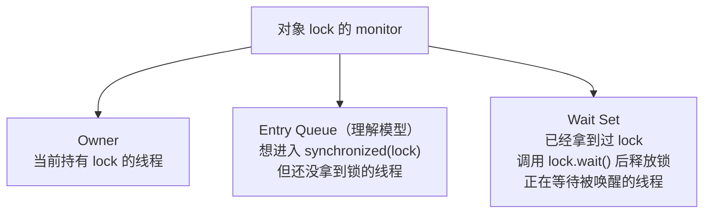
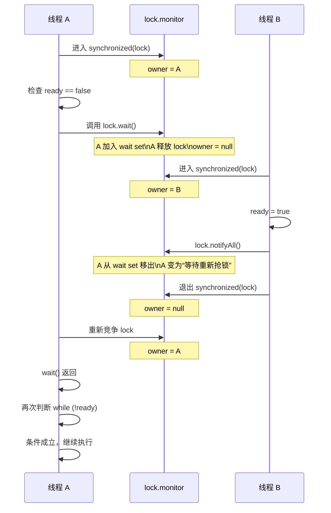

# wait/notify/notifyAll：等待条件、wait set 与 sleep 的区别

本文是 `wait/notify/notifyAll` 的专题文档，聚焦 monitor 协作本身，重点解释：

- `wait/notify/notifyAll` 为什么定义在 `Object` 上
- 为什么调用前必须先持有同一个对象的 monitor
- `wait()` 到底在“等”什么
- 常说的“等待队列”到底是什么
- `notifyAll()` 之后线程为什么不会立刻继续执行
- 为什么 `wait()` 会释放锁，而 `sleep()` 不会
- 为什么标准写法要用 `while`，而不是 `if`

如果你想先看 `synchronized` 三种写法、字节码、对象头 / `mark word` / `ObjectMonitor` 的总览，请先看 [Java `synchronized` 全面整理](./synchronized-notes.md)。

对应代码位置：
- 示例类（最基础的监视器用法）：`concurrency/src/main/java/yier/bubu/concurrency/AbcPrinters.java`
  - `printByWaitNotifyAll(int rounds)`
- 单元测试：`concurrency/src/test/java/yier/bubu/concurrency/AbcPrintersTest.java`

## 1. `wait()` 是什么

`wait()` 定义在 `java.lang.Object` 上，常用重载有 3 个：

```java
void wait() throws InterruptedException
void wait(long timeoutMillis) throws InterruptedException
void wait(long timeoutMillis, int nanos) throws InterruptedException
```

它的设计目标不是“让线程暂停一会儿”，而是：

- 让线程围绕**同一个对象的 monitor**做协作
- 当条件不满足时，线程先释放这把锁
- 等别的线程修改条件后，再把它唤醒回来继续执行

这也是为什么它定义在 `Object` 上，而不是 `Thread` 上：`wait/notify/notifyAll` 操作的不是线程本身，而是**某个对象的 monitor 和 wait set**。

Java 里任意对象都可以作为内置锁：

```java
synchronized (lock) {
    // 临界区
}
```

这个 `lock` 对象关联着一把 monitor 锁，也关联着一个 `wait set`。当线程调用 `lock.wait()` 时，它进入的是 `lock` 这个对象的等待集合；当另一个线程调用 `lock.notify()` / `lock.notifyAll()` 时，它唤醒的也是 `lock` 这个对象等待集合里的线程。

如果把 `wait/notify` 放在 `Thread` 上，语义反而会变得奇怪：线程 A 等待的通常不是“线程 B 本身”，而是某个共享条件，例如队列非空、任务完成、状态变更等。这个共享条件需要依附在一个共同的锁对象上完成检查、等待、修改和通知。

结论先行：

- `wait()` 必须在持有该对象 monitor 时调用，否则会抛 `IllegalMonitorStateException`
- `synchronized(lock)` 和 `lock.wait()` / `lock.notifyAll()` 必须围绕同一个对象
- `wait()` 调用后会**释放调用对象的 monitor 锁**
- 线程被唤醒后，不是立刻继续执行，而是必须先**重新竞争并重新拿到同一把锁**
- 只有重新拿到锁，`wait()` 才会返回

## 2. “等待队列”到底是什么

更准确的说法是：**某个对象 monitor 内部维护的 `wait set`（等待集合）**。

当线程已经拿到了对象 `lock` 的 monitor，并在 `synchronized(lock)` 内调用了 `lock.wait()`，会发生两件事：

1. 线程释放 `lock` 的 monitor
2. 线程进入 `lock` 对应的 `wait set`

这里要区分两类不同的“等待”：

- **等锁**：线程想进入 `synchronized(lock)`，但暂时拿不到锁
- **等条件**：线程已经拿到过锁，但因为条件不满足而调用了 `lock.wait()`

可以用下面的图来理解一个对象 monitor 内部常见的几个角色：



其中：

- **`wait set`** 是规范层面更正式的概念
- **`entry queue`** 更偏教学上的理解模型，用来帮助区分“等锁”和“等条件”

一句话记忆：

- `entry queue` 等的是锁
- `wait set` 等的是条件变化通知

在本文里，你可以先把 `monitor` 简单理解成：**Java 给每个对象配套的一套内置同步机制**。
如果你还想继续追到对象头、`mark word`、`ObjectMonitor` 以及字节码层的 `monitorenter/monitorexit`，请再看 [synchronized-notes.md](./synchronized-notes.md)。

## 3. 一个标准写法在做什么

典型代码如下：

```java
synchronized (lock) {
    while (!ready) {
        lock.wait();
    }
    System.out.println("继续执行");
}
```

这段代码的语义不是“如果 `ready` 为假就睡眠”，而是：

1. 线程先进入 `synchronized(lock)`，拿到 `lock` 的 monitor
2. 检查共享条件 `ready`
3. 如果条件不成立，则调用 `lock.wait()`
4. 线程释放 `lock` 的 monitor，进入 `lock` 的 `wait set`
5. 其他线程进入同一个 `synchronized(lock)`，修改 `ready`
6. 其他线程调用 `lock.notify()` 或 `lock.notifyAll()`
7. 被唤醒的线程开始重新竞争 `lock` 的 monitor
8. 线程重新拿到 `lock` 后，`wait()` 返回
9. 线程再次检查 `while (!ready)`，条件成立后才继续执行

这里的关键约束是：当前线程必须已经持有 `lock` 的 monitor，才能调用 `lock.wait()`。否则 JVM 会抛出 `IllegalMonitorStateException`。

原因不是单纯的语法要求，而是 `wait()` 必须和同一把 monitor 锁配套工作：

1. `wait()` 要释放调用对象的 monitor；既然要释放 `lock`，线程就必须先持有 `lock`
2. “检查条件”和“进入等待”必须在同一把锁保护下完成，否则可能在判断 `ready == false` 之后、真正 `wait()` 之前，另一个线程已经完成 `notify()`，从而造成通知丢失
3. 通知方通常会先修改共享状态，再调用 `notify/notifyAll`；等待方醒来并重新拿到同一把锁后，才能可靠看见这些状态变化

因此，等待方和通知方都应该围绕同一个锁对象写：

```java
synchronized (lock) {
    while (!ready) {
        lock.wait();
    }
}
```

```java
synchronized (lock) {
    ready = true;
    lock.notifyAll();
}
```

## 4. A / B 两个线程的完整时序

假设有下面的代码：

```java
synchronized (lock) {
    while (!ready) {
        lock.wait();
    }
    System.out.println("继续执行");
}
```

另一个线程执行：

```java
synchronized (lock) {
    ready = true;
    lock.notifyAll();
}
```

对应时序可以画成这样：



最容易误解的点是：

- `notify()` / `notifyAll()` **不会让等待线程立刻继续执行**
- 它只是把线程从“等通知”变成“等重新拿锁”
- 只有当前持锁线程退出 `synchronized(lock)` 后，等待线程才有机会重新拿锁
- 只有重新拿到这把锁，`wait()` 才真正返回

## 5. 站在线程 A 的视角，执行流程是什么

假设 A 正在执行下面这段代码：

```java
synchronized (lock) {
    while (!ready) {
        lock.wait();
    }
    System.out.println("继续执行");
}
```

对 A 来说，关键不是“被唤醒后重新开始执行整段代码”，而是：

- A 一直卡在那次 `lock.wait()` 调用上
- A 被 `notify/notifyAll` 后，也还没有返回到 Java 代码层
- A 只是从“在 `wait set` 等通知”切换成“等待重新拿到 `lock`”
- A 真正重新拿到 `lock` 后，那次挂起的 `wait()` 才返回
- 然后 A 从 `wait()` 后面的下一条语句继续执行

可以把 A 的状态变化理解成：

```text
RUNNABLE（持有 lock）
-> 调用 wait()
-> WAITING（在 wait set 等通知）
-> 被 notify/notifyAll
-> BLOCKED（等待重新获取 lock）
-> 重新拿到 lock
-> RUNNABLE
-> wait() 返回
-> 重新检查 while 条件
```

因此，`notifyAll()` 到 `wait()` 返回之间，中间其实隔着一步非常关键的动作：

- **重新竞争并重新获取同一把 monitor 锁**

## 6. 为什么要用 `while`，而不是 `if`

标准写法总是：

```java
synchronized (lock) {
    while (!condition) {
        lock.wait();
    }
}
```

而不是：

```java
synchronized (lock) {
    if (!condition) {
        lock.wait();
    }
}
```

原因是：`wait()` 返回并不自动代表条件一定成立。线程醒来可能是因为：

- 其他线程调用了 `notify()`
- 其他线程调用了 `notifyAll()`
- 等待超时
- 当前线程被中断
- 发生虚假唤醒（spurious wakeup）

因此线程恢复执行后的第一件事，不是直接干活，而是**重新检查条件**。

## 7. `wait()` 和 `sleep()` 的本质区别

它们看起来都像“线程暂停”，但解决的问题完全不同。

### `wait()`

- 属于 `Object`
- 用于 monitor 协作
- 语义是“条件不满足，我先把锁让出来，等别人修改条件后再回来”
- 调用后会释放调用对象的 monitor 锁
- 被唤醒后必须先重新拿到同一把锁，`wait()` 才返回

### `sleep()`

- 属于 `Thread`
- 用于线程调度层面的暂停
- 语义是“我这个线程暂时不占 CPU，过一会儿再继续”
- 和对象 monitor 没有直接关系
- **不会释放已经持有的锁**

一个最短对比：

```java
synchronized (lock) {
    Thread.sleep(1000);
}
```

这 1 秒内，别的线程仍然不能进入 `synchronized(lock)`。

而这个：

```java
synchronized (lock) {
    lock.wait();
}
```

调用后当前线程会释放 `lock`，其他线程可以进入同一个 `synchronized(lock)`。

为什么 `sleep()` 不释放锁：

- `sleep()` 的目的只是暂停当前线程，而不是围绕共享条件做协作
- 如果 `sleep()` 自动释放锁，其他线程就可能看到临界区里的中间态，破坏同步块的原子性和一致性

为什么 `wait()` 必须释放锁：

- `wait()` 的目标是等待别的线程修改条件
- 如果等待线程还一直占着锁，其他线程就进不了同一个同步块
- 条件就永远无法变化，程序会卡死

## 8. 常见误区

### 8.1 `wait()` 释放的是“所有锁”吗

不是。

`wait()` 只会释放**调用它的那个对象的 monitor 锁**。  
例如在 `synchronized(lock)` 中调用 `lock.wait()`，释放的是 `lock` 的锁。

### 8.2 被 `notify()` 后会立刻继续执行吗

不会。

线程只是先从 `wait set` 中移出，接着去重新竞争 monitor。  
只有重新拿到锁，`wait()` 才会返回。

### 8.3 `notify()` 会立刻释放锁吗

不会。

调用 `notify()` / `notifyAll()` 的线程仍然继续持有锁，直到它退出当前 `synchronized` 块或方法。

### 8.4 等待线程一定按 FIFO 顺序恢复吗

不要这样假设。

Java 规范没有承诺 `wait set` 或 monitor 竞争一定是 FIFO，因此不要把“先 wait 的线程一定先恢复”当成语义保证。

### 8.5 为什么示例里常写 `notifyAll()` 而不是 `notify()`

因为多个线程可能在同一个对象的 `wait set` 里等待不同条件。

例如 `AbcPrinters.printByWaitNotifyAll(...)` 中，A/B/C 三个线程共用同一个 `lock` 和同一个 `wait set`。如果只 `notify()` 一个线程，可能唤醒的不是当前应该继续执行的那个线程，于是它检查条件后又会再次 `wait()`，容易导致复杂时序下的卡住或低效轮转。

因此，在“同一把锁上有多个等待分支”的场景里，`notifyAll()` 通常更稳妥，再配合 `while` 条件检查来筛掉不该继续执行的线程。

## 9. 结合本仓库示例看 `wait/notifyAll`

`AbcPrinters.printByWaitNotifyAll(int rounds)` 的核心代码如下：

```java
synchronized (lock) {
    while (turn.get() % 3 != 0) {
        lock.wait();
    }
    out.append('A');
    turn.incrementAndGet();
    lock.notifyAll();
}
```

这段代码体现了 monitor 协作的标准套路：

1. 用 `synchronized(lock)` 保证共享状态 `turn` 的检查与修改是互斥的
2. 条件不满足时调用 `lock.wait()`，释放 `lock`
3. 条件满足时执行自己的工作
4. 修改共享状态后调用 `lock.notifyAll()`
5. 被唤醒的线程重新竞争 `lock`，并再次通过 `while` 判断自己是不是该继续执行

也就是说，这套机制的主线始终是：

- **拿锁**
- **检查条件**
- **条件不满足就 wait 并释放锁**
- **条件满足就修改状态并通知别人**

## 10. 一句话总结

可以把 `wait/notify/notifyAll` 记成下面这几句：

- `wait()`：我已经拿到这把锁了，但条件还不满足，我先释放锁并进入这个对象的 `wait set`
- `notify()`：从这个对象的 `wait set` 里叫一个线程出来，让它去重新竞争锁
- `notifyAll()`：把这个对象 `wait set` 里的所有线程都叫出来，让它们重新竞争锁
- `wait()` 返回的前提不是“被通知了”，而是“被通知后又重新拿到了同一把锁”
- `sleep()` 只是让线程暂停，不参与 monitor 协作，所以不会释放锁
