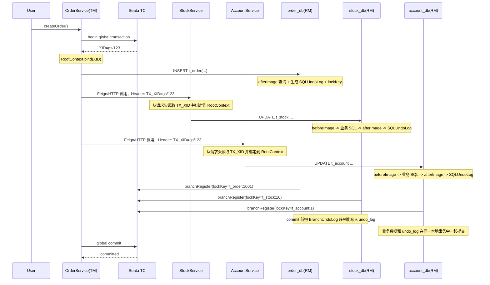
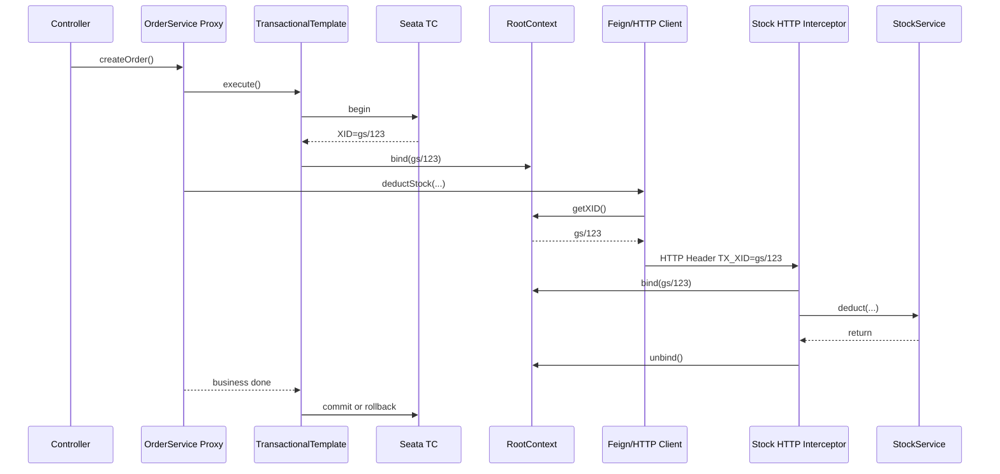
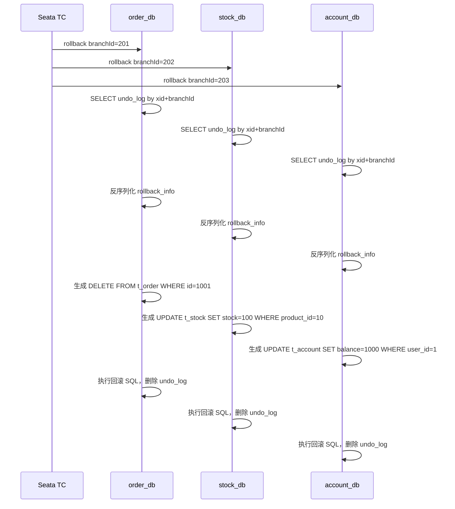

# Java 中 Seata AT 模式：工作机制、前后镜像、`undo_log` 与 `Feign/RPC` 调用链

本文把 Seata `AT` 模式整理成一条完整主线，重点覆盖：

- `AT` 模式到底是什么，适合解决什么问题
- `@GlobalTransactional` 到 JDBC 数据源代理之间，Seata 是怎么把分布式事务串起来的
- Seata 是怎么自动记录 `before image`、`after image` 和 `undo_log` 的
- 用“下单 -> 扣库存 -> 扣余额”这个案例，把每个分支库里的 `undo_log` 展开成可读结构
- 全局回滚时，Seata 会如何读取 `undo_log`、生成反向 SQL，并做脏写校验

如果你已经知道 Seata 的几个模式名称，但对 `AT` 的“自动回滚”仍然停留在概念层，这篇文档的目标就是把这件事讲清楚。

---

## 1. Seata AT 模式是什么

先用一句话记：

- **AT 模式是 Seata 基于关系型数据库和 JDBC 代理实现的一种低侵入分布式事务模式。**

它不是让数据库原生支持跨库事务，也不是依赖业务方手写补偿逻辑，而是：

1. 在业务入口开启全局事务
2. 在每个参与库的 JDBC 层拦截业务 SQL
3. 自动记录“修改前长什么样”和“修改后长什么样”
4. 把这些回滚材料写进当前业务库的 `undo_log`
5. 如果全局事务失败，再根据 `undo_log` 生成反向 SQL 回放

和其他模式对比，可以先粗略理解成：

- `AT`：低侵入，适合普通 CRUD 分布式事务
- `TCC`：侵入高，需要业务显式写 Try / Confirm / Cancel
- `Saga`：长事务 / 最终一致性更常见
- `XA`：协议更重，一阶段和二阶段开销更大

所以 `AT` 最适合的场景通常是：

- 多个服务分别操作各自 MySQL 表
- 操作主要是 `insert/update/delete`
- 业务副作用主要落在数据库里

它不太适合的场景包括：

- 事务里夹杂大量第三方接口副作用
- 消息发送、文件写入、缓存和数据库必须严格一体化回滚
- 复杂人工补偿更符合业务语义的场景

---

## 2. 先建立三个角色：TM、RM、TC

在 Seata 里，理解 `AT` 之前先把三个角色固定住：

- `TM`：`Transaction Manager`，事务发起方，负责开启和结束全局事务
- `RM`：`Resource Manager`，资源管理方，负责本地分支事务和 `undo_log`
- `TC`：`Transaction Coordinator`，事务协调器，负责全局提交、回滚和全局锁

对 Java / Spring 应用来说，通常可以这样代入：

- 你在入口方法上写 `@GlobalTransactional`，这个入口服务通常扮演 `TM`
- 每个接入 Seata 的业务库对应一个 `RM`
- 独立部署的 Seata Server 扮演 `TC`

---

## 3. 一条完整的 Seata AT 工作主线

下面这张图先看“正常执行”时，Seata 到底在链路里插了哪些步骤。



这条主线里最值得记住的是：

1. `TM` 从 `TC` 拿到 `XID`
2. `XID` 在当前线程里绑定到 `RootContext`
3. `XID` 跨 RPC 透传到下游服务
4. 下游服务里的 JDBC 代理感知到“我正在全局事务里”
5. 每个分支本地事务提交前，都会把回滚材料写进自己库的 `undo_log`

---

## 4. `@GlobalTransactional + Feign/RPC` 的 Java 调用链

下面单独把这条链拆开。

### 4.1 Spring 入口方法

典型写法类似：

```java
@GlobalTransactional
public void createOrder(Long userId, Long productId, int count, BigDecimal amount) {
    orderRepository.insert(...);
    stockFeignClient.deduct(productId, count);
    accountFeignClient.deduct(userId, amount);
}
```

启动时，Seata 会扫描带 `@GlobalTransactional` 的 Bean，并给它加代理。

所以你真正跑起来的不是“原方法直接执行”，而是：

```text
@GlobalTransactional 方法
  -> Seata 代理拦截
  -> TransactionalTemplate.execute(...)
  -> begin global transaction
  -> 执行业务方法
  -> commit / rollback global transaction
```

### 4.2 Seata 在入口线程里做了什么

以订单服务为例：

1. `OrderService.createOrder()` 被 Seata 拦截
2. Seata 向 `TC` 发起全局事务开始请求
3. `TC` 返回一个 `XID`，例如 `gs/123`
4. Seata 把这个 `XID` 绑定到当前线程的 `RootContext`

所以此时可以理解成：

```text
当前线程上下文:
TX_XID = gs/123
```

后续这个线程里所有接入了 Seata 的 JDBC 调用，都会感知到这个 `XID`。

### 4.3 Feign / HTTP 跨服务时怎么传 `XID`

订单服务调用库存服务时，客户端会从 `RootContext` 里取当前 `XID`，把它放进请求头：

```text
TX_XID: gs/123
```

所以一次 HTTP / Feign 请求，在事务传播层面可以脑补成：

```text
POST /stock/deduct
Headers:
  TX_XID: gs/123
```

库存服务收到请求后，服务端拦截器会从请求头里取出 `TX_XID`，再绑定回当前处理线程的 `RootContext`。

于是库存服务内部执行数据库更新时，就会知道：

```text
我不是普通本地事务
我是 XID = gs/123 这个全局事务里的一个分支
```

账户服务也是同样的过程。

### 4.4 用一张图把 Java 调用链串起来



---

## 5. Seata 是怎么“自动记录前后镜像和回滚日志”的

这件事的核心不是数据库自动生成了什么，而是 Seata 的 JDBC 代理多做了这些步骤：

1. 拦截你的业务 SQL
2. 解析 SQL 类型
3. 自己执行额外查询，拿到前镜像 / 后镜像
4. 拼装回滚材料
5. 提交前写入 `undo_log`

可以把这个流程压缩成一句话：

- **业务 SQL 不是单独执行的，而是被包进了“镜像采集 + 业务执行 + 回滚材料落库”这个更大的执行单元里。**

### 5.1 三类 DML 的镜像规则

Seata `AT` 对最常见的 DML 大致这样处理：

#### `INSERT`

- `beforeImage`：空
- 先执行业务 `insert`
- 再根据主键回查插入后的行，形成 `afterImage`

#### `UPDATE`

- 先 `SELECT ... FOR UPDATE` 查前镜像
- 执行业务 `update`
- 再按主键回查更新后的行，形成后镜像

#### `DELETE`

- 先 `SELECT ... FOR UPDATE` 查待删除行，形成前镜像
- 执行业务 `delete`
- `afterImage` 为空

### 5.2 不是“立刻写 undo_log”，而是先挂在连接上下文里

一条业务 SQL 执行完后，Seata 会先生成一条 `SQLUndoLog`，先挂在当前 JDBC 连接上下文里。

等这个本地分支事务准备提交时，再统一把：

- 当前分支里的所有 `SQLUndoLog`
- 当前分支的 `XID`
- 当前分支的 `branchId`

打包成一个 `BranchUndoLog`，再序列化进 `undo_log.rollback_info`。

所以一个本地分支事务如果执行了两条 SQL，常见情况不是写两条 `undo_log`，而是一条 `undo_log` 里有两条 `sqlUndoLogs`。

---

## 6. `undo_log` 表里到底存了什么

Seata `AT` 模式要求每个业务库都建一张 `undo_log` 表。

MySQL 下最关键的几个字段是：

- `branch_id`
- `xid`
- `context`
- `rollback_info`
- `log_status`

可以粗略理解成：

```text
branch_id    = 这个本地分支事务是谁
xid          = 它属于哪个全局事务
context      = 反序列化 rollback_info 需要的元数据
rollback_info= 真正的回滚材料，二进制内容
log_status   = 当前 undo_log 状态
```

### 6.1 `context` 通常长什么样

`context` 不是 JSON，而是 `k=v&k=v` 这种编码字符串。常见内容类似：

```text
serializer=jackson&compressorType=NONE&map=67108864
```

这里的含义大致是：

- `serializer=jackson`：`rollback_info` 用什么序列化
- `compressorType=NONE`：是否压缩过
- `map=67108864`：MySQL 场景里和 `max_allowed_packet` 相关

`map` 这个 key 名称并不直观，但这是源码里的真实常量值。

### 6.2 `rollback_info` 不是明文 SQL

很多人第一次接触会误以为 `undo_log` 存的是：

```sql
UPDATE t_stock SET stock = 100 WHERE product_id = 10;
```

其实不是。

Seata 存进去的是“回滚所需的数据结构”，大致是：

```text
BranchUndoLog
  -> sqlUndoLogs[]
       -> SQLUndoLog
            -> sqlType
            -> tableName
            -> beforeImage
            -> afterImage
```

真正回滚时，Seata 再根据这些数据动态生成反向 SQL。

---

## 7. 用订单 / 库存 / 账户案例看一遍

下面假设初始数据如下：

```text
order_db.t_order:
  没有订单 1001

stock_db.t_stock:
  product_id=10, stock=100

account_db.t_account:
  user_id=1, balance=1000
```

业务入口：

```java
@GlobalTransactional
public void createOrder(...) {
    // 1. 写订单
    // 2. 扣库存
    // 3. 扣余额
}
```

假设全局事务：

```text
XID = gs/123
```

三个分支号分别是：

```text
order_db   branch_id = 201
stock_db   branch_id = 202
account_db branch_id = 203
```

---

## 8. 正常执行时，每个库里会发生什么

### 8.1 订单分支：写订单

业务 SQL：

```sql
INSERT INTO t_order(id, user_id, product_id, count, amount, status)
VALUES (1001, 1, 10, 2, 200, 'INIT');
```

Seata 额外做的事：

1. `beforeImage = empty`
2. 执行业务 `insert`
3. 根据主键回查插入后的行，得到 `afterImage`
4. 生成 lock key：`t_order:1001`
5. 生成一条 `SQLUndoLog`

逻辑上，这条 `SQLUndoLog` 像这样：

```json
{
  "sqlType": "INSERT",
  "tableName": "t_order",
  "beforeImage": [],
  "afterImage": [
    {
      "id": 1001,
      "user_id": 1,
      "product_id": 10,
      "count": 2,
      "amount": 200,
      "status": "INIT"
    }
  ]
}
```

### 8.2 库存分支：扣库存

业务 SQL：

```sql
UPDATE t_stock
SET stock = stock - 2
WHERE product_id = 10;
```

Seata 额外做的事：

1. 先查前镜像：

```sql
SELECT product_id, stock
FROM t_stock
WHERE product_id = 10
FOR UPDATE;
```

查到：

```text
product_id=10, stock=100
```

2. 执行业务 SQL，库存变成 `98`
3. 按主键回查后镜像：

```sql
SELECT product_id, stock
FROM t_stock
WHERE product_id IN (10);
```

查到：

```text
product_id=10, stock=98
```

4. 生成 lock key：`t_stock:10`
5. 生成一条 `SQLUndoLog`

逻辑上，这条 `SQLUndoLog` 像这样：

```json
{
  "sqlType": "UPDATE",
  "tableName": "t_stock",
  "beforeImage": [
    {
      "product_id": 10,
      "stock": 100
    }
  ],
  "afterImage": [
    {
      "product_id": 10,
      "stock": 98
    }
  ]
}
```

### 8.3 账户分支：扣余额

业务 SQL：

```sql
UPDATE t_account
SET balance = balance - 200
WHERE user_id = 1;
```

Seata 额外做的事：

1. 先查前镜像：

```sql
SELECT user_id, balance
FROM t_account
WHERE user_id = 1
FOR UPDATE;
```

查到：

```text
user_id=1, balance=1000
```

2. 执行业务 SQL，余额变成 `800`
3. 回查后镜像：

```sql
SELECT user_id, balance
FROM t_account
WHERE user_id IN (1);
```

查到：

```text
user_id=1, balance=800
```

4. 生成 lock key：`t_account:1`
5. 生成一条 `SQLUndoLog`

逻辑上，这条 `SQLUndoLog` 像这样：

```json
{
  "sqlType": "UPDATE",
  "tableName": "t_account",
  "beforeImage": [
    {
      "user_id": 1,
      "balance": 1000
    }
  ],
  "afterImage": [
    {
      "user_id": 1,
      "balance": 800
    }
  ]
}
```

---

## 9. 三个库各自的 `undo_log` 长什么样

这里的示例不是数据库里直接可读的真实文本，而是把 `rollback_info` 解码后的“逻辑结构”。

### 9.1 `order_db.undo_log`

对应业务 SQL：

```sql
INSERT INTO t_order(id, user_id, product_id, count, amount, status)
VALUES (1001, 1, 10, 2, 200, 'INIT');
```

库表里大致是：

```text
xid         = gs/123
branch_id   = 201
context     = serializer=jackson&compressorType=NONE&map=67108864
log_status  = 0
```

`rollback_info` 逻辑展开：

```json
{
  "xid": "gs/123",
  "branchId": 201,
  "sqlUndoLogs": [
    {
      "sqlType": "INSERT",
      "tableName": "t_order",
      "beforeImage": {
        "tableName": "t_order",
        "rows": []
      },
      "afterImage": {
        "tableName": "t_order",
        "rows": [
          {
            "id": 1001,
            "user_id": 1,
            "product_id": 10,
            "count": 2,
            "amount": 200,
            "status": "INIT"
          }
        ]
      }
    }
  ]
}
```

它表示：

- 这次分支事务向 `t_order` 插入了一行 `id=1001`
- 如果全局回滚，就把这行删掉

回滚时最终会生成的反向 SQL：

```sql
DELETE FROM t_order
WHERE id = 1001;
```

### 9.2 `stock_db.undo_log`

对应业务 SQL：

```sql
UPDATE t_stock
SET stock = stock - 2
WHERE product_id = 10;
```

库表里大致是：

```text
xid         = gs/123
branch_id   = 202
context     = serializer=jackson&compressorType=NONE&map=67108864
log_status  = 0
```

`rollback_info` 逻辑展开：

```json
{
  "xid": "gs/123",
  "branchId": 202,
  "sqlUndoLogs": [
    {
      "sqlType": "UPDATE",
      "tableName": "t_stock",
      "beforeImage": {
        "tableName": "t_stock",
        "rows": [
          {
            "product_id": 10,
            "stock": 100
          }
        ]
      },
      "afterImage": {
        "tableName": "t_stock",
        "rows": [
          {
            "product_id": 10,
            "stock": 98
          }
        ]
      }
    }
  ]
}
```

它表示：

- 这次分支事务把 `product_id=10` 这一行的 `stock` 从 `100` 改成了 `98`
- 如果全局回滚，请把它恢复回 `100`

回滚时最终会生成的反向 SQL：

```sql
UPDATE t_stock
SET stock = 100
WHERE product_id = 10;
```

### 9.3 `account_db.undo_log`

对应业务 SQL：

```sql
UPDATE t_account
SET balance = balance - 200
WHERE user_id = 1;
```

库表里大致是：

```text
xid         = gs/123
branch_id   = 203
context     = serializer=jackson&compressorType=NONE&map=67108864
log_status  = 0
```

`rollback_info` 逻辑展开：

```json
{
  "xid": "gs/123",
  "branchId": 203,
  "sqlUndoLogs": [
    {
      "sqlType": "UPDATE",
      "tableName": "t_account",
      "beforeImage": {
        "tableName": "t_account",
        "rows": [
          {
            "user_id": 1,
            "balance": 1000
          }
        ]
      },
      "afterImage": {
        "tableName": "t_account",
        "rows": [
          {
            "user_id": 1,
            "balance": 800
          }
        ]
      }
    }
  ]
}
```

它表示：

- 这次分支事务把 `user_id=1` 这一行的 `balance` 从 `1000` 改成了 `800`
- 如果全局回滚，请把它恢复回 `1000`

回滚时最终会生成的反向 SQL：

```sql
UPDATE t_account
SET balance = 1000
WHERE user_id = 1;
```

---

## 10. 全局回滚时，Seata 怎么消费这些 `undo_log`

下面单独看全局失败的场景。

假设订单服务最后抛异常，`TC` 决定全局回滚。



你可以把整个过程理解成：

1. `TC` 通知各分支库回滚
2. 各分支库按 `xid + branchId` 找到自己的 `undo_log`
3. 把 `rollback_info` 解码成 `BranchUndoLog`
4. 根据里面的 `SQLUndoLog` 生成反向 SQL
5. 执行回滚
6. 删掉已经消费完的 `undo_log`

---

## 11. 它为什么不会把别人后来改过的数据误回滚

这一步是 `AT` 模式最容易被忽略、但最关键的安全点。

还是拿库存库举例。

`undo_log` 里记录的是：

```text
beforeImage = stock=100
afterImage  = stock=98
```

真正回滚前，Seata 还会查当前行现在长什么样：

```sql
SELECT *
FROM t_stock
WHERE product_id = 10
FOR UPDATE;
```

假设当前值有三种可能：

### 情况 1：`current == afterImage`

```text
current stock = 98
```

说明这行还是事务提交后一致的状态，没有被别人改过，可以安全回滚：

```sql
UPDATE t_stock
SET stock = 100
WHERE product_id = 10;
```

### 情况 2：`current == beforeImage`

```text
current stock = 100
```

说明这行已经回到原始状态了，不必再回滚，直接跳过即可。

### 情况 3：`current != afterImage` 且 `current != beforeImage`

例如：

```text
current stock = 95
```

这说明有人后来又改过库存。

这时如果还盲目把 `95` 改回 `100`，就会把别人的业务覆盖掉。Seata 会把这种情况判定为脏写风险，直接报错，而不是继续执行回滚 SQL。

所以 `beforeImage` 和 `afterImage` 同时存在，不是冗余，而是为了做这层安全校验。

---

## 12. 把这件事再压缩成几句话

如果你只想记住 Seata `AT` 的最核心机制，可以记这四句话：

1. `@GlobalTransactional` 开启的是全局事务，真正跨线程 / 跨服务传播靠的是 `XID`
2. `AT` 模式不是数据库自动回滚，而是 Seata 在 JDBC 层代理 SQL 并记录镜像
3. `undo_log` 里存的不是明文“回滚 SQL”，而是“生成回滚 SQL 所需的快照材料”
4. 真正回滚前，Seata 会拿当前数据和 `beforeImage/afterImage` 对比，避免脏写误回滚

所以，`AT` 模式的本质可以压成一句话：

- **Seata 通过 JDBC 数据源代理，把多个本地事务拼成一个全局事务；它依靠前后镜像、全局锁和 `undo_log` 来实现自动补偿回滚。**

---

## 13. 适合继续深入的几个问题

如果你已经把本文吃透，下一步通常会继续关注这些问题：

- Seata 全局锁和数据库行锁是什么关系
- `SELECT FOR UPDATE` 在 `AT` 模式里扮演了什么角色
- 为什么 `AT` 更适合 CRUD，而不适合数据库外副作用
- `AT` / `TCC` / `Saga` / `XA` 应该怎么选
- `undo_log` 很大、SQL 很多时的性能和存储成本

这些问题继续往下看时，就不是“Seata 会不会自动回滚”的层面了，而是“它在什么边界内成立、代价是什么、选型上怎么取舍”。

---

## 参考资料

- [Seata 官方文档：AT 模式](https://seata.apache.org/zh-cn/docs/user/mode/at/)
- [Seata 官方文档：What is Seata](https://seata.apache.org/zh-cn/docs/overview/what-is-seata/)
- [Seata 官方文档：术语表](https://seata.apache.org/zh-cn/docs/overview/terminology/)
- [Seata GitHub 仓库](https://github.com/apache/incubator-seata)
