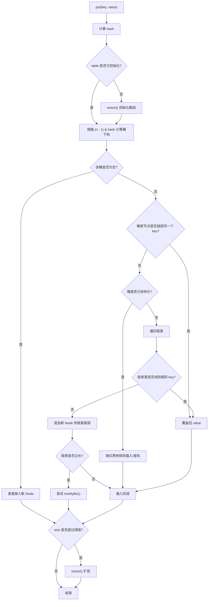

# HashMap：从 Node、put 到 hash/equals 的协作机制

这篇文档的目标不是把 `HashMap` 源码逐行背下来，而是先把 4 个最容易混在一起的问题讲清楚：

- `HashMap` 里的 `Node<K,V>` 到底是什么
- 一次 `put()` 大致会经历什么流程
- 为什么底层数组长度总是 `2` 的幂
- `hashCode()` 和 `equals()` 在 `HashMap` 里到底是怎么配合工作的

如果你只想先记住一句话，可以先记这个版本：

- `HashMap` 的底层可以先理解成“数组 + 桶内节点结构”；`Node` 是每个键值对的存储单元，`hash` 用来快速定位桶，`equals` 用来在桶内确认是不是同一个 key

---

## 1. 先回答问题：HashMap 里的 `Node` 是什么

`HashMap` 的底层核心字段可以先抽象成这样：

```java
Node<K,V>[] table;
```

这里的 `table` 是一个数组，数组的每个位置都叫一个 bucket（桶）。  
而 `Node<K,V>`，就是桶里真正存放数据的基本单元。

一个 `Node` 代表一条键值对映射：

- 一个 `key`
- 一个 `value`
- 这个 `key` 对应的哈希值 `hash`
- 指向同桶下一个节点的 `next`

可以先把它理解成：

```text
Node
  ├── hash
  ├── key
  ├── value
  └── next
```

也就是说：

- `HashMap` 不是直接把键值对“平铺”在数组里
- 数组里放的是节点引用
- 节点里才真正保存键值对数据

### 1.1 为什么需要 `Node`

因为不同的 key 经过哈希计算后，可能会落到同一个桶里。  
这就是哈希冲突。

例如：

```text
table
  [0] -> null
  [1] -> Node("name", "Tom")
  [2] -> Node("age", 18) -> Node("city", "Beijing")
  [3] -> null
```

上图里：

- `table[1]` 这个桶里只有一个节点
- `table[2]` 这个桶里有两个节点，说明发生了哈希冲突
- 第二个节点通过第一个节点的 `next` 串起来

所以 `Node` 的职责非常明确：

- 表示一个键值对
- 在桶内把冲突元素串起来

### 1.2 这段源码里的字段分别表示什么

你贴的这段 `Node<K,V>` 源码里，最关键的是这 4 个字段：

- `hash`：当前 key 的哈希值
- `key`：键
- `value`：值
- `next`：同一个桶里的下一个节点

其中 `hash` 要注意一点：

- 它通常不是“原始的 `key.hashCode()` 直接照存”
- 在 JDK 8 的 `HashMap` 里，通常会先做一次扰动处理，再把结果存在 `hash` 里

这样做的目的，是让高位信息也参与桶定位，减少低位分布不好时的碰撞。

### 1.3 为什么 `Node` 要实现 `Map.Entry<K,V>`

因为从语义上说，一个节点本身就是一条 `key -> value` 映射。  
所以 `Node` 直接实现了 `Map.Entry<K,V>`，这样它天然就能提供：

- `getKey()`
- `getValue()`
- `setValue()`
- `equals()`
- `hashCode()`

也就是说：

- 从 `HashMap` 内部看，它是一个存储节点
- 从 `Map` 接口语义看，它也是一个 entry

### 1.4 `Node` 和 `TreeNode` 的关系

在 JDK 8 以后，如果某个桶里的链表太长，查询性能会下降。  
这时 `HashMap` 不会一直保留链表，而是可能把它转成红黑树。

所以你可以先把 `HashMap` 的桶内结构理解成两种形态：

- 冲突不严重时：`Node` 链表
- 冲突严重时：`TreeNode` 红黑树

也就是说，`Node` 是基础形态，`TreeNode` 是高冲突场景下的增强形态。

---

## 2. 用一张图看懂 `HashMap` 的整体结构

可以把 `HashMap` 的底层先画成这样：

```text
table
  [0] -> null
  [1] -> Node(hash=..., key="A", value=10, next=null)
  [2] -> Node(hash=..., key="B", value=20, next=...)
                 |
                 v
         Node(hash=..., key="C", value=30, next=null)
  [3] -> null
  [4] -> Node(hash=..., key="D", value=40, next=null)
```

这个结构里有三层意思：

1. `table` 是一个数组
2. 每个数组位置是一个桶
3. 桶里存的是节点；如果冲突，就通过 `next` 串成链表

查找一个 key 时，`HashMap` 并不是把整个数组、整个链表都扫一遍，而是：

1. 先根据哈希值算出桶下标
2. 只去对应的那个桶里找
3. 在那个桶里再逐个比较节点

这也是哈希表效率高的根本原因：

- 先通过哈希快速缩小范围
- 再在局部范围内做精确比较

---

## 3. `HashMap.put()` 的源码流程图

先讲结论：`put()` 不是简单地“塞进去”。  
它至少要完成这几件事：

1. 为 key 计算哈希值
2. 决定该进哪个桶
3. 处理桶为空、键重复、链表冲突、树冲突等不同情况
4. 插入后检查是否需要扩容

### 3.1 先看一个简化版流程

把 JDK 8 的 `put()` 主流程简化后，可以理解成下面这样：



这张图里最关键的是两句话：

- 如果桶里没有元素，直接新建 `Node`
- 如果桶里已经有元素，就先判断是不是同一个 key；不是的话再处理冲突

### 3.2 `put()` 的关键步骤拆解

#### 第一步：计算 `hash`

`HashMap` 会先根据 key 算出哈希值。

- 如果 key 是 `null`，JDK 8 里会把它当作 `hash = 0`
- 如果 key 非空，会基于 `key.hashCode()` 做一次扰动处理

这一步的目的，不只是“拿到哈希值”，更重要的是让桶分布更均匀。

#### 第二步：如果数组还没初始化，先初始化

`HashMap` 的底层数组并不一定在构造函数里立刻创建。  
很多时候它是惰性初始化的，也就是第一次真正插入数据时再分配数组。

所以 `put()` 一开始通常会先判断：

- `table == null`
- 或者 `table.length == 0`

如果还没准备好，就会先走一次 `resize()`，把数组建出来。

#### 第三步：根据哈希值算桶下标

核心公式是：

```java
(n - 1) & hash
```

其中：

- `n` 是数组长度
- `hash` 是当前 key 的哈希值

这一步不是用 `% n` 取模，而是用位运算。  
为什么可以这么做，后面第 4 节会专门讲。

#### 第四步：如果桶是空的，直接插入

这是最理想的情况：

- 对应桶里还没有任何节点
- 直接创建一个新的 `Node` 放进去

这种情况不需要比较 `equals()`，也不需要遍历链表或树。

#### 第五步：如果桶不为空，先判断是不是同一个 key

如果桶里已经有元素，先看桶首节点是不是目标 key。  
典型判断逻辑可以理解成：

```java
p.hash == hash && (p.key == key || key.equals(p.key))
```

这里其实用了两层判断：

- 先比 `hash`
- 再比 `equals`

原因很简单：

- `hash` 不同，一定不是同一个 key
- `hash` 相同，也还不能直接认定是同一个 key，还要再走 `equals`

如果判断出来是同一个 key，那么 `put()` 不会新增节点，而是覆盖旧的 `value`。

#### 第六步：如果不是同一个 key，就处理冲突

这时会分两种情况：

- 这个桶已经树化了，按红黑树规则查找或插入
- 这个桶还是链表，就沿着 `next` 一路往后找

链表场景下又会分两种结果：

- 找到了相同 key：覆盖 value
- 没找到相同 key：在链表尾部追加一个新节点

#### 第七步：链表太长时，可能转红黑树

JDK 8 以后，`HashMap` 会在链表过长时尝试树化。  
常见记忆方式可以先记住这两个数字：

- 链表长度达到 `8` 左右，开始考虑树化
- 数组容量至少要达到 `64`，才真正树化

如果数组还太小，`HashMap` 往往更倾向于先扩容，而不是急着树化。

这是因为：

- 小数组下的长链表，很多时候是“桶太少”导致的
- 扩容之后，元素可能会被重新打散，链表自然就变短了

#### 第八步：插入完成后检查是否需要扩容

插入新节点后，`HashMap` 会检查当前元素个数是否超过阈值 `threshold`。

这个阈值通常和负载因子有关：

```text
threshold = capacity * loadFactor
```

默认情况下：

- `loadFactor = 0.75`

如果 `size > threshold`，就会触发扩容。

---

## 4. 为什么 `HashMap` 的数组长度总是 `2` 的幂

这是 `HashMap` 最经典、也最值得理解的设计点之一。

### 4.1 直接原因：可以用位运算快速算桶下标

当数组长度 `n` 是 `2` 的幂时：

```text
n = 16  ->  n - 1 = 15  ->  二进制 1111
n = 32  ->  n - 1 = 31  ->  二进制 11111
```

这时用下面这个公式：

```java
(n - 1) & hash
```

就等价于“取哈希值的低若干位作为数组下标”。

例如：

```text
n        = 16
n - 1    = 15     = 0000 1111
hash     = 182    = 1011 0110
index    = hash & (n - 1)
         = 1011 0110
         & 0000 1111
         = 0000 0110
         = 6
```

这样做有两个好处：

- 比 `% n` 更快，位运算开销更低
- 实现简单，分布特征也更可控

### 4.2 如果长度不是 `2` 的幂，会发生什么

假设数组长度是 `10`：

```text
n        = 10
n - 1    = 9      = 1001
```

这时 `(n - 1) & hash` 只会保留非常有限的位模式，很多桶根本不容易被命中。  
结果就是：

- 某些下标更容易被用到
- 某些下标使用率偏低
- 冲突概率变高

也就是说，如果数组长度不是 `2` 的幂，位运算分桶这套机制就不自然了。

### 4.3 更深一层的原因：扩容后的迁移非常高效

`HashMap` 扩容时，容量通常翻倍：

```text
16 -> 32
32 -> 64
64 -> 128
```

如果容量始终保持 `2` 的幂，那么扩容时元素的新位置有一个非常漂亮的性质：

- 要么还在原索引
- 要么移动到 `原索引 + oldCap`

判断公式可以理解成：

```java
(hash & oldCap) == 0
```

如果结果是 `0`：

- 元素留在原桶

如果结果不是 `0`：

- 元素移动到 `原索引 + oldCap`

这意味着扩容时不需要把每个 key 全量重算一遍复杂位置逻辑，只需要根据某一位是 `0` 还是 `1` 来拆分链表。

可以把扩容拆桶理解成这样：

```text
旧桶 j
  ├── 低位链（lo） -> 还留在 j
  └── 高位链（hi） -> 移到 j + oldCap
```

这就是为什么 `HashMap` 的扩容实现能相对高效：

- 不是“完全重新洗牌”
- 而是按新增出来的那一位把原桶拆成两半

### 4.4 一句话总结这件事

数组长度保持为 `2` 的幂，不只是“为了快一点”，而是同时服务于：

- 更自然的位运算分桶
- 更均匀的桶利用率
- 更高效的扩容迁移

---

## 5. `hashCode()` 和 `equals()` 在 `HashMap` 里是怎么配合工作的

这部分如果不讲透，`HashMap` 很容易学成“会用但解释不清”。

先给一句最简版结论：

- `hashCode()` 负责缩小查找范围
- `equals()` 负责在候选范围内做最终确认

### 5.1 `hashCode()` 负责“先去哪个桶”

当你执行：

```java
map.put(key, value);
map.get(key);
```

`HashMap` 第一件事不是比 `equals()`，而是先算哈希值，再决定应该去哪个桶。

也就是说：

- `hashCode()` 决定“先去哪里找”
- 它的作用是快速定位，不是最终判定相等

### 5.2 `equals()` 负责“桶里是不是同一个 key”

当多个 key 落到同一个桶时，仅靠 `hashCode()` 已经不够了。  
因为可能出现这种情况：

- 两个对象的 `hashCode()` 相同
- 但它们并不是同一个 key

所以到了桶里，`HashMap` 还要继续用 `equals()` 做精确判断。

也就是说：

- `hashCode()` 相同，只是“你们可能要放在一起比一下”
- `equals()` 为 `true`，才表示“你们真的是同一个 key”

### 5.3 `put()` 和 `get()` 是怎么同时依赖这两个方法的

可以把 `put()` 的判断逻辑先抽象成这样：

```text
1. 算 key 的 hash
2. 找到目标桶
3. 在该桶里遍历节点
4. 先比较节点 hash
5. hash 相同后，再比较 equals
6. equals 为 true，说明是同一个 key
```

`get()` 也是类似逻辑：

```text
1. 算查询 key 的 hash
2. 找到目标桶
3. 在桶里逐个比较节点
4. 先看 hash 是否一致
5. 再看 equals 是否成立
6. 找到后返回对应 value
```

所以真正的协作关系是：

- `hashCode()` 决定大方向
- `equals()` 负责最终拍板

### 5.4 必须满足的约定：相等对象必须有相同哈希值

如果两个对象通过 `equals()` 判断为相等，那么它们的 `hashCode()` 必须相同。  
这是使用 `HashMap` 的基本契约。

也就是：

```text
如果 a.equals(b) == true
那么必须有 a.hashCode() == b.hashCode()
```

反过来则不成立：

```text
a.hashCode() == b.hashCode()
并不一定代表 a.equals(b) == true
```

这是因为：

- 哈希冲突是允许存在的
- `HashMap` 设计时就默认冲突可能发生

### 5.5 为什么“只重写 `equals()` 不重写 `hashCode()`”会出问题

这是初学 `HashMap` 时最常见的坑。

例如下面这个类：

```java
public final class UserKey {
    private final Long id;

    public UserKey(Long id) {
        this.id = id;
    }

    @Override
    public boolean equals(Object o) {
        if (this == o) {
            return true;
        }
        if (!(o instanceof UserKey)) {
            return false;
        }
        UserKey other = (UserKey) o;
        return Objects.equals(id, other.id);
    }
}
```

如果这里只重写了 `equals()`，却没有重写 `hashCode()`，就可能出现：

- 两个 `id` 相同的对象，`equals()` 返回 `true`
- 但它们的 `hashCode()` 不同
- 于是它们会落到不同的桶里

结果就是：

- `put(new UserKey(1L), "A")` 成功放进一个桶
- `get(new UserKey(1L))` 却可能去另一个桶找
- 结果返回 `null`

也就是说，对 `HashMap` 来说，问题不是“`equals()` 写错了”，而是：

- 你让两个语义上相等的 key，走进了不同的桶

正确做法是同时重写：

```java
@Override
public int hashCode() {
    return Objects.hash(id);
}
```

### 5.6 为什么“哈希值相同”不代表“对象相等”

这同样很重要。

例如：

- `"Aa"` 和 `"BB"` 在 Java 里就有经典的哈希冲突示例

它们可能有相同的 `hashCode()`，但这并不代表它们是同一个字符串。  
因此 `HashMap` 绝不会只靠 `hashCode()` 判定相等。

它只会这样使用：

- `hashCode()` 相同 -> 值得继续比较
- `equals()` 为真 -> 才算同一个 key

### 5.7 为什么可变 key 很危险

如果一个对象作为 key 放入 `HashMap` 后，参与 `equals()` 或 `hashCode()` 的字段又被修改，就会产生很诡异的问题。

例如：

1. 对象放进去时，`hashCode()` 对应桶下标是 `3`
2. 放进去之后，你把 key 的关键字段改了
3. 现在这个对象重新计算出来的 `hashCode()` 可能对应桶下标 `7`
4. 但它在 `HashMap` 里仍然躺在旧桶 `3`

结果就是：

- 你拿同一个对象去 `get()`，都可能找不到
- `containsKey()` 结果也可能让人误解

所以一个很实用的经验是：

- 作为 `HashMap` key 的对象，最好是不可变的

---

## 6. 把这 4 个问题串起来看一遍

现在把 `Node`、`put()`、`2` 的幂、`hash/equals` 串成一条主线：

1. `HashMap` 底层有一个数组 `table`
2. 每个数组位置是一个桶，桶里放的是 `Node`
3. 一个 `Node` 表示一个键值对，同时通过 `next` 处理冲突
4. `put()` 时，先根据 `hashCode()` 算 hash，再决定桶下标
5. 桶下标的计算依赖 `(n - 1) & hash`，所以数组长度设计成 `2` 的幂
6. 如果桶里已经有元素，就在桶内用 `equals()` 确认是不是同一个 key
7. 冲突严重时，桶内结构可能从链表升级为红黑树
8. 元素过多时，`HashMap` 会扩容，而 `2` 的幂让扩容拆桶更高效

这条主线里最容易记错的只有一件事：

- `hashCode()` 从来不是“判定两个 key 相等”的最终依据

它只是 `HashMap` 的第一层过滤器。

---

## 7. 常见误区

### 误区 1：`Node` 就只是“链表节点”

不完全对。

更准确地说：

- `Node` 是 `HashMap` 的基本存储节点
- 在链表场景下，它确实表现为链表节点
- 但当桶树化后，结构会升级为 `TreeNode`

所以“链表节点”只是它在某些桶内形态下的表现，不是全部语义。

### 误区 2：两个 key 的 `hashCode()` 相同，它们就是同一个 key

不对。

正确理解是：

- `hashCode()` 相同，只表示它们可能进入同一个桶
- 是否为同一个 key，要看 `equals()`

### 误区 3：只要重写了 `equals()` 就够了

不对。

正确做法是：

- 重写了 `equals()`，通常就必须同时重写 `hashCode()`

否则 `HashMap` 的行为会和你的业务语义不一致。

### 误区 4：`HashMap` 总是 O(1)

也不够严谨。

平均情况下，它接近 `O(1)`；但在碰撞严重时：

- 链表场景会退化
- 树化后会更接近 `O(log n)`

所以更准确的说法是：

- `HashMap` 的平均性能通常很好，但实现里做了很多设计来避免最坏情况恶化

---

## 8. 最后再总结一次

如果把全文压成 6 句话，可以这样记：

1. `Node` 是 `HashMap` 中真正存放一个键值对的基本单元。
2. `Node` 里的 `next` 用来把同一个桶中的冲突元素串起来。
3. `put()` 的核心流程是：算 hash、找桶、处理冲突、必要时扩容或树化。
4. 数组长度保持为 `2` 的幂，是为了让 `(n - 1) & hash` 分桶和扩容拆桶都更高效。
5. `hashCode()` 负责先把查找范围缩小到一个桶，`equals()` 负责在桶内确认是不是同一个 key。
6. 设计 `HashMap` key 时，最重要的实践是：重写 `equals()` 时同步重写 `hashCode()`，并尽量使用不可变 key。
