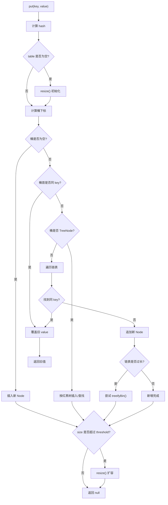

# HashMap 源码导读：从 get/put 到 resize/treeify

这篇文档以 **JDK 8 `java.util.HashMap`** 为主线，目标不是逐行背源码，而是建立一条能讲清楚源码的路径：

```text
结构模型 -> hash 定位 -> get 查找 -> put 写入 -> resize 扩容 -> treeify 树化
```

文末会单独对比 JDK 8 / 17 / 21。先给结论：

- JDK 8 已经形成了今天常说的 `HashMap` 核心结构：数组 + 链表 + 红黑树
- JDK 17 / 21 的核心查找、插入、扩容、树化思路仍然延续 JDK 8
- JDK 17 / 21 有一些实现组织和 API 变化，但不是把 `HashMap` 的核心模型推翻重写

还有一个命名问题先说清楚：`HashMap` 没有 `set(key, value)` 方法。日常说的“set 一个值”，在 `HashMap` 里通常对应的是：

```java
map.put(key, value);
```

`Map.Entry#setValue()` 是另一回事：它是修改某个 entry 节点里的 value，不是 `HashMap` 对外的写入入口。

---

## 1. 先建立心智模型

`HashMap` 不是“一个数组里直接放键值对”。它更准确的模型是：

```text
table 数组
  ├── bucket 0 -> null
  ├── bucket 1 -> Node -> Node -> ...
  ├── bucket 2 -> TreeNode 红黑树
  └── bucket 3 -> Node
```

可以先记住 4 个词：

- `table`：底层数组
- `bucket`：数组中的一个位置，也叫桶
- `Node`：真正保存一条 key-value 映射的节点
- `next`：同一个桶中发生冲突时，用来串起后续节点

JDK 8 的 `Node` 可以简化成：

```java
static class Node<K,V> implements Map.Entry<K,V> {
    final int hash;
    final K key;
    V value;
    Node<K,V> next;
}
```

每个节点至少保存 4 类信息：

```text
hash  -> key 的扰动后哈希值
key   -> 键
value -> 值
next  -> 同桶下一个节点
```

为什么需要 `next`？因为不同 key 可能落到同一个桶里，这就是哈希冲突。

例如：

```text
table
  [0] -> null
  [1] -> Node("name", "Tom")
  [2] -> Node("age", 18) -> Node("city", "Beijing")
  [3] -> null
```

这里 `age` 和 `city` 落到了同一个桶，第二个节点通过第一个节点的 `next` 串起来。

JDK 8 以后，桶内结构不只有链表。如果某个桶的冲突非常严重，链表可能升级成红黑树：

```text
冲突少：bucket -> Node -> Node
冲突多：bucket -> TreeNode 红黑树
```

所以 `HashMap` 的整体结构可以理解成：

```text
数组负责第一层定位
链表或红黑树负责桶内冲突处理
Node 保存具体 key-value
```

---

## 2. 核心字段和常量

理解 `get()` 和 `put()` 前，先看几个核心字段。

### 2.1 `table`

```java
transient Node<K,V>[] table;
```

`table` 是底层数组。注意两点：

- 它是懒初始化的，默认构造一个 `HashMap` 时不一定马上分配数组
- 一旦分配，数组长度总是 `2` 的幂

懒初始化的结果是：第一次真正 `put()` 时，源码里经常会先判断 `table` 是否为空，如果为空就调用 `resize()` 初始化。

### 2.2 `size`

```java
transient int size;
```

`size` 表示当前 map 中有多少个 key-value 映射。

它不是 `table.length`。

```text
table.length -> 桶数组容量
size         -> 已存放的映射数量
```

例如底层数组长度可能是 `16`，但当前只放了 `3` 个 key。

### 2.3 `threshold` 和 `loadFactor`

```java
int threshold;
final float loadFactor;
```

`threshold` 是下一次触发扩容的阈值，通常可以理解成：

```text
threshold = capacity * loadFactor
```

默认负载因子是：

```java
static final float DEFAULT_LOAD_FACTOR = 0.75f;
```

默认容量是：

```java
static final int DEFAULT_INITIAL_CAPACITY = 1 << 4; // 16
```

所以默认第一次初始化后，常见阈值是：

```text
16 * 0.75 = 12
```

当新增节点后 `size > threshold`，就会触发扩容。

### 2.4 `modCount`

```java
transient int modCount;
```

`modCount` 记录结构性修改次数。

结构性修改包括：

- 新增映射
- 删除映射
- 扩容
- 其他会改变内部结构的操作

它主要服务于 fail-fast 迭代器。比如你在遍历 `HashMap` 时又直接修改 map，迭代器可能发现 `modCount` 变了，然后抛出 `ConcurrentModificationException`。

但要注意：fail-fast 不是线程安全机制。它只是尽早暴露错误使用，不保证并发正确性。

### 2.5 树化相关常量

JDK 8 里有 3 个常被问到的值：

```java
static final int TREEIFY_THRESHOLD = 8;
static final int UNTREEIFY_THRESHOLD = 6;
static final int MIN_TREEIFY_CAPACITY = 64;
```

它们分别表示：

- `TREEIFY_THRESHOLD = 8`：桶内链表长度达到一定程度时，考虑树化
- `UNTREEIFY_THRESHOLD = 6`：节点变少时，树可能退回链表
- `MIN_TREEIFY_CAPACITY = 64`：数组容量至少达到 64，才真正优先树化

这 3 个值要一起理解，不能只背“链表长度到 8 就树化”。如果数组还太小，`HashMap` 通常会优先扩容，而不是立刻树化。

---

## 3. hash 和桶下标是怎么来的

无论 `get()` 还是 `put()`，第一步都是根据 key 找到目标桶。

JDK 8 的 `hash(Object key)` 可以简化成：

```java
static final int hash(Object key) {
    int h;
    return (key == null) ? 0 : (h = key.hashCode()) ^ (h >>> 16);
}
```

这段逻辑有 3 层含义。

### 3.1 `null` key 的 hash 是 0

`HashMap` 允许一个 `null` key。

当 key 是 `null` 时：

```text
hash = 0
```

如果数组长度是 `16`，桶下标就是：

```text
(16 - 1) & 0 = 0
```

所以 `null` key 通常会落到 `table[0]` 这个桶里。

### 3.2 非空 key 会先调用 `hashCode()`

非空 key 会先调用：

```java
key.hashCode()
```

但 `HashMap` 不是把这个原始值直接拿去算桶下标，而是做了一次扰动：

```java
h ^ (h >>> 16)
```

意思是把高 16 位的信息混到低 16 位里。

为什么要这么做？因为桶下标是这样算的：

```java
(n - 1) & hash
```

当数组长度 `n` 比较小时，真正参与下标计算的主要是 hash 的低位。如果某些 key 的低位分布不好，就容易集中到少数桶里。扰动处理能让高位也参与进来，减少系统性碰撞。

### 3.3 为什么是 `(n - 1) & hash`

`HashMap` 的数组长度总是 `2` 的幂。

例如：

```text
n = 16
n - 1 = 15 = 0000 1111
```

这时：

```java
(n - 1) & hash
```

就等价于取 hash 的低若干位作为下标。

例子：

```text
n        = 16
n - 1    = 15       = 0000 1111
hash     = 182      = 1011 0110
index    = hash & 15
         = 1011 0110
         & 0000 1111
         = 0000 0110
         = 6
```

这样做有两个好处：

- 位运算比取模更便宜
- 扩容时可以用非常简单的规则拆桶

如果数组长度不是 `2` 的幂，`(n - 1) & hash` 就不能自然覆盖所有桶，分布会变差。

---

## 4. `get()` 源码主线

JDK 8 的 `get()` 入口很短：

```java
public V get(Object key) {
    Node<K,V> e;
    return (e = getNode(hash(key), key)) == null ? null : e.value;
}
```

一句话概括：

```text
get(key) -> hash(key) -> getNode(hash, key) -> 返回节点 value
```

真正查找节点的是 `getNode(...)`。

### 4.1 `getNode` 先做前置判断

查找前先确认：

```text
table 不为空
table.length > 0
目标桶不为空
```

如果这些条件不满足，直接返回 `null`。

目标桶的位置是：

```java
tab[(n - 1) & hash]
```

这一步把查找范围从“整个 map”缩小到“一个桶”。

### 4.2 先检查桶首节点

JDK 8 的 `getNode` 会先检查桶首节点。判断逻辑可以简化成：

```java
first.hash == hash
&& (first.key == key || key.equals(first.key))
```

这里不是直接调用 `equals()`，而是按顺序做几层过滤：

1. 先看 hash 是否相同
2. 再看是不是同一个对象引用
3. 最后才调用 `equals()`

这么做的原因是：

- hash 不同，一定不是同一个 key
- 同一个对象引用，当然是同一个 key
- hash 相同但不是同一个引用时，才需要 `equals()` 精确判断

先查桶首节点也有性能意义：很多桶里只有一个节点，即使有冲突，命中桶首节点也很常见。

### 4.3 再查树或链表

如果桶首节点不是目标 key，并且后面还有节点，源码会分两种情况：

```text
桶已经树化 -> 按红黑树查找
桶仍是链表 -> 顺着 next 逐个比较
```

链表查找仍然是同一套判断：

```text
hash 相同
并且 key 是同一个引用或 equals 成立
```

所以 `get()` 的平均复杂度接近 `O(1)`，但不是“永远一次就能找到”。如果冲突很多，链表会变长；树化后，桶内查找更接近 `O(log n)`。

### 4.4 `get()` 返回 `null` 的歧义

`HashMap` 允许 value 为 `null`。

所以：

```java
map.get(key) == null
```

可能有两种含义：

```text
1. 这个 key 不存在
2. 这个 key 存在，但它的 value 就是 null
```

如果要区分这两种情况，要用：

```java
map.containsKey(key)
```

---

## 5. `put()` 源码主线

JDK 8 的 `put()` 入口也很短：

```java
public V put(K key, V value) {
    return putVal(hash(key), key, value, false, true);
}
```

普通 `put()` 调用 `putVal(...)` 时，`onlyIfAbsent` 是 `false`。这意味着如果 key 已经存在，会覆盖旧 value。

`putVal(...)` 的主线可以概括成：

```text
确保 table 存在
算桶下标
空桶直接插入
非空桶判断是否同一个 key
同 key 覆盖旧值
不同 key 走链表或红黑树
新增后检查是否扩容
```

也可以画成：



### 5.1 第一步：确保 `table` 已初始化

JDK 8 的默认构造函数不会立刻创建底层数组。第一次 `put()` 时，如果 `table` 还是空的，会先调用 `resize()`：

```text
table == null 或 table.length == 0 -> resize()
```

默认情况下，第一次初始化会得到：

```text
capacity = 16
threshold = 12
```

### 5.2 第二步：定位桶

有了数组长度 `n` 和 key 的 hash 后，桶下标仍然是：

```java
i = (n - 1) & hash
```

如果桶为空：

```text
tab[i] = new Node(hash, key, value, null)
```

这是最简单的插入路径，不需要遍历，也不需要比较 `equals()`。

### 5.3 第三步：桶不为空时处理冲突

桶不为空时，先检查桶首节点是不是同一个 key：

```java
p.hash == hash
&& (p.key == key || key.equals(p.key))
```

如果是同一个 key，后面会覆盖 value。

如果桶首节点不是同一个 key，再分两种情况：

```text
桶是 TreeNode -> 调红黑树插入/查找
桶是普通 Node 链表 -> 顺着 next 遍历
```

链表遍历时也有两个结果：

- 找到相同 key：停止遍历，后面覆盖 value
- 一直没找到：在链表尾部追加新节点

### 5.4 已有 key：覆盖 value，返回旧值

如果 `putVal(...)` 找到了旧节点，逻辑可以理解成：

```text
oldValue = oldNode.value
oldNode.value = newValue
return oldValue
```

所以：

```java
Map<String, Integer> map = new HashMap<>();
map.put("A", 1);
Integer old = map.put("A", 2);
```

结果是：

```text
old == 1
map.get("A") == 2
```

第二次 `put("A", 2)` 不会新增一个 `"A"` 节点，只会覆盖旧节点的 value。

### 5.5 新 key：新增节点，必要时扩容

如果没有找到旧节点，说明这是一个新 key。

新增节点后，`HashMap` 会：

1. `modCount++`
2. `size++`
3. 判断 `size > threshold`
4. 超过阈值就 `resize()`
5. 返回 `null`

所以：

```java
map.put("B", 3)
```

如果 `"B"` 原来不存在，返回值是 `null`。

注意这个 `null` 也有歧义：它既可能表示原来没有这个 key，也可能表示原来这个 key 对应的旧 value 就是 `null`。

---

## 6. `resize()` 为什么高效

`resize()` 做两件事：

```text
1. 初始化 table
2. 扩容并迁移旧节点
```

### 6.1 初始化

如果旧数组不存在：

```text
oldCap = 0
oldThr = 0
```

默认初始化为：

```text
newCap = 16
newThr = 12
```

这对应默认容量 `16` 和负载因子 `0.75`。

### 6.2 扩容翻倍

如果旧数组已经存在，常规扩容是容量翻倍：

```text
16 -> 32 -> 64 -> 128
```

阈值也通常跟着翻倍：

```text
12 -> 24 -> 48 -> 96
```

容量保持 `2` 的幂，是后面高效拆桶的前提。

### 6.3 lo / hi 拆桶

JDK 8 的扩容迁移不是把每个 key 的位置完全重新算一遍，而是利用“容量翻倍”这个事实。

旧桶 `j` 里的节点，扩容后只有两个去向：

```text
留在 j
移动到 j + oldCap
```

判断依据是：

```java
(e.hash & oldCap) == 0
```

如果结果是 `0`，节点进入低位链 `lo`，留在原下标：

```text
newTab[j] = loHead
```

否则进入高位链 `hi`，移动到：

```text
newTab[j + oldCap] = hiHead
```

可以画成：

```text
扩容前：

oldTab[j]
  -> A -> B -> C -> D

扩容后：

newTab[j]
  -> A -> C

newTab[j + oldCap]
  -> B -> D
```

这就是为什么 `HashMap` 要坚持数组长度是 `2` 的幂：扩容时只需要看新增出来的那一位，就能决定节点留在原位置还是移动到高位位置。

### 6.4 扩容不是完全重新洗牌

JDK 8 的扩容更像“拆桶”，不是“全量洗牌”。

它有几个重要特点：

- 不需要重新调用 key 的 `hashCode()`
- 不需要为每个节点重新走完整插入流程
- 同一个旧桶会拆成低位链和高位链
- JDK 8 迁移链表时会保持相对顺序

这个设计让扩容仍然是昂贵操作，但比粗暴重建更高效。

---

## 7. `treeify` 为什么不是一上来就树化

JDK 8 引入红黑树，是为了解决极端哈希冲突下链表过长的问题。

但 `HashMap` 并不会一遇到冲突就树化。

### 7.1 树化触发点

链表插入新节点时，源码会统计桶内节点数量。当链表达到一定长度时，调用：

```java
treeifyBin(tab, hash)
```

常见阈值是：

```text
TREEIFY_THRESHOLD = 8
```

但这不等于“链表长度到 8 一定变红黑树”。

### 7.2 table 太小时优先扩容

`treeifyBin(...)` 里还有一个判断：

```text
如果 table.length < MIN_TREEIFY_CAPACITY，就 resize()
```

而：

```text
MIN_TREEIFY_CAPACITY = 64
```

原因是：小数组里的长链表，很多时候不是 key 的 hash 真的差，而是桶数量太少。先扩容，节点可能自然分散到更多桶里，链表就变短了。

所以可以记成：

```text
桶内冲突严重 + table 足够大 -> 树化
桶内冲突严重 + table 还很小 -> 优先扩容
```

### 7.3 为什么还会退回链表

红黑树节点比普通 `Node` 更重，维护成本也更高。

当节点变少时，继续保留红黑树没有必要，所以 JDK 8 还有：

```text
UNTREEIFY_THRESHOLD = 6
```

在 resize 拆分树节点或删除节点后，如果树节点数量变少，可能退回普通链表。

### 7.4 这部分应该怎么记

不要把树化背成一个孤立规则：

```text
链表长度到 8 就树化
```

更准确的说法是：

```text
当某个桶内冲突足够严重时，JDK 8 HashMap 会尝试把链表转成红黑树；
但如果当前 table 容量还小于 64，会优先扩容。
```

---

## 8. JDK 8 / 17 / 21 差异对比

这一节只讲会影响理解的差异，不做逐行源码对照。

### 8.1 总体结论

JDK 8 / 17 / 21 的 `HashMap` 核心模型保持稳定：

```text
table 数组
Node 链表
TreeNode 红黑树
hash 扰动
(n - 1) & hash 定位桶
putVal 插入/覆盖
resize lo/hi 拆桶
treeifyBin 树化
```

所以学 `HashMap` 时，JDK 8 仍然是很好的主线版本。

### 8.2 差异表

| 维度 | JDK 8 | JDK 17 | JDK 21 |
| --- | --- | --- | --- |
| 核心结构 | `table + Node + TreeNode` | 基本相同 | 基本相同 |
| 默认容量 | `16` | `16` | `16` |
| 默认负载因子 | `0.75` | `0.75` | `0.75` |
| 树化阈值 | `8` | `8` | `8` |
| 退树化阈值 | `6` | `6` | `6` |
| 最小树化容量 | `64` | `64` | `64` |
| `getNode` 形态 | `getNode(int hash, Object key)` | `getNode(Object key)` | `getNode(Object key)` |
| `putVal` 主体 | JDK 8 主线逻辑 | 基本延续 | 基本延续 |
| `resize` 思路 | lo / hi 拆桶 | 基本延续 | 基本延续 |
| 新建容量辅助 API | 无 `newHashMap` | 无 `newHashMap` | 有 `HashMap.newHashMap(int)` |

### 8.3 `getNode` 的组织变化

JDK 8：

```java
get(key) -> getNode(hash(key), key)
```

也就是说，`get()` 先算 hash，再把 hash 和 key 一起传给 `getNode(...)`。

JDK 17 / 21：

```java
get(key) -> getNode(key)
```

`getNode(...)` 内部再计算 hash。

这属于实现组织调整，不改变查找模型。核心仍然是：

```text
算 hash
用 (n - 1) & hash 定位桶
先查桶首节点
再查树或链表
```

### 8.4 JDK 21 的 `newHashMap(int)`

JDK 21 里可以看到：

```java
HashMap.newHashMap(int numMappings)
```

它的目标是：根据预期映射数量创建一个容量合适的 `HashMap`，尽量减少后续插入时的扩容。

例如你预期要放 `1000` 个元素，传统写法容易误把 `1000` 当成初始容量：

```java
new HashMap<>(1000)
```

但这个构造参数是 capacity，不是 expected mappings。考虑默认负载因子 `0.75` 后，要容纳 `1000` 个映射且尽量不扩容，容量通常要更大。

`newHashMap(int)` 解决的是这个使用层面的易错点，不是改变底层 `get/put/resize/treeify` 模型。

### 8.5 如何正确看待版本差异

不要把版本差异理解成：

```text
JDK 17 / 21 推翻了 JDK 8 HashMap
```

更准确的是：

```text
JDK 8 奠定了当前 HashMap 的核心结构；
JDK 17 / 21 继续沿用这个核心结构；
后续版本主要在源码组织、注释、API 辅助方法和细节上演进。
```

---

## 9. 三个机制型例子

这里不讲普通 API 用法，只放能暴露机制的例子。

### 9.1 `get()` 返回 `null` 的歧义

```java
Map<String, Integer> map = new HashMap<>();
map.put("A", null);

System.out.println(map.get("A")); // null
System.out.println(map.get("B")); // null
```

这两个 `null` 含义不同：

```text
get("A") -> key 存在，但 value 是 null
get("B") -> key 不存在
```

要区分它们：

```java
map.containsKey("A"); // true
map.containsKey("B"); // false
```

### 9.2 hash 冲突不等于 key 相等

Java 里有一个经典例子：

```java
String a = "Aa";
String b = "BB";

System.out.println(a.hashCode() == b.hashCode()); // true
System.out.println(a.equals(b));                  // false
```

如果放进 `HashMap`：

```java
Map<String, Integer> map = new HashMap<>();
map.put("Aa", 1);
map.put("BB", 2);
```

它们 hash 相同，可能落到同一个桶里，但不会互相覆盖。因为 `HashMap` 最终确认 key 时还要看 `equals()`。

所以判断链路是：

```text
hash 相同 -> 只是候选
equals 为 true -> 才是同一个 key
```

### 9.3 可变 key 为什么危险

假设有一个 key 类型：

```java
final class UserKey {
    int id;

    UserKey(int id) {
        this.id = id;
    }

    @Override
    public boolean equals(Object o) {
        if (!(o instanceof UserKey)) {
            return false;
        }
        return id == ((UserKey) o).id;
    }

    @Override
    public int hashCode() {
        return id;
    }
}
```

然后这样用：

```java
Map<UserKey, String> map = new HashMap<>();
UserKey key = new UserKey(1);

map.put(key, "Alice");
key.id = 2;

System.out.println(map.get(key)); // 可能找不到
```

问题在于：

```text
put 时根据 id=1 算桶下标
修改后 get 时根据 id=2 算桶下标
节点还躺在旧桶里
查询却去了新桶
```

所以作为 `HashMap` key 的对象，最好是不可变的。至少不要修改参与 `equals()` 和 `hashCode()` 的字段。

---

## 10. 常见误区

### 误区 1：`hashCode()` 相同就是同一个 key

不对。

`hashCode()` 相同只说明它们可能进入同一个桶，最终还要看 `equals()`。

正确表达：

```text
hashCode 用来缩小范围
equals 用来最终确认
```

### 误区 2：只重写 `equals()` 不重写 `hashCode()` 也没事

不对。

如果两个对象 `equals()` 为 `true`，它们的 `hashCode()` 必须相同。否则它们可能被放到不同桶里，导致明明业务上是同一个 key，`get()` 却找不到。

正确做法：

```text
重写 equals 时，通常必须同步重写 hashCode
```

### 误区 3：`HashMap` 永远是 `O(1)`

不严谨。

平均情况下，`HashMap` 的 `get/put` 接近 `O(1)`。但如果大量 key 落到同一个桶里，桶内查找就会变慢。

JDK 8 引入红黑树，就是为了在极端冲突场景下避免链表过长。

更准确的表达是：

```text
HashMap 平均性能接近 O(1)，但实现里需要处理冲突、扩容和树化等复杂情况。
```

### 误区 4：fail-fast 等于线程安全

不对。

`modCount` 和 fail-fast 迭代器只是帮助尽早发现错误修改。它不是锁，也不是并发控制协议。

并发读写 `HashMap` 时，应该使用外部同步，或者选择并发容器。

### 误区 5：`HashMap` 遍历顺序稳定

不要依赖 `HashMap` 的遍历顺序。

即使某次运行看起来顺序固定，也可能因为这些因素改变：

- 容量不同
- 扩容时机不同
- key 的 hash 分布不同
- JDK 实现细节变化

如果业务需要稳定顺序，就不应该依赖 `HashMap` 的偶然表现。

---

## 11. 最后总结

把 `HashMap` 压成一条主线，可以这样记：

1. `HashMap` 底层是 `table` 数组，每个位置是一个桶。
2. 桶里放的是 `Node`，冲突时通过 `next` 串成链表。
3. JDK 8 以后，冲突严重时桶内链表可能升级成红黑树。
4. `hash(Object key)` 会对 `hashCode()` 做扰动，让高位也参与下标计算。
5. 桶下标通过 `(n - 1) & hash` 得到，所以容量必须保持为 `2` 的幂。
6. `get()` 是先定位桶，再检查桶首节点，最后在链表或红黑树中查找。
7. `put()` 是先定位桶，空桶插入，重复 key 覆盖，冲突时链表追加或树插入。
8. 新增节点后，如果 `size > threshold`，会触发 `resize()`。
9. JDK 8 扩容时通过 lo / hi 拆桶，让节点留在原下标或移动到 `原下标 + oldCap`。
10. 树化不是只看链表长度，还要看 table 容量是否至少达到 `64`。
11. JDK 17 / 21 没有推翻 JDK 8 的核心模型，更多是实现组织和 API 层面的演进。

如果要用面试表达，可以说：

```text
HashMap 在 JDK 8 中底层是数组 + 链表 + 红黑树。
put 时先对 key 的 hashCode 做扰动，再用 (n - 1) & hash 定位桶。
桶为空就插入新节点；桶不为空就先比较 hash，再用 == 或 equals 判断是否同一个 key。
如果找到旧 key，就覆盖 value；如果没找到，就插入到链表或红黑树中。
插入后 size 超过 threshold 会扩容。
扩容时容量翻倍，旧桶中的节点根据 hash & oldCap 拆成低位链和高位链，
要么留在原下标，要么移动到原下标 + oldCap。
get 的逻辑类似，也是先定位桶，再在桶首、链表或红黑树中查找目标 key。
```
