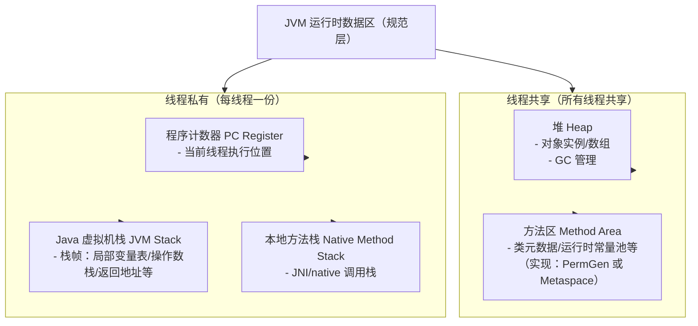
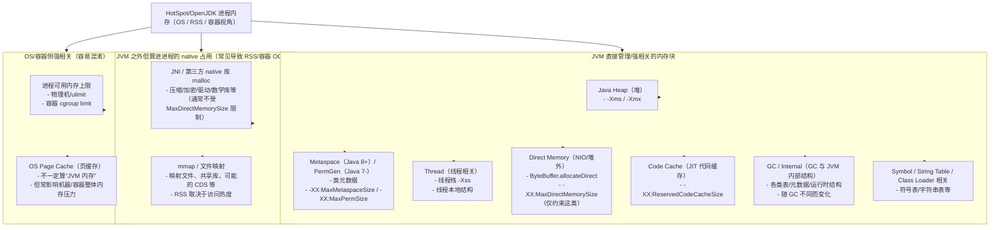

# Java 内存：规范视角 vs HotSpot 进程视角

本模块用两套口径讲清楚“Java 内存”：

1. **Java 虚拟机规范层面的运行时数据区**：偏概念与抽象，回答“JVM 逻辑上有哪些区域”。
2. **HotSpot/OpenJDK 实现层面的进程内存组成**：偏排查与落地，回答“为什么 `RSS` 很大 / 容器为什么 OOM / 堆没满为什么也会炸”。

文档里配了可运行的 demo（见本文“学习辅助代码”一节），便于你把概念和真实指标对应起来。

---

## 1) JVM 规范：运行时数据区（概念模块）

### 线程共享

- **堆（Heap）**：对象实例、数组的主要存储区域，通常由 GC 管理。
- **方法区（Method Area）**：类元数据、运行时常量池等（不同实现可能对应 PermGen / Metaspace 等）。

### 线程私有

- **程序计数器（PC Register）**：当前线程执行字节码的位置指示。
- **Java 虚拟机栈（JVM Stack）**：每次方法调用的栈帧（局部变量表、操作数栈、返回地址等）。
- **本地方法栈（Native Method Stack）**：JNI/native 方法调用相关的栈。



如果只按 JVM 规范口径抽象，可以先记成这棵树：

```text
JVM 运行时数据区
├── 线程共享
│   ├── Java 堆
│   └── 方法区
│       └── 运行时常量池
│
└── 线程私有
    ├── 程序计数器
    ├── Java 虚拟机栈
    └── 本地方法栈
```

---

## 2) HotSpot/OpenJDK：进程内存（OS/RSS/容器视角）

从操作系统/容器视角看，一个 JVM 进程的内存通常由多块组成（其中部分可通过 JVM 参数设置上限，但并不存在一个“统一的本地内存默认上限”来覆盖所有 native 分配）。

常见模块包括：

- **Java Heap（堆）**：`-Xms` / `-Xmx`
- **Metaspace（Java 8+）/ PermGen（Java 7-）**：类元数据相关；`-XX:MaxMetaspaceSize` / `-XX:MaxPermSize`
- **Thread（线程相关）**：线程栈与线程本地结构；`-Xss` 影响很大
- **Direct Memory（NIO/堆外）**：`ByteBuffer.allocateDirect()` 等；`-XX:MaxDirectMemorySize`（只覆盖部分堆外场景）
- **Code Cache（JIT 代码缓存）**：`-XX:ReservedCodeCacheSize`
- **GC / Internal（GC 与 JVM 内部结构）**：随 GC 实现（G1/ZGC/Shenandoah 等）而变化
- **Symbol / String Table / Class Loader 相关**：符号表、字符串表等
- **JNI / 第三方 native 库 malloc**：不一定受 Direct Memory 上限约束
- **mmap / 文件映射**：内存映射文件、共享库等，`RSS` 与访问热度相关
- **OS Page Cache / cgroup limit**：常影响“容器整体内存压力”，但不完全等同于“JVM 自己用掉的内存”

一个更完整的 HotSpot JDK 8+ 视角可以这样看：

```text
JVM 进程内存
├── Java 堆 Heap
│   ├── 对象实例
│   ├── 数组对象
│   ├── String 对象
│   ├── java.lang.Class 对象
│   ├── static 字段的实际值，通常关联在 Class 对象上
│   └── GC 分代/分区结构
│       ├── Young 区 / Eden / Survivor    # 传统分代 GC
│       ├── Old 区
│       └── Region / Humongous Region     # G1、ZGC 等更偏向分区模型
│
├── 每个 Java 线程私有区域
│   ├── 程序计数器 PC Register
│   ├── Java 虚拟机栈 JVM Stack
│   │   └── 栈帧 Stack Frame
│   │       ├── 局部变量表
│   │       ├── 操作数栈
│   │       ├── 动态链接
│   │       └── 方法返回地址/返回信息
│   └── 本地方法栈 Native Method Stack
│
└── 本地内存 Native Memory，也叫堆外内存的一大类
    ├── 元空间 Metaspace
    │   ├── 类元信息 Klass Metadata
    │   ├── 字段元信息
    │   ├── 方法元信息
    │   ├── 方法字节码相关结构
    │   ├── 运行时常量池元数据
    │   ├── 注解信息
    │   ├── 方法表 / 接口表
    │   └── 类加载器相关数据
    │
    ├── Compressed Class Space
    │   └── 压缩类指针相关的类元数据区域
    │
    ├── Code Cache
    │   ├── JIT 编译后的机器码
    │   ├── JVM 生成的 stub 代码
    │   └── 方法入口跳转代码等
    │
    ├── Direct Memory
    │   └── DirectByteBuffer 背后的堆外内存
    │
    ├── 线程栈实际占用的 native memory
    │   ├── Java 线程栈
    │   └── native 调用栈
    │
    ├── GC 内部数据结构
    │   ├── Card Table
    │   ├── Remembered Set
    │   ├── Mark Bitmap
    │   ├── GC worker 线程数据
    │   └── 各类 GC 辅助结构
    │
    ├── JVM 内部 C/C++ 结构
    │   ├── Symbol Table
    │   ├── String Table
    │   ├── System Dictionary
    │   ├── ClassLoaderData
    │   └── JVM 内部管理对象
    │
    ├── JNI / native 库申请的内存
    ├── NIO / mmap 映射文件内存
    ├── JIT 编译器自身工作内存
    └── JVM 进程、动态链接库、运行时环境本身占用的内存
```



两张图的关系可以概括为：

```text
JVM 规范中的方法区
        ↓ HotSpot JDK 8+ 的实现
Metaspace + Compressed Class Space + 部分堆中 Class 对象配合实现
```

几个容易混淆的点：

- **方法区是规范概念**，元空间是 HotSpot 对方法区的主要实现。
- **元空间属于本地内存**，不属于 Java 堆。
- **`java.lang.Class` 对象在堆里**，但它指向的类元数据主要在元空间里。
- **Direct Memory 不是方法区**，它也是本地内存的一部分。
- **线程栈在规范里是 JVM 栈/本地方法栈，但实际内存来自 native memory。**
- **Code Cache 存 JIT 后的机器码，不是 Java 堆，也通常不算元空间。**

一句话版：

> Java 堆主要放对象；线程栈放方法调用过程；元空间放类元数据；Code Cache 放 JIT 后的机器码；Direct Memory 放堆外 buffer；这些堆外部分总体都属于 JVM 进程使用的本地内存。

---

## 3) 学习辅助代码（本模块自带 demo）

> 注意：某些 demo 会刻意制造 OOM/异常，建议在可控环境运行，并先从较小参数开始。

### 编译

在项目根目录执行：

```bash
mvn -pl jvm -am -DskipTests package
```

### 运行入口

```bash
java -cp jvm/target/classes yier.bubu.jvm.JvmMemoryApp help
```

### 3.1 inspect：打印 JVM/内存/线程/类加载概要

```bash
java -cp jvm/target/classes yier.bubu.jvm.JvmMemoryApp inspect
```

### 3.2 direct：分配 DirectByteBuffer，观察 Direct Memory 增长

推荐用一个很小的 direct 上限来快速观察现象：

```bash
java -XX:MaxDirectMemorySize=64m -cp jvm/target/classes yier.bubu.jvm.JvmMemoryApp direct --mb 96 --chunkMb 4 --touch true --reportEvery 4
```

### 3.3 metaspace：加载大量类，观察 Metaspace 增长

```bash
java -XX:MaxMetaspaceSize=64m -cp jvm/target/classes yier.bubu.jvm.JvmMemoryApp metaspace --count 20000 --reportEvery 1000
```

### 3.4 stack：触发 StackOverflowError，观察 -Xss 的影响

```bash
java -Xss256k -cp jvm/target/classes yier.bubu.jvm.JvmMemoryApp stack
```

---

## 4)（可选）观察/排查的常用命令

- 打印 JVM 最终采用的 flags（含人体工学结果）：`java -XX:+PrintFlagsFinal -version`
- Native Memory Tracking（NMT，需启动时开启，注意开销）：
  - 启动参数：`-XX:+UnlockDiagnosticVMOptions -XX:NativeMemoryTracking=summary`
  - 查看：`jcmd <pid> VM.native_memory summary`
