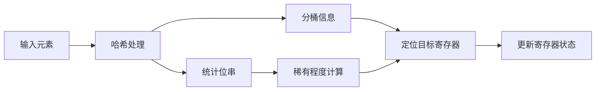

# HyperLogLog：从零理解“为什么能用很小内存估算去重数”

本文档从“完全没接触过 `HyperLogLog`”的角度重新解释它。目标不是把论文公式背下来，而是先把下面这件事真正讲清楚：

- 为什么只看一些哈希值里的“前导零模式”，就能估算集合里大概有多少个不同元素

如果你只想先记一句话，可以先记这个版本：

- `HyperLogLog` 不存每个元素，只存一小组寄存器；这些寄存器记录“我已经见过多稀有的哈希模式”，再用这些稀有程度反推 distinct count

它解决的问题是：

- 一共有多少个**不同**元素
- 也就是近似版的 `COUNT(DISTINCT x)`

它不解决的问题是：

- 某个元素是否存在于集合中

当前仓库已经有一个学习向、单机内存版本的实现：

- `redis/src/main/java/yier/bubu/redis/hyperloglog/HyperLogLog.java`

本文仍然主要讲概念、直觉和公式来源，而不是逐行解释实现细节。

如果你是第一次读，建议按下面这个顺序抓主线：

- `1 ~ 4`：先建立“哈希 -> 稀有事件 -> 分桶 -> 主公式”的直觉
- `5`：再看误差、内存和分段修正
- `6 ~ 7`：最后看工程价值、适用边界和开源实现
- `附录 A`：只在你想继续细读 Redis 源码时再看

## 1. 问题背景与核心直觉

### 1.1 先说它到底在解决什么问题

假设你有这些问题：

- 一天内有多少个不同用户访问过系统
- 一小时内出现了多少个不同 IP
- 一个日志流里大概有多少个不同请求 ID
- 一张大表某列的 distinct 值大概有多少个

最直接的精确做法是：

```java
Set<String> distinct = new HashSet<String>();
distinct.add(value);
long exact = distinct.size();
```

这个做法的优点是简单、准确。

但它有几个直接问题：

- 不同元素越多，`HashSet` 越大
- 如果 distinct 有几千万、几亿，内存成本会很高
- 分布式场景下很难合并，因为你要合并的是“大量具体元素”

`HyperLogLog` 的态度是：

- 我不要精确保存“谁出现过”
- 我只要一个“数量大概是多少”的答案
- 为了这个答案，我只保留很小的统计摘要

所以它是一种典型的概率数据结构。

### 1.2 为什么不能直接看原始值，必须先做哈希

`HyperLogLog` 的一切直觉都建立在一个前提上：

- 先把每个元素映射成“均匀随机”的比特串

例如：

```text
user-1001 -> 001101011001...
user-1002 -> 101001100010...
user-1003 -> 000000111010...
```

为什么一定要哈希？

因为原始数据本身通常没有“均匀随机”这个性质。

比如用户 ID 可能是连续整数：

```text
1001
1002
1003
1004
```

如果你直接对原值做二进制分析，那么：

- 数据分布会带有业务含义
- 这些数字模式不服从 `HyperLogLog` 需要的概率假设

哈希的作用就是把“业务值”变成“近似随机样本”。

只有在“哈希结果足够均匀”的前提下，后面关于前导零的概率讨论才成立。

### 1.3 为什么“前导零”会和基数大小有关

这是 `HyperLogLog` 最核心的直觉。

假设哈希值真的是均匀随机的二进制串，那么：

- 以 `1` 开头的概率是 $\frac{1}{2}$
- 以 `01` 开头的概率是 $\frac{1}{4}$
- 以 `001` 开头的概率是 $\frac{1}{8}$
- 以 `0001` 开头的概率是 $\frac{1}{16}$
- 以前导 $r$ 个 `0` 后跟一个 `1` 开头的概率大约是 $2^{-(r+1)}$

换句话说：

- 前导零越多，模式越稀有

可以把它理解成“抽到稀有事件”。

比如：

- 抽到前导 0 个数至少为 1 的值，不稀有
- 抽到前导 0 个数至少为 5 的值，已经比较稀有
- 抽到前导 0 个数至少为 20 的值，非常稀有

那么样本量和稀有事件之间是什么关系？

- 如果你只看了 10 个不同元素，碰到非常稀有模式的机会很小
- 如果你看了 100 万个不同元素，碰到更稀有模式的机会就高得多

所以：

- 你见过的元素越多
- 你越可能在哈希结果里看到“很长前导零”

这就是 `HyperLogLog` 的根。

## 2. 从单寄存器到分桶估计

### 2.1 先不要分桶，先看一个最简化版本

为了先把直觉打通，我们先假设有一个极简数据结构：

- 它只有一个寄存器
- 这个寄存器只记录：目前见过的最大前导零位置

记这个值为 $R$。

例如目前见到的哈希值是：

```text
100101...
001011...
000001...
010111...
```

那么：

- 第 1 个值前导零个数是 0
- 第 2 个值前导零个数是 2
- 第 3 个值前导零个数是 5
- 第 4 个值前导零个数是 1

所以我们会记录：

$$
R = 5
$$

为什么可以用它估 distinct count？

因为“至少有 $R$ 个前导零”的概率大约是：

$$
2^{-R}
$$

如果你一共看了 $n$ 个不同元素，那么“期望看到多少次这种稀有事件”大约是：

$$
n \cdot 2^{-R}
$$

如果某个稀有程度刚好开始“有机会被看到一次”，通常意味着：

$$
n \cdot 2^{-R} \approx 1
$$

移项后：

$$
n \approx 2^R
$$

这就是最原始的直觉。

#### 2.1.1 一个具体代入

如果最大前导零位置大约是 $R = 10$，那么：

$$
2^{10} = 1024
$$

这说明：

- distinct count 大概在 1000 这个量级

如果最大前导零位置大约是 $R = 20$，那么：

$$
2^{20} = 1{,}048{,}576
$$

这说明：

- distinct count 大概在百万量级

所以这里真正被估出来的不是“精确个数”，而是“数量级”。

#### 2.1.2 为什么这个版本不够好

只用一个寄存器的问题很明显：

- 它完全依赖一个最大值
- 极端值会把结果拉得很厉害

比如某次运气特别好，刚好多碰到一个非常稀有的哈希模式：

- 结果会被高估

反过来，如果样本刚好没碰到那个模式：

- 结果又会被低估

所以：

- 单寄存器版本方向是对的
- 但波动太大，不适合工程使用

`HyperLogLog` 的主要改进，就是把这件事“做很多次，再综合起来”。

### 2.2 从一个寄存器，到很多寄存器

这一步非常重要。

`HyperLogLog` 不再只维护一个 $R$，而是维护很多个寄存器：

```text
M[0], M[1], ..., M[m - 1]
```

可以把它理解成：

- 我把所有元素先随机分到很多桶里
- 每个桶内部，再做刚才那个“记录最大前导零位置”的小实验

这样做的好处是：

- 一个桶偶然偏大，不至于决定整体结果
- 一个桶偶然偏小，也不至于毁掉整体结果
- 最后可以把很多局部观测综合起来，得到更稳定的估算

这和统计学里“做很多次观测，比只做一次观测更稳”是同一个思路。

### 2.3 分桶以后，每个桶到底在估什么

这也是很多人第一次读 HLL 时最容易断掉的一步。

设：

- 全局 distinct count 是 $n$
- 一共有 $m$ 个桶

因为哈希均匀，元素会大致平均地落到每个桶里。

所以每个桶接收到的不同元素个数，大约是：

$$
\frac{n}{m}
$$

这件事非常关键。

因为每个桶内部做的，正是“单寄存器版本”的那个实验，所以每个桶记录的寄存器值，记作 $M_j$；在实现里可以写成 `M[j]`。它大致反映的是：

$$
2^{M_j} \approx \frac{n}{m}
$$

也就是说：

- 单个寄存器并不是直接在估全局 $n$
- 它更像是在估“自己这个桶里大概有多少不同元素”
- 而这个数量级大致是 $\frac{n}{m}$

于是就能看出为什么最后需要把桶内信息“再乘回一个 $m$”：

- 因为每个桶估的是局部规模
- 最终要还原的是全局规模

## 3. 数据结构与更新过程

### 3.1 HLL 的数据结构长什么样

正式一点说，`HyperLogLog` 维护的是一个寄存器数组：

```text
M[0], M[1], ..., M[m - 1]
```

其中：

- $m = 2^p$
- $p$ 表示用多少位来选桶

例如：

- $p = 4$ 时，$m = 16$
- $p = 10$ 时，$m = 1024$
- $p = 14$ 时，$m = 16384$

`m` 越大：

- 内存越高
- 误差越低

这里最适合的表达方式，不是流程图，而是直接把它看成一个“固定长度数组”：

```text
整体结构：

          桶号
           ↓
        0      1      2            j           m-1
     +------+------+------+--...--+------+--...--+
     | M[0] | M[1] | M[2] |       | M[j] |       |
     +------+------+------+--...--+------+--...--+

单个桶 `j` 在**逻辑语义**上，就是数组里的这一个格子：

     +------+
     | M[j] |
     +------+
```

这个格子里只有一个寄存器值：

- `j` 说明这是第 `j` 个桶
- `M[j]` 是一个很小的整数
- `M[j]` 表示“第 `j` 个桶当前见过的最大稀有程度”
- 它不保存元素列表、元素个数，也不保存每个元素的哈希值

如果你从**底层存储编码**去看，那么这个整数当然可以再用一小组 bit 来表示。

例如，假设某个实现里每个寄存器用 6 bit 编码，且当前：

```text
M[j] = 5
```

那么它在底层内存里可能长这样：

```text
单个桶 j 的底层 bit 表示：

+---+---+---+---+---+---+
| 0 | 0 | 0 | 1 | 0 | 1 |
+---+---+---+---+---+---+

这 6 个 bit 作为一个整体，编码出的寄存器值是 5
```

这里最容易混淆的点是：

- **逻辑上**：单个桶 = 一个寄存器值 = 一个整数
- **存储上**：这个整数可以用若干个 bit 编码
- 但这几个 bit 只是“这个整数的二进制表示”
- 它们不是像 Bloom Filter 那样“每一位各自表示一个独立含义的 0/1 标志”

把这个含义再说死一点：

```text
如果 M[7] = 5，它的意思不是：
- “桶 7 里有 5 个元素”
- “桶 7 里第 5 个元素被占用了”

它真正的意思是：
- 第 7 个桶对应的那个寄存器，
- 当前记录的最大稀有程度是 5
```

从这个结构视角看，最重要的事实是三个：

- 一个 `HyperLogLog` 实例的核心状态，不是原始元素集合，而是“参数 + 寄存器数组”
- 寄存器数组是固定长度的，因此内存大小主要由参数决定，而不是由 distinct 个数决定
- 数组里的每个位置都对应一个桶，而每个寄存器只保存那个桶当前见过的最大稀有程度

### 3.2 处理一个元素时，HLL 做了什么

对每个元素 $x$，处理步骤可以写成：

1. 计算哈希值 $h(x)$，通常使用 64 位哈希
2. 取哈希值前 $p$ 位，得到桶号 $j$
3. 对剩余位串计算 $\rho(w)$
4. 更新寄存器：

$$
M_j \leftarrow \max(M_j, \rho(w))
$$

这里的 $\rho(w)$ 定义是：

- 剩余位串里，第一个 `1` 出现的位置
- 位置从 `1` 开始计数

所以：

- `1xxxxx...`，$\rho = 1$
- `01xxxx...`，$\rho = 2$
- `001xxx...`，$\rho = 3$
- `0001xx...`，$\rho = 4$

$\rho$ 越大，表示这个模式越稀有。

可以把“单个元素进入 HLL”理解成下面这个流程：



### 3.3 一个手工例子：一步一步更新寄存器

下面用一个非常小的玩具例子说明更新过程。

假设：

- 我们只用 8 位哈希值来演示
- 取 $p = 2$
- 所以桶数 $m = 4$
- 哈希值前 2 位用来选桶，后 6 位用来算 $\rho$

寄存器初始状态：

```text
M = [0, 0, 0, 0]
```

现在依次处理 6 个元素。下面这些“哈希值”只是为了演示手工计算，真实系统里会用更长的哈希。

| 元素 | 哈希值 | 桶号前缀 | 剩余位串 | $\rho$ | 寄存器变化 |
| --- | --- | --- | --- | --- | --- |
| A | `00 101101` | `00` -> 桶 0 | `101101` | 1 | `M[0] = max(0, 1) = 1` |
| B | `00 001000` | `00` -> 桶 0 | `001000` | 3 | `M[0] = max(1, 3) = 3` |
| C | `01 000100` | `01` -> 桶 1 | `000100` | 4 | `M[1] = max(0, 4) = 4` |
| D | `10 110000` | `10` -> 桶 2 | `110000` | 1 | `M[2] = max(0, 1) = 1` |
| E | `11 011111` | `11` -> 桶 3 | `011111` | 2 | `M[3] = max(0, 2) = 2` |
| F | `11 000010` | `11` -> 桶 3 | `000010` | 5 | `M[3] = max(2, 5) = 5` |

最后寄存器变成：

```text
M = [3, 4, 1, 5]
```

你现在可以这样读这个结果：

- 桶 0 里，我见过一个相对较稀有的模式，稀有程度大概到 $\rho = 3$
- 桶 1 里更稀有，到了 $\rho = 4$
- 桶 2 里比较普通，只有 $\rho = 1$
- 桶 3 里很稀有，到了 $\rho = 5$

这 4 个数字还不是 distinct count，但它们已经是一份压缩摘要了。

#### 3.3.1 为什么同一个元素重复来很多次影响不大

如果同一个元素再次出现：

- 它的哈希值不会变
- 它落入的桶不会变
- 它的 $\rho$ 不会变

于是最多只是重复执行：

```text
M[j] = max(M[j], 同一个值)
```

寄存器通常不会继续变大。

所以 `HyperLogLog` 天然对重复元素不敏感。

这也是它非常适合做 distinct count 的原因之一。

### 3.4 到这里为止，你应该先抓住哪三个点

看到这里，先不要急着记公式，先抓住下面三个事实：

1. 长前导零是稀有事件
2. 样本越多，越容易碰到更稀有的事件
3. 每个桶都在独立地记录“我这里见过多稀有的模式”

后面的公式，本质上只是把这三件事变成一个稳定的估算器。

## 4. 主公式是怎么来的

### 4.1 为什么从寄存器值能反推数量级

回到第 6 节的关键桥梁。

对第 $j$ 个桶来说：

- 它看到的不同元素数，大致是 $\frac{n}{m}$

而单寄存器直觉告诉我们：

- 如果最大稀有程度是 $M_j$
- 那么该桶内的 distinct 数量级可以粗略看成 $2^{M_j}$

所以可以把：

$$
2^{M_j}
$$

理解成：

- 第 $j$ 个桶对“局部 distinct count”的一个粗略估计

设这个局部估计值为：

$$
x_j = 2^{M_j}
$$

那么：

- $x_j$ 大致在估 $\frac{n}{m}$

这时我们要做两件事：

1. 把很多个 $x_j$ 合并成一个更稳的“单桶平均估计”
2. 再从“单桶平均估计”还原成全局 $n$

### 4.2 为什么不是直接取平均，而是要用调和平均

这是主公式最容易让人发懵的地方。

如果我们已经有很多个局部估计：

$$
x_j = 2^{M_j}
$$

最自然的想法会是：

- 那就把这些 $x_j$ 做个平均

但算术平均有个问题：

- 它对大值特别敏感

而 `HyperLogLog` 的寄存器正好又很容易出现偶然偏大的值：

- 某个桶可能恰好碰到一个特别稀有的模式

如果直接做算术平均：

- 结果会被这些极端值拉得过高

因此 HLL 选择的是更稳健的聚合方式：

- 用调和平均

这里先单独解释一下：**调和平均到底是什么**。

我们平时最熟悉的“平均数”其实是**算术平均**：

$$
\operatorname{AM}(x_1,\ldots,x_m) = \frac{1}{m}\sum_{j=1}^{m} x_j
$$

它的直觉是：

- 先把所有值直接加起来
- 再除以个数

而**调和平均**不是直接平均原值，而是：

- 先把每个值取倒数
- 对这些倒数做算术平均
- 再把结果整体取倒数

所以它的定义是：

$$
\operatorname{HM}(x_1,\ldots,x_m) = \frac{m}{\sum_{j=1}^{m} \frac{1}{x_j}}
$$

如果你觉得这个定义有点绕，可以先记一个非常重要的性质：

- 当一组数里出现“特别大的离群值”时，算术平均很容易被它拉高
- 调和平均对这种偏大的离群值没那么敏感

为什么？

因为大值在取倒数之后会变成一个很小的数。

例如：

$$
x = [4,\,4,\,4,\,64]
$$

如果用算术平均：

$$
\operatorname{AM} = \frac{4 + 4 + 4 + 64}{4} = 19
$$

这个结果被那个 `64` 强烈拉高了，看起来已经离“多数值都在 4 左右”很远。

如果用调和平均：

$$
\operatorname{HM}
= \frac{4}{\frac{1}{4} + \frac{1}{4} + \frac{1}{4} + \frac{1}{64}}
= \frac{4}{0.765625}
\approx 5.22
$$

这个结果仍然被 `64` 影响到了，但影响明显小得多，结果还比较接近那三个更“典型”的值。

所以可以把它们的差异粗略理解成：

- 算术平均更容易被“大值”拉着走
- 调和平均更愿意贴近“一组值里更常见、更典型的规模”

这正好符合 HLL 的需要。

在 HLL 里：

- 每个桶给出一个局部估计 $x_j = 2^{M_j}$
- 某个桶可能因为运气好，恰好碰到一个非常稀有的模式
- 于是这个桶的 $x_j$ 会显得异常大

如果直接做算术平均：

- 这些偶然偏大的桶会把整体估计拉高

如果改用调和平均：

- 这些偏大的 $x_j$ 在取倒数后会变得很小
- 它们对整体结果的拉动会被明显削弱

所以 HLL 不是“随便挑了一个平均数”，而是在刻意选择一种：

- 对异常偏大局部估计更不敏感
- 更适合把很多桶的局部规模汇总成稳定全局估计

因为这里：

$$
x_j = 2^{M_j}
$$

所以：

$$
\frac{1}{x_j} = 2^{-M_j}
$$

于是调和平均就变成：

$$
\operatorname{HM} = \frac{m}{\sum_{j=0}^{m-1} 2^{-M_j}}
$$

这一步其实非常重要，因为它直接解释了：

- 为什么公式里会出现 $\sum_{j=0}^{m-1} 2^{-M_j}$

不是凭空冒出来的。

它来自于：

- “每个桶估一个局部规模”
- “局部规模用 $2^{M_j}$ 表示”
- “为了抗极端值，用调和平均而不是算术平均”

### 4.3 从调和平均怎么走到主公式

上一节得到的是：

$$
\operatorname{HM} = \frac{m}{\sum_{j=0}^{m-1} 2^{-M_j}}
$$

这个 `HM` 估的是什么？

- 它估的是“每个桶里的平均 distinct 数量级”
- 也就是大约在估 $\frac{n}{m}$

但我们真正要的是全局 distinct count $n$。

所以要再乘一个 $m$：

$$
n \approx m \cdot \operatorname{HM}
$$

代入上式：

$$
n \approx m \cdot \frac{m}{\sum_{j=0}^{m-1} 2^{-M_j}}
$$

得到：

$$
n \approx \frac{m^2}{\sum_{j=0}^{m-1} 2^{-M_j}}
$$

到这里为止，其实已经非常接近经典公式了。

但真实的统计分布还会带来系统性偏差，所以还要再乘一个校正常数 $\alpha_m$：

$$
E = \alpha_m \cdot \frac{m^2}{\sum_{j=0}^{m-1} 2^{-M_j}}
$$

这就是你平时看到的经典估算式。

#### 4.3.1 $\alpha_m$ 是什么

$\alpha_m$ 不是神秘魔法，它只是一个偏差校正系数。

常见取值是：

- $m = 16$ 时，$\alpha_m = 0.673$
- $m = 32$ 时，$\alpha_m = 0.697$
- $m = 64$ 时，$\alpha_m = 0.709$
- 更大的 $m$ 常用近似：

$$
\alpha_m \approx \frac{0.7213}{1 + \frac{1.079}{m}}
$$

你不需要死记这些常数，但要知道它存在的原因：

- 原始估算器不是完全无偏
- $\alpha_m$ 用来把系统偏差压回去

### 4.4 现在回头再看主公式，就不应该那么跳了

重新读一遍：

$$
E = \alpha_m \cdot \frac{m^2}{\sum_{j=0}^{m-1} 2^{-M_j}}
$$

你可以把它拆成四段理解：

1. $M_j$：第 $j$ 个桶里见过的最大稀有程度
2. $2^{M_j}$：第 $j$ 个桶对局部 distinct 数量级的估计
3. $\sum_{j=0}^{m-1} 2^{-M_j}$：对这些局部估计做调和平均
4. $m^2$ 和 $\alpha_m$：把“局部平均”扩回全局，并做偏差修正

如果把这个桥搭通，HLL 的公式就不再像“从天上掉下来”。

再用一张图把“寄存器值如何变成最终估计值”串起来：


## 5. 手算、误差与修正

### 5.1 拿一组具体数据，手算一次最终估计值

前面我们已经知道：

- 寄存器数组是 HLL 的压缩摘要
- 最终估计公式是：

$$
E = \alpha_m \cdot \frac{m^2}{\sum_{j=0}^{m-1} 2^{-M_j}}
$$

下面就拿一组具体寄存器值，完整手算一次。

为了便于手工演算，我们沿用一个 16 桶的玩具寄存器数组：

```text
M = [3, 5, 2, 4, 4, 1, 6, 3, 2, 5, 6, 4, 3, 2, 5, 4]
```

这里：

- $m = 16$
- 所以 $m^2 = 256$
- 对于 $m = 16$，经典常数 $\alpha_m = 0.673$

#### 5.1.1 第一步：先算 $\sum_{j=0}^{m-1} 2^{-M_j}$

逐项去算当然可以，但手算时更适合先按“寄存器值出现了几次”分组。

观察上面的数组：

- `1` 出现了 1 次
- `2` 出现了 3 次
- `3` 出现了 3 次
- `4` 出现了 4 次
- `5` 出现了 3 次
- `6` 出现了 2 次

所以：

$$
\begin{aligned}
\sum_{j=0}^{m-1} 2^{-M_j}
&= 1 \cdot 2^{-1} + 3 \cdot 2^{-2} + 3 \cdot 2^{-3} + 4 \cdot 2^{-4} + 3 \cdot 2^{-5} + 2 \cdot 2^{-6} \\
&= 1 \cdot \frac{1}{2} + 3 \cdot \frac{1}{4} + 3 \cdot \frac{1}{8} + 4 \cdot \frac{1}{16} + 3 \cdot \frac{1}{32} + 2 \cdot \frac{1}{64} \\
&= 0.5 + 0.75 + 0.375 + 0.25 + 0.09375 + 0.03125 \\
&= 2.0
\end{aligned}
$$

#### 5.1.2 第二步：先算未校正估计值

先暂时不乘 $\alpha_m$，只看：

$$
\frac{m^2}{\sum_{j=0}^{m-1} 2^{-M_j}}
$$

代入：

$$
\frac{256}{2.0} = 128
$$

这个 `128` 可以理解为：

- 如果不做统计偏差修正，当前这组寄存器会给出一个大约 `128` 的估计

#### 5.1.3 第三步：乘上偏差修正常数 $\alpha_m$

现在把 $\alpha_m = 0.673$ 乘进去：

$$
E = 0.673 \cdot 128
$$

计算结果：

$$
E = 86.144
$$

所以这一组寄存器对应的最终估计值大约是：

$$
\operatorname{distinct\_count} \approx 86
$$

真实系统里通常会返回一个整数形式的结果，但你要知道它本质上是：

- 一个近似估计
- 不是精确去重值

#### 5.1.4 第四步：判断要不要用小范围修正

手算到这里还差最后一个判断：

- 这次要不要启用 `Linear Counting` 小范围修正

经典 HLL 的常见判断思路是：

- 如果估计值比较小，并且还有不少空桶，再考虑小范围修正

而在我们这个例子里：

- 当前 $m = 16$
- 原始估计值已经在几十量级
- 并且寄存器数组里没有 `0`

所以这个玩具例子里，不会触发“空桶很多”的那套小范围修正逻辑。

换句话说：

- 这次手算结果就停在 `86` 左右

#### 5.1.5 用一句话回看这次手算

这次完整手算做的事情，其实只有四步：

1. 拿到寄存器数组 `M`
2. 算出 $\sum_{j=0}^{m-1} 2^{-M_j}$
3. 用 $\frac{m^2}{\sum 2^{-M_j}}$ 得到未校正估计值
4. 再乘 $\alpha_m$ 得到最终估计

如果你能把这一节手算顺下来，那么前面的公式就已经不再只是“接受它”，而是已经能自己算一遍了。

### 5.2 为什么误差近似为 $\frac{1.04}{\sqrt{m}}$

`HyperLogLog` 的标准误差近似是：

$$
\operatorname{SE} \approx \frac{1.04}{\sqrt{m}}
$$

这里 `m` 是寄存器个数。

这意味着：

- $m = 16$，误差大约为 $26\%$
- $m = 1024$，误差大约为 $3.25\%$
- $m = 16384$，误差大约为 $0.81\%$

从工程角度看，这个结论有两个重要含义：

- 想降低误差，确实可以多开寄存器
- 但收益是平方根级别，不是线性级别

也就是说：

- 想把误差减半，往往要把寄存器数提高到原来的 4 倍

所以 HLL 的强项是：

- 用很小内存拿到“足够好”的估计

它不是：

- 用一点点内存拿到几乎零误差

### 5.3 为什么它的内存会这么省

假设：

- $p = 14$
- 那么 $m = 2^{14} = 16384$

此时它只需要维护 16384 个寄存器。

而每个寄存器保存的只是：

- 一个很小的整数
- 表示“我见过的最大 $\rho$ 是多少”

这个整数通常不需要很宽的位数。

所以整个结构的内存通常只有十几 KB 量级。

和精确去重相比：

- 精确去重要保存“元素集合”或“元素哈希集合”
- HLL 只保存“小量寄存器摘要”

所以二者的内存模型完全不同：

- 精确去重更像“distinct 越多，状态越大”
- HLL 更像“状态大小基本固定，只由精度参数决定”

### 5.4 小基数时为什么不能只用主公式

如果 distinct count 很小，会出现一个明显现象：

- 许多桶仍然是空的
- 也就是很多寄存器还是 0

这时如果你硬套主公式：

- 结果往往不够准

原因可以直觉地理解为：

- 当数据很少时，“有多少桶还没被命中”本身就是非常强的信息
- 这时继续只看极值，会浪费掉“空桶数量”这个明显信号

所以 HLL 在小范围通常会改用 `Linear Counting` 修正。

设：

- $V$ 表示仍然为 $0$ 的寄存器个数

则小范围估算常用：

$$
E_{\text{small}} = m \ln\!\left(\frac{m}{V}\right)
$$

你可以这样直觉理解它：

- 如果空桶很多，说明总元素还不多
- 如果空桶越来越少，说明 distinct 正在上升
- 小样本区间里，“桶占用率”比“极端稀有模式”更可靠

所以真实实现往往是分段的：

- 小基数区间：更相信空桶信息
- 中间区间：更相信主公式
- 非常大区间：再做额外修正

### 5.5 大基数时为什么还会有问题

另一端也有问题。

如果哈希位数有限，比如只有 32 位，那么当 distinct count 变得特别大时：

- 哈希空间本身会逐渐拥挤
- 冲突会越来越不可忽略

这时就会影响估计。

所以原始 HLL 论文除了小范围修正，也讨论了大范围修正。

现代工程实现通常会做这些事：

- 使用 64 位哈希
- 做经验偏差修正
- 在小数据量时使用稀疏表示

这类增强版本通常被称为：

- `HyperLogLog++`

## 6. 工程价值、边界与快速复盘

### 6.1 为什么它特别适合分布式系统

HLL 最强的工程特性之一是：

- 非常容易合并

假设：

- 机器 A 统计了一份 HLL
- 机器 B 统计了一份 HLL

如果你要统计两边数据并集的 distinct count，不需要回收原始元素，只需要对每个寄存器取最大值：

$$
M^{(\mathrm{union})}_j = \max\!\left(M^{(A)}_j,\, M^{(B)}_j\right)
$$

为什么这么简单？

因为每个寄存器记录的是：

- 这个桶里见过的最大 $\rho$

而并集之后：

- 这个桶里见过的最大 $\rho$
- 自然就是两边最大值的最大者

这个性质意味着：

- 分片可以各算各的
- 上层只需要做寄存器级合并
- 不需要传输原始去重集合

所以 HLL 非常适合：

- 流式计算
- 分布式日志统计
- MapReduce
- OLAP 聚合
- 多分片 distinct 汇总

### 6.2 它和精确去重相比，真正交换了什么

精确去重的特点：

- 结果 100% 准确
- 状态大小随着 distinct 个数线性增长

HLL 的特点：

- 结果是近似值
- 状态大小基本固定
- 合并成本很低

所以它做的是一个非常明确的工程交换：

- 放弃精确性
- 换低内存、低传输成本和高可扩展性

如果你的业务是：

- 账务
- 对账
- 精确报表

那就不该用 HLL。

如果你的业务是：

- UV 统计
- 流量趋势
- 指标监控
- 大盘分析

且允许 1% 左右误差，那么 HLL 往往非常合适。

### 6.3 一些常见误解

#### 6.3.1 “它是不是在做去重存储？”

不是。

它不是把元素“压缩后存起来”，而是直接丢弃元素，只保留统计摘要。

#### 6.3.2 “它能不能支持删除？”

原始 HLL 不擅长做精确删除。

因为寄存器只记最大值：

- 你知道某个桶目前最大 $\rho$ 是 $6$
- 但你不知道这个 6 是由哪些元素共同撑起来的

删掉一个元素后：

- 很难知道寄存器应不应该降回 5、4 还是别的值

#### 6.3.3 “它能不能直接算交集？”

直接算交集并不是它最擅长的事。

常见做法是借助容斥：

$$
\lvert A \cap B \rvert = \lvert A \rvert + \lvert B \rvert - \lvert A \cup B \rvert
$$

但这里三个量本身都是估计值，所以误差会叠加。

#### 6.3.4 “重复元素会不会一直把结果冲大？”

不会。

同一个元素反复到来时：

- 哈希值固定
- 桶固定
- $\rho$ 固定

所以寄存器一般不会不断增长。

### 6.4 如果你还是觉得抽象，可以用这个心智模型

把 HLL 想象成一个“稀有事件探测器阵列”。

它做的不是：

- 记住谁来过

它做的是：

- 把元素哈希后随机分流到很多桶里
- 每个桶都在观察：我这边目前已经出现过多稀有的随机模式
- 如果很多桶都已经见到了比较稀有的模式，说明整体样本量不小

所以它保存的不是“元素集合”，而是：

- 这个集合在随机空间里的覆盖深度

这个描述比“它记录前导零”更接近本质。

因为前导零只是它观测稀有事件的一种方式。

### 6.5 用伪代码把整个流程再串一次

插入一个元素：

```text
add(x):
  h = hash64(x)
  j = 前 p 位(h)
  w = 剩余位(h)
  r = ρ(w)
  M[j] = max(M[j], r)
```

估算基数：

```text
count():
  raw = α_m · m^2 / Σ_j 2^(-M[j])

  if raw 处于小基数区间并且还有很多空桶:
    return m · ln(m / V)

  if raw 处于超大区间:
    return 大范围修正后的值

  return raw
```

你会发现：

- 更新代价很低，基本是 $O(1)$
- 合并代价也低，只是逐寄存器取 `max`
- 整个结构的状态大小固定

## 7. 开源实现里的工程实践

前面 `1 ~ 6` 讲的是“原理为什么成立”和“工程上该怎么理解它的边界”。从这一节开始，重点切到一个更现实的问题：

- 成熟系统会把 `HyperLogLog` 做成什么样

### 7.1 成熟实现通常会关心什么

前面讲的是“原理为什么成立”。

但在真实系统里，团队真正关心的通常不是：

- 公式能不能背下来

而是：

- 能不能在线更新
- 能不能很便宜地合并
- 能不能序列化存盘
- 小基数时会不会浪费大量内存
- 查询时会不会因为 union 太重把系统拖慢

这也是为什么你去看成熟开源实现时，会发现大家做的重点都很像：

- 不把 HLL 当作“一个公式”
- 而是把它做成“一个可更新、可合并、可序列化的 sketch 对象”

### 7.2 Redis：把 HLL 做成在线服务里的原生计数类型

Redis 的做法非常工程化。

它不是让业务自己维护寄存器数组，而是直接给出 3 个命令：

- `PFADD`：写入观测到的元素
- `PFCOUNT`：取近似基数
- `PFMERGE`：合并多个 HLL

Redis 官方文档给出的结论是：

- 单个 HLL 最多用到大约 `12 KB` 内存
- 标准误差大约是 `0.81%`

这背后对应的实现参数也很固定：

- `p = 14`
- 一共 `16384` 个寄存器
- 每个寄存器 `6 bit`

工程上更关键的是，Redis 并不是只保留一种内存布局。

它用的是双表示：

- `sparse`：适合小基数，很多寄存器还是 `0`
- `dense`：适合较大基数，直接把寄存器压成连续内存块

这样做的原因很现实：

- 如果一个 key 只见过几十、几百个 unique，就直接给它吃满 `12 KB`，非常浪费
- 小基数时，很多寄存器仍然为 `0`，用稀疏表示更省
- 基数变大后，再自动切到 dense，更适合频繁更新和统计

Redis 官方文档还特别强调了一点：

- `PFCOUNT` 单 key 很快
- `PFCOUNT` 多 key 明显更慢

原因不是“命令名字不同”，而是工程实现不同：

- 单 key 的估计值可以缓存
- 多 key 需要现场 merge 一个临时 HLL，再现算，无法缓存

这会直接影响业务使用方式。

如果你在线上要频繁查“今天全站 UV”“本周全站 UV”，更稳的做法通常不是：

- 每次查询时临时把很多 HLL key union 一遍

而是：

- 明细维度按小时或按分片写入
- 再定时 `PFMERGE` 出日级、周级汇总 key
- 查询时尽量查已经预聚合好的单个 key

这其实就是 Redis 这类在线系统最典型的工程实践：

- 写时分散
- 读时尽量命中单个预聚合 sketch

### 7.3 Trino：把 HLL 当成可持久化的查询中间结果

Trino 的思路和 Redis 不一样。

Redis 面向在线 KV 请求；Trino 面向 SQL / OLAP 查询。

Trino 文档里最有工程价值的一点是：

- `HyperLogLog` sketch 可以序列化成 `varbinary`
- 后续查询再把它反序列化回来并 `merge()`

Trino 还明确说明：

- `HyperLogLog` 可以从 sparse 起步，必要时转为 dense
- `P4HyperLogLog` 从一开始就是 dense，并在整个生命周期里保持 dense

这代表的是另一类非常常见的工程实践：

- 先在日级任务里算 `approx_set(user_id)`
- 把 sketch 当成一列存下来
- 后面的周报、月报不再重扫明细，而是直接 merge 这些 sketch

也就是说，在数仓系统里，HLL 经常不是“一次查询的临时函数”，而是：

- 一种可存储、可复用、可上卷的中间结果格式

### 7.4 Druid + Apache DataSketches：把 sketch 做进 ingestion 流水线

Apache Druid 配合 Apache DataSketches 时，工程味更重。

它的思路不是：

- 等查询来了再做 approximate distinct

而是：

- 在 ingestion 阶段就把高基数字段 sketch 化

Druid 的 `DataSketches HLL` 模块里，比较常见的是：

- `HLLSketchBuild`：摄入时直接构建 sketch
- `HLLSketchMerge`：摄入预生成 sketch
- 查询时默认读取并 merge sketch

文档里还给出了几个直接可调的工程参数：

- `lgK`：控制 sketch 大小和精度，范围 `4..21`，默认 `12`
- `tgtHllType`：可以是 `HLL_4`、`HLL_6`、`HLL_8`，默认 `HLL_4`

它的工程意义非常明确：

- 如果某列高基数又经常拿来做 `COUNT DISTINCT`
- 那么最贵的步骤不应该留到查询时才做
- 应该尽量在 ingestion 时就把它变成 sketch 指标列

这样做的好处一般有三个：

- 查询更快，因为读的是 sketch，而不是原始高基数字段
- 传输和扫描成本更低
- roll-up 更容易做

### 7.5 Apache DataSketches 本身：成熟库通常不只返回 estimate

如果你不看数据库系统，而是直接看 sketch 库本身，Apache DataSketches 很值得看。

它给出的不是“一个 HLL 类型”，而是一整套工程选择：

- `HLL_4`
- `HLL_6`
- `HLL_8`

这三种目标类型的核心差别是：

- 压缩率不同
- union 速度不同
- 但本质上都服务于同一个近似 distinct 目标

DataSketches 文档里还有两个很典型的工程信号：

- sketch 会先经历 warm-up 阶段，再过渡到最终 HLL 数组
- API 不只给 `estimate`，还给 `upper bound` 和 `lower bound`

这代表成熟工程实现比“纸面公式”多做了一层：

- 不只是告诉你一个近似值
- 还会尽量告诉你这个近似值有多不确定

另外，它明确提到：

- `HLL_4` 最省空间
- 但 union 时通常会比另外两种稍慢

这又是一个很真实的工程取舍：

- 你是在拿空间换时间
- 还是拿时间换空间

### 7.6 把这些开源实现放在一起看，会发现它们有共同模式

Redis、Trino、Druid、DataSketches 虽然场景不同，但它们的工程实践其实很像：

- 都把 HLL 做成可 merge 的一等对象，而不是只暴露一个公式
- 都非常重视小基数时的存储形态，不愿意一上来就吃满固定内存
- 都把“序列化 / 反序列化”当成正式能力，而不是临时调试手段
- 都把 union / merge 当成主路径能力，因为分布式汇总离不开它
- 都在想办法减少查询时的临时合并成本，要么缓存结果，要么预聚合，要么直接把 sketch 存成中间结果

所以从工程视角看，HLL 更像是：

- 一种可以被系统长期持有、传输、合并、缓存的统计摘要

而不只是：

- 一次性拿来代公式计算的数学对象

## 附录 A：Redis 源码细读

如果你已经理解了前面的主线，但还想继续追问“一个成熟线上系统到底怎么落 HLL”，再读这一附录会比较顺。

### A.1 先从整体上看 Redis HLL

如果你想看“一个成熟线上系统到底怎么落 HLL”，Redis 的 `hyperloglog.c` 很值得细读。

它的工程价值在于：

- 不是只实现了 HLL
- 而是把 HLL 做成了一个能在线服务、能复制、能序列化、能缓存的 Redis 原生命令组

### A.2 先记住 Redis HLL 的几个硬编码事实

看源码前，先抓住几个固定事实：

- `HLL_P = 14`
- 所以寄存器数 `HLL_REGISTERS = 16384`
- 每个寄存器 `6 bit`
- dense 形态的数据区大小是 `12288` 字节
- 两种表示前面都有一个 `16` 字节头

源码注释还给了一个很重要的经验结论：

- dense 固定要 `12288` 字节
- sparse 在大约 `2000~3000` cardinality 以前通常更划算

也就是说，Redis 不是“为了优雅”才做 sparse / dense 双表示，而是因为：

- 如果小 key 也一律走 dense，内存模型会非常浪费

另一个你读源码时要立刻注意到的点是：

- Redis HLL 一开始总是以 sparse 形式创建

也就是：

- 新建 HLL 时，不会直接给你 dense
- 它默认从更省内存的状态起步

### A.3 `PFADD` 在实现层到底怎么跑

`PFADD` 对应源码里的 `pfaddCommand()`。

它做的事情可以按下面这条路径理解：

1. 先用写路径查 key
2. 如果 key 不存在，就调用 `createHLLObject()` 创建一个新的 HLL
3. 新对象默认就是 sparse 编码
4. 如果 key 已存在，先校验它是不是合法 HLL，再做 unshare
5. 对每个输入元素调用底层 `hllAdd()`

这里 `hllAdd()` 并不直接“加元素”，而是按编码分派：

- dense 编码走 `hllDenseAdd()`
- sparse 编码走 `hllSparseAdd()`

而 `hllDenseAdd()` / `hllSparseAdd()` 的共同核心都是：

- 先通过 `hllPatLen()` 计算这个元素落到哪个寄存器，以及这次观测到的稀有程度
- 然后尝试把目标寄存器更新成更大的值

这和我们前面讲的原理完全一致：

- 不是存元素
- 而是更新“这个桶目前看到的最大稀有程度”

再往下看就能发现 Redis 的实现非常克制：

- 如果这次观测并没有让寄存器变大，`PFADD` 不会算作真正更新
- 这也是为什么重复元素或者“没有带来更大稀有程度的元素”常常返回 `0`

也就是说，`PFADD` 返回 `1` 的真实含义不是：

- “你确实加入了一个新元素”

而是：

- “至少有一个 HLL 内部寄存器被改写了”

### A.4 sparse 为什么会自动升级成 dense

Redis 的 sparse 更新逻辑藏在 `hllSparseSet()` 里。

这段代码里最有工程味的地方有两个：

- 它会尽量在原地修改 run-length 编码，而不是每次重建整个结构
- 但一旦继续维持 sparse 已经不划算，就会主动 promote 到 dense

触发 promote 的典型原因有两类：

- 某个寄存器值已经超过 sparse 可表示范围
- 更新后 sparse 大小会超过 `server.hll_sparse_max_bytes`

源码注释说得很直白：

- sparse 不是神圣不可变的最终形态
- 它只是小基数阶段更划算的工程优化

一旦不划算，就切到 dense。

这和很多生产系统里的常见思路是一样的：

- 先用小而省的表示撑住 long tail
- 再对热点 / 大对象升级成更适合高频访问的表示

### A.5 `PFCOUNT` 单 key 为什么快

`PFCOUNT` 对应 `pfcountCommand()`。

先看单 key 分支。

它的逻辑大致是：

1. 读 key
2. 如果 key 不存在，直接返回 `0`
3. 如果 key 存在，先校验 HLL 合法性
4. 然后检查头部里的 cached cardinality 是否仍然有效

如果缓存有效：

- 直接从头部那 8 个字节里把估计值读出来返回

如果缓存无效：

- 调 `hllCount()` 重新计算
- 把结果写回头部的缓存区
- 再返回给客户端

这就是 Redis 官方文档里那句“单 key `PFCOUNT` 很快”的真正原因：

- 它不是每次都全量重算
- 而是优先命中对象头里的 cached cardinality

而这个缓存之所以经常有价值，是因为：

- 很多 `PFADD` 并不会真的改动寄存器
- 寄存器没变，基数估计通常也没必要重算

所以单 key `PFCOUNT` 的快，不是数学性质带来的，而是缓存策略带来的。

### A.6 为什么 `PFCOUNT` 明明是只读命令，却会“写缓存”

这也是 Redis HLL 里最值得注意的工程细节之一。

官方文档明确说了：

- `PFCOUNT` technically 是只读语义
- 但它可能会修改 HLL 最后 8 个字节里的 cached cardinality

源码里也是这么做的：

- 如果缓存无效，就重新计算
- 然后把结果写回 `hdr->card[0..7]`
- 再标记 `keyModified(...)`
- 还会增加 `server.dirty`

也就是说：

- 单 key `PFCOUNT` 的“快”，是用一次对象内部写回换来的

从工程视角看，这是一笔非常典型的交易：

- 牺牲一点“读命令绝不写对象”的纯洁性
- 换非常高频查询路径上的低延迟

你可以把它理解成：

- Redis 把 cardinality cache 直接放进了 sketch 对象本体

这样它就不需要额外的旁路缓存结构。

### A.7 `PFCOUNT` 多 key 为什么慢

再看 `PFCOUNT` 的多 key 分支，就会发现它完全是另一条路。

当传入多个 key 时，Redis 并不会：

- 逐个取各自的 cached cardinality 再拼一个答案

因为这在数学上就是错的。

它真正做的是：

1. 在栈上分配一块临时寄存器数组 `max`
2. 把这块临时对象标成内部专用的 `HLL_RAW`
3. 依次读取每个源 HLL
4. 调 `hllMerge()`，把每个寄存器位都取 `MAX`
5. 最后对这个临时 union sketch 调 `hllCount()`

这里的关键点是：

- 多 key `PFCOUNT` 不是“复用已有 count”
- 而是“先现场 merge，再现场 count”

所以它比单 key 慢是必然的，原因有三层：

- 先要遍历所有输入 key
- 再要逐寄存器 merge
- 最后还要对临时结果做一次完整统计

而且这个 union 结果是临时对象：

- 它不会长期保存在某个真实 key 里
- 所以也没法像单 key 那样稳定复用 cached cardinality

Redis 官方文档对这个差异说得很直白：

- 单 key 是非常小常数时间
- 多 key 会做 on-the-fly merge，常数明显更大
- 延迟可能到毫秒量级，不应滥用

所以从业务实践上说：

- 单 key `PFCOUNT` 可以高频查
- 多 key `PFCOUNT` 更适合作为低频分析或后台任务
- 如果某个 union 结果会被频繁读，应该预先 `PFMERGE` 到独立 key

### A.8 `PFMERGE` 在实现层怎么跑

`PFMERGE` 对应 `pfmergeCommand()`。

它的实现路径也很清楚：

1. 先准备一个原始寄存器数组 `max`
2. 把所有源 HLL 都 merge 进去，规则仍然是逐寄存器取最大值
3. 如果任一输入已经是 dense，那么目标也尽快用 dense
4. 创建或 unshare 目标 key
5. 把 merge 后的寄存器写回目标对象
6. 让 cached cardinality 失效
7. 标记 key 被修改

这里最值得注意的设计点有两个。

第一，Redis 会优先沿着 dense 路径走，如果输入里已经有 dense：

- 目标直接尽快转成 dense
- 这样可以避免后面再做一次转换

这说明它优化的是现实中的热点路径，而不是只追求表示统一。

第二，写回目标 key 之后，它会立刻让 cached cardinality 失效：

- 因为 merge 之后寄存器肯定已经变化
- 旧缓存已经没有意义

于是后面的第一次单 key `PFCOUNT`：

- 会负责把新缓存重新算出来并写回

这也解释了 Redis HLL 这三个命令在工程上是怎么互相配合的：

- `PFADD` 负责局部写入，并让缓存失效
- `PFMERGE` 负责聚合写入，并让缓存失效
- `PFCOUNT` 负责读结果，并在需要时重建缓存

### A.9 再往里看一步：Redis 不是只实现了“主公式”

如果你继续看 `hllCount()`，还能看到一个很重要的事实：

- Redis 不是简单照抄最基础的课堂版主公式

源码里 `hllCount()` 会先统计寄存器 histogram，然后使用 Otmar Ertl 的估计算法论文里那套改进形式来算 cardinality。

另外它还支持一个内部专用编码：

- `HLL_RAW`

这个编码不用于对外存储，而是专门给多 key `PFCOUNT` 这种临时 merge 路径提速：

- 临时 union 后的寄存器直接按“每寄存器 1 字节”的原始数组放
- 不用先压回 6 bit dense 再 count

这说明成熟系统的真实实现往往会同时做两件事：

- 对外暴露一个稳定紧凑的持久化表示
- 对内为了热点路径，再准备一个更适合计算的临时表示

### A.10 Redis 这套实现真正教会我们的，不是命令名，而是工程取舍

如果把 Redis 这一整套设计提炼一下，它真正教会我们的其实是：

1. 小对象要省内存，所以先 sparse，再按需 dense
2. 热点读路径要缓存，所以把 cardinality cache 直接塞进对象头
3. union 结果如果会反复查询，就不要每次现场 merge，而是预聚合成单独 key
4. 对外存储格式要稳定、可复制、可 `GET` / `SET`
5. 对内热点计算路径要允许有专门的临时表示和 SIMD 优化

所以 Redis HLL 的价值不只是：

- “Redis 支持 HyperLogLog”

更在于：

- 它把 HLL 做成了一个真正可上线、可运营、可扩展的工程组件

### A.11 如果你想继续读，一手资料看这些

- Redis HyperLogLog 介绍页：<https://redis.io/docs/latest/develop/data-types/probabilistic/hyperloglogs/>
- Redis `PFADD` 文档：<https://redis.io/docs/latest/commands/pfadd/>
- Redis `PFCOUNT` 文档：<https://redis.io/docs/latest/commands/pfcount/>
- Redis `PFMERGE` 文档：<https://redis.io/docs/latest/commands/pfmerge/>
- Redis 源码 `hyperloglog.c`：<https://github.com/redis/redis/blob/unstable/src/hyperloglog.c>
- Trino HyperLogLog 文档：<https://trino.io/docs/current/functions/hyperloglog.html>
- Apache Druid DataSketches HLL 模块：<https://druid.apache.org/docs/latest/development/extensions-core/datasketches-hll/>
- Apache DataSketches HLL 文档：<https://datasketches.apache.org/docs/HLL/HllSketches.html>

## 8. 最后再总结一次

如果现在把它压成 6 句话，可以这样记：

1. 先把元素哈希成均匀随机比特串
2. 长前导零是稀有事件，样本越多越容易看到更稀有事件
3. HLL 不只看一次极值，而是把数据分到很多桶里，各桶独立记录最大稀有程度
4. 每个桶大致在估 $\frac{n}{m}$，再通过调和平均和偏差修正组合成全局 $n$
5. 在工程里，HLL 通常会被做成可更新、可合并、可序列化的 sketch，而不是只剩一条公式
6. Redis、Trino、Druid、DataSketches 这些成熟实现真正优化的，都是内存形态、merge 路径、缓存和查询成本

如果你只记一句压缩版结论：

- `HyperLogLog` 本质上是在用“我已经看到多稀有的随机模式了”来反推出“我大概见过多少不同元素”，而成熟工程实现做的，是把这个近似估计过程变成一个可长期运行的系统组件
