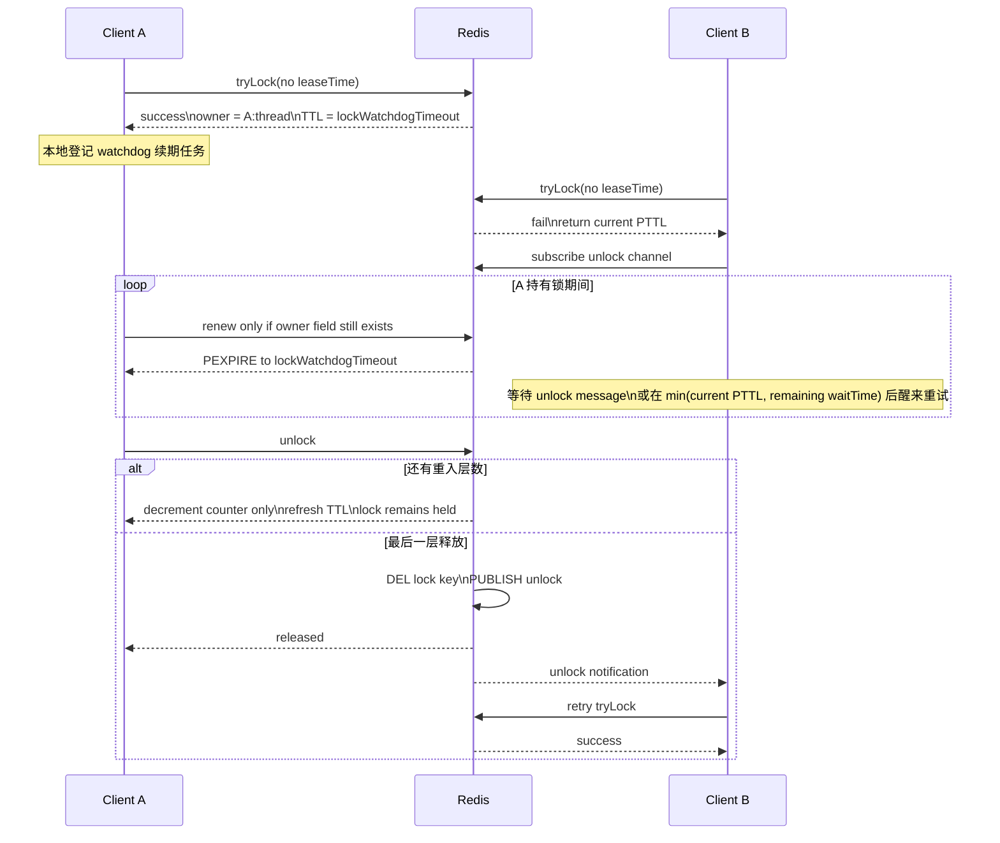
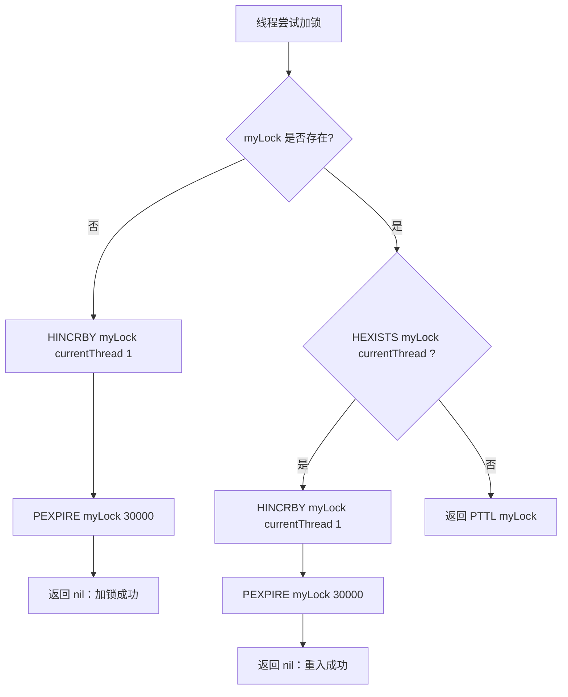
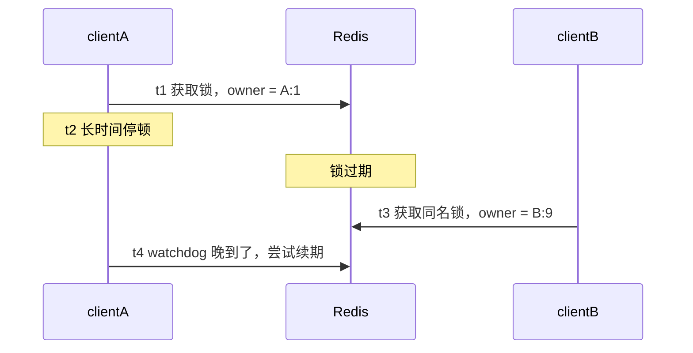
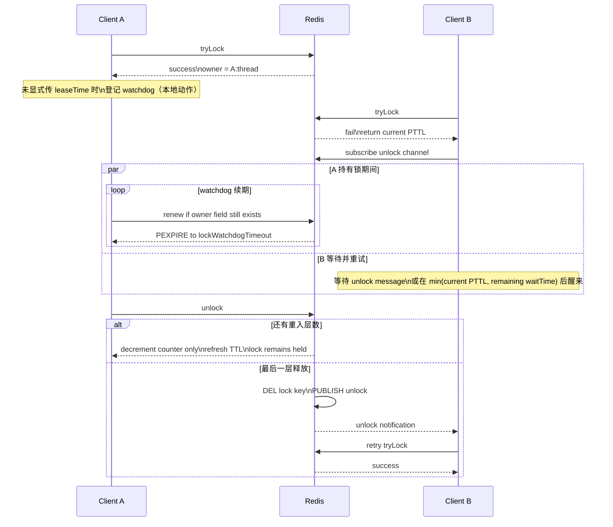
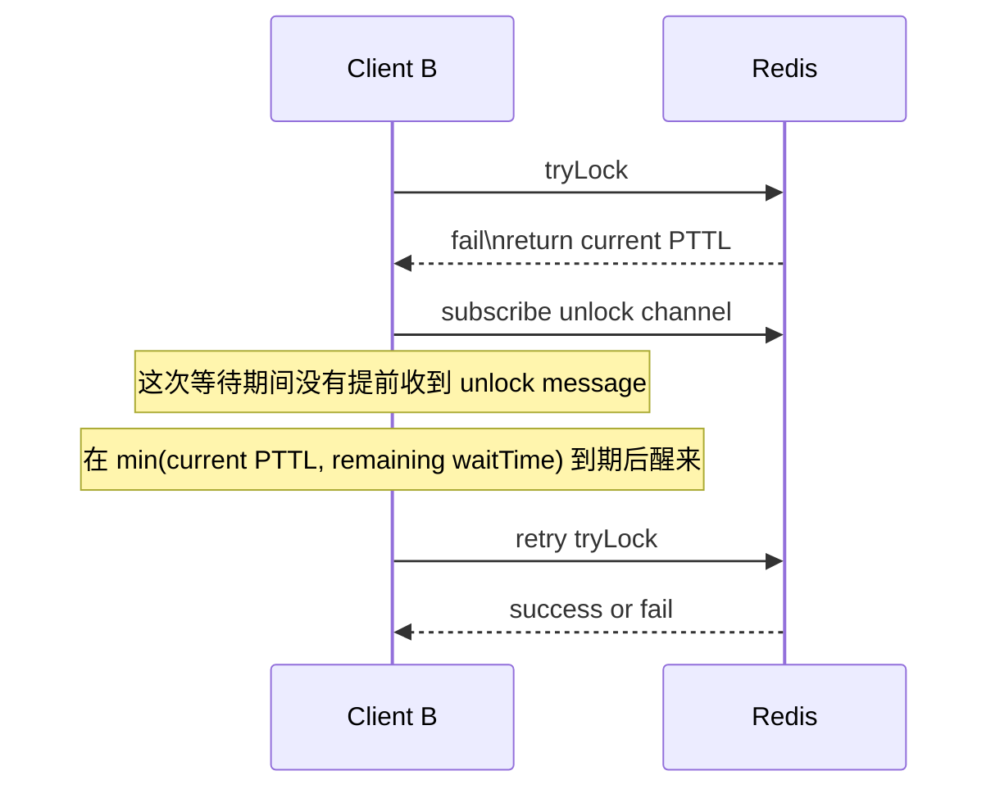
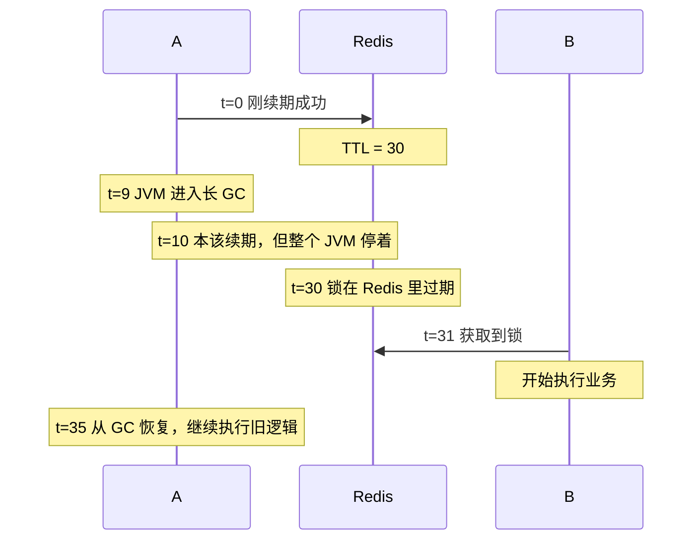
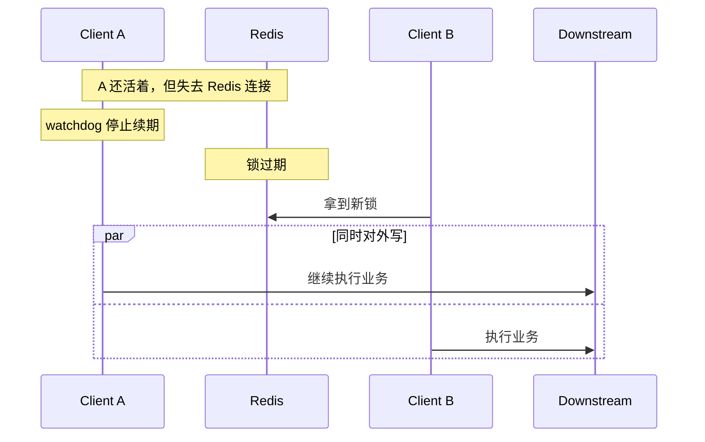
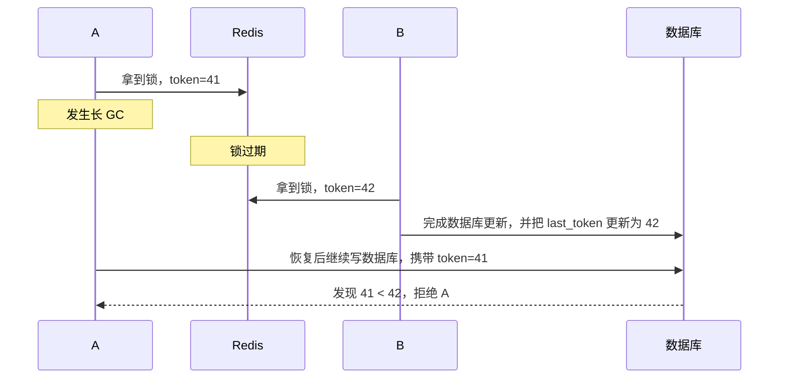

# Redisson `watchdog` 机制：从续期、Lua 脚本到 `FencedLock` 边界

> 术语说明：本文统一使用 `Redisson`。

Redisson 的 `watchdog` 不是 Redis 服务端功能，而是客户端内部的锁自动续租机制。它主要解决以下矛盾：

- 分布式锁如果不设置过期时间，客户端崩了，锁可能永远不释放。
- 分布式锁如果写死一个过期时间，业务执行超过这个时间，锁又会提前失效。

在常见用法里，当调用不带 `leaseTime` 的加锁重载时，Redisson 会先为锁设置一个默认过期时间；只要当前 Redisson 实例仍然存活并且仍然认为自己持有这把锁，就会持续续期。进一步看，按 `2026-03-22` 查阅到的上游实现，内部是否进入 watchdog 分支更接近 `leaseTime <= 0` 这一条件；但为了避免把实现细节误写成长期稳定的 API 契约，下文仍以公开 API 中最常见的“不传 `leaseTime`”用法为主进行说明。默认 `lockWatchdogTimeout` 为 `30000ms`，续期节奏不是每 30 秒一次，而是每 `lockWatchdogTimeout / 3` 执行一次，即默认每 10 秒一次。

## 1. 完整主流程

本节讨论 **常见的不显式传 `leaseTime`** 的普通 `RLock` 主路径，即最常见的 `lock.lock()`、`tryLock(waitTime, unit)` 这类调用。订阅超时、网络异常、线程中断等分支暂不展开，重点只放在主流程中的等待与续期逻辑。需要补充的边界是：如果直接对照当前上游实现，是否进入 watchdog 分支更接近 `leaseTime <= 0`；但这一判断属于实现细节，不宜与公开 API 语义完全等同。

1. 调用方使用不带 `leaseTime` 的加锁 API。  
   这意味着如果最终成功拿到锁，Redisson 会使用 `lockWatchdogTimeout` 作为初始 TTL，并且后续允许 watchdog 自动续期。

2. Redisson 先执行 Lua 尝试加锁。  
   它不是简单的 `SETNX`，而是把锁存成一个 `hash`：
   - `key` 是锁名
   - `field` 是 `clientId:threadId`
   - `value` 是重入次数

3. 加锁脚本只做三种判断：  
   - 如果锁不存在：
     - `HINCRBY` 当前 `field` 到 `1`
     - `PEXPIRE key lockWatchdogTimeout`
     - 返回成功
   - 如果锁已经存在，但 owner 就是当前线程：
     - `HINCRBY` 重入计数加 `1`
     - `PEXPIRE key lockWatchdogTimeout`
     - 返回成功
   - 如果锁被别人持有：
     - 返回当前 `PTTL`
     - 让 Java 侧知道“这把锁理论上还要活多久”

4. 如果这次 Lua 返回成功，Redisson 才会在本地登记续期信息。  
   这里的“登记”不是再往 Redis 写一份锁状态，而是把这把锁加入客户端内存里的续期管理器，供后面的 watchdog 定时任务使用。

5. 如果 Lua 返回的是 `PTTL`，Java 侧不会简单执行 `sleep(ttl)`。  
   更准确的流程是：
   - 先扣减已经消耗掉的 `waitTime`
   - 订阅这把锁对应的解锁 Pub/Sub channel
   - 进入重试循环
   - 每轮最多等待 `min(当前 ttl, 剩余 waitTime)`
   - 如果提前收到解锁消息，就立刻醒来再抢一次
   - 如果没收到消息，也会在 TTL 到点后自己醒来重试

   所以 Redisson 的等待机制本质上是：**Pub/Sub 负责快，TTL 负责兜底**，不是单纯靠轮询或固定睡眠。

6. 一旦成功持有，而且没有显式 `leaseTime`，watchdog 才开始工作。  
   它不参与“争抢阶段”，只参与“持有阶段”。调度节奏也不是写死的 10 秒，而是按：

   ```text
   lockWatchdogTimeout / 3
   ```

   来安排下一次续期。默认 `lockWatchdogTimeout = 30000ms`，所以默认看起来像“每 10 秒续一次”。

7. 每次续期时，Redisson 不会盲目 `PEXPIRE`。  
   它会先检查 Redis 里当前锁的 `field` 是否仍然是自己，也就是先做：
   - `HEXISTS key clientId:threadId`

   只有 owner 还在，才会：
   - `PEXPIRE key lockWatchdogTimeout`

   如果 owner 字段已经不存在，说明这把锁已经不再归当前线程所有，续期任务就不会再续它，并且会把本地这条续期记录清掉。

8. `unlock()` 也不是简单执行 `DEL key`，而是走 owner 校验与重入计数逻辑。  
   Lua 的核心语义是：
   - 如果当前线程不是 owner，返回失败，Java 侧抛 `IllegalMonitorStateException`
   - 如果是 owner，就先把重入计数减 `1`
   - 如果减完后计数仍然大于 `0`：
     - 说明只是释放了一层重入
     - 刷新 TTL
     - 不删除锁
     - 本地 watchdog 也不会因为这一次 `unlock` 就立刻完全停掉
   - 如果减完后计数变成 `0`：
     - 才真正 `DEL key`
     - 发布解锁消息唤醒等待者
     - 本地续期记录也会随之移除

9. 如果 Redisson 实例崩了、JVM 挂了、或者续期任务长时间跑不起来，watchdog 就会停止续期。  
   这时锁不会立刻释放，而是等 Redis 中当前这份 TTL 自然耗尽。默认配置下，锁从“最后一次成功续期”开始，最多还能再活约 30 秒；如果从“故障发生时刻”开始算，实际剩余时间取决于故障发生在上一次成功续期之后的哪个时刻。

**主流程摘要：**

```text
Lua 抢锁 -> 失败时拿到 TTL -> 订阅解锁消息并等待“消息或 TTL” -> 成功后登记 watchdog -> 持有期间按 watchdogTimeout/3 续期 -> 最后一层 unlock 时删除 key 并通知等待者
```

**如果只保留主路径的因果关系，可抽象为以下时序图：**



watchdog 的核心并不是“永远持有锁”，而是：**抢锁成功后，只要 owner 仍然存活并持续续期，就延长锁生命周期；一旦续期停止，就让 TTL 自然释放锁。**

## 2. 几个关键细节

- 对**常见公开 API 用法**来说，可以先记成：`watchdog` 主要在“不传 `leaseTime`”时生效。  
  这里先区分两个容易混淆的参数：

  - `waitTime`：获取锁阶段最多愿意等多久
  - `leaseTime`：拿到锁之后，这把锁最多自动持有多久

  先看方法签名和参数：

```java
lock.lock();
// 签名：lock()
// 参数：无

lock.tryLock(long waitTime, TimeUnit unit);
// waitTime：获取锁阶段最多愿意等多久
// unit：waitTime 的时间单位

lock.lock(long leaseTime, TimeUnit unit);
// leaseTime：拿到锁后最多自动持有多久
// unit：leaseTime 的时间单位

lock.tryLock(long waitTime, long leaseTime, TimeUnit unit);
// 第一个参数 waitTime：获取锁阶段最多愿意等多久
// 第二个参数 leaseTime：拿到锁后最多自动持有多久
// unit：waitTime 和 leaseTime 共用的时间单位
```

  再看具体调用示例：

```java
lock.lock();
// 不显式传 leaseTime
// watchdog 生效

lock.tryLock(5, TimeUnit.SECONDS);
// 5 对应 waitTime，TimeUnit.SECONDS 是 waitTime 的单位
// 不显式传 leaseTime，所以 watchdog 生效

lock.lock(10, TimeUnit.SECONDS);
// 10 对应 leaseTime，TimeUnit.SECONDS 是 leaseTime 的单位
// 显式传了 leaseTime，所以 watchdog 不生效

lock.tryLock(5, 10, TimeUnit.SECONDS);
// 这里第一个 5 对应 waitTime，第二个 10 对应 leaseTime
// TimeUnit.SECONDS 同时作用于 waitTime 和 leaseTime
// 显式传了 leaseTime，所以 watchdog 不生效
```

- 对常见调用方式来说，一旦显式传入一个**正数** `leaseTime`，Redisson 就会把它视为固定租期，只设置固定 TTL，不自动续期。  
  这一点经常被误解。对于常规的 `lock(leaseTime, unit)` / `tryLock(waitTime, leaseTime, unit)` 正数租期调用，watchdog 不会继续续期。  
  如果进一步落实到当前实现细节，更准确的说法是：当前上游实现里，分支条件更接近 `leaseTime > 0` 走固定租期，`leaseTime <= 0` 走 watchdog。
- watchdog 是客户端机制，不是 Redis 服务端机制。  
  Redis 只看到一串普通命令：`HINCRBY`、`PEXPIRE`、`HEXISTS`、`DEL`。
- 它保证的是“这个 Redisson 客户端仍在持续续期”，而不是“业务线程一定健康”。  
  如果业务代码忘记调用 `unlock()`，但 JVM 仍然存活，watchdog 可能持续续期，导致锁长时间不释放。
- Redisson 为了支持续期调度，会在客户端 JVM 的续期管理器里记录“哪些锁/线程当前需要续期”。这意味着同一个线程重入多次时，不会因为一次 `unlock()` 就把 watchdog 立即停掉；只有最后一层真正释放后，这条本地续期责任才会被撤掉。  
  这里要故意说得保守一点：Redis 里那份 `hash(field = clientId:threadId, value = 重入次数)` 是分布式层面的共享真相；客户端本地还会保留续期所需的管理条目，但这些条目的具体数据结构、是否用引用计数、`LockEntry` 内部怎样组织，属于实现细节，不宜当成稳定外部契约来记。
- 对很多锁同时续期时，Redisson 不是一把锁开一个独立线程。按 `2026-03-22` 查阅到的当前上游实现，它会批量处理，默认 `lockWatchdogBatchSize = 100`；在 Redis Cluster 下，还会按 slot 分组处理。这里同样属于“当前实现细节 + 当前默认值”，升级版本时最好重新核对。

## 3. 它解决了什么，没解决什么

**它解决的是：**

- 客户端崩溃后，锁不会永久死锁
- 业务执行时间不确定时，不用你手工估一个 TTL

**它没解决的是：**

- 长时间 GC pause
- 线程卡死但进程没死
- 网络分区
- 老持有者“过期后又醒过来继续执行”的 stale owner 问题

例如，JVM 停顿 40 秒时，默认 watchdog 在 30 秒配置下就可能无法及时续期。锁一旦过期，其他客户端就可能重新获取；原线程如果随后恢复运行，就会出现多个执行者先后对同一资源实施操作的问题。这个问题不能仅靠 watchdog 解决，更严格的方案通常需要 fencing token、版本号校验、幂等写入，或者直接使用 Redisson 的 `FencedLock`。

## 4. 实践建议

- 业务执行时间不稳定时，可优先使用 `lock.lock()`，由 watchdog 管理续期。
- 无论采用哪种方式，都应使用 `try/finally unlock()`；watchdog 不能作为“忘记释放锁”的补丁。
- 如果能够明确业务最长执行时间，并且希望到点自动释放，可显式传入 `leaseTime`。
- 如果锁保护的是数据库写、下游 RPC 或其他副作用操作，仅依赖 watchdog 通常不够，还应结合 fencing 或业务幂等。

**摘要：** `watchdog` 本质上是 Redisson 在客户端侧实现的自动续租机制。不传 `leaseTime` 时，先为锁设置默认 TTL，再按固定节奏续期；客户端失效后，续期停止，锁会在 TTL 到点后自动释放。它适合“执行时长不确定”的分布式锁场景，但并不提供强一致性，也不能替代 `finally unlock()`。

## 5. Lua 脚本

边界说明：本节中出现的 Lua、内部去重键、批量续期、slot 分组等内容，均基于 `2026-03-22` 查阅到的 Redisson 官方文档和上游源码，用于解释“当前实现大致如何工作”。这些内容适合理解原理，但不应被视为永久不变的公开契约。

先给出一个数据模型：Redisson 的普通可重入锁 `RLock` 在 Redis 中对应的不是简单字符串值，而是一个 `hash key`。

整体结构：

```text
                Redis key
                   ↓
                myLock
                   │
                   │ value 是一个 hash
                   ↓
     +-------------------------------------------+
     | field                     | value         |
     +-------------------------------------------+
     | <clientId>:<threadId>     | 重入次数      |
     +-------------------------------------------+

ttl(myLock) = 整个 key 的过期时间
```

单个 `field` 项在逻辑上，就是这把锁里的一条“持有者记录”：

```text
     +---------------------------+---------+
     | 32caba5f-...:87           |    2    |
     +---------------------------+---------+
                 ↑                    ↑
       clientId:threadId            重入次数
```

也就是说：

- `field` 用来标识“哪个 Redisson 客户端里的哪个线程”持有这把锁
- `value` 记录这个线程对同一把锁重入了多少次
- `ttl` 挂在整个 `myLock` key 上，不是单独挂在某个 `field` 上
- 在普通持有状态下，这个 `hash` 通常只有一个 `field`；同一线程重入时，只会把 `value` 递增

示例：

```text
HGETALL myLock
{
  "32caba5f-...:87" -> "2"
}
PTTL myLock = 30000
```

这表示：

- `myLock` 当前由 `32caba5f-...` 这个 Redisson 客户端中的线程 `87` 持有
- 这个线程已经对同一把锁重入了 `2` 次
- 整个锁的剩余过期时间还有 `30000ms`

### 5.1 加锁 Lua 逐行解释

这个脚本在 `RedissonLock.tryLockInnerAsync()` 里，核心源码基本是：

```lua
if ((redis.call('exists', KEYS[1]) == 0)
    or (redis.call('hexists', KEYS[1], ARGV[2]) == 1)) then
    redis.call('hincrby', KEYS[1], ARGV[2], 1);
    redis.call('pexpire', KEYS[1], ARGV[1]);
    return nil;
end;
return redis.call('pttl', KEYS[1]);
```

**参数含义：**

- `KEYS[1]` = 锁名，比如 `myLock`
- `ARGV[1]` = 本次要设置的过期时间，毫秒
- `ARGV[2]` = 当前持有者标识，也就是 `clientId:threadId`

**逐行解释：**

1. `redis.call('exists', KEYS[1]) == 0`
   这表示锁 key 根本不存在，也就是当前没人持有锁，可以抢。

2. `or (redis.call('hexists', KEYS[1], ARGV[2]) == 1)`
   这表示锁虽然存在，但当前线程对应的 field 已经在这个 hash 里了，也就是“我自己已经持有这把锁”，属于重入场景，也可以继续加。

3. `redis.call('hincrby', KEYS[1], ARGV[2], 1);`
   如果是第一次获取，Redis 会自动创建这个 hash，并把当前线程计数设为 `1`。
   如果是重入，就从 `1` 加到 `2`，从 `2` 加到 `3`。

4. `redis.call('pexpire', KEYS[1], ARGV[1]);`
   给整个锁 key 重新设置 TTL。
   注意它不是只在第一次加锁时设置 TTL，重入时也会刷新 TTL。

5. `return nil;`
   Redisson 这里用 `nil` 表示“加锁成功”。

6. `return redis.call('pttl', KEYS[1]);`
   如果既不是空锁，也不是当前线程重入，那说明锁被别人持有。
   这时它不返回 `false`，而是返回剩余 TTL。
   这个设计很关键，因为 Java 侧可以拿到这把锁还要多久过期，从而配合订阅和等待逻辑。

**该脚本的语义可以概括为：**

- 空锁，可以拿
- 自己持有，可以重入
- 别人持有，告诉我还剩多久

**对应的加锁决策流程如下：**



该 Lua 脚本的核心逻辑只有一件事：

- 如果锁不存在，或者当前线程本来就是 owner，就允许加锁并刷新 TTL
- 否则就返回剩余 TTL，让调用方知道这把锁还要多久才可能释放

**对应的状态变化可分为三种情况：**

**1. 初次加锁**

此时 `myLock` 不存在，说明还没有任何线程持有这把锁：

```text
myLock 不存在
-> HINCRBY myLock clientA:thread1 1
-> PEXPIRE myLock 30000
-> 返回 nil
```

执行完之后，Redis 中的状态可以理解成：

```text
myLock = {
  clientA:thread1 -> 1
}
```

这表示 `clientA` 这个客户端中的 `thread1` 已经持有锁一次。

**2. 同线程重入**

如果还是 `clientA:thread1` 再次请求加锁，那么 `HEXISTS(myLock, clientA:thread1) = 1`，说明这是一次合法重入：

```text
myLock = { clientA:thread1 -> 1 }
-> HINCRBY myLock clientA:thread1 1
-> 变成 2
-> PEXPIRE myLock 30000
-> 返回 nil
```

此时数据变成：

```text
myLock = {
  clientA:thread1 -> 2
}
```

数值 `2` 表示这个线程已经对同一把锁重入了两次。

**3. 别的线程来抢锁**

假设当前锁仍然由 `clientA:thread1` 持有，此时另一个线程 `clientB:thread9` 来尝试加锁：

```text
myLock = { clientA:thread1 -> 2 }
当前线程 = clientB:thread9
-> exists(myLock) = 1
-> hexists(myLock, clientB:thread9) = 0
-> 返回 pttl(myLock)
```

这里的含义是：

- 锁确实存在
- 但当前线程不是持有者
- 所以不能直接加锁
- Redis 返回这把锁还剩多少毫秒过期

Java 侧拿到这个 `PTTL` 后，就能决定是订阅解锁消息、等待 TTL 到点，还是继续下一轮抢锁逻辑。

### 5.2 解锁 Lua 逐行解释

解锁脚本在 `RedissonLock.unlockInnerAsync()` 里，源码核心是：

```lua
local val = redis.call('get', KEYS[3]);
if val ~= false then
    return tonumber(val);
end;

if (redis.call('hexists', KEYS[1], ARGV[3]) == 0) then
    return nil;
end;

local counter = redis.call('hincrby', KEYS[1], ARGV[3], -1);
if (counter > 0) then
    redis.call('pexpire', KEYS[1], ARGV[2]);
    redis.call('set', KEYS[3], 0, 'px', ARGV[5]);
    return 0;
else
    redis.call('del', KEYS[1]);
    redis.call(ARGV[4], KEYS[2], ARGV[1]);
    redis.call('set', KEYS[3], 1, 'px', ARGV[5]);
    return 1;
end;
```

**参数含义：**

- `KEYS[1]` = 锁 key，比如 `myLock`
- `KEYS[2]` = 锁释放通知的 Pub/Sub channel
- `KEYS[3]` = 本次 unlock 请求的内部“结果缓存键”
- `ARGV[1]` = 解锁消息内容，通常是一个固定 unlock message
- `ARGV[2]` = 当前内部 lease time，通常就是 watchdog timeout
- `ARGV[3]` = 当前线程标识 `clientId:threadId`
- `ARGV[4]` = 发布命令，通常是 `PUBLISH`
- `ARGV[5]` = 内部缓存键的过期时间

**逐行解释：**

1. `local val = redis.call('get', KEYS[3]);`
   先看本次 unlock 请求是否已经执行过。

2. `if val ~= false then return tonumber(val); end;`
   如果这个请求之前已经跑过了，就直接返回之前的结果。
   这是一个内部的幂等/去重设计，避免同一个 unlock 请求因为重试被重复执行。

3. `if (redis.call('hexists', KEYS[1], ARGV[3]) == 0) then return nil; end;`
   如果当前线程对应的 field 根本不存在，说明这把锁不是你持有的。
   Java 侧收到 `nil` 后会抛 `IllegalMonitorStateException`。

4. `local counter = redis.call('hincrby', KEYS[1], ARGV[3], -1);`
   解锁不是立刻删 key，而是先把当前线程的重入次数减一。

5. `if (counter > 0) then`
   如果减完还大于 0，说明只是释放了一层重入，锁还在当前线程手上。

6. `redis.call('pexpire', KEYS[1], ARGV[2]);`
   因为锁还在持有，所以继续刷新 TTL。

7. `redis.call('set', KEYS[3], 0, 'px', ARGV[5]);`
   记录本次 unlock 的结果是“部分解锁，还未真正释放”。

8. `return 0;`
   返回 `0` 表示：解锁动作执行了，但锁还没彻底释放。

9. `else redis.call('del', KEYS[1]);`
   如果计数减到 0，说明最后一层重入也释放掉了，这时才真正删除锁 key。

10. `redis.call(ARGV[4], KEYS[2], ARGV[1]);`
    发布解锁消息，通知订阅这把锁的等待者可以来竞争了。
    这就是 Redisson 避免纯轮询等待的重要机制。

11. `redis.call('set', KEYS[3], 1, 'px', ARGV[5]);`
    缓存这次结果，表示“已经彻底解锁”。

12. `return 1;`
    返回 `1` 表示最终释放成功。

**这个解锁脚本有三个特别容易忽略的点：**

1. 它不是“有锁就删”，而是“只有当前 owner 才能解，而且先减重入计数，再决定删不删”。
2. 它不是纯 `DEL`，而是带 owner 校验的原子脚本，所以不会误删别人的锁。
3. 它在最终释放时会发 Pub/Sub 消息，等待者不必一直自旋抢锁。

**如果结合前面的 hash 结构看，就很直观了：**

```text
当前:
myLock = { clientA:thread1 -> 2 }

第一次 unlock:
HINCRBY -1 -> 1
counter > 0
=> 不删锁，只续 TTL

第二次 unlock:
HINCRBY -1 -> 0
counter == 0
=> DEL myLock
=> PUBLISH unlock 消息
```

### 5.3 watchdog 续期 Lua

watchdog 续期逻辑位于 `LockTask`，核心脚本如下：

```lua
local result = {}
for i = 1, #KEYS, 1 do
    if (redis.call('hexists', KEYS[i], ARGV[i + 1]) == 1) then
        redis.call('pexpire', KEYS[i], ARGV[1]);
        table.insert(result, 1);
    else
        table.insert(result, 0);
    end;
end;
return result;
```

**参数含义：**

- `KEYS[i]` = 一批锁 key
- `ARGV[1]` = 要续到的 TTL，默认 30000ms
- `ARGV[i+1]` = 每把锁对应的 owner 字段，也就是 `clientId:threadId`

**逐行看：**

1. 它是批量续期，不是一把锁发一条命令。
2. 对每把锁先 `HEXISTS(key, ownerField)`。
3. 只有当“当前 owner 字段还在”时，才 `PEXPIRE`。
4. 如果 owner 字段已经不存在，就不续期，并且 Java 侧会把这把锁从本地 watchdog 列表里移除。

这个判断非常关键，因为它保证了“旧 owner 的 watchdog 不会把新 owner 的锁续活”。

**示例：**



**此时 watchdog 先做：**

```lua
HEXISTS myLock A:1
```

结果是 `0`，因为锁里现在只有 `B:9`，没有 `A:1`。所以 clientA 不会把 clientB 的锁续掉。

这也是 Redisson 相比“无 owner 校验、直接续 TTL”的实现更稳妥的原因。

## 6. `SET NX PX` 手写锁相比，多做了哪些事

作为对比基线，手写分布式锁通常可以分成两种层次：

1. 很多博客里的简化版：

```redis
SET lockKey requestId NX PX 30000
DEL lockKey
```

这个版本的 `DEL` 是有问题的，因为可能删掉别人重建后的锁。

2. 稍微正确一点的版本：

```redis
SET lockKey requestId NX PX 30000
if GET lockKey == requestId then DEL lockKey end
```

也就是“加锁用 `SET NX PX`，解锁用 compare-and-del Lua”。

拿这个“较正确的手写版本”来对比，Redisson 主要多做了这些事。

### 6.1 可重入

`SET NX PX` 的字符串锁天生只有“拿到/没拿到”两种状态，不知道同一个线程重入了几次。

Redisson 的 hash 结构天然支持：

- 同线程重入计数
- 多次 `lock()` 对应多次 `unlock()`
- 部分 unlock 不会把锁提前删掉

这不是简单优化，而是语义层面的差异。

### 6.2 线程级 owner，而不只是进程级 token

手写锁通常只记一个 `requestId`，只知道“这个客户端实例是 owner”。

Redisson 记的是 `clientId:threadId`，所以它能做：

- `isHeldByCurrentThread()`
- 只允许加锁线程解锁
- 区分同一 JVM 内不同线程的 ownership

这让它更接近 `java.util.concurrent.locks.Lock` 的语义。

### 6.3 watchdog 自动续租

手写 `SET NX PX` 最常见的问题是 TTL 很难估：

- 估短了，业务没跑完锁先过期
- 估长了，客户端崩了别人要等很久

Redisson 在常见的“不传 `leaseTime`”用法下会自动续租：

- 初次加锁先给一个默认 TTL
- 默认每 10 秒续一次
- 客户端死了就停止续期，最多再等一个 TTL 自然过期

这相当于把“固定 TTL”升级成了“活着就续，死了就放”。

### 6.4 安全的重入解锁

手写锁通常只有：

```lua
if GET key == token then DEL key end
```

这只能表达“删”或“不删”。

Redisson 的解锁语义更丰富：

- 不是 owner，拒绝解锁
- 是 owner 但还有重入层数，只减计数
- 计数归零才真正删锁
- 最终删锁时通知等待者

### 6.5 等待机制不是纯轮询

手写 `SET NX PX` 的等待方通常会做：

```java
while (!trySetNx()) {
    Thread.sleep(50);
}
```

这会带来：

- 无意义轮询
- Redis 压力更大
- 抢锁延迟不稳定

Redisson 在拿不到锁时会：

- 从 Lua 里拿到剩余 TTL
- 订阅解锁 Pub/Sub channel
- 收到解锁消息后立即再抢
- 如果消息丢了或没收到，还能靠 TTL 超时补偿

所以它不是纯“自旋抢”，而是“消息通知 + TTL 兜底”。

### 6.6 watchdog 续期是带 owner 校验的

很多人手写“自动续租”时，容易写成：

```redis
PEXPIRE lockKey 30000
```

这很危险，因为锁可能已经过期并被别人拿走了。

Redisson 续期前会检查：

```lua
HEXISTS lockKey myClientId:myThreadId
```

只有 owner 还在，才续期。

这使得“旧客户端误续新客户端的锁”不会发生。

### 6.7 批量续期和集群适配

手写自动续租往往是一把锁一个定时任务，简单但粗糙。

Redisson 额外做了：

- 批量续期
- cluster slot 分组处理
- 本地 lock entry 管理
- watchdog batch size 控制，默认 100

这属于工程化能力，不是基础锁语义，但在锁数量多的时候差异很明显。

### 6.8 更完整的客户端协议

Redisson 不是只给了两条命令，而是围绕锁做了整套协议：

- 加锁返回剩余 TTL，而不只是 true/false
- 解锁带请求去重结果缓存
- 释放时发布通知
- 客户端维护本地续期管理条目和 owner 相关状态
- watchdog 和 unlock 逻辑联动停止续期

因此，更准确的表述是：Redisson 不是“对 `SET NX PX` 做了一层简单封装”，而是“在 Redis 之上实现了一套更完整的分布式可重入锁协议”。

### 6.9 但要把技术边界说清楚

这一部分用于明确技术边界，避免对 Redisson 的能力范围产生误判。

Redisson 相比 `SET NX PX`，多做的是：

- 更强的语义
- 更完整的客户端协议
- 更好的工程体验
- 更少的常见坑

它没有神奇地解决这些根问题：

- 长时间 GC pause
- JVM 线程卡死但进程没死
- 网络分区
- 锁过期后旧 owner 恢复执行的 stale owner 问题

也就是说，和“正确实现的 token 锁”相比，Redisson 的优势主要是“功能和工程能力更多”，不是“从根上消灭了分布式锁的所有一致性风险”。

如果临界区后面连接的是数据库写、扣库存、发消息等副作用操作，仅依赖 watchdog 仍然不够严格。更稳妥的方案通常包括：

- fencing token
- 版本号校验
- 幂等写
- 或直接使用 Redisson 的 `FencedLock`

**摘要：**

- `SET NX PX` 手写锁解决的是“基础互斥 + TTL”
- Redisson 额外解决的是“可重入、线程 owner、自动续租、消息唤醒、批量续期、集群适配、内部去重”
- 但它仍然不是严格意义上的强一致锁，涉及外部副作用时仍要配合 fencing / 幂等

## 7. Java 侧流程

结论：`tryLock(waitTime, leaseTime, unit)` 在 Java 侧并不是“循环 `SET NX` 直到成功”这么简单，而是把以下四件事组合起来：

- 一次 Lua 抢锁，失败时拿到剩余 TTL
- 订阅解锁消息，避免纯轮询
- 在 TTL 或解锁消息到来时再次尝试抢锁
- 如果走的是 watchdog 分支，成功后再挂上自动续租

**可概括为：**

```text
抢一次
如果成功 -> 返回
如果失败 -> 知道还剩多久 -> 订阅消息 -> 等“解锁通知 or TTL到点” -> 再抢
```

下面按同步阻塞版 `tryLock(waitTime, leaseTime, unit)` 来拆。

### 7.1 入口参数先分成两类

这个方法有两个时间参数，但语义完全不同：

- `waitTime`
  含义是“我最多愿意等多久去抢这把锁”
- `leaseTime`
  含义是“如果我抢到了，锁自动存活多久”

注意这个组合的关键点：

- 从当前上游实现看，`leaseTime > 0`
  代表固定租期，**不启用 watchdog**
- 从当前上游实现看，`leaseTime <= 0`
  代表使用 `lockWatchdogTimeout`，**启用 watchdog**

所以 `waitTime` 管“获取阶段”，`leaseTime` 管“持有阶段”。

### 7.2 第一次先直接执行 Lua 抢锁

Java 侧先调用加锁 Lua。这个 Lua 你前面已经看过：

- 成功返回 `null`
- 失败返回当前锁的 `pttl`

所以 Java 侧拿到的是：

- `ttl == null`
  表示已经拿到锁
- `ttl >= 0`
  表示锁被别人持有，还能活这么久

这一步的意义是：失败不只是拿到一个 `false`，而是拿到了“锁预计多久后可能释放”的时间线索。

### 7.3 如果第一次失败，先扣减已经花掉的 waitTime

Java 侧会记录从方法开始到现在已经消耗了多少时间，然后：

```text
剩余可等待时间 = waitTime - 已消耗时间
```

如果剩余时间已经小于等于 0，就直接返回失败，不再继续等。

这个地方说明 Redisson 的 `waitTime` 是真实总预算，不是每次重试都重新算一个完整 waitTime。

### 7.4 订阅锁释放通知

第一次抢失败后，Redisson 不会马上 `sleep(ttl)`，而是先去订阅这把锁的 Pub/Sub channel。

原因主要包括：

- 如果持有者很快就释放了，纯 sleep 会白等
- 如果只靠轮询，会不断打 Redis

所以 Redisson 设计成：

- 先订阅“这把锁释放时会发消息”的 channel
- 之后等待“消息 or 超时”

这样可以把抢锁等待从“轮询驱动”改成“事件驱动”。

### 7.5 进入等待循环：消息优先，TTL 兜底

订阅完成后，Redisson 进入一个循环，大致逻辑可以写成伪代码：

```java
long deadline = now + waitTime;

while (now < deadline) {
    Long ttl = tryAcquire(...);

    if (ttl == null) {
        // 抢到了
        return true;
    }

    long remain = deadline - now;
    if (remain <= 0) {
        return false;
    }

    long blockTime;
    if (ttl >= 0) {
        blockTime = min(ttl, remain);
    } else {
        blockTime = remain;
    }

    等待 unlock 消息，最多 blockTime
}
return false;
```

这个循环里有两个设计点特别关键。

第一，`ttl` 不是拿来直接“相信它一定会到点释放”的，而是拿来决定“最多等多久再醒一次”。

也就是说：

- 如果在这段时间里收到了 unlock 消息，会提前醒来重试
- 如果没有收到消息，也不会无限等，而是在 `ttl` 到点后自己醒来重试

所以 TTL 在这里是超时上限，不是唯一唤醒条件。

第二，Redisson 不是只靠 Pub/Sub。
因为 Pub/Sub 不是持久队列，存在各种时序问题，所以它总会再配一个 TTL 兜底超时。

这就形成了：

- 正常路径：解锁消息触发快速重试
- 兜底路径：TTL 到点后重试

### 7.6 成功获取后，决定是否启动 watchdog

一旦某次 `tryAcquire` 返回 `null`，说明已经抢到锁了。此时 Java 侧会根据 `leaseTime` 分支：

- 如果 `leaseTime > 0`
  只把 TTL 设成固定值，不启动 watchdog
- 如果 `leaseTime <= 0`
  用默认 `lockWatchdogTimeout` 作为 TTL，并注册 watchdog 续租任务

这一步非常重要，因为很多人以为：

- `tryLock(waitTime, leaseTime, unit)` 中的 `waitTime` 也和 watchdog 有关

并非如此。更准确地说，当前实现里 watchdog 关注的是“最终落到的 `leaseTime` 分支”，而不是 `waitTime`。

所以：

```java
lock.tryLock(30, 10, TimeUnit.SECONDS);
```

含义是：

- 最多等 30 秒去抢
- 抢到后最多持有 10 秒
- 10 秒后自动释放
- 不会自动续租

而：

```java
lock.tryLock(30, TimeUnit.SECONDS);
```

或者内部等价的不带 leaseTime 版本，才会走 watchdog。

### 7.7 unlock 时不仅删锁，还负责唤醒等待者

持有者在 `unlock()` 时，真正做的事有三层：

- 校验 owner 是不是当前线程
- 如果是重入，只减计数，不删锁
- 如果计数归零，删除 key 并发 Pub/Sub 解锁消息

所以等待方被唤醒，不是因为它一直轮询到了“key 消失”，而是因为 Redisson 主动发了释放通知。

也就是说，等待方的快速响应依赖两部分：

- 解锁方发 `PUBLISH`
- 等待方提前 `SUBSCRIBE`

这比最原始的 `sleep + 重试` 精细得多。

### 7.8 watchdog 在整个流程里插在哪

watchdog 不参与“争抢阶段”，只参与“持有阶段”。

准确说，时间线是：

- 抢锁 Lua 成功
- Java 侧确认成功
- 如果走的是 watchdog 分支
- 把这把锁登记进本地续期表
- 定时任务每 `lockWatchdogTimeout / 3` 去批量续期

所以 watchdog 不是抢锁的一部分，而是“抢到以后保持锁活着”的一部分。

### 7.9 一个主路径语义图

下面用三个角色画一遍：

- `Client A`
  当前持有锁的人
- `Redis`
  锁状态所在处
- `Client B`
  正在竞争这把锁的人

先看正常抢锁、等待、续租、释放、唤醒的主路径。



图中的关键点如下：

- B 第一次失败后不会一直空转抢
- B 先订阅，再等解锁消息
- A 释放时会主动通知
- B 收到通知后立刻再抢
- watchdog 只在 A 已经拿到锁后才开始工作

### 7.10 再看一个“没有消息，也能继续前进”的时序

如果 Pub/Sub 消息未及时收到，Redisson 仍然保留 TTL 超时这条兜底路径。



所以消息丢失、订阅时序抖动，不会直接让等待线程永久卡死。
它最多让你少走“快速唤醒路径”，退回 TTL 兜底路径。

### 7.11 和手写 `SET NX PX` 的控制流差异

如果把这个 Java 侧过程和最常见的手写锁对比，差异非常直观。

手写版常见流程：

```java
long deadline = now + waitTime;
while (now < deadline) {
    boolean ok = SET lockKey token NX PX lease;
    if (ok) return true;
    Thread.sleep(50);
}
return false;
```

Redisson 实际上多了这些步骤：

- 失败时拿到精确 TTL，而不是只得到一个 false
- 不是固定 sleep，而是按 TTL 和剩余 waitTime 动态等待
- 不是纯轮询，而是先订阅解锁消息
- 解锁方不是只删 key，而是会发通知
- 持有阶段不是固定 TTL，而是可以挂 watchdog 自动续租
- 整个 owner 语义是线程级可重入，而不是单字符串 token

所以从控制流看，Redisson 更像：

```text
带 TTL 感知的等待 + Pub/Sub 唤醒 + owner 校验 + 可重入状态机 + 可选自动续租
```

而不是“给 `SET NX PX` 包了一层 while”。

### 7.12 推荐的理解框架

可按以下方式理解：

- Redis 里的锁状态由 Lua 原子维护
- Java 侧的 `tryLock(waitTime, leaseTime, unit)` 负责等待编排
- 等待编排依赖两种信号：
  - 解锁消息，负责快
  - TTL 超时，负责稳
- 成功持有后，如果没指定固定租期，就交给 watchdog 持续续命
- 解锁时既要改 Redis 状态，也要通知等待者

**摘要：**

```text
Redisson = 原子 Lua 管状态，Pub/Sub 管唤醒，TTL 管兜底，watchdog 管续租
```

### 7.13 两个常见追问

1. 为什么失败时返回 `pttl` 而不是 `false`？
因为 Java 侧需要知道“最多该等多久再重试”，否则只能盲目 sleep 或高频轮询。

2. 为什么已经有 Pub/Sub 了还要看 TTL？
因为 Pub/Sub 只能优化唤醒速度，不能作为唯一可靠时钟；TTL 才是锁生命周期的最终兜底。

## 8. 风险边界

结论先行：`watchdog` 解决的是“锁不要因为固定 TTL 过短而提前过期，也不要因为客户端崩溃而永久不释放”。它提升的是可用性和易用性，而不是线性一致性。一旦进入 GC、网络分区、主从切换等场景，核心风险通常都会收敛到 `stale owner`，即“旧持有者已经不应继续执行，但它自身仍然认为可以继续执行”。

### 8.1 长时间 GC pause

`watchdog` 续期任务跑在客户端 JVM 里。发生 STW GC 时，业务线程停，Netty 定时器也停，续期线程也停，所以这不是“业务线程卡住但 watchdog 还能偷偷续”的模型，而是 JVM 整体一起停。

默认参数下：

- `lockWatchdogTimeout = 30s`
- 续期间隔是 `30s / 3 = 10s`

这意味着风险阈值不一定要“停 30 秒以上”才出事。更糟糕的情况是：

- 刚好接近下一次续期前发生 GC
- 此时离锁真正过期只剩大约 `20s`

所以在默认配置下，`20s+` 级别的停顿就已经可能让锁过期，不必非得超过 30 秒。

**典型时序：**



这时真正危险的不是 A 最后 `unlock()` 会报错，而是 A 在恢复后的那段时间里，可能已经把数据库、库存、下游服务写坏了。`watchdog` 对这个没有补救能力，因为它只能管 Redis 锁的 TTL，管不了“旧线程恢复后是否还应该继续提交副作用”。

### 8.2 网络分区

`watchdog` 的本质是客户端定期向 Redis 发“续期”命令。只要客户端和 Redis 之间链路有问题，续期就会失败。

最糟糕的分区不是“客户端彻底掉线，什么都干不了”，而是这种不对称情况：

- A 到 Redis 的链路断了，不能续期
- A 到数据库/HTTP 下游的链路还是通的
- 锁在 Redis 里过期后，B 重新拿到锁
- A 还在继续对外执行业务

**这是典型的 split-brain 业务执行：**



可以将其理解为：`watchdog` 只能回答“最近是否成功续了 Redis 中的锁”，无法回答“当前是否仍然是系统里唯一合法的执行者”。一旦 Redis 与业务下游的可达性不一致，普通 `RLock + watchdog` 的边界就会暴露出来。

### 8.3 主从切换 / failover

这个风险不是 Redisson 独有，而是 Redis 异步复制架构的天然边界。问题在于：锁状态、解锁、最近一次续期，都是写到主节点上的；如果主节点在复制到从节点之前就挂了，新主可能看到的是旧状态。

典型问题有三类：

- **最近一次加锁没复制过去**
  - A 在旧主上拿到了锁
  - 旧主还没把这次写复制给从库就挂了
  - 新主切上来后根本不知道这把锁存在
  - B 又拿到了一次锁
  - 结果是双持有

- **最近一次续期没复制过去**
  - A 其实刚续过租
  - 新主没看到这次续期
  - 在新主视角里 TTL 更短，甚至马上过期
  - B 比 A 预期得更早拿到锁

- **最近一次解锁没复制过去**
  - A 明明释放了锁
  - 新主没看到解锁
  - 锁会在新主上“多活一会儿”，表现成暂时不可用

因此需要明确边界：`watchdog` 可以降低“客户端崩溃导致永远锁死”的风险，但不能把 Redis 主从切换变成 CP 共识锁。如果场景要求严格的外部副作用顺序，仅靠普通 Redis 分布式锁并不足够。

## 9. 为什么 `FencedLock` 更适合保护数据库写 / 库存扣减

摘要：普通 `RLock + watchdog` 只能在“开始时”告诉调用方“当前似乎轮到它执行”；`FencedLock` 会额外提供一个单调递增的 `token`，让下游在“提交时”仍然能够判断“当前请求是不是最新的合法持有者”。

这是本质差异。

### 9.1 普通 `RLock + watchdog` 的能力边界

普通锁的语义是：

- 你获取锁时，Redis 认为你是 owner
- 你执行期间，watchdog 尽量帮你续命
- 你解锁时，Redis 把锁删掉

但数据库、库存系统、外部服务并不知道这些。它们只看到“有人来写数据”，并不知道这个请求对应的锁是不是已经过期、是不是已经被别的客户端接管了。

所以一旦出现 stale owner，外部系统没有办法拒绝旧持有者。

### 9.2 `FencedLock` 多做的一件关键事：发 token

`RFencedLock` 在成功获取时，除了获得锁本身，还会返回一个单调递增的 fencing token。

这里需要补充一个实现边界：按 `2026-03-22` 查到的当前上游实现，token 是按 successful acquisition 递增的，首次获取会递增，同一 owner 的重入成功也会递增。  
因此，更稳妥的理解是：**token 表示一次成功获取事件的先后顺序**，不应默认它是“同一个 owner 整个持锁生命周期里恒定不变的编号”。

**示意语义如下：**

```text
第一次获取 -> token = 101
下一次获取 -> token = 102
再下一次获取 -> token = 103
```

Redisson 官方给的核心要求可以压成两层：

- 下游被保护的服务要检查这个 token
- 至少要拒绝“小于最新已接受 token”的旧请求
- 是否连“等于最新 token”的重复请求也一起拒绝，要由你的下游幂等策略明确决定

也就是说，锁不再只是“Redis 里的一段状态”，而变成“Redis 锁 + 下游顺序号约束”。  
如果系统把“相同 token 的重复提交”也视为非法，就可以采用更严格的 `<=` 拒绝策略；如果系统希望把同 token 重放视为幂等成功，就需要把 fencing 和幂等分层设计清楚。

### 9.3 为什么它能挡住 GC pause / stale owner

典型场景如下：



这里真正起作用的并不是“锁本身”，而是“下游系统知道 42 比 41 更新”。

所以 `FencedLock` 的关键价值是：

- 普通锁只在获取那一刻检查 owner
- fencing token 让你在真正落库/落服务那一刻，还能再次检查 owner 是否仍然新鲜

因此，它更适合保护数据库写、库存扣减、任务状态推进这类“带副作用、且不适合依赖事后回滚修复”的场景。

### 9.4 数据库写场景中的常见模式

最典型的模型是给受保护资源加一个“最新 token”字段。

例如一条业务记录里有：

```text
resource_id
state
last_fence_token
```

更新时不是无条件写，而是带条件。这里先给一个“拒绝 stale token，允许更大 token 前进”的写法：

```sql
update resource
set state = ?, last_fence_token = ?
where resource_id = ?
  and coalesce(last_fence_token, 0) < ?;
```

这样只允许更“新”的持有者覆盖更“旧”的持有者。  
这里用 `coalesce(last_fence_token, 0)` 是为了把“首条记录原本是 `NULL`”的情况也说严谨，不然第一笔写入可能根本命不中。

如果策略是“相同 token 的重复请求也一律拒绝”，上面的 SQL 就足以表达这一语义；如果策略是“相同 token 视为幂等重复而不是错误”，就不能只依赖这一条更新语句，还需要额外设计请求去重或幂等表。

这类场景通常适合：

- 订单状态推进
- 定时任务抢占执行
- 主备工作流切换
- 配置发布/领导者写入

### 9.5 对库存扣减来说，为什么它“更适合”但“还不够”

这里需要强调，不能把“用了 `FencedLock`”直接等同于“问题完全解决”。库存扣减通常属于“非幂等副作用”，因此单靠 token 顺序约束还不够，还需要配合业务幂等。

原因很简单：

- fencing token 解决的是“旧 owner 不能覆盖新 owner”
- 它不自动解决“同一个新 owner 的同一个请求被重复执行两次”

所以库存扣减至少要同时有两层保护：

- `FencedLock token`
  防 stale owner
- `bizId / requestId` 幂等约束
  防重复扣减

可以将二者区分为：

- `FencedLock` 解决“谁有资格做这次操作”
- 幂等键解决“这次操作会不会被重复做”

这两个问题不是一回事。

### 9.6 `FencedLock` 不是 watchdog 的替代，而是补强

在 Redisson 里，`FencedLock` 不是“另一套完全不同的锁系统”，它本质上还是锁；在不指定正数固定 `leaseTime`、而是走 watchdog 分支的情况下，它也同样会配合自动续租。它只是比普通 `RLock` 多了一份“可传给下游校验的递增 token”。

所以关系更准确地说是：

- `watchdog`
  解决“锁生命周期管理”
- `fencing token`
  解决“外部副作用提交时的新旧 owner 判定”

前者管 Redis，后者管业务边界。

## 10. 实战判断

工程选型可按以下规则判断：

- 只是为了减轻并发争抢、避免同一段代码重复跑，普通 `RLock + watchdog` 往往够用。
- 一旦临界区后面有数据库写、库存扣减、调用外部服务、发消息、执行不可逆副作用，就优先考虑 `FencedLock + 下游 token 校验`。
- 如果场景还同时存在重试、超时重放、消息重复投递，再在 `FencedLock` 之外补充 `idempotency key`，不要把 fencing 和幂等视为同一个问题。

## 11. 结论

`watchdog` 解决的问题是：

```text
只要锁持有端仍然存活并持续续期，就尽量避免锁过期
```

`FencedLock` 解决的问题是：

```text
即使旧持有者稍后恢复执行，下游仍然能够识别它已经过期
```

前者解决“锁的生命周期管理”，后者解决“旧持有者继续提交副作用”的识别问题。在数据库写和库存扣减这类场景中，后者通常更关键。
