## 第4章　虚拟机性能监控、故障处理工具

Java与C++之间有一堵由内存动态分配和垃圾收集技术所围成的高墙，墙外面的人想进去，墙里面的人却想出来。

### 4.1　概述

经过前面两章对于虚拟机内存分配与回收技术各方面的介绍，相信读者已经建立了一个比较系统、完整的理论基础。理论总是作为指导实践的工具，把这些知识应用到实际工作中才是我们的最终目的。接下来的两章，我们将从实践的角度去认识虚拟机内存管理的世界。

给一个系统定位问题的时候，知识、经验是关键基础，数据是依据，工具是运用知识处理数据的手段。这里说的数据包括但不限于异常堆栈、虚拟机运行日志、垃圾收集器日志、线程快照（threaddump/javacore文件）、堆转储快照（heapdump/hprof文件）等。恰当地使用虚拟机故障处理、分析的工具可以提升我们分析数据、定位并解决问题的效率，但我们在学习工具前，也应当意识到工具永远都是知识技能的一层包装，没有什么工具是“秘密武器”，拥有了就能“包治百病”。

### 4.2　基础故障处理工具

Java开发人员肯定都知道JDK的bin目录中有java.exe、javac.exe这两个命令行工具，但并非所有程序员都了解过JDK的bin目录下其他各种小工具的作用。随着JDK版本的更迭，这些小工具的数量和功能也在不知不觉地增加与增强。除了编译和运行Java程序外，打包、部署、签名、调试、监控、运维等各种场景都可能会用到它们，这些工具如图4-1所示。

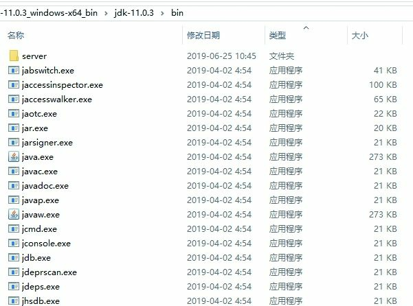

图4-1　JDK自带工具

在本章，笔者将介绍这些工具中的一部分，主要是用于监视虚拟机运行状态和进行故障处理的工具。这些故障处理工具并不单纯是被Oracle公司作为“礼物”附赠给JDK的使用者，根据软件可用性和授权的不同，可以把它们划分成三类：

·商业授权工具：主要是JMC（Java Mission Control）及它要使用到的JFR（Java Flight Recorder），JMC这个原本来自于JRockit的运维监控套件从JDK 7 Update 40开始就被集成到OracleJDK

中，JDK 11之前都无须独立下载，但是在商业环境中使用它则是要付费的[1]。

·正式支持工具：这一类工具属于被长期支持的工具，不同平台、不同版本的JDK之间，这类工具

可能会略有差异，但是不会出现某一个工具突然消失的情况[2]。

·实验性工具：这一类工具在它们的使用说明中被声明为“没有技术支持，并且是实验性质的”（Unsupported and Experimental）产品，日后可能会转正，也可能会在某个JDK版本中无声无息地消失。但事实上它们通常都非常稳定而且功能强大，也能在处理应用程序性能问题、定位故障时发挥很大的作用。

读者如果比较细心的话，还可能会注意到这些工具程序大多数体积都异常小。假如之前没注意到，现在不妨再看看图4-1中的最后一列“大小”，各个工具的体积基本上都稳定在21KB左右。并非JDK开发团队刻意把它们制作得如此精炼、统一，而是因为这些命令行工具大多仅是一层薄包装而已，真正的功能代码是实现在JDK的工具类库中的，读者把图4-1和图4-2两张图片对比一下就可以看

得很清楚[3]。假如读者使用的是Linux版本的JDK，还可以发现这些工具中不少是由Shell脚本直接写成，可以用文本编辑器打开并编辑修改它们。

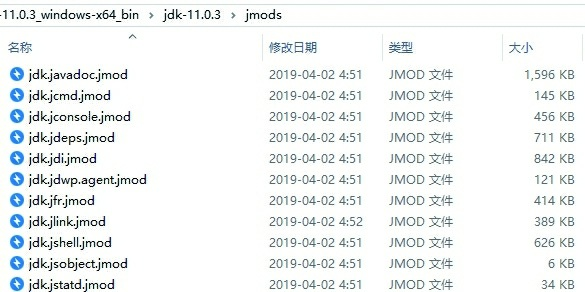

图4-2　JDK类库中的工具模块

JDK开发团队选择采用Java语言本身来实现这些故障处理工具是有特别用意的：当应用程序部署到生产环境后，无论是人工物理接触到服务器还是远程Telnet到服务器上都可能会受到限制。借助这些工具类库里面的接口和实现代码，开发者可以选择直接在应用程序中提供功能强大的监控分析功能[4]。

本章所讲解的工具大多基于Windows平台下的JDK进行演示，如果读者选用的JDK版本、操作系统不同，那么工具不仅可能数量上有所差别，同一个工具所支持的功能范围和效果都可能会不一样。本章提及的工具，如无特别说明，是JDK 5中就已经存在的，但为了避免运行环境带来的差异和兼容性问题，建议读者使用更高版本的JDK来验证本章介绍的内容。通常高版本JDK的工具有可能向下兼

容运行于低版本JDK的虚拟机上的程序，反之则一般不行。


注意　如果读者在工作中需要监控运行于JDK 5的虚拟机之上的程序，在程序启动时请添加参数“-Dcom.sun.management.jmxremote”开启JMX管理功能，否则由于大部分工具都是基于或者要用到JMX（包括下一节的可视化工具），它们都将无法使用，如果被监控程序运行于JDK 6或以上版本的虚拟机之上，那JMX管理默认是开启的，虚拟机启动时无须再添加任何参数。

[1] 无论是GPL、BCL还是OTN协议，JMC在个人开发环境中使用是免费的。[2]这并不意味着永久存在，只是被移除前会有“deprecated”的过渡期，正式工具被移除的数量并不比实验性工具来得少。[3] 图4-2中展示的是JDK 9模块化改造之后的类库形式，在JDK 9前，这些代码实现在jdk\lib\tools.jar中。[4] 有一部分工具的实现并不属于Java SE的标准API，如果引入这些类库，就意味着你的程序只能运行于HotSpot（或一些从Oracle买了JDK的源码许可证的虚拟机）上面，又或者在部署程序时需要一起部署这些工具类库。

#### 4.2.1　jps：虚拟机进程状况工具

JDK的很多小工具的名字都参考了UNIX命令的命名方式，jps（JVM Process Status Tool）是其中的典型。除了名字像UNIX的ps命令之外，它的功能也和ps命令类似：可以列出正在运行的虚拟机进程，并显示虚拟机执行主类（Main Class，main()函数所在的类）名称以及这些进程的本地虚拟机唯一ID（LVMID，Local Virtual Machine Identifier）。虽然功能比较单一，但它绝对是使用频率最高的JDK命令行工具，因为其他的JDK工具大多需要输入它查询到的LVMID来确定要监控的是哪一个虚拟机进程。对于本地虚拟机进程来说，LVMID与操作系统的进程ID（PID，Process Identifier）是一致的，使用Windows的任务管理器或者UNIX的ps命令也可以查询到虚拟机进程的LVMID，但如果同时启动了多个虚拟机进程，无法根据进程名称定位时，那就必须依赖jps命令显示主类的功能才能区分了。

jps命令格式：

```bash
jps [ options ] [ hostid ]
```

jps执行样例：

```bash
jps -l
2388 D:\Develop\glassfish\bin\..\modules\admin-cli.jar
2764 com.sun.enterprise.glassfish.bootstrap.ASMain
3788 sun.tools.jps.Jps
```

jps还可以通过RMI协议查询开启了RMI服务的远程虚拟机进程状态，参数hostid为RMI注册表中注册的主机名。jps的其他常用选项见表4-1。

表4-1　jps工具主要选项

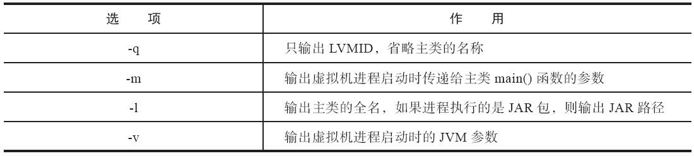

#### 4.2.2　jstat：虚拟机统计信息监视工具

jstat（JVM Statistics Monitoring Tool）是用于监视虚拟机各种运行状态信息的命令行工具。它可

以显示本地或者远程[1]虚拟机进程中的类加载、内存、垃圾收集、即时编译等运行时数据，在没有GUI图形界面、只提供了纯文本控制台环境的服务器上，它将是运行期定位虚拟机性能问题的常用工具。

jstat命令格式为：

```bash
jstat [ option vmid [interval[s|ms] [count]] ]
```

对于命令格式中的VMID与LVMID需要特别说明一下：如果是本地虚拟机进程，VMID与LVMID是一致的；如果是远程虚拟机进程，那VMID的格式应当是：

```text
[protocol:][//]lvmid[@hostname[:port]/servername]
```

参数interval和count代表查询间隔和次数，如果省略这2个参数，说明只查询一次。假设需要每250毫秒查询一次进程2764垃圾收集状况，一共查询20次，那命令应当是：

```bash
jstat -gc 2764 250 20
```

选项option代表用户希望查询的虚拟机信息，主要分为三类：类加载、垃圾收集、运行期编译状况。详细请参考表4-2中的描述。

表4-2　jstat工具主要选项

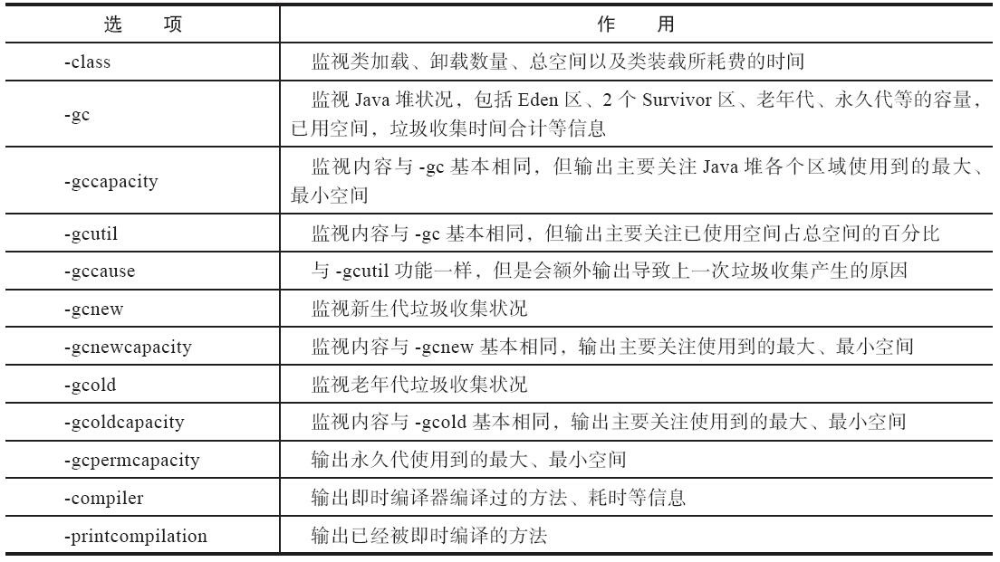

jstat监视选项众多，囿于版面原因无法逐一演示，这里仅举一个在命令行下监视一台刚刚启动的GlassFish v3服务器的内存状况的例子，用以演示如何查看监视结果。监视参数与输出结果如代码清单4-1所示。

代码清单4-1　jstat执行样例

```bash
jstat -gcutil 2764
S0      S1      E       O        P        YGC    YGCT     FGC    FGCT     GCT
0.00    0.00    6.20    41.42    47.20    16     0.105    3      0.472    0.577
```

查询结果表明：这台服务器的新生代Eden区（E，表示Eden）使用了6.2%的空间，2个Survivor区（S0、S1，表示Survivor0、Survivor1）里面都是空的，老年代（O，表示Old）和永久代（P，表示Permanent）则分别使用了41.42%和47.20%的空间。程序运行以来共发生Minor GC（YGC，表示Young GC）16次，总耗时0.105秒；发生Full GC（FGC，表示Full GC）3次，总耗时（FGCT，表示Full GC Time）为0.472秒；所有GC总耗时（GCT，表示GC Time）为0.577秒。

使用jstat工具在纯文本状态下监视虚拟机状态的变化，在用户体验上也许不如后文将会提到的JMC、VisualVM等可视化的监视工具直接以图表展现那样直观，但在实际生产环境中不一定可以使用图形界面，而且多数服务器管理员也都已经习惯了在文本控制台工作，直接在控制台中使用jstat命令依然是一种常用的监控方式。

[1] 需要远程主机提供RMI支持，JDK中提供了jstatd工具可以很方便地建立远程RMI服务器。

#### 4.2.3　jinfo：Java配置信息工具

jinfo（Configuration Info for Java）的作用是实时查看和调整虚拟机各项参数。使用jps命令的-v参数可以查看虚拟机启动时显式指定的参数列表，但如果想知道未被显式指定的参数的系统默认值，除了去找资料外，就只能使用jinfo的-flag选项进行查询了（如果只限于JDK 6或以上版本的话，使用java-XX：+PrintFlagsFinal查看参数默认值也是一个很好的选择）。jinfo还可以使用-sysprops选项把虚拟机进程的System.getProperties()的内容打印出来。这个命令在JDK 5时期已经随着Linux版的JDK发布，当时只提供了信息查询的功能，JDK 6之后，jinfo在Windows和Linux平台都有提供，并且加入了在运行期修改部分参数值的能力（可以使用-flag[+|-]name或者-flag name=value在运行期修改一部分运行期可写的虚拟机参数值）。在JDK 6中，jinfo对于Windows平台功能仍然有较大限制，只提供了最基本的-flag选项。

jinfo命令格式：

```bash
jinfo [ option ] pid
```

执行样例：查询CMSInitiatingOccupancyFraction参数值

```bash
jinfo -flag CMSInitiatingOccupancyFraction 1444
-XX:CMSInitiatingOccupancyFraction=85
```

#### 4.2.4　jmap：Java内存映像工具

jmap（Memory Map for Java）命令用于生成堆转储快照（一般称为heapdump或dump文件）。如果不使用jmap命令，要想获取Java堆转储快照也还有一些比较“暴力”的手段：譬如在第2章中用过的-XX：+HeapDumpOnOutOfMemoryError参数，可以让虚拟机在内存溢出异常出现之后自动生成堆转储快照文件，通过-XX：+HeapDumpOnCtrlBreak参数则可以使用[Ctrl]+[Break]键让虚拟机生成堆转储快照文件，又或者在Linux系统下通过Kill-3命令发送进程退出信号“恐吓”一下虚拟机，也能顺利拿到堆转储快照。

jmap的作用并不仅仅是为了获取堆转储快照，它还可以查询finalize执行队列、Java堆和方法区的详细信息，如空间使用率、当前用的是哪种收集器等。

和jinfo命令一样，jmap有部分功能在Windows平台下是受限的，除了生成堆转储快照的-dump选项和用于查看每个类的实例、空间占用统计的-histo选项在所有操作系统中都可以使用之外，其余选项都只能在Linux/Solaris中使用。

jmap命令格式：

```bash
jmap [ option ] vmid
```

option选项的合法值与具体含义如表4-3所示。

表4-3　jmap工具主要选项

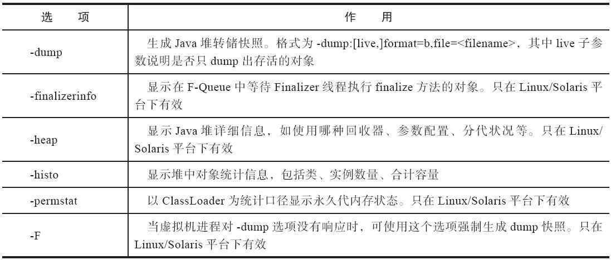

代码清单4-2是使用jmap生成一个正在运行的Eclipse的堆转储快照文件的例子，例子中的3500是通过jps命令查询到的LVMID。

代码清单4-2　使用jmap生成dump文件

```bash
jmap -dump:format=b,file=eclipse.bin 3500
Dumping heap to C:\Users\IcyFenix\eclipse.bin ...
Heap dump file created
```

#### 4.2.5　jhat：虚拟机堆转储快照分析工具

JDK提供jhat（JVM Heap Analysis Tool）命令与jmap搭配使用，来分析jmap生成的堆转储快照。jhat内置了一个微型的HTTP/Web服务器，生成堆转储快照的分析结果后，可以在浏览器中查看。不过实事求是地说，在实际工作中，除非手上真的没有别的工具可用，否则多数人是不会直接使用jhat命令来分析堆转储快照文件的，主要原因有两个方面。一是一般不会在部署应用程序的服务器上直接分析

堆转储快照，即使可以这样做，也会尽量将堆转储快照文件复制到其他机器[1]上进行分析，因为分析工作是一个耗时而且极为耗费硬件资源的过程，既然都要在其他机器上进行，就没有必要再受命令行工具的限制了。另外一个原因是jhat的分析功能相对来说比较简陋，后文将会介绍到的VisualVM，以

及专业用于分析堆转储快照文件的Eclipse Memory Analyzer、IBM HeapAnalyzer[2]等工具，都能实现比jhat更强大专业的分析功能。代码清单4-3演示了使用jhat分析上一节采用jmap生成的Eclipse IDE的内存快照文件。

代码清单4-3　使用jhat分析dump文件

```text
jhat eclipse.bin
Reading from eclipse.bin...
Dump file created Fri Nov 19 22:07:21 CST 2010
Snapshot read, resolving...
Resolving 1225951 objects...
Chasing references, expect 245 dots....
Eliminating duplicate references...
Snapshot resolved.
Started HTTP server on port 7000
Server is ready.
```

屏幕显示“Server is ready.”的提示后，用户在浏览器中输入http://localhost:7000/可以看到分析结果，如图4-3所示。

分析结果默认以包为单位进行分组显示，分析内存泄漏问题主要会使用到其中的“Heap Histogram”（与jmap-histo功能一样）与OQL页签的功能，前者可以找到内存中总容量最大的对象，后者是标准的对象查询语言，使用类似SQL的语法对内存中的对象进行查询统计。如果读者需要了解具体OQL的语法和使用方法，可参见本书附录D的内容。

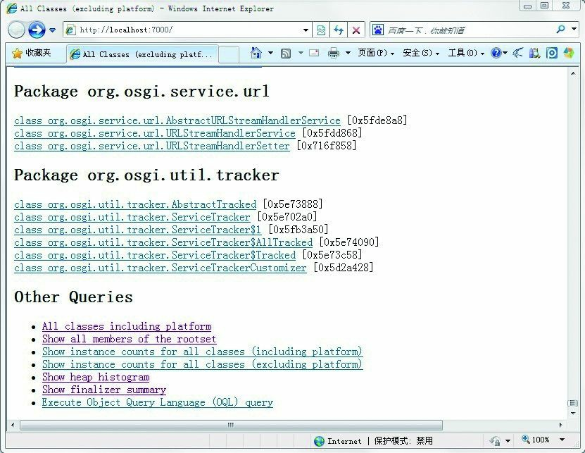

图4-3　jhat的分析结果[1] 用于分析的机器一般也是服务器，由于加载dump快照文件需要比生成dump更大的内存，所以一般在64位JDK、大内存的服务器上进行。[2] IBM HeapAnalyzer用于分析IBM J9虚拟机生成的映像文件，各个虚拟机产生的映像文件格式并不一致，所以分析工具也不能通用。

#### 4.2.6　jstack：Java堆栈跟踪工具

jstack（Stack Trace for Java）命令用于生成虚拟机当前时刻的线程快照（一般称为threaddump或者javacore文件）。线程快照就是当前虚拟机内每一条线程正在执行的方法堆栈的集合，生成线程快照的目的通常是定位线程出现长时间停顿的原因，如线程间死锁、死循环、请求外部资源导致的长时间挂起等，都是导致线程长时间停顿的常见原因。线程出现停顿时通过jstack来查看各个线程的调用堆栈，就可以获知没有响应的线程到底在后台做些什么事情，或者等待着什么资源。

jstack命令格式：

```bash
jstack [ option ] vmid
```

option选项的合法值与具体含义如表4-4所示。

表4-4　jstack工具主要选项


代码清单4-4是使用jstack查看Eclipse线程堆栈的例子，例子中的3500是通过jps命令查询到的LVMID。

代码清单4-4　使用jstack查看线程堆栈（部分结果）

```bash
jstack -l 3500
2010-11-19 23:11:26
Full thread dump Java HotSpot(TM) 64-Bit Server VM (17.1-b03 mixed mode):
"[ThreadPool Manager] - Idle Thread" daemon prio=6 tid=0x0000000039dd4000 nid= 0xf50 in Object.wait() [0x000000003c96f000]
    java.lang.Thread.State: WAITING (on object monitor)
        at java.lang.Object.wait(Native Method)
        - waiting on <0x0000000016bdcc60> (a org.eclipse.equinox.internal.util.impl.tpt.threadpool.Executor)
        at java.lang.Object.wait(Object.java:485)
        at org.eclipse.equinox.internal.util.impl.tpt.threadpool.Executor.run (Executor. java:106)
        - locked <0x0000000016bdcc60> (a org.eclipse.equinox.internal.util.impl.tpt.threadpool.Executor)
    Locked ownable synchronizers:
        - None
```

从JDK 5起，java.lang.Thread类新增了一个getAllStackTraces()方法用于获取虚拟机中所有线程的StackTraceElement对象。使用这个方法可以通过简单的几行代码完成jstack的大部分功能，在实际项目中不妨调用这个方法做个管理员页面，可以随时使用浏览器来查看线程堆栈，如代码清单4-5所示，这也算是笔者的一个小经验。

代码清单4-5　查看线程状况的JSP页面

```java
<%@ page import="java.util.Map"%>
<html>
<head>
<title>服务器线程信息</title>
</head>
<body>
<pre>
<%
    for (Map.Entry<Thread, StackTraceElement[]> stackTrace : Thread.getAllStack-Traces().entrySet()) {
        Thread thread = (Thread) stackTrace.getKey();
        StackTraceElement[] stack = (StackTraceElement[]) stackTrace.getValue();
        if (thread.equals(Thread.currentThread())) {
            continue;
        }
        out.print("\n线程：" + thread.getName() + "\n");
        for (StackTraceElement element : stack) {
            out.print("\t"+element+"\n");
        }
    }
%>
</pre>
</body>
</html>
```

#### 4.2.7　基础工具总结

下面表4-5～表4-14中罗列了JDK附带的全部（包括曾经存在但已经在最新版本中被移除的）工具及其简要用途，限于篇幅，本节只讲解了6个常用的命令行工具。笔者选择这几个工具除了因为它们是最基础的命令外，还因为它们已经有很长的历史，能适用于大多数读者工作、学习中使用的JDK版本。在高版本的JDK中，这些工具大多已有了功能更为强大的替代品，譬如JCMD、JHSDB的命令行模式，但使用方法也是相似的，无论JDK发展到了什么版本，学习这些基础的工具命令并不会过时和浪费。

·基础工具：用于支持基本的程序创建和运行（见表4-5）

表4-5　基础工具

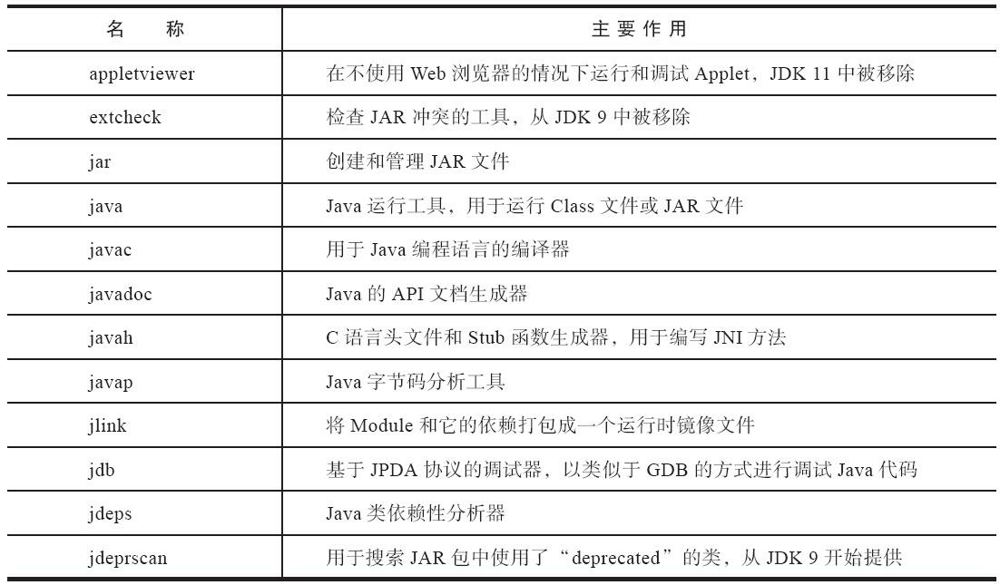

·安全：用于程序签名、设置安全测试等（见表4-6）

表4-6　安全工具

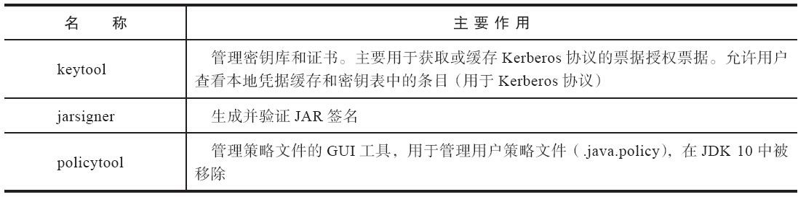

·国际化：用于创建本地语言文件（见表4-7）

表4-7　国际化工具


·远程方法调用：用于跨Web或网络的服务交互（见表4-8）

表4-8　远程方法调用工具

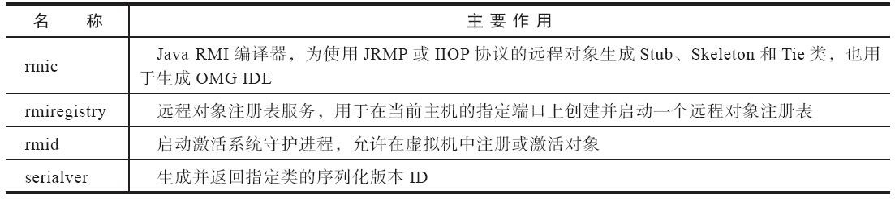

·Java IDL与RMI-IIOP：在JDK 11中结束了十余年的CORBA支持，这些工具不再提供[1]（见表4-9）

表4-9　Java IDL与RMI-IIOP

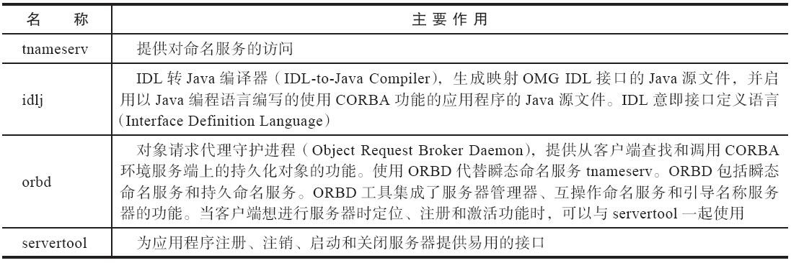

·部署工具：用于程序打包、发布和部署（见表4-10）

表4-10　部署工具

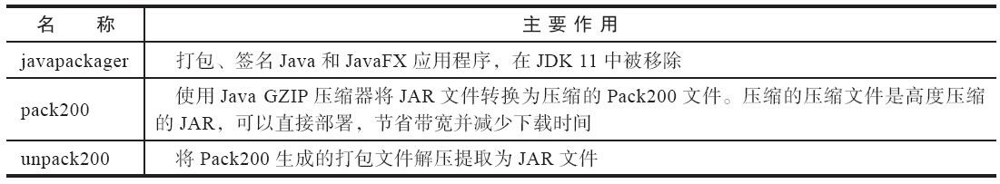

·Java Web Start（见表4-11）

表4-11　Java Web Start


·性能监控和故障处理：用于监控分析Java虚拟机运行信息，排查问题（见表4-12）

表4-12　性能监控和故障处理工具

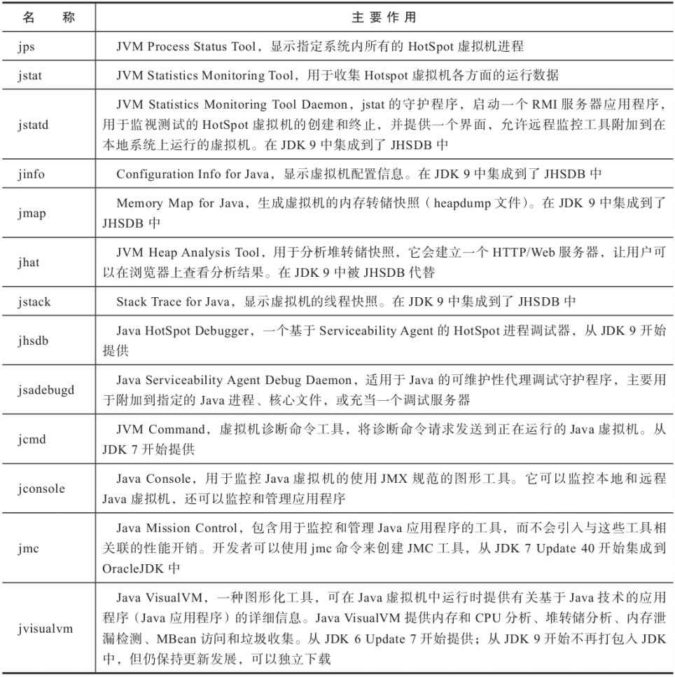

·WebService工具：与CORBA一起在JDK 11中被移除（见表4-13）

表4-13　WebService工具

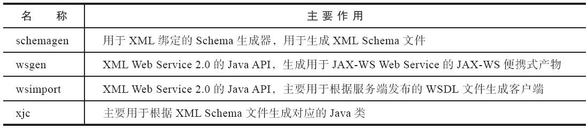

·REPL和脚本工具（见表4-14）

表4-14　REPL和脚本工具

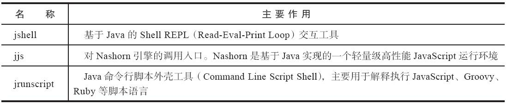

[1] 详细信息见http://openjdk.java.net/jeps/320。

### 4.3　可视化故障处理工具

JDK中除了附带大量的命令行工具外，还提供了几个功能集成度更高的可视化工具，用户可以使用这些可视化工具以更加便捷的方式进行进程故障诊断和调试工作。这类工具主要包括JConsole、JHSDB、VisualVM和JMC四个。其中，JConsole是最古老，早在JDK 5时期就已经存在的虚拟机监控工具，而JHSDB虽然名义上是JDK 9中才正式提供，但之前已经以sa-jdi.jar包里面的HSDB（可视化工

具）和CLHSDB（命令行工具）的形式存在了很长一段时间[1]。它们两个都是JDK的正式成员，随着JDK一同发布，无须独立下载，使用也是完全免费的。

VisualVM在JDK 6 Update 7中首次发布，直到JRockit Mission Control与OracleJDK的融合工作完成之前，它都曾是Oracle主力推动的多合一故障处理工具，现在它已经从OracleJDK中分离出来，成为一

个独立发展的开源项目[2]。VisualVM已不是JDK中的正式成员，但仍是可以免费下载、使用的。

Java Mission Control，曾经是大名鼎鼎的来自BEA公司的图形化诊断工具，随着BEA公司被Oracle收购，它便被融合进OracleJDK之中。在JDK 7 Update 40时开始随JDK一起发布，后来Java SE

Advanced产品线建立，Oracle明确区分了Oracle OpenJDK和OracleJDK的差别[3]，JMC从JDK 11开始又被移除出JDK。虽然在2018年Oracle将JMC开源并交付给OpenJDK组织进行管理，但开源并不意味着免费使用，JMC需要与HotSpot内部的“飞行记录仪”（Java Flight Recorder，JFR）配合才能工作，而在JDK 11以前，JFR的开启必须解锁OracleJDK的商业特性支持（使用JCMD的VM.unlock_commercial_features或启动时加入-XX：+UnlockCommercialFeatures参数），所以这项功能在生产环境中仍然是需要付费才能使用的商业特性。

为避免本节讲解的内容变成对软件说明文档的简单翻译，笔者准备了一些代码样例，大多数是笔者特意编写的反面教材。稍后将会使用几款工具去监控、分析这些代码存在的问题，算是本节简单的实战演练。读者可以把在可视化工具观察到的数据、现象，与前面两章中讲解的理论知识进行互相验证。

[1] 准确来说是Linux和Solaris在OracleJDK 6就可以使用HSDB和CLHSDB了，Windows上要到Oracle-JDK 7才可以用。[2] VisualVM官方站点：https://visualvm.github.io。[3] 详见https://blogs.oracle.com/java-platform-group/oracle-jdk-releases-for-java-11-and-later。

#### 4.3.1　JHSDB：基于服务性代理的调试工具

JDK中提供了JCMD和JHSDB两个集成式的多功能工具箱，它们不仅整合了上一节介绍到的所有基础工具所能提供的专项功能，而且由于有着“后发优势”，能够做得往往比之前的老工具们更好、更强大，表4-15所示是JCMD、JHSDB与原基础工具实现相同功能的简要对比。

表4-15　JCMD、JHSDB和基础工具的对比

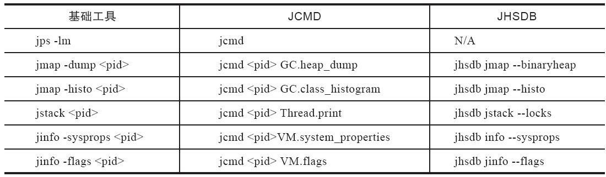

本节的主题是可视化的故障处理，所以JCMD及JHSDB的命令行模式就不再作重点讲解了，读者可参考上一节的基础命令，再借助它们在JCMD和JHSDB中的help去使用，相信是很容易举一反三、触类旁通的。接下来笔者要通过一个实验来讲解JHSDB的图形模式下的功能。

JHSDB是一款基于服务性代理（Serviceability Agent，SA）实现的进程外调试工具。服务性代理是HotSpot虚拟机中一组用于映射Java虚拟机运行信息的、主要基于Java语言（含少量JNI代码）实现的API集合。服务性代理以HotSpot内部的数据结构为参照物进行设计，把这些C++的数据抽象出Java模型对象，相当于HotSpot的C++代码的一个镜像。通过服务性代理的API，可以在一个独立的Java虚拟机的进程里分析其他HotSpot虚拟机的内部数据，或者从HotSpot虚拟机进程内存中dump出来的转储快照里还原出它的运行状态细节。服务性代理的工作原理跟Linux上的GDB或者Windows上的Windbg是相

似的。本次，我们要借助JHSDB来分析一下代码清单4-6中的代码[1]，并通过实验来回答一个简单问题：staticObj、instanceObj、localObj这三个变量本身（而不是它们所指向的对象）存放在哪里？

代码清单4-6　JHSDB测试代码

```java
/**
 * staticObj、instanceObj、localObj存放在哪里？
 */
public class JHSDB_TestCase {
    static class Test {
        static ObjectHolder staticObj = new ObjectHolder();
        ObjectHolder instanceObj = new ObjectHolder();
        void foo() {
            ObjectHolder localObj = new ObjectHolder();
            System.out.println("done");    // 这里设一个断点
        }
    }
    private static class ObjectHolder {}
    public static void main(String[] args) {
        Test test = new JHSDB_TestCase.Test();
        test.foo();
    }
}
```

答案读者当然都知道：staticObj随着Test的类型信息存放在方法区，instanceObj随着Test的对象实例存放在Java堆，localObject则是存放在foo()方法栈帧的局部变量表中。这个答案是通过前两章学习的理论知识得出的，现在要做的是通过JHSDB来实践验证这一点。

首先，我们要确保这三个变量已经在内存中分配好，然后将程序暂停下来，以便有空隙进行实验，这只要把断点设置在代码中加粗的打印语句上，然后在调试模式下运行程序即可。由于JHSDB本身对压缩指针的支持存在很多缺陷，建议用64位系统的读者在实验时禁用压缩指针，另外为了后续操作时可以加快在内存中搜索对象的速度，也建议读者限制一下Java堆的大小。本例中，笔者采用的运行参数如下：

```text
-Xmx10m -XX:+UseSerialGC -XX:-UseCompressedOops
```

程序执行后通过jps查询到测试程序的进程ID，具体如下：

```bash
jps -l
8440 org.jetbrains.jps.cmdline.Launcher
11180 JHSDB_TestCase
15692 jdk.jcmd/sun.tools.jps.Jps
```

使用以下命令进入JHSDB的图形化模式，并使其附加进程11180：

```text
jhsdb hsdb --pid 11180
```

命令打开的JHSDB的界面如图4-4所示。

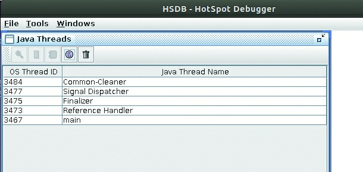

图4-4　JHSDB的界面

阅读代码清单4-6可知，运行至断点位置一共会创建三个ObjectHolder对象的实例，只要是对象实例必然会在Java堆中分配，既然我们要查找引用这三个对象的指针存放在哪里，不妨从这三个对象开始着手，先把它们从Java堆中找出来。

首先点击菜单中的Tools->Heap Parameters[2]，结果如图4-5所示，因为笔者的运行参数中指定了使用的是Serial收集器，图中我们看到了典型的Serial的分代内存布局，Heap Parameters窗口中清楚列出了新生代的Eden、S1、S2和老年代的容量（单位为字节）以及它们的虚拟内存地址起止范围。

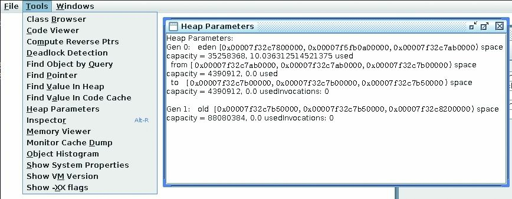

图4-5　Serial收集器的堆布局

如果读者实践时不指定收集器，即使用JDK默认的G1的话，得到的信息应该类似如下所示：

```text
Heap Parameters:
garbage-first heap [0x00007f32c7800000, 0x00007f32c8200000] region size 1024K
```

请读者注意一下图中各个区域的内存地址范围，后面还要用到它们。打开Windows->Console窗口，使用scanoops命令在Java堆的新生代（从Eden起始地址到To Survivor结束地址）范围内查找ObjectHolder的实例，结果如下所示：

```text
hsdb>scanoops 0x00007f32c7800000 0x00007f32c7b50000 JHSDB_TestCase$ObjectHolder
0x00007f32c7a7c458 JHSDB_TestCase$ObjectHolder
0x00007f32c7a7c480 JHSDB_TestCase$ObjectHolder
0x00007f32c7a7c490 JHSDB_TestCase$ObjectHolder
```

果然找出了三个实例的地址，而且它们的地址都落到了Eden的范围之内，算是顺带验证了一般情况下新对象在Eden中创建的分配规则。再使用Tools->Inspector功能确认一下这三个地址中存放的对象，结果如图4-6所示。

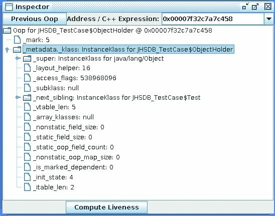

图4-6　查看对象实例数据

Inspector为我们展示了对象头和指向对象元数据的指针，里面包括了Java类型的名字、继承关系、实现接口关系，字段信息、方法信息、运行时常量池的指针、内嵌的虚方法表（vtable）以及接口方法表（itable）等。由于我们的确没有在ObjectHolder上定义过任何字段，所以图中并没有看到任何实例字段数据，读者在做实验时不妨定义一些不同数据类型的字段，观察它们在HotSpot虚拟机里面是如何存储的。

接下来要根据堆中对象实例地址找出引用它们的指针，原本JHSDB的Tools菜单中有Compute Reverse Ptrs来完成这个功能，但在笔者的运行环境中一点击它就出现Swing的界面异常，看后台日志是报了个空指针，这个问题只是界面层的异常，跟虚拟机关系不大，所以笔者没有继续去深究，改为使用命令来做也很简单，先拿第一个对象来试试看：

```text
hsdb> revptrs 0x00007f32c7a7c458
Computing reverse pointers...
Done.
Oop for java/lang/Class @ 0x00007f32c7a7b180
```

果然找到了一个引用该对象的地方，是在一个java.lang.Class的实例里，并且给出了这个实例的地址，通过Inspector查看该对象实例，可以清楚看到这确实是一个java.lang.Class类型的对象实例，里面有一个名为staticObj的实例字段，如图4-7所示。

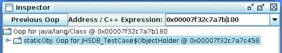

图4-7　Class对象

从《Java虚拟机规范》所定义的概念模型来看，所有Class相关的信息都应该存放在方法区之中，但方法区该如何实现，《Java虚拟机规范》并未做出规定，这就成了一件允许不同虚拟机自己灵活把握的事情。JDK 7及其以后版本的HotSpot虚拟机选择把静态变量与类型在Java语言一端的映射Class对

象存放在一起，存储于Java堆之中，从我们的实验中也明确验证了这一点[3]。接下来继续查找第二个对象实例：

```text
hsdb>revptrs 0x00007f32c7a7c480
Computing reverse pointers...
Done.
Oop for JHSDB_TestCase$Test @ 0x00007f32c7a7c468
```

这次找到一个类型为JHSDB_TestCase$Test的对象实例，在Inspector中该对象实例显示如图4-8所示。

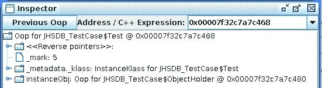

图4-8　JHSDB_TestCase$Test对象

这个结果完全符合我们的预期，第二个ObjectHolder的指针是在Java堆中JHSDB_TestCase$Test对象的instanceObj字段上。但是我们采用相同方法查找第三个ObjectHolder实例时，JHSDB返回了一个null，表示未查找到任何结果：

```text
hsdb> revptrs 0x00007f32c7a7c490
null
```

看来revptrs命令并不支持查找栈上的指针引用，不过没有关系，得益于我们测试代码足够简洁，人工也可以来完成这件事情。在Java Thread窗口选中main线程后点击Stack Memory按钮查看该线程的栈内存，如图4-9所示。

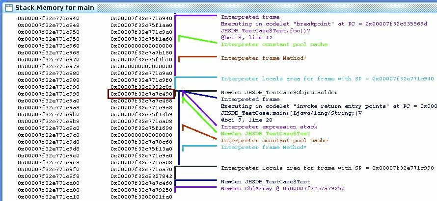

图4-9　main线程的栈内存

这个线程只有两个方法栈帧，尽管没有查找功能，但通过肉眼观察在地址0x00007f32e771c998上的值正好就是0x00007f32c7a7c490，而且JHSDB在旁边已经自动生成注释，说明这里确实是引用了一

个来自新生代的JHSDB_TestCase$ObjectHolder对象。至此，本次实验中三个对象均已找到，并成功追溯到引用它们的地方，也就实践验证了开篇中提出的这些对象的引用是存储在什么地方的问题。

JHSDB提供了非常强大且灵活的命令和功能，本节的例子只是其中一个很小的应用，读者在实际开发、学习时，可以用它来调试虚拟机进程或者dump出来的内存转储快照，以积累更多的实际经验。

[1] 本小节的原始案例来自RednaxelaFX的博客https://rednaxelafx.iteye.com/blog/1847971。[2] 效果与在Windows->Console中输入universe命令是等价的，JHSDB的图形界面中所有操作都可以通过命令行完成，读者感兴趣的话，可以在控制台中输入help命令查看更多信息。[3] 在JDK 7以前，即还没有开始“去永久代”行动时，这些静态变量是存放在永久代上的，JDK 7起把静态变量、字符常量这些从永久代移除出去。

#### 4.3.2　JConsole：Java监视与管理控制台

JConsole（Java Monitoring and Management Console）是一款基于JMX（Java Manage-ment Extensions）的可视化监视、管理工具。它的主要功能是通过JMX的MBean（Managed Bean）对系统进行信息收集和参数动态调整。JMX是一种开放性的技术，不仅可以用在虚拟机本身的管理上，还可以运行于虚拟机之上的软件中，典型的如中间件大多也基于JMX来实现管理与监控。虚拟机对JMX MBean的访问也是完全开放的，可以使用代码调用API、支持JMX协议的管理控制台，或者其他符合JMX规范的软件进行访问。

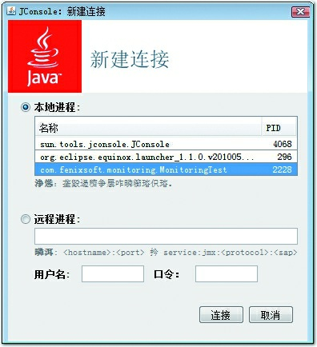

图4-10　JConsole连接页面

1.启动JConsole

通过JDK/bin目录下的jconsole.exe启动JCon-sole后，会自动搜索出本机运行的所有虚拟机进程，而

不需要用户自己使用jps来查询，如图4-10所示。双击选择其中一个进程便可进入主界面开始监控。JMX支持跨服务器的管理，也可以使用下面的“远程进程”功能来连接远程服务器，对远程虚拟机进行监控。

图4-10中可以看到笔者的机器现在运行了Eclipse、JConsole、MonitoringTest三个本地虚拟机进程，这里MonitoringTest是笔者准备的“反面教材”代码之一。双击它进入JConsole主界面，可以看到主界面里共包括“概述”“内存”“线程”“类”“VM摘要”“MBean”六个页签，如图4-11所示。

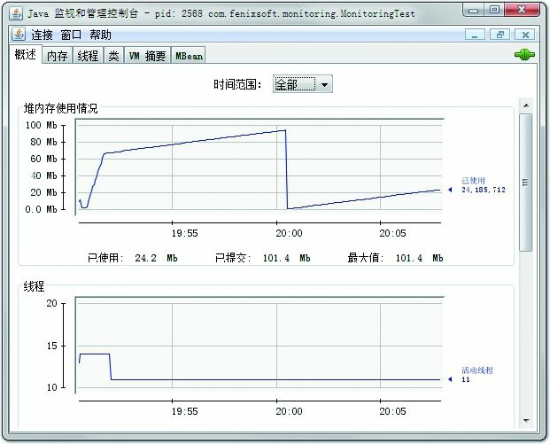

图4-11　JConsole主界面

“概述”页签里显示的是整个虚拟机主要运行数据的概览信息，包括“堆内存使用情况”“线程”“类”“CPU使用情况”四项信息的曲线图，这些曲线图是后面“内存”“线程”“类”页签的信息汇总，具体内容将在稍后介绍。

2.内存监控

“内存”页签的作用相当于可视化的jstat命令，用于监视被收集器管理的虚拟机内存（被收集器直接管理的Java堆和被间接管理的方法区）的变化趋势。我们通过运行代码清单4-7中的代码来体验一下它的监视功能。运行时设置的虚拟机参数为：

```text
-Xms100m -Xmx100m -XX:+UseSerialGC
```

代码清单4-7　JConsole监视代码

```java
/**
 * 内存占位符对象，一个OOMObject大约占64KB
 */
static class OOMObject {
    public byte[] placeholder = new byte[64 * 1024];
}
public static void fillHeap(int num) throws InterruptedException {
    List<OOMObject> list = new ArrayList<OOMObject>();
    for (int i = 0; i < num; i++) {
        // 稍作延时，令监视曲线的变化更加明显
        Thread.sleep(50);
        list.add(new OOMObject());
    }
    System.gc();
}
public static void main(String[] args) throws Exception {
    fillHeap(1000);
}
```

这段代码的作用是以64KB/50ms的速度向Java堆中填充数据，一共填充1000次，使用JConsole的“内存”页签进行监视，观察曲线和柱状指示图的变化。

程序运行后，在“内存”页签中可以看到内存池Eden区的运行趋势呈现折线状，如图4-12所示。监视范围扩大至整个堆后，会发现曲线是一直平滑向上增长的。从柱状图可以看到，在1000次循环执行结束，运行了System.gc()后，虽然整个新生代Eden和Survivor区都基本被清空了，但是代表老年代的柱状图仍然保持峰值状态，说明被填充进堆中的数据在System.gc()方法执行之后仍然存活。笔者的分析就到此为止，提两个小问题供读者思考一下，答案稍后公布。

1）虚拟机启动参数只限制了Java堆为100MB，但没有明确使用-Xmn参数指定新生代大小，读者能否从监控图中估算出新生代的容量？

2）为何执行了System.gc()之后，图4-12中代表老年代的柱状图仍然显示峰值状态，代码需要如何调整才能让System.gc()回收掉填充到堆中的对象？

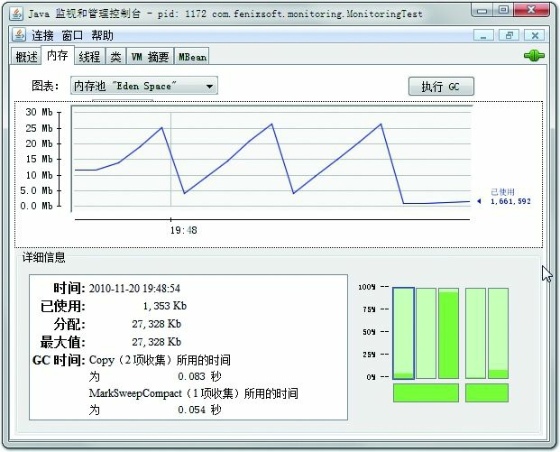

图4-12　Eden区内存变化状况

问题1答案：图4-12显示Eden空间为27328KB，因为没有设置-XX：SurvivorRadio参数，所以Eden与Survivor空间比例的默认值为8∶1，因此整个新生代空间大约为27328KB×125%=34160KB。

问题2答案：执行System.gc()之后，空间未能回收是因为List<OOMObject>list对象仍然存活，

fillHeap()方法仍然没有退出，因此list对象在System.gc()执行时仍然处于作用域之内[1]。如果把System.gc()移动到fillHeap()方法外调用就可以回收掉全部内存。

3.线程监控

如果说JConsole的“内存”页签相当于可视化的jstat命令的话，那“线程”页签的功能就相当于可视化的jstack命令了，遇到线程停顿的时候可以使用这个页签的功能进行分析。前面讲解jstack命令时提到线程长时间停顿的主要原因有等待外部资源（数据库连接、网络资源、设备资源等）、死循环、锁等待等，代码清单4-8将分别演示这几种情况。

代码清单4-8　线程等待演示代码

```java
/**
 * 线程死循环演示
 */
public static void createBusyThread() {
Thread thread = new Thread(new Runnable() {
    @Override
    public void run() {
        while (true)   // 第41行
            ;
    }
}, "testBusyThread");
thread.start();
}
/**
 * 线程锁等待演示
 */
public static void createLockThread(final Object lock) {
Thread thread = new Thread(new Runnable() {
    @Override
    public void run() {
        synchronized (lock) {
            try {
                lock.wait();
            } catch (InterruptedException e) {
                e.printStackTrace();
            }
        }
    }
}, "testLockThread");
thread.start();
}
public static void main(String[] args) throws Exception {
    BufferedReader br = new BufferedReader(new InputStreamReader(System.in));
    br.readLine();
    createBusyThread();
    br.readLine();
    Object obj = new Object();
    createLockThread(obj);
}
```

程序运行后，首先在“线程”页签中选择main线程，如图4-13所示。堆栈追踪显示BufferedReader的readBytes()方法正在等待System.in的键盘输入，这时候线程为Runnable状态，Runnable状态的线程仍会被分配运行时间，但readBytes()方法检查到流没有更新就会立刻归还执行令牌给操作系统，这种等待只消耗很小的处理器资源。

接着监控testBusyThread线程，如图4-14所示。testBusyThread线程一直在执行空循环，从堆栈追踪中看到一直在MonitoringTest.java代码的41行停留，41行的代码为while(true)。这时候线程为Runnable状态，而且没有归还线程执行令牌的动作，所以会在空循环耗尽操作系统分配给它的执行时间，直到线程切换为止，这种等待会消耗大量的处理器资源。

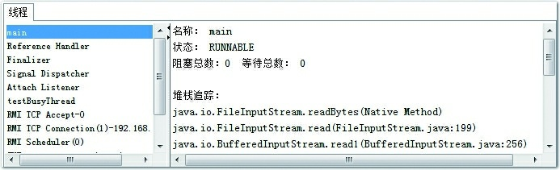

图4-13　main线程

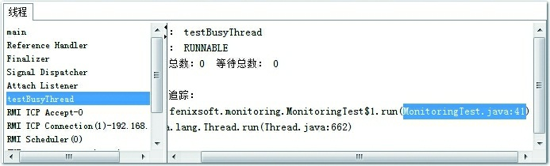

图4-14　testBusyThread线程

图4-15显示testLockThread线程在等待lock对象的notify()或notifyAll()方法的出现，线程这时候处于WAITING状态，在重新唤醒前不会被分配执行时间。

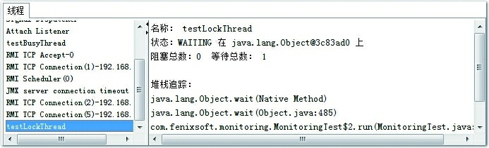

图4-15　testLockThread线程

testLockThread线程正处于正常的活锁等待中，只要lock对象的notify()或notifyAll()方法被调用，这个线程便能激活继续执行。代码清单4-9演示了一个无法再被激活的死锁等待。

代码清单4-9　死锁代码样例

```java
/**
 * 线程死锁等待演示
 */
static class SynAddRunalbe implements Runnable {
    int a, b;
    public SynAddRunalbe(int a, int b) {
        this.a = a;
        this.b = b;
    }
    @Override
    public void run() {
        synchronized (Integer.valueOf(a)) {
            synchronized (Integer.valueOf(b)) {
                System.out.println(a + b);
            }
        }
    }
}
public static void main(String[] args) {
    for (int i = 0; i < 100; i++) {
        new Thread(new SynAddRunalbe(1, 2)).start();
        new Thread(new SynAddRunalbe(2, 1)).start();
    }
}
```

这段代码开了200个线程去分别计算1+2以及2+1的值，理论上for循环都是可省略的，两个线程也可能会导致死锁，不过那样概率太小，需要尝试运行很多次才能看到死锁的效果。如果运气不是特别差的话，上面带for循环的版本最多运行两三次就会遇到线程死锁，程序无法结束。造成死锁的根本原因是Integer.valueOf()方法出于减少对象创建次数和节省内存的考虑，会对数值为-128～127之间的

Integer对象进行缓存[2]，如果valueOf()方法传入的参数在这个范围之内，就直接返回缓存中的对象。也就是说代码中尽管调用了200次Integer.valueOf()方法，但一共只返回了两个不同的Integer对象。假如某个线程的两个synchronized块之间发生了一次线程切换，那就会出现线程A在等待被线程B持有的Integer.valueOf(1)，线程B又在等待被线程A持有的Integer.valueOf(2)，结果大家都跑不下去的情况。

出现线程死锁之后，点击JConsole线程面板的“检测到死锁”按钮，将出现一个新的“死锁”页签，如图4-16所示。

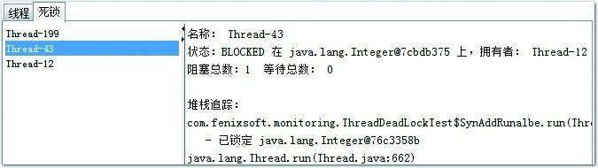

图4-16　线程死锁

图4-16中很清晰地显示，线程Thread-43在等待一个被线程Thread-12持有的Integer对象，而点击线程Thread-12则显示它也在等待一个被线程Thread-43持有的Integer对象，这样两个线程就互相卡住，除非牺牲其中一个，否则死锁无法释放。

[1] 准确地说，只有虚拟机使用解释器执行的时候，“在作用域之内”才能保证它不会被回收，因为这里的回收还涉及局部变量表变量槽的复用、即时编译器介入时机等问题，具体读者可参考第8章的代码清单8-1。[2]这是《Java虚拟机规范》中明确要求缓存的默认值，实际值可以调整，具体取决于java.lang.Integer.Integer-Cache.high参数的设置。

#### 4.3.3　VisualVM：多合-故障处理工具

VisualVM（All-in-One Java Troubleshooting Tool）是功能最强大的运行监视和故障处理程序之一，曾经在很长一段时间内是Oracle官方主力发展的虚拟机故障处理工具。Oracle曾在VisualVM的软件说明中写上了“All-in-One”的字样，预示着它除了常规的运行监视、故障处理外，还将提供其他方面的能力，譬如性能分析（Profiling）。VisualVM的性能分析功能比起JProfiler、YourKit等专业且收费的Profiling工具都不遑多让。而且相比这些第三方工具，VisualVM还有一个很大的优点：不需要被监视的程序基于特殊Agent去运行，因此它的通用性很强，对应用程序实际性能的影响也较小，使得它可以直接应用在生产环境中。这个优点是JProfiler、YourKit等工具无法与之媲美的。

1.VisualVM兼容范围与插件安装

VisualVM基于NetBeans平台开发工具，所以一开始它就具备了通过插件扩展功能的能力，有了插件扩展支持，VisualVM可以做到：

·显示虚拟机进程以及进程的配置、环境信息（jps、jinfo）。

·监视应用程序的处理器、垃圾收集、堆、方法区以及线程的信息（jstat、jstack）。

·dump以及分析堆转储快照（jmap、jhat）。

·方法级的程序运行性能分析，找出被调用最多、运行时间最长的方法。

·离线程序快照：收集程序的运行时配置、线程dump、内存dump等信息建立一个快照，可以将快照发送开发者处进行Bug反馈。

·其他插件带来的无限可能性。

VisualVM在JDK 6 Update 7中首次发布，但并不意味着它只能监控运行于JDK 6上的程序，它具备

很优秀的向下兼容性，甚至能向下兼容至2003年发布的JDK 1.4.2版本[1]，这对无数处于已经完成实施、正在维护的遗留项目很有意义。当然，也并非所有功能都能完美地向下兼容，主要功能的兼容性见表4-16所示。

表4-16　VisualVM主要功能兼容性列表

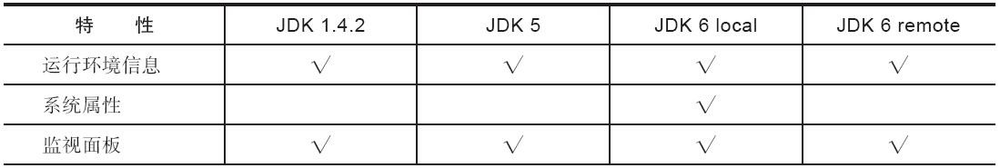

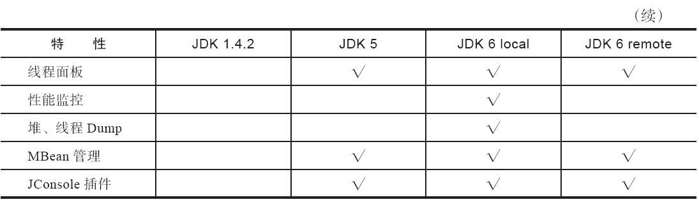

首次启动VisualVM后，读者先不必着急找应用程序进行监测，初始状态下的VisualVM并没有加载任何插件，虽然基本的监视、线程面板的功能主程序都以默认插件的形式提供，但是如果不在VisualVM上装任何扩展插件，就相当于放弃它最精华的功能，和没有安装任何应用软件的操作系统差不多。

VisualVM的插件可以手工进行安装，在网站[2]上下载nbm包后，点击“工具->插件->已下载”菜单，然后在弹出对话框中指定nbm包路径便可完成安装。独立安装的插件存储在VisualVM的根目录，譬如JDK 9之前自带的VisulalVM，插件安装后是放在JDK_HOME/lib/visualvm中的。手工安装插件并不常用，VisualVM的自动安装功能已可找到大多数所需的插件，在有网络连接的环境下，点击“工具->插件菜单”，弹出如图4-17所示的插件页签，在页签的“可用插件”及“已安装”中列举了当前版本VisualVM可以使用的全部插件，选中插件后在右边窗口会显示这个插件的基本信息，如开发者、版本、功能描述等。

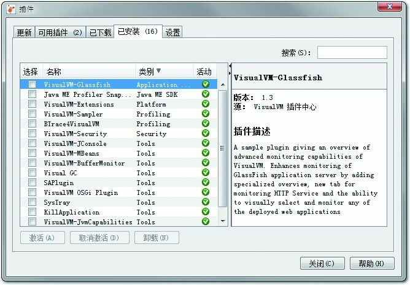

图4-17　VisualVM插件页签

读者可根据自己的工作需要和兴趣选择合适的插件，然后点击“安装”按钮，弹出如图4-18所示的下载进度窗口，跟着提示操作即可完成安装。

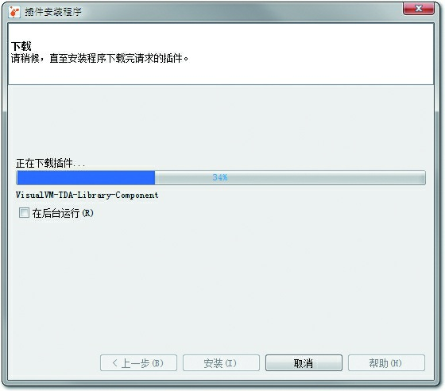

图4-18　VisualVM插件安装过程

选择一个需要监视的程序就可以进入程序的主界面了，如图4-19所示。由于VisualVM的版本以及选择安装插件数量的不同，读者看到的页签可能和笔者的截图有所差别。

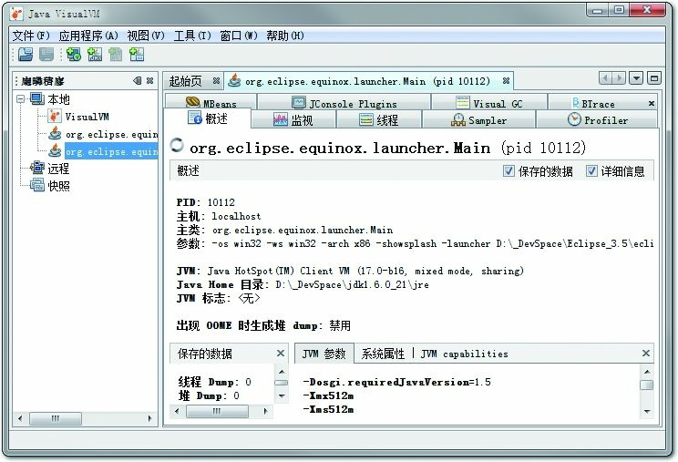

图4-19　VisualVM主界面

VisualVM中“概述”“监视”“线程”“MBeans”的功能与前面介绍的JConsole差别不大，读者可根据上一节内容类比使用，这里笔者挑选几个有特色的功能和插件进行简要介绍。

2.生成、浏览堆转储快照

在VisualVM中生成堆转储快照文件有两种方式，可以执行下列任一操作：

·在“应用程序”窗口中右键单击应用程序节点，然后选择“堆Dump”。

·在“应用程序”窗口中双击应用程序节点以打开应用程序标签，然后在“监视”标签中单击“堆Dump”。

生成堆转储快照文件之后，应用程序页签会在该堆的应用程序下增加一个以[heap-dump]开头的子节点，并且在主页签中打开该转储快照，如图4-20所示。如果需要把堆转储快照保存或发送出去，就应在heapdump节点上右键选择“另存为”菜单，否则当VisualVM关闭时，生成的堆转储快照文件会被当作临时文件自动清理掉。要打开一个由已经存在的堆转储快照文件，通过文件菜单中的“装入”功能，选择硬盘上的文件即可。

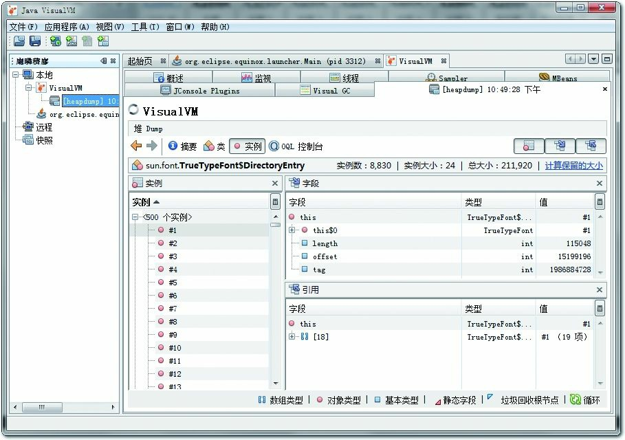

图4-20　浏览dump文件

堆页签中的“摘要”面板可以看到应用程序dump时的运行时参数、System.getPro-perties()的内容、线程堆栈等信息；“类”面板则是以类为统计口径统计类的实例数量、容量信息；“实例”面板不能直接使用，因为VisualVM在此时还无法确定用户想查看哪个类的实例，所以需要通过“类”面板进入，在“类”中选择一个需要查看的类，然后双击即可在“实例”里面看到此类的其中500个实例的具体属性信息；“OQL控制台”面板则是运行OQL查询语句的，同jhat中介绍的OQL功能一样。如果读者想要了解具体OQL的语法和使用方法，可参见本书附录D的内容。

3.分析程序性能

在Profiler页签中，VisualVM提供了程序运行期间方法级的处理器执行时间分析以及内存分析。做Profiling分析肯定会对程序运行性能有比较大的影响，所以一般不在生产环境使用这项功能，或者改用JMC来完成，JMC的Profiling能力更强，对应用的影响非常轻微。

要开始性能分析，先选择“CPU”和“内存”按钮中的一个，然后切换到应用程序中对程序进行操作，VisualVM会记录这段时间中应用程序执行过的所有方法。如果是进行处理器执行时间分析，将会统计每个方法的执行次数、执行耗时；如果是内存分析，则会统计每个方法关联的对象数以及这些对象所占的空间。等要分析的操作执行结束后，点击“停止”按钮结束监控过程，如图4-21所示。

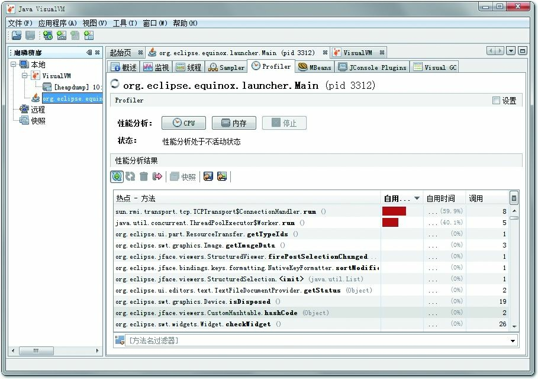

图4-21　对应用程序进行CPU执行时间分析


注意　在JDK 5之后，在客户端模式下的虚拟机加入并且自动开启了类共享——这是一个在多虚拟机进程共享rt.jar中类数据以提高加载速度和节省内存的优化，而根据相关Bug报告的反映，VisualVM的Profiler功能会因为类共享而导致被监视的应用程序崩溃，所以读者进行Profiling前，最好在被监视程序中使用-Xshare：off参数来关闭类共享优化。

图4-21中是对Eclipse IDE一段操作的录制和分析结果，读者分析自己的应用程序时，可根据实际业务复杂程度与方法的时间、调用次数做比较，找到最优化价值方法。

4.BTrace动态日志跟踪

BTrace[3]是一个很神奇的VisualVM插件，它本身也是一个可运行的独立程序。BTrace的作用是在

不中断目标程序运行的前提下，通过HotSpot虚拟机的Instrument功能[4]动态加入原本并不存在的调试代码。这项功能对实际生产中的程序很有意义：如当程序出现问题时，排查错误的一些必要信息时（譬如方法参数、返回值等），在开发时并没有打印到日志之中以至于不得不停掉服务时，都可以通过调试增量来加入日志代码以解决问题。

在VisualVM中安装了BTrace插件后，在应用程序面板中右击要调试的程序，会出现“Trace

Application…”菜单，点击将进入BTrace面板。这个面板看起来就像一个简单的Java程序开发环境，里面甚至已经有了一小段Java代码，如图4-22所示。

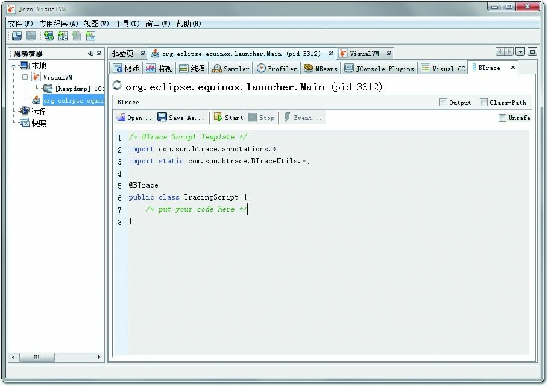

图4-22　BTrace动态跟踪

笔者准备了一段简单的Java代码来演示BTrace的功能：产生两个1000以内的随机整数，输出这两个数字相加的结果，如代码清单4-10所示。

代码清单4-10　BTrace跟踪演示

```java
public class BTraceTest {
    public int add(int a, int b) {
        return a + b;
    }
    public static void main(String[] args) throws IOException {
        BTraceTest test = new BTraceTest();
        BufferedReader reader = new BufferedReader(new InputStreamReader(System.in));
        for (int i = 0; i < 10; i++) {
            reader.readLine();
            int a = (int) Math.round(Math.random() * 1000);
            int b = (int) Math.round(Math.random() * 1000);
            System.out.println(test.add(a, b));
        }
    }
}
```

假设这段程序已经上线运行，而我们现在又有了新的需求，想要知道程序中生成的两个随机数是什么，但程序并没有在执行过程中输出这一点。此时，在VisualVM中打开该程序的监视，在BTrace页签填充TracingScript的内容，输入调试代码，如代码清单4-11所示，即可在不中断程序运行的情况下做到这一点。

代码清单4-11　BTrace调试代码

```java
/* BTrace Script Template */
import com.sun.btrace.annotations.*;
import static com.sun.btrace.BTraceUtils.*;
@BTrace
public class TracingScript {
        @OnMethod(
    clazz="org.fenixsoft.monitoring.BTraceTest",
    method="add",
    location=@Location(Kind.RETURN)
)
public static void func(@Self org.fenixsoft.monitoring.BTraceTest instance,int a, int b,@Return int result) {
    println("调用堆栈:");
    jstack();
    println(strcat("方法参数A:",str(a)));
    println(strcat("方法参数B:",str(b)));
    println(strcat("方法结果:",str(result)));
}
}
```

点击Start按钮后稍等片刻，编译完成后，Output面板中会出现“BTrace code successfuly deployed”的字样。当程序运行时将会在Output面板输出如图4-23所示的调试信息。

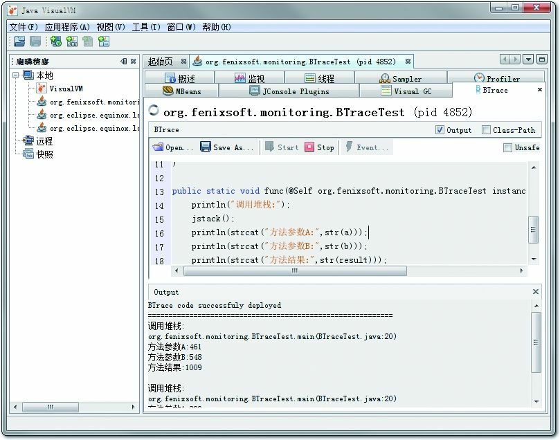

图4-23　BTrace跟踪结果

BTrace的用途很广泛，打印调用堆栈、参数、返回值只是它最基础的使用形式，在它的网站上有使用BTrace进行性能监视、定位连接泄漏、内存泄漏、解决多线程竞争问题等的使用案例，有兴趣的读者可以去网上了解相关信息。

BTrace能够实现动态修改程序行为，是因为它是基于Java虚拟机的Instrument开发的。Instrument是Java虚拟机工具接口（Java Virtual Machine Tool Interface，JVMTI）的重要组件，提供了一套代理（Agent）机制，使得第三方工具程序可以以代理的方式访问和修改Java虚拟机内部的数据。阿里巴巴开源的诊断工具Arthas也通过Instrument实现了与BTrace类似的功能。

[1] 早于JDK 6的平台，需要打开-Dcom.sun.management.jmxremote参数才能被VisualVM管理。[2] 插件中心地址：https://visualvm.github.io/pluginscenters.html。[3] 官方主页：https://github.com/btraceio/btrace。[4] 是JVMTI中的主要组成部分，HotSpot虚拟机允许在不停止运行的情况下，更新已经加载的类的代码。

#### 4.3.4　Java Mission Control：可持续在线的监控工具

除了大家熟知的面向通用计算（General Purpose Computing）可免费使用的Java SE外，Oracle公司还开辟过带商业技术支持的Oracle Java SE Support和面向独立软件供应商（ISV）的Oracle Java SE Advanced & Suite产品线。

除去带有7×24小时的技术支持以及可以为企业专门定制安装包这些非技术类的增强服务外，

Oracle Java SE Advanced & Suite[1]与普通Oracle Java SE在功能上的主要差别是前者包含了一系列的监控、管理工具，譬如用于企业JRE定制管理的AMC（Java Advanced Management Console）控制台、JUT（Java Usage Tracker）跟踪系统，用于持续收集数据的JFR（Java Flight Recorder）飞行记录仪和用于监控Java虚拟机的JMC（Java Mission Control）。这些功能全部都是需要商业授权才能在生产环境中使用，但根据Oracle Binary Code协议，在个人开发环境中，允许免费使用JMC和JFR，本节笔者将简要介绍它们的原理和使用。

JFR是一套内建在HotSpot虚拟机里面的监控和基于事件的信息搜集框架，与其他的监控工具（如JProfiling）相比，Oracle特别强调它“可持续在线”（Always-On）的特性。JFR在生产环境中对吞吐量的影响一般不会高于1%（甚至号称是Zero Performance Overhead），而且JFR监控过程的开始、停止都是完全可动态的，即不需要重启应用。JFR的监控对应用也是完全透明的，即不需要对应用程序的源码做任何修改，或者基于特定的代理来运行。

JMC最初是BEA公司的产品，因此并没有像VisualVM那样一开始就基于自家的Net-Beans平台来开发，而是选择了由IBM捐赠的Eclipse RCP作为基础框架，现在的JMC不仅可以下载到独立程序，更常见的是作为Eclipse的插件来使用。JMC与虚拟机之间同样采取JMX协议进行通信，JMC一方面作为JMX控制台，显示来自虚拟机MBean提供的数据；另一方面作为JFR的分析工具，展示来自JFR的数据。启动后JMC的主界面如图4-24所示。

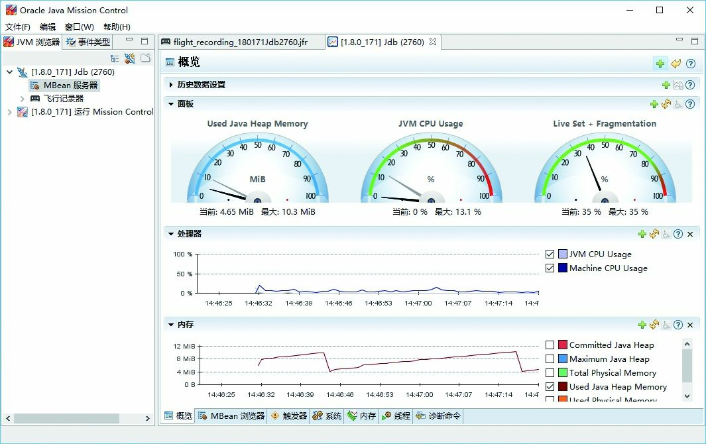

图4-24　JMC主界面

在左侧的“JVM浏览器”面板中自动显示了通过JDP协议（Java Discovery Protocol）找到的本机正在运行的HotSpot虚拟机进程，如果需要监控其他服务器上的虚拟机，可在“文件->连接”菜单中创建远程连接，如图4-25所示。

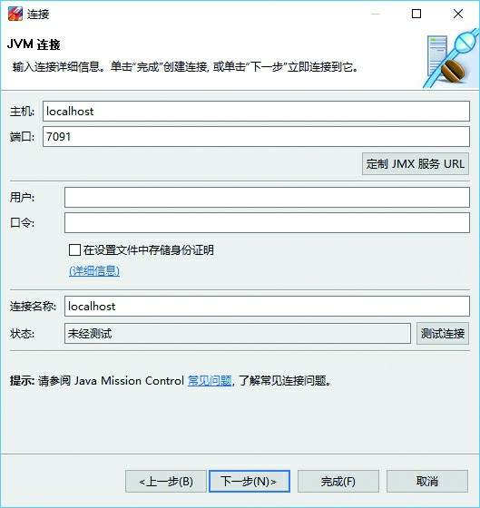

图4-25　JMC建立连接界面

这里要填写的信息应该在被监控虚拟机进程启动的时候以虚拟机参数的形式指定，以下是一份被监控端的启动参数样例：

```text
-Dcom.sun.management.jmxremote.port=9999
-Dcom.sun.management.jmxremote.ssl=false
-Dcom.sun.management.jmxremote.authenticate=false
-Djava.rmi.server.hostname=192.168.31.4
-XX:+UnlockCommercialFeatures -XX:+FlightRecorder
```

本地虚拟机与远程虚拟机进程的差别只限于创建连接这个步骤，连接成功创建以后的操作就是完全一样的了。把“JVM浏览器”面板中的进程展开后，可以看到每个进程的数据都有MBean和JFR两个数据来源。关于MBean这部分数据，与JConsole和VisualVM上取到的内容是一样的，只是展示形式上有些差别，笔者就不再重复了，后面着重介绍JFR的数据记录。

双击“飞行记录器”，将会出现“启动飞行记录”窗口（如果第一次使用，还会收到解锁商业功能的警告窗），如图4-26所示。

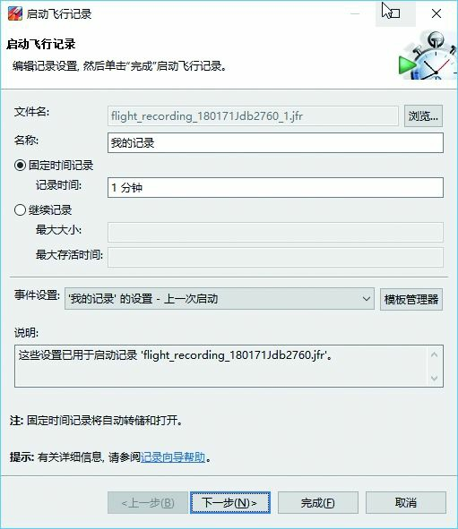

图4-26　启用飞行记录

在启动飞行记录时，可以进行记录时间、垃圾收集器、编译器、方法采样、线程记录、异常记录、网络和文件I/O、事件记录等选项和频率设定，这部分比较琐碎，笔者就不一一截图讲解了。点击“完成”按钮后马上就会开始记录，记录时间结束以后会生成飞行记录报告，如图4-27所示。

飞行记录报告里包含以下几类信息：

·一般信息：关于虚拟机、操作系统和记录的一般信息。

·内存：关于内存管理和垃圾收集的信息。

·代码：关于方法、异常错误、编译和类加载的信息。

·线程：关于应用程序中线程和锁的信息。

·I/O：关于文件和套接字输入、输出的信息。

·系统：关于正在运行Java虚拟机的系统、进程和环境变量的信息。

·事件：关于记录中的事件类型的信息，可以根据线程或堆栈跟踪，按照日志或图形的格式查看。

JFR的基本工作逻辑是开启一系列事件的录制动作，当某个事件发生时，这个事件的所有上下文数据将会以循环日志的形式被保存至内存或者指定的某个文件当中，循环日志相当于数据流被保留在一个环形缓存中，所以只有最近发生的事件的数据才是可用的。JMC从虚拟机内存或者文件中读取并展示这些事件数据，并通过这些数据进行性能分析。

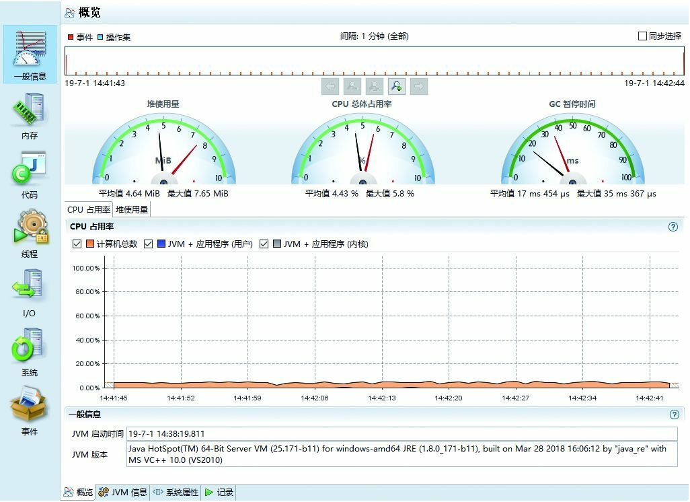

图4-27　飞行记录报告

即使不考虑对被测试程序性能影响方面的优势，JFR提供的数据质量通常也要比其他工具通过代理形式采样获得或者从MBean中取得的数据高得多。以垃圾搜集为例，HotSpot的MBean中一般有各个分代大小、收集次数、时间、占用率等数据（根据收集器不同有所差别），这些都属于“结果”类的信息，而JFR中还可以看到内存中这段时间分配了哪些对象、哪些在TLAB中（或外部）分配、分配速率和压力大小如何、分配归属的线程、收集时对象分代晋升的情况等，这些就是属于“过程”类的信息，对排查问题的价值是难以估量的。

[1] Advanced是“Advanced Monitoring & Management of Java in the Enterprise”的缩写。

### 4.4　HotSpot虚拟机插件及工具

HotSpot虚拟机发展了二十余年，现在已经是一套很复杂的软件系统，如果深入挖掘HotSpot的源码，可以发现在HotSpot的研发过程中，开发团队曾经编写（或者收集）过不少虚拟机的插件和辅助工具，它们存放在HotSpot源码hotspot/src/share/tools目录下，包括（含曾经有过但新版本中已被移除的）：

·Ideal Graph Visualizer：用于可视化展示C2即时编译器是如何将字节码转化为理想图，然后转化为机器码的。

·Client Compiler Visualizer[1]：用于查看C1即时编译器生成高级中间表示（HIR），转换成低级中间表示（LIR）和做物理寄存器分配的过程。

·MakeDeps：帮助处理HotSpot的编译依赖的工具。

·Project Creator：帮忙生成Visual Studio的.project文件的工具。

·LogCompilation：将-XX：+LogCompilation输出的日志整理成更容易阅读的格式的工具。

·HSDIS：即时编译器的反汇编插件。

关于Client Compiler Visualizer和Ideal Graph Visualizer，在本书第11章会有专门的使用介绍，而Project Creator、LogCompilation、MakeDeps这三个工具对本书的讲解和实验帮助有限，最后一个HSDIS是学习、实践本书第四部分“程序编译与代码优化”的有力辅助工具，借本章讲解虚拟机工具的机会，简要介绍其使用方法。

HSDIS：JIT生成代码反汇编

在《Java虚拟机规范》里详细定义了虚拟机指令集中每条指令的语义，尤其是执行过程前后对操作数栈、局部变量表的影响。这些细节描述与早期Java虚拟机（Sun Classic虚拟机）高度吻合，但随着技术的发展，高性能虚拟机真正的细节实现方式已经渐渐与《Java虚拟机规范》所描述的内容产生越来越大的偏差，《Java虚拟机规范》中的规定逐渐成为Java虚拟机实现的“概念模型”，即实现只保证与规范描述等效，而不一定是按照规范描述去执行。由于这个原因，我们在讨论程序的执行语义问题（虚拟机做了什么）时，在字节码层面上分析完全可行，但讨论程序的执行行为问题（虚拟机是怎样做的、性能如何）时，在字节码层面上分析就没有什么意义了，必须通过其他途径解决。

至于分析程序如何执行，使用软件调试工具（GDB、Windbg等）来进行断点调试是一种常见的方式，但是这样的调试方式在Java虚拟机中也遇到了很大麻烦，因为大量执行代码是通过即时编译器动态生成到代码缓存中的，并没有特别简单的手段来处理这种混合模式的调试，不得不通过一些曲线的间接方法来解决问题。在这样的背景下，本节的主角——HSDIS插件就正式登场了。

HSDIS是一个被官方推荐的HotSpot虚拟机即时编译代码的反汇编插件，它包含在HotSpot虚拟机

的源码当中[2]，在OpenJDK的网站[3]也可以找到单独的源码下载，但并没有提供编译后的程序。

HSDIS插件的作用是让HotSpot的-XX：+PrintAssembly指令调用它来把即时编译器动态生成的本地代码还原为汇编代码输出，同时还会自动产生大量非常有价值的注释，这样我们就可以通过输出的汇编代码来从最本质的角度分析问题。读者可以根据自己的操作系统和处理器型号，从网上直接搜索、下载编译好的插件，直接放到JDK_HOME/jre/bin/server目录（JDK 9以下）或JDK_HOME/lib/amd64/server（JDK 9或以上）中即可使用。如果读者确实没有找到所采用操作系统的

对应编译成品[4]，那就自己用源码编译一遍（网上能找到各种操作系统下的编译教程）。

另外还有一点需要注意，如果读者使用的是SlowDebug或者FastDebug版的HotSpot，那可以直接通过-XX：+PrintAssembly指令使用的插件；如果读者使用的是Product版的HotSpot，则还要额外加入一个-XX：+UnlockDiagnosticVMOptions参数才可以工作。笔者以代码清单4-12中的测试代码为例简单演示一下如何使用这个插件。

代码清单4-12　测试代码

```java
public class Bar {
    int a = 1;
    static int b = 2;
    public int sum(int c) {
        return a + b + c;
    }
    public static void main(String[] args) {
        new Bar().sum(3);
    }
}
```

编译这段代码，并使用以下命令执行：

```bash
java -XX:+PrintAssembly -Xcomp -XX:CompileCommand=dontinline,*Bar.sum -XX:Compile-Command=compileonly,*Bar.sum test.Bar
```

其中，参数-Xcomp是让虚拟机以编译模式执行代码，这样不需要执行足够次数来预热就能触发即时编译。两个-XX：CompileCommand的意思是让编译器不要内联sum()并且只编译sum()，-XX：+PrintAssembly就是输出反汇编内容。如果一切顺利的话，屏幕上会出现类似代码清单4-13所示的内容。

代码清单4-13　测试代码

```cpp
[Disassembling for mach='i386']
[Entry Point]
[Constants]
    # {method} 'sum' '(I)I' in 'test/Bar'
    # this:     ecx       = 'test/Bar'
    # parm0:    edx       = int
    #           [sp+0x20]  (sp of caller)
    ……
    0x01cac407: cmp    0x4(%ecx),%eax
    0x01cac40a: jne    0x01c6b050               ; {runtime_call}
[Verified Entry Point]
    0x01cac410: mov    %eax,-0x8000(%esp)
    0x01cac417: push   %ebp
    0x01cac418: sub    $0x18,%esp               ; *aload_0
                                                ; - test.Bar::sum@0 (line  8)
    ;;  block B0 [0, 10]
    0x01cac41b: mov    0x8(%ecx),%eax   ; *getfield a
                                        ; - test.Bar::sum@1 (line 8)
    0x01cac41e: mov    $0x3d2fad8,%esi  ; {oop(a
'java/lang/Class' = 'test/Bar')}
    0x01cac423: mov    0x68(%esi),%esi  ; *getstatic b
                                        ; - test.Bar::sum@4 (line 8)
    0x01cac426: add    %esi,%eax
    0x01cac428: add    %edx,%eax
    0x01cac42a: add    $0x18,%esp
    0x01cac42d: pop    %ebp
    0x01cac42e: test   %eax,0x2b0100    ; {poll_return}
    0x01cac434: ret
```

虽然是汇编，但代码并不多，我们一句一句来阅读：

1）mov%eax，-0x8000(%esp)：检查栈溢。

2）push%ebp：保存上一栈帧基址。

3）sub$0x18，%esp：给新帧分配空间。

4）mov 0x8(%ecx)，%eax：取实例变量a，这里0x8(%ecx)就是ecx+0x8的意思，前面代码片段“[Constants]”中提示了“this：ecx='test/Bar'”，即ecx寄存器中放的就是this对象的地址。偏移0x8是越过this对象的对象头，之后就是实例变量a的内存位置。这次是访问Java堆中的数据。

5）mov$0x3d2fad8，%esi：取test.Bar在方法区的指针。

6）mov 0x68(%esi)，%esi：取类变量b，这次是访问方法区中的数据。

7）add%esi，%eax、add%edx，%eax：做2次加法，求a+b+c的值，前面的代码把a放在eax中，把b放在esi中，而c在[Constants]中提示了，“parm0：edx=int”，说明c在edx中。

8）add$0x18，%esp：撤销栈帧。

9）pop%ebp：恢复上一栈帧。

10）test%eax，0x2b0100：轮询方法返回处的SafePoint。

11）ret：方法返回。

在这个例子中测试代码比较简单，肉眼直接看日志中的汇编输出是可行的，但在正式环境中-XX：+PrintAssembly的日志输出量巨大，且难以和代码对应起来，这就必须使用工具来辅助了。

JITWatch[5]是HSDIS经常搭配使用的可视化的编译日志分析工具，为便于在JITWatch中读取，读者可使用以下参数把日志输出到logfile文件：

```text
-XX:+UnlockDiagnosticVMOptions
-XX:+TraceClassLoading
-XX:+LogCompilation
-XX:LogFile=/tmp/logfile.log
-XX:+PrintAssembly
-XX:+TraceClassLoading
```

在JITWatch中加载日志后，就可以看到执行期间使用过的各种对象类型和对应调用过的方法了，界面如图4-28所示。

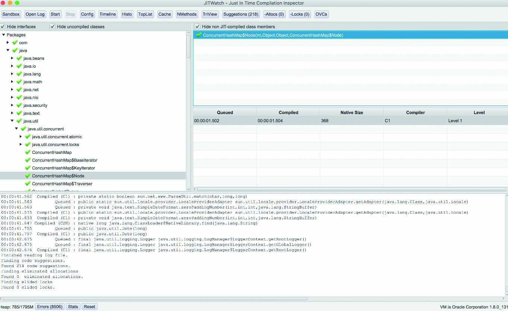

图4-28　JITWatch主界面

选择想要查看的类和方法，即可查看对应的Java源代码、字节码和即时编译器生成的汇编代码，如图4-29所示。

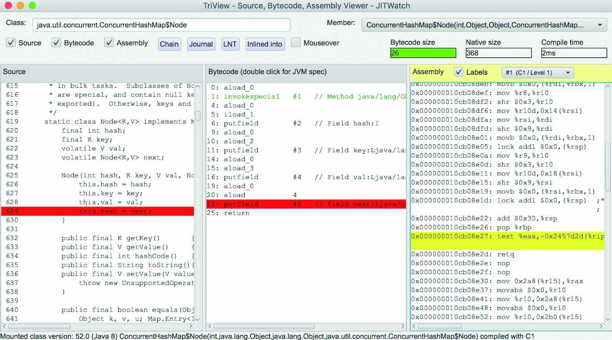

图4-29　查看方法代码[1] 不同于Ideal Graph Visualizer，Client Compiler Visualizer的源码其实从未进入过HotSpot的代码仓库，不过为了C1、C2配对，还是把它列在这里。[2] OpenJDK中的源码位置：hotspot/src/share/tools/hsdis/。[3]地址：http://hg.openjdk.java.net/jdk7u/jdk7u/hotspot/file/tip/src/share/tools/hsdis/。也可以在GitHub上搜索HSDIS得到。[4] HLLVM圈子中有已编译好的，地址：http://hllvm.group.iteye.com/。[5] 下载地址：https://github.com/AdoptOpenJDK/jitwatch。

### 4.5　本章小结

本章介绍了随JDK发布的6个命令行工具与4个可视化的故障处理工具，灵活使用这些工具，可以为处理问题带来很大的便利。除了本章涉及的OpenJDK中自带的工具之外，还有很多其他监控和故障处理工具，如何进行监控和故障诊断，这并不是《Java虚拟机规范》中定义的内容，而是取决于虚拟机实现自身的设计，因此每种处理工具都有针对的目标范围，如果读者使用的是非HotSpot系的虚拟机，就更需要使用对应的工具进行分析，如：

·IBM的Support Assistant[1]、Heap Analyzer[2]、Javacore Analyzer[3]、Garbage Collector

Analyzer[4]适用于IBM J9/OpenJ9 VM。

·HP的HPjmeter、HPjtune适用于HP-UX、SAP、HotSpot VM。

·Eclipse的Memory Analyzer Tool[5]（MAT）适用于HP-UX、SAP、HotSpot VM，安装IBM

DTFJ[6]插件后可支持IBM J9虚拟机。

[1] http://www-01.ibm.com/software/support/isa/。[2] http://www.alphaworks.ibm.com/tech/heapanalyzer/download。[3] http://www.alphaworks.ibm.com/tech/jca/download。[4] http://www.alphaworks.ibm.com/tech/pmat/download。[5] http://www.eclipse.org/mat/。[6] http://www.ibm.com/developerworks/java/jdk/tools/dtfj.html。
