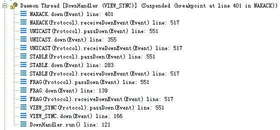
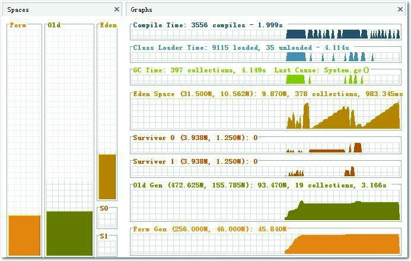
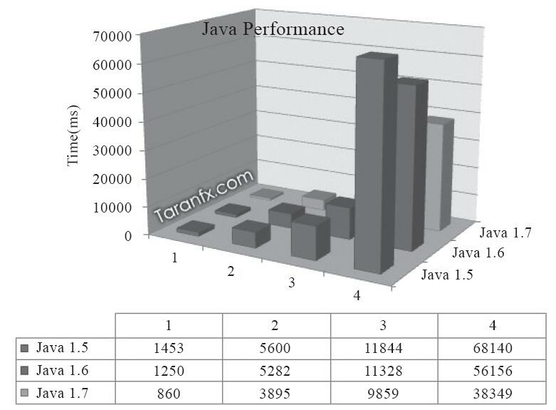
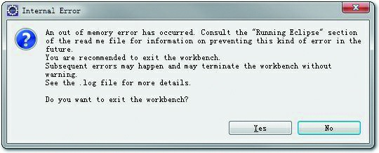
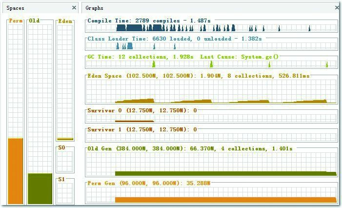
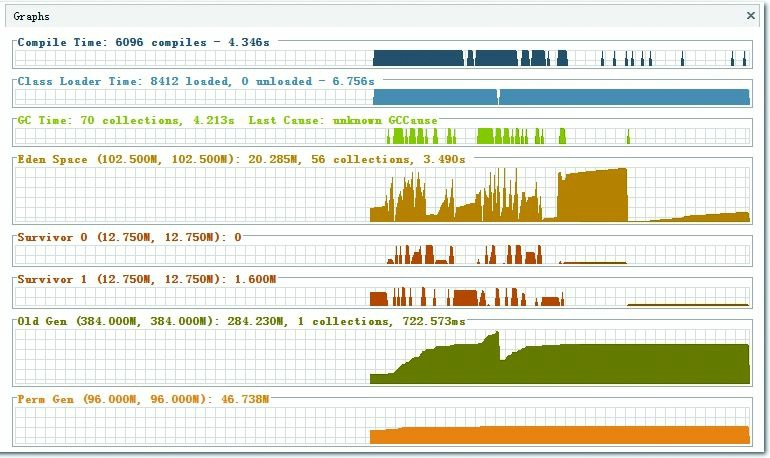
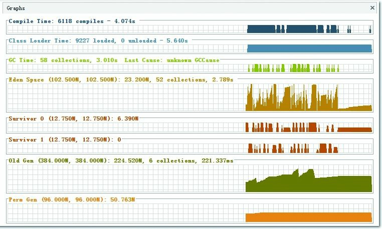

## 第5章　调优案例分析与实战

Java与C++之间有一堵由内存动态分配和垃圾收集技术所围成的高墙，墙外面的人想进去，墙里面的人却想出来。

### 5.1　概述

在前面3章笔者系统性地介绍了处理Java虚拟机内存问题的知识与工具，在处理应用中的实际问题时，除了知识与工具外，经验同样是一个很重要的因素。在本章，将会与读者分享若干较有代表性的实际案例。

考虑到虚拟机的故障处理与调优主要面向各类服务端应用，而大多数Java程序员较少有机会直接接触生产环境的服务器，因此本章还准备了一个所有开发人员都能够进行“亲身实战”的练习，希望大家通过实践能获得故障处理、调优的经验。

### 5.2　案例分析

本章中的案例一部分来源于笔者处理过的实际问题，还有另一部分来源于网上有特色和代表性的案例总结。出于对客户商业信息保护的原因，在不影响前后逻辑的前提下，笔者对实际环境和用户业务做了一些屏蔽和精简。

本章内容将着重考虑如何在应用部署层面去解决问题，有不少案例中的问题的确可以在设计和开发阶段就先行避免，但这并不是本书要讨论的话题。也有一些问题可以直接通过升级硬件或者使用最新JDK版本里的新技术去解决，但我们同时也会探讨如何在不改变已有软硬件版本和规格的前提下，调整部署和配置策略去解决或者缓解问题。

#### 5.2.1　大内存硬件上的程序部署策略

这是笔者很久之前处理过的一个案例，但今天仍然具有代表性。一个15万PV/日左右的在线文档类型网站最近更换了硬件系统，服务器的硬件为四路志强处理器、16GB物理内存，操作系统为64位CentOS 5.4，Resin作为Web服务器。整个服务器暂时没有部署别的应用，所有硬件资源都可以提供给这访问量并不算太大的文档网站使用。软件版本选用的是64位的JDK 5，管理员启用了一个虚拟机实例，使用-Xmx和-Xms参数将Java堆大小固定在12GB。使用一段时间后发现服务器的运行效果十分不理想，网站经常不定期出现长时间失去响应。

监控服务器运行状况后发现网站失去响应是由垃圾收集停顿所导致的，在该系统软硬件条件下，HotSpot虚拟机是以服务端模式运行，默认使用的是吞吐量优先收集器，回收12GB的Java堆，一次Full GC的停顿时间就高达14秒。由于程序设计的原因，访问文档时会把文档从磁盘提取到内存中，导致内存中出现很多由文档序列化产生的大对象，这些大对象大多在分配时就直接进入了老年代，没有在Minor GC中被清理掉。这种情况下即使有12GB的堆，内存也很快会被消耗殆尽，由此导致每隔几分钟出现十几秒的停顿，令网站开发、管理员都对使用Java技术开发网站感到很失望。

分析此案例的情况，程序代码问题这里不延伸讨论，程序部署上的主要问题显然是过大的堆内存进行回收时带来的长时间的停顿。经调查，更早之前的硬件使用的是32位操作系统，给HotSpot虚拟机只分配了1.5GB的堆内存，当时用户确实感觉到使用网站比较缓慢，但还不至于发生长达十几秒的明显停顿，后来将硬件升级到64位系统、16GB内存希望能提升程序效能，却反而出现了停顿问题，尝试过将Java堆分配的内存重新缩小到1.5GB或者2GB，这样的确可以避免长时间停顿，但是在硬件上的投资就显得非常浪费。

每一款Java虚拟机中的每一款垃圾收集器都有自己的应用目标与最适合的应用场景，如果在特定场景中选择了不恰当的配置和部署方式，自然会事倍功半。目前单体应用在较大内存的硬件上主要的部署方式有两种：

1. 通过一个单独的Java虚拟机实例来管理大量的Java堆内存。
2. 同时使用若干个Java虚拟机，建立逻辑集群来利用硬件资源。

此案例中的管理员采用了第一种部署方式。对于用户交互性强、对停顿时间敏感、内存又较大的系统，并不是一定要使用Shenandoah、ZGC这些明确以控制延迟为目标的垃圾收集器才能解决问题（当然不可否认，如果情况允许的话，这是最值得考虑的方案），使用Parallel Scavenge/Old收集器，并且给Java虚拟机分配较大的堆内存也是有很多运行得很成功的案例的，但前提是必须把应用的Full GC频率控制得足够低，至少要低到不会在用户使用过程中发生，譬如十几个小时乃至一整天都不出现一次Full GC，这样可以通过在深夜执行定时任务的方式触发Full GC甚至是自动重启应用服务器来保持内存可用空间在一个稳定的水平。

控制Full GC频率的关键是老年代的相对稳定，这主要取决于应用中绝大多数对象能否符合“朝生夕灭”的原则，即大多数对象的生存时间不应当太长，尤其是不能有成批量的、长生存时间的大对象产生，这样才能保障老年代空间的稳定。

在许多网站和B/S形式的应用里，多数对象的生存周期都应该是请求级或者页面级的，会话级和全局级的长生命对象相对较少。只要代码写得合理，实现在超大堆中正常使用没有Full GC应当并不困难，这样的话，使用超大堆内存时，应用响应速度才可能会有所保证。除此之外，如果读者计划使用单个Java虚拟机实例来管理大内存，还需要考虑下面可能面临的问题：

- 回收大块堆内存而导致的长时间停顿，自从G1收集器的出现，增量回收得到比较好的应用[^section-2-note-1]，这个问题有所缓解，但要到ZGC和Shenandoah收集器成熟之后才得到相对彻底地解决。
- 大内存必须有64位Java虚拟机的支持，但由于压缩指针、处理器缓存行容量（Cache Line）等因素，64位虚拟机的性能测试结果普遍略低于相同版本的32位虚拟机。
- 必须保证应用程序足够稳定，因为这种大型单体应用要是发生了堆内存溢出，几乎无法产生堆转储快照（要产生十几GB乃至更大的快照文件），哪怕成功生成了快照也难以进行分析；如果确实出了问题要进行诊断，可能就必须应用JMC这种能够在生产环境中进行的运维工具。
- 相同的程序在64位虚拟机中消耗的内存一般比32位虚拟机要大，这是由于指针膨胀，以及数据类型对齐补白等因素导致的，可以开启（默认即开启）压缩指针功能来缓解。

鉴于上述这些问题，现阶段仍然有一些系统管理员选择第二种方式来部署应用：同时使用若干个虚拟机建立逻辑集群来利用硬件资源。做法是在一台物理机器上启动多个应用服务器进程，为每个服务器进程分配不同端口，然后在前端搭建一个负载均衡器，以反向代理的方式来分配访问请求。这里无须太在意均衡器转发所消耗的性能，即使是使用第一个部署方案，多数应用也不止有一台服务器，因此应用中前端的负载均衡器总是免不了的。

考虑到我们在一台物理机器上建立逻辑集群的目的仅仅是尽可能利用硬件资源，并不是要按职责、按领域做应用拆分，也不需要考虑状态保留、热转移之类的高可用性需求，不需要保证每个虚拟机进程有绝对准确的均衡负载，因此使用无Session复制的亲合式集群是一个相当合适的选择。仅仅需要保障集群具备亲合性，也就是均衡器按一定的规则算法（譬如根据Session ID分配）将一个固定的用户请求永远分配到一个固定的集群节点进行处理即可，这样程序开发阶段就几乎不必为集群环境做任何特别的考虑。

当然，第二种部署方案也不是没有缺点的，如果读者计划使用逻辑集群的方式来部署程序，可能会遇到下面这些问题：

- 节点竞争全局的资源，最典型的就是磁盘竞争，各个节点如果同时访问某个磁盘文件的话（尤其是并发写操作容易出现问题），很容易导致I/O异常。
- 很难最高效率地利用某些资源池，譬如连接池，一般都是在各个节点建立自己独立的连接池，这样有可能导致一些节点的连接池已经满了，而另外一些节点仍有较多空余。尽管可以使用集中式的JNDI来解决，但这个方案有一定复杂性并且可能带来额外的性能代价。
- 如果使用32位Java虚拟机作为集群节点的话，各个节点仍然不可避免地受到32位的内存限制，在32位Windows平台中每个进程只能使用2GB的内存，考虑到堆以外的内存开销，堆最多一般只能开到1.5GB。在某些Linux或UNIX系统（如Solaris）中，可以提升到3GB乃至接近4GB的内存，但32位中仍然受最高4GB（2的32次幂）内存的限制。
- 大量使用本地缓存（如大量使用HashMap作为K/V缓存）的应用，在逻辑集群中会造成较大的内存浪费，因为每个逻辑节点上都有一份缓存，这时候可以考虑把本地缓存改为集中式缓存。

介绍完这两种部署方式，重新回到这个案例之中，最后的部署方案并没有选择升级JDK版本，而是调整为建立5个32位JDK的逻辑集群，每个进程按2GB内存计算（其中堆固定为1.5GB），占用了10GB内存。另外建立一个Apache服务作为前端均衡代理作为访问门户。考虑到用户对响应速度比较关心，并且文档服务的主要压力集中在磁盘和内存访问，处理器资源敏感度较低，因此改为CMS收集器进行垃圾回收。部署方式调整后，服务再没有出现长时间停顿，速度比起硬件升级前有较大提升。

[^section-2-note-1]: 以前CMS也有i-CMS的增量回收模式，但与G1的增量回收并不相同，而且并不好用，已被废弃。

#### 5.2.2　集群间同步导致的内存溢出

一个基于B/S的MIS系统，硬件为两台双路处理器、8GB内存的HP小型机，应用中间件是WebLogic 9.2，每台机器启动了3个WebLogic实例，构成一个6个节点的亲合式集群。由于是亲合式集群，节点之间没有进行Session同步，但是有一些需求要实现部分数据在各个节点间共享。最开始这些数据是存放在数据库中的，但由于读写频繁、竞争很激烈，性能影响较大，后面使用JBossCache构建了一个全局缓存。全局缓存启用后，服务正常使用了一段较长的时间。但在最近不定期出现多次的内存溢出问题。

在内存溢出异常不出现的时候，服务内存回收状况一直正常，每次内存回收后都能恢复到一个稳定的可用空间。开始怀疑是程序某些不常用的代码路径中存在内存泄漏，但管理员反映最近程序并未更新、升级过，也没有进行什么特别操作。只好让服务带着-XX:+HeapDumpOnOutOfMemoryError参数运行了一段时间。在最近一次溢出之后，管理员发回了堆转储快照，发现里面存在着大量的org.jgroups.protocols.pbcast.NAKACK对象。

JBossCache是基于自家的JGroups进行集群间的数据通信，JGroups使用协议栈的方式来实现收发数据包的各种所需特性自由组合，数据包接收和发送时要经过每层协议栈的up()和down()方法，其中的NAKACK栈用于保障各个包的有效顺序以及重发。



图5-1　JBossCache协议栈

由于信息有传输失败需要重发的可能性，在确认所有注册在GMS（Group Membership Service）的节点都收到正确的信息前，发送的信息必须在内存中保留。而此MIS的服务端中有一个负责安全校验的全局过滤器，每当接收到请求时，均会更新一次最后操作时间，并且将这个时间同步到所有的节点中去，使得一个用户在一段时间内不能在多台机器上重复登录。在服务使用过程中，往往一个页面会产生数次乃至数十次的请求，因此这个过滤器导致集群各个节点之间网络交互非常频繁。当网络情况不能满足传输要求时，重发数据在内存中不断堆积，很快就产生了内存溢出。

这个案例中的问题，既有JBossCache的缺陷，也有MIS系统实现方式上的缺陷。JBossCache官方的邮件讨论组中讨论过很多次类似的内存溢出异常问题，据说后续版本也有了改进。而更重要的缺陷是，这一类被集群共享的数据要使用类似JBossCache这种非集中式的集群缓存来同步的话，可以允许读操作频繁，因为数据在本地内存有一份副本，读取的动作不会耗费多少资源，但不应当有过于频繁的写操作，会带来很大的网络同步的开销。

#### 5.2.3　堆外内存导致的溢出错误

这是一个学校的小型项目：基于B/S的电子考试系统，为了实现客户端能实时地从服务器端接收考试数据，系统使用了逆向AJAX技术（也称为Comet或者Server Side Push），选用CometD 1.1.1作为服务端推送框架，服务器是Jetty 7.1.4，硬件为一台很普通PC机，Core i5 CPU，4GB内存，运行32位Windows操作系统。

测试期间发现服务端不定时抛出内存溢出异常，服务不一定每次都出现异常，但假如正式考试时崩溃一次，那估计整场电子考试都会乱套。网站管理员尝试过把堆内存调到最大，32位系统最多到1.6GB基本无法再加大了，而且开大了基本没效果，抛出内存溢出异常好像还更加频繁。加入-XX:+HeapDumpOnOutOfMemoryError参数，居然也没有任何反应，抛出内存溢出异常时什么文件都没有产生。无奈之下只好挂着jstat紧盯屏幕，发现垃圾收集并不频繁，Eden区、Survivor区、老年代以及方法区的内存全部都很稳定，压力并不大，但就是照样不停抛出内存溢出异常。最后，在内存溢出后从系统日志中找到异常堆栈如代码清单5-1所示。

代码清单5-1　异常堆栈

```text
[org.eclipse.jetty.util.log] handle failed java.lang.OutOfMemoryError: null
at sun.misc.Unsafe.allocateMemory(Native Method)
at java.nio.DirectByteBuffer.<init>(DirectByteBuffer.java:99)
at java.nio.ByteBuffer.allocateDirect(ByteBuffer.java:288)
at org.eclipse.jetty.io.nio.DirectNIOBuffer.<init>
……
```

如果认真阅读过本书第2章，看到异常堆栈应该就清楚这个抛出内存溢出异常是怎么回事了。我们知道操作系统对每个进程能管理的内存是有限制的，这台服务器使用的32位Windows平台的限制是2GB，其中划了1.6GB给Java堆，而Direct Memory耗用的内存并不算入这1.6GB的堆之内，因此它最大也只能在剩余的0.4GB空间中再分出一部分而已。在此应用中导致溢出的关键是垃圾收集进行时，虚拟机虽然会对直接内存进行回收，但是直接内存却不能像新生代、老年代那样，发现空间不足了就主动通知收集器进行垃圾回收，它只能等待老年代满后Full GC出现后，“顺便”帮它清理掉内存的废弃对象。否则就不得不一直等到抛出内存溢出异常时，先捕获到异常，再在Catch块里面通过System.gc()命令来触发垃圾收集。但如果Java虚拟机再打开了-XX:+DisableExplicitGC开关，禁止了人工触发垃圾收集的话，那就只能眼睁睁看着堆中还有许多空闲内存，自己却不得不抛出内存溢出异常了。而本案例中使用的CometD 1.1.1框架，正好有大量的NIO操作需要使用到直接内存。

从实践经验的角度出发，在处理小内存或者32位的应用问题时，除了Java堆和方法区之外，我们注意到下面这些区域还会占用较多的内存，这里所有的内存总和受到操作系统进程最大内存的限制：

- 直接内存：可通过-XX:MaxDirectMemorySize调整大小，内存不足时抛出OutOfMemoryError或者OutOfMemoryError：Direct buffer memory。
- 线程堆栈：可通过-Xss调整大小，内存不足时抛出StackOverflowError（如果线程请求的栈深度大于虚拟机所允许的深度）或者OutOfMemoryError（如果Java虚拟机栈容量可以动态扩展，当栈扩展时无法申请到足够的内存）。
- Socket缓存区：每个Socket连接都Receive和Send两个缓存区，分别占大约37KB和25KB内存，连接多的话这块内存占用也比较可观。如果无法分配，可能会抛出IOException：Too many open files异常。
- JNI代码：如果代码中使用了JNI调用本地库，那本地库使用的内存也不在堆中，而是占用Java虚拟机的本地方法栈和本地内存的。
- 虚拟机和垃圾收集器：虚拟机、垃圾收集器的工作也是要消耗一定数量的内存的。

#### 5.2.4　外部命令导致系统缓慢

一个数字校园应用系统，运行在一台四路处理器的Solaris 10操作系统上，中间件为GlassFish服务器。系统在做大并发压力测试的时候，发现请求响应时间比较慢，通过操作系统的mpstat工具发现处理器使用率很高，但是系统中占用绝大多数处理器资源的程序并不是该应用本身。这是个不正常的现象，通常情况下用户应用的处理器占用率应该占主要地位，才能说明系统是在正常工作。

通过Solaris 10的dtrace脚本可以查看当前情况下哪些系统调用花费了最多的处理器资源，dtrace运行后发现最消耗处理器资源的竟然是“fork”系统调用。众所周知，“fork”系统调用是Linux用来产生新进程的，在Java虚拟机中，用户编写的Java代码通常最多只会创建新的线程，不应当有进程的产生，这又是个相当不正常的现象。

通过联系该系统的开发人员，最终找到了答案：每个用户请求的处理都需要执行一个外部Shell脚本来获得系统的一些信息。执行这个Shell脚本是通过Java的Runtime.getRuntime().exec()方法来调用的。这种调用方式可以达到执行Shell脚本的目的，但是它在Java虚拟机中是非常消耗资源的操作，即使外部命令本身能很快执行完毕，频繁调用时创建进程的开销也会非常可观。Java虚拟机执行这个命令的过程是首先复制一个和当前虚拟机拥有一样环境变量的进程，再用这个新的进程去执行外部命令，最后再退出这个进程。如果频繁执行这个操作，系统的消耗必然会很大，而且不仅是处理器消耗，内存负担也很重。

用户根据建议去掉这个Shell脚本执行的语句，改为使用Java的API去获取这些信息后，系统很快恢复了正常。

#### 5.2.5　服务器虚拟机进程崩溃

一个基于B/S的MIS系统，硬件为两台双路处理器、8GB内存的HP系统，服务器是WebLogic 9.2（与第二个案例中那套是同一个系统）。正常运行一段时间后，最近发现在运行期间频繁出现集群节点的虚拟机进程自动关闭的现象，留下了一个hs_err_pid###.log文件后，虚拟机进程就消失了，两台物理机器里的每个节点都出现过进程崩溃的现象。从系统日志中注意到，每个节点的虚拟机进程在崩溃之前，都发生过大量相同的异常，见代码清单5-2。

代码清单5-2　异常堆栈2

```bash
java.net.SocketException: Connection reset
at java.net.SocketInputStream.read(SocketInputStream.java:168)
at java.io.BufferedInputStream.fill(BufferedInputStream.java:218)
at java.io.BufferedInputStream.read(BufferedInputStream.java:235)
at org.apache.axis.transport.http.HTTPSender.readHeadersFromSocket(HTTPSender.java:583)
at org.apache.axis.transport.http.HTTPSender.invoke(HTTPSender.java:143)
... 99 more
```

这是一个远端断开连接的异常，通过系统管理员了解到系统最近与一个OA门户做了集成，在MIS系统工作流的待办事项变化时，要通过Web服务通知OA门户系统，把待办事项的变化同步到OA门户之中。通过SoapUI测试了一下同步待办事项的几个Web服务，发现调用后竟然需要长达3分钟才能返回，并且返回结果都是超时导致的连接中断。

由于MIS系统的用户多，待办事项变化很快，为了不被OA系统速度拖累，使用了异步的方式调用Web服务，但由于两边服务速度的完全不对等，时间越长就累积了越多Web服务没有调用完成，导致在等待的线程和Socket连接越来越多，最终超过虚拟机的承受能力后导致虚拟机进程崩溃。通知OA门户方修复无法使用的集成接口，并将异步调用改为生产者/消费者模式的消息队列实现后，系统恢复正常。

#### 5.2.6　不恰当数据结构导致内存占用过大

一个后台RPC服务器，使用64位Java虚拟机，内存配置为-Xms4g-Xmx8g-Xmn1g，使用ParNew加CMS的收集器组合。平时对外服务的Minor GC时间约在30毫秒以内，完全可以接受。但业务上需要每10分钟加载一个约80MB的数据文件到内存进行数据分析，这些数据会在内存中形成超过100万个HashMap<Long，Long>Entry，在这段时间里面Minor GC就会造成超过500毫秒的停顿，对于这种长度的停顿时间就接受不了了，具体情况如下面的收集器日志所示。

```text
{Heap before GC invocations=95 (full 4):
 par new generation   total 903168K, used 803142K [0x00002aaaae770000, 0x00002aaaebb70000, 0x00002aaaebb70000)
    eden space 802816K, 100% used [0x00002aaaae770000, 0x00002aaadf770000, 0x00002aaadf770000)
    from space 100352K,   0% used [0x00002aaae5970000, 0x00002aaae59c1910, 0x00002aaaebb70000)
    to   space 100352K,   0% used [0x00002aaadf770000, 0x00002aaadf770000, 0x00002aaae5970000)
concurrent mark-sweep generation total 5845540K, used 3898978K [0x00002aaaebb70000, 0x00002aac507f9000, 0x00002aacae770000)
concurrent-mark-sweep perm gen total 65536K, used 40333K [0x00002aacae770000, 0x00002aacb2770000, 0x00002aacb2770000)
2011-10-28T11:40:45.162+0800: 226.504: [GC 226.504: [ParNew: 803142K-> 100352K(903168K), 0.5995670 secs] 4702120K->4056332K(6748708K), 0.5997560 secs] [Times: user=1.46 sys=0.04, real=0.60 secs]
Heap after GC invocations=96 (full 4):
par new generation   total 903168K, used 100352K [0x00002aaaae770000, 0x00002-aaaebb70000, 0x00002aaaebb70000)
    eden space 802816K,   0% used [0x00002aaaae770000, 0x00002aaaae770000, 0x00002aaadf770000)
    from space 100352K, 100% used [0x00002aaadf770000, 0x00002aaae5970000, 0x00002aaae5970000)
    to   space 100352K,   0% used [0x00002aaae5970000, 0x00002aaae5970000, 0x00002aaaebb70000)
concurrent mark-sweep generation total 5845540K, used 3955980K [0x00002aaaebb70000, 0x00002aac507f9000, 0x00002aacae770000)
concurrent-mark-sweep perm gen total 65536K, used 40333K [0x00002aacae770000, 0x00002aacb2770000, 0x00002aacb2770000)
}
Total time for which application threads were stopped: 0.6070570 seconds
```

观察这个案例的日志，平时Minor GC时间很短，原因是新生代的绝大部分对象都是可清除的，在Minor GC之后Eden和Survivor基本上处于完全空闲的状态。但是在分析数据文件期间，800MB的Eden空间很快被填满引发垃圾收集，但Minor GC之后，新生代中绝大部分对象依然是存活的。我们知道ParNew收集器使用的是复制算法，这个算法的高效是建立在大部分对象都“朝生夕灭”的特性上的，如果存活对象过多，把这些对象复制到Survivor并维持这些对象引用的正确性就成为一个沉重的负担，因此导致垃圾收集的暂停时间明显变长。

如果不修改程序，仅从GC调优的角度去解决这个问题，可以考虑直接将Survivor空间去掉（加入参数-XX:SurvivorRatio=65536、-XX:MaxTenuringThreshold=0或者-XX:+AlwaysTenure），让新生代中存活的对象在第一次Minor GC后立即进入老年代，等到Major GC的时候再去清理它们。这种措施可以治标，但也有很大副作用；治本的方案必须要修改程序，因为这里产生问题的根本原因是用HashMap<Long，Long>结构来存储数据文件空间效率太低了。

我们具体分析一下HashMap空间效率，在HashMap<Long，Long>结构中，只有Key和Value所存放的两个长整型数据是有效数据，共16字节（2×8字节）。这两个长整型数据包装成java.lang.Long对象之后，就分别具有8字节的Mark Word、8字节的Klass指针，再加8字节存储数据的long值。然后这2个Long对象组成Map.Entry之后，又多了16字节的对象头，然后一个8字节的next字段和4字节的int型的hash字段，为了对齐，还必须添加4字节的空白填充，最后还有HashMap中对这个Entry的8字节的引用，这样增加两个长整型数字，实际耗费的内存为(Long(24byte)×2)+Entry(32byte)+HashMap Ref(8byte)=88byte，空间效率为有效数据除以全部内存空间，即16字节/88字节=18%，这确实太低了。

#### 5.2.7　由Windows虚拟内存导致的长时间停顿[^section-5-2-7-note-1]

有一个带心跳检测功能的GUI桌面程序，每15秒会发送一次心跳检测信号，如果对方30秒以内都没有信号返回，那就认为和对方程序的连接已经断开。程序上线后发现心跳检测有误报的可能，查询日志发现误报的原因是程序会偶尔出现间隔约一分钟的时间完全无日志输出，处于停顿状态。

因为是桌面程序，所需的内存并不大（-Xmx256m），所以开始并没有想到是垃圾收集导致的程序停顿，但是加入参数-XX:+PrintGCApplicationStoppedTime-XX:+PrintGCDateStamps-Xloggc:gclog.log后，从收集器日志文件中确认了停顿确实是由垃圾收集导致的，大部分收集时间都控制在100毫秒以内，但偶尔就出现一次接近1分钟的长时间收集过程。

```text
Total time for which application threads were stopped:  0.0112389 seconds
Total time for which application threads were stopped:  0.0001335 seconds
Total time for which application threads were stopped:  0.0003246 seconds
Total time for which application threads were stopped: 41.4731411 seconds
Total time for which application threads were stopped:  0.0489481 seconds
Total time for which application threads were stopped:  0.1110761 seconds
Total time for which application threads were stopped:  0.0007286 seconds
Total time for which application threads were stopped:  0.0001268 seconds
```

从收集器日志中找到长时间停顿的具体日志信息（再添加了-XX:+PrintReferenceGC参数），找到的日志片段如下所示。从日志中看到，真正执行垃圾收集动作的时间不是很长，但从准备开始收集，到真正开始收集之间所消耗的时间却占了绝大部分。

```text
2012-08-29T19:14:30.968+0800: 10069.800: [GC10099.225: [SoftReference, 0 refs, 0.0000109 secs]10099.226: [WeakReference, 4072 refs, 0.0012099 secs]10099.227: [FinalReference, 984 refs, 1.5822450 secs]10100.809: [PhantomReference, 251 refs, 0.0001394 secs]10100.809: [JNI Weak Reference, 0.0994015 secs] [PSYoungGen: 175672K->8528K(167360K)] 251523K->100182K(353152K), 31.1580402 secs] [Times: user=0.61 sys=0.52, real=31.16 secs]
```

除收集器日志之外，还观察到这个GUI程序内存变化的一个特点，当它最小化的时候，资源管理中显示的占用内存大幅度减小，但是虚拟内存则没有变化，因此怀疑程序在最小化时它的工作内存被自动交换到磁盘的页面文件之中了，这样发生垃圾收集时就有可能因为恢复页面文件的操作导致不正常的垃圾收集停顿。

在MSDN上查证[^section-5-2-7-note-2]确认了这种猜想，在Java的GUI程序中要避免这种现象，可以加入参数“-Dsun.awt.keepWorkingSetOnMinimize=true”来解决。这个参数在许多AWT的程序上都有应用，例如JDK（曾经）自带的VisualVM，启动配置文件中就有这个参数，保证程序在恢复最小化时能够立即响应。在这个案例中加入该参数，问题马上得到解决。

[^section-5-2-7-note-1]: 本案例来源于ITEye HLLVM群组的讨论：http://hllvm.group.iteye.com/group/topic/28745。
[^section-5-2-7-note-2]: http://support.microsoft.com/default.aspx?scid=kb；en-us；293215。

#### 5.2.8　由安全点导致长时间停顿[^section-5-2-8-note-1]

有一个比较大的承担公共计算任务的离线HBase集群，运行在JDK 8上，使用G1收集器。每天都有大量的MapReduce或Spark离线分析任务对其进行访问，同时有很多其他在线集群Replication过来的数据写入，因为集群读写压力较大，而离线分析任务对延迟又不会特别敏感，所以将-XX:MaxGCPauseMillis参数设置到了500毫秒。不过运行一段时间后发现垃圾收集的停顿经常达到3秒以上，而且实际垃圾收集器进行回收的动作就只占其中的几百毫秒，现象如以下日志所示。

```text
[Times: user=1.51 sys=0.67, real=0.14 secs]
2019-06-25T 12:12:43.376+0800: 3448319.277: Total time for which application threads were stopped: 2.2645818 seconds
```

考虑到不是所有读者都了解计算机体系和操作系统原理，笔者先解释一下user、sys、real这三个时间的概念：

- user：进程执行用户态代码所耗费的处理器时间。
- sys：进程执行核心态代码所耗费的处理器时间。
- real：执行动作从开始到结束耗费的时钟时间。

请注意，前面两个是处理器时间，而最后一个是时钟时间，它们的区别是处理器时间代表的是线程占用处理器一个核心的耗时计数，而时钟时间就是现实世界中的时间计数。如果是单核单线程的场景下，这两者可以认为是等价的，但如果是多核环境下，同一个时钟时间内有多少处理器核心正在工作，就会有多少倍的处理器时间被消耗和记录下来。

在垃圾收集调优时，我们主要依据real时间为目标来优化程序，因为最终用户只关心发出请求到得到响应所花费的时间，也就是响应速度，而不太关心程序到底使用了多少个线程或者处理器来完成任务。

日志显示这次垃圾收集一共花费了0.14秒，但其中用户线程却足足停顿了有2.26秒，两者差距已经远远超出了正常的TTSP（Time To Safepoint）耗时的范畴。所以先加入参数-XX:+PrintSafepointStatistics和-XX:PrintSafepointStatisticsCount=1去查看安全点日志，具体如下所示：

```text
vmop    [threads: total initially_running wait_to_block]
65968.203: ForceAsyncSafepoint [931   1   2]
[time: spin block sync cleanup vmop] page_trap_count
[2255  0  2255 11  0]  1
```

日志显示当前虚拟机的操作（VM Operation，VMOP）是等待所有用户线程进入到安全点，但是有两个线程特别慢，导致发生了很长时间的自旋等待。日志中的2255毫秒自旋（Spin）时间就是指由于部分线程已经走到了安全点，但还有一些特别慢的线程并没有到，所以垃圾收集线程无法开始工作，只能空转（自旋）等待。

解决问题的第一步是把这两个特别慢的线程给找出来，这个倒不困难，添加-XX:+SafepointTimeout和-XX:SafepointTimeoutDelay=2000两个参数，让虚拟机在等到线程进入安全点的时间超过2000毫秒时就认定为超时，这样就会输出导致问题的线程名称，得到的日志如下所示：

```cpp
# SafepointSynchronize::begin: Timeout detected:
# SafepointSynchronize::begin: Timed out while spinning to reach a safepoint.
# SafepointSynchronize::begin: Threads which did not reach the safepoint:
# "RpcServer.listener,port=24600" #32 daemon prio=5 os_prio=0 tid=0x00007f4c14b22840
  nid=0xa621 runnable [0x0000000000000000]
java.lang.Thread.State: RUNNABLE
# SafepointSynchronize::begin: (End of list)
```

从错误日志中顺利得到了导致问题的线程名称为“RpcServer.listener，port=24600”。但是为什么它们会出问题呢？有什么因素可以阻止线程进入安全点？在第3章关于安全点的介绍中，我们已经知道安全点是以“是否具有让程序长时间执行的特征”为原则进行选定的，所以方法调用、循环跳转、异常跳转这些位置都可能会设置有安全点，但是HotSpot虚拟机为了避免安全点过多带来过重的负担，对循环还有一项优化措施，认为循环次数较少的话，执行时间应该也不会太长，所以使用int类型或范围更小的数据类型作为索引值的循环默认是不会被放置安全点的。这种循环被称为可数循环（Counted Loop），相对应地，使用long或者范围更大的数据类型作为索引值的循环就被称为不可数循环（Uncounted Loop），将会被放置安全点。通常情况下这个优化措施是可行的，但循环执行的时间不单单是由其次数决定，如果循环体单次执行就特别慢，那即使是可数循环也可能会耗费很多的时间。

HotSpot原本提供了-XX:+UseCountedLoopSafepoints参数去强制在可数循环中也放置安全点，不过这个参数在JDK 8下有Bug[^section-5-2-8-note-2]，有导致虚拟机崩溃的风险，所以就不得不找到RpcServer线程里面的缓慢代码来进行修改。最终查明导致这个问题是HBase中一个连接超时清理的函数，由于集群会有多个MapReduce或Spark任务进行访问，而每个任务又会同时起多个Mapper/Reducer/Executer，其每一个都会作为一个HBase的客户端，这就导致了同时连接的数量会非常多。更为关键的是，清理连接的索引值就是int类型，所以这是一个可数循环，HotSpot不会在循环中插入安全点。当垃圾收集发生时，如果RpcServer的Listener线程刚好执行到该函数里的可数循环时，则必须等待循环全部跑完才能进入安全点，此时其他线程也必须一起等着，所以从现象上看就是长时间的停顿。找到了问题，解决起来就非常简单了，把循环索引的数据类型从int改为long即可，但如果不具备安全点和垃圾收集的知识，这种问题是很难处理的。

[^section-5-2-8-note-1]: 原始案例来自“小米云技术”公众号，原文地址为https://juejin.im/post/5d1b1fc46fb9a07ef7108d82，笔者做了一些改动。
[^section-5-2-8-note-2]: https://bugs.openjdk.java.net/browse/JDK-8161147。

### 5.3　实战：Eclipse运行速度调优

很多Java开发人员都有一种错觉，认为系统调优的工作都是针对服务端应用的，规模越大的系统，就需要越专业的调优运维团队参与。这个观点不能说不对，只是有点狭隘了。上一节中笔者所列举的案例确实大多是服务端运维、调优的例子，但不只服务端需要调优，其他应用类型也是需要的，作为一个普通的Java开发人员，学习到的各种虚拟机的原理和最佳实践方法距离我们并不遥远，开发者身边就有很多场景可以使用上这些知识。下面就通过一个普通程序员日常工作中可以随时接触到的开发工具开始这次实战[^section-5-3-note-1]。

[^section-5-3-note-1]: 此实战是本书第2版时编写的内容，今天看来里面的Eclipse和HotSpot版本已经较旧，不过软件版本的落后并未影响笔者要表达的意图，本案例目前也仍然有相同的实战价值，所以在第3版里笔者并未刻意将Eclipse和HotSpot升级后重写一次。

#### 5.3.1　调优前的程序运行状态

笔者使用Eclipse作为日常工作中的主要IDE工具，由于安装的插件比较大（如Klocwork、ClearCase LT等）、代码也很多，启动Eclipse直到所有项目编译完成需要四五分钟。一直对开发环境的速度感觉到不满意，趁着编写这本书的机会，决定对Eclipse进行“动刀”调优。

笔者机器的Eclipse运行平台是32位Windows 7系统，虚拟机为HotSpot 1.5 b64。硬件为ThinkPad X201，Intel i5 CPU，4GB物理内存。在初始的配置文件eclipse.ini中，除了指定JDK的路径、设置最大堆为512MB以及开启了JMX管理（需要在VisualVM中收集原始数据）外，未作任何改动，原始配置内容如代码清单5-3所示。

代码清单5-3　Eclipse 3.5初始配置

```ini
-vm
D:/_DevSpace/jdk1.5.0/bin/javaw.exe
-startup
plugins/org.eclipse.equinox.launcher_1.0.201.R35x_v20090715.jar
--launcher.library
plugins/org.eclipse.equinox.launcher.win32.win32.x86_1.0.200.v20090519
-product
org.eclipse.epp.package.jee.product
--launcher.XXMaxPermSize
256M
-showsplash
org.eclipse.platform
-vmargs
-Dosgi.requiredJavaVersion=1.5
-Xmx512m
-Dcom.sun.management.jmxremote
```

为了与调优后的结果进行量化对比，调优开始前笔者先做了一次初始数据测试。测试用例很简单，就是收集从Eclipse启动开始，直到所有插件加载完成为止的总耗时以及运行状态数据，虚拟机的运行数据通过VisualVM及其扩展插件VisualGC进行采集。测试过程中反复启动数次Eclipse直到测试结果稳定后，取最后一次运行的结果作为数据样本（为了避免操作系统未能及时进行磁盘缓存而产生的影响），数据样本如图5-2所示。



图5-2　Eclipse原始运行数据

Eclipse启动的总耗时没有办法从监控工具中直接获得，因为VisualVM不可能知道Eclipse运行到什么阶段算是启动完成。为了测试的准确性，笔者写了一个简单的Eclipse插件，用于统计Eclipse的启动耗时。由于代码十分简单，且本书并不是Eclipse RCP的开发教程，所以只列出代码清单5-4供读者参考，不再延伸。如果读者需要这个插件，可以使用下面的代码自己编译即可。

代码清单5-4　Eclipse启动耗时统计插件

```java
ShowTime.java代码：
import org.eclipse.jface.dialogs.MessageDialog;
import org.eclipse.swt.widgets.Display;
import org.eclipse.swt.widgets.Shell;
import org.eclipse.ui.IStartup;
/**
 * 统计Eclipse启动耗时
 * @author zzm
 */
public class ShowTime implements IStartup {
public void earlyStartup() {
    Display.getDefault().syncExec(new Runnable() {
        public void run() {
            long eclipseStartTime = Long.parseLong(System.getProperty("eclipse.startTime"));
            long costTime = System.currentTimeMillis() - eclipseStartTime;
            Shell shell = Display.getDefault().getActiveShell();
            String message = "Eclipse启动耗时：" + costTime + "ms";
            MessageDialog.openInformation(shell, "Information", message);
        }
    });
}
}
plugin.xml代码：
<?xml version="1.0" encoding="UTF-8"?>
<?eclipse version="3.4"?>
<plugin>
   <extension
         point="org.eclipse.ui.startup">
         <startup class="eclipsestarttime.actions.ShowTime"/>
   </extension>
</plugin>
```

上述代码打包成JAR后放到Eclipse的plugins目录，反复启动几次后，插件显示的平均时间稳定在15秒左右，如图5-3所示。


图5-3　耗时统计插件运行效果

根据VisualGC和Eclipse插件收集到的信息，总结原始配置下的测试结果如下：

- 整个启动过程平均耗时约15秒。
- 最后一次启动的数据样本中，垃圾收集总耗时4.149秒，其中：

■Full GC被触发了19次，共耗时3.166秒；

■Minor GC被触发了378次，共耗时0.983秒。

- 加载类9115个，耗时4.114秒。
- 即时编译时间1.999秒。
- 交给虚拟机的512MB堆内存被分配为40MB的新生代（31.5MB的Eden空间和2个4MB的Survivor空间）以及472MB的老年代。

客观地说，考虑到该机器硬件的条件，15秒的启动时间其实还在可接受范围以内，但是从VisualGC中反映的数据上看，存在的问题是非用户程序时间（图5-2中的Compile Time、Class Load Time、GC Time）占比非常之高，占了整个启动过程耗时的一半以上（这里存在少许夸张成分，因为如即时编译等动作是在后台线程完成的，用户程序在此期间也正常并发执行，最多就是速度变慢，所以并没有占用一半以上的绝对时间）。虚拟机后台占用太多时间也直接导致Eclipse在启动后的使用过程中经常有卡顿的感觉，进行调优还是有较大价值的。

#### 5.3.2　升级JDK版本的性能变化及兼容问题

对Eclipse进行调优的第一步就是先对虚拟机的版本进行升级，希望能先从虚拟机版本身上得到一些“免费的”性能提升。

每次JDK的大版本发布时，发行商通常都会宣称虚拟机的运行速度比上一版本有了多少比例的提高，这虽然是个广告性质的宣言，常被使用者从更新列表或者技术白皮书中直接忽略，但技术进步确实会促使性能改进，从国内外的第三方评测数据来看，版本升级至少在某些方面确实带来了一定性能改善[^section-4-note-1]。以下是一个第三方网站对JDK 5、6、7三个版本做的性能评测，分别测试了以下4个用例[^section-4-note-2]。

1. 生成500万个字符串。
2. 500万次ArrayList<String>数据插入，使用第一点生成的数据。
3. 生成500万个HashMap<String，Integer>，每个键-值对通过并发线程计算，测试并发能力。
4. 打印500万个ArrayList<String>中的值到文件，并重读回内存。

三个版本的JDK分别运行这4个用例的测试程序，测试结果如图5-4所示。



图5-4　JDK横向性能对比

从这4个用例的测试结果来看，在每一个测试场景中新版的JDK性能都有改进，譬如JDK 6比JDK 5有大约15%的平均性能提升。尽管对JDK仅测试这四个用例并不能说明什么问题，甚至要通过测试数据来量化描述一个JDK比旧版提升了多少本身就是很难做到特别科学准确的（要做稍微靠谱一点的测试，可以使用SPECjvm 2015[^section-4-note-3]之类的软件来完成，或者把相应版本的TCK[^section-4-note-4]中数万个测试用例的性能数据对比一下可能稍有说服力），但笔者还是选择相信这次“软广告”性质的测试，把JDK版本升级到JDK 6 Update 21，升级没有选择JDK 7或者其他版本的最主要理由是：本书后续故事剧情发展需要。

与所有小说作者（嗯……知道，本书不是小说）设计的故事情节一样，获得最后的胜利之前总是要经历各种各样的挫折，这次升级到JDK 6之后，性能有什么变化先暂且不谈，在使用几分钟之后，笔者的Eclipse就和前面几个服务端的案例一样非常“不负众望”地发生了内存溢出，如图5-5所示。



图5-5　Eclipse OutOfMemoryError

这次内存溢出开始是完全出乎笔者意料的：决定对Eclipse做调优是因为速度慢，但笔者的开发环境一直都很稳定，至少没有出现过内存溢出的问题，而这次升级除了修改了eclipse.ini中的Java虚拟机路径之外，还未进行任何运行参数的调整，Eclipse居然进去主界面之后随便开了几个文件就抛出内存溢出异常了，难道JDK 6 Update21有哪个类库的API出现了严重的泄漏问题吗？

事实上并不是JDK 6出现了什么问题，否则以Java的影响力，它早就上新闻了。根据前面三章中介绍讲解的原理和工具，我们要查明这个异常的原因并且解决它一点也不困难。打开VisualVM，监视页签中的内存曲线部分如图5-6、图5-7所示。

在Java堆中监视曲线里，“堆大小”的曲线与“使用的堆”的曲线一直都有很大的间隔距离，每当两条曲线开始出现互相靠近的趋势时，“堆大小”的曲线就会快速向上转向，而“使用的堆”的曲线会向下转向。“堆大小”的曲线向上代表的是虚拟机内部在进行堆扩容，因为运行参数中并没有指定最小堆（-Xms）的值与最大堆（-Xmx）相等，所以堆容量一开始并没有扩展到最大值，而是根据使用情况进行伸缩扩展。“使用的堆”的曲线向下是因为虚拟机内部触发了一次垃圾收集，一些废弃对象的空间被回收后，内存用量相应减少。从图形上看，Java堆运作是完全正常的。但永久代的监视曲线就很明显有问题了，“PermGen大小”的曲线与“使用的PermGen”的曲线几乎完全重合在一起，这说明永久代中已经没有可回收的资源了，所以“使用的PermGen”的曲线不会向下发展，并且永久代中也没有空间可以扩展了，所以“PermGen大小”的曲线不能向上发展，说明这次内存溢出很明显是永久代导致的内存溢出。


图5-6　Java堆监视曲线


图5-7　永久代监视曲线

再注意到图5-7中永久代的最大容量“67108864字节”，也就是64MB，这恰好是JDK在未使用-XX:MaxPermSize参数明确指定永久代最大容量时的默认值，无论JDK 5还是JDK 6，这个默认值都是64MB。对于Eclipse这种规模的Java程序来说，64MB的永久代内存空间显然是不够的，内存溢出是肯定的，但为何在JDK 5中没有发生过溢出呢？

在VisualVM的“概述>JVM参数”页签中，分别检查使用JDK 5和JDK 6运行Eclipse时的Java虚拟机启动参数，发现使用JDK 6时，只有三个启动参数，如代码清单5-5所示。

代码清单5-5　JDK 1.6的Eclipse运行期参数

```text
-Dcom.sun.management.jmxremote
-Dosgi.requiredJavaVersion=1.5
-Xmx512m
```

而使用JDK 5运行时，就有四个启动参数，其中多出来的一个正好就是设置永久代最大容量的-XX:MaxPermSize=256M，如代码清单5-6所示。

代码清单5-6　JDK 1.5的Eclipse运行期参数

```text
-Dcom.sun.management.jmxremote
-Dosgi.requiredJavaVersion=1.5
-Xmx512m
-XX:MaxPermSize=256M
```

为什么会这样呢？笔者从Eclipse的Bug List网站[^section-4-note-5]上找到答案：使用JDK 5时之所以有永久代容量这个参数，是因为在eclipse.ini中存在“--launcher.XXMaxPermSize 256M”这项设置，当launcher——也就是Windows下的可执行程序eclipse.exe，检测到Eclipse是运行在Sun公司的虚拟机上的话，就会把参数值转化为-XX:MaxPermSize传递给虚拟机进程。因为世界三大商用虚拟机中只有Sun公司的虚拟机才有永久代的概念，也就是只有JDK 8以前的HotSpot虚拟机才需要设置这个参数，JRockit虚拟机和J9虚拟机都是不需要设置的，所以这个参数才会有检测虚拟机后进行设置的过程。

2010年4月10日，Oracle正式完成对Sun公司的收购，此后无论是网页还是具体程序产品，提供商都从Sun变为了Oracle，而eclipse.exe就是根据程序提供商来判断是否Sun公司的虚拟机的，当JDK 1.6 Update 21中java.exe、javaw.exe的“Company”属性从“Sun Microsystems Inc.”变为“Oracle Corporation”后，Eclipse就不再认识这个虚拟机了，因此没有把最大永久代的参数传递过去。

查明了原因，解决方案就简单了，launcher不认识就只好由人来告诉它，在eclipse.ini中明确指定-XX:MaxPermSize=256M这个参数，问题随即解决。

[^section-4-note-1]: 版本升级也有不少性能倒退的案例，受程序、第三方包兼容性以及中间件限制，在企业应用中升级JDK版本是一件需要慎重考虑的事情。
[^section-4-note-2]: 测试用例、数据及图片来源于http://www.taranfx.com/java-7-whats-new-performance-benchmark-1-5-1-6-1-7。
[^section-4-note-3]: 官方网站：http://www.spec.org/jvm2008/docs/UserGuide.html。
[^section-4-note-4]: TCK（Technology Compatibility Kit）是一套由一组测试用例和相应的测试工具组成的工具包，用于保证一个使用Java技术的实现能够完全遵守其适用的Java平台规范，并且符合相应的参考实现。
[^section-4-note-5]: https://bugs.eclipse.org/bugs/show_bug.cgi?id=319514。

#### 5.3.3　编译时间和类加载时间的优化

从Eclipse启动时间来看，升级到JDK 6所带来的性能提升是……嗯？基本上没有提升。多次测试的平均值与JDK 5的差距完全在实验误差范围之内。

各位读者不必失望，Sun公司给的JDK 6性能白皮书[^section-5-3-3-note-1]描述的众多相对于JDK 5的提升并不至于全部是广告词，尽管总启动时间并没有减少，但在查看运行细节的时候，却发现了一件很令人玩味的事情：在JDK 6中启动完Eclipse所消耗的类加载时间比JDK 5长了接近一倍，读者注意不要看反了，这里写的是JDK 6的类加载比JDK 5慢一倍，测试结果见代码清单5-7，反复测试多次仍然是相似的结果。

代码清单5-7　JDK 5、JDK 6中的类加载时间对比

```bat
使用JDK 6的类加载时间：
C:\Users\IcyFenix>jps
3552
6372 org.eclipse.equinox.launcher_1.0.201.R35x_v20090715.jar
6900 Jps
C:\Users\IcyFenix>jstat -class 6372
Loaded  Bytes  Unloaded  Bytes     Time
  7917 10190.3        0    0.0     8.18
使用JDK 5类加载时间：
C:\Users\IcyFenix>jps
3552
7272 Jps
7216 org.eclipse.equinox.launcher_1.0.201.R35x_v20090715.jar
C:\Users\IcyFenix>jstat -class 7216
Loaded  Bytes  Unloaded  Bytes     Time
  7902  9691.2        3    2.6     4.34
```

在本例中类加载时间上的差距并不能作为一个具有普适性的测试结论去说明JDK 6的类加载必然比JDK 5慢，笔者测试了自己机器上的Tomcat和GlassFish启动过程，并没有出现类似的差距。在国内最大的Java社区中，笔者发起过关于此问题的讨论[^section-5-3-3-note-2]。从参与者反馈的测试结果来看，此问题只在一部分机器上存在，而且在JDK 6的各个更新包之间，测试结果也存在很大差异。

经多轮试验后，发现在笔者机器上两个JDK进行类加载时，字节码验证部分耗时差距尤其严重，暂且认为是JDK 6中新加入类型检查验证器时，可能在某些机器上会影响到以前类型检查验证器的工作[^section-5-3-3-note-3]。考虑到实际情况，Eclipse使用者甚多，它的编译代码我们可以认为是安全可靠的，可以不需要在加载的时候再进行字节码验证，因此通过参数-Xverify：none禁止掉字节码验证过程也可作为一项优化措施。加入这个参数后，两个版本的JDK类加载速度都有所提高，此时JDK 6的类加载速度仍然比JDK 5要慢，但是两者的耗时已经接近了很多，测试结果如代码清单5-8所示。

代码清单5-8　JDK 1.5、1.6中取消字节码验证后的类加载时间对比

```bat
使用JDK 1.6的类加载时间：
C:\Users\IcyFenix>jps
5512 org.eclipse.equinox.launcher_1.0.201.R35x_v20090715.jar
5596 Jps
C:\Users\IcyFenix>jstat -class 5512
Loaded  Bytes  Unloaded  Bytes     Time
  6749  8837.0        0    0.0     3.94
使用JDK 1.5的类加载时间：
C:\Users\IcyFenix>jps
4724 org.eclipse.equinox.launcher_1.0.201.R35x_v20090715.jar
5412 Jps
C:\Users\IcyFenix>jstat -class 4724
Loaded  Bytes  Unloaded  Bytes     Time
  6885  9109.7        3    2.6     3.10
```

关于类与类加载的话题，譬如刚刚提到的字节码验证是怎么回事，本书专门规划了两个章节进行详细讲解，在此暂不再展开了。

在取消字节码验证之后，JDK 5的平均启动下降到了13秒，而在JDK 6的测试数据平均比JDK 5快了1秒左右，下降到平均12秒，如图5-8所示。在类加载时间仍然落后的情况下，依然可以看到JDK 6在性能上确实比JDK 5略有优势，说明至少在Eclipse启动这个测试用例上，升级JDK版本确实能带来一些“免费的”性能提升。


图5-8　运行在JDK 6下取消字节码验证的启动时间

前面提到过，除了类加载时间以外，在VisualGC中监视曲线中显示了两项很大的非用户程序耗时：编译时间（Compile Time）和垃圾收集时间（GC Time）。垃圾收集时间读者应该非常清楚了，而编译时间是什么东西？程序在运行之前不是已经编译了吗？

虚拟机的即时编译与垃圾收集一样，是本书的一个重点部分，后面有专门章节讲解，这里先简要介绍一下：编译时间是指虚拟机的即时编译器（Just In Time Compiler）编译热点代码（Hot Spot Code）的耗时。我们知道Java语言为了实现跨平台的特性，Java代码编译出来后形成Class文件中储存的是字节码（Byte Code），虚拟机通过解释方式执行字节码命令，比起C/C++编译成本地二进制代码来说，速度要慢不少。为了解决程序解释执行的速度问题，JDK 1.2以后，HotSpot虚拟机内置了两个即时编译器[^section-5-3-3-note-4]，如果一段Java方法被调用次数到达一定程度，就会被判定为热代码交给即时编译器即时编译为本地代码，提高运行速度（这就是HotSpot虚拟机名字的来由）。而且完全有可能在运行期动态编译比C/C++的编译期静态编译出来的结果要更加优秀，因为运行期的编译器可以收集很多静态编译器无法得知的信息，也可以采用一些激进的优化手段，针对“大多数情况”而忽略“极端情况”进行假设优化，当优化条件不成立的时候再逆优化退回到解释状态或者重新编译执行。所以Java程序只要代码编写没有问题（典型的是各种泄漏问题，如内存泄漏、连接泄漏），随着运行时间增长，代码被编译得越来越彻底，运行速度应当是越运行越快的。不过，Java的运行期编译的一大缺点就是它进行编译需要消耗机器的计算资源，影响程序正常的运行时间，这也就是上面所说的“编译时间”。

HotSpot虚拟机提供了一个参数-Xint来禁止编译器运作，强制虚拟机对字节码采用纯解释方式执行。如果读者想使用这个参数省下Eclipse启动中那2秒的编译时间获得一个哪怕只是“更好看”的启动成绩的话，那恐怕要大失所望了，加上这个参数之后虽然编译时间确实下降到零，但Eclipse启动的总时间却剧增到27秒，就是因为没有即时编译的支持，执行速度大幅下降了。现在这个参数最大的作用，除了某些场景调试上的需求外，似乎就剩下让用户缅怀一下JDK 1.2之前Java语言那令人心酸心碎的运行速度了。

与解释执行相对应的另一方面，HotSpot虚拟机还有另一个力度更强的即时编译器：当虚拟机运行在客户端模式的时候，使用的是一个代号为C1的轻量级编译器，另外还有一个代号为C2的相对重量级的服务端编译器能提供更多的优化措施。由于本次实战所采用的HotSpot版本还不支持多层编译，所以虚拟机只会单独使用其中一种即时编译器，如果使用客户端模式的虚拟机启动Eclipse将会使用到C2编译器，这时从VisualGC可以看到启动过程中虚拟机使用了超过15秒的时间去进行代码编译。如果读者的工作习惯是长时间不会关闭Eclipse的话，服务端编译器所消耗的额外编译时间最终是会在运行速度的提升上“赚”回来的，这样使用服务端模式是一个相当不错的选择。不过至少在本次实战中，我们还是继续选用客户端虚拟机来运行Eclipse。

[^section-5-3-3-note-1]: 白皮书：http://java.sun.com/performance/reference/whitepapers/6_performance.html。
[^section-5-3-3-note-2]: 笔者发起的关于JDK 6与JDK 5在Eclipse启动时类加载速度差异的讨论：http://www.javaeye.com/topic/826542。
[^section-5-3-3-note-3]: 这部分内容可常见第7章关于类加载过程的介绍。
[^section-5-3-3-note-4]: JDK 1.2之前也可以使用外挂JIT编译器进行本地编译，但只能与解释器二选其一，不能同时工作。

#### 5.3.4　调整内存设置控制垃圾收集频率

三大块非用户程序时间中，还剩下“GC时间”没有调整，而“GC时间”却又是其中最重要的一块，并不单单因为它是耗时最长的一块，更因为它是一个稳定持续的消耗。由于我们做的测试是在测程序的启动时间，类加载和编译时间的影响力在这项测试里被大幅放大了。在绝大多数的应用中，都不可能出现持续不断的类被加载和卸载。在程序运行一段时间后，随着热点方法被不断编译，新的热点方法数量也总会下降，这都会让类加载和即时编译的影响随运行时间增长而下降，但是垃圾收集则是随着程序运行而持续运作的，所以它对性能的影响才显得最为重要。

在Eclipse启动的原始数据样本中，短短15秒，类共发生了19次Full GC和378次Minor GC，一共397次GC共造成了超过4秒的停顿，也就是超过1/4的时间都是在做垃圾收集，这样的运行数据看起来实在太糟糕了。

首先来解决新生代中的Minor GC，尽管垃圾收集的总时间只有不到1秒，但却发生了378次之多。从VisualGC的线程监视中看到Eclipse启动期间一共发起了超过70条线程，同时在运行的线程数超过25条，每当发生一次垃圾收集，所有用户线程[^section-5-3-4-note-1]都必须跑到最近的一个安全点然后挂起线程来等待垃圾回收。这样过于频繁的垃圾收集就会导致很多没有必要的线程挂起及恢复动作。

新生代垃圾收集频繁发生，很明显是由于虚拟机分配给新生代的空间太小导致，Eden区加上一个Survivor区的总大小还不到35MB。所以完全有必要使用-Xmn参数手工调整新生代的大小。

再来看一看那19次Full GC，看起来19次相对于378次Minor GC来说并“不多”，但总耗时有3.166秒，占了绝大部分的垃圾收集时间，降低垃圾收集停顿时间的主要目标就是要降低Full GC这部分时间。从VisualGC的曲线图上看得不够精确，这次直接从收集器日志[^section-5-3-4-note-2]中分析一下这些Full GC是如何产生的，代码清单5-9中是启动最开始的2.5秒内发生的10次Full GC记录。

代码清单5-9　Full GC记录

```text
0.278: [GC 0.278: [DefNew: 574K->33K(576K), 0.0012562 secs]0.279: [Tenured: 1467K->997K(1536K), 0.0181775 secs] 1920K->997K(2112K), 0.0195257 secs]
0.312: [GC 0.312: [DefNew: 575K->64K(576K), 0.0004974 secs]0.312: [Tenured: 1544K->1608K(1664K), 0.0191592 secs] 1980K->1608K(2240K), 0.0197396 secs]
0.590: [GC 0.590: [DefNew: 576K->64K(576K), 0.0006360 secs]0.590: [Tenured: 2675K->2219K(2684K), 0.0256020 secs] 3090K->2219K(3260K), 0.0263501 secs]
0.958: [GC 0.958: [DefNew: 551K->64K(576K), 0.0011433 secs]0.959: [Tenured: 3979K->3470K(4084K), 0.0419335 secs] 4222K->3470K(4660K), 0.0431992 secs]
1.575: [Full GC 1.575: [Tenured: 4800K->5046K(5784K), 0.0543136 secs] 5189K->5046K(6360K), [Perm : 12287K->12287K(12288K)], 0.0544163 secs]
1.703: [GC 1.703: [DefNew: 703K->63K(704K), 0.0012609 secs]1.705: [Tenured: 8441K->8505K(8540K), 0.0607638 secs] 8691K->8505K(9244K), 0.0621470 secs]
1.837: [GC 1.837: [DefNew: 1151K->64K(1152K), 0.0020698 secs]1.839: [Tenured: 14616K->14680K(14688K), 0.0708748 secs] 15035K->14680K(15840K), 0.0730947 secs]
2.144: [GC 2.144: [DefNew: 1856K->191K(1856K), 0.0026810 secs]2.147: [Tenured: 25092K->24656K(25108K), 0.1112429 secs] 26172K->24656K(26964K), 0.1141099 secs]
2.337: [GC 2.337: [DefNew: 1914K->0K(3136K), 0.0009697 secs]2.338: [Tenured: 41779K->27347K(42056K), 0.0954341 secs] 42733K->27347K(45192K), 0.0965513 secs]
2.465: [GC 2.465: [DefNew: 2490K->0K(3456K), 0.0011044 secs]2.466: [Tenured: 46379K->27635K(46828K), 0.0956937 secs] 47621K->27635K(50284K), 0.0969918 secs]
```

括号中加粗的数字代表着老年代的容量，这组GC日志显示，10次Full GC发生的原因全部都是老年代空间耗尽，每发生一次Full GC都伴随着一次老年代空间扩容：1536KB→1664KB→2684KB→…→42056KB→46828KB。10次GC以后老年代容量从起始的1536KB扩大到46828KB，当15秒后Eclipse启动完成时，老年代容量扩大到了103428KB，代码编译开始后，老年代容量到达顶峰473MB，整个Java堆到达最大容量512MB。

日志还显示有些时候内存回收状况很不理想，空间扩容成为获取可用内存的最主要手段，譬如这一句：

```text
Tenured: 25092K->24656K(25108K) , 0.1112429 secs
```

代表老年代当前容量为25108KB，内存使用到25092KB的时候发生了Full GC，花费0.11秒把内存使用降低到24656KB，只回收了不到500KB的内存，这次垃圾收集基本没有什么回收效果，仅仅做了扩容，扩容过程相比起回收过程可以看作是基本不需要花费时间的，所以说这0.11秒几乎是平白浪费了。

由上述分析可以得出结论：Eclipse启动时Full GC大多数是由于老年代容量扩展而导致的，由永久代空间扩展而导致的也有一部分。为了避免这些扩展所带来的性能浪费，我们可以把-Xms和-XX:PermSize参数值设置为-Xmx和-XX:MaxPermSize参数值一样，这样就强制虚拟机在启动的时候就把老年代和永久代的容量固定下来，避免运行时自动扩展[^section-5-3-4-note-3]。

根据以上分析，优化计划确定为：把新生代容量提升到128MB，避免新生代频繁发生Minor GC；

把Java堆、永久代的容量分别固定为512MB和96MB[^section-5-3-4-note-4]，避免内存扩展。这几个数值都是根据机器硬件和Eclipse插件、工程数量决定，读者实战的时候应依据VisualGC和日志里收集到的实际数据进行设置。改动后的eclipse.ini配置如代码清单5-10所示。

代码清单5-10　内存调整后的Eclipse配置文件

```ini
-vm
D:/_DevSpace/jdk1.6.0_21/bin/javaw.exe
-startup
plugins/org.eclipse.equinox.launcher_1.0.201.R35x_v20090715.jar
--launcher.library
plugins/org.eclipse.equinox.launcher.win32.win32.x86_1.0.200.v20090519
-product
org.eclipse.epp.package.jee.product
-showsplash
org.eclipse.platform
-vmargs
-Dosgi.requiredJavaVersion=1.5
-Xverify:none
-Xmx512m
-Xms512m
-Xmn128m
-XX:PermSize=96m
-XX:MaxPermSize=96m
```

现在这个配置之下，垃圾收集的次数已经大幅度降低，图5-9是Eclipse启动后一分钟的监视曲线，只发生了8次Minor GC和4次Full GC，总耗时为1.928秒。



图5-9　GC调整后的运行数据

这个结果已经算是基本正常，但是还存在一点瑕疵：从Old Gen的曲线上看，老年代直接固定在384MB，而内存使用量只有66MB，并且一直很平滑，完全不应该发生Full GC才对，那4次Full GC是怎么来的？使用jstat-gccause查询一下最近一次GC的原因，见代码清单5-11。

代码清单5-11　查询GC原因

```bat
C:\Users\IcyFenix>jps
9772 Jps
4068 org.eclipse.equinox.launcher_1.0.201.R35x_v20090715.jar
C:\Users\IcyFenix>jstat -gccause 4068
    S0     S1     E      O       P       YGC    YGCT    FGC   FGCT     GCT
LGCC          GCC
    0.00   0.00   1.00   14.81   39.29   6      0.422   20    5.992    6.414
System.gc()          No GC
```

从LGCC（Last GC Cause）中看到原来是代码调用System.gc()显式触发的垃圾收集，在内存设置调整后，这种显式垃圾收集不符合我们的期望，因此在eclipse.ini中加入参数-XX:+DisableExplicitGC屏蔽掉System.gc()。再次测试发现启动期间的Full GC已经完全没有了，只发生了6次Minor GC，总共耗时417毫秒，与调优前4.149秒的测试结果相比，正好是十分之一。进行GC调优后Eclipse的启动时间下降非常明显，比整个垃圾收集时间降低的绝对值还大，现在启动只需要7秒多，如图5-10所示。


图5-10　Eclipse启动时间

[^section-5-3-4-note-1]: 严格来说，不包括正在执行native代码的用户线程，因为native代码一般不会改变Java对象的引用关系，所以没有必要挂起它们来等待垃圾回收。

[^section-5-3-4-note-2]: 可以通过以下几个参数要求虚拟机生成GC日志：-XX:+PrintGCTimeStamps（打印GC停顿时间）、-XX:+PrintGCDetails（打印GC详细信息）、-verbose:gc（打印GC信息，输出内容已被前一个参数包括，可以不写）、-Xloggc:gc.log。

[^section-5-3-4-note-3]: 需要说明一点，虚拟机启动的时候就会把参数中所设定的内存全部划为私有，即使扩容前有一部分内存不会被用户代码用到，这部分内存也不会交给其他进程使用。这部分内存在虚拟机中被标识为“Virtual”内存。

[^section-5-3-4-note-4]: 512MB和96MB两个数值对于笔者的应用情况来说依然偏少，但由于笔者需要同时开VMware虚拟机工作，所以需要预留较多内存，读者在实际调优时不妨再设置大一些。

#### 5.3.5　选择收集器降低延迟

现在Eclipse启动已经比较迅速了，但我们的调优实战还没有结束，毕竟Eclipse是拿来写程序用的，不是拿来测试启动速度的。我们不妨再在Eclipse中进行一个非常常用但又比较耗时的操作：代码编译。图5-11是当前配置下，Eclipse进行代码编译时的运行数据，从图中可以看到，新生代每次回收耗时约65毫秒，老年代每次回收耗时约725毫秒。对于用户来说，新生代垃圾收集的耗时也还好，65毫秒的停顿在使用中基本无法察觉到，而老年代每次垃圾收集要停顿接近1秒钟，虽然较长时间才会出现一次，但这样的停顿已经是可以被人感知了，会影响到体验。

再注意看一下编译期间的处理器资源使用状况，图5-12是Eclipse在编译期间的处理器使用率曲线图，整个编译过程中平均只使用了不到30%的处理器资源，垃圾收集的处理器使用率曲线更是几乎与坐标横轴紧贴在一起，这说明处理器资源还有很多可利用的余地。



图5-11　编译期间运行数据


图5-12　编译期间CPU曲线

列举垃圾收集的停顿时间、处理器资源富余的目的，都是为了给接下来替换掉客户端模式的虚拟机中默认的新生代、老年代串行收集器做个铺垫。

Eclipse应当算是与使用者交互非常频繁的应用程序，由于代码太多，笔者习惯在做全量编译或者清理动作的时候，使用“Run in Background”功能一边编译一边继续工作。回顾一下在第3章提到的几种收集器，很容易想到在JDK 6版本下提供的收集器里，CMS是最符合这类场景的选择。我们在eclipse.ini中再加入这两个参数，-XX:+UseConc-MarkSweepGC和-XX:+UseParNewGC（ParNew是使用CMS收集器后的默认新生代收集器，写上仅是为了配置更加清晰），要求虚拟机在新生代和老年代分别使用ParNew和CMS收集器进行垃圾回收。指定收集器之后，再次测试的结果如图5-13所示，与原来使用串行收集器对比，新生代停顿从每次65毫秒下降到了每次53毫秒，而老年代的停顿时间更是从725毫秒大幅下降到了36毫秒。



图5-13　指定ParNew和CMS收集器后的GC数据

当然，由于CMS的停顿时间只是整个收集过程中的一小部分，大部分收集行为是与用户程序并发进行的，所以并不是真的把垃圾收集时间从725毫秒直接缩短到36毫秒了。在收集器日志中可以看到CMS与程序并发的时间约为400毫秒，这样收集器的运行结果就比较令人满意了。

到这里为止，对于虚拟机内存的调优基本就结束了，这次实战可以看作一次简化的服务端调优过程，服务端调优有可能还会在更多方面，如数据库、资源池、磁盘I/O等，但对于虚拟机内存部分的优化，与这次实战中的思路没有什么太大差别。即使读者实际工作中不接触到服务器，根据自己工作环境做一些试验，总结几个参数让自己日常工作环境速度有较大幅度提升也是很能提升工作幸福感的。最终eclipse.ini的配置如代码清单5-12所示。

代码清单5-12　修改收集器配置后的Eclipse配置

```ini
-vm
D:/_DevSpace/jdk1.6.0_21/bin/javaw.exe
-startup
plugins/org.eclipse.equinox.launcher_1.0.201.R35x_v20090715.jar
--launcher.library
plugins/org.eclipse.equinox.launcher.win32.win32.x86_1.0.200.v20090519
-product
org.eclipse.epp.package.jee.product
-showsplash
org.eclipse.platform
-vmargs
-Dcom.sun.management.jmxremote
-Dosgi.requiredJavaVersion=1.5
-Xverify:none
-Xmx512m
-Xms512m
-Xmn128m
-XX:PermSize=96m
-XX:MaxPermSize=96m
-XX:+DisableExplicitGC
-Xnoclassgc
-XX:+UseParNewGC
-XX:+UseConcMarkSweepGC
-XX:CMSInitiatingOccupancyFraction=85
```

### 5.4　本章小结

Java虚拟机的内存管理与垃圾收集是虚拟机结构体系中最重要的组成部分，对程序的性能和稳定有着非常大的影响。在本书的第2～5章里，笔者从理论知识、异常现象、代码、工具、案例、实战等几个方面对其进行讲解，希望读者能有所收获。

本书关于虚拟机内存管理部分到此就结束了，下一章我们将开始学习Class文件与虚拟机执行子系统方面的知识。
