## 第8章　虚拟机字节码执行引擎

代码编译的结果从本地机器码转变为字节码，是存储格式发展的一小步，却是编程语言发展的一大步。

### 8.1　概述

执行引擎是Java虚拟机核心的组成部分之一。“虚拟机”是一个相对于“物理机”的概念，这两种机器都有代码执行能力，其区别是物理机的执行引擎是直接建立在处理器、缓存、指令集和操作系统层面上的，而虚拟机的执行引擎则是由软件自行实现的，因此可以不受物理条件制约地定制指令集与执行引擎的结构体系，能够执行那些不被硬件直接支持的指令集格式。

在《Java虚拟机规范》中制定了Java虚拟机字节码执行引擎的概念模型，这个概念模型成为各大发行商的Java虚拟机执行引擎的统一外观（Facade）。在不同的虚拟机实现中，执行引擎在执行字节码的时候，通常会有解释执行（通过解释器执行）和编译执行（通过即时编译器产生本地代码执行）两种选择[1]，也可能两者兼备，还可能会有同时包含几个不同级别的即时编译器一起工作的执行引擎。但从外观上来看，所有的Java虚拟机的执行引擎输入、输出都是一致的：输入的是字节码二进制流，处理过程是字节码解析执行的等效过程，输出的是执行结果，本章将主要从概念模型的角度来讲解虚拟机的方法调用和字节码执行。

[1] 有一些虚拟机（如Sun Classic VM）的内部只存在解释器，只能解释执行，另外一些虚拟机（如BEA JRockit）的内部只存在即时编译器，只能编译执行。

### 8.2　运行时栈帧结构

Java虚拟机以方法作为最基本的执行单元，“栈帧”（Stack Frame）则是用于支持虚拟机进行方法调用和方法执行背后的数据结构，它也是虚拟机运行时数据区中的虚拟机栈（Virtual MachineStack）[1]的栈元素。栈帧存储了方法的局部变量表、操作数栈、动态连接和方法返回地址等信息，如果读者认真阅读过第6章，应该能从Class文件格式的方法表中找到以上大多数概念的静态对照物。每一个方法从调用开始至执行结束的过程，都对应着一个栈帧在虚拟机栈里面从入栈到出栈的过程。

每一个栈帧都包括了局部变量表、操作数栈、动态连接、方法返回地址和一些额外的附加信息。在编译Java程序源码的时候，栈帧中需要多大的局部变量表，需要多深的操作数栈就已经被分析计算出来，并且写入到方法表的Code属性之中[2]。换言之，一个栈帧需要分配多少内存，并不会受到程序运行期变量数据的影响，而仅仅取决于程序源码和具体的虚拟机实现的栈内存布局形式。

一个线程中的方法调用链可能会很长，以Java程序的角度来看，同一时刻、同一条线程里面，在调用堆栈的所有方法都同时处于执行状态。而对于执行引擎来讲，在活动线程中，只有位于栈顶的方法才是在运行的，只有位于栈顶的栈帧才是生效的，其被称为“当前栈帧”（Current Stack Frame），与这个栈帧所关联的方法被称为“当前方法”（Current Method）。执行引擎所运行的所有字节码指令都只针对当前栈帧进行操作，在概念模型上，典型的栈帧结构如图8-1所示。

图8-1所示的就是虚拟机栈和栈帧的总体结构，接下来，我们将会详细了解栈帧中的局部变量表、操作数栈、动态连接、方法返回地址等各个部分的作用和数据结构。

[1] 详细内容请参见2.2节的相关内容。
[2] 详细内容请参见6.3.7节的相关内容。

#### 8.2.1　局部变量表

局部变量表（Local Variables Table）是一组变量值的存储空间，用于存放方法参数和方法内部定义的局部变量。在Java程序被编译为Class文件时，就在方法的Code属性的max_locals数据项中确定了该方法所需分配的局部变量表的最大容量。

局部变量表的容量以变量槽（Variable Slot）为最小单位，《Java虚拟机规范》中并没有明确指出一个变量槽应占用的内存空间大小，只是很有导向性地说到每个变量槽都应该能存放一个boolean、byte、char、short、int、float、reference或returnAddress类型的数据，这8种数据类型，都可以使用32位或更小的物理内存来存储，但这种描述与明确指出“每个变量槽应占用32位长度的内存空间”是有本质差别的，它允许变量槽的长度可以随着处理器、操作系统或虚拟机实现的不同而发生变化，保证了即使在64位虚拟机中使用了64位的物理内存空间去实现一个变量槽，虚拟机仍要使用对齐和补白的手段让变量槽在外观上看起来与32位虚拟机中的一致。


图8-1　栈帧的概念结构

既然前面提到了Java虚拟机的数据类型，在此对它们再简单介绍一下。一个变量槽可以存放一个32位以内的数据类型，Java中占用不超过32位存储空间的数据类型有boolean、byte、char、short、int、float、reference[1]和returnAddress这8种类型。前面6种不需要多加解释，读者可以按照Java语言中对应数据类型的概念去理解它们（仅是这样理解而已，Java语言和Java虚拟机中的基本数据类型是存在本质差别的），而第7种reference类型表示对一个对象实例的引用，《Java虚拟机规范》既没有说明它的长度，也没有明确指出这种引用应有怎样的结构。但是一般来说，虚拟机实现至少都应当能通过这个引用做到两件事情，一是从根据引用直接或间接地查找到对象在Java堆中的数据存放的起始地址或索引，二是根据引用直接或间接地查找到对象所属数据类型在方法区中的存储的类型信息，否则将无法实现《Java语言规范》中定义的语法约定[2]。第8种returnAddress类型目前已经很少见了，它是为字节码指令jsr、jsr_w和ret服务的，指向了一条字节码指令的地址，某些很古老的Java虚拟机曾经使用这几条指令来实现异常处理时的跳转，但现在也已经全部改为采用异常表来代替了。

对于64位的数据类型，Java虚拟机会以高位对齐的方式为其分配两个连续的变量槽空间。Java语言中明确的64位的数据类型只有long和double两种。这里把long和double数据类型分割存储的做法与“long和double的非原子性协定”中允许把一次long和double数据类型读写分割为两次32位读写的做法有些类似，读者阅读到本书关于Java内存模型的内容[3]时可以进行对比。不过，由于局部变量表是建立在线程堆栈中的，属于线程私有的数据，无论读写两个连续的变量槽是否为原子操作，都不会引起数据竞争和线程安全问题。

Java虚拟机通过索引定位的方式使用局部变量表，索引值的范围是从0开始至局部变量表最大的变量槽数量。如果访问的是32位数据类型的变量，索引N就代表了使用第N个变量槽，如果访问的是64位数据类型的变量，则说明会同时使用第N和N+1两个变量槽。对于两个相邻的共同存放一个64位数据的两个变量槽，虚拟机不允许采用任何方式单独访问其中的某一个，《Java虚拟机规范》中明确要求了如果遇到进行这种操作的字节码序列，虚拟机就应该在类加载的校验阶段中抛出异常。

当一个方法被调用时，Java虚拟机会使用局部变量表来完成参数值到参数变量列表的传递过程，即实参到形参的传递。如果执行的是实例方法（没有被static修饰的方法），那局部变量表中第0位索引的变量槽默认是用于传递方法所属对象实例的引用，在方法中可以通过关键字“this”来访问到这个隐含的参数。其余参数则按照参数表顺序排列，占用从1开始的局部变量槽，参数表分配完毕后，再根据方法体内部定义的变量顺序和作用域分配其余的变量槽。

为了尽可能节省栈帧耗用的内存空间，局部变量表中的变量槽是可以重用的，方法体中定义的变量，其作用域并不一定会覆盖整个方法体，如果当前字节码PC计数器的值已经超出了某个变量的作用域，那这个变量对应的变量槽就可以交给其他变量来重用。不过，这样的设计除了节省栈帧空间以外，还会伴随有少量额外的副作用，例如在某些情况下变量槽的复用会直接影响到系统的垃圾收集行为，请看代码清单8-1、代码清单8-2和代码清单8-3的3个演示。

代码清单8-1　局部变量表槽复用对垃圾收集的影响之一

```java
public static void main(String[] args)() {
    byte[] placeholder = new byte[64 * 1024 * 1024];
    System.gc();
}
```

代码清单8-1中的代码很简单，向内存填充了64MB的数据，然后通知虚拟机进行垃圾收集。我们在虚拟机运行参数中加上“-verbose:gc”来看看垃圾收集的过程，发现在System.gc()运行后并没有回收掉这64MB的内存，下面是运行的结果：

```text
[GC 66846K->65824K(125632K), 0.0032678 secs]
[Full GC 65824K->65746K(125632K), 0.0064131 secs]
```

代码清单8-1的代码没有回收掉placeholder所占的内存是能说得过去，因为在执行System.gc()时，变量placeholder还处于作用域之内，虚拟机自然不敢回收掉placeholder的内存。那我们把代码修改一下，变成代码清单8-2的样子。

代码清单8-2　局部变量表Slot复用对垃圾收集的影响之二

```java
public static void main(String[] args)() {
    {
        byte[] placeholder = new byte[64 * 1024 * 1024];
    }
    System.gc();
}
```

加入了花括号之后，placeholder的作用域被限制在花括号以内，从代码逻辑上讲，在执行System.gc()的时候，placeholder已经不可能再被访问了，但执行这段程序，会发现运行结果如下，还是有64MB的内存没有被回收掉，这又是为什么呢？

```text
[GC 66846K->65888K(125632K), 0.0009397 secs]
[Full GC 65888K->65746K(125632K), 0.0051574 secs]
```

在解释为什么之前，我们先对这段代码进行第二次修改，在调用System.gc()之前加入一行“int a=0；”，变成代码清单8-3的样子。

代码清单8-3　局部变量表Slot复用对垃圾收集的影响之三

```java
public static void main(String[] args)() {
    {
        byte[] placeholder = new byte[64 * 1024 * 1024];
    }
    int a = 0;
    System.gc();
}
```

这个修改看起来很莫名其妙，但运行一下程序，却发现这次内存真的被正确回收了：

```text
[GC 66401K->65778K(125632K), 0.0035471 secs]
[Full GC 65778K->218K(125632K), 0.0140596 secs]
```

代码清单8-1至8-3中，placeholder能否被回收的根本原因就是：局部变量表中的变量槽是否还存有关于placeholder数组对象的引用。第一次修改中，代码虽然已经离开了placeholder的作用域，但在此之后，再没有发生过任何对局部变量表的读写操作，placeholder原本所占用的变量槽还没有被其他变量所复用，所以作为GC Roots一部分的局部变量表仍然保持着对它的关联。这种关联没有被及时打断，绝大部分情况下影响都很轻微。但如果遇到一个方法，其后面的代码有一些耗时很长的操作，而前面又定义了占用了大量内存但实际上已经不会再使用的变量，手动将其设置为null值（用来代替那句int a=0，把变量对应的局部变量槽清空）便不见得是一个绝对无意义的操作，这种操作可以作为一种在极特殊情形（对象占用内存大、此方法的栈帧长时间不能被回收、方法调用次数达不到即时编译器的编译条件）下的“奇技”来使用。Java语言的一本非常著名的书籍《Practical Java》中将把“不使用的对象应手动赋值为null”作为一条推荐的编码规则（笔者并不认同这条规则），但是并没有解释具体原因，很长时间里都有读者对这条规则感到疑惑。

虽然代码清单8-1至8-3的示例说明了赋null操作在某些极端情况下确实是有用的，但笔者的观点是不应当对赋null值操作有什么特别的依赖，更没有必要把它当作一个普遍的编码规则来推广。原因有两点，从编码角度讲，以恰当的变量作用域来控制变量回收时间才是最优雅的解决方法，如代码清单8-3那样的场景除了做实验外几乎毫无用处。更关键的是，从执行角度来讲，使用赋null操作来优化内存回收是建立在对字节码执行引擎概念模型的理解之上的，在第6章介绍完字节码之后，笔者在末尾还撰写了一个小结“公有设计、私有实现”（6.5节）来强调概念模型与实际执行过程是外部看起来等效，内部看上去则可以完全不同。当虚拟机使用解释器执行时，通常与概念模型还会比较接近，但经过即时编译器施加了各种编译优化措施以后，两者的差异就会非常大，只保证程序执行的结果与概念一致。在实际情况中，即时编译才是虚拟机执行代码的主要方式，赋null值的操作在经过即时编译优化后几乎是一定会被当作无效操作消除掉的，这时候将变量设置为null就是毫无意义的行为。字节码被即时编译为本地代码后，对GC Roots的枚举也与解释执行时期有显著差别，以前面的例子来看，经过第一次修改的代码清单8-2在经过即时编译后，System.gc()执行时就可以正确地回收内存，根本无须写成代码清单8-3的样子。

关于局部变量表，还有一点可能会对实际开发产生影响，就是局部变量不像前面介绍的类变量那样存在“准备阶段”。通过第7章的学习，我们已经知道类的字段变量有两次赋初始值的过程，一次在准备阶段，赋予系统初始值；另外一次在初始化阶段，赋予程序员定义的初始值。因此即使在初始化阶段程序员没有为类变量赋值也没有关系，类变量仍然具有一个确定的初始值，不会产生歧义。但局部变量就不一样了，如果一个局部变量定义了但没有赋初始值，那它是完全不能使用的。所以不要认为Java中任何情况下都存在诸如整型变量默认为0、布尔型变量默认为false等这样的默认值规则。如代码清单8-4所示，这段代码在Java中其实并不能运行（但是在其他语言，譬如C和C++中类似的代码是可以运行的），所幸编译器能在编译期间就检查到并提示出这一点，即便编译能通过或者手动生成字节码的方式制造出下面代码的效果，字节码校验的时候也会被虚拟机发现而导致类加载失败。

代码清单8-4　未赋值的局部变量

```java
public static void main(String[] args) {
    int a;
    System.out.println(a);
}
```

[1] Java虚拟机规范中没有明确规定reference类型的长度，它的长度与实际使用32位还是64位虚拟机有关，如果是64位虚拟机，还与是否开启某些对象指针压缩的优化有关，这里我们暂且只取32位虚拟机的reference长度。
[2] 并不是所有语言的对象引用都能满足这两点，例如C++语言，默认情况下（不开启RTTI支持的情况），就只能满足第一点，而不满足第二点。这也是为何C++中无法提供Java语言里很常见的反射的根本原因。
[3] 这是Java内存模型中定义的内容，关于原子操作与“long和double的非原子性协定”等问题，将在本书第12章中做详细讲解。

#### 8.2.2　操作数栈

操作数栈（Operand Stack）也常被称为操作栈，它是一个后入先出（Last In First Out，LIFO）栈。同局部变量表一样，操作数栈的最大深度也在编译的时候被写入到Code属性的max_stacks数据项之中。操作数栈的每一个元素都可以是包括long和double在内的任意Java数据类型。32位数据类型所占的栈容量为1，64位数据类型所占的栈容量为2。Javac编译器的数据流分析工作保证了在方法执行的任何时候，操作数栈的深度都不会超过在max_stacks数据项中设定的最大值。

当一个方法刚刚开始执行的时候，这个方法的操作数栈是空的，在方法的执行过程中，会有各种字节码指令往操作数栈中写入和提取内容，也就是出栈和入栈操作。譬如在做算术运算的时候是通过将运算涉及的操作数栈压入栈顶后调用运算指令来进行的，又譬如在调用其他方法的时候是通过操作数栈来进行方法参数的传递。举个例子，例如整数加法的字节码指令iadd，这条指令在运行的时候要求操作数栈中最接近栈顶的两个元素已经存入了两个int型的数值，当执行这个指令时，会把这两个int值出栈并相加，然后将相加的结果重新入栈。

操作数栈中元素的数据类型必须与字节码指令的序列严格匹配，在编译程序代码的时候，编译器必须要严格保证这一点，在类校验阶段的数据流分析中还要再次验证这一点。再以上面的iadd指令为例，这个指令只能用于整型数的加法，它在执行时，最接近栈顶的两个元素的数据类型必须为int型，不能出现一个long和一个float使用iadd命令相加的情况。

另外在概念模型中，两个不同栈帧作为不同方法的虚拟机栈的元素，是完全相互独立的。但是在大多虚拟机的实现里都会进行一些优化处理，令两个栈帧出现一部分重叠。让下面栈帧的部分操作数栈与上面栈帧的部分局部变量表重叠在一起，这样做不仅节约了一些空间，更重要的是在进行方法调用时就可以直接共用一部分数据，无须进行额外的参数复制传递了，重叠的过程如图8-2所示。

Java虚拟机的解释执行引擎被称为“基于栈的执行引擎”，里面的“栈”就是操作数栈。后文会对基于栈的代码执行过程进行更详细的讲解，介绍它与更常见的基于寄存器的执行引擎有哪些差别。

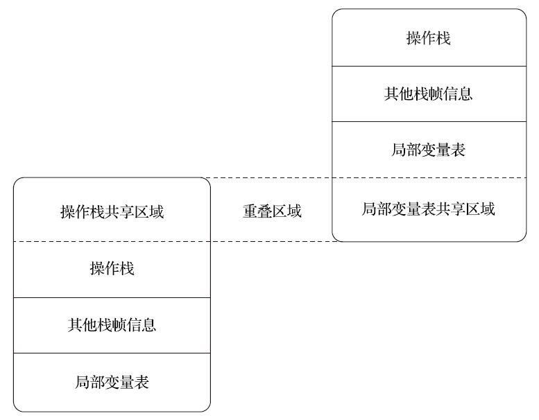

图8-2　两个栈帧之间的数据共享

#### 8.2.3　动态连接

每个栈帧都包含一个指向运行时常量池[1]中该栈帧所属方法的引用，持有这个引用是为了支持方法调用过程中的动态连接（Dynamic Linking）。通过第6章的讲解，我们知道Class文件的常量池中存有大量的符号引用，字节码中的方法调用指令就以常量池里指向方法的符号引用作为参数。这些符号引用一部分会在类加载阶段或者第一次使用的时候就被转化为直接引用，这种转化被称为静态解析。另外一部分将在每一次运行期间都转化为直接引用，这部分就称为动态连接。关于这两个转化过程的具体过程，将在8.3节中再详细讲解。

[1] 运行时常量池的相关内容详见第2章。

#### 8.2.4　方法返回地址

当一个方法开始执行后，只有两种方式退出这个方法。第一种方式是执行引擎遇到任意一个方法返回的字节码指令，这时候可能会有返回值传递给上层的方法调用者（调用当前方法的方法称为调用者或者主调方法），方法是否有返回值以及返回值的类型将根据遇到何种方法返回指令来决定，这种退出方法的方式称为“正常调用完成”（Normal Method Invocation Completion）。

另外一种退出方式是在方法执行的过程中遇到了异常，并且这个异常没有在方法体内得到妥善处理。无论是Java虚拟机内部产生的异常，还是代码中使用athrow字节码指令产生的异常，只要在本方法的异常表中没有搜索到匹配的异常处理器，就会导致方法退出，这种退出方法的方式称为“异常调用完成（Abrupt Method Invocation Completion）”。一个方法使用异常完成出口的方式退出，是不会给它的上层调用者提供任何返回值的。

无论采用何种退出方式，在方法退出之后，都必须返回到最初方法被调用时的位置，程序才能继续执行，方法返回时可能需要在栈帧中保存一些信息，用来帮助恢复它的上层主调方法的执行状态。一般来说，方法正常退出时，主调方法的PC计数器的值就可以作为返回地址，栈帧中很可能会保存这个计数器值。而方法异常退出时，返回地址是要通过异常处理器表来确定的，栈帧中就一般不会保存这部分信息。

方法退出的过程实际上等同于把当前栈帧出栈，因此退出时可能执行的操作有：恢复上层方法的局部变量表和操作数栈，把返回值（如果有的话）压入调用者栈帧的操作数栈中，调整PC计数器的值以指向方法调用指令后面的一条指令等。笔者这里写的“可能”是由于这是基于概念模型的讨论，只有具体到某一款Java虚拟机实现，会执行哪些操作才能确定下来。

#### 8.2.5　附加信息

《Java虚拟机规范》允许虚拟机实现增加一些规范里没有描述的信息到栈帧之中，例如与调试、性能收集相关的信息，这部分信息完全取决于具体的虚拟机实现，这里不再详述。在讨论概念时，一般会把动态连接、方法返回地址与其他附加信息全部归为一类，称为栈帧信息。

### 8.3　方法调用

方法调用并不等同于方法中的代码被执行，方法调用阶段唯一的任务就是确定被调用方法的版本（即调用哪一个方法），暂时还未涉及方法内部的具体运行过程。在程序运行时，进行方法调用是最普遍、最频繁的操作之一，但第7章中已经讲过，Class文件的编译过程中不包含传统程序语言编译的连接步骤，一切方法调用在Class文件里面存储的都只是符号引用，而不是方法在实际运行时内存布局中的入口地址（也就是之前说的直接引用）。这个特性给Java带来了更强大的动态扩展能力，但也使得Java方法调用过程变得相对复杂，某些调用需要在类加载期间，甚至到运行期间才能确定目标方法的直接引用。

#### 8.3.1　解析

承接前面关于方法调用的话题，所有方法调用的目标方法在Class文件里面都是一个常量池中的符号引用，在类加载的解析阶段，会将其中的一部分符号引用转化为直接引用，这种解析能够成立的前提是：方法在程序真正运行之前就有一个可确定的调用版本，并且这个方法的调用版本在运行期是不可改变的。换句话说，调用目标在程序代码写好、编译器进行编译那一刻就已经确定下来。这类方法的调用被称为解析（Resolution）。

在Java语言中符合“编译期可知，运行期不可变”这个要求的方法，主要有静态方法和私有方法两大类，前者与类型直接关联，后者在外部不可被访问，这两种方法各自的特点决定了它们都不可能通过继承或别的方式重写出其他版本，因此它们都适合在类加载阶段进行解析。

调用不同类型的方法，字节码指令集里设计了不同的指令。在Java虚拟机支持以下5条方法调用字节码指令，分别是：

- invokestatic。用于调用静态方法。
- invokespecial。用于调用实例构造器<init>()方法、私有方法和父类中的方法。
- invokevirtual。用于调用所有的虚方法。
- invokeinterface。用于调用接口方法，会在运行时再确定一个实现该接口的对象。
- invokedynamic。先在运行时动态解析出调用点限定符所引用的方法，然后再执行该方法。前面4条调用指令，分派逻辑都固化在Java虚拟机内部，而invokedynamic指令的分派逻辑是由用户设定的引导方法来决定的。

只要能被invokestatic和invokespecial指令调用的方法，都可以在解析阶段中确定唯一的调用版本，Java语言里符合这个条件的方法共有静态方法、私有方法、实例构造器、父类方法4种，再加上被final修饰的方法（尽管它使用invokevirtual指令调用），这5种方法调用会在类加载的时候就可以把符号引用解析为该方法的直接引用。这些方法统称为“非虚方法”（Non-Virtual Method），与之相反，其他方法就被称为“虚方法”（Virtual Method）。

代码清单8-5演示了一种常见的解析调用的例子，该样例中，静态方法sayHello()只可能属于类型StaticResolution，没有任何途径可以覆盖或隐藏这个方法。

代码清单8-5　方法静态解析演示

```java
/**
 * 方法静态解析演示
 *
 * @author zzm
 */
public class StaticResolution {
    public static void sayHello() {
        System.out.println("hello world");
    }
    public static void main(String[] args) {
        StaticResolution.sayHello();
    }
}
```

使用javap命令查看这段程序对应的字节码，会发现的确是通过invokestatic命令来调用sayHello()方法，而且其调用的方法版本已经在编译时就明确以常量池项的形式固化在字节码指令的参数之中（代码里的31号常量池项）：

```text
javap -verbose StaticResolution
public static void main(java.lang.String[]);
    Code:
        Stack=0, Locals=1, Args_size=1
        0:   invokestatic    #31; //Method sayHello:()V
        3:   return
    LineNumberTable:
        line 15: 0
        line 16: 3
```

Java中的非虚方法除了使用invokestatic、invokespecial调用的方法之外还有一种，就是被final修饰的实例方法。虽然由于历史设计的原因，final方法是使用invokevirtual指令来调用的，但是因为它也无法被覆盖，没有其他版本的可能，所以也无须对方法接收者进行多态选择，又或者说多态选择的结果肯定是唯一的。在《Java语言规范》中明确定义了被final修饰的方法是一种非虚方法。

解析调用一定是个静态的过程，在编译期间就完全确定，在类加载的解析阶段就会把涉及的符号引用全部转变为明确的直接引用，不必延迟到运行期再去完成。而另一种主要的方法调用形式：分派（Dispatch）调用则要复杂许多，它可能是静态的也可能是动态的，按照分派依据的宗量数可分为单分派和多分派[1]。这两类分派方式两两组合就构成了静态单分派、静态多分派、动态单分派、动态多分派4种分派组合情况，下面我们来看看虚拟机中的方法分派是如何进行的。

[1] 这里涉及的单分派、多分派及相关概念（如“宗量数”）在后续章节有详细解释，如没有这方面基础的读者暂时略过即可。

#### 8.3.2　分派

众所周知，Java是一门面向对象的程序语言，因为Java具备面向对象的3个基本特征：继承、封装和多态。本节讲解的分派调用过程将会揭示多态性特征的一些最基本的体现，如“重载”和“重写”在Java虚拟机之中是如何实现的，这里的实现当然不是语法上该如何写，我们关心的依然是虚拟机如何确定正确的目标方法。

##### 1. 静态分派

在开始讲解静态分派[1]前，笔者先声明一点，“分派”（Dispatch）这个词本身就具有动态性，一般不应用在静态语境之中，这部分原本在英文原版的《Java虚拟机规范》和《Java语言规范》里的说法都是“Method Overload Resolution”，即应该归入8.2节的“解析”里去讲解，但部分其他外文资料和国内翻译的许多中文资料都将这种行为称为“静态分派”，所以笔者在此特别说明一下，以免读者阅读英文资料时遇到这两种说法产生疑惑。

为了解释静态分派和重载（Overload），笔者准备了一段经常出现在面试题中的程序代码，读者不妨先看一遍，想一下程序的输出结果是什么。后面的话题将围绕这个类的方法来编写重载代码，以分析虚拟机和编译器确定方法版本的过程。程序如代码清单8-6所示。

代码清单8-6　方法静态分派演示

```java
package org.fenixsoft.polymorphic;
/**
 * 方法静态分派演示
 * @author zzm
 */
public class StaticDispatch {
    static abstract class Human {
    }
    static class Man extends Human {
    }
    static class Woman extends Human {
    }
    public void sayHello(Human guy) {
        System.out.println("hello,guy!");
    }
    public void sayHello(Man guy) {
        System.out.println("hello,gentleman!");
    }
    public void sayHello(Woman guy) {
        System.out.println("hello,lady!");
    }
    public static void main(String[] args) {
        Human man = new Man();
        Human woman = new Woman();
        StaticDispatch sr = new StaticDispatch();
        sr.sayHello(man);
        sr.sayHello(woman);
    }
}
```

运行结果：

```text
hello,guy!
hello,guy!
```

代码清单8-6中的代码实际上是在考验阅读者对重载的理解程度，相信对Java稍有经验的程序员看完程序后都能得出正确的运行结果，但为什么虚拟机会选择执行参数类型为Human的重载版本呢？在解决这个问题之前，我们先通过如下代码来定义两个关键概念：

```java
Human man = new Man();
```

我们把上面代码中的“Human”称为变量的“静态类型”（Static Type），或者叫“外观类型”（Apparent Type），后面的“Man”则被称为变量的“实际类型”（Actual Type）或者叫“运行时类型”（Runtime Type）。静态类型和实际类型在程序中都可能会发生变化，区别是静态类型的变化仅仅在使用时发生，变量本身的静态类型不会被改变，并且最终的静态类型是在编译期可知的；而实际类型变化的结果在运行期才可确定，编译器在编译程序的时候并不知道一个对象的实际类型是什么。笔者猜想上面这段话读者大概会不太好理解，那不妨通过一段实际例子来解释，譬如有下面的代码：

```java
// 实际类型变化
Human human = (new Random()).nextBoolean() ? new Man() : new Woman();
// 静态类型变化
sr.sayHello((Man) human)
sr.sayHello((Woman) human)
```

对象human的实际类型是可变的，编译期间它完全是个“薛定谔的人”，到底是Man还是Woman，必须等到程序运行到这行的时候才能确定。而human的静态类型是Human，也可以在使用时（如sayHello()方法中的强制转型）临时改变这个类型，但这个改变仍是在编译期是可知的，两次sayHello()方法的调用，在编译期完全可以明确转型的是Man还是Woman。

解释清楚了静态类型与实际类型的概念，我们就把话题再转回到代码清单8-6的样例代码中。main()里面的两次sayHello()方法调用，在方法接收者已经确定是对象“sr”的前提下，使用哪个重载版本，就完全取决于传入参数的数量和数据类型。代码中故意定义了两个静态类型相同，而实际类型不同的变量，但虚拟机（或者准确地说是编译器）在重载时是通过参数的静态类型而不是实际类型作为判定依据的。由于静态类型在编译期可知，所以在编译阶段，Javac编译器就根据参数的静态类型决定了会使用哪个重载版本，因此选择了sayHello(Human)作为调用目标，并把这个方法的符号引用写到main()方法里的两条invokevirtual指令的参数中。

所有依赖静态类型来决定方法执行版本的分派动作，都称为静态分派。静态分派的最典型应用表现就是方法重载。静态分派发生在编译阶段，因此确定静态分派的动作实际上不是由虚拟机来执行的，这点也是为何一些资料选择把它归入“解析”而不是“分派”的原因。

需要注意Javac编译器虽然能确定出方法的重载版本，但在很多情况下这个重载版本并不是“唯一”的，往往只能确定一个“相对更合适的”版本。这种模糊的结论在由0和1构成的计算机世界中算是个比较稀罕的事件，产生这种模糊结论的主要原因是字面量天生的模糊性，它不需要定义，所以字面量就没有显式的静态类型，它的静态类型只能通过语言、语法的规则去理解和推断。代码清单8-7演示了何谓“更加合适的”版本。

代码清单8-7　重载方法匹配优先级

```java
package org.fenixsoft.polymorphic;
public class Overload {
    public static void sayHello(Object arg) {
        System.out.println("hello Object");
    }
    public static void sayHello(int arg) {
        System.out.println("hello int");
    }
    public static void sayHello(long arg) {
        System.out.println("hello long");
    }
    public static void sayHello(Character arg) {
        System.out.println("hello Character");
    }
    public static void sayHello(char arg) {
        System.out.println("hello char");
    }
    public static void sayHello(char... arg) {
        System.out.println("hello char ...");
    }
    public static void sayHello(Serializable arg) {
        System.out.println("hello Serializable");
    }
    public static void main(String[] args) {
        sayHello('a');
    }
}
```

上面的代码运行后会输出：

```text
hello char
```

这很好理解，'a'是一个char类型的数据，自然会寻找参数类型为char的重载方法，如果注释掉sayHello(char arg)方法，那输出会变为：

```text
hello int
```

这时发生了一次自动类型转换，'a'除了可以代表一个字符串，还可以代表数字97（字符'a'的Unicode数值为十进制数字97），因此参数类型为int的重载也是合适的。我们继续注释掉sayHello(int arg)方法，那输出会变为：

```text
hello long
```

这时发生了两次自动类型转换，'a'转型为整数97之后，进一步转型为长整数97L，匹配了参数类型为long的重载。笔者在代码中没有写其他的类型如float、double等的重载，不过实际上自动转型还能继续发生多次，按照char>int>long>float>double的顺序转型进行匹配，但不会匹配到byte和short类型的重载，因为char到byte或short的转型是不安全的。我们继续注释掉sayHello(long arg)方法，那输出会变为：

```text
hello Character
```

这时发生了一次自动装箱，'a'被包装为它的封装类型java.lang.Character，所以匹配到了参数类型为Character的重载，继续注释掉sayHello(Character arg)方法，那输出会变为：

```text
hello Serializable
```

这个输出可能会让人摸不着头脑，一个字符或数字与序列化有什么关系？出现hello Serializable，是因为java.lang.Serializable是java.lang.Character类实现的一个接口，当自动装箱之后发现还是找不到装箱类，但是找到了装箱类所实现的接口类型，所以紧接着又发生一次自动转型。char可以转型成int，但是Character是绝对不会转型为Integer的，它只能安全地转型为它实现的接口或父类。Character还实现了另外一个接口java.lang.Comparable<Character>，如果同时出现两个参数分别为Serializable和Comparable<Character>的重载方法，那它们在此时的优先级是一样的。编译器无法确定要自动转型为哪种类型，会提示“类型模糊”（Type Ambiguous），并拒绝编译。程序必须在调用时显式地指定字面量的静态类型，如：sayHello((Comparable<Character>)'a')，才能编译通过。但是如果读者愿意花费一点时间，绕过Javac编译器，自己去构造出表达相同语义的字节码，将会发现这是能够通过Java虚拟机的类加载校验，而且能够被Java虚拟机正常执行的，但是会选择Serializable还是Comparable<Character>的重载方法则并不能事先确定，这是《Java虚拟机规范》所允许的，在第7章介绍接口方法解析过程时曾经提到过。

下面继续注释掉sayHello(Serializable arg)方法，输出会变为：

```text
hello Object
```

这时是char装箱后转型为父类了，如果有多个父类，那将在继承关系中从下往上开始搜索，越接上层的优先级越低。即使方法调用传入的参数值为null时，这个规则仍然适用。我们把sayHello(Object arg)也注释掉，输出将会变为：

```text
hello char ...
```

7个重载方法已经被注释得只剩1个了，可见变长参数的重载优先级是最低的，这时候字符'a'被当作了一个char[]数组的元素。笔者使用的是char类型的变长参数，读者在验证时还可以选择int类型、Character类型、Object类型等的变长参数重载来把上面的过程重新折腾一遍。但是要注意的是，有一些在单个参数中能成立的自动转型，如char转型为int，在变长参数中是不成立的[2]。

代码清单8-7演示了编译期间选择静态分派目标的过程，这个过程也是Java语言实现方法重载的本质。演示所用的这段程序无疑是属于很极端的例子，除了用作面试题为难求职者之外，在实际工作中几乎不可能存在任何有价值的用途，笔者拿来做演示仅仅是用于讲解重载时目标方法选择的过程，对绝大多数下进行这样极端的重载都可算作真正的“关于茴香豆的茴有几种写法的研究”。无论对重载的认识有多么深刻，一个合格的程序员都不应该在实际应用中写这种晦涩的重载代码。

另外还有一点读者可能比较容易混淆：笔者讲述的解析与分派这两者之间的关系并不是二选一的排他关系，它们是在不同层次上去筛选、确定目标方法的过程。例如前面说过静态方法会在编译期确定、在类加载期就进行解析，而静态方法显然也是可以拥有重载版本的，选择重载版本的过程也是通过静态分派完成的。

##### 2. 动态分派

了解了静态分派，我们接下来看一下Java语言里动态分派的实现过程，它与Java语言多态性的另外一个重要体现[3]——重写（Override）有着很密切的关联。我们还是用前面的Man和Woman一起sayHello的例子来讲解动态分派，请看代码清单8-8中所示的代码。

代码清单8-8　方法动态分派演示

```java
package org.fenixsoft.polymorphic;
/**
 * 方法动态分派演示
 * @author zzm
 */
public class DynamicDispatch {
    static abstract class Human {
        protected abstract void sayHello();
    }
    static class Man extends Human {
        @Override
        protected void sayHello() {
            System.out.println("man say hello");
        }
    }
    static class Woman extends Human {
        @Override
        protected void sayHello() {
            System.out.println("woman say hello");
        }
    }
    public static void main(String[] args) {
        Human man = new Man();
        Human woman = new Woman();
        man.sayHello();
        woman.sayHello();
        man = new Woman();
        man.sayHello();
    }
}
```

运行结果：

```text
man say hello
woman say hello
woman say hello
```

这个运行结果相信不会出乎任何人的意料，对于习惯了面向对象思维的Java程序员们会觉得这是完全理所当然的结论。我们现在的问题还是和前面的一样，Java虚拟机是如何判断应该调用哪个方法的？

显然这里选择调用的方法版本是不可能再根据静态类型来决定的，因为静态类型同样都是Human的两个变量man和woman在调用sayHello()方法时产生了不同的行为，甚至变量man在两次调用中还执行了两个不同的方法。导致这个现象的原因很明显，是因为这两个变量的实际类型不同，Java虚拟机是如何根据实际类型来分派方法执行版本的呢？我们使用javap命令输出这段代码的字节码，尝试从中寻找答案，输出结果如代码清单8-9所示。

代码清单8-9　main()方法的字节码

```text
public static void main(java.lang.String[]);
    Code:
        Stack=2, Locals=3, Args_size=1
         0:   new     #16; //class org/fenixsoft/polymorphic/DynamicDispatch$Man
         3:   dup
         4:   invokespecial   #18; //Method org/fenixsoft/polymorphic/Dynamic Dispatch$Man."<init>":()V
         7:   astore_1
         8:   new     #19; //class org/fenixsoft/polymorphic/DynamicDispatch$Woman
        11:  dup
        12:  invokespecial   #21; //Method org/fenixsoft/polymorphic/DynamicDispatch$Woman."<init>":()V
        15:  astore_2
        16:  aload_1
        17:  invokevirtual   #22; //Method org/fenixsoft/polymorphic/Dynamic Dispatch$Human.sayHello:()V
        20:  aload_2
        21:  invokevirtual   #22; //Method org/fenixsoft/polymorphic/Dynamic Dispatch$Human.sayHello:()V
        24:  new     #19; //class org/fenixsoft/polymorphic/DynamicDispatch$Woman
        27:  dup
        28:  invokespecial   #21; //Method org/fenixsoft/polymorphic/DynamicDispatch$Woman."<init>":()V
        31:  astore_1
        32:  aload_1
        33:  invokevirtual   #22; //Method org/fenixsoft/polymorphic/Dynamic Dispatch$Human.sayHello:()V
        36:  return
```

0～15行的字节码是准备动作，作用是建立man和woman的内存空间、调用Man和Woman类型的实例构造器，将这两个实例的引用存放在第1、2个局部变量表的变量槽中，这些动作实际对应了Java源码中的这两行：

```text
Human man = new Man();
Human woman = new Woman();
```

接下来的16～21行是关键部分，16和20行的aload指令分别把刚刚创建的两个对象的引用压到栈顶，这两个对象是将要执行的sayHello()方法的所有者，称为接收者（Receiver）；17和21行是方法调用指令，这两条调用指令单从字节码角度来看，无论是指令（都是invokevirtual）还是参数（都是常量池中第22项的常量，注释显示了这个常量是Human.sayHello()的符号引用）都完全一样，但是这两句指令最终执行的目标方法并不相同。那看来解决问题的关键还必须从invokevirtual指令本身入手，要弄清楚它是如何确定调用方法版本、如何实现多态查找来着手分析才行。根据《Java虚拟机规范》，invokevirtual指令的运行时解析过程[4]大致分为以下几步：

1. 找到操作数栈顶的第一个元素所指向的对象的实际类型，记作C。
2. 如果在类型C中找到与常量中的描述符和简单名称都相符的方法，则进行访问权限校验，如果通过则返回这个方法的直接引用，查找过程结束；不通过则返回java.lang.IllegalAccessError异常。
3. 否则，按照继承关系从下往上依次对C的各个父类进行第二步的搜索和验证过程。
4. 如果始终没有找到合适的方法，则抛出java.lang.AbstractMethodError异常。

正是因为invokevirtual指令执行的第一步就是在运行期确定接收者的实际类型，所以两次调用中的invokevirtual指令并不是把常量池中方法的符号引用解析到直接引用上就结束了，还会根据方法接收者的实际类型来选择方法版本，这个过程就是Java语言中方法重写的本质。我们把这种在运行期根据实际类型确定方法执行版本的分派过程称为动态分派。

既然这种多态性的根源在于虚方法调用指令invokevirtual的执行逻辑，那自然我们得出的结论就只会对方法有效，对字段是无效的，因为字段不使用这条指令。事实上，在Java里面只有虚方法存在，字段永远不可能是虚的，换句话说，字段永远不参与多态，哪个类的方法访问某个名字的字段时，该名字指的就是这个类能看到的那个字段。当子类声明了与父类同名的字段时，虽然在子类的内存中两个字段都会存在，但是子类的字段会遮蔽父类的同名字段。为了加深理解，笔者又编撰了一份“劣质面试题式”的代码片段，请阅读代码清单8-10，思考运行后会输出什么结果。

代码清单8-10　字段没有多态性

```java
package org.fenixsoft.polymorphic;
/**
 * 字段不参与多态
 * @author zzm
 */
public class FieldHasNoPolymorphic {
    static class Father {
        public int money = 1;
        public Father() {
            money = 2;
            showMeTheMoney();
        }
        public void showMeTheMoney() {
            System.out.println("I am Father, i have $" + money);
        }
    }
    static class Son extends Father {
        public int money = 3;
        public Son() {
            money = 4;
            showMeTheMoney();
        }
        public void showMeTheMoney() {
            System.out.println("I am Son,  i have $" + money);
        }
    }
    public static void main(String[] args) {
        Father gay = new Son();
        System.out.println("This gay has $" + gay.money);
    }
}
```

运行后输出结果为：

```text
I am Son, i have $0
I am Son, i have $4
This gay has $2
```

输出两句都是“I am Son”，这是因为Son类在创建的时候，首先隐式调用了Father的构造函数，而Father构造函数中对showMeTheMoney()的调用是一次虚方法调用，实际执行的版本是Son::showMeTheMoney()方法，所以输出的是“I am Son”，这点经过前面的分析相信读者是没有疑问的了。而这时候虽然父类的money字段已经被初始化成2了，但Son::showMeTheMoney()方法中访问的却是子类的money字段，这时候结果自然还是0，因为它要到子类的构造函数执行时才会被初始化。main()的最后一句通过静态类型访问到了父类中的money，输出了2。

##### 3. 单分派与多分派

方法的接收者与方法的参数统称为方法的宗量，这个定义最早应该来源于著名的《Java与模式》一书。根据分派基于多少种宗量，可以将分派划分为单分派和多分派两种。单分派是根据一个宗量对目标方法进行选择，多分派则是根据多于一个宗量对目标方法进行选择。

单分派和多分派的定义读起来拗口，从字面上看也比较抽象，不过对照着实例看并不难理解其含义，代码清单8-11中举了一个Father和Son一起来做出“一个艰难的决定[5]”的例子。

代码清单8-11　单分派和多分派

```java
/**
 * 单分派、多分派演示
 * @author zzm
 */
public class Dispatch {
    static class QQ {}
    static class _360 {}
    public static class Father {
        public void hardChoice(QQ arg) {
            System.out.println("father choose qq");
        }
        public void hardChoice(_360 arg) {
            System.out.println("father choose 360");
        }
    }
    public static class Son extends Father {
        public void hardChoice(QQ arg) {
            System.out.println("son choose qq");
        }
        public void hardChoice(_360 arg) {
            System.out.println("son choose 360");
        }
    }
    public static void main(String[] args) {
        Father father = new Father();
        Father son = new Son();
        father.hardChoice(new _360());
        son.hardChoice(new QQ());
    }
}
```

运行结果：

```text
father choose 360
son choose qq
```

在main()里调用了两次hardChoice()方法，这两次hardChoice()方法的选择结果在程序输出中已经显示得很清楚了。我们关注的首先是编译阶段中编译器的选择过程，也就是静态分派的过程。这时候选择目标方法的依据有两点：一是静态类型是Father还是Son，二是方法参数是QQ还是360。这次选择结果的最终产物是产生了两条invokevirtual指令，两条指令的参数分别为常量池中指向Father::hardChoice(360)及Father::hardChoice(QQ)方法的符号引用。因为是根据两个宗量进行选择，所以Java语言的静态分派属于多分派类型。

再看看运行阶段中虚拟机的选择，也就是动态分派的过程。在执行“son.hardChoice(new QQ())”这行代码时，更准确地说，是在执行这行代码所对应的invokevirtual指令时，由于编译期已经决定目标方法的签名必须为hardChoice(QQ)，虚拟机此时不会关心传递过来的参数“QQ”到底是“腾讯QQ”还是“奇瑞QQ”，因为这时候参数的静态类型、实际类型都对方法的选择不会构成任何影响，唯一可以影响虚拟机选择的因素只有该方法的接受者的实际类型是Father还是Son。因为只有一个宗量作为选择依据，所以Java语言的动态分派属于单分派类型。

根据上述论证的结果，我们可以总结一句：如今（直至本书编写的Java 12和预览版的Java 13）的Java语言是一门静态多分派、动态单分派的语言。强调“如今的Java语言”是因为这个结论未必会恒久不变，C#在3.0及之前的版本与Java一样是动态单分派语言，但在C#4.0中引入了dynamic类型后，就可以很方便地实现动态多分派。JDK 10时Java语法中新出现var关键字，但请读者切勿将其与C#中的dynamic类型混淆，事实上Java的var与C#的var才是相对应的特性，它们与dynamic有着本质的区别：var是在编译时根据声明语句中赋值符右侧的表达式类型来静态地推断类型，这本质是一种语法糖；而dynamic在编译时完全不关心类型是什么，等到运行的时候再进行类型判断。Java语言中与C#的dynamic类型功能相对接近（只是接近，并不是对等的）的应该是在JDK 9时通过JEP 276引入的jdk.dynalink模块[6]，使用jdk.dynalink可以实现在表达式中使用动态类型，Javac编译器会将这些动态类型的操作翻译为invokedynamic指令的调用点。

按照目前Java语言的发展趋势，它并没有直接变为动态语言的迹象，而是通过内置动态语言（如JavaScript）执行引擎、加强与其他Java虚拟机上动态语言交互能力的方式来间接地满足动态性的需求。但是作为多种语言共同执行平台的Java虚拟机层面上则不是如此，早在JDK 7中实现的JSR-292[7]里面就已经开始提供对动态语言的方法调用支持了，JDK 7中新增的invokedynamic指令也成为最复杂的一条方法调用的字节码指令，稍后笔者将在本章中专门开一节来讲解这个与Java调用动态语言密切相关的特性。

##### 4. 虚拟机动态分派的实现

前面介绍的分派过程，作为对Java虚拟机概念模型的解释基本上已经足够了，它已经解决了虚拟机在分派中“会做什么”这个问题。但如果问Java虚拟机“具体如何做到”的，答案则可能因各种虚拟机的实现不同会有些差别。

动态分派是执行非常频繁的动作，而且动态分派的方法版本选择过程需要运行时在接收者类型的方法元数据中搜索合适的目标方法，因此，Java虚拟机实现基于执行性能的考虑，真正运行时一般不会如此频繁地去反复搜索类型元数据。面对这种情况，一种基础而且常见的优化手段是为类型在方法区中建立一个虚方法表（Virtual Method Table，也称为vtable，与此对应的，在invokeinterface执行时也会用到接口方法表——Interface Method Table，简称itable），使用虚方法表索引来代替元数据查找以提高性能[8]。我们先看看代码清单8-11所对应的虚方法表结构示例，如图8-3所示。

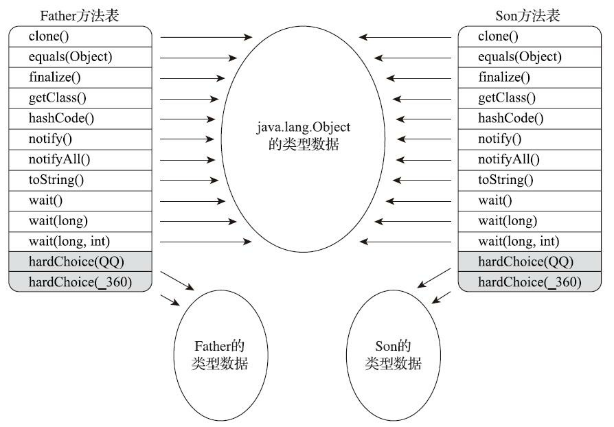

图8-3　方法表结构

虚方法表中存放着各个方法的实际入口地址。如果某个方法在子类中没有被重写，那子类的虚方法表中的地址入口和父类相同方法的地址入口是一致的，都指向父类的实现入口。如果子类中重写了这个方法，子类虚方法表中的地址也会被替换为指向子类实现版本的入口地址。在图8-3中，Son重写了来自Father的全部方法，因此Son的方法表没有指向Father类型数据的箭头。但是Son和Father都没有重写来自Object的方法，所以它们的方法表中所有从Object继承来的方法都指向了Object的数据类型。

为了程序实现方便，具有相同签名的方法，在父类、子类的虚方法表中都应当具有一样的索引序号，这样当类型变换时，仅需要变更查找的虚方法表，就可以从不同的虚方法表中按索引转换出所需的入口地址。虚方法表一般在类加载的连接阶段进行初始化，准备了类的变量初始值后，虚拟机会把该类的虚方法表也一同初始化完毕。

上文中笔者提到了查虚方法表是分派调用的一种优化手段，由于Java对象里面的方法默认（即不使用final修饰）就是虚方法，虚拟机除了使用虚方法表之外，为了进一步提高性能，还会使用类型继承关系分析（Class Hierarchy Analysis，CHA）、守护内联（Guarded Inlining）、内联缓存（Inline Cache）等多种非稳定的激进优化来争取更大的性能空间，关于这几种优化技术的原理和运作过程，读者可以参考第11章中的相关内容。

[1] 维基百科中关于静态分派的解释：https://en.wikipedia.org/wiki/Static_dispatch。
[2] 重载中选择最合适方法的过程，可参见《Java语言规范》15.12.2节的相关内容。
[3] 重写肯定是多态性的体现，但对于重载算不算多态，有一些概念上的争议，有观点认为必须是多个不同类对象对同一签名的方法做出不同响应才算多态，也有观点认为只要使用同一形式的接口去实现不同类的行为就算多态。笔者看来这种争论并无太大意义，概念仅仅是说明问题的一种工具而已。
[4] 指普通方法的解析过程，有一些特殊情况（签名多态性方法）的解析过程会稍有区别，但这是用于支持动态语言调用的，与本节话题关系不大。
[5] 这是一个2010年诞生的老梗了，尽管当时很轰动，但现在可能很多人都并不了解事情始末，这并不会影响本文的阅读。如有兴趣具体可参考：https://zhuanlan.zhihu.com/p/19609988。
[6] JEP 276的Owner是Attila Szegedi，jdk.dynalink包实质就是把他自己写的开源项目dynalink变成了Java标准的API，所以读者对jdk.dynalink感兴趣的话可以参考：https://github.com/szegedi/dynalink。
[7] JSR-292：Supporting Dynamically Typed Languages on the Java Platform.（Java平台的动态语言支持）。
[8] 这里的“提高性能”是相对于直接搜索元数据来说的，实际上在HotSpot虚拟机的实现中，直接去查itable和vtable已经算是最慢的一种分派，只在解释执行状态时使用，在即时编译执行时，会有更多的性能优化措施，具体可常见第11章关于方法内联的内容。

### 8.4　动态类型语言支持

Java虚拟机的字节码指令集的数量自从Sun公司的第一款Java虚拟机问世至今，二十余年间只新增过一条指令，它就是随着JDK 7的发布的字节码首位新成员——invokedynamic指令。这条新增加的指令是JDK 7的项目目标：实现动态类型语言（Dynamically Typed Language）支持而进行的改进之一，也是为JDK 8里可以顺利实现Lambda表达式而做的技术储备。在本节中，我们将详细了解动态语言支持这项特性出现的前因后果和它的意义与价值。

#### 8.4.1　动态类型语言

在介绍Java虚拟机的动态类型语言支持之前，我们要先弄明白动态类型语言是什么？它与Java语言、Java虚拟机有什么关系？了解Java虚拟机提供动态类型语言支持的技术背景，对理解这个语言特性是非常有必要的。

何谓动态类型语言[1]？动态类型语言的关键特征是它的类型检查的主体过程是在运行期而不是编译期进行的，满足这个特征的语言有很多，常用的包括：APL、Clojure、Erlang、Groovy、JavaScript、Lisp、Lua、PHP、Prolog、Python、Ruby、Smalltalk、Tcl，等等。那相对地，在编译期就进行类型检查过程的语言，譬如C++和Java等就是最常用的静态类型语言。

如果读者觉得上面的定义过于概念化，那我们不妨通过两个例子以最浅显的方式来说明什么是“类型检查”和什么叫“在编译期还是在运行期进行”。首先看下面这段简单的Java代码，思考一下它是否能正常编译和运行？

```java
public static void main(String[] args) {
    int[][][] array = new int[1][0][-1];
}
```

上面这段Java代码能够正常编译，但运行的时候会出现NegativeArraySizeException异常。在《Java虚拟机规范》中明确规定了NegativeArraySizeException是一个运行时异常（Runtime Exception），通俗一点说，运行时异常就是指只要代码不执行到这一行就不会出现问题。与运行时异常相对应的概念是连接时异常，例如很常见的NoClassDefFoundError便属于连接时异常，即使导致连接时异常的代码放在一条根本无法被执行到的路径分支上，类加载时（第7章解释过Java的连接过程不在编译阶段，而在类加载阶段）也照样会抛出异常。

不过，在C语言里，语义相同的代码就会在编译期就直接报错，而不是等到运行时才出现异常：

```java
int main(void) {
    int i[1][0][-1];   // GCC拒绝编译，报“size of array is negative”
    return 0;
}
```

由此看来，一门语言的哪一种检查行为要在运行期进行，哪一种检查要在编译期进行并没有什么必然的因果逻辑关系，关键是在语言规范中人为设立的约定。

解答了什么是“连接时、运行时”，笔者再举一个例子来解释什么是“类型检查”，例如下面这一句再普通不过的代码：

```text
obj.println("hello world");
```

虽然正在阅读本书的每一位读者都能看懂这行代码要做什么，但对于计算机来讲，这一行“没头没尾”的代码是无法执行的，它需要一个具体的上下文中（譬如程序语言是什么、obj是什么类型）才有讨论的意义。

现在先假设这行代码是在Java语言中，并且变量obj的静态类型为java.io.PrintStream，那变量obj的实际类型就必须是PrintStream的子类（实现了PrintStream接口的类）才是合法的。否则，哪怕obj属于一个确实包含有println(String)方法相同签名方法的类型，但只要它与PrintStream接口没有继承关系，代码依然不可能运行——因为类型检查不合法。

但是相同的代码在ECMAScript（JavaScript）中情况则不一样，无论obj具体是何种类型，无论其继承关系如何，只要这种类型的方法定义中确实包含有println(String)方法，能够找到相同签名的方法，调用便可成功。

产生这种差别产生的根本原因是Java语言在编译期间却已将println(String)方法完整的符号引用（本例中为一项CONSTANT_InterfaceMethodref_info常量）生成出来，并作为方法调用指令的参数存储到Class文件中，例如下面这个样子：

```text
invokevirtual #4; //Method java/io/PrintStream.println:(Ljava/lang/String;)V
```

这个符号引用包含了该方法定义在哪个具体类型之中、方法的名字以及参数顺序、参数类型和方法返回值等信息，通过这个符号引用，Java虚拟机就可以翻译出该方法的直接引用。而ECMAScript等动态类型语言与Java有一个核心的差异就是变量obj本身并没有类型，变量obj的值才具有类型，所以编译器在编译时最多只能确定方法名称、参数、返回值这些信息，而不会去确定方法所在的具体类型（即方法接收者不固定）。“变量无类型而变量值才有类型”这个特点也是动态类型语言的一个核心特征。

了解了动态类型和静态类型语言的区别后，也许读者的下一个问题就是动态、静态类型语言两者谁更好，或者谁更加先进呢？这种比较不会有确切答案，它们都有自己的优点，选择哪种语言是需要权衡的事情。静态类型语言能够在编译期确定变量类型，最显著的好处是编译器可以提供全面严谨的类型检查，这样与数据类型相关的潜在问题就能在编码时被及时发现，利于稳定性及让项目容易达到更大的规模。而动态类型语言在运行期才确定类型，这可以为开发人员提供极大的灵活性，某些在静态类型语言中要花大量臃肿代码来实现的功能，由动态类型语言去做可能会很清晰简洁，清晰简洁通常也就意味着开发效率的提升。

[1] 注意，动态类型语言与动态语言、弱类型语言并不是一个概念，需要区别对待。

#### 8.4.2　Java与动态类型

现在我们回到本节的主题，来看看Java语言、Java虚拟机与动态类型语言之间有什么关系。Java虚拟机毫无疑问是Java语言的运行平台，但它的使命并不限于此，早在1997年出版的《Java虚拟机规范》第1版中就规划了这样一个愿景：“在未来，我们会对Java虚拟机进行适当的扩展，以便更好地支持其他语言运行于Java虚拟机之上。”而目前确实已经有许多动态类型语言运行于Java虚拟机之上了，如Clojure、Groovy、Jython和JRuby等，能够在同一个虚拟机之上可以实现静态类型语言的严谨与动态类型语言的灵活，这的确是一件很美妙的事情。

但遗憾的是Java虚拟机层面对动态类型语言的支持一直都还有所欠缺，主要表现在方法调用方面：JDK 7以前的字节码指令集中，4条方法调用指令（invokevirtual、invokespecial、invokestatic、invokeinterface）的第一个参数都是被调用的方法的符号引用（CONSTANT_Methodref_info或者CONSTANT_InterfaceMethodref_info常量），前面已经提到过，方法的符号引用在编译时产生，而动态类型语言只有在运行期才能确定方法的接收者。这样，在Java虚拟机上实现的动态类型语言就不得不使用“曲线救国”的方式（如编译时留个占位符类型，运行时动态生成字节码实现具体类型到占位符类型的适配）来实现，但这样势必会让动态类型语言实现的复杂度增加，也会带来额外的性能和内存开销。内存开销是很显而易见的，方法调用产生的那一大堆的动态类就摆在那里。而其中最严重的性能瓶颈是在于动态类型方法调用时，由于无法确定调用对象的静态类型，而导致的方法内联无法有效进行。在第11章里我们会讲到方法内联的重要性，它是其他优化措施的基础，也可以说是最重要的一项优化。尽管也可以想一些办法（譬如调用点缓存）尽量缓解支持动态语言而导致的性能下降，但这种改善毕竟不是本质的。譬如有类似以下代码：

```text
var arrays = {"abc", new ObjectX(), 123, Dog, Cat, Car..}
for(item in arrays){
    item.sayHello();
}
```

在动态类型语言下这样的代码是没有问题，但由于在运行时arrays中的元素可以是任意类型，即使它们的类型中都有sayHello()方法，也肯定无法在编译优化的时候就确定具体sayHello()的代码在哪里，编译器只能不停编译它所遇见的每一个sayHello()方法，并缓存起来供执行时选择、调用和内联，如果arrays数组中不同类型的对象很多，就势必会对内联缓存产生很大的压力，缓存的大小总是有限的，类型信息的不确定性导致了缓存内容不断被失效和更新，先前优化过的方法也可能被不断替换而无法重复使用。所以这种动态类型方法调用的底层问题终归是应当在Java虚拟机层次上去解决才最合适。因此，在Java虚拟机层面上提供动态类型的直接支持就成为Java平台发展必须解决的问题，这便是JDK 7时JSR-292提案中invokedynamic指令以及java.lang.invoke包出现的技术背景。

#### 8.4.3　java.lang.invoke包

JDK 7时新加入的java.lang.invoke包[1]是JSR 292的一个重要组成部分，这个包的主要目的是在之前单纯依靠符号引用来确定调用的目标方法这条路之外，提供一种新的动态确定目标方法的机制，称为“方法句柄”（Method Handle）。这个表达听起来也不好懂？那不妨把方法句柄与C/C++中的函数指针（Function Pointer），或者C#里面的委派（Delegate）互相类比一下来理解。举个例子，如果我们要实现一个带谓词（谓词就是由外部传入的排序时比较大小的动作）的排序函数，在C/C++中的常用做法是把谓词定义为函数，用函数指针来把谓词传递到排序方法，像这样：

```java
void sort(int list[], const int size, int (*compare)(int, int))
```

但在Java语言中做不到这一点，没有办法单独把一个函数作为参数进行传递。普遍的做法是设计一个带有compare()方法的Comparator接口，以实现这个接口的对象作为参数，例如Java类库中的Collections::sort()方法就是这样定义的：

```java
void sort(List list, Comparator c)
```

不过，在拥有方法句柄之后，Java语言也可以拥有类似于函数指针或者委托的方法别名这样的工具了。代码清单8-12演示了方法句柄的基本用法，无论obj是何种类型（临时定义的ClassA抑或是实现PrintStream接口的实现类System.out），都可以正确调用到println()方法。

代码清单8-12　方法句柄演示

```java
import static java.lang.invoke.MethodHandles.lookup;
import java.lang.invoke.MethodHandle;
import java.lang.invoke.MethodType;
/**
 * JSR 292 MethodHandle基础用法演示
 * @author zzm
 */
public class MethodHandleTest {
    static class ClassA {
        public void println(String s) {
            System.out.println(s);
        }
    }
    public static void main(String[] args) throws Throwable {
        Object obj = System.currentTimeMillis() % 2 == 0 ? System.out : new ClassA();
        // 无论obj最终是哪个实现类，下面这句都能正确调用到println方法。
        getPrintlnMH(obj).invokeExact("icyfenix");
    }
    private static MethodHandle getPrintlnMH(Object reveiver) throws Throwable {
        // MethodType：代表“方法类型”，包含了方法的返回值（methodType()的第一个参数）和
           具体参数（methodType()第二个及以后的参数）。
        MethodType mt = MethodType.methodType(void.class, String.class);
        // lookup()方法来自于MethodHandles.lookup，这句的作用是在指定类中查找符合给定的方法
           名称、方法类型，并且符合调用权限的方法句柄。
        // 因为这里调用的是一个虚方法，按照Java语言的规则，方法第一个参数是隐式的，代表该方法的接
            收者，也即this指向的对象，这个参数以前是放在参数列表中进行传递，现在提供了bindTo()
           方法来完成这件事情。
        return lookup().findVirtual(reveiver.getClass(), "println", mt).bindTo(reveiver);
    }
}
```

方法getPrintlnMH()中实际上是模拟了invokevirtual指令的执行过程，只不过它的分派逻辑并非固化在Class文件的字节码上，而是通过一个由用户设计的Java方法来实现。而这个方法本身的返回值（MethodHandle对象），可以视为对最终调用方法的一个“引用”。以此为基础，有了MethodHandle就可以写出类似于C/C++那样的函数声明了：

```text
void sort(List list, MethodHandle compare)
```

从上面的例子看来，使用MethodHandle并没有多少困难，不过看完它的用法之后，读者大概就会产生疑问，相同的事情，用反射不是早就可以实现了吗？

确实，仅站在Java语言的角度看，MethodHandle在使用方法和效果上与Reflection有众多相似之处。不过，它们也有以下这些区别：

- Reflection和MethodHandle机制本质上都是在模拟方法调用，但是Reflection是在模拟Java代码层次的方法调用，而MethodHandle是在模拟字节码层次的方法调用。在MethodHandles.Lookup上的3个方法findStatic()、findVirtual()、findSpecial()正是为了对应于invokestatic、invokevirtual（以及invokeinterface）和invokespecial这几条字节码指令的执行权限校验行为，而这些底层细节在使用Reflection API时是不需要关心的。
- Reflection中的java.lang.reflect.Method对象远比MethodHandle机制中的java.lang.invoke.MethodHandle对象所包含的信息来得多。前者是方法在Java端的全面映像，包含了方法的签名、描述符以及方法属性表中各种属性的Java端表示方式，还包含执行权限等的运行期信息。而后者仅包含执行该方法的相关信息。用开发人员通俗的话来讲，Reflection是重量级，而MethodHandle是轻量级。
- 由于MethodHandle是对字节码的方法指令调用的模拟，那理论上虚拟机在这方面做的各种优化（如方法内联），在MethodHandle上也应当可以采用类似思路去支持（但目前实现还在继续完善中），而通过反射去调用方法则几乎不可能直接去实施各类调用点优化措施。

MethodHandle与Reflection除了上面列举的区别外，最关键的一点还在于去掉前面讨论施加的前提“仅站在Java语言的角度看”之后：Reflection API的设计目标是只为Java语言服务的，而MethodHandle则设计为可服务于所有Java虚拟机之上的语言，其中也包括了Java语言而已，而且Java在这里并不是主角。

[1] 这个包曾经在不算短的时间里的名称是java.dyn，也曾经短暂更名为java.lang.mh，如果读者在其他资料上看到这两个包名，可以把它们与java.lang.invoke理解为同一种东西。

#### 8.4.4　invokedynamic指令

8.4节一开始就提到了JDK 7为了更好地支持动态类型语言，引入了第五条方法调用的字节码指令invokedynamic，之后却一直没有再提起它，甚至把代码清单8-12使用MethodHandle的示例代码反编译后也完全找不到invokedynamic的身影，这实在与invokedynamic作为Java诞生以来唯一一条新加入的字节码指令的地位不相符，那么invokedynamic到底有什么应用呢？

某种意义上可以说invokedynamic指令与MethodHandle机制的作用是一样的，都是为了解决原有4条“invoke*”指令方法分派规则完全固化在虚拟机之中的问题，把如何查找目标方法的决定权从虚拟机转嫁到具体用户代码之中，让用户（广义的用户，包含其他程序语言的设计者）有更高的自由度。而且，它们两者的思路也是可类比的，都是为了达成同一个目的，只是一个用上层代码和API来实现，另一个用字节码和Class中其他属性、常量来完成。因此，如果前面MethodHandle的例子看懂了，相信读者理解invokedynamic指令并不困难。

每一处含有invokedynamic指令的位置都被称作“动态调用点（Dynamically-Computed Call Site）”，这条指令的第一个参数不再是代表方法符号引用的CONSTANT_Methodref_info常量，而是变为JDK 7时新加入的CONSTANT_InvokeDynamic_info常量，从这个新常量中可以得到3项信息：引导方法（Bootstrap Method，该方法存放在新增的BootstrapMethods属性中）、方法类型（MethodType）和名称。引导方法是有固定的参数，并且返回值规定是java.lang.invoke.CallSite对象，这个对象代表了真正要执行的目标方法调用。根据CONSTANT_InvokeDynamic_info常量中提供的信息，虚拟机可以找到并且执行引导方法，从而获得一个CallSite对象，最终调用到要执行的目标方法上。我们还是照例不依赖枯燥的概念描述，改用一个实际例子来解释这个过程吧，如代码清单8-13所示。

代码清单8-13　InvokeDynamic指令演示

```java
import static java.lang.invoke.MethodHandles.lookup;
import java.lang.invoke.CallSite;
import java.lang.invoke.ConstantCallSite;
import java.lang.invoke.MethodHandle;
import java.lang.invoke.MethodHandles;
import java.lang.invoke.MethodType;
public class InvokeDynamicTest {
    public static void main(String[] args) throws Throwable {
        INDY_BootstrapMethod().invokeExact("icyfenix");
    }
    public static void testMethod(String s) {
        System.out.println("hello String:" + s);
    }
    public static CallSite BootstrapMethod(MethodHandles.Lookup lookup, String name, MethodType mt) throws Throwable {
        return new ConstantCallSite(lookup.findStatic(InvokeDynamicTest.class, name, mt));
    }
    private static MethodType MT_BootstrapMethod() {
        return MethodType
                .fromMethodDescriptorString(
                        "(Ljava/lang/invoke/MethodHandles$Lookup;Ljava/lang/String; Ljava/lang/invoke/MethodType;)Ljava/lang/invoke/CallSite;", null);
    }
    private static MethodHandle MH_BootstrapMethod() throws Throwable {
        return lookup().findStatic(InvokeDynamicTest.class, "BootstrapMethod", MT_BootstrapMethod());
    }
    private static MethodHandle INDY_BootstrapMethod() throws Throwable {
        CallSite cs = (CallSite) MH_BootstrapMethod().invokeWithArguments(lookup(), "testMethod",
                MethodType.fromMethodDescriptorString("(Ljava/lang/String;)V", null));
        return cs.dynamicInvoker();
    }
}
```

这段代码与前面MethodHandleTest的作用基本上是一样的，虽然笔者没有加以注释，但是阅读起来应当也不困难。要是真没读懂也不要紧，笔者没写注释的主要原因是这段代码并非写给人看的，只是为了方便编译器按照笔者的意愿来产生一段字节码而已。前文提到过，由于invokedynamic指令面向的主要服务对象并非Java语言，而是其他Java虚拟机之上的其他动态类型语言，因此，光靠Java语言的编译器Javac的话，在JDK 7时甚至还完全没有办法生成带有invokedynamic指令的字节码（曾经有一个java.dyn.InvokeDynamic的语法糖可以实现，但后来被取消了），而到JDK 8引入了Lambda表达式和接口默认方法后，Java语言才算享受到了一点invokedynamic指令的好处，但用Lambda来解释invokedynamic指令运作就比较别扭，也无法与前面MethodHandle的例子对应类比，所以笔者采用一些变通的办法：John Rose（JSR 292的负责人，以前Da Vinci Machine Project的Leader）编写过一个把程序的字节码转换为使用invokedynamic的简单工具INDY[1]来完成这件事，我们要使用这个工具来产生最终需要的字节码，因此代码清单8-13中的方法名称不能随意改动，更不能把几个方法合并到一起写，因为它们是要被INDY工具读取的。

把上面的代码编译，再使用INDY转换后重新生成的字节码如代码清单8-14所示（结果使用javap输出，因版面原因，精简了许多无关的内容）。

代码清单8-14　InvokeDynamic指令演示（2）

```text
Constant pool:
    #121 = NameAndType    #33:#30    //  testMethod:(Ljava/lang/String;)V
    #123 = InvokeDynamic  #0:#121    //  #0:testMethod:(Ljava/lang/String;)V
public static void main(java.lang.String[]) throws java.lang.Throwable;
    Code:
      stack=2, locals=1, args_size=1
         0: ldc           #23        // String abc
         2: invokedynamic #123,  0   // InvokeDynamic #0:testMethod: (Ljava/lang/String;)V
         7: nop
         8: return
public static java.lang.invoke.CallSite BootstrapMethod(java.lang.invoke.Method Handles$Lookup, java.lang.String, java.lang.invoke.MethodType) throws java.lang.Throwable;
    Code:
      stack=6, locals=3, args_size=3
         0: new           #63        // class java/lang/invoke/ConstantCallSite
         3: dup
         4: aload_0
         5: ldc           #1         // class org/fenixsoft/InvokeDynamicTest
         7: aload_1
         8: aload_2
         9: invokevirtual #65        // Method java/lang/invoke/MethodHandles$ Lookup.findStatic:(Ljava/lang/Class;Ljava/ lang/String;Ljava/lang/invoke/Method Type;)Ljava/lang/invoke/MethodHandle;
        12: invokespecial #71        // Method java/lang/invoke/ConstantCallSite. "<init>":(Ljava/lang/invoke/MethodHandle;)V
        15: areturn
```

从main()方法的字节码中可见，原本的方法调用指令已经被替换为invokedynamic了，它的参数为第123项常量（第二个值为0的参数在虚拟机中不会直接用到，这与invokeinterface指令那个的值为0的参数一样是占位用的，目的都是为了给常量池缓存留出足够的空间）：

```text
2: invokedynamic #123,  0 // InvokeDynamic #0:testMethod:(Ljava/lang/String;)V
```

从常量池中可见，第123项常量显示“#123=InvokeDynamic#0：#121”说明它是一项CONSTANT_InvokeDynamic_info类型常量，常量值中前面“#0”代表引导方法取Bootstrap Methods属性表的第0项（javap没有列出属性表的具体内容，不过示例中仅有一个引导方法，即BootstrapMethod()），而后面的“#121”代表引用第121项类型为CONSTANT_NameAndType_info的常量，从这个常量中可以获取到方法名称和描述符，即后面输出的“testMethod：(Ljava/lang/String；)V”。

再看BootstrapMethod()，这个方法在Java源码中并不存在，是由INDY产生的，但是它的字节码很容易读懂，所有逻辑都是调用MethodHandles$Lookup的findStatic()方法，产生testMethod()方法的MethodHandle，然后用它创建一个ConstantCallSite对象。最后，这个对象返回给invokedynamic指令实现对testMethod()方法的调用，invokedynamic指令的调用过程到此就宣告完成了。

[1] INDY下载地址：http://blogs.oracle.com/jrose/entry/a_modest_tool_for_writing。

#### 8.4.5　实战：掌控方法分派规则

invokedynamic指令与此前4条传统的“invoke*”指令的最大区别就是它的分派逻辑不是由虚拟机决定的，而是由程序员决定。在介绍Java虚拟机动态语言支持的最后一节中，笔者希望通过一个简单例子（如代码清单8-15所示），帮助读者理解程序员可以掌控方法分派规则之后，我们能做什么以前无法做到的事情。

代码清单8-15　方法调用问题

```java
class GrandFather {
    void thinking() {
        System.out.println("i am grandfather");
    }
}
class Father extends GrandFather {
    void thinking() {
        System.out.println("i am father");
    }
}
class Son extends Father {
    void thinking() {
       // 请读者在这里填入适当的代码（不能修改其他地方的代码）
       // 实现调用祖父类的thinking()方法，打印"i am grandfather"
   }
}
```

在Java程序中，可以通过“super”关键字很方便地调用到父类中的方法，但如果要访问祖类的方法呢？读者在往下阅读本书提供的解决方案之前，不妨自己思考一下，在JDK 7之前有没有办法解决这个问题。

在拥有invokedynamic和java.lang.invoke包之前，使用纯粹的Java语言很难处理这个问题（使用ASM等字节码工具直接生成字节码当然还是可以处理的，但这已经是在字节码而不是Java语言层面来解决问题了），原因是在Son类的thinking()方法中根本无法获取到一个实际类型是GrandFather的对象引用，而invokevirtual指令的分派逻辑是固定的，只能按照方法接收者的实际类型进行分派，这个逻辑完全固化在虚拟机中，程序员无法改变。如果是JDK 7 Update 9之前，使用代码清单8-16中的程序就可以直接解决该问题。

代码清单8-16　使用MethodHandle来解决问题

```java
import static java.lang.invoke.MethodHandles.lookup;
import java.lang.invoke.MethodHandle;
import java.lang.invoke.MethodType;
class Test {
class GrandFather {
    void thinking() {
        System.out.println("i am grandfather");
    }
}
class Father extends GrandFather {
    void thinking() {
        System.out.println("i am father");
    }
}
class Son extends Father {
    void thinking() {
        try {
                MethodType mt = MethodType.methodType(void.class);
                MethodHandle mh = lookup().findSpecial(GrandFather.class,
"thinking", mt, getClass());
                mh.invoke(this);
            } catch (Throwable e) {
            }
        }
    }
    public static void main(String[] args) {
        (new Test().new Son()).thinking();
    }
}
```

使用JDK 7 Update 9之前的HotSpot虚拟机运行，会得到如下运行结果：

```text
i am grandfather
```

但是这个逻辑在JDK 7 Update 9之后被视作一个潜在的安全性缺陷修正了，原因是必须保证findSpecial()查找方法版本时受到的访问约束（譬如对访问控制的限制、对参数类型的限制）应与使用invokespecial指令一样，两者必须保持精确对等，包括在上面的场景中它只能访问到其直接父类中的方法版本。所以在JDK 7 Update 10修正之后，运行以上代码只能得到如下结果：

```text
i am father
```

由于本书的第2版是基于早期版本的JDK 7撰写的，所以印刷之后才发布的JDK更新就很难再及时地同步修正了，这导致不少读者重现这段代码的运行结果时产生了疑惑，也收到了很多热心读者的邮件，在此一并感谢。

那在新版本的JDK中，上面的问题是否能够得到解决呢？答案是可以的，如果读者去查看MethodHandles.Lookup类的代码，将会发现需要进行哪些访问保护，在该API实现时是预留了后门的。访问保护是通过一个allowedModes的参数来控制，而且这个参数可以被设置成“TRUSTED”来绕开所有的保护措施。尽管这个参数只是在Java类库本身使用，没有开放给外部设置，但我们通过反射可以轻易打破这种限制。由此，我们可以把代码清单8-16中子类的thinking()方法修改为如下所示的代码来解决问题：

```java
void thinking() {
    try {
        MethodType mt = MethodType.methodType(void.class);
        Field lookupImpl = MethodHandles.Lookup.class.getDeclaredField("IMPL_LOOKUP");
        lookupImpl.setAccessible(true);
        MethodHandle mh = ((MethodHandles.Lookup) lookupImpl.get(null)).findSpecial(GrandFather.class,"thinking", mt, GrandFather.class);
        mh.invoke(this);
    } catch (Throwable e) {
    }
}
```

运行以上代码，在目前所有JDK版本中均可获得如下结果：

```text
i am grandfather
```

### 8.5　基于栈的字节码解释执行引擎

关于Java虚拟机是如何调用方法、进行版本选择的内容已经全部讲解完毕，从本节开始，我们来探讨虚拟机是如何执行方法里面的字节码指令的。概述中曾提到过，许多Java虚拟机的执行引擎在执行Java代码的时候都有解释执行（通过解释器执行）和编译执行（通过即时编译器产生本地代码执行）两种选择，在本节中，我们将会分析在概念模型下的Java虚拟机解释执行字节码时，其执行引擎是如何工作的。笔者在本章多次强调了“概念模型”，是因为实际的虚拟机实现，譬如HotSpot的模板解释器工作的时候，并不是按照下文中的动作一板一眼地进行机械式计算，而是动态产生每条字节码对应的汇编代码来运行，这与概念模型中执行过程的差异很大，但是结果却能保证是一致的。

#### 8.5.1　解释执行

Java语言经常被人们定位为“解释执行”的语言，在Java初生的JDK 1.0时代，这种定义还算是比较准确的，但当主流的虚拟机中都包含了即时编译器后，Class文件中的代码到底会被解释执行还是编译执行，就成了只有虚拟机自己才能准确判断的事。再后来，Java也发展出可以直接生成本地代码的编译器（如Jaotc、GCJ[1]，Excelsior JET），而C/C++语言也出现了通过解释器执行的版本（如CINT[2]），这时候再笼统地说“解释执行”，对于整个Java语言来说就成了几乎是没有意义的概念，只有确定了谈论对象是某种具体的Java实现版本和执行引擎运行模式时，谈解释执行还是编译执行才会比较合理确切。

无论是解释还是编译，也无论是物理机还是虚拟机，对于应用程序，机器都不可能如人那样阅读、理解，然后获得执行能力。大部分的程序代码转换成物理机的目标代码或虚拟机能执行的指令集之前，都需要经过图8-4中的各个步骤。如果读者对大学编译原理的相关课程还有印象的话，很容易就会发现图8-4中下面的那条分支，就是传统编译原理中程序代码到目标机器代码的生成过程；而中间的那条分支，自然就是解释执行的过程。

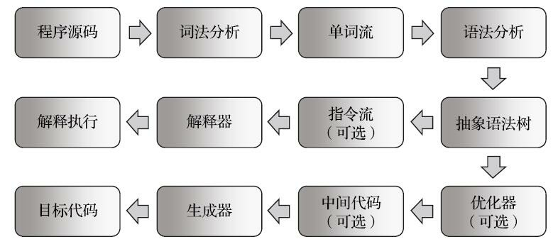

图8-4　编译过程

如今，基于物理机、Java虚拟机，或者是非Java的其他高级语言虚拟机（HLLVM）的代码执行过程，大体上都会遵循这种符合现代经典编译原理的思路，在执行前先对程序源码进行词法分析和语法分析处理，把源码转化为抽象语法树（Abstract Syntax Tree，AST）。对于一门具体语言的实现来说，词法、语法分析以至后面的优化器和目标代码生成器都可以选择独立于执行引擎，形成一个完整意义的编译器去实现，这类代表是C/C++语言。也可以选择把其中一部分步骤（如生成抽象语法树之前的步骤）实现为一个半独立的编译器，这类代表是Java语言。又或者把这些步骤和执行引擎全部集中封装在一个封闭的黑匣子之中，如大多数的JavaScript执行引擎。

在Java语言中，Javac编译器完成了程序代码经过词法分析、语法分析到抽象语法树，再遍历语法树生成线性的字节码指令流的过程。因为这一部分动作是在Java虚拟机之外进行的，而解释器在虚拟机的内部，所以Java程序的编译就是半独立的实现。

[1] GCJ：http://gcc.gnu.org/java/。
[2] CINT：http://root.cern.ch/drupal/content/cint。

#### 8.5.2　基于栈的指令集与基于寄存器的指令集

Javac编译器输出的字节码指令流，基本上[1]是一种基于栈的指令集架构（Instruction Set Architecture，ISA），字节码指令流里面的指令大部分都是零地址指令，它们依赖操作数栈进行工作。与之相对的另外一套常用的指令集架构是基于寄存器的指令集，最典型的就是x86的二地址指令集，如果说得更通俗一些就是现在我们主流PC机中物理硬件直接支持的指令集架构，这些指令依赖寄存器进行工作。那么，基于栈的指令集与基于寄存器的指令集这两者之间有什么不同呢？

举个最简单的例子，分别使用这两种指令集去计算“1+1”的结果，基于栈的指令集会是这样子的：

```text
iconst_1
iconst_1
iadd
istore_0
```

两条iconst_1指令连续把两个常量1压入栈后，iadd指令把栈顶的两个值出栈、相加，然后把结果放回栈顶，最后istore_0把栈顶的值放到局部变量表的第0个变量槽中。这种指令流中的指令通常都是不带参数的，使用操作数栈中的数据作为指令的运算输入，指令的运算结果也存储在操作数栈之中。而如果用基于寄存器的指令集，那程序可能会是这个样子：

```text
mov  eax, 1
add  eax, 1
```

mov指令把EAX寄存器的值设为1，然后add指令再把这个值加1，结果就保存在EAX寄存器里面。这种二地址指令是x86指令集中的主流，每个指令都包含两个单独的输入参数，依赖于寄存器来访问和存储数据。

了解了基于栈的指令集与基于寄存器的指令集的区别后，读者可能会有个进一步的疑问，这两套指令集谁更好一些呢？

应该说，既然两套指令集会同时并存和发展，那肯定是各有优势的，如果有一套指令集全面优于另外一套的话，就是直接替代而不存在选择的问题了。

基于栈的指令集主要优点是可移植，因为寄存器由硬件直接提供[2]，程序直接依赖这些硬件寄存器则不可避免地要受到硬件的约束。例如现在32位80x86体系的处理器能提供了8个32位的寄存器，而ARMv6体系的处理器（在智能手机、数码设备中相当流行的一种处理器）则提供了30个32位的通用寄存器，其中前16个在用户模式中可以使用。如果使用栈架构的指令集，用户程序不会直接用到这些寄存器，那就可以由虚拟机实现来自行决定把一些访问最频繁的数据（程序计数器、栈顶缓存等）放到寄存器中以获取尽量好的性能，这样实现起来也更简单一些。栈架构的指令集还有一些其他的优点，如代码相对更加紧凑（字节码中每个字节就对应一条指令，而多地址指令集中还需要存放参数）、编译器实现更加简单（不需要考虑空间分配的问题，所需空间都在栈上操作）等。

栈架构指令集的主要缺点是理论上执行速度相对来说会稍慢一些，所有主流物理机的指令集都是寄存器架构[3]也从侧面印证了这点。不过这里的执行速度是要局限在解释执行的状态下，如果经过即时编译器输出成物理机上的汇编指令流，那就与虚拟机采用哪种指令集架构没有什么关系了。

在解释执行时，栈架构指令集的代码虽然紧凑，但是完成相同功能所需的指令数量一般会比寄存器架构来得更多，因为出栈、入栈操作本身就产生了相当大量的指令。更重要的是栈实现在内存中，频繁的栈访问也就意味着频繁的内存访问，相对于处理器来说，内存始终是执行速度的瓶颈。尽管虚拟机可以采取栈顶缓存的优化方法，把最常用的操作映射到寄存器中避免直接内存访问，但这也只是优化措施而不是解决本质问题的方法。因此由于指令数量和内存访问的原因，导致了栈架构指令集的执行速度会相对慢上一点。

[1] 使用“基本上”，是因为部分字节码指令会带有参数，而纯粹基于栈的指令集架构中应当全部都是零地址指令，也就是都不存在显式的参数。Java这样实现主要是考虑了代码的可校验性。
[2] 这里说的是物理机器上的寄存器。也有基于寄存器的虚拟机，如Google Android平台的Dalvik虚拟机。即使是基于寄存器的虚拟机，也会希望把虚拟机寄存器尽量映射到物理寄存器上以获取尽可能高的性能。
[3] Intel x86架构早期的数学协处理器x87（譬如与8086搭配工作的8087）就是基于栈的，只操作栈顶的两个数据。但是实际常见的物理机处理器已经很久不用这种架构了。

#### 8.5.3　基于栈的解释器执行过程

关于栈架构执行引擎的必要前置知识已经全部讲解完毕了，本节笔者准备了一段Java代码，以便向读者实际展示在虚拟机里字节码是如何执行的。前面笔者曾经举过一个计算“1+1”的例子，那种小学一年级的算数题目显然太过简单了，给聪明的读者练习的题目起码……嗯，笔者准备的是四则运算加减乘除法，大概能达到三年级左右的数学水平，请看代码清单8-17。

代码清单8-17　一段简单的算术代码

```java
public int calc() {
    int a = 100;
    int b = 200;
    int c = 300;
    return (a + b) * c;
}
```

这段代码从Java语言的角度没有任何谈论的必要，直接使用javap命令看看它的字节码指令，如代码清单8-18所示。

代码清单8-18　一段简单的算术代码的字节码表示

```text
public int calc();
    Code:
        Stack=2, Locals=4, Args_size=1
         0:   bipush  100
         2:   istore_1
         3:   sipush  200
         6:   istore_2
         7:   sipush  300
        10:  istore_3
        11:  iload_1
        12:  iload_2
        13:  iadd
        14:  iload_3
        15:  imul
        16:  ireturn
}
```

javap提示这段代码需要深度为2的操作数栈和4个变量槽的局部变量空间，笔者就根据这些信息画了图8-5至图8-11共7张图片，来描述代码清单8-13执行过程中的代码、操作数栈和局部变量表的变化情况。

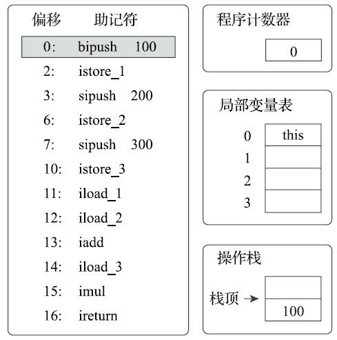

图8-5　执行偏移地址为0的指令的情况

首先，执行偏移地址为0的指令，Bipush指令的作用是将单字节的整型常量值（-128～127）推入操作数栈顶，跟随有一个参数，指明推送的常量值，这里是100。

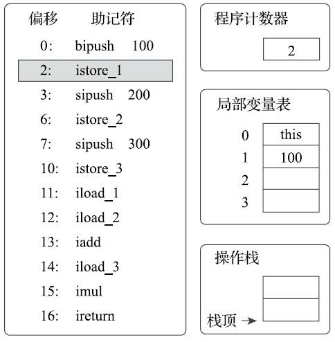

图8-6　执行偏移地址为1的指令的情况

执行偏移地址为2的指令，istore_1指令的作用是将操作数栈顶的整型值出栈并存放到第1个局部变量槽中。后续4条指令（直到偏移为11的指令为止）都是做一样的事情，也就是在对应代码中把变量a、b、c赋值为100、200、300。这4条指令的图示略过。

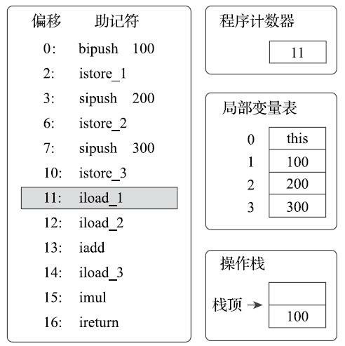

图8-7　执行偏移地址为11的指令的情况

执行偏移地址为11的指令，iload_1指令的作用是将局部变量表第1个变量槽中的整型值复制到操作数栈顶。

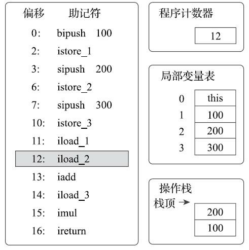

图8-8　执行偏移地址为12的指令的情况

执行偏移地址为12的指令，iload_2指令的执行过程与iload_1类似，把第2个变量槽的整型值入栈。画出这个指令的图示主要是为了显示下一条iadd指令执行前的堆栈状况。

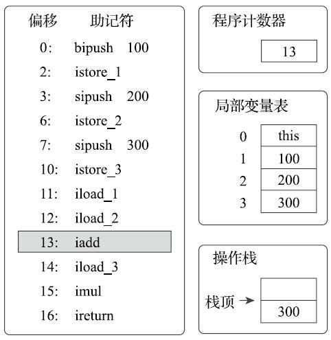

图8-9　执行偏移地址为13的指令的情况

执行偏移地址为13的指令，iadd指令的作用是将操作数栈中头两个栈顶元素出栈，做整型加法，然后把结果重新入栈。在iadd指令执行完毕后，栈中原有的100和200被出栈，它们的和300被重新入栈。

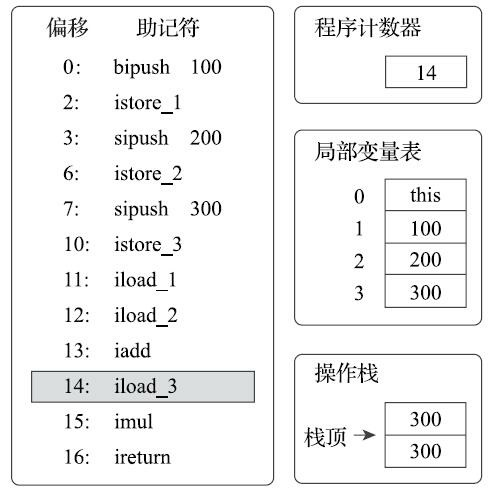

图8-10　执行偏移地址为14的指令的情况

执行偏移地址为14的指令，iload_3指令把存放在第3个局部变量槽中的300入栈到操作数栈中。这时操作数栈为两个整数300。下一条指令imul是将操作数栈中头两个栈顶元素出栈，做整型乘法，然后把结果重新入栈，与iadd完全类似，所以笔者省略图示。

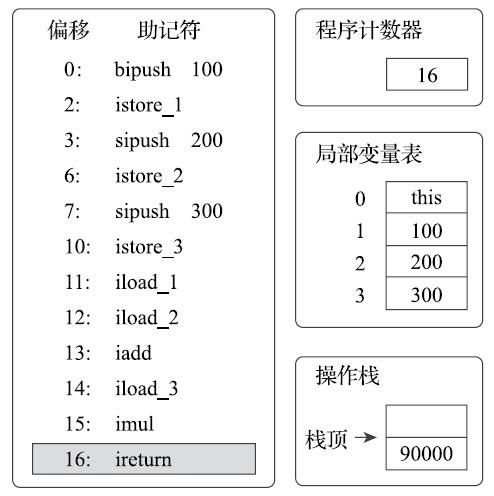

图8-11　执行偏移地址为16的指令的情况

执行偏移地址为16的指令，ireturn指令是方法返回指令之一，它将结束方法执行并将操作数栈顶的整型值返回给该方法的调用者。到此为止，这段方法执行结束。

再次强调上面的执行过程仅仅是一种概念模型，虚拟机最终会对执行过程做出一系列优化来提高性能，实际的运作过程并不会完全符合概念模型的描述。更确切地说，实际情况会和上面描述的概念模型差距非常大，差距产生的根本原因是虚拟机中解析器和即时编译器都会对输入的字节码进行优化，即使解释器中也不是按照字节码指令去逐条执行的。例如在HotSpot虚拟机中，就有很多以“fast_”开头的非标准字节码指令用于合并、替换输入的字节码以提升解释执行性能，即时编译器的优化手段则更是花样繁多[1]。

不过我们从这段程序的执行中也可以看出栈结构指令集的一般运行过程，整个运算过程的中间变量都以操作数栈的出栈、入栈为信息交换途径，符合我们在前面分析的特点。

[1] 具体可以参考第11章的相关内容。

### 8.6　本章小结

本章中，我们分析了虚拟机在执行代码时，如何找到正确的方法，如何执行方法内的字节码，以及执行代码时涉及的内存结构。在第6～8章里面，我们针对Java程序是如何存储的、如何载入（创建）的，以及如何执行的问题，把相关知识系统地介绍了一遍，第9章我们将一起看看这些理论知识在具体开发之中的典型应用。
