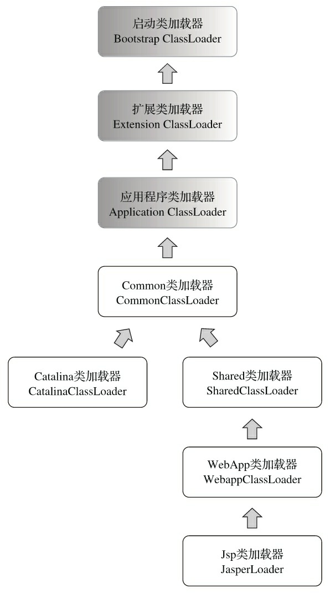
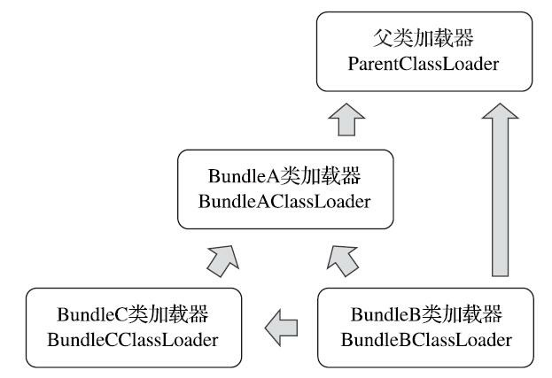
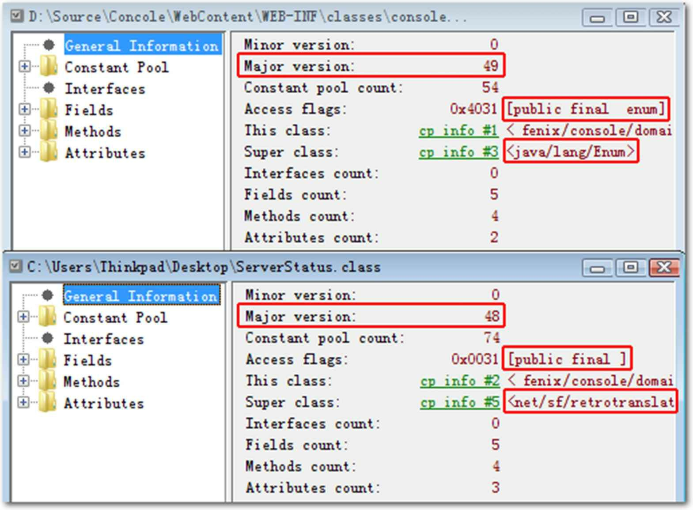
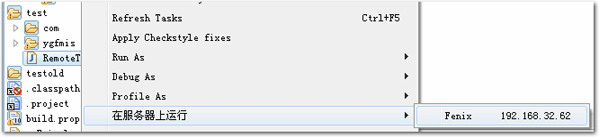

## 第9章　类加载及执行子系统的案例与实战

代码编译的结果从本地机器码转变为字节码，是存储格式发展的一小步，却是编程语言发展的一大步。

### 9.1　概述

在Class文件格式与执行引擎这部分里，用户的程序能直接参与的内容并不太多，Class文件以何种格式存储，类型何时加载、如何连接，以及虚拟机如何执行字节码指令等都是由虚拟机直接控制的行为，用户程序无法对其进行改变。能通过程序进行操作的，主要是字节码生成与类加载器这两部分的功能，但仅仅在如何处理这两点上，就已经出现了许多值得欣赏和借鉴的思路，这些思路后来成为许多常用功能和程序实现的基础。在本章中，我们将看一下前面所学的知识在实际开发之中是如何应用的。

### 9.2　案例分析

在案例分析部分，笔者准备了4个例子，关于类加载器和字节码的案例各有两个。并且这两个领域的案例中又各有一个案例是大多数Java开发人员都使用过的工具或技术，另外一个案例虽然不一定每个人都使用过，但却能特别精彩地演绎出这个领域中的技术特性。希望后面的案例能引起读者的思考，并给读者的日常工作带来灵感。

#### 9.2.1　Tomcat：正统的类加载器架构

主流的Java Web服务器，如Tomcat、Jetty、WebLogic、WebSphere或其他笔者没有列举的服务器，都实现了自己定义的类加载器，而且一般还都不止一个。因为一个功能健全的Web服务器，都要解决如下的这些问题：

- 部署在同一个服务器上的两个Web应用程序所使用的Java类库可以实现相互隔离。这是最基本的需求，两个不同的应用程序可能会依赖同一个第三方类库的不同版本，不能要求每个类库在一个服务器中只能有一份，服务器应当能够保证两个独立应用程序的类库可以互相独立使用。
- 部署在同一个服务器上的两个Web应用程序所使用的Java类库可以互相共享。这个需求与前面一点正好相反，但是也很常见，例如用户可能有10个使用Spring组织的应用程序部署在同一台服务器上，如果把10份Spring分别存放在各个应用程序的隔离目录中，将会是很大的资源浪费——这主要倒不是浪费磁盘空间的问题，而是指类库在使用时都要被加载到服务器内存，如果类库不能共享，虚拟机的方法区就会很容易出现过度膨胀的风险。
- 服务器需要尽可能地保证自身的安全不受部署的Web应用程序影响。目前，有许多主流的Java Web服务器自身也是使用Java语言来实现的。因此服务器本身也有类库依赖的问题，一般来说，基于安全考虑，服务器所使用的类库应该与应用程序的类库互相独立。
- 支持JSP应用的Web服务器，十有八九都需要支持HotSwap功能。我们知道JSP文件最终要被编译成Java的Class文件才能被虚拟机执行，但JSP文件由于其纯文本存储的特性，被运行时修改的概率远大于第三方类库或程序自己的Class文件。而且ASP、PHP和JSP这些网页应用也把修改后无须重启作为一个很大的“优势”来看待，因此“主流”的Web服务器都会支持JSP生成类的热替换，当然也有“非主流”的，如运行在生产模式（Production Mode）下的WebLogic服务器默认就不会处理JSP文件的变化。

由于存在上述问题，在部署Web应用时，单独的一个ClassPath就不能满足需求了，所以各种Web服务器都不约而同地提供了好几个有着不同含义的ClassPath路径供用户存放第三方类库，这些路径一般会以“lib”或“classes”命名。被放置到不同路径中的类库，具备不同的访问范围和服务对象，通常每一个目录都会有一个相应的自定义类加载器去加载放置在里面的Java类库。现在笔者就以Tomcat服务器[1]为例，与读者一同分析Tomcat具体是如何规划用户类库结构和类加载器的。

在Tomcat目录结构中，可以设置3组目录（/common/*、/server/*和/shared/*，但默认不一定是开放的，可能只有/lib/*目录存在）用于存放Java类库，另外还应该加上Web应用程序自身的“/WEB-INF/*”目录，一共4组。把Java类库放置在这4组目录中，每一组都有独立的含义，分别是：

- 放置在/common目录中。类库可被Tomcat和所有的Web应用程序共同使用。
- 放置在/server目录中。类库可被Tomcat使用，对所有的Web应用程序都不可见。
- 放置在/shared目录中。类库可被所有的Web应用程序共同使用，但对Tomcat自己不可见。
- 放置在/WebApp/WEB-INF目录中。类库仅仅可以被该Web应用程序使用，对Tomcat和其他Web应

用程序都不可见。

为了支持这套目录结构，并对目录里面的类库进行加载和隔离，Tomcat自定义了多个类加载器，这些类加载器按照经典的双亲委派模型来实现，其关系如图9-1所示。



图9-1　Tomcat服务器的类加载架构

灰色背景的3个类加载器是JDK（以JDK 9之前经典的三层类加载器为例）默认提供的类加载器，这3个加载器的作用在第7章中已经介绍过了。而Common类加载器、Catalina类加载器（也称为Server类加载器）、Shared类加载器和Webapp类加载器则是Tomcat自己定义的类加载器，它们分别加载/common/*、/server/*、/shared/*和/WebApp/WEB-INF/*中的Java类库。其中WebApp类加载器和JSP类加载器通常还会存在多个实例，每一个Web应用程序对应一个WebApp类加载器，每一个JSP文件对应一个JasperLoader类加载器。

从图9-1的委派关系中可以看出，Common类加载器能加载的类都可以被Catalina类加载器和Shared类加载器使用，而Catalina类加载器和Shared类加载器自己能加载的类则与对方相互隔离。WebApp类加载器可以使用Shared类加载器加载到的类，但各个WebApp类加载器实例之间相互隔离。而JasperLoader的加载范围仅仅是这个JSP文件所编译出来的那一个Class文件，它存在的目的就是为了被丢弃：当服务器检测到JSP文件被修改时，会替换掉目前的JasperLoader的实例，并通过再建立一个新的JSP类加载器来实现JSP文件的HotSwap功能。

本例中的类加载结构在Tomcat 6以前是它默认的类加载器结构，在Tomcat 6及之后的版本简化了默认的目录结构，只有指定了tomcat/conf/catalina.properties配置文件的server.loader和share.loader项后才会真正建立Catalina类加载器和Shared类加载器的实例，否则会用到这两个类加载器的地方都会用Common类加载器的实例代替，而默认的配置文件中并没有设置这两个loader项，所以Tomcat 6之后也顺理成章地把/common、/server和/shared这3个目录默认合并到一起变成1个/lib目录，这个目录里的类库相当于以前/common目录中类库的作用，是Tomcat的开发团队为了简化大多数的部署场景所做的一项易用性改进。如果默认设置不能满足需要，用户可以通过修改配置文件指定server.loader和share.loader的方式重新启用原来完整的加载器架构。

Tomcat加载器的实现清晰易懂，并且采用了官方推荐的“正统”的使用类加载器的方式。如果读者阅读完上面的案例后，毫不费力就能完全理解Tomcat设计团队这样布置加载器架构的用意，这就说明你已经大致掌握了类加载器“主流”的使用方式，那么笔者不妨再提一个问题让各位读者思考一下：前面曾经提到过一个场景，如果有10个Web应用程序都是用Spring来进行组织和管理的话，可以把Spring放到Common或Shared目录下让这些程序共享。Spring要对用户程序的类进行管理，自然要能访问到用户程序的类，而用户的程序显然是放在/WebApp/WEB-INF目录中的。那么被Common类加载器或Shared类加载器加载的Spring如何访问并不在其加载范围内的用户程序呢？如果你读懂了本书第7章的相关内容，相信回答这个问题一定会毫不费力。

[1] Tomcat是Apache基金会旗下一款开源的Java Web服务器，主页地址为：http://tomcat.apache.org。

#### 9.2.2　OSGi：灵活的类加载器架构

曾经在Java程序社区中流传着这么一个观点：“学习Java EE规范，推荐去看JBoss源码；学习类加载器的知识，就推荐去看OSGi源码。”尽管“Java EE规范”和“类加载器的知识”并不是一个对等的概念，不过，既然这个观点能在部分程序员群体中流传开来，也从侧面说明了OSGi对类加载器的运用确实有其独到之处。

OSGi[1]（Open Service Gateway Initiative）是OSGi联盟（OSGi Alliance）制订的一个基于Java语言的动态模块化规范（在JDK 9引入的JPMS是静态的模块系统），这个规范最初由IBM、爱立信等公司联合发起，在早期连Sun公司都有参与。目的是使服务提供商通过住宅网关为各种家用智能设备提供服务，后来这个规范在Java的其他技术领域也有相当不错的发展，现在已经成为Java世界中“事实上”的动态模块化标准，并且已经有了Equinox、Felix等成熟的实现。根据OSGi联盟主页上的宣传资料，OSGi现在的重点应用在智慧城市、智慧农业、工业4.0这些地方，而在传统Java程序员中最知名的应用案例可能就数Eclipse IDE了，另外，还有许多大型的软件平台和中间件服务器都基于或声明将会基于OSGi规范来实现，如IBM Jazz平台、GlassFish服务器、JBoss OSGi等。

OSGi中的每个模块（称为Bundle）与普通的Java类库区别并不太大，两者一般都以JAR格式进行封装[2]，并且内部存储的都是Java的Package和Class。但是一个Bundle可以声明它所依赖的Package（通过Import-Package描述），也可以声明它允许导出发布的Package（通过Export-Package描述）。在OSGi里面，Bundle之间的依赖关系从传统的上层模块依赖底层模块转变为平级模块之间的依赖，而且类库的可见性能得到非常精确的控制，一个模块里只有被Export过的Package才可能被外界访问，其他的Package和Class将会被隐藏起来。

以上这些静态的模块化特性原本也是OSGi的核心需求之一，不过它和后来出现的Java的模块化系统互相重叠了，所以OSGi现在着重向动态模块化系统的方向发展。在今天，通常引入OSGi的主要理由是基于OSGi架构的程序很可能（只是很可能，并不是一定会，需要考虑热插拔后的内存管理、上下文状态维护问题等复杂因素）会实现模块级的热插拔功能，当程序升级更新或调试除错时，可以只停用、重新安装然后启用程序的其中一部分，这对大型软件、企业级程序开发来说是一个非常有诱惑力的特性，譬如Eclipse中安装、卸载、更新插件而不需要重启动，就使用到了这种特性。

OSGi之所以能有上述诱人的特点，必须要归功于它灵活的类加载器架构。OSGi的Bundle类加载器之间只有规则，没有固定的委派关系。例如，某个Bundle声明了一个它依赖的Package，如果有其他Bundle声明了发布这个Package后，那么所有对这个Package的类加载动作都会委派给发布它的Bundle类加载器去完成。不涉及某个具体的Package时，各个Bundle加载器都是平级的关系，只有具体使用到某个Package和Class的时候，才会根据Package导入导出定义来构造Bundle间的委派和依赖。

另外，一个Bundle类加载器为其他Bundle提供服务时，会根据Export-Package列表严格控制访问范围。如果一个类存在于Bundle的类库中但是没有被Export，那么这个Bundle的类加载器能找到这个类，但不会提供给其他Bundle使用，而且OSGi框架也不会把其他Bundle的类加载请求分配给这个Bundle来处理。

我们可以举一个更具体些的简单例子来解释上面的规则，假设存在Bundle A、Bundle B、BundleC3个模块，并且这3个Bundle定义的依赖关系如下所示。

- Bundle A：声明发布了packageA，依赖了java.*的包；
- Bundle B：声明依赖了packageA和packageC，同时也依赖了java.*的包；
- Bundle C：声明发布了packageC，依赖了packageA。

那么，这3个Bundle之间的类加载器及父类加载器之间的关系如图9-2所示。



图9-2　OSGi的类加载器架构

由于没有涉及具体的OSGi实现，图9-2中的类加载器都没有指明具体的加载器实现，它只是一个体现了加载器之间关系的概念模型，并且只是体现了OSGi中最简单的加载器委派关系。一般来说，在OSGi里，加载一个类可能发生的查找行为和委派关系会远远比图9-2中显示的复杂，类加载时可能进行的查找规则如下：

- 以java.*开头的类，委派给父类加载器加载。
- 否则，委派列表名单内的类，委派给父类加载器加载。
- 否则，Import列表中的类，委派给Export这个类的Bundle的类加载器加载。
- 否则，查找当前Bundle的Classpath，使用自己的类加载器加载。
- 否则，查找是否在自己的Fragment Bundle中，如果是则委派给Fragment Bundle的类加载器加载。
- 否则，查找Dynamic Import列表的Bundle，委派给对应Bundle的类加载器加载。
- 否则，类查找失败。

从图9-2中还可以看出，在OSGi中，加载器之间的关系不再是双亲委派模型的树形结构，而是已经进一步发展成一种更为复杂的、运行时才能确定的网状结构。这种网状的类加载器架构在带来更优秀的灵活性的同时，也可能会产生许多新的隐患。笔者曾经参与过将一个非OSGi的大型系统向Equinox OSGi平台迁移的项目，由于项目规模和历史原因，代码模块之间的依赖关系错综复杂，勉强分离出各个模块的Bundle后，发现在高并发环境下经常出现死锁。我们很容易就找到了死锁的原因：如果出现了Bundle A依赖Bundle B的Package B，而Bundle B又依赖了Bundle A的Package A，这两个Bundle进行类加载时就有很高的概率发生死锁。具体情况是当Bundle A加载Package B的类时，首先需要锁定当前类加载器的实例对象（java.lang.ClassLoader.loadClass()是一个同步方法），然后把请求委派给Bundle B的加载器处理，但如果这时Bundle B也正好想加载Package A的类，它会先锁定自己的加载器再去请求Bundle A的加载器处理，这样两个加载器都在等待对方处理自己的请求，而对方处理完之前自己又一直处于同步锁定的状态，因此它们就互相死锁，永远无法完成加载请求了。Equinox的Bug List中有不少关于这类问题的Bug[3]，也提供了一个以牺牲性能为代价的解决方案——用户可以启用osgi.classloader.singleThreadLoads参数来按单线程串行化的方式强制进行类加载动作。在JDK 7时才终于出现了JDK层面的解决方案，类加载器架构进行了一次专门的升级，在ClassLoader中增加了registerAsParallelCapable方法对可并行的类加载进行注册声明，把锁的级别从ClassLoader对象本身，降低为要加载的类名这个级别，目的是从底层避免以上这类死锁出现的可能。

总体来说，OSGi描绘了一个很美好的模块化开发的目标，而且定义了实现这个目标所需的各种服务，同时也有成熟框架对其提供实现支持。对于单个虚拟机下的应用，从开发初期就建立在OSGi上是一个很不错的选择，这样便于约束依赖。但并非所有的应用都适合采用OSGi作为基础架构，OSGi在提供强大功能的同时，也引入了额外而且非常高的复杂度，带来了额外的风险。

[1] 官方站点：http://www.osgi.org/Main/HomePage。[2] OSGi R7开始支持JDK 9的JPMS，但只是兼容意义上的支持，并未将两者重合的特性互相融合。譬如在R7中Bundle仍然是一个标准的JAR包，未封装成Module（即以Unnamed Module的形式存在）。[3] Bug-121737：https://bugs.eclipse.org/bugs/show_bug.cgi?id=121737。

#### 9.2.3　字节码生成技术与动态代理的实现

“字节码生成”并不是什么高深的技术，读者在看到“字节码生成”这个标题时也先不必去想诸如Javassist、CGLib、ASM之类的字节码类库，因为JDK里面的Javac命令就是字节码生成技术的“老祖宗”，并且Javac也是一个由Java语言写成的程序，它的代码存放在OpenJDK的jdk.compiler\share\classes\com\sun\tools\javac目录中[1]。要深入从Java源码到字节码编译过程，阅读Javac的源码是个很好的途径，不过Javac对于我们这个例子来说太过庞大了。在Java世界里面除了Javac和字节码类库外，使用到字节码生成的例子比比皆是，如Web服务器中的JSP编译器，编译时织入的AOP框架，还有很常用的动态代理技术，甚至在使用反射的时候虚拟机都有可能会在运行时生成字节码来提高执行速度。我们选择其中相对简单的动态代理技术来讲解字节码生成技术是如何影响程序运作的。

相信许多Java开发人员都使用过动态代理，即使没有直接使用过java.lang.reflect.Proxy或实现过java.lang.reflect.InvocationHandler接口，应该也用过Spring来做过Bean的组织管理。如果使用过Spring，那大多数情况应该已经不知不觉地用到动态代理了，因为如果Bean是面向接口编程，那么在Spring内部都是通过动态代理的方式来对Bean进行增强的。动态代理中所说的“动态”，是针对使用Java代码实际编写了代理类的“静态”代理而言的，它的优势不在于省去了编写代理类那一点编码工作量，而是实现了可以在原始类和接口还未知的时候，就确定代理类的代理行为，当代理类与原始类脱离直接联系后，就可以很灵活地重用于不同的应用场景之中。

代码清单9-1演示了一个最简单的动态代理的用法，原始的代码逻辑是打印一句“hello world”，代理类的逻辑是在原始类方法执行前打印一句“welcome”。我们先看一下代码，然后再分析JDK是如何做到的。

代码清单9-1　动态代理的简单示例

```java
public class DynamicProxyTest {
    interface IHello {
        void sayHello();
    }
    static class Hello implements IHello {
        @Override
        public void sayHello() {
            System.out.println("hello world");
        }
    }
    static class DynamicProxy implements InvocationHandler {
        Object originalObj;
        Object bind(Object originalObj) {
            this.originalObj = originalObj;
            return Proxy.newProxyInstance(originalObj.getClass().getClassLoader(), originalObj.getClass().getInterfaces(), this);
        }
        @Override
        public Object invoke(Object proxy, Method method, Object[] args) throws Throwable {
            System.out.println("welcome");
            return method.invoke(originalObj, args);
        }
    }
    public static void main(String[] args) {
        IHello hello = (IHello) new DynamicProxy().bind(new Hello());
        hello.sayHello();
    }
}
```

运行结果如下：

```text
welcome
hello world
```

在上述代码里，唯一的“黑匣子”就是Proxy::newProxyInstance()方法，除此之外再没有任何特殊之处。这个方法返回一个实现了IHello的接口，并且代理了new Hello()实例行为的对象。跟踪这个方法的源码，可以看到程序进行过验证、优化、缓存、同步、生成字节码、显式类加载等操作，前面的步骤并不是我们关注的重点，这里只分析它最后调用sun.misc.ProxyGenerator::generateProxyClass()方法来完成生成字节码的动作，这个方法会在运行时产生一个描述代理类的字节码byte[]数组。如果想看一看这个在运行时产生的代理类中写了些什么，可以在main()方法中加入下面这句：

```text
System.getProperties().put("sun.misc.ProxyGenerator.saveGeneratedFiles", "true");
```

加入这句代码后再次运行程序，磁盘中将会产生一个名为“$Proxy0.class”的代理类Class文件，反编译后可以看见如代码清单9-2所示的内容：

代码清单9-2　反编译的动态代理类的代码

```java
package org.fenixsoft.bytecode;
import java.lang.reflect.InvocationHandler;
import java.lang.reflect.Method;
import java.lang.reflect.Proxy;
import java.lang.reflect.UndeclaredThrowableException;
public final class $Proxy0 extends Proxy
    implements DynamicProxyTest.IHello
{
    private static Method m3;
    private static Method m1;
    private static Method m0;
    private static Method m2;
    public $Proxy0(InvocationHandler paramInvocationHandler)
        throws
    {
        super(paramInvocationHandler);
    }
    public final void sayHello()
        throws
    {
        try
        {
            this.h.invoke(this, m3, null);
            return;
        }
        catch (RuntimeException localRuntimeException)
        {
            throw localRuntimeException;
        }
        catch (Throwable localThrowable)
        {
            throw new UndeclaredThrowableException(localThrowable);
        }
    }
    // 此处由于版面原因，省略equals()、hashCode()、toString()3个方法的代码
    // 这3个方法的内容与sayHello()非常相似。
    static
    {
        try
        {
            m3 = Class.forName("org.fenixsoft.bytecode.DynamicProxyTest$IHello").getMethod("sayHello", new Class[0]);
            m1 = Class.forName("java.lang.Object").getMethod("equals", new Class[] { Class.forName("java.lang.Object") });
            m0 = Class.forName("java.lang.Object").getMethod("hashCode", new Class[0]);
            m2 = Class.forName("java.lang.Object").getMethod("toString", new Class[0]);
            return;
        }
        catch (NoSuchMethodException localNoSuchMethodException)
        {
            throw new NoSuchMethodError(localNoSuchMethodException.getMessage());
        }
        catch (ClassNotFoundException localClassNotFoundException)
        {
            throw new NoClassDefFoundError(localClassNotFoundException.getMessage());
        }
    }
}
```

这个代理类的实现代码也很简单，它为传入接口中的每一个方法，以及从java.lang.Object中继承来的equals()、hashCode()、toString()方法都生成了对应的实现，并且统一调用了InvocationHandler对象的invoke()方法（代码中的“this.h”就是父类Proxy中保存的InvocationHandler实例变量）来实现这些方法的内容，各个方法的区别不过是传入的参数和Method对象有所不同而已，所以无论调用动态代理的哪一个方法，实际上都是在执行InvocationHandler::invoke()中的代理逻辑。

这个例子中并没有讲到generateProxyClass()方法具体是如何产生代理类“$Proxy0.class”的字节码的，大致的生成过程其实就是根据Class文件的格式规范去拼装字节码，但是在实际开发中，以字节为单位直接拼装出字节码的应用场合很少见，这种生成方式也只能产生一些高度模板化的代码。对于用户的程序代码来说，如果有要大量操作字节码的需求，还是使用封装好的字节码类库比较合适。如果读者对动态代理的字节码拼装过程确实很感兴趣，可以在OpenJDK的java.base\share\classes\java\lang\reflect目录下找到sun.misc.ProxyGenerator的源码。

[1] 如何获取OpenJDK源码，请参见本书第1章的相关内容。

#### 9.2.4　Backport工具：Java的时光机器

一般来说，以“做项目”为主的软件公司比较容易更新技术，在下一个项目中换一个技术框架、升级到最时髦的JDK版本，甚至把Java换成C#、Golang来开发都是有可能的。但是当公司发展壮大，技术有所积累，逐渐成为以“做产品”为主的软件公司后，自主选择技术的权利就会逐渐丧失，因为之前积累的代码和技术都是用真金白银砸出来的，一个稳健的团队也不会随意地改变底层的技术。然而在飞速发展的程序设计领域，新技术总是日新月异层出不穷，偏偏这些新技术又如鲜花之于蜜蜂一样，对程序员们散发着天然的吸引力。

在Java世界里，每一次JDK大版本的发布，都会伴随着规模不等或大或小的技术革新，而对Java程序编写习惯改变最大的，肯定是那些对Java语法做出重大改变的版本，譬如JDK 5时加入的自动装箱、泛型、动态注解、枚举、变长参数、遍历循环（foreach循环）；譬如JDK 8时加入的Lambda表达式、Stream API、接口默认方法等。事实上在没有这些语法特性的年代，Java程序也照样能写，但是现在回头看来，上述每一种语法的改进几乎都是“必不可少”的，如同用惯了32寸液晶、4K分辨率显示器的程序员，就很难再在19寸显示器、1080P分辨率的显示器上编写代码了。但假如公司“不幸”因为要保护现有投资、维持程序结构稳定等，必须使用JDK 5或者JDK 8以前的版本呢？幸好，我们没有办法把19寸显示器变成32寸的，但却可以跨越JDK版本之间的沟壑，把高版本JDK中编写的代码放到低版本JDK环境中去部署使用。为了解决这个问题，一种名为“Java逆向移植”的工具（Java Backporting Tools）应运而生，Retrotranslator[1]和Retrolambda是这类工具中的杰出代表。

Retrotranslator的作用是将JDK 5编译出来的Class文件转变为可以在JDK 1.4或1.3上部署的版本，它能很好地支持自动装箱、泛型、动态注解、枚举、变长参数、遍历循环、静态导入这些语法特性，甚至还可以支持JDK 5中新增的集合改进、并发包及对泛型、注解等的反射操作。Retrolambda[2]的作用与Retrotranslator是类似的，目标是将JDK 8的Lambda表达式和try-resources语法转变为可以在JDK 5、JDK 6、JDK 7中使用的形式，同时也对接口默认方法提供了有限度的支持。

了解了Retrotranslator和Retrolambda这种逆向移植工具的作用以后，相信读者更关心的是它是怎样做到的？要想知道Backporting工具如何在旧版本JDK中模拟新版本JDK的功能，首先要搞清楚JDK升级中会提供哪些新的功能。JDK的每次升级新增的功能大致可以分为以下五类：

1. 对Java类库API的代码增强。譬如JDK 1.2时代引入的java.util.Collections等一系列集合类，在JDK 5时代引入的java.util.concurrent并发包、在JDK 7时引入的java.lang.invoke包，等等。
2. 在前端编译器层面做的改进。这种改进被称作语法糖，如自动装箱拆箱，实际上就是Javac编译器在程序中使用到包装对象的地方自动插入了很多Integer.valueOf()、Float.valueOf()之类的代码；变长参数在编译之后就被自动转化成了一个数组来完成参数传递；泛型的信息则在编译阶段就已经被擦

除掉了（但是在元数据中还保留着），相应的地方被编译器自动插入了类型转换代码[3]。

3. 需要在字节码中进行支持的改动。如JDK 7里面新加入的语法特性——动态语言支持，就需要在虚拟机中新增一条invokedynamic字节码指令来实现相关的调用功能。不过字节码指令集一直处于相对稳定的状态，这种要在字节码层面直接进行的改动是比较少见的。
4. 需要在JDK整体结构层面进行支持的改进，典型的如JDK 9时引入的Java模块化系统，它就涉及了JDK结构、Java语法、类加载和连接过程、Java虚拟机等多个层面。
5. 集中在虚拟机内部的改进。如JDK 5中实现的JSR-133[4]规范重新定义的Java内存模型（Java Memory Model，JMM），以及在JDK 7、JDK 11、JDK 12中新增的G1、ZGC和Shenandoah收集器之类的改动，这种改动对于程序员编写代码基本是透明的，只会在程序运行时产生影响。

上述的5类新功能中，逆向移植工具能比较完美地模拟了前两类，从第3类开始就逐步深入地涉及了直接在虚拟机内部实现的改进了，这些功能一般要么是逆向移植工具完全无能为力，要么是不能完整地或者在比较良好的运行效率上完成全部模拟。想想这也挺合理的，如果在语法糖和类库层面可以完美解决的问题，Java虚拟机设计团队也没有必要舍近求远地改动处于JDK底层的虚拟机嘛。

在能够较好模拟的前两类功能中，第一类模拟相对更容易实现一些，如JDK 5引入的java.util.concurrent包，实际是由多线程编程的大师Doug Lea开发的一套并发包，在JDK 5出现之前就已经存在（那时候名字叫作dl.util.concurrent，引入JDK时由作者和JDK开发团队共同进行了一些改进），所以要在旧的JDK中支持这部分功能，以独立类库的方式便可实现。Retrotranslator中就附带了一个名叫“backport-util-concurrent.jar”的类库（由另一个名为“Backport to JSR 166”的项目所提供）来代替JDK 5的并发包。

至于第二类JDK在编译阶段进行处理的那些改进，Retrotranslator则是使用ASM框架直接对字节码进行处理。由于组成Class文件的字节码指令数量并没有改变，所以无论是JDK 1.3、JDK 1.4还是JDK 5，能用字节码表达的语义范围应该是一致的。当然，肯定不会是简单地把Class的文件版本号从49.0改回48.0就能解决问题了，虽然字节码指令的数量没有变化，但是元数据信息和一些语法支持的内容还是要做相应的修改。

以枚举为例，尽管在JDK 5中增加了enum关键字，但是Class文件常量池的CONSTANT_Class_info类型常量并没有发生任何语义变化，仍然是代表一个类或接口的符号引用，没有加入枚举，也没有增加过“CONSTANT_Enum_info”之类的“枚举符号引用”常量。所以使用enum关键字定义常量，尽管从Java语法上看起来与使用class关键字定义类、使用interface关键字定义接口是同一层次的，但实际上这是由Javac编译器做出来的假象，从字节码的角度来看，枚举仅仅是一个继承于java.lang.Enum、自动生成了values()和valueOf()方法的普通Java类而已。

Retrotranslator对枚举所做的主要处理就是把枚举类的父类从“java.lang.Enum”替换为它运行时类库中包含的“net.sf.retrotranslator.runtime.java.lang.Enum_”，然后再在类和字段的访问标志中抹去ACC_ENUM标志位。当然，这只是处理的总体思路，具体的实现要比上面说的复杂得多。可以想象既然两个父类实现都不一样，values()和valueOf()的方法自然需要重写，常量池需要引入大量新的来自父类的符号引用，这些都是实现细节。图9-3是一个使用JDK 5编译的枚举类与被Retrotranslator转换处理后的字节码的对比图。



图9-3　Retrotranslator处理前后的枚举类字节码对比

用Retrolambda模拟JDK 8的Lambda表达式属于涉及字节码改动的第三类情况，Java为支持Lambda会用到新的invokedynamic字节码指令，但幸好这并不是必须的，只是基于效率的考量。在JDK 8之前，Lambda表达式就已经被其他运行在Java虚拟机的编程语言（如Scala）广泛使用了，那时候是怎么生成字节码的现在照着做就是，不使用invokedynamic，除了牺牲一点效率外，可行性方面并没有太大的障碍。

Retrolambda的Backport过程实质上就是生成一组匿名内部类来代替Lambda，里面会做一些优化措施，譬如采用单例来保证无状态的Lambda表达式不会重复创建匿名类的对象。有一些Java IDE工具，如IntelliJ IDEA和Eclipse里会包含将此过程反过来使用的功能特性，在低版本Java里把匿名内部类显示成Lambda语法的样子，实际存在磁盘上的源码还是匿名内部类形式的，只是在IDE里可以把它显示为Lambda表达式的语法，让人阅读起来比较简洁而已。

[1] 官方站点：http://retrotranslator.sf.net。[2] 官方网站：https://github.com/luontola/retrolambda。[3] 如果想了解编译器在这个阶段所做的各种动作的详细信息，可以参考10.3节的内容。[4] JSR-133：Java Memory Model and Thread Specification Revision（Java内存模型和线程规范修订）。

### 9.3　实战：自己动手实现远程执行功能

不知道读者在做程序维护的时候是否遇到过这类情形：排查问题的过程中，想查看内存中的一些参数值，却苦于没有方法把这些值输出到界面或日志中。又或者定位到某个缓存数据有问题，由于缺少缓存的统一管理界面，不得不重启服务才能清理掉这个缓存。类似的需求有一个共同的特点，那就是只要在服务中执行一小段程序代码，就可以定位或排除问题，但就是偏偏找不到可以让服务器执行临时代码的途径，让人恨不得在服务器上装个后门。这是项目运维中的常见问题，通常解决类问题有以下几种途径：

1. 可以使用BTrace[1]这类JVMTI工具去动态修改程序中某一部分的运行代码，这部分在第4章有

简要的介绍，类似的JVMTI工具还有阿里巴巴的Arthas[2]等。

2. 使用JDK 6之后提供了Compiler API，可以动态地编译Java程序，这样虽然达不到动态语言的灵活度，但让服务器执行临时代码的需求是可以得到解决的。
3. 也可以通过“曲线救国”的方式来做到，譬如写一个JSP文件上传到服务器，然后在浏览器中运

行它，或者在服务端程序中加入一个BeanShell Script、JavaScript等的执行引擎（如Mozilla Rhino[3]）去执行动态脚本。

4. 在应用程序中内置动态执行的功能。

在本章的实战部分，我们将使用前面学到的关于类加载及虚拟机执行子系统的知识去完成在服务端执行临时代码的功能。

[1] 网站：https://github.com/btraceio/btrace。[2] 网站：https://github.com/alibaba/arthas。[3] 网站：http://www.mozilla.org/rhino/，Rhino已被收编入JDK 6中。

#### 9.3.1　目标

首先，在实现“在服务端执行临时代码”这个需求之前，先来明确一下本次实战的具体目标，我们希望最终的产品是这样的：

- 不依赖某个JDK版本才加入的特性（包括JVMTI），能在目前还被普遍使用的JDK中部署，只要是使用JDK 1.4以上的JDK都可以运行。
- 不改变原有服务端程序的部署，不依赖任何第三方类库。
- 不侵入原有程序，即无须改动原程序的任何代码。也不会对原有程序的运行带来任何影响。
- 考虑到BeanShell Script或JavaScript等脚本与Java对象交互起来不太方便，“临时代码”应该直接支持Java语言。
- “临时代码”应当具备足够的自由度，不需要依赖特定的类或实现特定的接口。这里写的是“不需要”而不是“不可以”，当“临时代码”需要引用其他类库时也没有限制，只要服务端程序能使用的类型和接口，临时代码都应当能直接引用。
- “临时代码”的执行结果能返回到客户端，执行结果可以包括程序中输出的信息及抛出的异常等。

看完上面列出的目标，读者觉得完成这个需求需要做多少工作量呢？也许答案比大多数人所想的都要简单一些：5个类，250行代码（含注释），大约一个半小时左右的开发时间就可以了，现在就开始编写程序吧！

#### 9.3.2　思路

在程序实现的过程中，我们需要解决以下3个问题：

- 如何编译提交到服务器的Java代码？
- 如何执行编译之后的Java代码？
- 如何收集Java代码的执行结果？

对于第一个问题，我们有两种方案可以选择。一种在服务器上编译，在JDK 6以后可以使用Compiler API，在JDK 6以前可以使用tools.jar包（在JAVA_HOME/lib目录下）中的com.sun.tools.Javac.Main类来编译Java文件，它们其实和直接使用Javac命令来编译是一样的。这种思路的缺点是引入了额外的依赖，而且把程序绑死在特定的JDK上了，要部署到其他公司的JDK中还得把tools.jar带上（虽然JRockit和J9虚拟机也有这个JAR包，但它总不是标准所规定必须存在的）。另外一种思路是直接在客户端编译好，把字节码而不是Java代码传到服务端，这听起来好像有点投机取巧，一般来说确实不应该假定客户端一定具有编译代码的能力，也不能假定客户端就有编译出产品所需的依赖项。但是既然程序员会写Java代码去给服务端排查问题，那么很难想象他的机器上会连编译Java程序的环境都没有。

对于第二个问题：要执行编译后的Java代码，让类加载器加载这个类生成一个Class对象，然后反射调用一下某个方法就可以了（因为不实现任何接口，我们可以借用一下Java中约定俗成的“main()”方法）。但我们还应该考虑得更周全些：一段程序往往不是编写、运行一次就能达到效果，同一个类可能要被反复地修改、提交、执行。另外，提交上去的类要能访问到服务端的其他类库才行。还有就是既然提交的是临时代码，那提交的Java类在执行完后就应当能被卸载和回收掉。

最后一个问题，我们想把程序往标准输出（System.out）和标准错误输出（System.err）中打印的信息收集起来。但标准输出设备是整个虚拟机进程全局共享的资源，如果使用System.setOut()/System.setErr()方法把输出流重定向到自己定义的PrintStream对象上固然可以收集到输出信息，但也会对原有程序产生影响：会把其他线程向标准输出中打印的信息也收集了。虽然这些并不是不能解决的问题，不过为了达到完全不影响原程序的目的，我们可以采用另外一种办法：直接在执行的类中把对System.out的符号引用替换为我们准备的PrintStream的符号引用，依赖前面学习到的知识，做到这一点并不困难。

#### 9.3.3　实现

在程序实现部分，我们主要看看代码和里面的注释。首先看看实现过程中需要用到的4个支持类。第一个类用于实现“同一个类的代码可以被多次加载”这个需求，即用于解决9.2节列举的第二个问题的HotSwapClassLoader，具体程序如代码清单9-3所示。

HotSwapClassLoader所做的事情仅仅是公开父类（即java.lang.ClassLoader）中的protected方法defineClass()，我们将会使用这个方法把提交执行的Java类的byte[]数组转变为Class对象。HotSwapClassLoader中并没有重写loadClass()或findClass()方法，因此如果不算外部手工调用loadByte()方法的话，这个类加载器的类查找范围与它的父类加载器是完全一致的，在被虚拟机调用时，它会按照双亲委派模型交给父类加载。构造函数中指定为加载HotSwapClassLoader类的类加载器作为父类加载器，这一步是实现提交的执行代码可以访问服务端引用类库的关键，下面我们来看看代码清单9-3。

代码清单9-3　HotSwapClassLoader的实现

```java
/**
 * 为了多次载入执行类而加入的加载器
 * 把defineClass方法开放出来，只有外部显式调用的时候才会使用到loadByte方法
 * 由虚拟机调用时，仍然按照原有的双亲委派规则使用loadClass方法进行类加载
 *
 * @author zzm
 */
public class HotSwapClassLoader extends ClassLoader {
    public HotSwapClassLoader() {
        super(HotSwapClassLoader.class.getClassLoader());
    }
    public Class loadByte(byte[] classByte) {
        return defineClass(null, classByte, 0, classByte.length);
    }
}
```

第二个类是实现将java.lang.System替换为我们自己定义的HackSystem类的过程，它直接修改符合Class文件格式的byte[]数组中的常量池部分，将常量池中指定内容的CONSTANT_Utf8_info常量替换为新的字符串，具体代码如下面的代码清单9-4所示。ClassModifier中涉及对byte[]数组操作的部分，主要是将byte[]与int和String互相转换，以及把对byte[]数据的替换操作封装在代码清单9-5所示的ByteUtils中。

经过ClassModifier处理后的byte[]数组才会传给HotSwapClassLoader.loadByte()方法进行类加载，byte[]数组在这里替换符号引用之后，与客户端直接在Java代码中引用HackSystem类再编译生成的Class是完全一样的。这样的实现既避免了客户端编写临时执行代码时要依赖特定的类（不然无法引入HackSystem），又避免了服务端修改标准输出后影响到其他程序的输出。下面我们来看看代码清单9-4和代码清单9-5。

代码清单9-4　ClassModifier的实现

```java
/**
 * 修改Class文件，暂时只提供修改常量池常量的功能
 * @author zzm
 */
public class ClassModifier {
    /**
     * Class文件中常量池的起始偏移
     */
    private static final int CONSTANT_POOL_COUNT_INDEX = 8;
    /**
     * CONSTANT_Utf8_info常量的tag标志
     */
    private static final int CONSTANT_Utf8_info = 1;
    /**
     * 常量池中11种常量所占的长度，CONSTANT_Utf8_info型常量除外，因为它不是定长的
     */
    private static final int[] CONSTANT_ITEM_LENGTH = { -1, -1, -1, 5, 5, 9, 9, 3, 3, 5, 5, 5, 5 };
    private static final int u1 = 1;
    private static final int u2 = 2;
    private byte[] classByte;
    public ClassModifier(byte[] classByte) {
        this.classByte = classByte;
    }
    /**
     * 修改常量池中CONSTANT_Utf8_info常量的内容
     * @param oldStr 修改前的字符串
     * @param newStr 修改后的字符串
     * @return 修改结果
     */
    public byte[] modifyUTF8Constant(String oldStr, String newStr) {
        int cpc = getConstantPoolCount();
        int offset = CONSTANT_POOL_COUNT_INDEX + u2;
        for (int i = 0; i < cpc; i++) {
            int tag = ByteUtils.bytes2Int(classByte, offset, u1);
            if (tag == CONSTANT_Utf8_info) {
                int len = ByteUtils.bytes2Int(classByte, offset + u1, u2);
                offset += (u1 + u2);
                String str = ByteUtils.bytes2String(classByte, offset, len);
                if (str.equalsIgnoreCase(oldStr)) {
                    byte[] strBytes = ByteUtils.string2Bytes(newStr);
                    byte[] strLen = ByteUtils.int2Bytes(newStr.length(), u2);
                    classByte = ByteUtils.bytesReplace(classByte, offset - u2, u2, strLen);
                    classByte = ByteUtils.bytesReplace(classByte, offset, len, strBytes);
                    return classByte;
                } else {
                    offset += len;
                }
            } else {
                offset += CONSTANT_ITEM_LENGTH[tag];
            }
        }
        return classByte;
    }
    /**
     * 获取常量池中常量的数量
     * @return 常量池数量
     */
    public int getConstantPoolCount() {
        return ByteUtils.bytes2Int(classByte, CONSTANT_POOL_COUNT_INDEX, u2);
    }
}
```

代码清单9-5　ByteUtils的实现

```java
/**
 * Bytes数组处理工具
 * @author
 */
public class ByteUtils {
    public static int bytes2Int(byte[] b, int start, int len) {
        int sum = 0;
        int end = start + len;
        for (int i = start; i < end; i++) {
            int n = ((int) b[i]) & 0xff;
            n <<= (--len) * 8;
            sum = n + sum;
        }
        return sum;
    }
    public static byte[] int2Bytes(int value, int len) {
        byte[] b = new byte[len];
        for (int i = 0; i < len; i++) {
            b[len - i - 1] = (byte) ((value >> 8 * i) & 0xff);
        }
        return b;
    }
    public static String bytes2String(byte[] b, int start, int len) {
        return new String(b, start, len);
    }
    public static byte[] string2Bytes(String str) {
        return str.getBytes();
    }
    public static byte[] bytesReplace(byte[] originalBytes, int offset, int len, byte[] replaceBytes) {
        byte[] newBytes = new byte[originalBytes.length + (replaceBytes.length - len)];
        System.arraycopy(originalBytes, 0, newBytes, 0, offset);
        System.arraycopy(replaceBytes, 0, newBytes, offset, replaceBytes.length);
        System.arraycopy(originalBytes, offset + len, newBytes, offset + replaceBytes.length, originalBytes.length - offset - len);
        return newBytes;
    }
}
```

最后一个类就是前面提到过的用来代替java.lang.System的HackSystem，这个类中的方法看起来不少，但其实除了把out和err两个静态变量改成使用ByteArrayOutputStream作为打印目标的同一个PrintStream对象，以及增加了读取、清理ByteArrayOutputStream中内容的getBufferString()和clearBuffer()方法外，就再没有其他新鲜的内容了。其余的方法全部都来自于System类的public方法，方法名字、参数、返回值都完全一样，并且实现也是直接转调了System类的对应方法而已。保留这些方法的目的，是为了在Sytem被替换成HackSystem之后，保证执行代码中调用的System的其余方法仍然可以继续使用，HackSystem的实现如代码清单9-6所示。

代码清单9-6　HackSystem的实现

```java
/**
 * 为Javaclass劫持java.lang.System提供支持
 * 除了out和err外，其余的都直接转发给System处理
 *
 * @author zzm
 */
public class HackSystem {
    public final static InputStream in = System.in;
    private static ByteArrayOutputStream buffer = new ByteArrayOutputStream();
    public final static PrintStream out = new PrintStream(buffer);
    public final static PrintStream err = out;
    public static String getBufferString() {
        return buffer.toString();
    }
    public static void clearBuffer() {
        buffer.reset();
    }
    public static void setSecurityManager(final SecurityManager s) {
        System.setSecurityManager(s);
    }
    public static SecurityManager getSecurityManager() {
        return System.getSecurityManager();
    }
    public static long currentTimeMillis() {
        return System.currentTimeMillis();
    }
    public static void arraycopy(Object src, int srcPos, Object dest, int destPos, int length) {
        System.arraycopy(src, srcPos, dest, destPos, length);
    }
    public static int identityHashCode(Object x) {
        return System.identityHashCode(x);
    }
    // 下面所有的方法都与java.lang.System的名称一样
    // 实现都是字节转调System的对应方法
    // 因版面原因，省略了其他方法
}
```

4个支持类已经讲解完毕，我们来看看最后一个类JavaclassExecuter，它是提供给外部调用的入口，调用前面几个支持类组装逻辑，完成类加载工作。JavaclassExecuter只有一个execute()方法，用输入的符合Class文件格式的byte[]数组替换掉java.lang.System的符号引用后，使用HotSwapClassLoader加载生成一个Class对象，由于每次执行execute()方法都会生成一个新的类加载器实例，因此同一个类可以实现重复加载。然后反射调用这个Class对象的main()方法，如果期间出现任何异常，将异常信息打印到HackSystem.out中，最后把缓冲区中的信息作为方法的结果来返回。JavaclassExecuter的实现代码如代码清单9-7所示。

代码清单9-7　JavaclassExecuter的实现

```java
/**
 * Javaclass执行工具
 *
 * @author zzm
 */
public class JavaclassExecuter {
    /**
     * 执行外部传过来的代表一个Java类的Byte数组<br>
     * 将输入类的byte数组中代表java.lang.System的CONSTANT_Utf8_info常量修改为劫持后的HackSystem类
     * 执行方法为该类的static main(String[] args)方法，输出结果为该类向System.out/err输出的信息
     * @param classByte 代表一个Java类的Byte数组
     * @return 执行结果
     */
    public static String execute(byte[] classByte) {
        HackSystem.clearBuffer();
        ClassModifier cm = new ClassModifier(classByte);
        byte[] modiBytes = cm.modifyUTF8Constant("java/lang/System", "org/fenixsoft/classloading/execute/HackSystem");
        HotSwapClassLoader loader = new HotSwapClassLoader();
        Class clazz = loader.loadByte(modiBytes);
        try {
            Method method = clazz.getMethod("main", new Class[] { String[].class });
            method.invoke(null, new String[] { null });
        } catch (Throwable e) {
            e.printStackTrace(HackSystem.out);
        }
        return HackSystem.getBufferString();
    }
}
```

#### 9.3.4　验证

远程执行功能的编码到此就完成了，接下来就要检验一下我们的劳动成果。只是测试的话，任意写一个Java类，内容无所谓，只要向System.out输出信息即可，取名为TestClass，放到服务器C盘的根目录中。然后建立一个JSP文件写上如代码清单9-8所示的内容，就可以在浏览器中看到这个类的运行结果了。

代码清单9-8　测试JSP

```java
<%@ page import="java.lang.*" %>
<%@ page import="java.io.*" %>
<%@ page import="org.fenixsoft.classloading.execute.*" %>
<%
    InputStream is = new FileInputStream("c:/TestClass.class");
    byte[] b = new byte[is.available()];
    is.read(b);
    is.close();
    out.println("<textarea style='width:1000;height=800'>");
    out.println(JavaclassExecuter.execute(b));
    out.println("</textarea>");
%>
```

当然，上面的做法只是用于测试和演示，实际使用这个JavaExecuter执行器的时候，如果还要手工复制一个Class文件到服务器上就完全失去意义了，总得给它配一个Class文件上传功能，这是一件很容易做到的事情。

在工作中，笔者进一步给这个执行器写了一个“外壳”，这是一个Eclipse插件，可以把Java文件编译后传输到服务器中，然后把执行器的返回结果输出到Eclipse的Console窗口里，这样就可以在有灵感的时候随时写几行调试代码，放到测试环境的服务器上立即运行了。实现虽然简单，但效果很不错，对调试问题非常有用，如图9-4所示。



图9-4　JavaclassExecuter的使用

### 9.4　本章小结

## 第6章至第9章介绍了Class文件格式、类加载及虚拟机执行引擎这几部分内容，这些内容是虚拟机中必不可少的组成部分，了解了虚拟机如何执行程序，才能更好地理解怎样才能写出优秀的代码。

关于虚拟机执行子系统的介绍就到此为止，通过这4章的讲解，我们描绘了一个虚拟机应该是怎样运行Class文件的概念模型的，对于具体到某个虚拟机的实现，为了使实现简单清晰，或者为了更快的运行速度，在虚拟机内部的运作与概念模型可能会有非常大的差异，但从最终的执行结果来看应该是一致的。从第10章开始，我们将把目光从概念模型转到具体实现，去探索虚拟机在语法上和运行性能上，是如何对程序编写做出各种优化的。
