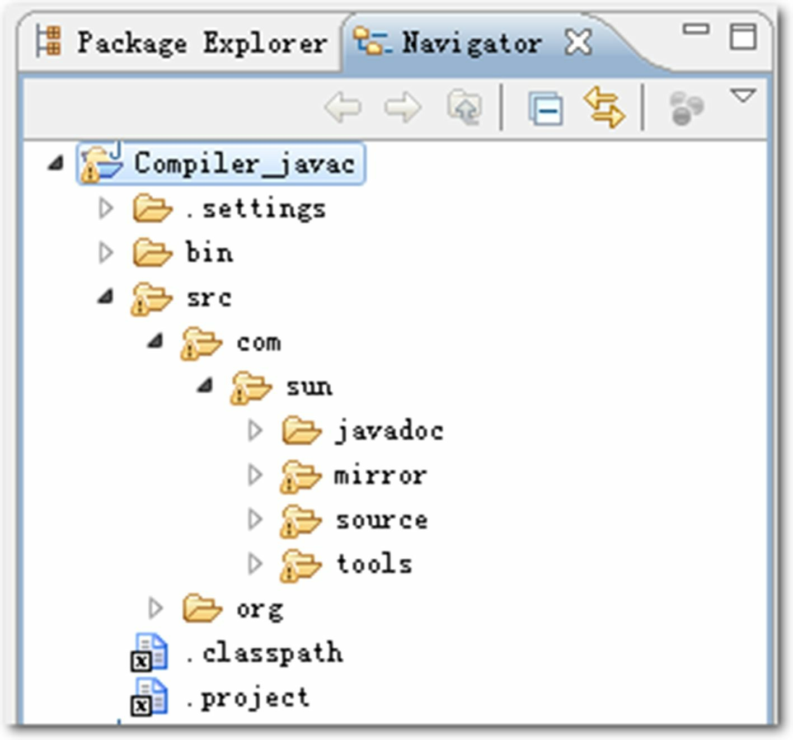
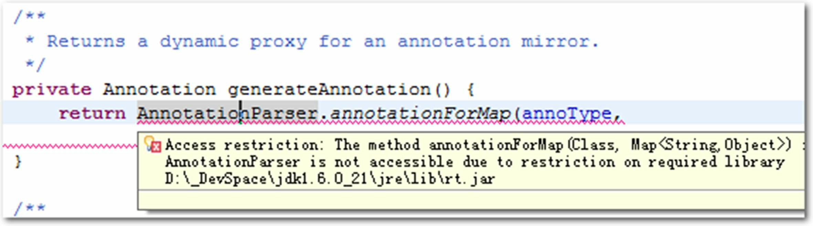
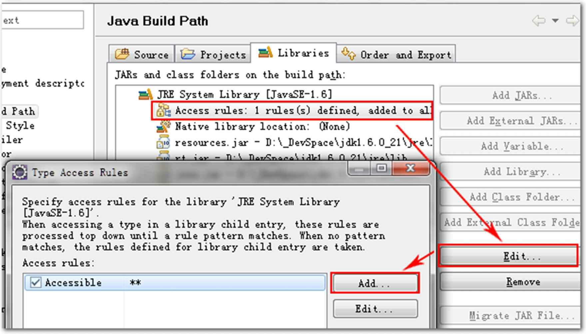
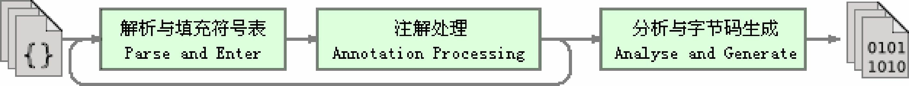
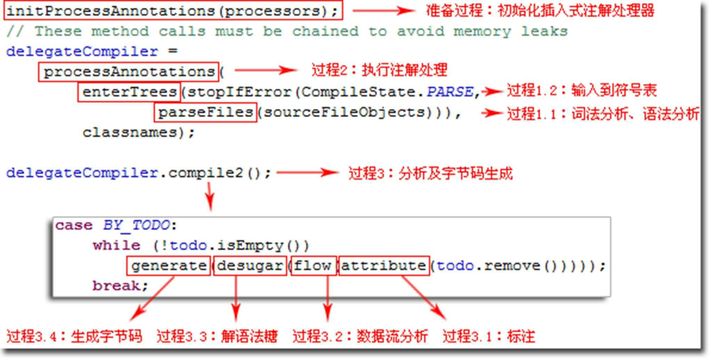
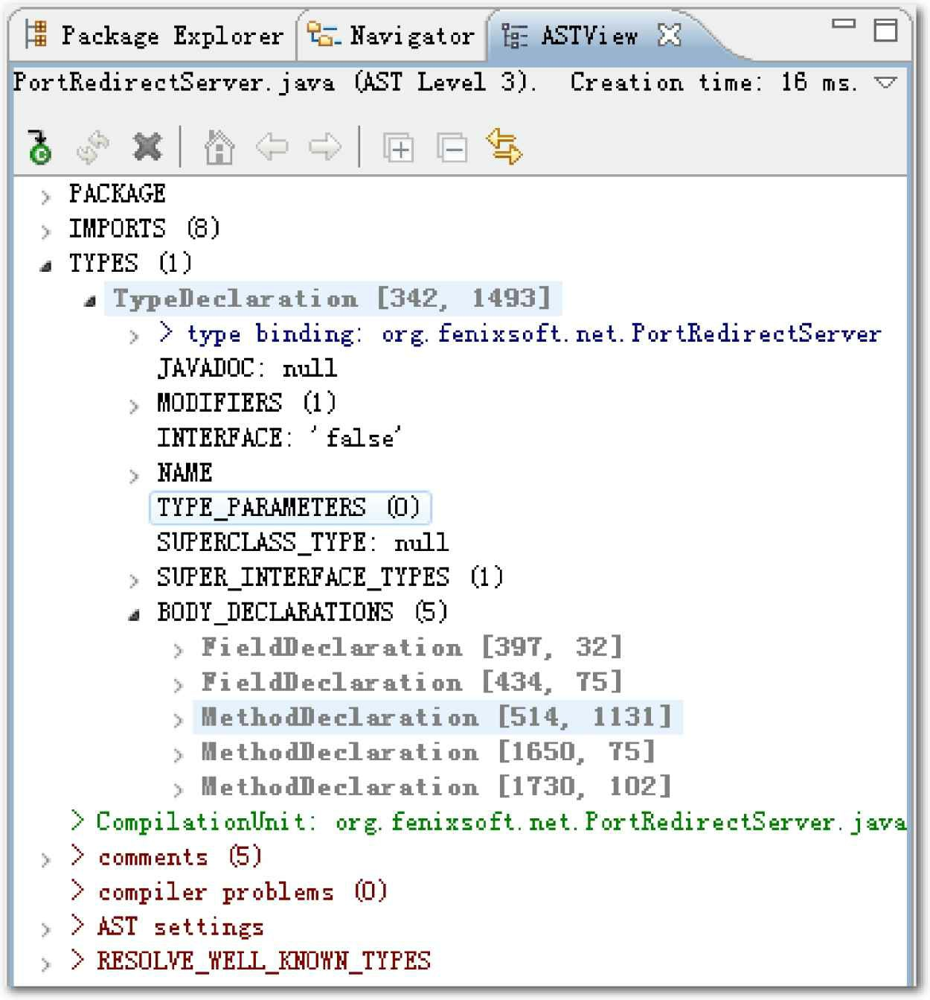
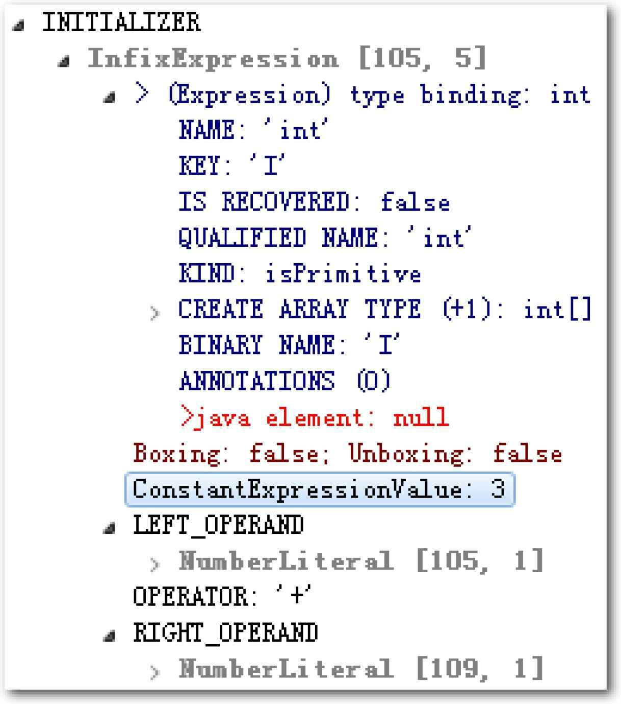

## 第10章　前端编译与优化

从计算机程序出现的第一天起，对效率的追逐就是程序员天生的坚定信仰，这个过程犹如一场没有终点、永不停歇的F1方程式竞赛，程序员是车手，技术平台则是在赛道上飞驰的赛车。

### 10.1　概述

在Java技术下谈“编译期”而没有具体上下文语境的话，其实是一句很含糊的表述，因为它可能是指一个前端编译器（叫“编译器的前端”更准确一些）把*.java文件转变成*.class文件的过程；也可能是指Java虚拟机的即时编译器（常称JIT编译器，Just In Time Compiler）运行期把字节码转变成本地机器码的过程；还可能是指使用静态的提前编译器（常称AOT编译器，Ahead Of Time Compiler）直接把程序编译成与目标机器指令集相关的二进制代码的过程。下面笔者列举了这3类编译过程里一些比较有代表性的编译器产品：

- 前端编译器：JDK的Javac、Eclipse JDT中的增量式编译器（ECJ）[1]。
- 即时编译器：HotSpot虚拟机的C1、C2编译器，Graal编译器。
- 提前编译器：JDK的Jaotc、GNU Compiler for the Java（GCJ）[2]、Excelsior JET[3]。

这3类过程中最符合普通程序员对Java程序编译认知的应该是第一类，本章标题中的“前端”指的也是这种由前端编译器完成的编译行为。在本章后续的讨论里，笔者提到的全部“编译期”和“编译器”都仅限于第一类编译过程，我们会把第二、三类编译过程留到第11章中去讨论。限制了“编译期”的范围后，我们对于“优化”二字的定义也需要放宽一些，因为Javac这类前端编译器对代码的运行效率几乎没有任何优化措施可言（在JDK 1.3之后，Javac的-O优化参数就不再有意义），哪怕是编译器真的采取了优化措施也不会产生什么实质的效果。因为Java虚拟机设计团队选择把对性能的优化全部集中到运行期的即时编译器中，这样可以让那些不是由Javac产生的Class文件（如JRuby、Groovy等语言的Class文件）也同样能享受到编译器优化措施所带来的性能红利。但是，如果把“优化”的定义放宽，把对开发阶段的优化也计算进来的话，Javac确实是做了许多针对Java语言编码过程的优化措施来降低程序员的编码复杂度、提高编码效率。相当多新生的Java语法特性，都是靠编译器的“语法糖”来实现，而不是依赖字节码或者Java虚拟机的底层改进来支持。我们可以这样认为，Java中即时编译器在运行期的优化过程，支撑了程序执行效率的不断提升；而前端编译器在编译期的优化过程，则是支撑着程序员的编码效率和语言使用者的幸福感的提高。

[1] JDT官方站点：http://www.eclipse.org/jdt/。
[2] GCJ官方站点：http://gcc.gnu.org/java/。
[3] Excelsior JET：https://en.wikipedia.org/wiki/Excelsior_JET。

### 10.2　Javac编译器

分析源码是了解一项技术的实现内幕最彻底的手段，Javac编译器不像HotSpot虚拟机那样使用C++语言（包含少量C语言）实现，它本身就是一个由Java语言编写的程序，这为纯Java的程序员了解它的编译过程带来了很大的便利。

#### 10.2.1　Javac的源码与调试

在JDK 6以前，Javac并不属于标准Java SE API的一部分，它实现代码单独存放在tools.jar中，要在程序中使用的话就必须把这个库放到类路径上。在JDK 6发布时通过了JSR 199编译器API的提案，使得Javac编译器的实现代码晋升成为标准Java类库之一，它的源码就改为放在JDK_SRC_HOME/langtools/src/share/classes/com/sun/tools/javac中[1]。到了JDK 9时，整个JDK所有的Java类库都采用模块化进行重构划分，Javac编译器就被挪到了jdk.compiler模块（路径为：JDK_SRC_HOME/src/jdk.compiler/share/classes/com/sun/tools/javac）里面。虽然程序代码的内容基本没有变化，但由于本节的主题是源码解析，不可避免地会涉及大量的路径和包名，这就要选定JDK版本来讨论了，本次笔者将会以JDK 9之前的代码结构来进行讲解。

Javac编译器除了JDK自身的标准类库外，就只引用了JDK_SRC_HOME/langtools/src/share/classes/com/sun/*里面的代码，所以我们的代码编译环境建立时基本无须处理依赖关系，相当简单便捷。以Eclipse IDE作为开发工具为例，先建立一个名为“Compiler_javac”的Java工程，然后把JDK_SRC_HOME/langtools/src/share/classes/com/sun/*目录下的源文件全部复制到工程的源码目录中，如图10-1所示。



图10-1　Eclipse中的Javac工程

导入代码期间，源码文件“AnnotationProxyMaker.java”可能会提示“Access Restriction”，被Eclipse拒绝编译，如图10-2所示。



图10-2　AnnotationProxyMaker被拒绝编译

这是由于Eclipse为了避免开发人员引用非标准Java类库可能导致的兼容性问题，在“JRE System Library”设置中默认包含了一系列的代码访问规则（Access Rules），如果代码中引用了这些访问规则所禁止引用的类，就会提示这个错误。我们可以通过添加一条允许访问JAR包中所有类的访问规则来解决该问题，如图10-3所示。



图10-3　设置访问规则

导入了Javac的源码后，就可以运行com.sun.tools.javac.Main的main()方法来执行编译了，可以使用的参数与命令行中使用的Javac命令没有任何区别，编译的文件与参数在Eclipse的“Debug Configurations”面板中的“Arguments”页签中指定。

《Java虚拟机规范》中严格定义了Class文件格式的各种细节，可是对如何把Java源码编译为Class文件却描述得相当宽松。规范里尽管有专门的一章名为“Compiling for the Java Virtual Machine”，但这章也仅仅是以举例的形式来介绍怎样的Java代码应该被转换为怎样的字节码，并没有使用编译原理中常用的描述工具（如文法、生成式等）来对Java源码编译过程加以约束。这是给了Java前端编译器较大的实现灵活性，但也导致Class文件编译过程在某种程度上是与具体的JDK或编译器实现相关的，譬如在一些极端情况下，可能会出现某些代码在Javac编译器可以编译，但是ECJ编译器就不可以编译的问题（反过来也有可能，后文中将会给出一些这样的例子）。

从Javac代码的总体结构来看，编译过程大致可以分为1个准备过程和3个处理过程，它们分别如下所示。

1. 准备过程：初始化插入式注解处理器。
2. 解析与填充符号表过程，包括：
- 词法、语法分析。将源代码的字符流转变为标记集合，构造出抽象语法树。
- 填充符号表。产生符号地址和符号信息。
3. 插入式注解处理器的注解处理过程：插入式注解处理器的执行阶段，本章的实战部分会设计一个插入式注解处理器来影响Javac的编译行为。
4. 分析与字节码生成过程，包括：
- 标注检查。对语法的静态信息进行检查。
- 数据流及控制流分析。对程序动态运行过程进行检查。
- 解语法糖。将简化代码编写的语法糖还原为原有的形式。
- 字节码生成。将前面各个步骤所生成的信息转化成字节码。

上述3个处理过程里，执行插入式注解时又可能会产生新的符号，如果有新的符号产生，就必须转回到之前的解析、填充符号表的过程中重新处理这些新符号，从总体来看，三者之间的关系与交互顺序如图10-4所示。



图10-4　Javac的编译过程[2]

我们可以把上述处理过程对应到代码中，Javac编译动作的入口是com.sun.tools.javac.main.JavaCompiler类，上述3个过程的代码逻辑集中在这个类的compile()和compile2()方法里，其中主体代码如图10-5所示，整个编译过程主要的处理由图中标注的8个方法来完成。



图10-5　Javac编译过程的主体代码

接下来，我们将对照Javac的源代码，逐项讲解上述过程。

[1] 如何获取OpenJDK源码请参考本书第1章的相关内容。
[2] 图片来源：http://openjdk.java.net/groups/compiler/doc/compilation-overview/index.html，笔者做了汉化处理。

#### 10.2.2　解析与填充符号表

解析过程由图10-5中的parseFiles()方法（图10-5中的过程1.1）来完成，解析过程包括了经典程序编译原理中的词法分析和语法分析两个步骤。

##### 1. 词法、语法分析

词法分析是将源代码的字符流转变为标记（Token）集合的过程，单个字符是程序编写时的最小元素，但标记才是编译时的最小元素。关键字、变量名、字面量、运算符都可以作为标记，如“int a=b+2”这句代码中就包含了6个标记，分别是int、a、=、b、+、2，虽然关键字int由3个字符构成，但是它只是一个独立的标记，不可以再拆分。在Javac的源码中，词法分析过程由com.sun.tools.javac.parser.Scanner类来实现。

语法分析是根据标记序列构造抽象语法树的过程，抽象语法树（Abstract Syntax Tree，AST）是一种用来描述程序代码语法结构的树形表示方式，抽象语法树的每一个节点都代表着程序代码中的一个语法结构（Syntax Construct），例如包、类型、修饰符、运算符、接口、返回值甚至连代码注释等都可以是一种特定的语法结构。

图10-6是Eclipse AST View插件分析出来的某段代码的抽象语法树视图，读者可以通过这个插件工具生成的可视化界面对抽象语法树有一个直观的认识。在Javac的源码中，语法分析过程由com.sun.tools.javac.parser.Parser类实现，这个阶段产出的抽象语法树是以com.sun.tools.javac.tree.JCTree类表示的。

经过词法和语法分析生成语法树以后，编译器就不会再对源码字符流进行操作了，后续的操作都建立在抽象语法树之上。



图10-6　抽象语法树结构视图

##### 2. 填充符号表

完成了语法分析和词法分析之后，下一个阶段是对符号表进行填充的过程，也就是图10-5中enterTrees()方法（图10-5中注释的过程1.2）要做的事情。符号表（Symbol Table）是由一组符号地址和符号信息构成的数据结构，读者可以把它类比想象成哈希表中键值对的存储形式（实际上符号表不一定是哈希表实现，可以是有序符号表、树状符号表、栈结构符号表等各种形式）。符号表中所登记的信息在编译的不同阶段都要被用到。譬如在语义分析的过程中，符号表所登记的内容将用于语义检查（如检查一个名字的使用和原先的声明是否一致）和产生中间代码，在目标代码生成阶段，当对符号名进行地址分配时，符号表是地址分配的直接依据。

在Javac源代码中，填充符号表的过程由com.sun.tools.javac.comp.Enter类实现，该过程的产出物是一个待处理列表，其中包含了每一个编译单元的抽象语法树的顶级节点，以及package-info.java（如果存在的话）的顶级节点。

#### 10.2.3　注解处理器

JDK 5之后，Java语言提供了对注解（Annotations）的支持，注解在设计上原本是与普通的Java代码一样，都只会在程序运行期间发挥作用的。但在JDK 6中又提出并通过了JSR-269提案[1]，该提案设计了一组被称为“插入式注解处理器”的标准API，可以提前至编译期对代码中的特定注解进行处理，从而影响到前端编译器的工作过程。我们可以把插入式注解处理器看作是一组编译器的插件，当这些插件工作时，允许读取、修改、添加抽象语法树中的任意元素。如果这些插件在处理注解期间对语法树进行过修改，编译器将回到解析及填充符号表的过程重新处理，直到所有插入式注解处理器都没有再对语法树进行修改为止，每一次循环过程称为一个轮次（Round），这也就对应着图10-4的那个回环过程。

有了编译器注解处理的标准API后，程序员的代码才有可能干涉编译器的行为，由于语法树中的任意元素，甚至包括代码注释都可以在插件中被访问到，所以通过插入式注解处理器实现的插件在功能上有很大的发挥空间。只要有足够的创意，程序员能使用插入式注解处理器来实现许多原本只能在编码中由人工完成的事情。譬如Java著名的编码效率工具Lombok[2]，它可以通过注解来实现自动产生getter/setter方法、进行空置检查、生成受查异常表、产生equals()和hashCode()方法，等等，帮助开发人员消除Java的冗长代码，这些都是依赖插入式注解处理器来实现的，本章最后会设计一个如何使用插入式注解处理器的简单实战。

在Javac源码中，插入式注解处理器的初始化过程是在initPorcessAnnotations()方法中完成的，而它的执行过程则是在processAnnotations()方法中完成。这个方法会判断是否还有新的注解处理器需要执行，如果有的话，通过com.sun.tools.javac.processing.JavacProcessingEnvironment类的doProcessing()方法来生成一个新的JavaCompiler对象，对编译的后续步骤进行处理。

[1] JSR-269：Pluggable Annotations Processing API（插入式注解处理API）。
[2] 主页地址：https://projectlombok.org/。

#### 10.2.4　语义分析与字节码生成

经过语法分析之后，编译器获得了程序代码的抽象语法树表示，抽象语法树能够表示一个结构正确的源程序，但无法保证源程序的语义是符合逻辑的。而语义分析的主要任务则是对结构上正确的源程序进行上下文相关性质的检查，譬如进行类型检查、控制流检查、数据流检查，等等。举个简单的例子，假设有如下3个变量定义语句：

```java
int a = 1;
boolean b = false;
char c = 2;
```

后续可能出现的赋值运算：

```java
int d = a + c;
int d = b + c;
char d = a + c;
```

后续代码中如果出现了如上3种赋值运算的话，那它们都能构成结构正确的抽象语法树，但是只有第一种的写法在语义上是没有错误的，能够通过检查和编译。其余两种在Java语言中是不合逻辑的，无法编译（是否合乎语义逻辑必须限定在具体的语言与具体的上下文环境之中才有意义。如在C语言中，a、b、c的上下文定义不变，第二、三种写法都是可以被正确编译的）。我们编码时经常能在IDE中看到由红线标注的错误提示，其中绝大部分都是来源于语义分析阶段的检查结果。

##### 1. 标注检查

Javac在编译过程中，语义分析过程可分为标注检查和数据及控制流分析两个步骤，分别由图10-5的attribute()和flow()方法（分别对应图10-5中的过程3.1和过程3.2）完成。

标注检查步骤要检查的内容包括诸如变量使用前是否已被声明、变量与赋值之间的数据类型是否能够匹配，等等，刚才3个变量定义的例子就属于标注检查的处理范畴。在标注检查中，还会顺便进行一个称为常量折叠（Constant Folding）的代码优化，这是Javac编译器会对源代码做的极少量优化措施之一（代码优化几乎都在即时编译器中进行）。如果我们在Java代码中写下如下所示的变量定义：



图10-7　常量折叠

```java
int a = 1 + 2;
```

则在抽象语法树上仍然能看到字面量“1”“2”和操作符“+”号，但是在经过常量折叠优化之后，它们将会被折叠为字面量“3”，如图10-7所示，这个插入式表达式（Infix Expression）的值已经在语法树上标注出来了（ConstantExpressionValue：3）。由于编译期间进行了常量折叠，所以在代码里面定义“a=1+2”比起直接定义“a=3”来，并不会增加程序运行期哪怕仅仅一个处理器时钟周期的处理工作量。

标注检查步骤在Javac源码中的实现类是com.sun.tools.javac.comp.Attr类和com.sun.tools.javac.comp.Check类。

##### 2. 数据及控制流分析

数据流分析和控制流分析是对程序上下文逻辑更进一步的验证，它可以检查出诸如程序局部变量在使用前是否有赋值、方法的每条路径是否都有返回值、是否所有的受查异常都被正确处理了等问题。编译时期的数据及控制流分析与类加载时的数据及控制流分析的目的基本上可以看作是一致的，但校验范围会有所区别，有一些校验项只有在编译期或运行期才能进行。下面举一个关于final修饰符的数据及控制流分析的例子，见代码清单10-1所示。

代码清单10-1　final语义校验

```java
// 方法一带有final修饰
public void foo(final int arg) {
    final int var = 0;
    // do something
}
// 方法二没有final修饰
public void foo(int arg) {
    int var = 0;
    // do something
}
```

在这两个foo()方法中，一个方法的参数和局部变量定义使用了final修饰符，另外一个则没有，在代码编写时程序肯定会受到final修饰符的影响，不能再改变arg和var变量的值，但是如果观察这两段代码编译出来的字节码，会发现它们是没有任何一点区别的，每条指令，甚至每个字节都一模一样。通过第6章对Class文件结构的讲解我们已经知道，局部变量与类的字段（实例变量、类变量）的存储是有显著差别的，局部变量在常量池中并没有CONSTANT_Fieldref_info的符号引用，自然就不可能存储有访问标志（access_flags）的信息，甚至可能连变量名称都不一定会被保留下来（这取决于编译时的编译器的参数选项），自然在Class文件中就不可能知道一个局部变量是不是被声明为final了。因此，可以肯定地推断出把局部变量声明为final，对运行期是完全没有影响的，变量的不变性仅仅由Javac编译器在编译期间来保障，这就是一个只能在编译期而不能在运行期中检查的例子。在Javac的源码中，数据及控制流分析的入口是图10-5中的flow()方法（图10-5中的过程3.2），具体操作由com.sun.tools.javac.comp.Flow类来完成。

##### 3. 解语法糖

语法糖（Syntactic Sugar），也称糖衣语法，是由英国计算机科学家Peter J.Landin发明的一种编程术语，指的是在计算机语言中添加的某种语法，这种语法对语言的编译结果和功能并没有实际影响，但是却能更方便程序员使用该语言。通常来说使用语法糖能够减少代码量、增加程序的可读性，从而减少程序代码出错的机会。

Java在现代编程语言之中已经属于“低糖语言”（相对于C#及许多其他Java虚拟机语言来说），尤其是JDK 5之前的Java。“低糖”的语法让Java程序实现相同功能的代码量往往高于其他语言，通俗地说就是会显得比较“啰嗦”，这也是Java语言一直被质疑是否已经“落后”了的一个浮于表面的理由。

Java中最常见的语法糖包括了前面提到过的泛型（其他语言中泛型并不一定都是语法糖实现，如C#的泛型就是直接由CLR支持的）、变长参数、自动装箱拆箱，等等，Java虚拟机运行时并不直接支持这些语法，它们在编译阶段被还原回原始的基础语法结构，这个过程就称为解语法糖。Java的这些语法糖是如何实现的、被分解后会是什么样子，都将在10.3节中详细讲述。

在Javac的源码中，解语法糖的过程由desugar()方法触发，在com.sun.tools.javac.comp.TransTypes类和com.sun.tools.javac.comp.Lower类中完成。

##### 4. 字节码生成

字节码生成是Javac编译过程的最后一个阶段，在Javac源码里面由com.sun.tools.javac.jvm.Gen类来完成。字节码生成阶段不仅仅是把前面各个步骤所生成的信息（语法树、符号表）转化成字节码指令写到磁盘中，编译器还进行了少量的代码添加和转换工作。

例如前文多次登场的实例构造器<init>()方法和类构造器<clinit>()方法就是在这个阶段被添加到语法树之中的。请注意这里的实例构造器并不等同于默认构造函数，如果用户代码中没有提供任何构造函数，那编译器将会添加一个没有参数的、可访问性（public、protected、private或<package>）与当前类型一致的默认构造函数，这个工作在填充符号表阶段中就已经完成。<init>()和<clinit>()这两个构造器的产生实际上是一种代码收敛的过程，编译器会把语句块（对于实例构造器而言是“{}”块，对于类构造器而言是“static{}”块）、变量初始化（实例变量和类变量）、调用父类的实例构造器（仅仅是实例构造器，<clinit>()方法中无须调用父类的<clinit>()方法，Java虚拟机会自动保证父类构造器的正确执行，但在<clinit>()方法中经常会生成调用java.lang.Object的<init>()方法的代码）等操作收敛到<init>()和<clinit>()方法之中，并且保证无论源码中出现的顺序如何，都一定是按先执行父类的实例构造器，然后初始化变量，最后执行语句块的顺序进行，上面所述的动作由Gen::normalizeDefs()方法来实现。除了生成构造器以外，还有其他的一些代码替换工作用于优化程序某些逻辑的实现方式，如把字符串的加操作替换为StringBuffer或StringBuilder（取决于目标代码的版本是否大于或等于JDK 5）的append()操作，等等。

完成了对语法树的遍历和调整之后，就会把填充了所有所需信息的符号表交到com.sun.tools.javac.jvm.ClassWriter类手上，由这个类的writeClass()方法输出字节码，生成最终的Class文件，到此，整个编译过程宣告结束。

### 10.3　Java语法糖的味道

几乎所有的编程语言都或多或少提供过一些语法糖来方便程序员的代码开发，这些语法糖虽然不会提供实质性的功能改进，但是它们或能提高效率，或能提升语法的严谨性，或能减少编码出错的机会。现在也有一种观点认为语法糖并不一定都是有益的，大量添加和使用含糖的语法，容易让程序员产生依赖，无法看清语法糖的糖衣背后，程序代码的真实面目。

总而言之，语法糖可以看作是前端编译器实现的一些“小把戏”，这些“小把戏”可能会使效率得到“大提升”，但我们也应该去了解这些“小把戏”背后的真实面貌，那样才能利用好它们，而不是被它们所迷惑。

#### 10.3.1　泛型

泛型的本质是参数化类型（Parameterized Type）或者参数化多态（Parametric Polymorphism）的应用，即可以将操作的数据类型指定为方法签名中的一种特殊参数，这种参数类型能够用在类、接口和方法的创建中，分别构成泛型类、泛型接口和泛型方法。泛型让程序员能够针对泛化的数据类型编写相同的算法，这极大地增强了编程语言的类型系统及抽象能力。

在2004年，Java和C#两门语言于同一年更新了一个重要的大版本，即Java 5.0和C#2.0，在这个大版本中，两门语言又不约而同地各自添加了泛型的语法特性。不过，两门语言对泛型的实现方式却选择了截然不同的路径。本来Java和C#天生就存在着比较和竞争，泛型这个两门语言在同一年、同一个功能上做出的不同选择，自然免不了被大家对比审视一番，其结论是Java的泛型直到今天依然作为Java语言不如C#语言好用的“铁证”被众人嘲讽。笔者在本节介绍Java泛型时，并不会去尝试推翻这个结论，相反甚至还会去举例来揭示Java泛型的缺陷所在，但同时也必须向不了解Java泛型机制和历史的读者说清楚，Java选择这样的泛型实现，是出于当时语言现状的权衡，而不是语言先进性或者设计者水平不如C#之类的原因。

##### 1. Java与C#的泛型

Java选择的泛型实现方式叫作“类型擦除式泛型”（Type Erasure Generics），而C#选择的泛型实现方式是“具现化式泛型”（Reified Generics）。具现化和特化、偏特化这些名词最初都是源于C++模版语法中的概念，如果读者本身不使用C++的话，在本节的阅读中可不必太纠结其概念定义，把它当一个技术名词即可，只需要知道C#里面泛型无论在程序源码里面、编译后的中间语言表示（Intermediate Language，这时候泛型是一个占位符）里面，抑或是运行期的CLR里面都是切实存在的，List<int>与List<string>就是两个不同的类型，它们由系统在运行期生成，有着自己独立的虚方法表和类型数据。而Java语言中的泛型则不同，它只在程序源码中存在，在编译后的字节码文件中，全部泛型都被替换为原来的裸类型（Raw Type，稍后我们会讲解裸类型具体是什么）了，并且在相应的地方插入了强制转型代码，因此对于运行期的Java语言来说，ArrayList<int>与ArrayList<String>其实是同一个类型，由此读者可以想象“类型擦除”这个名字的含义和来源，这也是为什么笔者会把Java泛型安排在语法糖里介绍的原因。

读者虽然无须纠结概念，但却要关注这两种实现方式会给使用者带来什么样的影响。Java的泛型确实在实际使用中会有一些限制，如果读者是一名C#开发人员，可能很难想象代码清单10-2中的Java代码都是不合法的。

代码清单10-2　Java中不支持的泛型用法

```java
public class TypeErasureGenerics<E> {
    public void doSomething(Object item) {
        if (item instanceof E) {   // 不合法，无法对泛型进行实例判断
            ...
        }
        E newItem = new E();       // 不合法，无法使用泛型创建对象
        E[] itemArray = new E[10]; // 不合法，无法使用泛型创建数组
    }
}
```

上面这些是Java泛型在编码阶段产生的不良影响，如果说这种使用层次上的差别还可以通过多写几行代码、方法中多加一两个类型参数来解决的话，性能上的差距则是难以用编码弥补的。C#2.0引入了泛型之后，带来的显著优势之一便是对比起Java在执行性能上的提高，因为在使用平台提供的容器类型（如List<T>，Dictionary<TKey，TValue>）时，无须像Java里那样不厌其烦地拆箱和装箱[1]，如果在Java中要避免这种损失，就必须构造一个与数据类型相关的容器类（譬如IntFloatHashMap这样的容器）。显然，这除了引入更多代码造成复杂度提高、复用性降低之外，更是丧失了泛型本身的存在价值。

Java的类型擦除式泛型无论在使用效果上还是运行效率上，几乎是全面落后于C#的具现化式泛型，而它的唯一优势是在于实现这种泛型的影响范围上：擦除式泛型的实现几乎只需要在Javac编译器上做出改进即可，不需要改动字节码、不需要改动Java虚拟机，也保证了以前没有使用泛型的库可以直接运行在Java 5.0之上。但这种听起来节省工作量甚至可以说是有偷工减料嫌疑的优势就显得非常短视，真的能在当年Java实现泛型的利弊权衡中胜出吗？答案的确是它胜出了，但我们必须在那时的泛型历史背景中去考虑不同实现方式带来的代价。

##### 2. 泛型的历史背景

泛型思想早在C++语言的模板（Template）功能中就开始生根发芽，而在Java语言中加入泛型的首次尝试是出现在1996年。Martin Odersky（后来Scala语言的缔造者）当时是德国卡尔斯鲁厄大学编程理论的教授，他想设计一门能够支持函数式编程的程序语言，又不想从头把编程语言的所有功能都再做一遍，所以就注意到了刚刚发布一年的Java，并在它上面实现了函数式编程的3大特性：泛型、高阶函数和模式匹配，形成了Scala语言的前身Pizza语言[2]。后来，Java的开发团队找到了Martin Odersky，表示对Pizza语言的泛型功能很感兴趣，他们就一起建立了一个叫作“Generic Java”的新项目，目标是把Pizza语言的泛型单独拎出来移植到Java语言上，其最终成果就是Java 5.0中的那个泛型实现[3]，但是移植的过程并不是一开始就朝着类型擦除式泛型去的，事实上Pizza语言中的泛型更接近于现在C#的泛型。Martin Odersky自己在采访自述[4]中提到，进行Generic Java项目的过程中他受到了重重约束，甚至多次让他感到沮丧，最紧、最难的约束来源于被迫要完全向后兼容无泛型Java，即保证“二进制向后兼容性”（Binary Backwards Compatibility）。二进制向后兼容性是明确写入《Java语言规范》中的对Java使用者的严肃承诺，譬如一个在JDK 1.2中编译出来的Class文件，必须保证能够在JDK 12乃至以后的版本中也能够正常运行[5]。这样，既然Java到1.4.2版之前都没有支持过泛型，而到Java 5.0突然要支持泛型了，还要让以前编译的程序在新版本的虚拟机还能正常运行，就意味着以前没有的限制不能突然间冒出来。

举个例子，在没有泛型的时代，由于Java中的数组是支持协变（Covariant）的[6]，对应的集合类也可以存入不同类型的元素，类似于代码清单10-3这样的代码尽管不提倡，但是完全可以正常编译成Class文件。

代码清单10-3　以下代码可正常编译为Class

```java
Object[] array = new String[10];
array[0] = 10;                     // 编译期不会有问题，运行时会报错
ArrayList things = new ArrayList();
things.add(Integer.valueOf(10));   //编译、运行时都不会报错
things.add("hello world");
```

为了保证这些编译出来的Class文件可以在Java 5.0引入泛型之后继续运行，设计者面前大体上有两条路可以选择：

1. 需要泛型化的类型（主要是容器类型），以前有的就保持不变，然后平行地加一套泛型化版本的新类型。
2. 直接把已有的类型泛型化，即让所有需要泛型化的已有类型都原地泛型化，不添加任何平行于已有类型的泛型版。

在这个分叉路口，C#走了第一条路，添加了一组System.Collections.Generic的新容器，以前的System.Collections以及System.Collections.Specialized容器类型继续存在。C#的开发人员很快就接受了新的容器，倒也没出现过什么不适应的问题，唯一的不适大概是许多.NET自身的标准库已经把老容器类型当作方法的返回值或者参数使用，这些方法至今还保持着原来的老样子。

但如果相同的选择出现在Java中就很可能不会是相同的结果了，要知道当时.NET才问世两年，而Java已经有快十年的历史了，再加上各自流行程度的不同，两者遗留代码的规模根本不在同一个数量级上。而且更大的问题是Java并不是没有做过第一条路那样的技术决策，在JDK 1.2时，遗留代码规模尚小，Java就引入过新的集合类，并且保留了旧集合类不动。这导致了直到现在标准类库中还有Vector（老）和ArrayList（新）、有Hashtable（老）和HashMap（新）等两套容器代码并存，如果当时再摆弄出像Vector（老）、ArrayList（新）、Vector<T>（老但有泛型）、ArrayList<T>（新且有泛型）这样的容器集合，可能叫骂声会比今天听到的更响更大。

到了这里，相信读者已经能稍微理解为什么当时Java只能选择第二条路了。但第二条路也并不意味着一定只能使用类型擦除来实现，如果当时有足够的时间好好设计和实现，是完全有可能做出更好的泛型系统的，否则也不会有今天的Valhalla项目来还以前泛型偷懒留下的技术债了。下面我们就来看看当时做的类型擦除式泛型的实现时到底哪里偷懒了，又带来了怎样的缺陷。

##### 3. 类型擦除

我们继续以ArrayList为例来介绍Java泛型的类型擦除具体是如何实现的。由于Java选择了第二条路，直接把已有的类型泛型化。要让所有需要泛型化的已有类型，譬如ArrayList，原地泛型化后变成了ArrayList<T>，而且保证以前直接用ArrayList的代码在泛型新版本里必须还能继续用这同一个容器，这就必须让所有泛型化的实例类型，譬如ArrayList<Integer>、ArrayList<String>这些全部自动成为ArrayList的子类型才能可以，否则类型转换就是不安全的。由此就引出了“裸类型”（Raw Type）的概念，裸类型应被视为所有该类型泛型化实例的共同父类型（Super Type），只有这样，像代码清单10-4中的赋值才是被系统允许的从子类到父类的安全转型。

代码清单10-4　裸类型赋值

```java
ArrayList<Integer> ilist = new ArrayList<Integer>();
ArrayList<String> slist = new ArrayList<String>();
ArrayList list; // 裸类型
list = ilist;
list = slist;
```

接下来的问题是该如何实现裸类型。这里又有了两种选择：一种是在运行期由Java虚拟机来自动地、真实地构造出ArrayList<Integer>这样的类型，并且自动实现从ArrayList<Integer>派生自ArrayList的继承关系来满足裸类型的定义；另外一种是索性简单粗暴地直接在编译时把ArrayList<Integer>还原回ArrayList，只在元素访问、修改时自动插入一些强制类型转换和检查指令，这样看起来也是能满足需要，这两个选择的最终结果大家已经都知道了。代码清单10-5是一段简单的Java泛型例子，我们可以看一下它编译后的实际样子是怎样的。

代码清单10-5　泛型擦除前的例子

```java
public static void main(String[] args) {
    Map<String, String> map = new HashMap<String, String>();
    map.put("hello", "你好");
    map.put("how are you?", "吃了没？");
    System.out.println(map.get("hello"));
    System.out.println(map.get("how are you?"));
}
```

把这段Java代码编译成Class文件，然后再用字节码反编译工具进行反编译后，将会发现泛型都不见了，程序又变回了Java泛型出现之前的写法，泛型类型都变回了裸类型，只在元素访问时插入了从Object到String的强制转型代码，如代码清单10-6所示。

代码清单10-6　泛型擦除后的例子

```java
public static void main(String[] args) {
    Map map = new HashMap();
    map.put("hello", "你好");
    map.put("how are you?", "吃了没？");
    System.out.println((String) map.get("hello"));
    System.out.println((String) map.get("how are you?"));
}
```

类型擦除带来的缺陷前面已经提到过一些，为了系统性地讲述，笔者在此再举3个例子，把前面与C#对比时简要提及的擦除式泛型的缺陷做更具体的说明。

首先，使用擦除法实现泛型直接导致了对原始类型（Primitive Types）数据的支持又成了新的麻烦，譬如将代码清单10-2稍微修改一下，变成代码清单10-7这个样子。

代码清单10-7　原始类型的泛型（目前的Java不支持）

```java
ArrayList<int> ilist = new ArrayList<int>();
ArrayList<long> llist = new ArrayList<long>();
ArrayList list;
list = ilist;
list = llist;
```

这种情况下，一旦把泛型信息擦除后，到要插入强制转型代码的地方就没办法往下做了，因为不支持int、long与Object之间的强制转型。当时Java给出的解决方案一如既往的简单粗暴：既然没法转换那就索性别支持原生类型的泛型了吧，你们都用ArrayList<Integer>、ArrayList<Long>，反正都做了自动的强制类型转换，遇到原生类型时把装箱、拆箱也自动做了得了。这个决定后面导致了无数构造包装类和装箱、拆箱的开销，成为Java泛型慢的重要原因，也成为今天Valhalla项目要重点解决的问题之一。

第二，运行期无法取到泛型类型信息，会让一些代码变得相当啰嗦，譬如代码清单10-2中罗列的几种Java不支持的泛型用法，都是由于运行期Java虚拟机无法取得泛型类型而导致的。像代码清单10-8这样，我们去写一个泛型版本的从List到数组的转换方法，由于不能从List中取得参数化类型T，所以不得不从一个额外参数中再传入一个数组的组件类型进去，实属无奈。

代码清单10-8　不得不加入的类型参数

```java
public static <T> T[] convert(List<T> list, Class<T> componentType) {
    T[] array = (T[])Array.newInstance(componentType, list.size());
    ...
}
```

最后，笔者认为通过擦除法来实现泛型，还丧失了一些面向对象思想应有的优雅，带来了一些模棱两可的模糊状况，例如代码清单10-9的例子。

代码清单10-9　当泛型遇见重载1

```java
public class GenericTypes {
    public static void method(List<String> list) {
        System.out.println("invoke method(List<String> list)");
    }
    public static void method(List<Integer> list) {
        System.out.println("invoke method(List<Integer> list)");
    }
}
```

请读者思考一下，上面这段代码是否正确，能否编译执行？也许你已经有了答案，这段代码是不能被编译的，因为参数List<Integer>和List<String>编译之后都被擦除了，变成了同一种的裸类型List，类型擦除导致这两个方法的特征签名变得一模一样。初步看来，无法重载的原因已经找到了，但是真的就是如此吗？其实这个例子中泛型擦除成相同的裸类型只是无法重载的其中一部分原因，请再接着看一看代码清单10-10中的内容。

代码清单10-10　当泛型遇见重载2

```java
public class GenericTypes {
    public static String method(List<String> list) {
        System.out.println("invoke method(List<String> list)");
        return "";
    }
    public static int method(List<Integer> list) {
        System.out.println("invoke method(List<Integer> list)");
        return 1;
    }
    public static void main(String[] args) {
        method(new ArrayList<String>());
        method(new ArrayList<Integer>());
    }
}
```

执行结果：

```java
invoke method(List<String> list)
invoke method(List<Integer> list)
```

代码清单10-9与代码清单10-10的差别，是两个method()方法添加了不同的返回值，由于这两个返

回值的加入，方法重载居然成功了，即这段代码可以被编译和执行[7]了。这是我们对Java语言中返回值不参与重载选择的基本认知的挑战吗？

代码清单10-10中的重载当然不是根据返回值来确定的，之所以这次能编译和执行成功，是因为两个method()方法加入了不同的返回值后才能共存在一个Class文件之中。第6章介绍Class文件方法表（method_info）的数据结构时曾经提到过，方法重载要求方法具备不同的特征签名，返回值并不包含在方法的特征签名中，所以返回值不参与重载选择，但是在Class文件格式之中，只要描述符不是完全一致的两个方法就可以共存。也就是说两个方法如果有相同的名称和特征签名，但返回值不同，那它们也是可以合法地共存于一个Class文件中的。

由于Java泛型的引入，各种场景（虚拟机解析、反射等）下的方法调用都可能对原有的基础产生影响并带来新的需求，如在泛型类中如何获取传入的参数化类型等。所以JCP组织对《Java虚拟机规范》做出了相应的修改，引入了诸如Signature、LocalVariableTypeTable等新的属性用于解决伴随泛型而来的参数类型的识别问题，Signature是其中最重要的一项属性，它的作用就是存储一个方法在字节码层面的特征签名[8]，这个属性中保存的参数类型并不是原生类型，而是包括了参数化类型的信息。修改后的虚拟机规范[9]要求所有能识别49.0以上版本的Class文件的虚拟机都要能正确地识别Signature参数。

从上面的例子中可以看到擦除法对实际编码带来的不良影响，由于List<String>和List<Integer>擦除后是同一个类型，我们只能添加两个并不需要实际使用到的返回值才能完成重载，这是一种毫无优雅和美感可言的解决方案，并且存在一定语意上的混乱，譬如上面脚注中提到的，必须用JDK 6的Javac才能编译成功，其他版本或者是ECJ编译器都有可能拒绝编译。

另外，从Signature属性的出现我们还可以得出结论，擦除法所谓的擦除，仅仅是对方法的Code属性中的字节码进行擦除，实际上元数据中还是保留了泛型信息，这也是我们在编码时能通过反射手段取得参数化类型的根本依据。

##### 4. 值类型与未来的泛型

在2014年，刚好是Java泛型出现的十年之后，Oracle建立了一个名为Valhalla的语言改进项目[10]，希望改进Java语言留下的各种缺陷（解决泛型的缺陷就是项目主要目标其中之一）。原本这个项目是计划在JDK 10中完成的，但在笔者撰写本节时（2019年8月，下个月JDK 13正式版都要发布了）也只有少部分目标（譬如VarHandle）顺利实现并发布出去。它现在的技术预览版LW2（L-World 2）[11]是基于未完成的JDK 14 EarlyAccess来运行的，所以本节内容很可能在将来会发生变动，请读者阅读时多加注意。

在Valhalla项目中规划了几种不同的新泛型实现方案，被称为Model 1到Model 3，在这些新的泛型设计中，泛型类型有可能被具现化，也有可能继续维持类型擦除以保持兼容（取决于采用哪种实现方案），即使是继续采用类型擦除的方案，泛型的参数化类型也可以选择不被完全地擦除掉，而是相对完整地记录在Class文件中，能够在运行期被使用，也可以指定编译器默认要擦除哪些类型。相对于使用不同方式实现泛型，目前比较明确的是未来的Java应该会提供“值类型”（Value Type）的语言层面的支持。

说起值类型，这点也是C#用户攻讦Java语言的常用武器之一，C#并没有Java意义上的原生数据类型，在C#中使用的int、bool、double关键字其实是对应了一系列在.NET框架中预定义好的结构体（Struct），如Int32、Boolean、Double等。在C#中开发人员也可以定义自己值类型，只要继承于ValueType类型即可，而ValueType也是统一基类Object的子类，所以并不会遇到Java那样int不自动装箱就无法转型为Object的尴尬。

值类型可以与引用类型一样，具有构造函数、方法或是属性字段，等等，而它与引用类型的区别在于它在赋值的时候通常是整体复制，而不是像引用类型那样传递引用的。更为关键的是，值类型的实例很容易实现分配在方法的调用栈上的，这意味着值类型会随着当前方法的退出而自动释放，不会给垃圾收集子系统带来任何压力。

在Valhalla项目中，Java的值类型方案被称为“内联类型”，计划通过一个新的关键字inline来定义，字节码层面也有专门与原生类型对应的以Q开头的新的操作码（譬如iload对应qload）来支撑。现在的预览版可以通过一个特制的解释器来保证这些未来可能加入的字节码指令能够被执行，要即时编译的话，现在只支持C2编译器。即时编译器场景中是使用逃逸分析优化（见第11章）来处理内联类型的，通过编码时标注以及内联类实例所具备的不可变性，可以很好地解决逃逸分析面对传统引用类型时难以判断（没有足够的信息，或者没有足够的时间做全程序分析）对象是否逃逸的问题。

[1] 这里有对这种性能损失会有多大的量化的讨论：http://fsharpnews.blogspot.com/2010/05/java-vs-f.html。
[2] 一般认为Scala的前身应该是Funnel，从Pizza语言中借鉴了一些技术和思想。
[3] 准确地说Java 5.0的泛型还有一部分是由Gilad Bracha和奥胡斯大学独立开发的通配符功能。
[4] 以上资料来源于Martin Odersky的自述：https://www.artima.com/scalazine/articles/origins_of_scala.html。
[5] 注意，保证的是二进制向后兼容性（即编译结果的兼容性），不是源码兼容性，也不保证（甚至是不允许）高版本JDK的编译结果能前向兼容地运行在低版本Java虚拟机之上。
[6] 现在Java数组也是具有协变性的，请读者不要误解成“有泛型的时代”之后这点就改变了。
[7] 笔者在测试时使用了JDK 6的Javac编译器进行编译，前面提到前端编译器的实现在《Java虚拟机规范》中的定义并不够具体，所以其他的前端编译器，如Eclipse JDT的ECJ编译器，仍然可能会拒绝编译这段代码，ECJ编译时会提示“Method method(List＜String＞)has the same erasure method(List＜E＞)as another method in type GenericTypes”。
[8] 在《Java虚拟机规范（第2版）》（JDK 5修改后的版本）的4.4.4节及《Java语言规范（第3版）》的8.4.2节中都分别定义了字节码层面的方法特征签名，以及Java代码层面的方法特征签名，特征签名最重要的任务就是作为方法独一无二不可重复的ID，在Java代码中的方法特征签名只包括了方法名称、参数顺序及参数类型，而在字节码中的特征签名还包括方法返回值及受查异常表，本书中如果指的是字节码层面的方法签名，笔者会加入限定语进行说明，也请读者根据上下文语境注意区分。
[9] JDK 5对虚拟机规范修改：http://java.sun.com/docs/books/jvms/second_edition/jvms-clarify.html。
[10] 项目主页：https://wiki.openjdk.java.net/display/valhalla/Main。
[11] Valhalla的LW2原型：https://wiki.openjdk.java.net/display/valhalla/LW2。

#### 10.3.2　自动装箱、拆箱与遍历循环

就纯技术的角度而论，自动装箱、自动拆箱与遍历循环（for-each循环）这些语法糖，无论是实现复杂度上还是其中蕴含的思想上都不能和10.3.1节介绍的泛型相提并论，两者涉及的难度和深度都有很大差距。专门拿出一节来讲解它们只是因为这些是Java语言里面被使用最多的语法糖。我们通过代码清单10-11和代码清单10-12中所示的代码来看看这些语法糖在编译后会发生什么样的变化。

代码清单10-11　自动装箱、拆箱与遍历循环

```java
public static void main(String[] args) {
    List<Integer> list = Arrays.asList(1, 2, 3, 4);
    int sum = 0;
    for (int i : list) {
        sum += i;
    }
    System.out.println(sum);
}
```

代码清单10-12　自动装箱、拆箱与遍历循环编译之后

```java
public static void main(String[] args) {
    List list = Arrays.asList( new Integer[] {
        Integer.valueOf(1),
        Integer.valueOf(2),
        Integer.valueOf(3),
        Integer.valueOf(4) });
    int sum = 0;
    for (Iterator localIterator = list.iterator(); localIterator.hasNext(); ) {
        int i = ((Integer)localIterator.next()).intValue();
        sum += i;
    }
    System.out.println(sum);
}
```

代码清单10-11中一共包含了泛型、自动装箱、自动拆箱、遍历循环与变长参数5种语法糖，代码清单10-12则展示了它们在编译前后发生的变化。泛型就不必说了，自动装箱、拆箱在编译之后被转化成了对应的包装和还原方法，如本例中的Integer.valueOf()与Integer.intValue()方法，而遍历循环则是把代码还原成了迭代器的实现，这也是为何遍历循环需要被遍历的类实现Iterable接口的原因。最后再看看变长参数，它在调用的时候变成了一个数组类型的参数，在变长参数出现之前，程序员的确也就是使用数组来完成类似功能的。

这些语法糖虽然看起来很简单，但也不见得就没有任何值得我们特别关注的地方，代码清单10-13演示了自动装箱的一些错误用法。

代码清单10-13　自动装箱的陷阱

```java
public static void main(String[] args) {
    Integer a = 1;
    Integer b = 2;
    Integer c = 3;
    Integer d = 3;
    Integer e = 321;
    Integer f = 321;
    Long g = 3L;
    System.out.println(c == d);
    System.out.println(e == f);
    System.out.println(c == (a + b));
    System.out.println(c.equals(a + b));
    System.out.println(g == (a + b));
    System.out.println(g.equals(a + b));
}
```

读者阅读完代码清单10-13，不妨思考两个问题：一是这6句打印语句的输出是什么？二是这6句打印语句中，解除语法糖后参数会是什么样子？这两个问题的答案都很容易试验出来，笔者就暂且略去答案，希望不能立刻做出判断的读者自己上机实践一下。无论读者的回答是否正确，鉴于包装类的“==”运算在不遇到算术运算的情况下不会自动拆箱，以及它们equals()方法不处理数据转型的关系，笔者建议在实际编码中尽量避免这样使用自动装箱与拆箱。

#### 10.3.3　条件编译

许多程序设计语言都提供了条件编译的途径，如C、C++中使用预处理器指示符（#ifdef）来完成条件编译。C、C++的预处理器最初的任务是解决编译时的代码依赖关系（如极为常用的#include预处理命令），而在Java语言之中并没有使用预处理器，因为Java语言天然的编译方式（编译器并非一个个地编译Java文件，而是将所有编译单元的语法树顶级节点输入到待处理列表后再进行编译，因此各个文件之间能够互相提供符号信息）就无须使用到预处理器。那Java语言是否有办法实现条件编译呢？

Java语言当然也可以进行条件编译，方法就是使用条件为常量的if语句。如代码清单10-14所示，该代码中的if语句不同于其他Java代码，它在编译阶段就会被“运行”，生成的字节码之中只包括“System.out.println("block 1")；”一条语句，并不会包含if语句及另外一个分子中的“System.out.println("block 2")；”

代码清单10-14　Java语言的条件编译

```java
public static void main(String[] args) {
    if (true) {
        System.out.println("block 1");
    } else {
        System.out.println("block 2");
    }
}
```

该代码编译后Class文件的反编译结果：

```java
public static void main(String[] args) {
    System.out.println("block 1");
}
```

只能使用条件为常量的if语句才能达到上述效果，如果使用常量与其他带有条件判断能力的语句搭配，则可能在控制流分析中提示错误，被拒绝编译，如代码清单10-15所示的代码就会被编译器拒绝编译。

代码清单10-15　不能使用其他条件语句来完成条件编译

```java
public static void main(String[] args) {
    // 编译器将会提示“Unreachable code”
    while (false) {
        System.out.println("");
    }
}
```

Java语言中条件编译的实现，也是Java语言的一颗语法糖，根据布尔常量值的真假，编译器将会把分支中不成立的代码块消除掉，这一工作将在编译器解除语法糖阶段（com.sun.tools.javac.comp.Lower类中）完成。由于这种条件编译的实现方式使用了if语句，所以它必须遵循最基本的Java语法，只能写在方法体内部，因此它只能实现语句基本块（Block）级别的条件编译，而没有办法实现根据条件调整整个Java类的结构。

除了本节中介绍的泛型、自动装箱、自动拆箱、遍历循环、变长参数和条件编译之外，Java语言还有不少其他的语法糖，如内部类、枚举类、断言语句、数值字面量、对枚举和字符串的switch支持、try语句中定义和关闭资源（这3个从JDK 7开始支持）、Lambda表达式（从JDK 8开始支持，Lambda不能算是单纯的语法糖，但在前端编译器中做了大量的转换工作），等等，读者可以通过跟踪Javac源码、反编译Class文件等方式了解它们的本质实现，囿于篇幅，笔者就不再一一介绍了。

### 10.4　实战：插入式注解处理器

Java的编译优化部分在本书中并没有像前面两部分那样设置独立的、整章篇幅的实战，因为我们开发程序，考虑的主要还是程序会如何运行，较少会涉及针对程序编译的特殊需求。也正因如此，在JDK的编译子系统里面，暴露给用户直接控制的功能相对很少，除了第11章会介绍的虚拟机即时编译的若干相关参数以外，我们就只有使用JSR-296中定义的插入式注解处理器API来对Java编译子系统的行为施加影响。

但是笔者丝毫不认为相对于前两部分介绍的内存管理子系统和字节码执行子系统，编译子系统就不那么重要了。一套编程语言中编译子系统的优劣，很大程度上决定了程序运行性能的好坏和编码效率的高低，尤其在Java语言中，运行期即时编译与虚拟机执行子系统非常紧密地互相依赖、配合运作（第11章我们将主要讲解这方面的内容）。了解JDK如何编译和优化代码，有助于我们写出适合Java虚拟机自优化的程序。话题说远了，下面我们回到本章的实战中来，看看插入式注解处理器API能为我们实现什么功能。

#### 10.4.1　实战目标

通过阅读Javac编译器的源码，我们知道前端编译器在把Java程序源码编译为字节码的时候，会对Java程序源码做各方面的检查校验。这些校验主要是以程序“写得对不对”为出发点，虽然也会产生一些警告和提示类的信息，但总体来讲还是较少去校验程序“写得好不好”。有鉴于此，业界出现了许多针对程序“写得好不好”的辅助校验工具，如CheckStyle、FindBug、Klocwork等。这些代码校验工具有一些是基于Java的源码进行校验，有一些是通过扫描字节码来完成，在本节的实战中，我们将会使用注解处理器API来编写一款拥有自己编码风格的校验工具：NameCheckProcessor。

当然，由于我们的实战都是为了学习和演示技术原理，而且篇幅所限，不可能做出一款能媲美CheckStyle等工具的产品来，所以NameCheckProcessor的目标也仅定为对Java程序命名进行检查。根据《Java语言规范》中6.8节的要求，Java程序命名推荐（而不是强制）应当符合下列格式的书写规范。

- 类（或接口）：符合驼式命名法，首字母大写。
- 方法：符合驼式命名法，首字母小写。
- 字段：

■类或实例变量。符合驼式命名法，首字母小写。

■常量。要求全部由大写字母或下划线构成，并且第一个字符不能是下划线。

上文提到的驼式命名法（Camel Case Name），正如它的名称所表示的那样，是指混合使用大小写字母来分割构成变量或函数的名字，犹如驼峰一般，这是当前Java语言中主流的命名规范，我们的实战目标就是为Javac编译器添加一个额外的功能，在编译程序时检查程序名是否符合上述对类（或接口）、方法、字段的命名要求。

#### 10.4.2　代码实现

要通过注解处理器API实现一个编译器插件，首先需要了解这组API的一些基本知识。我们实现注解处理器的代码需要继承抽象类javax.annotation.processing.AbstractProcessor，这个抽象类中只有一个子类必须实现的抽象方法：“process()”，它是Javac编译器在执行注解处理器代码时要调用的过程，我们可以从这个方法的第一个参数“annotations”中获取到此注解处理器所要处理的注解集合，从第二个参数“roundEnv”中访问到当前这个轮次（Round）中的抽象语法树节点，每个语法树节点在这里都表示为一个Element。在javax.lang.model.ElementKind中定义了18类Element，已经包括了Java代码中可能出现的全部元素，如：“包（PACKAGE）、枚举（ENUM）、类（CLASS）、注解（ANNOTATION_TYPE）、接口（INTERFACE）、枚举值（ENUM_CONSTANT）、字段（FIELD）、参数（PARAMETER）、本地变量（LOCAL_VARIABLE）、异常（EXCEPTION_PARAMETER）、方法（METHOD）、构造函数（CONSTRUCTOR）、静态语句块（STATIC_INIT，即static{}块）、实例语句块（INSTANCE_INIT，即{}块）、参数化类型（TYPE_PARAMETER，泛型尖括号内的类型）、资源变量（RESOURCE_VARIABLE，try-resource中定义的变量）、模块（MODULE）和未定义的其他语法树节点（OTHER）”。除了process()方法的传入参数之外，还有一个很重要的实例变量“processingEnv”，它是AbstractProcessor中的一个protected变量，在注解处理器初始化的时候（init()方法执行的时候）创建，继承了AbstractProcessor的注解处理器代码可以直接访问它。它代表了注解处理器框架提供的一个上下文环境，要创建新的代码、向编译器输出信息、获取其他工具类等都需要用到这个实例变量。

注解处理器除了process()方法及其参数之外，还有两个经常配合着使用的注解，分别是：@SupportedAnnotationTypes和@SupportedSourceVersion，前者代表了这个注解处理器对哪些注解感兴趣，可以使用星号“*”作为通配符代表对所有的注解都感兴趣，后者指出这个注解处理器可以处理哪些版本的Java代码。

每一个注解处理器在运行时都是单例的，如果不需要改变或添加抽象语法树中的内容，process()方法就可以返回一个值为false的布尔值，通知编译器这个轮次中的代码未发生变化，无须构造新的JavaCompiler实例，在这次实战的注解处理器中只对程序命名进行检查，不需要改变语法树的内容，因此process()方法的返回值一律都是false。

关于注解处理器的API，笔者就简单介绍这些，对这个领域有兴趣的读者可以阅读相关的帮助文档。我们来看看注解处理器NameCheckProcessor的具体代码，如代码清单10-16所示。

代码清单10-16　注解处理器NameCheckProcessor

```java
// 可以用"*"表示支持所有Annotations
@SupportedAnnotationTypes("*")
// 只支持JDK 6的Java代码
@SupportedSourceVersion(SourceVersion.RELEASE_6)
public class NameCheckProcessor extends AbstractProcessor {
    private NameChecker nameChecker;
    /**
     * 初始化名称检查插件
     */
    @Override
    public void init(ProcessingEnvironment processingEnv) {
        super.init(processingEnv);
        nameChecker = new NameChecker(processingEnv);
    }
    /**
     * 对输入的语法树的各个节点进行名称检查
     */
    @Override
    public boolean process(Set<? extends TypeElement> annotations, RoundEnvironment roundEnv) {
        if (!roundEnv.processingOver()) {
            for (Element element : roundEnv.getRootElements())
                nameChecker.checkNames(element);
        }
        return false;
    }
}
```

从代码清单10-16中可以看到NameCheckProcessor能处理基于JDK 6的源码，它不限于特定的注解，对任何代码都“感兴趣”，而在process()方法中是把当前轮次中的每一个RootElement传递到一个名为NameChecker的检查器中执行名称检查逻辑，NameChecker的代码如代码清单10-17所示。

代码清单10-17　命名检查器NameChecker

```java
/**
 * 程序名称规范的编译器插件：<br>
 * 如果程序命名不合规范，将会输出一个编译器的WARNING信息
 */
public class NameChecker {
    private final Messager messager;
    NameCheckScanner nameCheckScanner = new NameCheckScanner();
    NameChecker(ProcessingEnvironment processsingEnv) {
        this.messager = processsingEnv.getMessager();
    }
    /**
     * 对Java程序命名进行检查，根据《Java语言规范》第三版第6.8节的要求，Java程序命名应当符合下列格式：
     *
     * <ul>
     * <li>类或接口：符合驼式命名法，首字母大写。
     * <li>方法：符合驼式命名法，首字母小写。
     * <li>字段：
     * <ul>
     * <li>类、实例变量: 符合驼式命名法，首字母小写。
     * <li>常量: 要求全部大写。
     * </ul>
     * </ul>
     */
    public void checkNames(Element element) {
        nameCheckScanner.scan(element);
    }
    /**
     * 名称检查器实现类，继承了JDK 6中新提供的ElementScanner6<br>
     * 将会以Visitor模式访问抽象语法树中的元素
     */
    private class NameCheckScanner extends ElementScanner6<Void, Void> {
        /**
         * 此方法用于检查Java类
         */
        @Override
        public Void visitType(TypeElement e, Void p) {
            scan(e.getTypeParameters(), p);
            checkCamelCase(e, true);
            super.visitType(e, p);
            return null;
        }
        /**
         * 检查方法命名是否合法
         */
        @Override
        public Void visitExecutable(ExecutableElement e, Void p) {
            if (e.getKind() == METHOD) {
                Name name = e.getSimpleName();
                if (name.contentEquals(e.getEnclosingElement().getSimpleName()))
                    messager.printMessage(WARNING, "一个普通方法 “" + name + "”不应当与类名重复，避免与构造函数产生混淆", e);
                checkCamelCase(e, false);
            }
            super.visitExecutable(e, p);
            return null;
        }
        /**
         * 检查变量命名是否合法
         */
        @Override
        public Void visitVariable(VariableElement e, Void p) {
            // 如果这个Variable是枚举或常量，则按大写命名检查，否则按照驼式命名法规则检查
            if (e.getKind() == ENUM_CONSTANT || e.getConstantValue() != null || heuristicallyConstant(e)
                checkAllCaps(e);
            else
                checkCamelCase(e, false);
            return null;
        }
        /**
         * 判断一个变量是否是常量
         */
        private boolean heuristicallyConstant(VariableElement e) {
            if (e.getEnclosingElement().getKind() == INTERFACE)
                return true;
            else if (e.getKind() == FIELD && e.getModifiers().containsAll(EnumSet.of(PUBLIC, STATIC, FINAL)))
                return true;
            else {
                return false;
            }
        }
        /**
         * 检查传入的Element是否符合驼式命名法，如果不符合，则输出警告信息
         */
        private void checkCamelCase(Element e, boolean initialCaps) {
            String name = e.getSimpleName().toString();
            boolean previousUpper = false;
            boolean conventional = true;
            int firstCodePoint = name.codePointAt(0);
            if (Character.isUpperCase(firstCodePoint)) {
                previousUpper = true;
                if (!initialCaps) {
                    messager.printMessage(WARNING, "名称“" + name + "”应当以小写字母开头", e);
                    return;
                }
            } else if (Character.isLowerCase(firstCodePoint)) {
                if (initialCaps) {
                    messager.printMessage(WARNING, "名称“" + name + "”应当以大写字母开头", e);
                    return;
                }
            } else
                conventional = false;
            if (conventional) {
                int cp = firstCodePoint;
                for (int i = Character.charCount(cp); i < name.length(); i += Character.charCount(cp)) {
                    cp = name.codePointAt(i);
                    if (Character.isUpperCase(cp)) {
                        if (previousUpper) {
                            conventional = false;
                            break;
                        }
                        previousUpper = true;
                    } else
                        previousUpper = false;
                }
            }
            if (!conventional)
                messager.printMessage(WARNING, "名称“" + name + "”应当符合驼式命名法（Camel Case Names）", e)
        }
        /**
         * 大写命名检查，要求第一个字母必须是大写的英文字母，其余部分可以是下划线或大写字母
         */
        private void checkAllCaps(Element e) {
            String name = e.getSimpleName().toString();
            boolean conventional = true;
            int firstCodePoint = name.codePointAt(0);
            if (!Character.isUpperCase(firstCodePoint))
                conventional = false;
            else {
                boolean previousUnderscore = false;
                int cp = firstCodePoint;
                for (int i = Character.charCount(cp); i < name.length(); i += Character.charCount(cp)) {
                    cp = name.codePointAt(i);
                    if (cp == (int) '_') {
                        if (previousUnderscore) {
                            conventional = false;
                            break;
                        }
                        previousUnderscore = true;
                    } else {
                        previousUnderscore = false;
                        if (!Character.isUpperCase(cp) && !Character.isDigit(cp)) {
                            conventional = false;
                            break;
                        }
                    }
                }
            }
            if (!conventional)
                messager.printMessage(WARNING, "常量“" + name + "”应当全部以大写字母或下划线命名，并且以字母开头", e);
        }
    }
}
```

NameChecker的代码看起来有点长，但实际上注释占了很大一部分，而且即使算上注释也不到190行。它通过一个继承于javax.lang.model.util.ElementScanner6[1]的NameCheckScanner类，以Visitor模式来完成对语法树的遍历，分别执行visitType()、visitVariable()和visitExecutable()方法来访问类、字段和方法，这3个visit*()方法对各自的命名规则做相应的检查，checkCamelCase()与checkAllCaps()方法则用于实现驼式命名法和全大写命名规则的检查。

整个注解处理器只需NameCheckProcessor和NameChecker两个类就可以全部完成，为了验证我们的实战成果，代码清单10-18中提供了一段命名规范的“反面教材”代码，其中的每一个类、方法及字段的命名都存在问题，但是使用普通的Javac编译这段代码时不会提示任意一条警告信息。

代码清单10-18　包含了多处不规范命名的代码样例

```java
public class BADLY_NAMED_CODE {
    enum colors {
        red, blue, green;
    }
    static final int _FORTY_TWO = 42;
    public static int NOT_A_CONSTANT = _FORTY_TWO;
    protected void BADLY_NAMED_CODE() {
        return;
    }
    public void NOTcamelCASEmethodNAME() {
        return;
    }
}
```

[1] 相应地，JDK中还有ElementScanner7、8、9等支持其他Java版本的扫描器供读者实验其他版本Java代码时使用。

#### 10.4.3　运行与测试

我们可以通过Javac命令的“-processor”参数来执行编译时需要附带的注解处理器，如果有多个注解处理器的话，用逗号分隔。还可以使用-XprintRounds和-XprintProcessorInfo参数来查看注解处理器运作的详细信息，本次实战中的NameCheckProcessor的编译及执行过程如代码清单10-19所示。

代码清单10-19　注解处理器的运行过程

```bat
D:\src>javac org/fenixsoft/compile/NameChecker.java
D:\src>javac org/fenixsoft/compile/NameCheckProcessor.java
D:\src>javac -processor org.fenixsoft.compile.NameCheckProcessor org/fenixsoft/compile/BADLY_NAMED_CODE.java
org\fenixsoft\compile\BADLY_NAMED_CODE.java:3: 警告：名称“BADLY_NAMED_CODE”应当符合驼式命名法（Camel Case Names）
public class BADLY_NAMED_CODE {
       ^
org\fenixsoft\compile\BADLY_NAMED_CODE.java:5: 警告：名称“colors”应当以大写字母开头
        enum colors {
        ^
org\fenixsoft\compile\BADLY_NAMED_CODE.java:6: 警告：常量“red”应当全部以大写字母或下划线命名，并且以字母开头
                red, blue, green;
                ^
org\fenixsoft\compile\BADLY_NAMED_CODE.java:6: 警告：常量“blue”应当全部以大写字母或下划线命名，并且以字母开头
                red, blue, green;
                     ^
org\fenixsoft\compile\BADLY_NAMED_CODE.java:6: 警告：常量“green”应当全部以大写字母或下划线命名，并且以字母开头
                red, blue, green;
                           ^
org\fenixsoft\compile\BADLY_NAMED_CODE.java:9: 警告：常量“_FORTY_TWO”应当全部以大写字母或下划线命名，并且以字母开头
        static final int _FORTY_TWO = 42;
                         ^
org\fenixsoft\compile\BADLY_NAMED_CODE.java:11: 警告：名称“NOT_A_CONSTANT”应当以小写字母开头
        public static int NOT_A_CONSTANT = _FORTY_TWO;
                          ^
org\fenixsoft\compile\BADLY_NAMED_CODE.java:13: 警告：名称“Test”应当以小写字母开头
        protected void Test() {
                       ^
org\fenixsoft\compile\BADLY_NAMED_CODE.java:17: 警告：名称“NOTcamelCASEmethodNAME”应当以小写字母开头
        public void NOTcamelCASEmethodNAME() {
                    ^
```

#### 10.4.4　其他应用案例

NameCheckProcessor的实战例子只演示了JSR-269嵌入式注解处理API其中的一部分功能，基于这组API支持的比较有名的项目还有用于校验Hibernate标签使用正确性的Hibernate Validator AnnotationProcessor[1]（本质上与NameCheckProcessor所做的事情差不多）、自动为字段生成getter和setter方法等辅助内容的Lombok[2]（根据已有元素生成新的语法树元素）等，读者有兴趣的话可以参考它们官方站点的相关内容。

[1] 官方站点：http://www.hibernate.org/subprojects/validator.html。
[2] 官方站点：http://projectlombok.org/。

### 10.5　本章小结

在本章中，我们从Javac编译器源码实现的层次上学习了Java源代码编译为字节码的过程，分析了Java语言中泛型、主动装箱拆箱、条件编译等多种语法糖的前因后果，并实战练习了如何使用插入式注解处理器来完成一个检查程序命名规范的编译器插件。如本章概述中所说的，在前端编译器中，“优化”手段主要用于提升程序的编码效率，之所以把Javac这类将Java代码转变为字节码的编译器称作“前端编译器”，是因为它只完成了从程序到抽象语法树或中间字节码的生成，而在此之后，还有一组内置于Java虚拟机内部的“后端编译器”来完成代码优化以及从字节码生成本地机器码的过程，即前面多次提到的即时编译器或提前编译器，这个后端编译器的编译速度及编译结果质量高低，是衡量Java虚拟机性能最重要的一个指标。在第11章中，我们将会一探后端编译器的运作和优化过程。
