## 第11章　后端编译与优化

从计算机程序出现的第一天起，对效率的追逐就是程序员天生的坚定信仰，这个过程犹如一场没有终点、永不停歇的F1方程式竞赛，程序员是车手，技术平台则是在赛道上飞驰的赛车。

### 11.1　概述

如果我们把字节码看作是程序语言的一种中间表示形式（Intermediate Representation，IR）的话，那编译器无论在何时、在何种状态下把Class文件转换成与本地基础设施（硬件指令集、操作系统）相关的二进制机器码，它都可以视为整个编译过程的后端。如果读者阅读过本书的第2版，可能会发现本章的标题已经从“运行期编译与优化”悄然改成了“后端编译与优化”，这是因为在2012年的Java世界里，虽然提前编译（Ahead Of Time，AOT）早已有所应用，但相对而言，即时编译（Just In Time，JIT）才是占绝对主流的编译形式。不过，最近几年编译技术发展出现了一些微妙的变化，提前编译不仅逐渐被主流JDK所支持，而且在Java编译技术的前沿研究中又重新成了一个热门的话题，所以再继续只提“运行期”和“即时编译”就显得不够全面了，在本章中它们两者都是主角。

无论是提前编译器抑或即时编译器，都不是Java虚拟机必需的组成部分，《Java虚拟机规范》中从来没有规定过虚拟机内部必须要包含这些编译器，更没有限定或指导这些编译器应该如何去实现。但是，后端编译器编译性能的好坏、代码优化质量的高低却是衡量一款商用虚拟机优秀与否的关键指标之一，它们也是商业Java虚拟机中的核心，是最能体现技术水平与价值的功能。在本章中，我们将走进Java虚拟机的内部，探索后端编译器的运作过程和原理。

既然《Java虚拟机规范》没有具体的约束规则去限制后端编译器应该如何实现，那这部分功能就完全是与虚拟机具体实现相关的内容，如无特殊说明，本章中所提及的即时编译器都是特指HotSpot虚拟机内置的即时编译器，虚拟机也是特指HotSpot虚拟机。不过，本章虽然有大量的内容涉及了特定的虚拟机和编译器的实现层面，但主流Java虚拟机中后端编译器的行为会有很多相似相通之处，因此对其他虚拟机来说也具备一定的类比参考价值。

### 11.2　即时编译器

目前主流的两款商用Java虚拟机（HotSpot、OpenJ9）里，Java程序最初都是通过解释器（Interpreter）进行解释执行的，当虚拟机发现某个方法或代码块的运行特别频繁，就会把这些代码认定为“热点代码”（Hot Spot Code），为了提高热点代码的执行效率，在运行时，虚拟机将会把这些代码编译成本地机器码，并以各种手段尽可能地进行代码优化，运行时完成这个任务的后端编译器被称为即时编译器。本节我们将会了解HotSpot虚拟机内的即时编译器的运作过程，此外，我们还将解决以下几个问题：

- 为何HotSpot虚拟机要使用解释器与即时编译器并存的架构？
- 为何HotSpot虚拟机要实现两个（或三个）不同的即时编译器？
- 程序何时使用解释器执行？何时使用编译器执行？
- 哪些程序代码会被编译为本地代码？如何编译本地代码？
- 如何从外部观察到即时编译器的编译过程和编译结果？

#### 11.2.1　解释器与编译器

尽管并不是所有的Java虚拟机都采用解释器与编译器并存的运行架构，但目前主流的商用Java虚拟机，譬如HotSpot、OpenJ9等，内部都同时包含解释器与编译器[^section-11-2-1-note-1]，解释器与编译器两者各有优势：当程序需要迅速启动和执行的时候，解释器可以首先发挥作用，省去编译的时间，立即运行。当程序启动后，随着时间的推移，编译器逐渐发挥作用，把越来越多的代码编译成本地代码，这样可以减少解释器的中间损耗，获得更高的执行效率。当程序运行环境中内存资源限制较大，可以使用解释执行节约内存（如部分嵌入式系统中和大部分的JavaCard应用中就只有解释器的存在），反之可以使用编译执行来提升效率。同时，解释器还可以作为编译器激进优化时后备的“逃生门”（如果情况允许，HotSpot虚拟机中也会采用不进行激进优化的客户端编译器充当“逃生门”的角色），让编译器根据概率选择一些不能保证所有情况都正确，但大多数时候都能提升运行速度的优化手段，当激进优化的假设不成立，如加载了新类以后，类型继承结构出现变化、出现“罕见陷阱”（Uncommon Trap）时可以通过逆优化（Deoptimization）退回到解释状态继续执行，因此在整个Java虚拟机执行架构里，解释器与编译器经常是相辅相成地配合工作，其交互关系如图11-1所示。

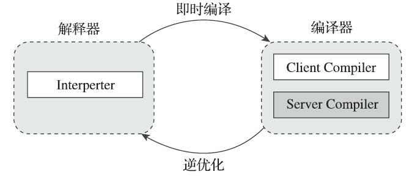

图11-1　解释器与编译器的交互

HotSpot虚拟机中内置了两个（或三个）即时编译器，其中有两个编译器存在已久，分别被称为“客户端编译器”（Client Compiler）和“服务端编译器”（Server Compiler），或者简称为C1编译器和C2编译器（部分资料和JDK源码中C2也叫Opto编译器），第三个是在JDK 10时才出现的、长期目标是代替C2的Graal编译器。Graal编译器目前还处于实验状态，本章将安排出专门的小节对它讲解与实战，在本节里，我们将重点关注传统的C1、C2编译器的工作过程。

在分层编译（Tiered Compilation）的工作模式出现以前，HotSpot虚拟机通常是采用解释器与其中一个编译器直接搭配的方式工作，程序使用哪个编译器，只取决于虚拟机运行的模式，HotSpot虚拟机会根据自身版本与宿主机器的硬件性能自动选择运行模式，用户也可以使用“-client”或“-server”参数去强制指定虚拟机运行在客户端模式还是服务端模式。

无论采用的编译器是客户端编译器还是服务端编译器，解释器与编译器搭配使用的方式在虚拟机中被称为“混合模式”（Mixed Mode），用户也可以使用参数“-Xint”强制虚拟机运行于“解释模式”（Interpreted Mode），这时候编译器完全不介入工作，全部代码都使用解释方式执行。另外，也可以使用参数“-Xcomp”强制虚拟机运行于“编译模式”（Compiled Mode），这时候将优先采用编译方式执行程序，但是解释器仍然要在编译无法进行的情况下介入执行过程。可以通过虚拟机的“-version”命令的输出结果显示出这三种模式，内容如代码清单11-1所示，请读者注意黑体字部分。

代码清单11-1　虚拟机执行模式

```java
$java -version
java version "11.0.3" 2019-04-16 LTS
Java(TM) SE Runtime Environment 18.9 (build 11.0.3+12-LTS)
Java HotSpot(TM) 64-Bit Server VM 18.9 (build 11.0.3+12-LTS, mixed mode)
$java -Xint -version
java version "11.0.3" 2019-04-16 LTS
Java(TM) SE Runtime Environment 18.9 (build 11.0.3+12-LTS)
Java HotSpot(TM) 64-Bit Server VM 18.9 (build 11.0.3+12-LTS, interpreted mode)
$java -Xcomp -version
java version "11.0.3" 2019-04-16 LTS
Java(TM) SE Runtime Environment 18.9 (build 11.0.3+12-LTS)
Java HotSpot(TM) 64-Bit Server VM 18.9 (build 11.0.3+12-LTS, compiled mode)
```

由于即时编译器编译本地代码需要占用程序运行时间，通常要编译出优化程度越高的代码，所花费的时间便会越长；而且想要编译出优化程度更高的代码，解释器可能还要替编译器收集性能监控信息，这对解释执行阶段的速度也有所影响。为了在程序启动响应速度与运行效率之间达到最佳平衡，HotSpot虚拟机在编译子系统中加入了分层编译的功能[^section-11-2-1-note-2]，分层编译的概念其实很早就已经提出，但直到JDK 6时期才被初步实现，后来一直处于改进阶段，最终在JDK 7的服务端模式虚拟机中作为默认编译策略被开启。分层编译根据编译器编译、优化的规模与耗时，划分出不同的编译层次，其中包括：

- 第0层。程序纯解释执行，并且解释器不开启性能监控功能（Profiling）。
- 第1层。使用客户端编译器将字节码编译为本地代码来运行，进行简单可靠的稳定优化，不开启性能监控功能。
- 第2层。仍然使用客户端编译器执行，仅开启方法及回边次数统计等有限的性能监控功能。
- 第3层。仍然使用客户端编译器执行，开启全部性能监控，除了第2层的统计信息外，还会收集如分支跳转、虚方法调用版本等全部的统计信息。
- 第4层。使用服务端编译器将字节码编译为本地代码，相比起客户端编译器，服务端编译器会启用更多编译耗时更长的优化，还会根据性能监控信息进行一些不可靠的激进优化。

以上层次并不是固定不变的，根据不同的运行参数和版本，虚拟机可以调整分层的数量。各层次编译之间的交互、转换关系如图11-2所示。

实施分层编译后，解释器、客户端编译器和服务端编译器就会同时工作，热点代码都可能会被多次编译，用客户端编译器获取更高的编译速度，用服务端编译器来获取更好的编译质量，在解释执行的时候也无须额外承担收集性能监控信息的任务，而在服务端编译器采用高复杂度的优化算法时，客户端编译器可先采用简单优化来为它争取更多的编译时间。

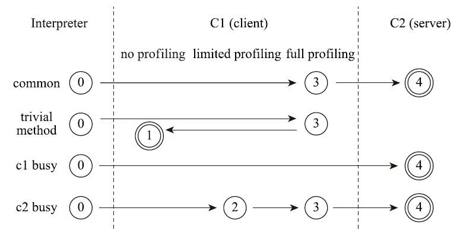

图11-2　分层编译的交互关系[^section-11-2-1-note-3]

[^section-11-2-1-note-1]: 作为曾经的三大商用虚拟机之一的JRockit是个例外，它内部没有解释器，因此会存在本书中所说的“启动响应时间长”之类的缺点，但它主要是面向服务端的应用，这类应用一般不会重点关注启动时间，而且JRockit目前已经不再发展了。
[^section-11-2-1-note-2]: 分层编译在JDK 6时期出现，到JDK 7之前都需要使用-XX:+TieredCompilation参数来手动开启，如果不开启分层编译策略，而虚拟机又运行在服务端模式，服务端编译器需要性能监控信息提供编译依据，则是由解释器收集性能监控信息供服务端编译器使用。分层编译的相关资料可参见：http://weblogs.java.net/blog/forax/archive/2010/09/04/tiered-compilation。
[^section-11-2-1-note-3]: 图片来源：https://www.infoq.cn/article/java-10-jit-compiler-graal/。

#### 11.2.2　编译对象与触发条件

在本章概述中提到了在运行过程中会被即时编译器编译的目标是“热点代码”，这里所指的热点代码主要有两类，包括：

- 被多次调用的方法。
- 被多次执行的循环体。

前者很好理解，一个方法被调用得多了，方法体内代码执行的次数自然就多，它成为“热点代码”是理所当然的。而后者则是为了解决当一个方法只被调用过一次或少量的几次，但是方法体内部存在循环次数较多的循环体，这样循环体的代码也被重复执行多次，因此这些代码也应该认为是“热点代码”[^section-11-2-2-note-1]。

对于这两种情况，编译的目标对象都是整个方法体，而不会是单独的循环体。第一种情况，由于是依靠方法调用触发的编译，那编译器理所当然地会以整个方法作为编译对象，这种编译也是虚拟机中标准的即时编译方式。而对于后一种情况，尽管编译动作是由循环体所触发的，热点只是方法的一部分，但编译器依然必须以整个方法作为编译对象，只是执行入口（从方法第几条字节码指令开始执行）会稍有不同，编译时会传入执行入口点字节码序号（Byte Code Index，BCI）。这种编译方式因为编译发生在方法执行的过程中，因此被很形象地称为“栈上替换”（On Stack Replacement，OSR），即方法的栈帧还在栈上，方法就被替换了。

读者可能还会有疑问，在上面的描述里，无论是“多次执行的方法”，还是“多次执行的代码块”，所谓“多次”只定性不定量，并不是一个具体严谨的用语，那到底多少次才算“多次”呢？还有一个问题，就是Java虚拟机是如何统计某个方法或某段代码被执行过多少次的呢？解决了这两个问题，也就解答了即时编译被触发的条件。

要知道某段代码是不是热点代码，是不是需要触发即时编译，这个行为称为“热点探测”（Hot Spot Code Detection），其实进行热点探测并不一定要知道方法具体被调用了多少次，目前主流的热点探测判定方式有两种[^section-11-2-2-note-2]，分别是：

- 基于采样的热点探测（Sample Based Hot Spot Code Detection）。采用这种方法的虚拟机会周期性地检查各个线程的调用栈顶，如果发现某个（或某些）方法经常出现在栈顶，那这个方法就是“热点方法”。基于采样的热点探测的好处是实现简单高效，还可以很容易地获取方法调用关系（将调用堆栈展开即可），缺点是很难精确地确认一个方法的热度，容易因为受到线程阻塞或别的外界因素的影响而扰乱热点探测。
- 基于计数器的热点探测（Counter Based Hot Spot Code Detection）。采用这种方法的虚拟机会为每个方法（甚至是代码块）建立计数器，统计方法的执行次数，如果执行次数超过一定的阈值就认为它是“热点方法”。这种统计方法实现起来要麻烦一些，需要为每个方法建立并维护计数器，而且不能直接获取到方法的调用关系。但是它的统计结果相对来说更加精确严谨。

这两种探测手段在商用Java虚拟机中都有使用到，譬如J9用过第一种采样热点探测，而在HotSpot虚拟机中使用的是第二种基于计数器的热点探测方法，为了实现热点计数，HotSpot为每个方法准备了两类计数器：方法调用计数器（Invocation Counter）和回边计数器（Back Edge Counter，“回边”的意思就是指在循环边界往回跳转）。当虚拟机运行参数确定的前提下，这两个计数器都有一个明确的阈值，计数器阈值一旦溢出，就会触发即时编译。

我们首先来看看方法调用计数器。顾名思义，这个计数器就是用于统计方法被调用的次数，它的默认阈值在客户端模式下是1500次，在服务端模式下是10000次，这个阈值可以通过虚拟机参数-XX:CompileThreshold来人为设定。当一个方法被调用时，虚拟机会先检查该方法是否存在被即时编译过的版本，如果存在，则优先使用编译后的本地代码来执行。如果不存在已被编译过的版本，则将该方法的调用计数器值加一，然后判断方法调用计数器与回边计数器值之和是否超过方法调用计数器的阈值。一旦已超过阈值的话，将会向即时编译器提交一个该方法的代码编译请求。

如果没有做过任何设置，执行引擎默认不会同步等待编译请求完成，而是继续进入解释器按照解释方式执行字节码，直到提交的请求被即时编译器编译完成。当编译工作完成后，这个方法的调用入口地址就会被系统自动改写成新值，下一次调用该方法时就会使用已编译的版本了，整个即时编译的交互过程如图11-3所示。

在默认设置下，方法调用计数器统计的并不是方法被调用的绝对次数，而是一个相对的执行频率，即一段时间之内方法被调用的次数。当超过一定的时间限度，如果方法的调用次数仍然不足以让它提交给即时编译器编译，那该方法的调用计数器就会被减少一半，这个过程被称为方法调用计数器热度的衰减（Counter Decay），而这段时间就称为此方法统计的半衰周期（Counter Half Life Time），进行热度衰减的动作是在虚拟机进行垃圾收集时顺便进行的，可以使用虚拟机参数-XX:-UseCounterDecay来关闭热度衰减，让方法计数器统计方法调用的绝对次数，这样只要系统运行时间足够长，程序中绝大部分方法都会被编译成本地代码。另外还可以使用-XX:CounterHalfLifeTime参数设置半衰周期的时间，单位是秒。

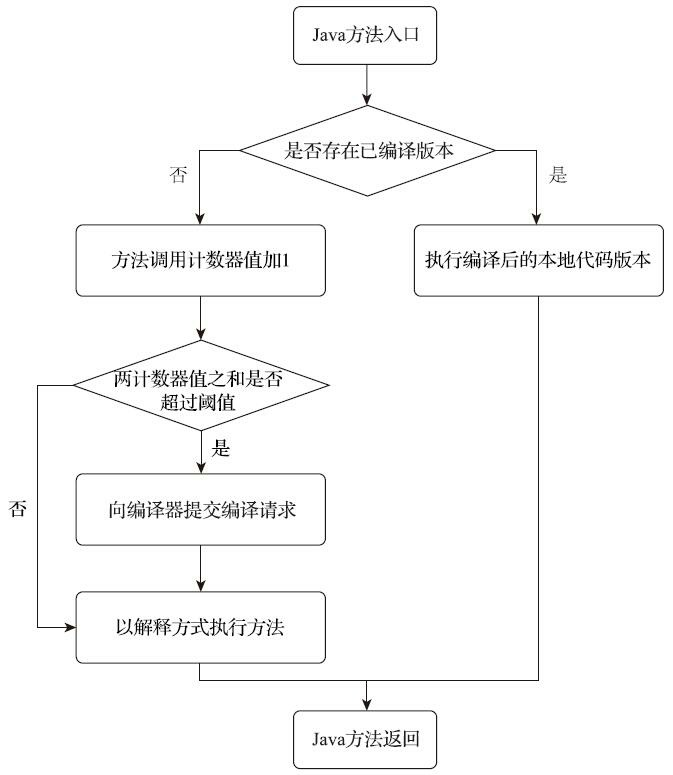

图11-3　方法调用计数器触发即时编译

现在我们再来看看另外一个计数器——回边计数器，它的作用是统计一个方法中循环体代码执行的次数[^section-11-2-2-note-3]，在字节码中遇到控制流向后跳转的指令就称为“回边（Back Edge）”，很显然建立回边计数器统计的目的是为了触发栈上的替换编译。

关于回边计数器的阈值，虽然HotSpot虚拟机也提供了一个类似于方法调用计数器阈值-XX:CompileThreshold的参数-XX:BackEdgeThreshold供用户设置，但是当前的HotSpot虚拟机实际上并未使用此参数，我们必须设置另外一个参数-XX:OnStackReplacePercentage来间接调整回边计数器的阈值，其计算公式有如下两种。

- 虚拟机运行在客户端模式下，回边计数器阈值计算公式为：方法调用计数器阈值（-XX:CompileThreshold）乘以OSR比率（-XX:OnStackReplacePercentage）除以100。其中-XX:OnStackReplacePercentage默认值为933，如果都取默认值，那客户端模式虚拟机的回边计数器的阈值为13995。
- 虚拟机运行在服务端模式下，回边计数器阈值的计算公式为：方法调用计数器阈值（-XX:CompileThreshold）乘以（OSR比率（-XX:OnStackReplacePercentage）减去解释器监控比率（-XX:InterpreterProfilePercentage）的差值）除以100。其中-XX:OnStack ReplacePercentage默认值为140，-XX:InterpreterProfilePercentage默认值为33，如果都取默认值，那服务端模式虚拟机回边计数器的阈值为10700。

当解释器遇到一条回边指令时，会先查找将要执行的代码片段是否有已经编译好的版本，如果有的话，它将会优先执行已编译的代码，否则就把回边计数器的值加一，然后判断方法调用计数器与回边计数器值之和是否超过回边计数器的阈值。当超过阈值的时候，将会提交一个栈上替换编译请求，并且把回边计数器的值稍微降低一些，以便继续在解释器中执行循环，等待编译器输出编译结果，整个执行过程如图11-4所示。

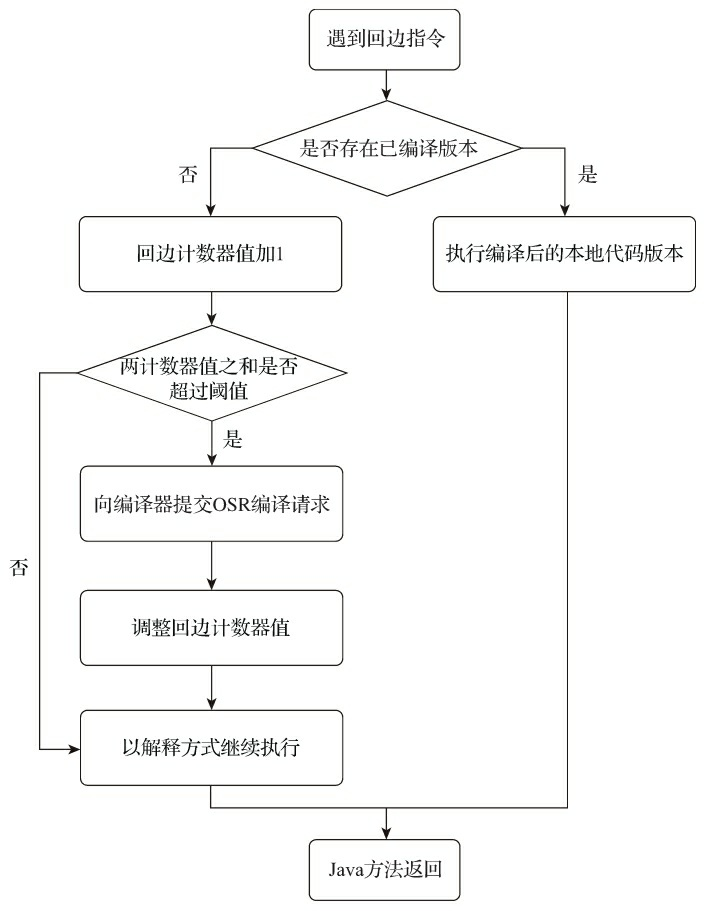

图11-4　回边计数器触发即时编译

与方法计数器不同，回边计数器没有计数热度衰减的过程，因此这个计数器统计的就是该方法循环执行的绝对次数。当计数器溢出的时候，它还会把方法计数器的值也调整到溢出状态，这样下次再进入该方法的时候就会执行标准编译过程。

最后还要提醒一点，图11-2和图11-3都仅仅是描述了客户端模式虚拟机的即时编译方式，对于服务端模式虚拟机来说，执行情况会比上面描述还要复杂一些。从理论上了解过编译对象和编译触发条件后，我们还可以从HotSpot虚拟机的源码中简单观察一下这两个计数器，在MehtodOop.hpp（一个methodOop对象代表了一个Java方法）中，定义了Java方法在虚拟机中的内存布局，如下所示：

```cpp
// |------------------------------------------------------|
// | header                                               |
// | klass                                                |
// |------------------------------------------------------|
// | constMethodOop                 (oop)                 |
// | constants                      (oop)                 |
// |------------------------------------------------------|
// | methodData                     (oop)                 |
// | interp_invocation_count                              |
// |------------------------------------------------------|
// | access_flags                                         |
// | vtable_index                                         |
// |------------------------------------------------------|
// | result_index (C++ interpreter only)                  |
// |------------------------------------------------------|
// | method_size             | max_stack                  |
// | max_locals              | size_of_parameters         |
// |------------------------------------------------------|
// |intrinsic_id|   flags    |  throwout_count            |
// |------------------------------------------------------|
// | num_breakpoints         |  (unused)                  |
// |------------------------------------------------------|
// | invocation_counter                                   |
// | backedge_counter                                     |
// |------------------------------------------------------|
// |           prev_time (tiered only, 64 bit wide)       |
// |                                                      |
// |------------------------------------------------------|
// |                  rate (tiered)                       |
// |------------------------------------------------------|
// | code                           (pointer)             |
// | i2i                            (pointer)             |
// | adapter                        (pointer)             |
// | from_compiled_entry            (pointer)             |
// | from_interpreted_entry         (pointer)             |
// |------------------------------------------------------|
// | native_function       (present only if native)       |
// | signature_handler     (present only if native)       |
// |------------------------------------------------------|
```

在这段注释所描述的方法内存布局里，每一行表示占用32个比特，从中我们可以清楚看到方法调用计数器和回边计数器所在的位置和数据宽度，另外还有from_compiled_entry和from_interpreted_entry两个方法入口所处的位置。

[^section-11-2-2-note-1]: 还有一个不太上台面但其实是Java虚拟机必须支持循环体触发编译的理由，是诸多跑分软件的测试用力通常都属于第二种，如果不去支持跑分会显得成绩很不好看。
[^section-11-2-2-note-2]: 除这两种方式外，还有其他热点代码的探测方式，如基于“踪迹”（Trace）的热点探测在最近相当流行，像FireFox里的TraceMonkey和Dalvik里新的即时编译器都是用了这种热点探测方式。<br>
[^section-11-2-2-note-3]: 准确地说，应当是回边的次数而不是循环次数，因为并非所有的循环都是回边，如空循环实际上就可以视为自己跳转到自己的过程，因此并不算作控制流向后跳转，也不会被回边计数器统计。

#### 11.2.3　编译过程

在默认条件下，无论是方法调用产生的标准编译请求，还是栈上替换编译请求，虚拟机在编译器还未完成编译之前，都仍然将按照解释方式继续执行代码，而编译动作则在后台的编译线程中进行。用户可以通过参数-XX:-BackgroundCompilation来禁止后台编译，后台编译被禁止后，当达到触发即时编译的条件时，执行线程向虚拟机提交编译请求以后将会一直阻塞等待，直到编译过程完成再开始执行编译器输出的本地代码。

那在后台执行编译的过程中，编译器具体会做什么事情呢？服务端编译器和客户端编译器的编译过程是有所差别的。对于客户端编译器来说，它是一个相对简单快速的三段式编译器，主要的关注点在于局部性的优化，而放弃了许多耗时较长的全局优化手段。

在第一个阶段，一个平台独立的前端将字节码构造成一种高级中间代码表示（High-Level Intermediate Representation，HIR，即与目标机器指令集无关的中间表示）。HIR使用静态单分配（Static Single Assignment，SSA）的形式来代表代码值，这可以使得一些在HIR的构造过程之中和之后进行的优化动作更容易实现。在此之前编译器已经会在字节码上完成一部分基础优化，如方法内联、常量传播等优化将会在字节码被构造成HIR之前完成。

在第二个阶段，一个平台相关的后端从HIR中产生低级中间代码表示（Low-Level Intermediate Representation，LIR，即与目标机器指令集相关的中间表示），而在此之前会在HIR上完成另外一些优化，如空值检查消除、范围检查消除等，以便让HIR达到更高效的代码表示形式。

最后的阶段是在平台相关的后端使用线性扫描算法（Linear Scan Register Allocation）在LIR上分配寄存器，并在LIR上做窥孔（Peephole）优化，然后产生机器代码。客户端编译器大致的执行过程如图11-5所示。

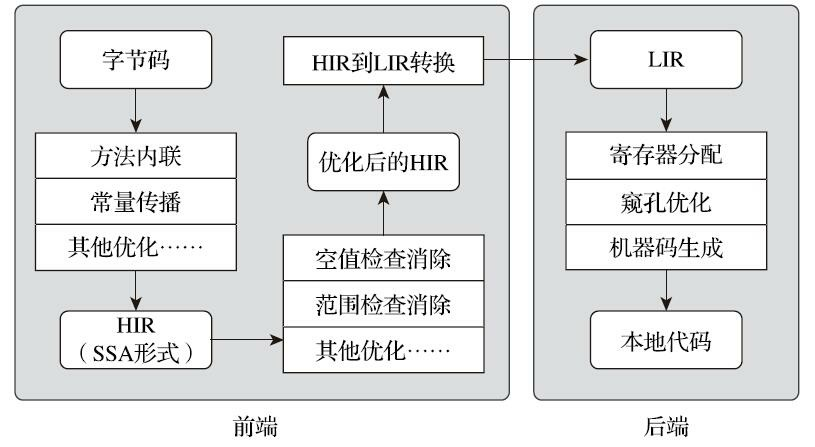

图11-5　Client Compiler架构

而服务端编译器则是专门面向服务端的典型应用场景，并为服务端的性能配置针对性调整过的编译器，也是一个能容忍很高优化复杂度的高级编译器，几乎能达到GNU C++编译器使用-O2参数时的优化强度。它会执行大部分经典的优化动作，如：无用代码消除（Dead Code Elimination）、循环展开（Loop Unrolling）、循环表达式外提（Loop Expression Hoisting）、消除公共子表达式（Common Subexpression Elimination）、常量传播（Constant Propagation）、基本块重排序（Basic Block Reordering）等，还会实施一些与Java语言特性密切相关的优化技术，如范围检查消除（Range Check Elimination）、空值检查消除（Null Check Elimination，不过并非所有的空值检查消除都是依赖编译器优化的，有一些是代码运行过程中自动优化了）等。另外，还可能根据解释器或客户端编译器提供的性能监控信息，进行一些不稳定的预测性激进优化，如守护内联（Guarded Inlining）、分支频率预测（Branch Frequency Prediction）等，本章的下半部分将会挑选上述的一部分优化手段进行分析讲解，在此就先不做展开。

服务端编译采用的寄存器分配器是一个全局图着色分配器，它可以充分利用某些处理器架构（如RISC）上的大寄存器集合。以即时编译的标准来看，服务端编译器无疑是比较缓慢的，但它的编译速度依然远远超过传统的静态优化编译器，而且它相对于客户端编译器编译输出的代码质量有很大提高，可以大幅减少本地代码的执行时间，从而抵消掉额外的编译时间开销，所以也有很多非服务端的应用选择使用服务端模式的HotSpot虚拟机来运行。

在本节中出现了许多编译原理和代码优化中的概念名词，没有这方面基础的读者，可能阅读起来会感觉到很抽象、很理论化。有这种感觉并不奇怪，一方面，即时编译过程本来就是一个虚拟机中最能体现技术水平也是最复杂的部分，很难在几页纸的篇幅中介绍得面面俱到；另一方面，这个过程对Java开发者来说是完全透明的，程序员平时无法感知它的存在。所幸，HotSpot虚拟机提供了两个可视化的工具，让我们可以“看见”即时编译器的优化过程。下面笔者将实践演示这个过程。

#### 11.2.4　实战：查看及分析即时编译结果

一般来说，Java虚拟机的即时编译过程对用户和程序都是完全透明的，虚拟机是通过解释来执行代码还是通过编译来执行代码，对于用户来说并没有什么影响（对执行结果没有影响，速度上会有显著差别），大多数情况下用户也没有必要知道。但是HotSpot虚拟机还是提供了一些参数用来输出即时编译和某些优化措施的运行状况，以满足调试和调优的需要。本节将通过实战说明如何从外部观察Java虚拟机的即时编译行为。

本节中提到的部分运行参数需要FastDebug或SlowDebug优化级别的HotSpot虚拟机才能够支持，Product级别的虚拟机无法使用这部分参数。如果读者使用的是根据第1章的教程自己编译的JDK，请注意将“--with-debug-level”参数设置为“fastdebug”或者“slowdebug”。现在Oracle和OpenJDK网站上都已经不再直接提供FastDebug的JDK下载了（从JDK 6 Update 25之后官网上就没有再提供下载），所以要完成本节全部测试内容，读者除了自己动手编译外，就只能到网上搜索非官方编译的版本了。本次实战中所有的测试都基于代码清单11-2所示的Java代码来进行。

代码清单11-2　测试代码

```java
public static final int NUM = 15000;
public static int doubleValue(int i) {
    // 这个空循环用于后面演示JIT代码优化过程
    for(int j=0; j<100000; j++);
    return i * 2;
}
public static long calcSum() {
    long sum = 0;
    for (int i = 1; i <= 100; i++) {
        sum += doubleValue(i);
    }
    return sum;
}
public static void main(String[] args) {
    for (int i = 0; i < NUM; i++) {
        calcSum();
    }
}
```

我们首先来运行这段代码，并且确认这段代码是否触发了即时编译。要知道某个方法是否被编译过，可以使用参数-XX:+PrintCompilation要求虚拟机在即时编译时将被编译成本地代码的方法名称打印出来，如代码清单11-3所示（其中带有“%”的输出说明是由回边计数器触发的栈上替换编译）。

代码清单11-3　被即时编译的代码

```cpp
VM option '+PrintCompilation'
    310   1       java.lang.String::charAt (33 bytes)
    329   2       org.fenixsoft.jit.Test::calcSum (26 bytes)
    329   3       org.fenixsoft.jit.Test::doubleValue (4 bytes)
    332   1%      org.fenixsoft.jit.Test::main @ 5 (20 bytes)
```

从代码清单11-3输出的信息中可以确认，main()、calcSum()和doubleValue()方法已经被编译，我们还可以加上参数-XX:+PrintInlining要求虚拟机输出方法内联信息，如代码清单11-4所示。

代码清单11-4　内联信息

```cpp
VM option '+PrintCompilation'
VM option '+PrintInlining'
    273   1       java.lang.String::charAt (33 bytes)
    291   2       org.fenixsoft.jit.Test::calcSum (26 bytes)
      @   9       org.fenixsoft.jit.Test::doubleValue  inline (hot)
    294   3       org.fenixsoft.jit.Test::doubleValue (4 bytes)
    295   1%      org.fenixsoft.jit.Test::main @ 5 (20 bytes)
      @   5       org.fenixsoft.jit.Test::calcSum  inline (hot)
      @   9       org.fenixsoft.jit.Test::doubleValue  inline (hot)
```

从代码清单11-4的输出日志中可以看到，doubleValue()方法已被内联编译到calcSum()方法中，而calcSum()方法又被内联编译到main()方法里面，所以虚拟机再次执行main()方法的时候（举例而已，main()方法当然不会运行两次），calcSum()和doubleValue()方法是不会再被实际调用的，没有任何方法分派的开销，它们的代码逻辑都被直接内联到main()方法里面了。

除了查看哪些方法被编译之外，我们还可以更进一步看到即时编译器生成的机器码内容。不过如果得到的是即时编译器输出一串0和1，对于我们人类来说是没法阅读的，机器码至少要反汇编成基本的汇编语言才可能被人类阅读。虚拟机提供了一组通用的反汇编接口[^section-5-note-1]，可以接入各种平台下的反汇编适配器，如使用32位x86平台应选用hsdis-i386适配器，64位则需要选用hsdis-amd64[^section-5-note-2]，其余平台的适配器还有如hsdis-sparc、hsdis-sparcv9和hsdis-aarch64等，读者可以下载或自己编译出与自己机器相符合的反汇编适配器，之后将其放置在JAVA_HOME/lib/amd64/server下[^section-5-note-3]，只要与jvm.dll或libjvm.so的路径相同即可被虚拟机调用。为虚拟机安装了反汇编适配器之后，我们就可以使用-XX:+PrintAssembly参数要求虚拟机打印编译方法的汇编代码了，关于HSDIS插件更多的操作介绍，可以参考第4章的相关内容。

如果没有HSDIS插件支持，也可以使用-XX:+PrintOptoAssembly（用于服务端模式的虚拟机）或-XX:+PrintLIR（用于客户端模式的虚拟机）来输出比较接近最终结果的中间代码表示，代码清单11-2所示代码被编译后部分反汇编（使用-XX:+PrintOptoAssembly）的输出结果如代码清单11-5所示。对于阅读来说，使用-XX:+PrintOptoAssembly参数输出的伪汇编结果包含了更多的信息（主要是注释），有利于人们阅读、理解虚拟机即时编译器的优化结果。

代码清单11-5　本地机器码反汇编信息（部分）

```text
…… ……
000   B1: #       N1 <- BLOCK HEAD IS JUNK   Freq: 1
000       pushq   rbp
          subq    rsp, #16    # Create frame
          nop     # nop for patch_verified_entry
006       movl    RAX, RDX    # spill
008       sall    RAX, #1
00a       addq    rsp, 16     # Destroy frame
          popq    rbp
          testl   rax, [rip + #offset_to_poll_page]    # Safepoint: poll for GC
…… ……
```

前面提到的使用-XX:+PrintAssembly参数输出反汇编信息需要FastDebug或SlowDebug优化级别的HotSpot虚拟机才能直接支持，如果使用Product版的虚拟机，则需要加入参数-XX:+UnlockDiagnosticVMOptions打开虚拟机诊断模式。

如果除了本地代码的生成结果外，还想再进一步跟踪本地代码生成的具体过程，那可以使用参数-XX:+PrintCFGToFile（用于客户端编译器）或-XX:PrintIdealGraphFile（用于服务端编译器）要求Java虚拟机将编译过程中各个阶段的数据（譬如对客户端编译器来说包括字节码、HIR生成、LIR生成、寄存器分配过程、本地代码生成等数据）输出到文件中。然后使用Java HotSpot Client Compiler Visualizer[^section-5-note-4]（用于分析客户端编译器）或Ideal Graph Visualizer[^section-5-note-5]（用于分析服务端编译器）打开这些数据文件进行分析。接下来将以使用服务端编译器为例，讲解如何分析即时编译的代码生成过程。这里先把重点放在编译整体过程阶段及Ideal Graph Visualizer功能介绍上，在稍后在介绍Graal编译器的实战小节里，我们会使用Ideal Graph Visualizer来详细分析虚拟机进行代码优化和生成时的执行细节，届时我们将重点关注编译器是如何实现这些优化的。

服务端编译器的中间代码表示是一种名为理想图（Ideal Graph）的程序依赖图（Program Dependence Graph，PDG），在运行Java程序的FastDebug或SlowDebug优化级别的虚拟机上的参数中加入“-XX:PrintIdealGraphLevel=2-XX:PrintIdealGraphFile=ideal.xml”，即时编译后将会产生一个名为ideal.xml的文件，它包含了服务端编译器编译代码的全过程信息，可以使用Ideal Graph Visualizer对这些信息进行分析。

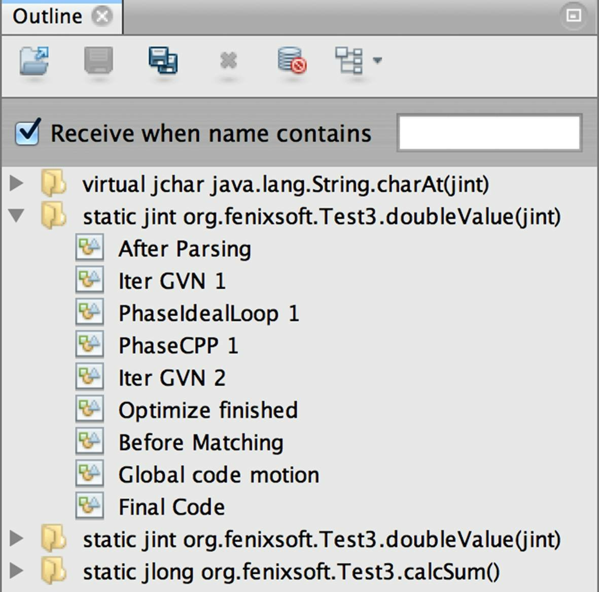

图11-6　编译过的方法列表

Ideal Graph Visualizer加载ideal.xml文件后，在Outline面板上将显示程序运行过程中编译过的方法列表，如图11-6所示。这里列出的方法是代码清单11-2中所示的测试代码，其中doubleValue()方法出现了两次，这是由于该方法的编译结果存在标准编译和栈上替换编译两个版本。在代码清单11-2中，专门为doubleValue()方法增加了一个空循环，这个循环对方法的运算结果不会产生影响，但如果没有任何优化，执行该循环就会耗费处理器时间。直到今天还有不少程序设计的入门教程会把空循环当作程序延时的手段来介绍，下面我们就来看看在Java语言中这样的做法是否真的能起到延时的作用。

展开方法根节点，可以看到下面罗列了方法优化过程的各个阶段（根据优化措施的不同，每个方法所经过的阶段也会有所差别）的理想图，我们先打开“After Parsing”这个阶段。前面提到，即时编译器编译一个Java方法时，首先要把字节码解析成某种中间表示形式，然后才可以继续做分析和优化，最终生成代码。“After Parsing”就是服务端编译器刚完成解析，还没有做任何优化时的理想图表示。打开这个图后，读者会看到其中有很多有颜色的方块，如图11-7所示。每一个方块代表了一个程序的基本块（Basic Block）。基本块是指程序按照控制流分割出来的最小代码块，它的特点是只有唯一的一个入口和唯一的一个出口，只要基本块中第一条指令被执行了，那么基本块内所有指令都会按照顺序全部执行一次。

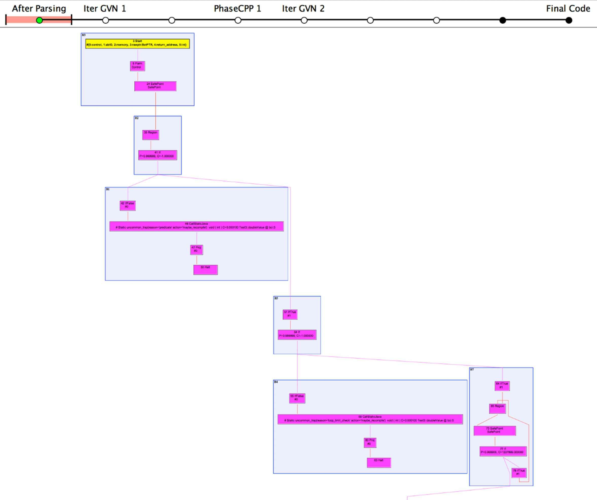

图11-7　基本块图示（1）

代码清单11-2所示的doubleValue()方法虽然只有简单的两行字，但是按基本块划分后，形成的图形结构却要比想象中复杂得多，这是因为一方面要满足Java语言所定义的安全需要（如类型安全、空指针检查）和Java虚拟机的运作需要（如Safepoint轮询），另一方面有些程序代码中一行语句就可能形成几个基本块（例如循环语句）。对于例子中的doubleValue()方法，如果忽略语言安全检查的基本块，可以简单理解为按顺序执行了以下几件事情：

1. 程序入口，建立栈帧。
2. 设置j=0，进行安全点（Safepoint）轮询，跳转到4的条件检查。
3. 执行j++。
4. 条件检查，如果j<100000，跳转到3。
5. 设置i=i*2，进行安全点轮询，函数返回。

以上几个步骤反映到Ideal Graph Visualizer生成的图形上，就是图11-8所示的内容。这样我们若想看空循环是否被优化掉，或者何时被优化掉，只要观察代表循环的基本块是否被消除掉，以及何时被优化掉就可以了。

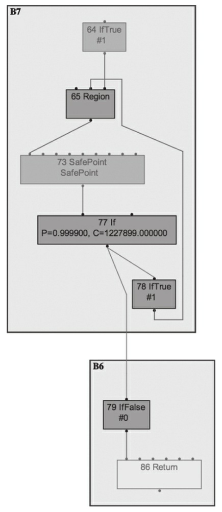

图11-8　基本块图示（2）

要观察这一点，可以在Outline面板上右击“Difference to current graph”，让软件自动分析指定阶段与当前打开的理想图之间的差异，如果基本块被消除了，将会以红色显示。对“After Parsing”和“PhaseIdealLoop 1”阶段的理想图进行差异分析，会发现在“PhaseIdealLoop 1”阶段循环操作就被消除了，如图11-9所示，这也就说明空循环在最终的本地代码里实际上是不会被执行的。

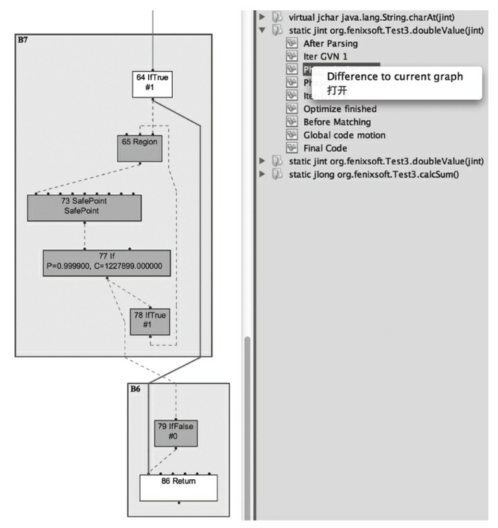

图11-9　基本块图示（3）

从“After Parsing”阶段开始，一直到最后的“Final Code”阶段都可以看到doubleValue()方法的理想图从繁到简的变迁过程，这也反映了Java虚拟机即时编译器尽力优化代码的过程。到了最后的“Final Code”阶段，不仅空循环的开销被消除了，许多语言安全保障措施和GC安全点的轮询操作也被一起消除了，因为编译器判断到即使不做这些保障措施，程序也能得到相同的结果，不会有可观察到的副作用产生，虚拟机的运行安全也不会受到威胁。

[^section-5-note-1]: 相关信息：https://wiki.openjdk.java.net/display/HotSpot/PrintAssembly。
[^section-5-note-2]: HSDIS的源码可以从HotSpot虚拟机源码仓库中获取（路径为：src\utils\hsdis），具体可以参见第1章。此源码需要执行编译，对于HSDIS的编译，读者可以参考AdoptOpenJDK的官方GitHub：https://github.com/AdoptOpenJDK/jitwatch/wiki/Building-hsdis/。如果不想自己编译，在GitHub上搜索“hsdis-i386.so/dll”“hsdis-amd64.so/dll”这样的关键词也可以找到不少编译好的Linux或Windows的HSDIS插件。
[^section-5-note-3]: 如果使用JDK 8或之前版本，应放在JRE_HOME/bin/server目录下。
[^section-5-note-4]: 官方站点：http://ssw.jku.at/Research/Projects/JVM/CCVis.html。
[^section-5-note-5]: 官方站点：http://ssw.jku.at/General/Staff/TW/igv.html。

### 11.3　提前编译器

提前编译在Java技术体系中并不是新事物。1996年JDK 1.0发布，Java有了正式的运行环境，第一个可以使用外挂即时编译器的Java版本是1996年7月发布的JDK 1.0.2，而Java提前编译器的诞生并没有比这晚多少。仅几个月后，IBM公司就推出了第一款用于Java语言的提前编译器（IBM High Performance Compiler for Java）。在1998年，GNU组织公布了著名的GCC家族（GNU Compiler Collection）的新成员GNU Compiler for Java（GCJ，2018年从GCC家族中除名），这也是一款Java的提前编译器[^section-11-3-note-1]，而且曾经被广泛应用。在OpenJDK流行起来之前，各种Linux发行版带的Java实现通常就是GCJ。

但是提前编译很快又在Java世界里沉寂了下来，因为当时Java的一个核心优势是平台中立性，其宣传口号是“一次编译，到处运行”，这与平台相关的提前编译在理念上就是直接冲突的。GCJ出现之后在长达15年的时间里，提前编译这条故事线上基本就再没有什么大的新闻和进展了。类似的状况一直持续至2013年，直到在Android的世界里，剑走偏锋使用提前编译的ART（Android Runtime）横空出世。ART一诞生马上就把使用即时编译的Dalvik虚拟机按在地上使劲蹂躏，仅经过Android 4.4一个版本的短暂交锋之后，ART就迅速终结了Dalvik的性命[^section-11-3-note-2]，把它从Android系统里扫地出门。

尽管Android并不能直接等同于Java，但两者毕竟有着深厚渊源，提前编译在Android上的革命与崛起也震撼到了Java世界。在某些领域、某些人眼里，只要能获得更好的执行性能，什么平台中立性、字节膨胀[^section-11-3-note-3]、动态扩展[^section-11-3-note-4]，一切皆可舍弃，唯一的问题就只有“提前编译真的会是获得更高性能的银弹吗？”

[^section-11-3-note-1]: GCJ其实包含了整个Java运行时，里面也有解释器和即时编译器存在。
[^section-11-3-note-2]: ART干掉Dalvik之后，到Android 7.0时其内部也加入了解释执行和即时编译，这是后话。
[^section-11-3-note-3]: 指提前编译的本地二进制码的体积会明显大于字节码的体积。
[^section-11-3-note-4]: 指提前编译通常要求程序是封闭的，不能在外部动态加载新的字节码。

#### 11.3.1　提前编译的优劣得失

本节希望同时向读者展示出一枚硬币的两面，解释清楚提前编译相对于即时编译有什么优势，又有什么不足，还有即时编译器有没有办法得到这些优势，需要付出哪些努力等。

现在提前编译产品和对其的研究有着两条明显的分支，一条分支是做与传统C、C++编译器类似的，在程序运行之前把程序代码编译成机器码的静态翻译工作；另外一条分支是把原本即时编译器在运行时要做的编译工作提前做好并保存下来，下次运行到这些代码（譬如公共库代码在被同一台机器其他Java进程使用）时直接把它加载进来使用。

我们先来说第一条，这是传统的提前编译应用形式，它在Java中存在的价值直指即时编译的最大弱点：即时编译要占用程序运行时间和运算资源。即使现在先进的即时编译器已经足够快，以至于能够容忍相当高的优化复杂度了（譬如Azul公司基于LLVM的Falcon JIT，就能够以相当于Clang-O3的优化级别进行即时编译；又譬如OpenJ9的即时编译器Testarossa，它的静态版本同时也作为C、C++语言的提前编译器使用，优化的复杂度自然也支持得非常高）；即使现在先进的即时编译器架构有了分层编译的支持，可以先用快速但低质量的即时编译器为高质量的即时编译器争取出更多编译时间，但是，无论如何，即时编译消耗的时间都是原本可用于程序运行的时间，消耗的运算资源都是原本可用于程序运行的资源，这个约束从未减弱，更不会消失，始终是悬在即时编译头顶的达摩克利斯之剑。

这里举个更具体的例子来帮助读者理解这种约束：在编译过程中最耗时的优化措施之一是通过“过程间分析”（Inter-Procedural Analysis，IPA，也经常被称为全程序分析，即Whole Program Analysis）来获得诸如某个程序点上某个变量的值是否一定为常量、某段代码块是否永远不可能被使用、在某个点调用的某个虚方法是否只能有单一版本等的分析结论。这些信息对生成高质量的优化代码有着极为巨大的价值，但是要精确（譬如对流敏感、对路径敏感、对上下文敏感、对字段敏感）得到这些信息，必须在全程序范围内做大量极耗时的计算工作，目前所有常见的Java虚拟机对过程间分析的支持都相当有限，要么借助大规模的方法内联来打通方法间的隔阂，以过程内分析（Intra-Procedural Analysis，只考虑过程内部语句，不考虑过程调用的分析）来模拟过程间分析的部分效果；要么借助可假设的激进优化，不求得到精确的结果，只求按照最可能的状况来优化，有问题再退回来解析执行。但如果是在程序运行之前进行的静态编译，这些耗时的优化就可以放心大胆地进行了，譬如Graal VM中的Substrate VM，在创建本地镜像的时候，就会采取许多原本在HotSpot即时编译中并不会做的全程序优化措施[^section-11-3-1-note-1]以获得更好的运行时性能，反正做镜像阶段慢一点并没有什么大影响。同理，这也是ART打败Dalvik的主要武器之一，连副作用也是相似的。在Android 5.0和6.0版本，安装一个稍微大一点的Android应用都是按分钟来计时的，以至于从Android 7.0版本起重新启用了解释执行和即时编译（但这已与Dalvik无关，它彻底凉透了），等空闲时系统再在后台自动进行提前编译。

关于提前编译的第二条路径，本质是给即时编译器做缓存加速，去改善Java程序的启动时间，以及需要一段时间预热后才能到达最高性能的问题。这种提前编译被称为动态提前编译（Dynamic AOT）或者索性就大大方方地直接叫即时编译缓存（JIT Caching）。在目前的Java技术体系里，这条路径的提前编译已经完全被主流的商用JDK支持。在商业应用中，这条路径最早出现在JDK 6版本的IBM J9虚拟机上，那时候在它的CDS（Class Data Sharing）功能的缓存中就有一块是即时编译缓存[^section-11-3-1-note-2]。不过这个缓存和CDS缓存一样是虚拟机运行时自动生成的，直接来源于J9的即时编译器，而且为了进程兼容性，很多激进优化都不能肆意运用，所以编译输出的代码质量反而要低于即时编译器。真正引起业界普遍关注的是OpenJDK/OracleJDK 9中所带的Jaotc提前编译器，这是一个基于Graal编译器实现的新工具，目的是让用户可以针对目标机器，为应用程序进行提前编译。HotSpot运行时可以直接加载这些编译的结果，实现加快程序启动速度，减少程序达到全速运行状态所需时间的目的。这里面确实有比较大的优化价值，试想一下，各种Java应用最起码会用到Java的标准类库，如java.base等模块，如果能够将这个类库提前编译好，并进行比较高质量的优化，显然能够节约不少应用运行时的编译成本。关于这点，我们将在下一节做一个简单的实战练习，而在此要说明的是，这的确是很好的想法，但实际应用起来并不是那么容易，原因是这种提前编译方式不仅要和目标机器相关，甚至还必须与HotSpot虚拟机的运行时参数绑定。譬如虚拟机运行时采用了不同的垃圾收集器，这原本就需要即时编译子系统的配合（典型的如生成内存屏障代码，见第3章相关介绍）才能正确工作，要做提前编译的话，自然也要把这些配合的工作平移过去。至于前面提到过的提前编译破坏平台中立性、字节膨胀等缺点当然还存在，这里就不重复了。尽管还有许多困难，但提前编译无疑已经成为一种极限榨取性能（启动、响应速度）的手段，且被官方JDK关注，相信日后会更加灵活、更加容易使用，就如已经相当成熟的CDS（AppCDS需要用户参与）功能那样，几乎不需要用户介入，可自动完成。

最后，我们还要思考一个问题：提前编译的代码输出质量，一定会比即时编译更高吗？提前编译因为没有执行时间和资源限制的压力，能够毫无顾忌地使用重负载的优化手段，这当然是一个极大的优势，但即时编译难道就没有能与其竞争的强项了吗？当然是有的，尽管即时编译在时间和运算资源方面的劣势是无法忽视的，但其依然有自己的优势。接下来便要开始即时编译器的绝地反击了，笔者将简要介绍三种即时编译器相对于提前编译器的天然优势。

首先，是性能分析制导优化（Profile-Guided Optimization，PGO）。上一节介绍HotSpot的即时编译器时就多次提及在解释器或者客户端编译器运行过程中，会不断收集性能监控信息，譬如某个程序点抽象类通常会是什么实际类型、条件判断通常会走哪条分支、方法调用通常会选择哪个版本、循环通常会进行多少次等，这些数据一般在静态分析时是无法得到的，或者不可能存在确定且唯一的解，最多只能依照一些启发性的条件去进行猜测。但在动态运行时却能看出它们具有非常明显的偏好性。如果一个条件分支的某一条路径执行特别频繁，而其他路径鲜有问津，那就可以把热的代码集中放到一起，集中优化和分配更好的资源（分支预测、寄存器、缓存等）给它。

其次，是激进预测性优化（Aggressive Speculative Optimization），这也已经成为很多即时编译优化措施的基础。静态优化无论如何都必须保证优化后所有的程序外部可见影响（不仅仅是执行结果）与优化前是等效的，不然优化之后会导致程序报错或者结果不对，若出现这种情况，则速度再快也是没有价值的。然而，相对于提前编译来说，即时编译的策略就可以不必这样保守，如果性能监控信息能够支持它做出一些正确的可能性很大但无法保证绝对正确的预测判断，就已经可以大胆地按照高概率的假设进行优化，万一真的走到罕见分支上，大不了退回到低级编译器甚至解释器上去执行，并不会出现无法挽救的后果。只要出错概率足够低，这样的优化往往能够大幅度降低目标程序的复杂度，输出运行速度非常高的代码。譬如在Java语言中，默认方法都是虚方法调用，部分C、C++程序员（甚至一些老旧教材）会说虚方法是不能内联的，但如果Java虚拟机真的遇到虚方法就去查虚表而不做内联的话，Java技术可能就已经因性能问题而被淘汰很多年了。实际上虚拟机会通过类继承关系分析等一系列激进的猜测去做去虚拟化（Devitalization），以保证绝大部分有内联价值的虚方法都可以顺利内联。内联是最基础的一项优化措施，本章稍后还会对专门的Java虚拟机具体如何做虚方法内联进行详细讲解。

最后，是链接时优化（Link-Time Optimization，LTO），Java语言天生就是动态链接的，一个个Class文件在运行期被加载到虚拟机内存当中，然后在即时编译器里产生优化后的本地代码，这类事情在Java程序员眼里看起来毫无违和之处。但如果类似的场景出现在使用提前编译的语言和程序上，譬如C、C++的程序要调用某个动态链接库的某个方法，就会出现很明显的边界隔阂，还难以优化。这是因为主程序与动态链接库的代码在它们编译时是完全独立的，两者各自编译、优化自己的代码。这些代码的作者、编译的时间，以及编译器甚至很可能都是不同的，当出现跨链接库边界的调用时，那些理论上应该要做的优化——譬如做对调用方法的内联，就会执行起来相当的困难。如果刚才说的虚方法内联让C、C++程序员理解还算比较能够接受的话（其实C++编译器也可以通过一些技巧来做到虚方法内联），那这种跨越动态链接库的方法内联在他们眼里可能就近乎于离经叛道了（但实际上依然是可行的）。

经过以上的讨论，读者应该能够理解提前编译器的价值与优势所在了，但忽略具体的应用场景就说它是万能的银弹，那肯定是有失偏颇的，提前编译有它的应用场景，也有它的弱项与不足，相信未来很长一段时间内，即时编译和提前编译都会是Java后端编译技术的共同主角。

[^section-11-3-1-note-1]: 相关资料：https://dl.acm.org/citation.cfm?id=2754185。
[^section-11-3-1-note-2]: 相关资料：https://www.ibm.com/developerworks/library/j-sharedclasses。

#### 11.3.2　实战：Jaotc的提前编译

JDK 9引入了用于支持对Class文件和模块进行提前编译的工具Jaotc，以减少程序的启动时间和到达全速性能的预热时间，但由于这项功能必须针对特定物理机器和目标虚拟机的运行参数来使用，加之限制太多，Java开发人员对此了解、使用普遍比较少，本节我们将用Jaotc来编译Java SE的基础库[^section-11-3-2-note-1]（java.base模块），以改善本机Java环境的执行效率。

我们首先通过一段测试代码（什么代码都可以，最简单的HelloWorld都可以，内容笔者就不贴了）来演示Jaotc的基本使用过程，操作如下：

```bash
$ javac HelloWorld.java
$ java HelloWorld
Hello World!
$ jaotc --output libHelloWorld.so HelloWorld.class
```

通过以上命令，就生成了一个名为libHelloWorld.so的库，我们可以使用Linux的ldd命令来确认这是否是一个静态链接库，使用mn命令来确认其中是否包含了HelloWorld的构造函数和main()方法的入口信息，操作如下：

```bash
$ ldd libHelloWorld.so
statically linked
$ nm libHelloWorld.so
……
0000000000002a20 t HelloWorld.()V
0000000000002b20 t HelloWorld.main([Ljava/lang/String;)V
……
```

现在我们就可以使用这个静态链接库而不是Class文件来输出HelloWorld了：

```bash
java -XX:AOTLibrary=./libHelloWorld.so HelloWorld
Hello World!
```

提前编译一个HelloWorld只具备演示价值，下一步我们来做更有实用意义的事情：把java.base模块编译成类似的静态链接库。java.base包含的代码数量庞大，虽然其中绝大部分内容现在都能被Jaotc的提前编译所支持了，但总还有那么几个“刺头”会导致编译异常。因此我们要建立一个编译命令文件来排除这些目前还不支持提前编译的方法，笔者将此文件取名为java.base-list.txt，其具体内容如下：

```text
# jaotc: java.lang.StackOverflowError
exclude sun.util.resources.LocaleNames.getContents()[[Ljava/lang/Object;
exclude sun.util.resources.TimeZoneNames.getContents()[[Ljava/lang/Object;
exclude sun.util.resources.cldr.LocaleNames.getContents()[[Ljava/lang/Object;
exclude sun.util.resources..*.LocaleNames_.*.getContents\(\)\[\[Ljava/lang/Object;
exclude sun.util.resources..*.LocaleNames_.*_.*.getContents\(\)\[\[Ljava/lang/Object;
exclude sun.util.resources..*.TimeZoneNames_.*.getContents\(\)\[\[Ljava/lang/Object;
exclude sun.util.resources..*.TimeZoneNames_.*_.*.getContents\(\)\[\[Ljava/lang/Object;
# java.lang.Error: Trampoline must not be defined by the bootstrap classloader
exclude sun.reflect.misc.Trampoline.<clinit>()V
exclude sun.reflect.misc.Trampoline.invoke(Ljava/lang/reflect/Method;Ljava/lang/Object;[Ljava/lang/Object;)Ljava/lang/Object;
# JVM asserts
exclude com.sun.crypto.provider.AESWrapCipher.engineUnwrap([BLjava/lang/String;I)Ljava/security/Key;
exclude sun.security.ssl.*
exclude sun.net.RegisteredDomain.<clinit>()V
# Huge methods
exclude jdk.internal.module.SystemModules.descriptors()[Ljava/lang/module/ModuleDescriptor;
```

然后我们就可以开始进行提前编译了，使用的命令如下所示：

```text
jaotc -J-XX:+UseCompressedOops -J-XX:+UseG1GC -J-Xmx4g
--compile-for-tiered --info --compile-commands java.base-list.txt
--output libjava.base-coop.so --module java.base
```

上面Jaotc用了-J参数传递与目标虚拟机相关的运行时参数，这些运行时信息与编译的结果是直接相关的，编译后的静态链接库只能支持运行在相同参数的虚拟机之上，如果需要支持多种虚拟机运行参数（譬如采用不同垃圾收集器、是否开启压缩指针等）的话，可以花点时间为每一种可能用到的参数组合编译出对应的静态链接库。此外，由于Jaotc是基于Graal编译器开发的，所以现在ZGC和Shenandoah收集器还不支持Graal编译器，自然它们在Jaotc上也是无法使用的。事实上，目前Jaotc只支持G1和Parallel（PS+PS Old）两种垃圾收集器。使用Jaotc编译java.base模块的输出结果如下所示：

```java
$ jaotc -J-XX:+UseCompressedOops -J-XX:+UseG1GC -J-Xmx4g --compile-for-tiered --info --compile-commands java.base-list.txt --output libjava.base-coop.so --module java.base
Compiling libjava.base-coop.so...
6177 classes found (335 ms)
55845 methods total, 49575 methods to compile (1037 ms)
Compiling with 4 threads
……
49575 methods compiled, 0 methods failed (138821 ms)
Parsing compiled code (906 ms)
Processing metadata (10867 ms)
Preparing stubs binary (0 ms)
Preparing compiled binary (103 ms)
Creating binary: libjava.base-coop.o (2719 ms)
Creating shared library: libjava.base-coop.so (5812 ms)
Total time: 163609 ms
```

在笔者的i7-8750H、32GB内存的笔记本上，编译JDK 11的java.base大约花了三分钟的时间，生成的libjava.base-coop.o库大小为366MB。JDK 9刚刚发布时，笔者做过相同的编译，当时耗时高达十分钟。编译完成后，我们就可以使用提前编译版本的java.base模块来运行Java程序了，方法与前面运行HelloWorld是一样的，用-XX:AOTLibrary来指定链接库位置即可，譬如：

```bash
java -XX:AOTLibrary=java_base/libjava.base-coop.so,./libHelloWorld.so HelloWorld
Hello World!
```

我们还可以使用-XX:+PrintAOT参数来确认哪些方法使用了提前编译的版本，从输出信息中可以看到，如果不使用提前编译版本的java.base模块，就只有HelloWord的构造函数和main()方法是提前编译版本的：

```bash
$ java -XX:+PrintAOT -XX:AOTLibrary=./libHelloWorld.so HelloWorld
     11    1     loaded    ./libHelloWorld.so  aot library
    105    1     aot[ 1]   HelloWorld.()V
    105    2     aot[ 1]   HelloWorld.main([Ljava/lang/String;)V
Hello World!
```

但如果加入libjava.base-coop.so，那使用到的几乎所有的标准Java SE API都是被提前编译好的，输出如下：

```bash
java -XX:AOTLibrary=java_base/libjava.base-coop.so,./libHelloWorld.so HelloWorld
Hello World!
    13    1     loaded    java_base/libjava.base-coop.so  aot library
    13    2     loaded    ./libHelloWorld.so  aot library
[Found  [Z  in  java_base/libjava.base-coop.so]
…… // 省略其他输出
[Found  [J  in  java_base/libjava.base-coop.so]
    31    1     aot[ 1]   java.lang.Object.()V
    31    2     aot[ 1]   java.lang.Object.finalize()V
…… // 省略其他输出
```

目前状态的Jaotc还有许多需要完善的地方，仍难以直接编译SpringBoot、MyBatis这些常见的第三方工具库，甚至在众多Java标准模块中，能比较顺利编译的也只有java.base模块而已。不过随着Graal编译器的逐渐成熟，相信Jaotc前途还是可期的。

此外，本书虽然选择Jaotc来进行实战，但同样有发展潜力的Substrate VM也不应被忽视。Jaotc做的提前编译属于本节开头所说的“第二条分支”，即做即时编译的缓存；而Substrate VM则是选择的“第一条分支”，做的是传统的静态提前编译，关于Substrate VM的实战，建议读者自己去尝试一下。

[^section-11-3-2-note-1]: 本实战就源于JEP 295：Ahead-of-Time Compilation：https://openjdk.java.net/jeps/295。

### 11.4　编译器优化技术

经过前面对即时编译、提前编译的讲解，读者应该已经建立起一个认知：编译器的目标虽然是做由程序代码翻译为本地机器码的工作，但其实难点并不在于能不能成功翻译出机器码，输出代码优化质量的高低才是决定编译器优秀与否的关键。在本章之前的内容里出现过许多优化措施的专业名词，有一些是编译原理中的基础知识，譬如方法内联，只要是计算机专业毕业的读者至少都有初步的概念；但也有一些专业性比较强的名词，譬如逃逸分析，可能不少读者只听名字很难想象出来这个优化会做什么事情。本节将介绍几种HotSpot虚拟机的即时编译器在生成代码时采用的代码优化技术，以小见大，见微知著，让读者对编译器代码优化有整体理解。

#### 11.4.1　优化技术概览

OpenJDK的官方Wiki上，HotSpot虚拟机设计团队列出了一个相对比较全面的、即时编译器中采用的优化技术列表[^section-11-4-1-note-1]，如表11-1所示，其中有不少经典编译器的优化手段，也有许多针对Java语言，或者说针对运行在Java虚拟机上的所有语言进行的优化。本节先对这些技术进行概览，在后面几节中，将挑选若干最重要或最典型的优化，与读者一起看看优化前后的代码发生了怎样的变化。

表11-1　即时编译器优化技术一览

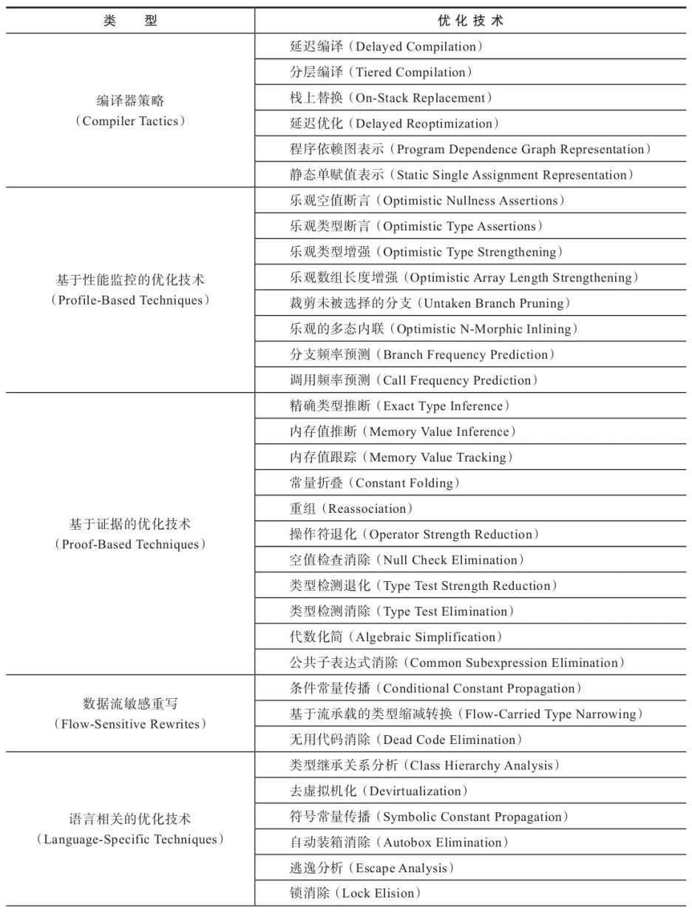

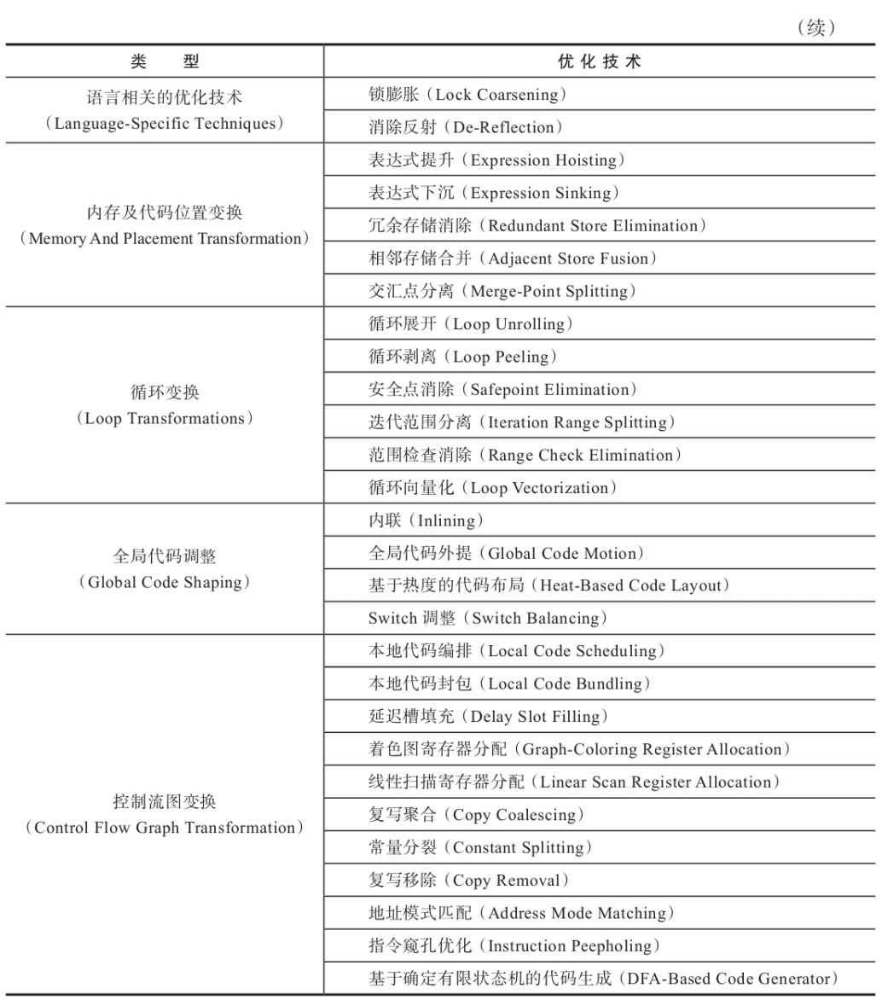

上述的优化技术看起来很多，而且名字看起来大多显得有点“高深莫测”，实际上要实现这些优化确实有不小的难度，但大部分优化技术理解起来都并不困难，为了消除读者对这些优化技术的陌生感，笔者举一个最简单的例子：通过大家熟悉的Java代码变化来展示其中几种优化技术是如何发挥作用的。不过首先需要明确一点，即时编译器对这些代码优化变换是建立在代码的中间表示或者是机器码之上的，绝不是直接在Java源码上去做的，这里只是笔者为了方便讲解，使用了Java语言的语法来表示这些优化技术所发挥的作用。

第一步，从原始代码开始，如代码清单11-6所示[^section-11-4-1-note-2]。

代码清单11-6　优化前的原始代码

```java
static class B {
    int value;
    final int get() {
        return value;
    }
}
public void foo() {
    y = b.get();
    // ...do stuff...
    z = b.get();
    sum = y + z;
}
```

代码清单11-6所示的内容已经非常简化了，但是仍有不少优化的空间。首先，第一个要进行的优化是方法内联，它的主要目的有两个：一是去除方法调用的成本（如查找方法版本、建立栈帧等）；二是为其他优化建立良好的基础。方法内联膨胀之后可以便于在更大范围上进行后续的优化手段，可以获取更好的优化效果。因此各种编译器一般都会把内联优化放在优化序列最靠前的位置。内联后的代码如代码清单11-7所示。

代码清单11-7　内联后的代码

```java
public void foo() {
    y = b.value;
    // ...do stuff...
    z = b.value;
    sum = y + z;
}
```

第二步进行冗余访问消除（Redundant Loads Elimination），假设代码中间注释掉的“…do stuff…”所代表的操作不会改变b.value的值，那么就可以把“z=b.value”替换为“z=y”，因为上一句“y=b.value”已经保证了变量y与b.value是一致的，这样就可以不再去访问对象b的局部变量了。如果把b.value看作一个表达式，那么也可以把这项优化看作一种公共子表达式消除（Common Subexpression Elimination），优化后的代码如代码清单11-8所示。

代码清单11-8　冗余存储消除的代码

```java
public  void foo() {
    y = b.value;
    // ...do stuff...
    z = y;
    sum = y + z;
}
```

第三步进行复写传播（Copy Propagation），因为这段程序的逻辑之中没有必要使用一个额外的变量z，它与变量y是完全相等的，因此我们可以使用y来代替z。复写传播之后的程序如代码清单11-9所示。

代码清单11-9　复写传播的代码

```java
public  void foo() {
    y = b.value;
    // ...do stuff...
    y = y;
    sum = y + y;
}
```

第四步进行无用代码消除（Dead Code Elimination），无用代码可能是永远不会被执行的代码，也可能是完全没有意义的代码。因此它又被很形象地称为“Dead Code”，在代码清单11-9中，“y=y”是没有意义的，把它消除后的程序如代码清单11-10所示。

代码清单11-10　进行无用代码消除的代码

```java
public  void foo() {
    y = b.value;
    // ...do stuff...
    sum = y + y;
}
```

经过四次优化之后，代码清单11-10所示代码与代码清单11-6所示代码所达到的效果是一致的，但是前者比后者省略了许多语句，体现在字节码和机器码指令上的差距会更大，执行效率的差距也会更高。编译器的这些优化技术实现起来也许确实复杂，但是要理解它们的行为，对于一个初学者来说都是没有什么困难的，完全不需要有任何的恐惧心理。

接下来，笔者挑选了四项有代表性的优化技术，与大家一起观察它们是如何运作的。它们分别是：

- 最重要的优化技术之一：方法内联。
- 最前沿的优化技术之一：逃逸分析。
- 语言无关的经典优化技术之一：公共子表达式消除。
- 语言相关的经典优化技术之一：数组边界检查消除。

[^section-11-4-1-note-1]: 地址：https://wiki.openjdk.java.net/display/HotSpot/PerformanceTacticIndex。
[^section-11-4-1-note-2]: 本示例原型来自Oracle官方对编译器技术的介绍材料：http://download.oracle.com/docs/cd/E13150_01/jrockit_jvm/jrockit/geninfo/diagnos/underst_jit.html。

#### 11.4.2　方法内联

在前面的讲解中，我们多次提到方法内联，说它是编译器最重要的优化手段，甚至都可以不加上“之一”。内联被业内戏称为优化之母，因为除了消除方法调用的成本之外，它更重要的意义是为其他优化手段建立良好的基础，代码清单11-11所示的简单例子就揭示了内联对其他优化手段的巨大价值：没有内联，多数其他优化都无法有效进行。例子里testInline()方法的内部全部是无用的代码，但如果不做内联，后续即使进行了无用代码消除的优化，也无法发现任何“Dead Code”的存在。如果分开来看，foo()和testInline()两个方法里面的操作都有可能是有意义的。

代码清单11-11　未作任何优化的字节码

```text
public static void foo(Object obj) {
    if (obj != null) {
        System.out.println("do something");
    }
}
public static void testInline(String[] args) {
    Object obj = null;
    foo(obj);
}
```

方法内联的优化行为理解起来是没有任何困难的，不过就是把目标方法的代码原封不动地“复制”到发起调用的方法之中，避免发生真实的方法调用而已。但实际上Java虚拟机中的内联过程却远没有想象中容易，甚至如果不是即时编译器做了一些特殊的努力，按照经典编译原理的优化理论，大多数的Java方法都无法进行内联。

无法内联的原因其实在第8章中讲解Java方法解析和分派调用的时候就已经解释过：只有使用invokespecial指令调用的私有方法、实例构造器、父类方法和使用invokestatic指令调用的静态方法才会在编译期进行解析。除了上述四种方法之外（最多再除去被final修饰的方法这种特殊情况，尽管它使用invokevirtual指令调用，但也是非虚方法，《Java语言规范》中明确说明了这点），其他的Java方法调用都必须在运行时进行方法接收者的多态选择，它们都有可能存在多于一个版本的方法接收者，简而言之，Java语言中默认的实例方法是虚方法。

对于一个虚方法，编译器静态地去做内联的时候很难确定应该使用哪个方法版本，以将代码清单11-7中所示b.get()直接内联为b.value为例，如果不依赖上下文，是无法确定b的实际类型是什么的。假如有ParentB和SubB是两个具有继承关系的父子类型，并且子类重写了父类的get()方法，那么b.get()是执行父类的get()方法还是子类的get()方法，这应该是根据实际类型动态分派的，而实际类型必须在实际运行到这一行代码时才能确定，编译器很难在编译时得出绝对准确的结论。

更糟糕的情况是，由于Java提倡使用面向对象的方式进行编程，而Java对象的方法默认就是虚方法，可以说Java间接鼓励了程序员使用大量的虚方法来实现程序逻辑。根据上面的分析可知，内联与虚方法之间会产生“矛盾”，那是不是为了提高执行性能，就应该默认给每个方法都使用final关键字去修饰呢？C和C++语言的确是这样做的，默认的方法是非虚方法，如果需要用到多态，就用virtual关键字来修饰，但Java选择了在虚拟机中解决这个问题。

为了解决虚方法的内联问题，Java虚拟机首先引入了一种名为类型继承关系分析（Class Hierarchy Analysis，CHA）的技术，这是整个应用程序范围内的类型分析技术，用于确定在目前已加载的类中，某个接口是否有多于一种的实现、某个类是否存在子类、某个子类是否覆盖了父类的某个虚方法等信息。这样，编译器在进行内联时就会分不同情况采取不同的处理：如果是非虚方法，那么直接进行内联就可以了，这种的内联是有百分百安全保障的；如果遇到虚方法，则会向CHA查询此方法在当前程序状态下是否真的有多个目标版本可供选择，如果查询到只有一个版本，那就可以假设“应用程序的全貌就是现在运行的这个样子”来进行内联，这种内联被称为守护内联（Guarded Inlining）。不过由于Java程序是动态连接的，说不准什么时候就会加载到新的类型从而改变CHA结论，因此这种内联属于激进预测性优化，必须预留好“逃生门”，即当假设条件不成立时的“退路”（Slow Path）。假如在程序的后续执行过程中，虚拟机一直没有加载到会令这个方法的接收者的继承关系发生变化的类，那这个内联优化的代码就可以一直使用下去。如果加载了导致继承关系发生变化的新类，那么就必须抛弃已经编译的代码，退回到解释状态进行执行，或者重新进行编译。

假如向CHA查询出来的结果是该方法确实有多个版本的目标方法可供选择，那即时编译器还将进行最后一次努力，使用内联缓存（Inline Cache）的方式来缩减方法调用的开销。这种状态下方法调用是真正发生了的，但是比起直接查虚方法表还是要快一些。内联缓存是一个建立在目标方法正常入口之前的缓存，它的工作原理大致为：在未发生方法调用之前，内联缓存状态为空，当第一次调用发生后，缓存记录下方法接收者的版本信息，并且每次进行方法调用时都比较接收者的版本。如果以后进来的每次调用的方法接收者版本都是一样的，那么这时它就是一种单态内联缓存（Monomorphic Inline Cache）。通过该缓存来调用，比用不内联的非虚方法调用，仅多了一次类型判断的开销而已。但如果真的出现方法接收者不一致的情况，就说明程序用到了虚方法的多态特性，这时候会退化成超多态内联缓存（Megamorphic Inline Cache），其开销相当于真正查找虚方法表来进行方法分派。

所以说，在多数情况下Java虚拟机进行的方法内联都是一种激进优化。事实上，激进优化的应用在高性能的Java虚拟机中比比皆是，极为常见。除了方法内联之外，对于出现概率很小（通过经验数据或解释器收集到的性能监控信息确定概率大小）的隐式异常、使用概率很小的分支等都可以被激进优化“移除”，如果真的出现了小概率事件，这时才会从“逃生门”回到解释状态重新执行。

#### 11.4.3　逃逸分析

逃逸分析（Escape Analysis）是目前Java虚拟机中比较前沿的优化技术，它与类型继承关系分析一样，并不是直接优化代码的手段，而是为其他优化措施提供依据的分析技术。

逃逸分析的基本原理是：分析对象动态作用域，当一个对象在方法里面被定义后，它可能被外部方法所引用，例如作为调用参数传递到其他方法中，这种称为方法逃逸；甚至还有可能被外部线程访问到，譬如赋值给可以在其他线程中访问的实例变量，这种称为线程逃逸；从不逃逸、方法逃逸到线程逃逸，称为对象由低到高的不同逃逸程度。

如果能证明一个对象不会逃逸到方法或线程之外（换句话说是别的方法或线程无法通过任何途径访问到这个对象），或者逃逸程度比较低（只逃逸出方法而不会逃逸出线程），则可能为这个对象实例采取不同程度的优化，如：

- 栈上分配[^section-11-4-3-note-1]（Stack Allocations）：在Java虚拟机中，Java堆上分配创建对象的内存空间几乎是Java程序员都知道的常识，Java堆中的对象对于各个线程都是共享和可见的，只要持有这个对象的引用，就可以访问到堆中存储的对象数据。虚拟机的垃圾收集子系统会回收堆中不再使用的对象，但回收动作无论是标记筛选出可回收对象，还是回收和整理内存，都需要耗费大量资源。如果确定一个对象不会逃逸出线程之外，那让这个对象在栈上分配内存将会是一个很不错的主意，对象所占用的内存空间就可以随栈帧出栈而销毁。在一般应用中，完全不会逃逸的局部对象和不会逃逸出线程的对象所占的比例是很大的，如果能使用栈上分配，那大量的对象就会随着方法的结束而自动销毁了，垃圾收集子系统的压力将会下降很多。栈上分配可以支持方法逃逸，但不能支持线程逃逸。
- 标量替换（Scalar Replacement）：若一个数据已经无法再分解成更小的数据来表示了，Java虚拟机中的原始数据类型（int、long等数值类型及reference类型等）都不能再进一步分解了，那么这些数据就可以被称为标量。相对的，如果一个数据可以继续分解，那它就被称为聚合量（Aggregate），Java中的对象就是典型的聚合量。如果把一个Java对象拆散，根据程序访问的情况，将其用到的成员变量恢复为原始类型来访问，这个过程就称为标量替换。假如逃逸分析能够证明一个对象不会被方法外部访问，并且这个对象可以被拆散，那么程序真正执行的时候将可能不去创建这个对象，而改为直接创建它的若干个被这个方法使用的成员变量来代替。将对象拆分后，除了可以让对象的成员变量在栈上（栈上存储的数据，很大机会被虚拟机分配至物理机器的高速寄存器中存储）分配和读写之外，还可以为后续进一步的优化手段创建条件。标量替换可以视作栈上分配的一种特例，实现更简单（不用考虑整个对象完整结构的分配），但对逃逸程度的要求更高，它不允许对象逃逸出方法范围内。
- 同步消除（Synchronization Elimination）：线程同步本身是一个相对耗时的过程，如果逃逸分析能够确定一个变量不会逃逸出线程，无法被其他线程访问，那么这个变量的读写肯定就不会有竞争，对这个变量实施的同步措施也就可以安全地消除掉。

关于逃逸分析的研究论文早在1999年就已经发表，但直到JDK 6，HotSpot才开始支持初步的逃逸分析，而且到现在这项优化技术尚未足够成熟，仍有很大的改进余地。不成熟的原因主要是逃逸分析的计算成本非常高，甚至不能保证逃逸分析带来的性能收益会高于它的消耗。如果要百分之百准确地判断一个对象是否会逃逸，需要进行一系列复杂的数据流敏感的过程间分析，才能确定程序各个分支执行时对此对象的影响。前面介绍即时编译、提前编译优劣势时提到了过程间分析这种大压力的分析算法正是即时编译的弱项。可以试想一下，如果逃逸分析完毕后发现几乎找不到几个不逃逸的对象，那这些运行期耗用的时间就白白浪费了，所以目前虚拟机只能采用不那么准确，但时间压力相对较小的算法来完成分析。

C和C++语言里面原生就支持了栈上分配（不使用new操作符即可），而C#也支持值类型，可以很自然地做到标量替换（但并不会对引用类型做这种优化）。在灵活运用栈内存方面，确实是Java的一个弱项。在现在仍处于实验阶段的Valhalla项目里，设计了新的inline关键字用于定义Java的内联类型，目的是实现与C#中值类型相对标的功能。有了这个标识与约束，以后逃逸分析做起来就会简单很多。

下面笔者将通过一系列Java伪代码的变化过程来模拟逃逸分析是如何工作的，向读者展示逃逸分析能够实现的效果。初始代码如下所示：

```java
// 完全未优化的代码
public int test(int x) {
    int xx = x + 2;
    Point p = new Point(xx, 42);
    return p.getX();
}
```

此处笔者省略了Point类的代码，这就是一个包含x和y坐标的POJO类型，读者应该很容易想象它的样子。

第一步，将Point的构造函数和getX()方法进行内联优化：

```cpp
// 步骤1：构造函数内联后的样子
public int test(int x) {
    int xx = x + 2;
    Point p = point_memory_alloc();   // 在堆中分配P对象的示意方法
    p.x = xx;                         // Point构造函数被内联后的样子
    p.y = 42
    return p.x;                       // Point::getX()被内联后的样子
}
```

第二步，经过逃逸分析，发现在整个test()方法的范围内Point对象实例不会发生任何程度的逃逸，这样可以对它进行标量替换优化，把其内部的x和y直接置换出来，分解为test()方法内的局部变量，从而避免Point对象实例被实际创建，优化后的结果如下所示：

```java
// 步骤2：标量替换后的样子
public int test(int x) {
    int xx = x + 2;
    int px = xx;
    int py = 42
    return px;
}
```

第三步，通过数据流分析，发现py的值其实对方法不会造成任何影响，那就可以放心地去做无效代码消除得到最终优化结果，如下所示：

```java
// 步骤3：做无效代码消除后的样子
public int test(int x) {
    return x + 2;
}
```

从测试结果来看，实施逃逸分析后的程序在MicroBenchmarks中往往能得到不错的成绩，但是在实际的应用程序中，尤其是大型程序中反而发现实施逃逸分析可能出现效果不稳定的情况，或分析过程耗时但却无法有效判别出非逃逸对象而导致性能（即时编译的收益）下降，所以曾经在很长的一段时间里，即使是服务端编译器，也默认不开启逃逸分析[^section-11-4-3-note-2]，甚至在某些版本（如JDK 6 Update 18）中还曾经完全禁止了这项优化，一直到JDK 7时这项优化才成为服务端编译器默认开启的选项。如果有需要，或者确认对程序运行有益，用户也可以使用参数-XX:+DoEscapeAnalysis来手动开启逃逸分析，开启之后可以通过参数-XX:+PrintEscapeAnalysis来查看分析结果。有了逃逸分析支持之后，用户可以使用参数-XX:+EliminateAllocations来开启标量替换，使用-XX:+EliminateLocks来开启同步消除，使用参数-XX:+PrintEliminateAllocations查看标量的替换情况。

尽管目前逃逸分析技术仍在发展之中，未完全成熟，但它是即时编译器优化技术的一个重要前进方向，在日后的Java虚拟机中，逃逸分析技术肯定会支撑起一系列更实用、有效的优化技术。

[^section-11-4-3-note-1]: 由于复杂度等原因，HotSpot中目前暂时还没有做这项优化，但一些其他的虚拟机（如Excelsior JET）使用了这项优化。
[^section-11-4-3-note-2]: 从JDK 6 Update 23开始，服务端编译器中开始才默认开启逃逸分析。

#### 11.4.4　公共子表达式消除

公共子表达式消除是一项非常经典的、普遍应用于各种编译器的优化技术，它的含义是：如果一个表达式E之前已经被计算过了，并且从先前的计算到现在E中所有变量的值都没有发生变化，那么E的这次出现就称为公共子表达式。对于这种表达式，没有必要花时间再对它重新进行计算，只需要直接用前面计算过的表达式结果代替E。如果这种优化仅限于程序基本块内，便可称为局部公共子表达式消除（Local Common Subexpression Elimination），如果这种优化的范围涵盖了多个基本块，那就称为全局公共子表达式消除（Global Common Subexpression Elimination）。下面举个简单的例子来说明它的优化过程，假设存在如下代码：

```java
int d = (c * b) * 12 + a + (a + b * c);
```

如果这段代码交给Javac编译器则不会进行任何优化，那生成的代码将如代码清单11-12所示，是完全遵照Java源码的写法直译而成的。

代码清单11-12　未作任何优化的字节码

```text
iload_2       // b
imul          // 计算b*c
bipush 12     // 推入12
imul          // 计算(c * b) * 12
iload_1       // a
iadd          // 计算(c * b) * 12 + a
iload_1       // a
iload_2       // b
iload_3       // c
imul          // 计算b * c
iadd          // 计算a + b * c
iadd          // 计算(c * b) * 12 + a + a + b * c
istore 4
```

当这段代码进入虚拟机即时编译器后，它将进行如下优化：编译器检测到c*b与b*c是一样的表达式，而且在计算期间b与c的值是不变的。

因此这条表达式就可能被视为：

```java
int d = E * 12 + a + (a + E);
```

这时候，编译器还可能（取决于哪种虚拟机的编译器以及具体的上下文而定）进行另外一种优化——代数化简（Algebraic Simplification），在E本来就有乘法运算的前提下，把表达式变为：

```java
int d = E * 13 + a + a;
```

表达式进行变换之后，再计算起来就可以节省一些时间了。如果读者还对其他的经典编译优化技术感兴趣，可以参考《编译原理》（俗称龙书）中的相关章节。

#### 11.4.5　数组边界检查消除

数组边界检查消除（Array Bounds Checking Elimination）是即时编译器中的一项语言相关的经典优化技术。我们知道Java语言是一门动态安全的语言，对数组的读写访问也不像C、C++那样实质上就是裸指针操作。如果有一个数组foo[]，在Java语言中访问数组元素foo[i]的时候系统将会自动进行上下界的范围检查，即i必须满足“i>=0&&i<foo.length”的访问条件，否则将抛出一个运行时异常：java.lang.ArrayIndexOutOfBoundsException。这对软件开发者来说是一件很友好的事情，即使程序员没有专门编写防御代码，也能够避免大多数的溢出攻击。但是对于虚拟机的执行子系统来说，每次数组元素的读写都带有一次隐含的条件判定操作，对于拥有大量数组访问的程序代码，这必定是一种性能负担。

无论如何，为了安全，数组边界检查肯定是要做的，但数组边界检查是不是必须在运行期间一次不漏地进行则是可以“商量”的事情。例如下面这个简单的情况：数组下标是一个常量，如foo[^section-11-5-1-note-3]，只要在编译期根据数据流分析来确定foo.length的值，并判断下标“3”没有越界，执行的时候就无须判断了。更加常见的情况是，数组访问发生在循环之中，并且使用循环变量来进行数组的访问。如果编译器只要通过数据流分析就可以判定循环变量的取值范围永远在区间[0，foo.length)之内，那么在循环中就可以把整个数组的上下界检查消除掉，这可以节省很多次的条件判断操作。

把这个数组边界检查的例子放在更高的视角来看，大量的安全检查使编写Java程序比编写C和C++程序容易了很多，比如：数组越界会得到ArrayIndexOutOfBoundsException异常；空指针访问会得到NullPointException异常；除数为零会得到ArithmeticException异常……在C和C++程序中出现类似的问题，一个不小心就会出现Segment Fault信号或者Windows编程中常见的“XXX内存不能为Read/Write”之类的提示，处理不好程序就直接崩溃退出了。但这些安全检查也导致出现相同的程序，从而使Java比C和C++要做更多的事情（各种检查判断），这些事情就会导致一些隐式开销，如果不处理好它们，就很可能成为一项“Java语言天生就比较慢”的原罪。为了消除这些隐式开销，除了如数组边界检查优化这种尽可能把运行期检查提前到编译期完成的思路之外，还有一种避开的处理思路——隐式异常处理，Java中空指针检查和算术运算中除数为零的检查都采用了这种方案。举个例子，程序中访问一个对象（假设对象叫foo）的某个属性（假设属性叫value），那以Java伪代码来表示虚拟机访问foo.value的过程为：

```java
if (foo != null) {
    return foo.value;
}else{
    throw new NullPointException();
}
```

在使用隐式异常优化之后，虚拟机会把上面的伪代码所表示的访问过程变为如下伪代码：

```text
try {
    return foo.value;
} catch (segment_fault) {
    uncommon_trap();
}
```

虚拟机会注册一个Segment Fault信号的异常处理器（伪代码中的uncommon_trap()，务必注意这里是指进程层面的异常处理器，并非真的Java的try-catch语句的异常处理器），这样当foo不为空的时候，对value的访问是不会有任何额外对foo判空的开销的，而代价就是当foo真的为空时，必须转到异常处理器中恢复中断并抛出NullPointException异常。进入异常处理器的过程涉及进程从用户态转到内核态中处理的过程，结束后会再回到用户态，速度远比一次判空检查要慢得多。当foo极少为空的时候，隐式异常优化是值得的，但假如foo经常为空，这样的优化反而会让程序更慢。幸好HotSpot虚拟机足够聪明，它会根据运行期收集到的性能监控信息自动选择最合适的方案。

与语言相关的其他消除操作还有不少，如自动装箱消除（Autobox Elimination）、安全点消除（Safepoint Elimination）、消除反射（Dereflection）等，这里就不再一一介绍了。

### 11.5　实战：深入理解Graal编译器

在本书刚开始介绍HotSpot即时编译器的时候曾经说过，从JDK 10起，HotSpot就同时拥有三款不同的即时编译器。此前我们已经介绍了经典的客户端编译器和服务端编译器，在本节，我们将把目光聚焦到HotSpot即时编译器以及提前编译器共同的最新成果——Graal编译器身上。

#### 11.5.1　历史背景

在第1章展望Java技术的未来时，我们就听说过Graal虚拟机以及Graal编译器仍在实验室中尚未商用，但未来其有望代替或成为HotSpot下一代技术基础。Graal编译器最初是在Maxine虚拟机[^section-11-5-1-note-1]中作为C1X编译器[^section-11-5-1-note-2]的下一代编译器而设计的，所以它理所当然地使用于Java语言来编写。2012年，Graal编译器从Maxine虚拟机项目中分离，成为一个独立发展的Java编译器项目[^section-11-5-1-note-3]，Oracle Labs希望它最终能够成为一款高编译效率、高输出质量、支持提前编译和即时编译，同时支持应用于包括HotSpot在内的不同虚拟机的编译器。由于这个编译器使用Java编写，代码清晰，又继承了许多来自HotSpot的服务端编译器的高质量优化技术，所以无论是科技企业还是高校研究院，都愿意在它上面研究和开发新编译技术。HotSpot服务端编译器的创造者Cliff Click自己就对Graal编译器十分推崇，并且公开表示再也不会用C、C++去编写虚拟机和编译器了。Twitter的Java虚拟机团队也曾公开说过C2目前犹如一潭死水，亟待一个替代品，因为在它上面开发、改进实在太困难了。

Graal编译器在JDK 9时以Jaotc提前编译工具的形式首次加入到官方的JDK中，从JDK 10起，Graal编译器可以替换服务端编译器，成为HotSpot分层编译中最顶层的即时编译器。这种可替换的即时编译器架构的实现，得益于HotSpot编译器接口的出现。

早期的Graal曾经同C1及C2一样，与HotSpot的协作是紧耦合的，这意味着每次编译Graal均需重新编译整个HotSpot。JDK 9时发布的JEP 243：Java虚拟机编译器接口（Java-Level JVM Compiler Interface，JVMCI）使得Graal可以从HotSpot的代码中分离出来。JVMCI主要提供如下三种功能：

- 响应HotSpot的编译请求，并将该请求分发给Java实现的即时编译器。
- 允许编译器访问HotSpot中与即时编译相关的数据结构，包括类、字段、方法及其性能监控数据等，并提供了一组这些数据结构在Java语言层面的抽象表示。
- 提供HotSpot代码缓存（Code Cache）的Java端抽象表示，允许编译器部署编译完成的二进制机器码。

综合利用上述三项功能，我们就可以把一个在HotSpot虚拟机外部的、用Java语言实现的即时编译器（不局限于Graal）集成到HotSpot中，响应HotSpot发出的最顶层的编译请求，并将编译后的二进制代码部署到HotSpot的代码缓存中。此外，单独使用上述第三项功能，又可以绕开HotSpot的即时编译系统，让该编译器直接为应用的类库编译出二进制机器码，将该编译器当作一个提前编译器去使用（如Jaotc）。

Graal和JVMCI的出现，为不直接从事Java虚拟机和编译器开发，但对Java虚拟机技术充满好奇心的读者们提供一条窥探和尝试编译器技术的良好途径，现在我们就将开始基于Graal来实战HotSpot虚拟机的即时编译与代码优化过程。

[^section-11-5-1-note-1]: Maxine虚拟机在第1章的Java虚拟机家族里简单介绍过。
[^section-11-5-1-note-2]: C1X是Maxine虚拟机照着HotSpot C1编译器实现的编译器。
[^section-11-5-1-note-3]: 相关资料：https://jaxenter.com/oracle-championing-cause-for-graal-to-be-part-of-openjdk-104172.html。

#### 11.5.2　构建编译调试环境

由于Graal编译器要同时支持Graal VM下的各种子项目，如Truffle、Substrate VM、Sulong等，还要支持作为HotSpot和Maxine虚拟机的即时编译器，所以只用Maven或Gradle的话，配置管理过程会相当复杂。为了降低代码管理、依赖项管理、编译和测试等环节的复杂度，Graal团队专门用Python 2写了一个名为mx的小工具来自动化做好这些事情。我们要构建Graal的调试环境，第一步要先把构建工具mx安装好，这非常简单，进行如下操作即可：

```bash
$ git clone https://github.com/graalvm/mx.git
$ export PATH=`pwd`/mx:$PATH
```

既然Graal编译器是以Java代码编写的，那第二步自然是要找一个合适的JDK来编译。考虑到Graal VM项目是基于OpenJDK 8开发的，而JVMCI接口又在JDK 9以后才会提供，所以Graal团队提供了一个带有JVMCI功能的OpenJDK 8版本，我们可以选择这个版本的JDK 8来进行编译。当读者只关注Graal编译器在HotSpot上的应用而不想涉及Graal VM其他方面时，可直接采用JDK 9及之后的标准Open/OracleJDK。在本次实战中，笔者机器上使用的是带JVMCI的OpenJDK 8[^section-11-5-2-note-1]，对于与其他JDK版本有差别的步骤，笔者会特别说明。选择好JDK版本后，设置JAVA_HOME环境变量即可，这是编译过程中唯一需要手工处理的依赖：

```text
export JAVA_HOME=/usr/lib/jvm/oraclejdk1.8.0_212-jvmci-20-b01
```

第三步是获取Graal编译器代码，编译器部分的代码是与整个Graal VM放在一块的，我们把Graal VM复制下来，大约有700MB，操作如下：

```bash
$ git clone https://github.com/graalvm/graal.git
```

其他目录中存放着Truffle、Substrate VM、Sulong等其他项目，这些在本次实战中不会涉及。进入compiler子目录，使用mx构建Graal编译器，操作如下：

```bash
$ cd graal/compiler
$ mx build
```

由于整个构建过程需要的依赖项都可以自动处理，需要手动处理的只有OpenJDK一个，所以编译一般不会出现什么问题，大概两三分钟编译即可完成。此时其实已经可以修改、调试Graal编译器了，但写Java代码不同于C、C++，应该没有人会直接用VIM去做Java开发调试，我们还是需要一个IDE来支持本次实战的。mx工具能够支持Eclipse、Intellij IDEA和NetBeans三种主流的Java IDE项目的创建，由于Graal团队中使用Eclipse占多数，支持也最好，所以笔者也选择Eclipse来进行本次实战，创建Eclipse项目的操作如下：

```bash
$ cd graal/compiler
$ mx eclipseinit
```

无论使用哪种IDE，都需要把IDE配置中使用的Java堆修改到2GB或以上，才能保证Graal在IDE中的编译构建能够顺利进行，譬如Eclipse默认配置（eclipse.ini文件）下的Java堆最大为1GB，这是不够的。设置完成后，在Eclipse中选择File->Open Projects from File System，再选择Graal项目的根目录，将会导入整个Graal VM，导入的工程如图11-10所示。

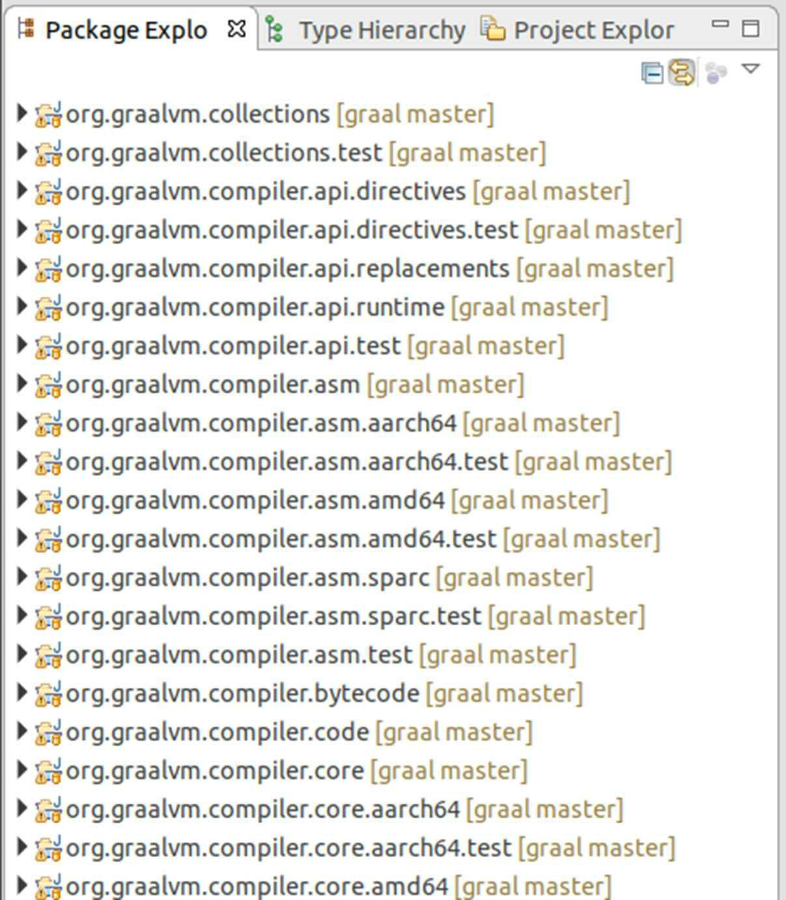

图11-10　Graal VM项目（部分工程）

如果你与笔者一样采用的是JDK 8，那么要记得在Eclipse中也必须将那个带有JVMCI功能的特殊JDK 8用作Eclipse里面“Java SE-1.8”的环境配置（Windows->Preferences->Java->Install JREs->ExecutionEnvironments->Java SE-1.8），此外，还需要手工将以其他版本号结尾的工程关闭，譬如图11-11所示。这对于采用其他版本JDK来编译的读者也是一样的。

到此为止，整个编译、调试环境就已经构建完毕，下面可以开始探索Graal工作原理的内容了。

[^section-11-5-2-note-1]: 获取地址：https://github.com/graalvm/graal-jvmci-8。

#### 11.5.3　JVMCI编译器接口

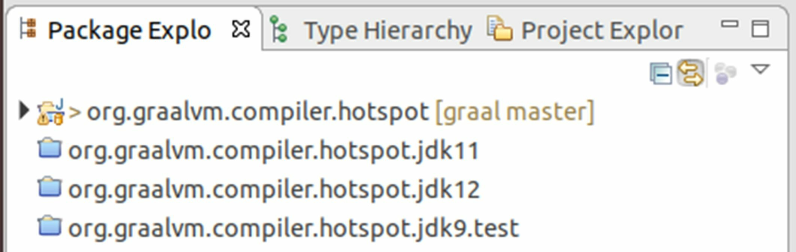

图11-11　手动关闭其他版本的工程

现在请读者来思考一下，如果让您来设计JVMCI编译器接口，它应该是怎样的？既然JVMCI面向的是Java语言的编译器接口，那它至少在形式上是与我们已经见过无数次的Java接口是一样的。我们来考虑即时编译器的输入是什么。答案当然是要编译的方法的字节码。既然叫字节码，顾名思义它就应该是“用一个字节数组表示的代码”。那接下来它输出什么？这也很简单，即时编译器应该输出与方法对应的二进制机器码，二进制机器码也应该是“用一个字节数组表示的代码”。这样的话，JVMCI接口就应该看起来类似于下面这种样子：

```text
interface JVMCICompiler {
    byte[] compileMethod(byte[] bytecode);
}
```

事实上JVMCI接口只比上面这个稍微复杂一点点，因为其输入除了字节码外，HotSpot还会向编译器提供各种该方法的相关信息，譬如局部变量表中变量槽的个数、操作数栈的最大深度，还有分层编译在底层收集到的统计信息等。因此JVMCI接口的核心内容实际就是代码清单11-13总所示的这些。

代码清单11-13　JVMCI接口

```java
interface JVMCICompiler {
    void compileMethod(CompilationRequest request);
}
interface CompilationRequest {
    JavaMethod getMethod();
}
interface JavaMethod {
    byte[] getCode();
    int getMaxLocals();
    int getMaxStackSize();
    ProfilingInfo getProfilingInfo();
    ...  // 省略其他方法
}
```

我们在Eclipse中找到JVMCICompiler接口，通过继承关系分析，可以清楚地看到有一个实现类HotSpotGraalCompiler实现了JVMCI，如图11-12所示，这个就是我们要分析的代码的入口。

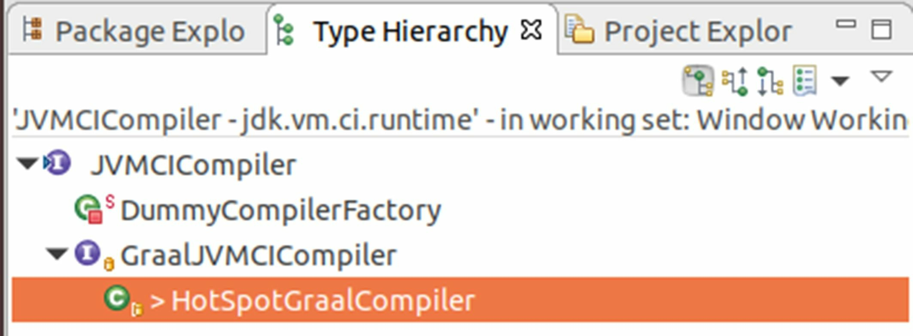

图11-12　JVMCI接口的继承关系

为了后续调试方便，我们先准备一段简单的代码，并让它触发HotSpot的即时编译，以便我们跟踪观察编译器是如何工作对的。具体代码如清单11-14所示。

代码清单11-14　触发即时编译的示例代码[^section-11-5-3-note-1]

```java
public class Demo {
    public static void main(String[] args) {
        while (true) {
            workload(14, 2);
        }
    }
    private static int workload(int a, int b) {
        return a + b;
    }
}
```

由于存在无限循环，workload()方法肯定很快就会被虚拟机发现是热点代码因而进行编译。实际上除了workload()方法以外，这段简单的代码还会导致相当多的其他方法的编译，因为一个最简单的Java类的加载和运行也会触发数百个类的加载。为了避免干扰信息太多，笔者加入了参数-XX:CompileOnly来限制只允许workload()方法被编译。先采用以下命令，用标准的服务端编译器来运行清单11-14中所示的程序。

```cpp
$ javac Demo.java
$ java \
  -XX:+PrintCompilation \
  -XX:CompileOnly=Demo::workload \
  Demo
...
    193    1       3       Demo::workload (4 bytes)
    199    2       1       Demo::workload (4 bytes)
    199    1       3       Demo::workload (4 bytes)   made not entrant
...
```

上面显示wordload()方法确实被分层编译了多次，“made not entrant”的输出就表示了方法的某个已编译版本被丢弃过。从这段信息中我们清楚看到，分层编译机制及最顶层的服务端编译都已经正常工作了，下一步就是用我们在Eclipse中的Graal编译器代替HotSpot的服务端编译器。

为简单起见，笔者加上-XX:-TieredCompilation关闭分层编译，让虚拟机只采用有一个JVMCI编译器而不是由客户端编译器和JVMCI混合分层。然后使用参数-XX:+EnableJVMCI、-XX:+UseJVMCICompiler来启用JVMCI接口和JVMCI编译器。由于这些目前尚属实验阶段的功能，需要再使用-XX:+UnlockExperimentalVMOptions参数进行解锁。最后，也是最关键的一个问题，如何让HotSpot找到Graal编译器的位置呢？

如果采用特殊版的JDK 8，那虚拟机将会自动去查找JAVA_HOME/jre/lib/jvmci目录。假如这个目录不存在，那就会从-Djvmci.class.path.append参数中搜索。它查找的目标，即Graal编译器的JAR包，刚才我们已经通过mx build命令成功编译出来，所以在JDK 8下笔者使用的启动参数如代码清单11-15所示。

代码清单11-15　JDK8的运行配置

```cpp
-Djvmci.class.path.append=~/graal/compiler/mxbuild/dists/jdk1.8/graal.jar:~/graal/sdk/mxbuild/dists/jdk1.8/graal-sdk.jar
-XX:+UnlockExperimentalVMOptions
-XX:+EnableJVMCI
-XX:+UseJVMCICompiler
-XX:-TieredCompilation
-XX:+PrintCompilation
-XX:CompileOnly=Demo::workload
```

如果读者采用JDK 9或以上版本，那原本的Graal编译器是实现在jdk.internal.vm.compiler模块中的，我们只要用--upgrade-module-path参数指定这个模块的升级包即可，具体如代码清单11-16所示。

代码清单11-16　JDK 9或以上版本的运行配置

```cpp
--module-path=~/graal/sdk/mxbuild/dists/jdk11/graal.jar
--upgrade-module-path=~graal/compiler/mxbuild/dists/jdk11/jdk.internal.vm.compiler.jar
-XX:+UnlockExperimentalVMOptions
-XX:+EnableJVMCI
-XX:+UseJVMCICompiler
-XX:-TieredCompilation
-XX:+PrintCompilation
-XX:CompileOnly=Demo::workload
```

通过上述参数，HotSpot就能顺利找到并应用我们编译的Graal编译器了。为了确认效果，我们对HotSpotGraalCompiler类的compileMethod()方法做一个简单改动，输出编译的方法名称和编译耗时，具体如下（黑色加粗代码是笔者在源码中额外添加的内容）：

```java
public CompilationRequestResult compileMethod(CompilationRequest request) {
    long time = System.currentTimeMillis();
    CompilationRequestResult result = compileMethod(request, true, graalRuntime.getOptions());
    System.out.println("compile method:" + request.getMethod().getName());
    System.out.println("time used:" + (System.currentTimeMillis() - time));
    return result;
}
```

在Eclipse里面运行这段代码，不需要重新运行mx build，马上就可以看到类似如下所示的输出结果：

```cpp
97    1             Demo::workload (4 bytes)
……
compile method:workload
time used:4081
```

[^section-11-5-3-note-1]: 本节部分示例和图片来自于Chris Seaton的文章《Understanding How Graal Works-a Java JIT Compiler Written in Java》：https://chrisseaton.com/truffleruby/jokerconf17/。

#### 11.5.4　代码中间表示

Graal编译器在设计之初就刻意采用了与HotSpot服务端编译器一致（略有差异但已经非常接近）的中间表示形式，也即是被称为Sea-of-Nodes的中间表示，或者与其等价的被称为理想图（Ideal Graph，在代码中称为Structured Graph）的程序依赖图（Program Dependence Graph，PDG）形式。在11.2节即时编译器的实战中，我们已经通过可视化工具Ideal Graph Visualizer看到过在理想图上翻译和优化输入代码的整体过程，从编译器内部来看即：字节码→理想图→优化→机器码（以Mach Node Graph表示）的转变过程。在那个实战里面，我们着重分析的是理想图转换优化的整体过程，对于多数读者，尤其是不熟悉编译原理与编译器设计的读者，可能会不太容易读懂每个阶段所要做的工作。在本节里面，我们以例子和对照Graal源码的形式，详细讲解输入代码与理想图的转化对应关系，以便读者理解Graal是如何基于理想图去优化代码的。

理想图是一种有向图，用节点来表示程序中的元素，譬如变量、操作符、方法、字段等，而用边来表示数据或者控制流。我们先从最简单的例子出发。譬如有一个表达式：x+y，在理想图中可以表示为x、y两个节点的数据流流入加法操作符，表示相加操作读取了x、y的值，流出的便则表示数据流的流向，即相加的结果会在哪里被使用，如图11-13所示。

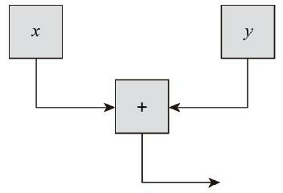

图11-13　构造理想图（1）

这很容易接受吧？那我们把例子稍微复杂化一些，把表达式x+y变为getX()+getY()，仍是用理想图表达其计算过程，这时候除了数据流向之外，还必须要考虑方法调用的顺序。在理想图中用另外一条边来表示方法的调用（为了便于区分，数据流笔者使用蓝色线（以虚线表示），控制流使用红色线（以实线表示）），说明代码的执行顺序是先调用getX()方法，再调用getY()方法，如图11-14所示。

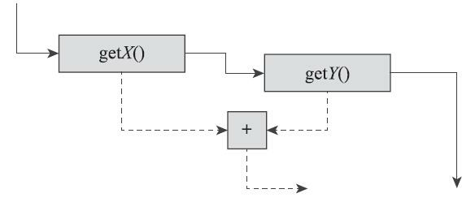

图11-14　构造理想图（2）

以上这些简单的前置知识就已经足以支撑我们本次实战的进行了，理想图本质上就是这种将数据流图和控制流图以某种方式合并到一起，用一种边来表示数据流向，另一种边来表示控制流向的图形表示。

现在我们在代码清单11-15或者代码清单11-16所示的基础上再增加一个参数-Dgraal.Dump，要求Graal编译器把构造的理想图输出出来，加入后编译时将会产生类似如下的输出，提示了生成的理想图的存储位置：

```text
[Use -Dgraal.LogFile=<path> to redirect Graal log output to a file.]
Dumping IGV graphs in /home/icyfenix/develop/eclipse-workspace/A_GraalTest/graal_dumps/2019.08.18.16.51.23.073
```

我们可以使用mx igv命令来获得能够支持Graal编译器生成的理想图格式的新版本的Ideal Graph Visualizer工具[^section-11-5-4-note-1]，我们以下面这段简单代码的理想图的表示为例子：

```java
int average(int a, int b) {
    return (a + b) / 2;
}
```

在Ideal Graph Visualizer工具中，将显示图11-15所示的样式的理想图。

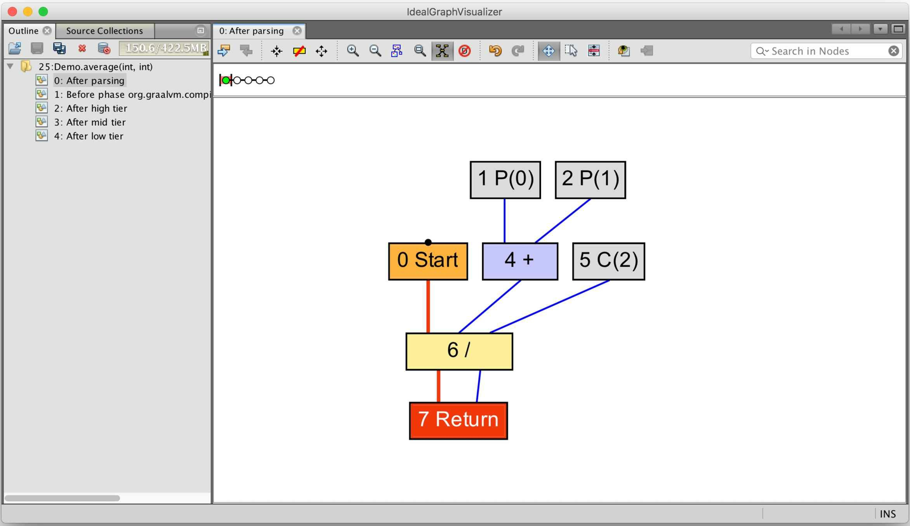

图11-15　构造理想图（3）

与图11-11和图11-12所示相比，虽然没有了箭头，但是节点上列明了代表执行顺序的序号，仍然是蓝色线表示数据流、红色线表示控制流。从图中可以看到参数0（记作P(0)）和参数1（记作P(1)）是如何送入加法操作的，然后结果是如何和常量2（记作C(2)）一起送入除法操作的。

再下一步我们就会开始接触真实的代码编译和优化了。前面介绍编译器优化技术时提到过公共子表达式消除，那我们来设计代码清单11-17所示的两段代码。

代码清单11-17　公共子表达式被消除的应用范围

```java
// 以下代码的公共子表达式能够被消除
int workload(int a, int b) {
    return (a + b) * (a + b);
}
// 以下代码的公共子表达式是不可以被消除的
int workload() {
    return (getA() + getB()) * (getA() + getB());
}
```

对于第一段代码，a+b是公共子表达式，可以通过优化使其只计算一次而不会有任何的副作用。但是对于第二段代码，由于getA()和getB()方法内部所蕴含的操作是不确定的，它是否被调用、调用次数的不同都可能会产生不同返回值或者其他影响程序状态的副作用（譬如改变某个全局的状态变量），这种代码只能内联了getA()和getB()方法之后才能考虑更进一步的优化措施，仍然保持函数调用的情况下是无法做公共子表达式消除的。我们可以从Graal生成的理想图中清晰地看到这一点，对于第一段代码，生成的理想图如图11-16所示。

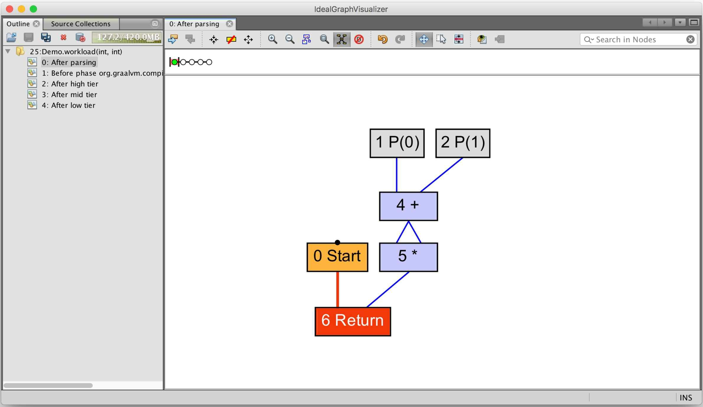

图11-16　构造理想图（4）

从图11-16所示中可以看到，参数1、2的加法操作只进行了一次，然后同时流出了两条数据流指向乘法操作的输入中。而如果是第二段代码，则生成的理想图如图11-17所示。

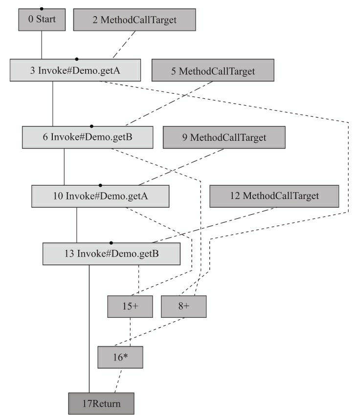

图11-17　构造理想图（5）

从图中代表控制流的红色边（以实线表示）可以看出，四次方法调用全部执行了，代表数据流的蓝色边（以虚线表示）也明确看到了两个独立加法操作节点，由此看出这个版本是不会把它当作公共子表达式来消除的。

[^section-11-5-4-note-1]: 在以下地址可以下载：https://www.oracle.com/technetwork/graalvm/downloads/index.html。

#### 11.5.5　代码优化与生成

相信读者现在已经能够基本看明白Graal理想图的中间表示了，那对应到代码上，Graal编译器是如何从字节码生成理想图？又如何在理想图基础上进行代码优化的呢？这时候就充分体现出了Graal编译器在使用Java编写时对普通Java程序员来说具有的便捷性了，在Outline视图中找到创建理想图的方法是greateGraph()，我们可以从Call Hierarchy视图中轻易地找到从JVMCI的入口方法compileMethod()到greateGraph()之间的调用关系，如图11-18所示。

greateGraph()方法的代码也很清晰，里面调用了StructuredGraph::Builder()构造器来创建理想图。这里要关注的关键点有两个：

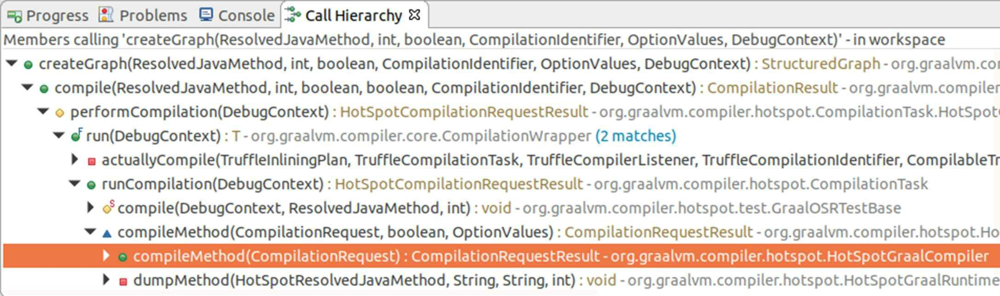

图11-18　构造理想图的方法

第一是理想图本身的数据结构。它是一组不为空的节点的集合，它的节点都是用ValueNode的不同类型的子类节点来表示的。仍然以x+y表达式为例，譬如其中的加法操作，就由AddNode节点来表示，从图11-19所示的Type Hierarchy视图中可以清楚地看到加法操作是二元算术操作节点（BinaryArithmeticNode<OP>）的一种，而二元算术操作节点又是二元操作符（BinaryNode）的一种，以此类推直到所有操作符的共同父类ValueNode（表示可以返回数据的节点）。

第二就是如何从字节码转换到理想图。该过程被封装在BytecodeParser类中，这个解析器我们可以按照字节码解释器的思路去理解它。如果这真的是一个字节码解释器，执行一个整数加法操作，按照《Java虚拟机规范》所定义的iadd操作码的规则，应该从栈帧中出栈两个操作数，然后相加，再将结果入栈。而从BytecodeParser::genArithmeticOp()方法上我们可以看到，其实现与规则描述没有什么差异，如图11-20所示。

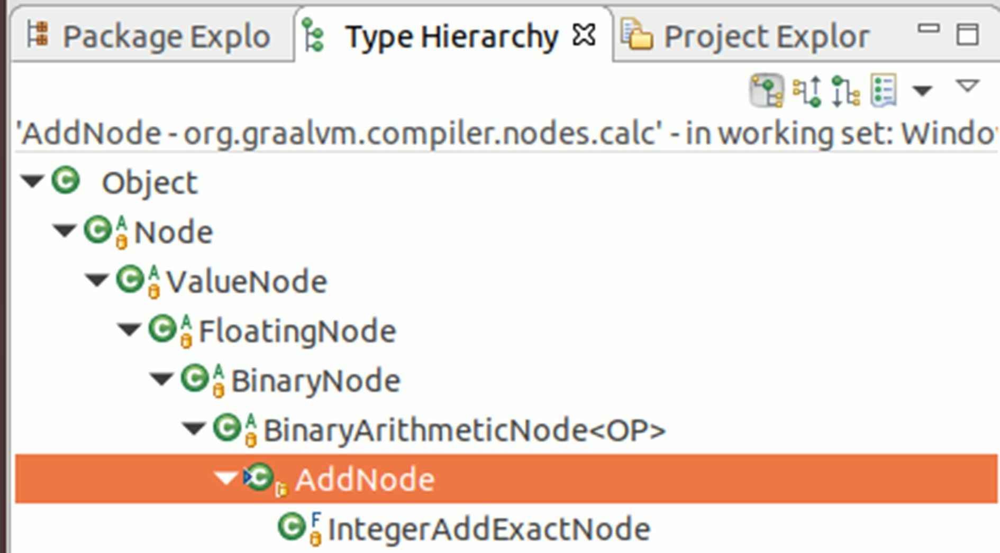

图11-19　节点继承关系

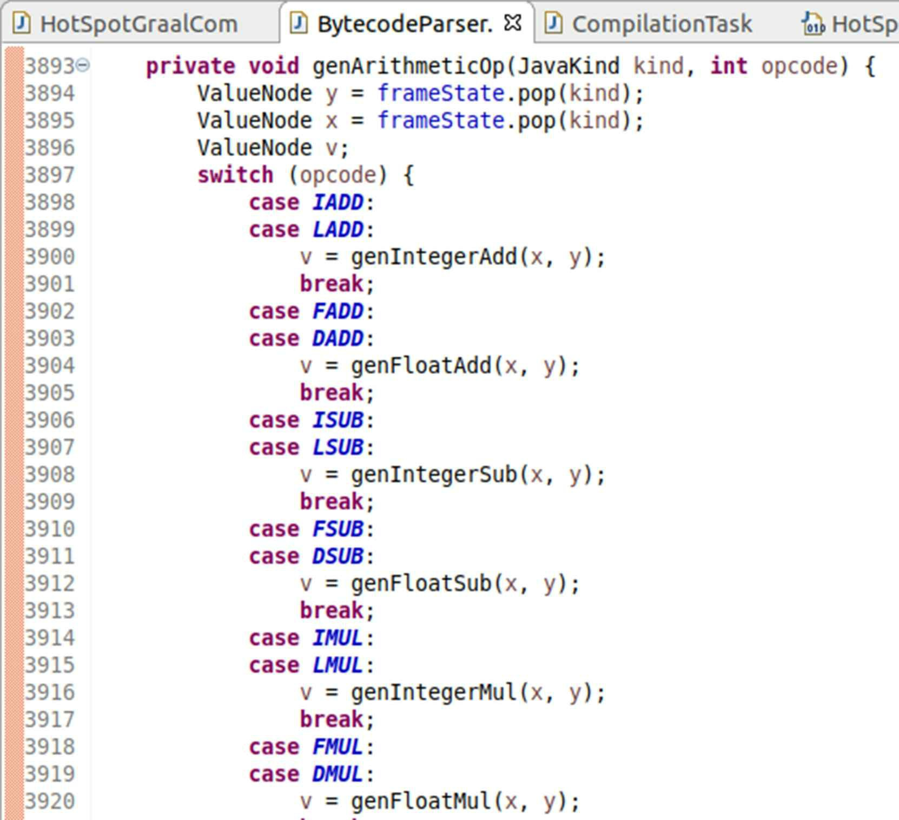

图11-20　字节码解析器实现的iadd操作码

其中，genIntegerAdd()方法中就只有一行代码，即调用AddNode节点的create()方法，将两个操作数作为参数传入，创建出AddNode节点，如下所示：

```java
protected ValueNode genIntegerAdd(ValueNode x, ValueNode y) {
    return AddNode.create(x, y, NodeView.DEFAULT);
}
```

每一个理想图的节点都有两个共同的主要操作，一个是规范化（Canonicalisation），另一个是生成机器码（Generation）。生成机器码顾名思义，就不必解释了，规范化则是指如何缩减理想图的规模，也即在理想图的基础上优化代码所要采取的措施。这两个操作对应了编译器两项最根本的任务：代码优化与代码翻译。

AddNode节点的规范化是实现在canonical()方法中的，机器码生成则是实现在generate()方法中的，从AddNode的创建方法上可以看到，在节点创建时会调用canonical()方法尝试进行规范化缩减图的规模，如下所示：

```java
public static ValueNode create(ValueNode x, ValueNode y, NodeView view) {
    BinaryOp<Add> op = ArithmeticOpTable.forStamp(x.stamp(view)).getAdd();
        Stamp stamp = op.foldStamp(x.stamp(view), y.stamp(view));
        ConstantNode tryConstantFold = tryConstantFold(op, x, y, stamp, view);
        if (tryConstantFold != null) {
            return tryConstantFold;
        }
        if (x.isConstant() && !y.isConstant()) {
            return canonical(null, op, y, x, view);
        } else {
            return canonical(null, op, x, y, view);
        }
}
```

从AddNode的canonical()方法中我们可以看到为了缩减理想图的规模而做的相当多的努力，即使只是两个整数相加那么简单的操作，也尝试过了常量折叠（如果两个操作数都为常量，则直接返回一个常量节点）、算术聚合（聚合树的常量子节点，譬如将(a+1)+2聚合为a+3）、符号合并（聚合树的相反符号子节点，譬如将(a-b)+b或者b+(a-b)直接合并为a）等多种优化，canonical()方法的内容较多，请读者自行参考源码，为节省版面这里就不贴出了。

对理想图的规范化并不局限于单个操作码的局部范围之内，很多的优化都是要立足于全局来进行的，这类操作在CanonicalizerPhase类中完成。仍然以上一节的公共子表达式消除为例，这就是一个全局性的优化，实现在CanonicalizerPhase::tryGlobalValueNumbering()方法中，其逻辑看起来已经非常清晰了：如果理想图中发现了可以进行消除的算术子表达式，那就找出重复的节点，然后替换、删除。具体代码如下所示：

```java
public boolean tryGlobalValueNumbering(Node node, NodeClass<?> nodeClass) {
    if (nodeClass.valueNumberable()) {
        Node newNode = node.graph().findDuplicate(node);
        if (newNode != null) {
            assert !(node instanceof FixedNode || newNode instanceof FixedNode);
            node.replaceAtUsagesAndDelete(newNode);
            COUNTER_GLOBAL_VALUE_NUMBERING_HITS.increment(debug);
            debug.log("GVN applied and new node is %1s", newNode);
            return true;
        }
    }
    return false;
}
```

至于代码生成，Graal并不是直接由理想图转换到机器码，而是和其他编译器一样，会先生成低级中间表示（LIR，与具体机器指令集相关的中间表示），然后再由HotSpot统一后端来产生机器码。譬如涉及算术运算加法的操作，就在ArithmeticLIRGeneratorTool接口的emitAdd()方法里完成。从低级中间表示的实现类上，我们可以看到Graal编译器能够支持的目标平台，目前它只提供了三种目标平台的指令集（SPARC、x86-AMD64、ARMv8-AArch64）的低级中间表示，所以现在Graal编译器也就只能支持这几种目标平台，如图11-21所示。

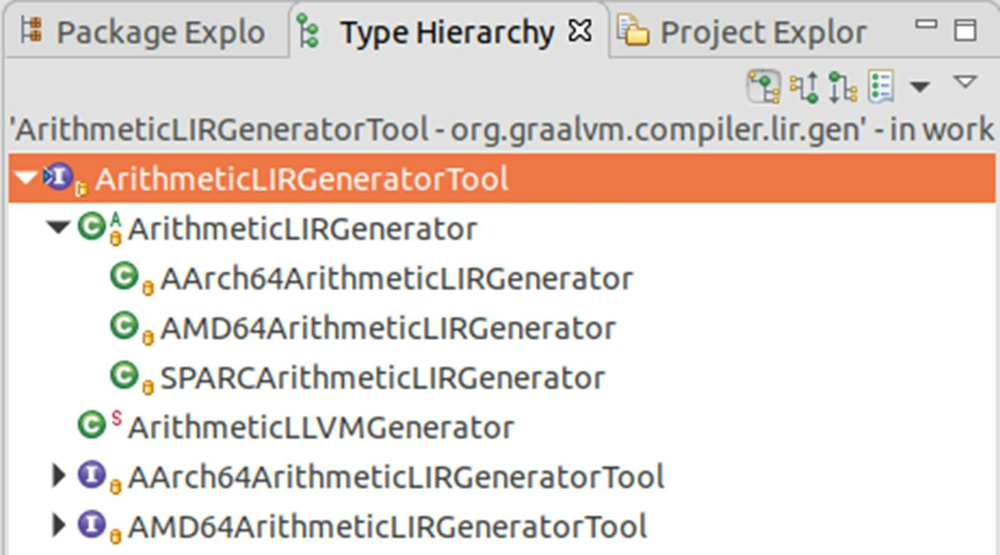

图11-21　Graal支持的目标平台生成器

为了验证代码阅读的成果，现在我们来对AddNode的代码生成做一些小改动，将原本生成加法汇编指令修改为生成减法汇编指令，即按如下方式修改AddNode::generate()方法：

```java
class AddNode {
    void generate(...) {
        ... gen.emitSub(op1, op2, false) ...  // 原来这个方法是emitAdd()
    }
}
```

然后在虚拟机运行参数中加上-XX:+PrintAssembly参数，因为从低级中间表示到真正机器码的转换是由HotSpot统一负责的，所以11.2节中用到的HSDIS插件仍然能发挥作用，帮助我们输出汇编代码。从输出的汇编中可以看到，在没有修改之前，AddNode节点输出的汇编代码如下所示：

```cpp
0x000000010f71cda0: nopl   0x0(%rax,%rax,1)
0x000000010f71cda5: add    %edx,%esi     ;*iadd {reexecute=0 rethrow=0 return_oop=0}
                                         ; - Demo::workload@2 (line 10)
0x000000010f71cda7: mov    %esi,%eax     ;*ireturn {reexecute=0 rethrow=0 return_oop=0}
                                         ; - Demo::workload@3 (line 10)
0x000000010f71cda9: test   %eax,-0xcba8da9(%rip)        # 0x0000000102b74006
                                         ;   {poll_return}
0x000000010f71cdaf: vzeroupper
0x000000010f71cdb2: retq
```

而被我们修改后，编译的结果已经变为：

```cpp
0x0000000107f451a0: nopl   0x0(%rax,%rax,1)
0x0000000107f451a5: sub    %edx,%esi          ;*iadd {reexecute=0 rethrow=0 return_oop=0}
                                              ; - Demo::workload@2 (line 10)
0x0000000107f451a7: mov    %esi,%eax          ;*ireturn {reexecute=0 rethrow=0 return_oop=0}
                                              ; - Demo::workload@3 (line 10)
0x0000000107f451a9: test   %eax,-0x1db81a9(%rip)        # 0x000000010618d006
                                              ;   {poll_return}
0x0000000107f451af: vzeroupper
0x0000000107f451b2: retq
```

我们的修改确实促使Graal编译器产生了不同的汇编代码，这也印证了我们代码分析的思路是正确的。写到这里，笔者忍不住感慨，Graal编译器的出现对学习和研究虚拟机代码编译技术实在有着不可估量的价值。在本书第2版编写时，只有C++编写的复杂无比的服务端编译器，要进行类似的实战是非常困难的，即使勉强写出来，也会因为过度烦琐而失去阅读价值。

### 11.6　本章小结

在本章中，我们学习了与提前编译和即时编译器两大后端编译器相关的知识，了解了提前编译器重新兴起的原因及其优劣势；还有与即时编译器相关的热点探测方法、编译触发条件及如何从虚拟机外部观察和分析即时编译的数据和结果；还选择了几种常见的编译器优化技术进行讲解，对Java编译器的深入了解，有助于在工作中分辨哪些代码是编译器可以帮我们处理的，哪些代码需要自己调节以便更适合编译器的优化。
