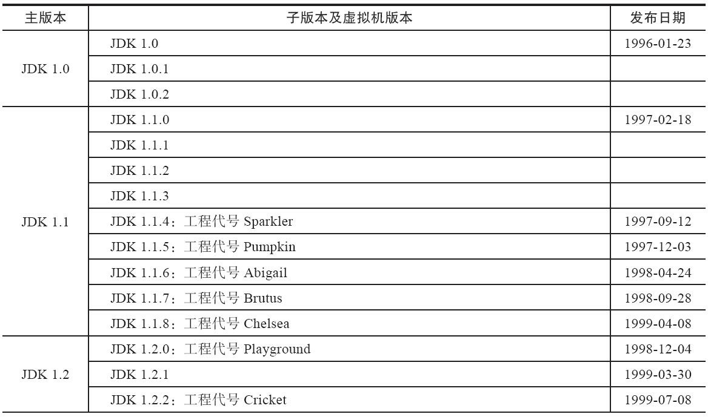
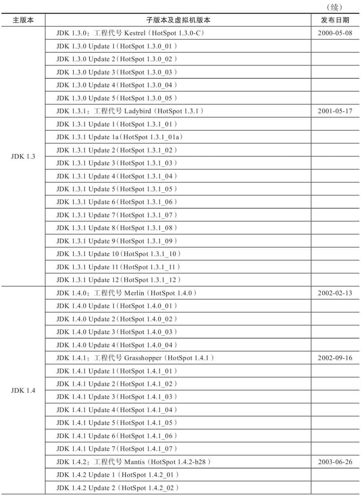
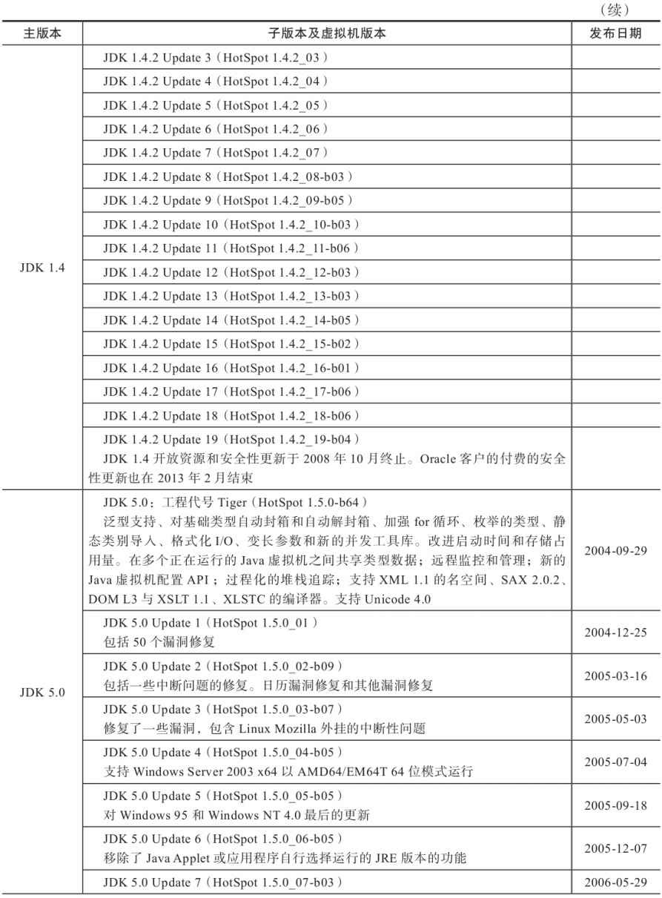
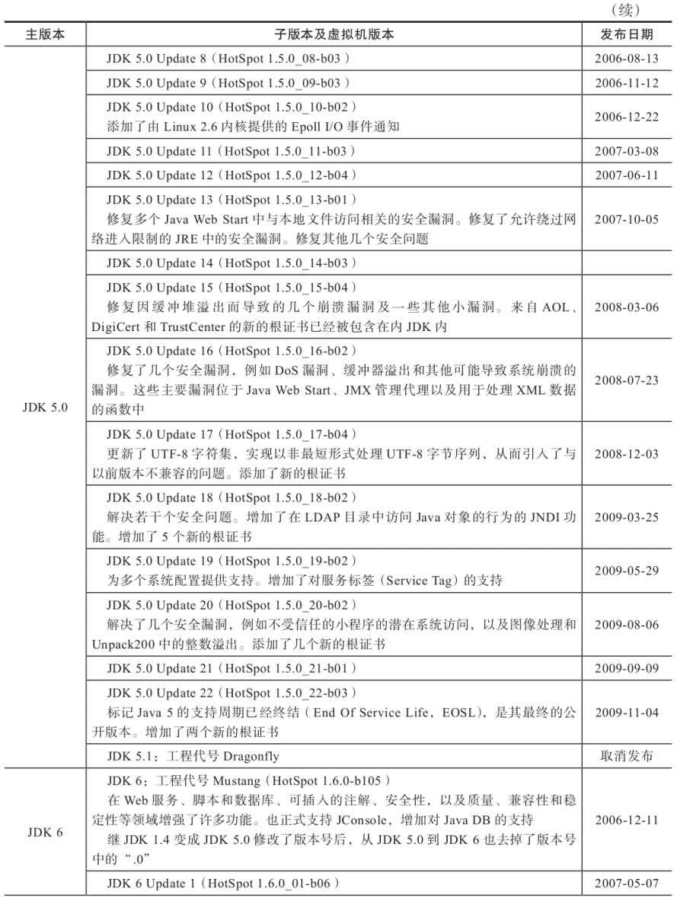
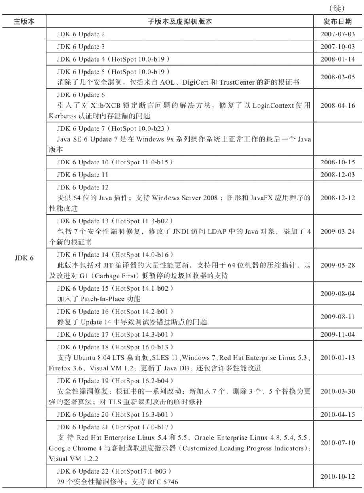
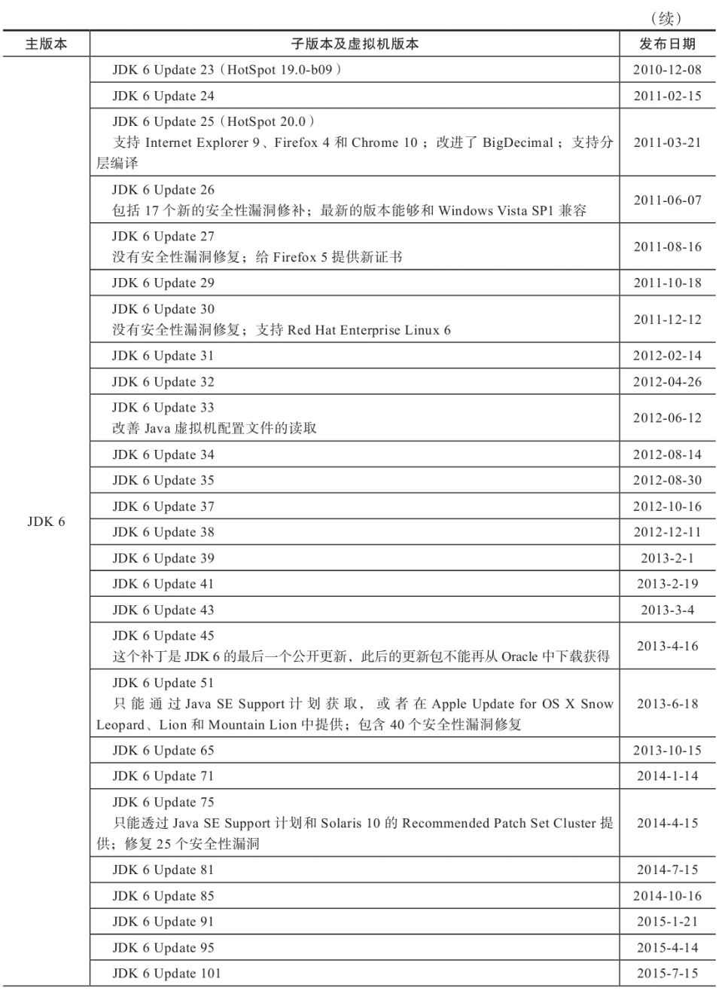
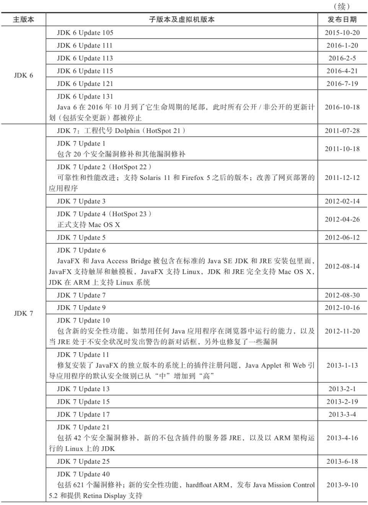
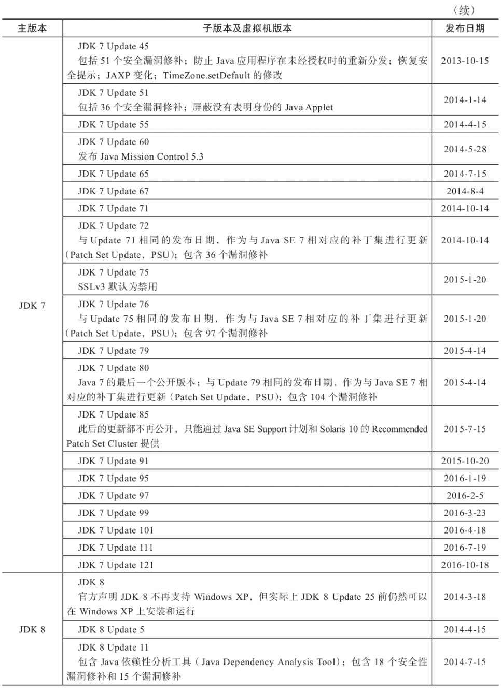
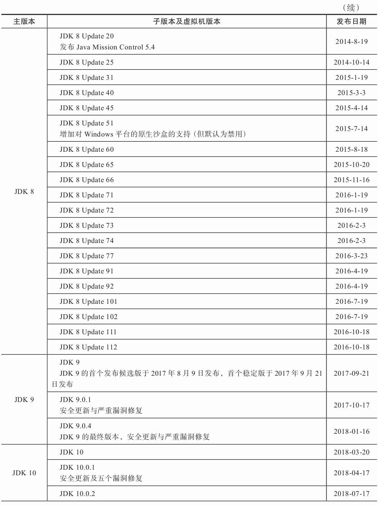
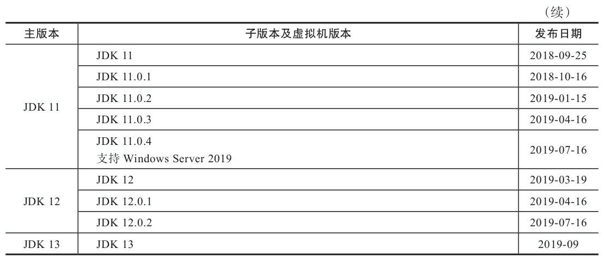

## 附录E　JDK历史版本轨迹

本附录列出了从Java诞生开始直到2019年9月发布的JDK 13为止的Java全部更新版本、发布日期和关键的更新内容。其中提及的绝大部分的JDK历史版本（JDK 1.1.6之后的版本），以及JDK所附带的各种工具的历史版本，都可以从Oracle公司的归档网站[1]上下载到。

[1] 下载页面地址：http://www.oracle.com/technetwork/java/archive-139210.html
